# Attachments Component

<cite>
**Files Referenced in This Document**
- [Index.svelte](file://frontend/antdx/attachments/Index.svelte)
- [attachments.tsx](file://frontend/antdx/attachments/attachments.tsx)
- [__init__.py](file://backend/modelscope_studio/components/antdx/attachments/__init__.py)
- [README-zh_CN.md](file://docs/components/antdx/attachments/README-zh_CN.md)
- [basic.py](file://docs/components/antdx/attachments/demos/basic.py)
- [combination.py](file://docs/components/antdx/attachments/demos/combination.py)
- [file_card.py](file://docs/components/antdx/attachments/demos/file_card.py)
- [multimodal-input.tsx](file://frontend/pro/multimodal-input/multimodal-input.tsx)
- [upload.ts](file://frontend/utils/upload.ts)
- [file-card.tsx](file://frontend/antdx/file-card/file-card.tsx)
- [base.tsx](file://frontend/antdx/file-card/base.tsx)
- [app.py](file://docs/components/antdx/attachments/app.py)
- [package.json](file://frontend/antdx/attachments/package.json)
</cite>

## Table of Contents

1. [Introduction](#introduction)
2. [Project Structure](#project-structure)
3. [Core Components](#core-components)
4. [Architecture Overview](#architecture-overview)
5. [Detailed Component Analysis](#detailed-component-analysis)
6. [Dependency Analysis](#dependency-analysis)
7. [Performance Considerations](#performance-considerations)
8. [Troubleshooting Guide](#troubleshooting-guide)
9. [Conclusion](#conclusion)
10. [Appendix](#appendix)

## Introduction

The Attachments component is a powerful file management and upload solution provided by ModelScope Studio. Built on top of Ant Design X's Attachments component, it provides complete file upload, preview, management, and deletion capabilities.

### Key Features

- **Multi-format Support**: Supports uploading and previewing of multiple file types including images, documents, audio, and video
- **Drag and Drop Upload**: Provides an intuitive drag-and-drop file upload experience
- **Batch Management**: Supports simultaneous upload and management of multiple files
- **Real-time Preview**: Built-in file preview functionality with thumbnail and full-content viewing
- **Flexible Configuration**: Rich configuration options and customization capabilities
- **Responsive Design**: Adapts to various screen sizes and devices

## Project Structure

The Attachments component adopts a frontend-backend separation architecture, primarily consisting of the following parts:

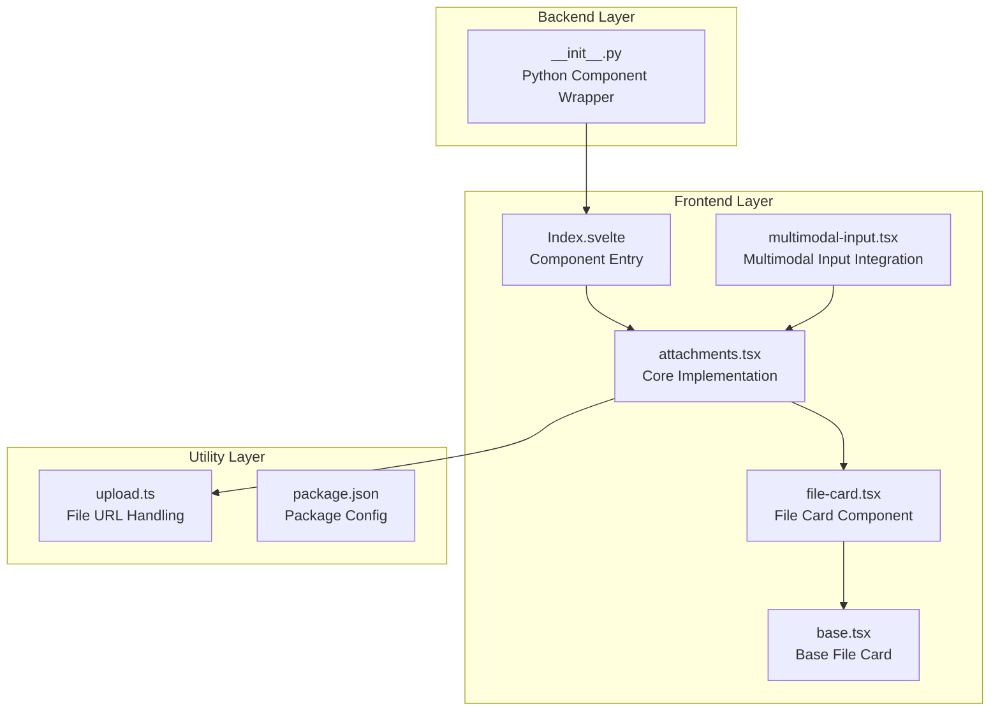

**Diagram Sources**

- [Index.svelte:1-98](file://frontend/antdx/attachments/Index.svelte#L1-L98)
- [attachments.tsx:1-413](file://frontend/antdx/attachments/attachments.tsx#L1-L413)
- [**init**.py:21-64](file://backend/modelscope_studio/components/antdx/attachments/__init__.py#L21-L64)

**Section Sources**

- [Index.svelte:1-98](file://frontend/antdx/attachments/Index.svelte#L1-L98)
- [attachments.tsx:1-413](file://frontend/antdx/attachments/attachments.tsx#L1-L413)
- [**init**.py:21-64](file://backend/modelscope_studio/components/antdx/attachments/__init__.py#L21-L64)

## Core Components

### Component Architecture

The Attachments component uses a layered architecture design ensuring good maintainability and extensibility:

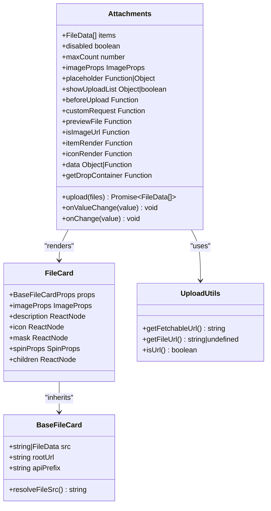

**Diagram Sources**

- [attachments.tsx:36-83](file://frontend/antdx/attachments/attachments.tsx#L36-L83)
- [file-card.tsx:17-34](file://frontend/antdx/file-card/file-card.tsx#L17-L34)
- [base.tsx:9-13](file://frontend/antdx/file-card/base.tsx#L9-L13)
- [upload.ts:12-44](file://frontend/utils/upload.ts#L12-L44)

### Data Flow Processing

The component internally implements a complex data flow processing mechanism:

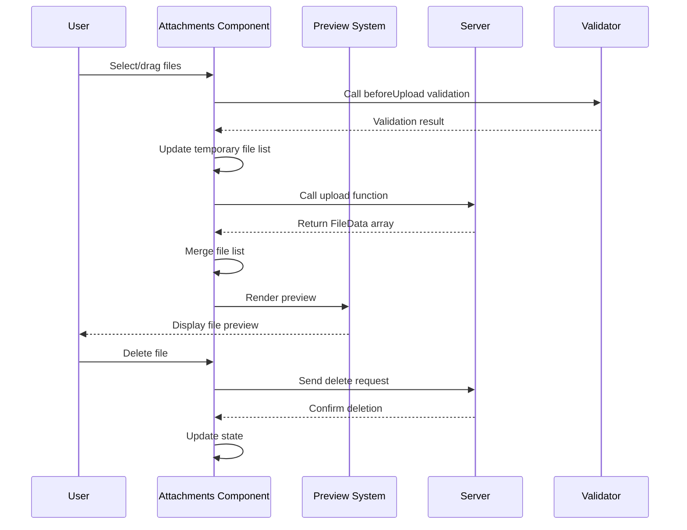

**Diagram Sources**

- [attachments.tsx:275-354](file://frontend/antdx/attachments/attachments.tsx#L275-L354)

**Section Sources**

- [attachments.tsx:1-413](file://frontend/antdx/attachments/attachments.tsx#L1-L413)
- [file-card.tsx:1-127](file://frontend/antdx/file-card/file-card.tsx#L1-L127)
- [base.tsx:1-44](file://frontend/antdx/file-card/base.tsx#L1-L44)

## Architecture Overview

### Overall Architecture Design

The Attachments component uses a modern frontend architecture pattern combining the advantages of React and Svelte:

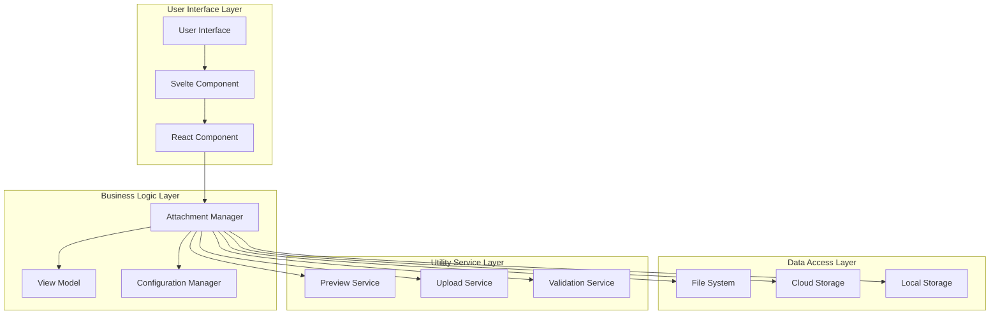

**Diagram Sources**

- [Index.svelte:1-98](file://frontend/antdx/attachments/Index.svelte#L1-L98)
- [attachments.tsx:1-413](file://frontend/antdx/attachments/attachments.tsx#L1-L413)

### Component Lifecycle

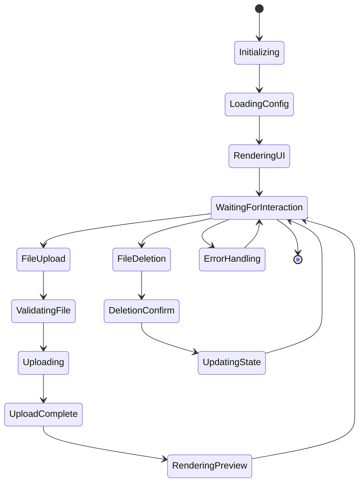

**Diagram Sources**

- [attachments.tsx:132-354](file://frontend/antdx/attachments/attachments.tsx#L132-L354)

## Detailed Component Analysis

### Core Functionality Implementation

#### File Upload Mechanism

The component implements a complete file upload flow supporting multiple upload strategies:

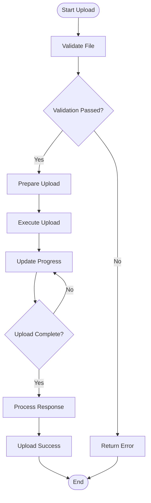

**Diagram Sources**

- [attachments.tsx:292-354](file://frontend/antdx/attachments/attachments.tsx#L292-L354)

#### File Preview System

The component integrates powerful file preview functionality supporting visualization of multiple file types:

| File Type | Preview Support         | Special Features             |
| --------- | ----------------------- | ---------------------------- |
| Image     | ✅ Full Preview         | Zoom, rotate, download       |
| Document  | ✅ Thumbnail Preview    | Online view, download        |
| PDF       | ✅ Page-by-page Preview | Navigation, search           |
| Audio     | ✅ Player               | Playback control, volume     |
| Video     | ✅ Player               | Playback control, fullscreen |
| Archive   | ✅ Thumbnail            | Extract preview              |

#### Batch Management Features

The component provides efficient batch file management capabilities:

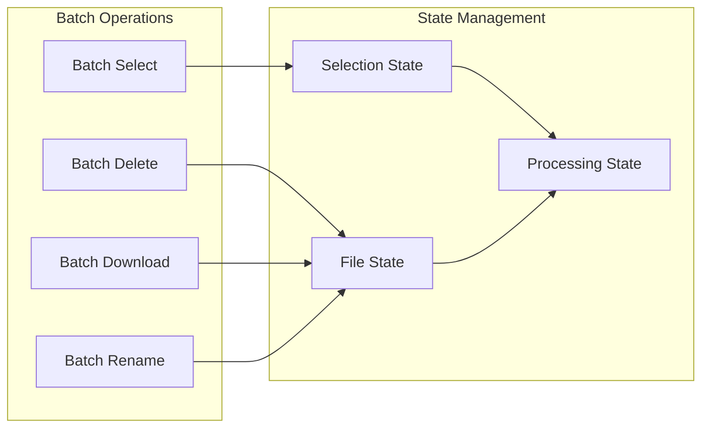

**Diagram Sources**

- [attachments.tsx:304-342](file://frontend/antdx/attachments/attachments.tsx#L304-L342)

**Section Sources**

- [attachments.tsx:275-409](file://frontend/antdx/attachments/attachments.tsx#L275-L409)

### Configuration Options

#### Basic Configuration

| Option           | Type              | Default  | Description                             |
| ---------------- | ----------------- | -------- | --------------------------------------- |
| `disabled`       | boolean           | false    | Whether to disable upload functionality |
| `maxCount`       | number            | Infinity | Maximum number of files                 |
| `multiple`       | boolean           | true     | Whether to support multi-file upload    |
| `accept`         | string            | \*       | Accepted file types                     |
| `showUploadList` | boolean \| object | true     | Whether to show the upload list         |

#### Advanced Configuration

| Option          | Type     | Default | Description                       |
| --------------- | -------- | ------- | --------------------------------- |
| `beforeUpload`  | Function | -       | Validation function before upload |
| `customRequest` | Function | -       | Custom upload request             |
| `previewFile`   | Function | -       | Custom file preview               |
| `isImageUrl`    | Function | -       | Determine if it is an image URL   |
| `itemRender`    | Function | -       | Custom file item rendering        |
| `iconRender`    | Function | -       | Custom icon rendering             |

#### Preview Configuration

| Option                             | Type      | Default | Description              |
| ---------------------------------- | --------- | ------- | ------------------------ |
| `imageProps.preview.mask`          | ReactNode | -       | Preview mask layer       |
| `imageProps.preview.closeIcon`     | ReactNode | -       | Close button icon        |
| `imageProps.preview.toolbarRender` | Function  | -       | Custom toolbar rendering |
| `imageProps.preview.imageRender`   | Function  | -       | Custom image rendering   |

**Section Sources**

- [attachments.tsx:36-83](file://frontend/antdx/attachments/attachments.tsx#L36-L83)

### Event Callback Mechanism

The component provides a rich event callback interface:

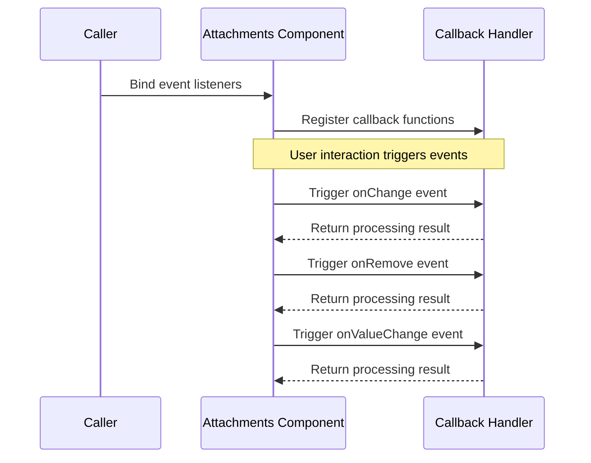

**Diagram Sources**

- [**init**.py:27-43](file://backend/modelscope_studio/components/antdx/attachments/__init__.py#L27-L43)

#### Event Types

| Event Name | Trigger Timing     | Parameters | Description                                    |
| ---------- | ------------------ | ---------- | ---------------------------------------------- |
| `change`   | File state changes | FileData[] | Triggered when the file list changes           |
| `remove`   | File deleted       | FileData   | Triggered when a file is deleted               |
| `preview`  | File preview       | FileData   | Triggered when a file starts previewing        |
| `download` | File download      | FileData   | Triggered when a file starts downloading       |
| `drop`     | File dragged       | FileData[] | Triggered when files are dragged into the area |

**Section Sources**

- [**init**.py:27-43](file://backend/modelscope_studio/components/antdx/attachments/__init__.py#L27-L43)

### Error Handling Mechanism

The component implements a comprehensive error handling system:

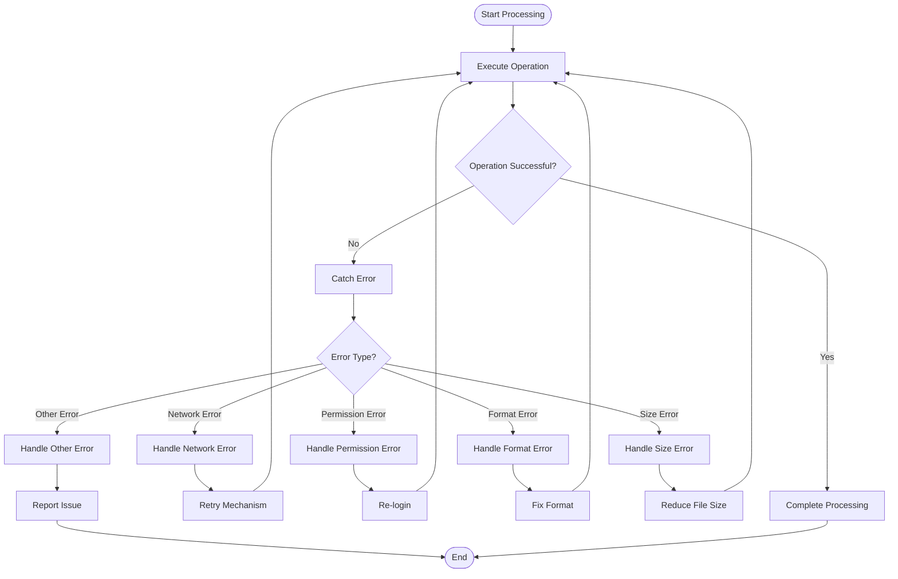

**Diagram Sources**

- [attachments.tsx:350-354](file://frontend/antdx/attachments/attachments.tsx#L350-L354)

**Section Sources**

- [attachments.tsx:350-354](file://frontend/antdx/attachments/attachments.tsx#L350-L354)

## Dependency Analysis

### External Dependencies

The component depends on several key external libraries:

```mermaid
graph TB
subgraph "Core Dependencies"
AX[@ant-design/x<br/>Ant Design X Component Library]
ANTD[antd<br/>Ant Design Component Library]
GRADIO[@gradio/client<br/>Gradio Client]
REACT[react<br/>React Framework]
end
subgraph "Utility Libraries"
Lodash[lodash-es<br/>Utility Functions]
Classnames[classnames<br/>Class Name Handling]
SveltePreprocess[svelte-preprocess-react<br/>Svelte Preprocessing]
end
subgraph "Component Dependencies"
FileCard[FileCard Component]
Utils[Utility Functions]
Hooks[React Hooks]
end
Attachments --> AX
Attachments --> ANTD
Attachments --> GRADIO
Attachments --> REACT
Attachments --> Lodash
Attachments --> Classnames
Attachments --> SveltePreprocess
Attachments --> FileCard
Attachments --> Utils
Attachments --> Hooks
```

**Diagram Sources**

- [attachments.tsx:1-17](file://frontend/antdx/attachments/attachments.tsx#L1-L17)
- [package.json:1-15](file://frontend/antdx/attachments/package.json#L1-L15)

### Internal Module Dependencies

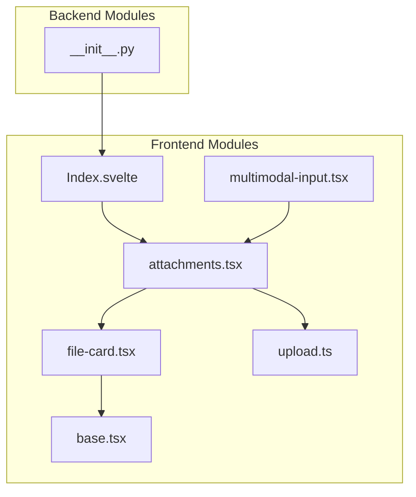

**Diagram Sources**

- [Index.svelte:1-98](file://frontend/antdx/attachments/Index.svelte#L1-L98)
- [attachments.tsx:1-413](file://frontend/antdx/attachments/attachments.tsx#L1-L413)

**Section Sources**

- [package.json:1-15](file://frontend/antdx/attachments/package.json#L1-L15)
- [Index.svelte:1-98](file://frontend/antdx/attachments/Index.svelte#L1-L98)

## Performance Considerations

### Upload Performance Optimization

The component was designed with performance optimization in mind:

- **Concurrent Upload Control**: Limit the number of simultaneously uploading files via `maxCount`
- **Progress Display**: Display upload progress in real time to improve user experience
- **Memory Management**: Clean up temporary file data promptly to avoid memory leaks
- **Caching Strategy**: Cache already-uploaded files to reduce redundant uploads

### Preview Performance Optimization

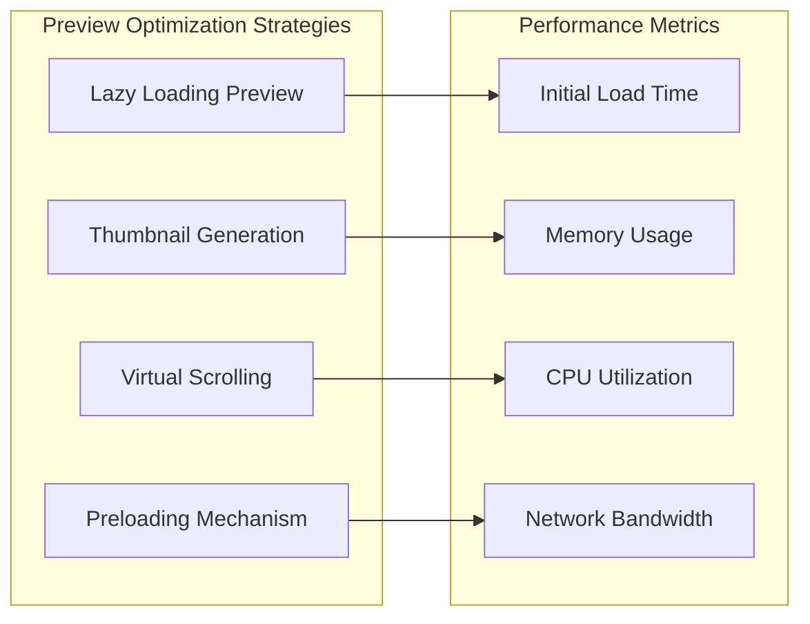

### Memory Management

The component implements intelligent memory management:

- **File Object Reuse**: Reuse existing file objects to avoid redundant creation
- **Garbage Collection**: Release file data that is no longer in use in a timely manner
- **State Synchronization**: Maintain consistency between local state and server state

## Troubleshooting Guide

### Common Issues and Solutions

#### Upload Failure

**Problem Description**: Error occurs during file upload

**Possible Causes**:

- Unstable network connection
- Unsupported file format
- File size exceeds limit
- Insufficient permissions

**Solutions**:

1. Check network connection status
2. Verify file format is in the `accept` list
3. Confirm file size does not exceed `maxSize` limit
4. Check user permission settings

#### Preview Failure

**Problem Description**: File cannot be previewed normally

**Possible Causes**:

- Browser compatibility issues
- File corruption
- URL parsing error

**Solutions**:

1. Try opening in a different browser
2. Re-upload the file
3. Check file integrity
4. Verify URL format is correct

#### Performance Issues

**Problem Description**: Component runs slowly or stutters

**Possible Causes**:

- Too many files
- Files are too large
- Insufficient memory

**Solutions**:

1. Reduce the number of simultaneously uploading files
2. Optimize file sizes
3. Increase system memory
4. Use `maxCount` to limit the number of files

**Section Sources**

- [attachments.tsx:350-354](file://frontend/antdx/attachments/attachments.tsx#L350-L354)

### Debugging Tips

#### Enable Debug Mode

```javascript
// Enable detailed logging in development environment
const attachments = new Attachments({
  debug: true,
  // other configs...
});
```

#### Monitor Upload Progress

```javascript
attachments.on('upload-progress', (progress) => {
  console.log(`Upload progress: ${progress}%`);
});
```

## Conclusion

The Attachments component is a fully functional, high-performance file management solution. It not only provides basic file upload and preview capabilities, but also features advanced batch management, custom configuration, and error handling.

### Key Advantages

1. **Comprehensive Features**: Covers all core needs for file upload, preview, and management
2. **Easy to Use**: Clean API design for quick integration
3. **Highly Customizable**: Rich configuration options to meet various use cases
4. **Excellent Performance**: Optimized algorithms and architecture ensure a smooth user experience
5. **Stable and Reliable**: Comprehensive error handling and exception recovery mechanisms

### Applicable Scenarios

- Online document management systems
- File transfer in instant messaging applications
- Media management on content creation platforms
- File sharing on enterprise collaboration platforms
- Assignment submission systems on educational platforms

## Appendix

### API Reference

#### Props

| Property         | Type              | Required | Default  | Description                                              |
| ---------------- | ----------------- | -------- | -------- | -------------------------------------------------------- |
| `items`          | FileData[]        | Yes      | []       | Current file list                                        |
| `upload`         | Function          | Yes      | -        | Upload function, accepts RcFile[] and returns FileData[] |
| `onValueChange`  | Function          | No       | -        | Value change callback                                    |
| `onChange`       | Function          | No       | -        | String path change callback                              |
| `disabled`       | boolean           | No       | false    | Whether to disable                                       |
| `maxCount`       | number            | No       | Infinity | Maximum number of files                                  |
| `accept`         | string            | No       | \*       | Accepted file types                                      |
| `multiple`       | boolean           | No       | true     | Whether multi-select is supported                        |
| `showUploadList` | boolean \| object | No       | true     | Whether to show the upload list                          |
| `imageProps`     | ImageProps        | No       | -        | Image preview configuration                              |

#### Events

| Event Name | Parameters | Description           |
| ---------- | ---------- | --------------------- |
| `change`   | FileData[] | File list changed     |
| `remove`   | FileData   | File deleted          |
| `preview`  | FileData   | File preview started  |
| `download` | FileData   | File download started |
| `drop`     | FileData[] | File dragged          |

#### Slots

| Slot Name                          | Parameters               | Description                |
| ---------------------------------- | ------------------------ | -------------------------- |
| `placeholder`                      | type: 'drop' \| 'inline' | Placeholder content        |
| `placeholder.title`                | type                     | Title content              |
| `placeholder.description`          | type                     | Description content        |
| `placeholder.icon`                 | type                     | Icon content               |
| `iconRender`                       | file, fileList           | Custom icon rendering      |
| `itemRender`                       | file, fileList           | Custom file item rendering |
| `showUploadList.previewIcon`       | file, fileList           | Preview icon               |
| `showUploadList.removeIcon`        | file, fileList           | Delete icon                |
| `showUploadList.downloadIcon`      | file, fileList           | Download icon              |
| `showUploadList.extra`             | file, fileList           | Extra actions              |
| `imageProps.placeholder`           | file, fileList           | Image placeholder          |
| `imageProps.preview.mask`          | file, fileList           | Preview mask               |
| `imageProps.preview.closeIcon`     | file, fileList           | Close icon                 |
| `imageProps.preview.toolbarRender` | file, fileList           | Toolbar rendering          |
| `imageProps.preview.imageRender`   | file, fileList           | Image rendering            |

### Best Practices

#### Performance Optimization Recommendations

1. **Set `maxCount` Appropriately**: Set a suitable maximum file count based on the application scenario
2. **Use Lazy Loading**: For large numbers of files, consider pagination or virtual scrolling
3. **Optimize File Sizes**: Compress images and video files before upload
4. **Caching Strategy**: Establish a caching mechanism for frequently used files

#### Security Considerations

1. **File Type Validation**: Also perform file type checking on the server side
2. **Size Limits**: Set reasonable file size upper limits
3. **Virus Scanning**: Perform security scanning on uploaded files
4. **Permission Control**: Ensure only authorized users can access files

#### User Experience Optimization

1. **Progress Feedback**: Provide clear upload progress indicators
2. **Error Messages**: Friendly error messages and solutions
3. **Batch Operations**: Support batch selection and operations
4. **Responsive Design**: Adapt to various devices and screen sizes

**Section Sources**

- [README-zh_CN.md:1-10](file://docs/components/antdx/attachments/README-zh_CN.md#L1-L10)
- [basic.py:1-51](file://docs/components/antdx/attachments/demos/basic.py#L1-L51)
- [combination.py:1-75](file://docs/components/antdx/attachments/demos/combination.py#L1-L75)
- [file_card.py:1-72](file://docs/components/antdx/attachments/demos/file_card.py#L1-L72)
