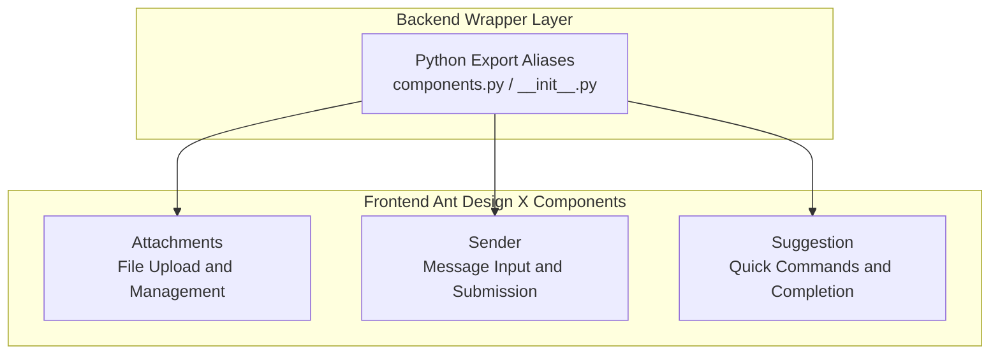
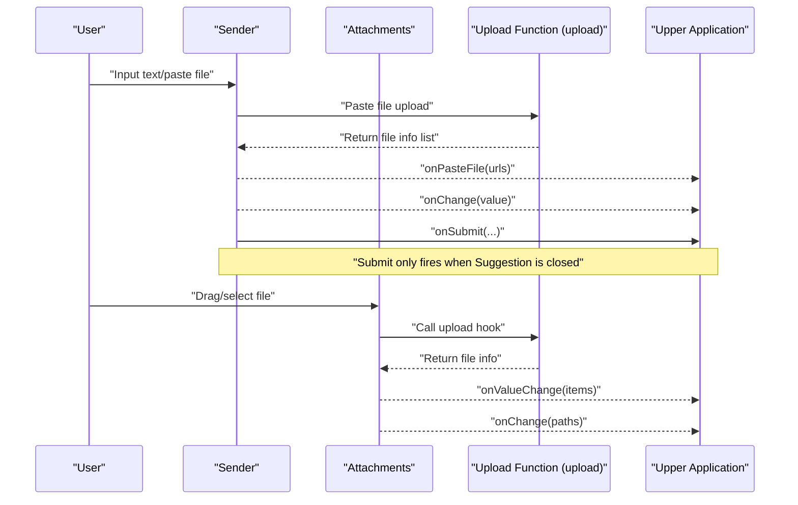
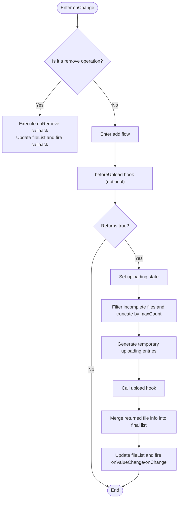
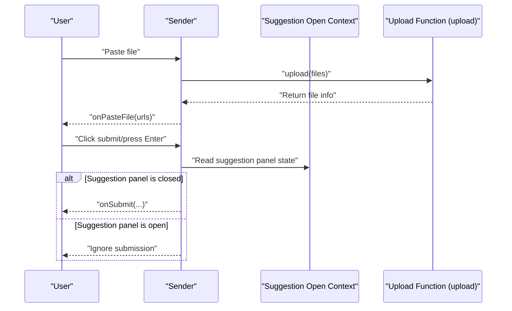
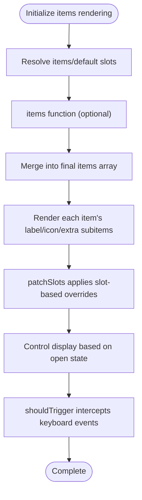
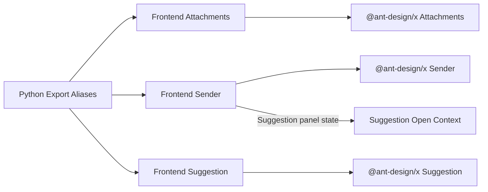

# Expression Components

<cite>
**Files Referenced in This Document**
- [frontend/antdx/attachments/attachments.tsx](file://frontend/antdx/attachments/attachments.tsx)
- [frontend/antdx/sender/sender.tsx](file://frontend/antdx/sender/sender.tsx)
- [frontend/antdx/suggestion/suggestion.tsx](file://frontend/antdx/suggestion/suggestion.tsx)
- [backend/modelscope_studio/components/antdx/components.py](file://backend/modelscope_studio/components/antdx/components.py)
- [backend/modelscope_studio/components/antdx/__init__.py](file://backend/modelscope_studio/components/antdx/__init__.py)
</cite>

## Table of Contents

1. [Introduction](#introduction)
2. [Project Structure](#project-structure)
3. [Core Components](#core-components)
4. [Architecture Overview](#architecture-overview)
5. [Component Details](#component-details)
6. [Dependency Analysis](#dependency-analysis)
7. [Performance and Usability Recommendations](#performance-and-usability-recommendations)
8. [Troubleshooting Guide](#troubleshooting-guide)
9. [Conclusion](#conclusion)
10. [Appendix: Usage Examples and Best Practices](#appendix-usage-examples-and-best-practices)

## Introduction

This document covers the Ant Design X Expression Components, focusing on three main components:

- Attachments: Responsible for file upload, preview, list management, and placeholder rendering
- Sender: Responsible for message input, paste-to-upload, submission, and input state synchronization
- Suggestion: Responsible for command completion, trigger strategies, context forwarding, and popup container configuration

The documentation provides a complete explanation from system architecture, data flow, processing logic, and inter-component collaboration mechanisms to usage examples and troubleshooting recommendations, helping developers quickly understand and correctly integrate these components.

## Project Structure

The frontend components of Ant Design X are located under frontend/antdx and are organized in a modular fashion. The backend Python wrapper layer exports unified aliases in backend/modelscope_studio/components/antdx, making them directly accessible in the Python ecosystem.

Diagram Sources

- [backend/modelscope_studio/components/antdx/components.py:7-32](file://backend/modelscope_studio/components/antdx/components.py#L7-L32)
- [backend/modelscope_studio/components/antdx/**init**.py:7-41](file://backend/modelscope_studio/components/antdx/__init__.py#L7-L41)

Section Sources

- [backend/modelscope_studio/components/antdx/components.py:1-40](file://backend/modelscope_studio/components/antdx/components.py#L1-L40)
- [backend/modelscope_studio/components/antdx/**init**.py:1-42](file://backend/modelscope_studio/components/antdx/__init__.py#L1-L42)

## Core Components

- Attachments
  - Responsibility: Encapsulates @ant-design/x Attachments, providing upload hooks, placeholder rendering, enhanced image preview, custom icons, max count control, remove callback, and value change notifications
  - Key Capabilities: Pre-upload validation, concurrent upload state, file list deduplication and merging, error fallback
- Sender
  - Responsibility: Encapsulates @ant-design/x Sender, providing two-way value binding, paste-file-upload, skill panel (skill) slot-based configuration, and submit events that only fire when the suggestion panel is closed
  - Key Capabilities: Input change synchronization, paste file upload, slot-based header/footer/prefix/suffix, skill hints and closable configuration
- Suggestion
  - Responsibility: Encapsulates @ant-design/x Suggestion, supporting dynamic items rendering, slot-based label/icon/extra areas, popup container customization, and controlled/uncontrolled open state switching
  - Key Capabilities: Trigger strategy hooks, context forwarding, keyboard event interception and forwarding, popup container positioning

Section Sources

- [frontend/antdx/attachments/attachments.tsx:36-410](file://frontend/antdx/attachments/attachments.tsx#L36-L410)
- [frontend/antdx/sender/sender.tsx:18-171](file://frontend/antdx/sender/sender.tsx#L18-L171)
- [frontend/antdx/suggestion/suggestion.tsx:64-162](file://frontend/antdx/suggestion/suggestion.tsx#L64-L162)

## Architecture Overview

The three work together: the user types text in Sender and pastes files; Sender hands the files to the upload function to generate persistable file information, which is then passed back via callback to the upper layer. Meanwhile, Suggestion provides command completion; only when it is closed does Sender actually submit the content, preventing accidental submission.

Diagram Sources

- [frontend/antdx/sender/sender.tsx:135-138](file://frontend/antdx/sender/sender.tsx#L135-L138)
- [frontend/antdx/attachments/attachments.tsx:329-348](file://frontend/antdx/attachments/attachments.tsx#L329-L348)
- [frontend/antdx/suggestion/suggestion.tsx:135-140](file://frontend/antdx/suggestion/suggestion.tsx#L135-L140)

## Component Details

### Attachments Component

- Key Features
  - File Upload: Accepts arrays of native file objects via the upload hook, returns file info arrays; supports maxCount to control single/multi-file mode
  - Preview Enhancement: imageProps.preview supports mask, closeIcon, toolbarRender, imageRender with slot-based and function-based configuration
  - List Management: Automatic deduplication (based on uid/url/path), status marking (done/uploading), remove callback, and value change notifications
  - Placeholder Rendering: placeholder supports slot-based and function-based title/description/icon
  - Interaction Protection: Disables interactions during upload to prevent re-submission
- Data Flow and Key Paths
  - Change Handling: The onChange handler distinguishes between add/remove branches; for additions, it first injects a temporary "uploading" state, then calls upload, and finally merges results and fires callbacks
  - Image Preview: Highly customizable via getContainer, toolbarRender, imageRender, etc. in imageProps.preview
  - Display List: Icons and extras in showUploadList support slot-based and function-based overrides
- Error Handling
  - Captures upload exceptions and restores upload state to prevent UI freeze
- Complexity and Performance
  - Deduplication and state merging are O(n), suitable for medium-scale file lists
  - Slot-based rendering computes on demand, avoiding unnecessary re-renders

Diagram Sources

- [frontend/antdx/attachments/attachments.tsx:275-354](file://frontend/antdx/attachments/attachments.tsx#L275-L354)

Section Sources

- [frontend/antdx/attachments/attachments.tsx:36-410](file://frontend/antdx/attachments/attachments.tsx#L36-L410)

### Sender Component

- Key Features
  - Input Binding: Two-way synchronization of value and onChange, supports external controlled mode
  - Paste Upload: onPasteFile hands pasted file collections to the upload hook and passes back file path arrays
  - Skill Panel: skill.title/toolTip/closable supports slot-based and function-based configuration
  - Submit Control: onSubmit is only triggered when Suggestion is closed, preventing accidental submission when the suggestion panel is open
  - Slot-based Layout: header/footer/prefix/suffix support ReactSlot injection
- Key Interactions
  - Uses useSuggestionOpenContext to get the suggestion panel open/close state, determining whether to allow submission
  - formatResult/customRender in slotConfig are wrapped as functions via createFunction
- Error Handling
  - Paste upload failure does not affect the input box state, only logs are recorded
- Performance and Complexity
  - Value changes and slot rendering are both lightweight, suitable for high-frequency input scenarios

Diagram Sources

- [frontend/antdx/sender/sender.tsx:126-130](file://frontend/antdx/sender/sender.tsx#L126-L130)
- [frontend/antdx/sender/sender.tsx:135-138](file://frontend/antdx/sender/sender.tsx#L135-L138)

Section Sources

- [frontend/antdx/sender/sender.tsx:18-171](file://frontend/antdx/sender/sender.tsx#L18-L171)

### Suggestion Component

- Key Features
  - Dynamic items: Supports two sources — an items function or slot-based items/default; slot items take priority
  - Slot-based Rendering: label/icon/extra/children support ReactSlot injection and patchSlots processing
  - Trigger Strategy: The shouldTrigger hook can intercept keyboard events to implement custom trigger conditions
  - Popup Container: getPopupContainer supports function-based and slot-based configuration for positioning in complex layouts
  - State Control: open can be controlled (internally self-managed when undefined); onOpenChange forwards the underlying state
- Context and Events
  - Passes the current active item and keyboard event handling to the child tree via SuggestionContext and SuggestionOpenContext
  - In the children render function, the real children are hidden and only shown when a slot exists
- Performance and Complexity
  - items rendering is computed on demand; slot-based patch only applies to necessary fields

Diagram Sources

- [frontend/antdx/suggestion/suggestion.tsx:89-121](file://frontend/antdx/suggestion/suggestion.tsx#L89-L121)
- [frontend/antdx/suggestion/suggestion.tsx:135-140](file://frontend/antdx/suggestion/suggestion.tsx#L135-L140)

Section Sources

- [frontend/antdx/suggestion/suggestion.tsx:64-162](file://frontend/antdx/suggestion/suggestion.tsx#L64-L162)

## Dependency Analysis

- Backend Exports
  - components.py and **init**.py uniformly export AntdXAttachments/AntdXSender/AntdXSuggestion and other components as Attachments/Sender/Suggestion for direct use on the Python side
- Frontend Encapsulation
  - All three components bridge @ant-design/x native components via sveltify to React components supporting slots and function-based configuration
  - Uses utility hooks such as useFunction/useValueChange/useTargets to achieve parameter functionalization and value synchronization
- Inter-component Coupling
  - Sender and Suggestion are loosely coupled via context: Sender only submits when Suggestion is closed, avoiding interaction conflicts
  - Attachments and Sender are decoupled via the upload callback: upload logic is provided by the upper layer; components only handle UI and state

Diagram Sources

- [backend/modelscope_studio/components/antdx/components.py:7-32](file://backend/modelscope_studio/components/antdx/components.py#L7-L32)
- [backend/modelscope_studio/components/antdx/**init**.py:7-41](file://backend/modelscope_studio/components/antdx/__init__.py#L7-L41)
- [frontend/antdx/sender/sender.tsx:72-72](file://frontend/antdx/sender/sender.tsx#L72-L72)

Section Sources

- [backend/modelscope_studio/components/antdx/components.py:1-40](file://backend/modelscope_studio/components/antdx/components.py#L1-L40)
- [backend/modelscope_studio/components/antdx/**init**.py:1-42](file://backend/modelscope_studio/components/antdx/__init__.py#L1-L42)

## Performance and Usability Recommendations

- Attachments Upload
  - Set maxCount appropriately to avoid memory pressure from uploading too many files at once
  - Perform format/size validation in beforeUpload to reduce invalid requests
  - Use imageProps.preview's getContainer to mount the preview overlay to the appropriate container, avoiding scroll penetration
- Sender
  - Use throttle/debounce strategies for high-frequency input (can be implemented in the upper layer) to reduce onChange frequency
  - In multi-slot scenarios, reuse function-based configurations as much as possible to reduce slot rendering overhead
- Suggestion
  - Keep the items rendering structure stable to avoid frequent DOM reconstruction
  - Only perform necessary checks in shouldTrigger to avoid blocking keyboard events
- Global
  - In complex layouts, prioritize using getPopupContainer for suggestion panel positioning to ensure visibility
  - Provide friendly prompts for upload failures to avoid user confusion

## Troubleshooting Guide

- Attachments Cannot Delete
  - Check whether the remove branch in onChange is being prematurely returned
  - Confirm there is a matching uid entry in validFileList
- Upload Not Responding
  - Confirm the upload hook return value is Promise<FileData[]> and does not throw errors
  - Check whether maxCount is limiting the number of new additions
- Preview Not Displaying
  - Confirm imageProps.preview configuration is enabled and the container returned by getContainer exists
- Submission Blocked
  - Check whether Suggestion's open state is true; Sender only triggers onSubmit when it is closed
- Paste Upload Failure
  - Check in the onPasteFile callback whether the path array returned by upload is empty
  - Check the console for exception stacks

Section Sources

- [frontend/antdx/attachments/attachments.tsx:275-354](file://frontend/antdx/attachments/attachments.tsx#L275-L354)
- [frontend/antdx/sender/sender.tsx:126-138](file://frontend/antdx/sender/sender.tsx#L126-L138)
- [frontend/antdx/suggestion/suggestion.tsx:135-140](file://frontend/antdx/suggestion/suggestion.tsx#L135-L140)

## Conclusion

The Expression Components are designed around a closed loop of "input—upload—completion—submit", achieving high extensibility through slot-based and function-based configuration, while isolating interactions via context to avoid accidental triggers. Attachments manages the file lifecycle, Sender controls input and submission timing, and Suggestion provides intelligent completion and trigger strategies. Together, they can satisfy typical scenarios such as multimodal input, attachment handling, and command execution.

## Appendix: Usage Examples and Best Practices

- Multimodal Input and Attachment Handling
  - In Sender, listen to onChange/onPasteFile, convert pasted files into persistent paths via the upload hook, then submit text and file paths together
  - Configure beforeUpload/isImageUrl and other hooks in Attachments to improve the upload experience
- Quick Commands and User Behavior Analysis
  - Use Suggestion's items and shouldTrigger to implement command completion; use getPopupContainer to ensure popup positioning
  - Record user open/close behavior of the suggestion panel via onOpenChange and SuggestionOpenContext for subsequent analysis
- Component Collaboration
  - When Suggestion is open, Sender should not submit; when Suggestion is closed, trigger onSubmit to avoid interfering with user input
  - Implement flexible UI combinations via slots (header/footer/prefix/suffix/skill.\*)
