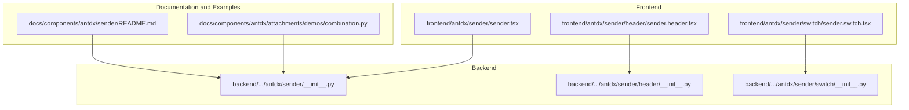
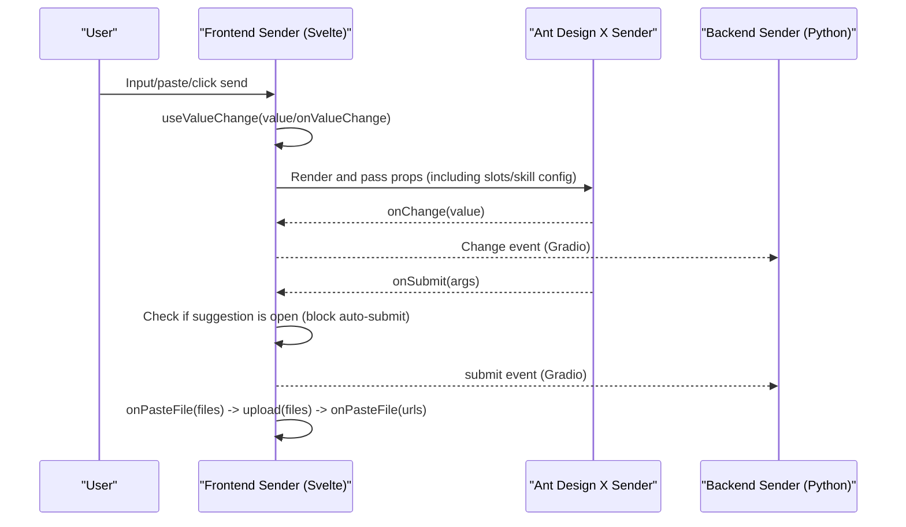
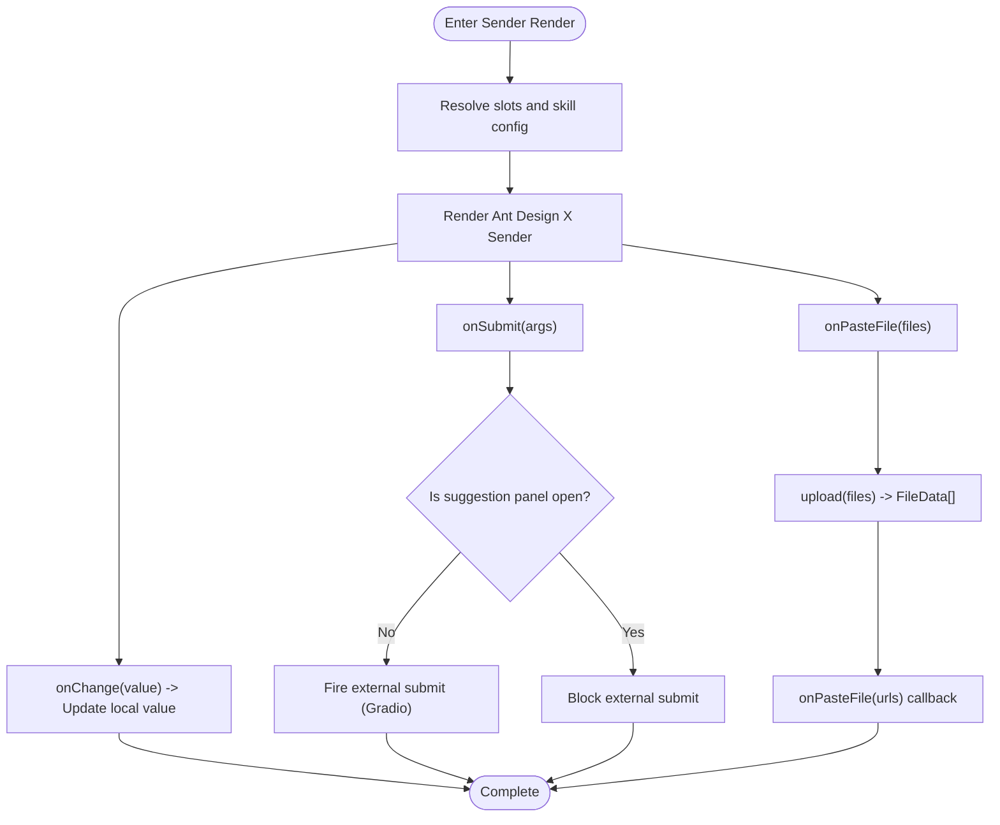
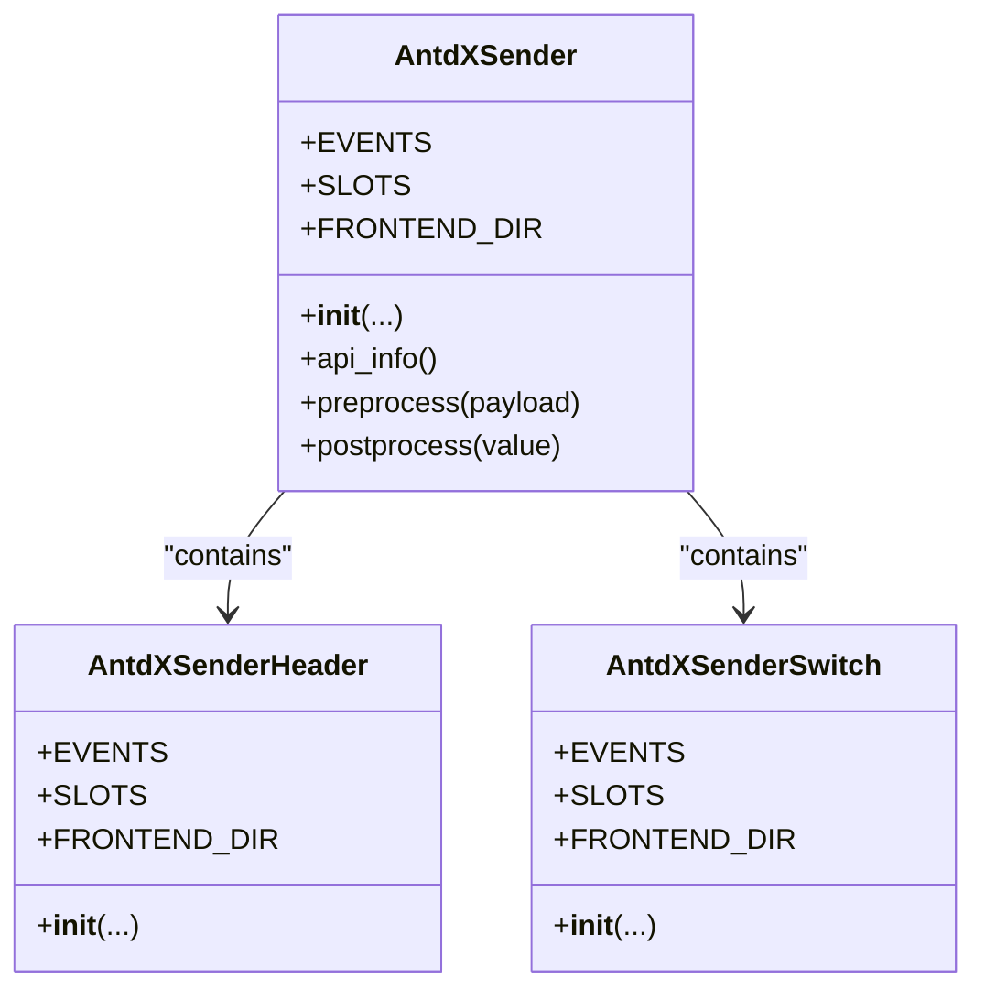
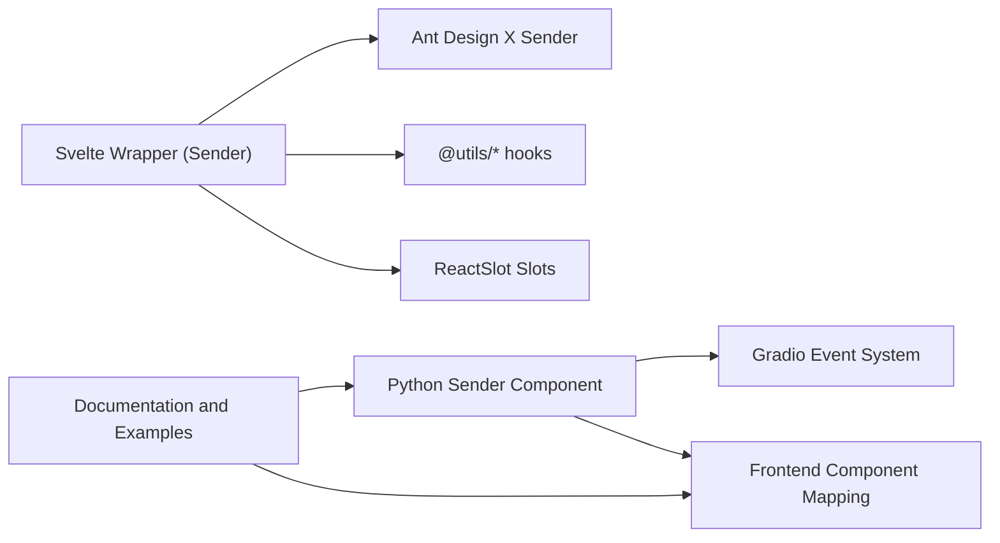

# Sender Component

<cite>
**Files Referenced in This Document**
- [frontend/antdx/sender/sender.tsx](file://frontend/antdx/sender/sender.tsx)
- [frontend/antdx/sender/header/sender.header.tsx](file://frontend/antdx/sender/header/sender.header.tsx)
- [frontend/antdx/sender/switch/sender.switch.tsx](file://frontend/antdx/sender/switch/sender.switch.tsx)
- [backend/modelscope_studio/components/antdx/sender/__init__.py](file://backend/modelscope_studio/components/antdx/sender/__init__.py)
- [backend/modelscope_studio/components/antdx/sender/header/__init__.py](file://backend/modelscope_studio/components/antdx/sender/header/__init__.py)
- [backend/modelscope_studio/components/antdx/sender/switch/__init__.py](file://backend/modelscope_studio/components/antdx/sender/switch/__init__.py)
- [docs/components/antdx/sender/README.md](file://docs/components/antdx/sender/README.md)
- [docs/components/antdx/attachments/demos/combination.py](file://docs/components/antdx/attachments/demos/combination.py)
</cite>

## Table of Contents

1. [Introduction](#introduction)
2. [Project Structure](#project-structure)
3. [Core Components](#core-components)
4. [Architecture Overview](#architecture-overview)
5. [Detailed Component Analysis](#detailed-component-analysis)
6. [Dependency Analysis](#dependency-analysis)
7. [Performance Considerations](#performance-considerations)
8. [Troubleshooting Guide](#troubleshooting-guide)
9. [Conclusion](#conclusion)
10. [Appendix: Configuration and Usage Examples](#appendix-configuration-and-usage-examples)

## Introduction

The Sender component is an input component designed for chat scenarios, providing message sending, input handling, paste-to-upload, submit type control, header panel, and switch control capabilities. On the frontend it is based on Ant Design X's Sender implementation, and it provides a Python API on the backend through a Gradio adaptation layer. It supports slot-based extensions (such as prefix/suffix, header, footer, skill panel, etc.) and event binding.

## Project Structure

The Sender component consists of a "frontend Svelte wrapper + backend Python component" and is accompanied by Header and Switch subcomponents; documentation and examples are located in the docs directory.

**Diagram Sources**

- [frontend/antdx/sender/sender.tsx:1-174](file://frontend/antdx/sender/sender.tsx#L1-L174)
- [frontend/antdx/sender/header/sender.header.tsx:1-21](file://frontend/antdx/sender/header/sender.header.tsx#L1-L21)
- [frontend/antdx/sender/switch/sender.switch.tsx:1-34](file://frontend/antdx/sender/switch/sender.switch.tsx#L1-L34)
- [backend/modelscope_studio/components/antdx/sender/**init**.py:1-149](file://backend/modelscope_studio/components/antdx/sender/__init__.py#L1-L149)
- [backend/modelscope_studio/components/antdx/sender/header/**init**.py:1-74](file://backend/modelscope_studio/components/antdx/sender/header/__init__.py#L1-L74)
- [backend/modelscope_studio/components/antdx/sender/switch/**init**.py:1-81](file://backend/modelscope_studio/components/antdx/sender/switch/__init__.py#L1-L81)
- [docs/components/antdx/sender/README.md:1-10](file://docs/components/antdx/sender/README.md#L1-L10)
- [docs/components/antdx/attachments/demos/combination.py:1-75](file://docs/components/antdx/attachments/demos/combination.py#L1-L75)

**Section Sources**

- [frontend/antdx/sender/sender.tsx:1-174](file://frontend/antdx/sender/sender.tsx#L1-L174)
- [backend/modelscope_studio/components/antdx/sender/**init**.py:1-149](file://backend/modelscope_studio/components/antdx/sender/__init__.py#L1-L149)

## Core Components

- Sender (Main Component)
  - Manages input value, intercepts submit events, handles paste file upload, renders slots, and configures skill panel (including Tooltip and closable).
  - Exposes callbacks and properties such as value, onChange, onSubmit, and onPasteFile.
- Sender.Header (Header Panel)
  - Supports title slot, optional expand/collapse, and closable features.
- Sender.Switch (Switch Control)
  - Supports custom "checked/unchecked" text and icon slots.

**Section Sources**

- [frontend/antdx/sender/sender.tsx:18-171](file://frontend/antdx/sender/sender.tsx#L18-L171)
- [frontend/antdx/sender/header/sender.header.tsx:7-18](file://frontend/antdx/sender/header/sender.header.tsx#L7-L18)
- [frontend/antdx/sender/switch/sender.switch.tsx:7-31](file://frontend/antdx/sender/switch/sender.switch.tsx#L7-L31)

## Architecture Overview

Sender bridges Ant Design X's Sender in the frontend via a Svelte wrapper, and exposes it to the Gradio ecosystem via a Python component in the backend. Its data flow and event flow are as follows:

**Diagram Sources**

- [frontend/antdx/sender/sender.tsx:68-138](file://frontend/antdx/sender/sender.tsx#L68-L138)
- [backend/modelscope_studio/components/antdx/sender/**init**.py:21-59](file://backend/modelscope_studio/components/antdx/sender/__init__.py#L21-L59)

## Detailed Component Analysis

### Main Component: Sender (Message Sending and Input Handling)

- Input and State
  - Uses controlled value and onChange combined with useValueChange to manage externally provided value and internal changes.
- Submit Logic
  - onSubmit is intercepted: if the suggestion panel is open, the external submit is not triggered to avoid accidental submission.
  - External submit events are reported via the Gradio event system.
- Paste Upload
  - onPasteFile receives a native File list, calls the upload callback to perform the upload, and passes the returned file path array back to onPasteFile.
- Slots and Advanced Features
  - Supports suffix/header/prefix/footer slots; supports skill.title, skill.toolTip.title, skill.closable.closeIcon slots.
  - Skill configuration supports Tooltip and closable behavior; Tooltip's afterOpenChange and getPopupContainer can be wrapped as functions.
- Event Mapping
  - Events such as change, submit, cancel, allow_speech_recording_change, key_down/key_press, focus/blur, paste, paste_file, skill_closable_close are all mapped to Gradio events.

**Diagram Sources**

- [frontend/antdx/sender/sender.tsx:68-138](file://frontend/antdx/sender/sender.tsx#L68-L138)

**Section Sources**

- [frontend/antdx/sender/sender.tsx:18-171](file://frontend/antdx/sender/sender.tsx#L18-L171)
- [backend/modelscope_studio/components/antdx/sender/**init**.py:21-66](file://backend/modelscope_studio/components/antdx/sender/__init__.py#L21-L66)

### Subcomponent: Sender.Header (Header Panel)

- Key Features
  - Supports the title slot; all other attributes are forwarded to Ant Design X Header.
  - The open_change event is mapped through Gradio.
- Usage Scenarios
  - Used with Sender to insert attachments or extend the input area.

**Section Sources**

- [frontend/antdx/sender/header/sender.header.tsx:7-18](file://frontend/antdx/sender/header/sender.header.tsx#L7-L18)
- [backend/modelscope_studio/components/antdx/sender/header/**init**.py:12-20](file://backend/modelscope_studio/components/antdx/sender/header/__init__.py#L12-L20)

### Subcomponent: Sender.Switch (Switch Control)

- Key Features
  - Supports checkedChildren, unCheckedChildren, and icon slots for custom text and icons.
  - The change event is mapped through Gradio.
- Usage Scenarios
  - Controls voice input mode, quick submit mode, etc.

**Section Sources**

- [frontend/antdx/sender/switch/sender.switch.tsx:7-31](file://frontend/antdx/sender/switch/sender.switch.tsx#L7-L31)
- [backend/modelscope_studio/components/antdx/sender/switch/**init**.py:12-19](file://backend/modelscope_studio/components/antdx/sender/switch/__init__.py#L12-L19)

### Class Relationship Diagram (Code Level)

**Diagram Sources**

- [backend/modelscope_studio/components/antdx/sender/**init**.py:14-128](file://backend/modelscope_studio/components/antdx/sender/__init__.py#L14-L128)
- [backend/modelscope_studio/components/antdx/sender/header/**init**.py:8-56](file://backend/modelscope_studio/components/antdx/sender/header/__init__.py#L8-L56)
- [backend/modelscope_studio/components/antdx/sender/switch/**init**.py:8-63](file://backend/modelscope_studio/components/antdx/sender/switch/__init__.py#L8-L63)

## Dependency Analysis

- Frontend Dependencies
  - Uses @svelte-preprocess-react to bridge React components to Svelte.
  - Uses @ant-design/x's Sender/Header/Switch.
  - Uses @gradio/client's FileData type and Gradio events.
- Backend Dependencies
  - Based on Gradio's ModelScopeDataLayoutComponent/ModelScopeLayoutComponent abstraction for unified event and slot mapping.
- Documentation and Examples
  - README provides basic example entry; combination examples demonstrate collaboration with Attachments, Badge, Button, and other components.

**Diagram Sources**

- [frontend/antdx/sender/sender.tsx:1-10](file://frontend/antdx/sender/sender.tsx#L1-L10)
- [backend/modelscope_studio/components/antdx/sender/**init**.py:14-128](file://backend/modelscope_studio/components/antdx/sender/__init__.py#L14-L128)
- [docs/components/antdx/sender/README.md:1-10](file://docs/components/antdx/sender/README.md#L1-L10)

**Section Sources**

- [frontend/antdx/sender/sender.tsx:1-10](file://frontend/antdx/sender/sender.tsx#L1-L10)
- [backend/modelscope_studio/components/antdx/sender/**init**.py:14-128](file://backend/modelscope_studio/components/antdx/sender/__init__.py#L14-L128)

## Performance Considerations

- Slots and Function Wrapping
  - Tooltip callbacks and slots are wrapped as functions and rendered with ReactSlot to avoid unnecessary re-renders; it is recommended to cache or stabilize slot content in the upper layer.
- Submit Interception
  - It is recommended to disable auto-submit when the suggestion panel is open to reduce invalid requests.
- File Upload
  - onPasteFile should be processed asynchronously as much as possible to avoid blocking the UI; for large files, consider chunked or direct server-side upload strategies.

## Troubleshooting Guide

- Submit Unexpectedly Intercepted
  - If submit is not triggered due to the suggestion panel not being closed, check the suggestion panel state or temporarily disable the interception logic.
- Paste Upload Not Working
  - Confirm the upload callback correctly returns a FileData array containing a path field; the onPasteFile callback should receive a string array.
- Slot Content Not Displaying
  - Confirm the slot names match those supported by the component (e.g., skill.title, skill.toolTip.title, skill.closable.closeIcon).
- Events Not Firing
  - Check whether the backend EVENTS list contains the corresponding event name and whether the frontend is correctly bound.

**Section Sources**

- [frontend/antdx/sender/sender.tsx:126-138](file://frontend/antdx/sender/sender.tsx#L126-L138)
- [backend/modelscope_studio/components/antdx/sender/**init**.py:21-59](file://backend/modelscope_studio/components/antdx/sender/__init__.py#L21-L59)

## Conclusion

The Sender component, through its integrated frontend and backend design, provides powerful input and submission capabilities for chat scenarios. Combined with Header, Switch, and the slot system, it can be flexibly extended to support multimodal input and complex interactions. In practice, pay attention to event interception, slot stability, and the robustness of the upload process.

## Appendix: Configuration and Usage Examples

### Configuration Overview (Backend)

- Basic Properties
  - value/default_value/placeholder/loading/disabled/read_only/auto_size/submit_type, etc.
- Slots
  - suffix/header/prefix/footer/skill.title/skill.toolTip.title/skill.closable.closeIcon.
- Events
  - change, submit, cancel, allow_speech_recording_change, key_down/key_press, focus/blur, paste, paste_file, skill_closable_close.
- Subcomponents
  - Header, Switch (each supporting corresponding slots and events).

**Section Sources**

- [backend/modelscope_studio/components/antdx/sender/**init**.py:61-127](file://backend/modelscope_studio/components/antdx/sender/__init__.py#L61-L127)
- [backend/modelscope_studio/components/antdx/sender/header/**init**.py:19-54](file://backend/modelscope_studio/components/antdx/sender/header/__init__.py#L19-L54)
- [backend/modelscope_studio/components/antdx/sender/switch/**init**.py:18-61](file://backend/modelscope_studio/components/antdx/sender/switch/__init__.py#L18-L61)

### Chatbot Integration Example (Overview)

- Text Messages
  - Use Sender as input, listen to the submit event to get text content, and combine with backend model inference to return results.
- Multimodal Content
  - Collaborate with Sender.Header/Attachments; upload images/files via paste or drag; the path list returned by onPasteFile can be used for subsequent processing.
- Special Commands
  - Parse input in onChange or submit, recognize commands like "/reset" and "/help", and execute corresponding logic.

**Section Sources**

- [docs/components/antdx/attachments/demos/combination.py:26-71](file://docs/components/antdx/attachments/demos/combination.py#L26-L71)
- [docs/components/antdx/sender/README.md:5-10](file://docs/components/antdx/sender/README.md#L5-L10)
