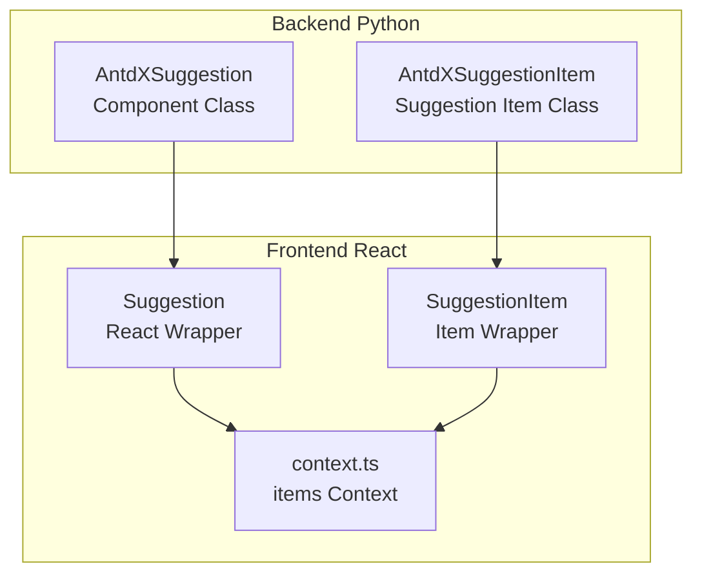
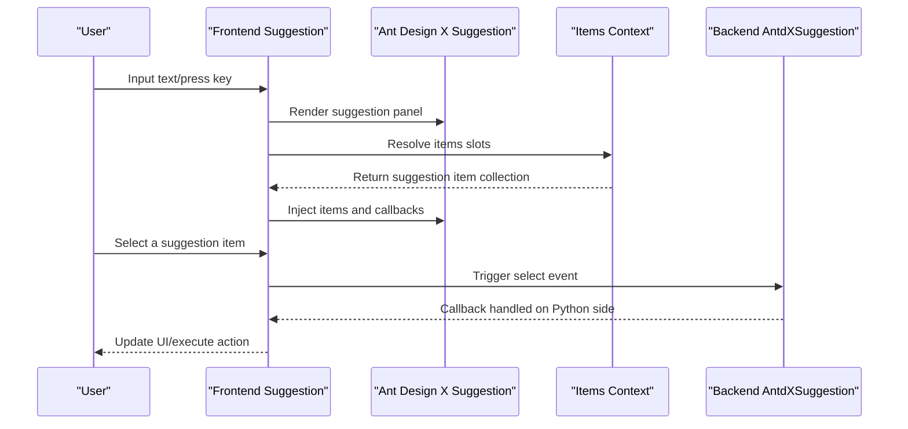
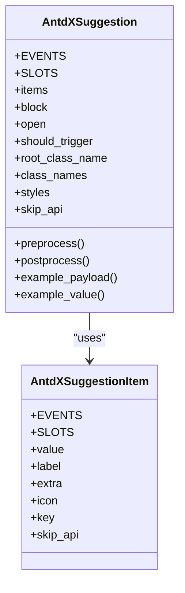
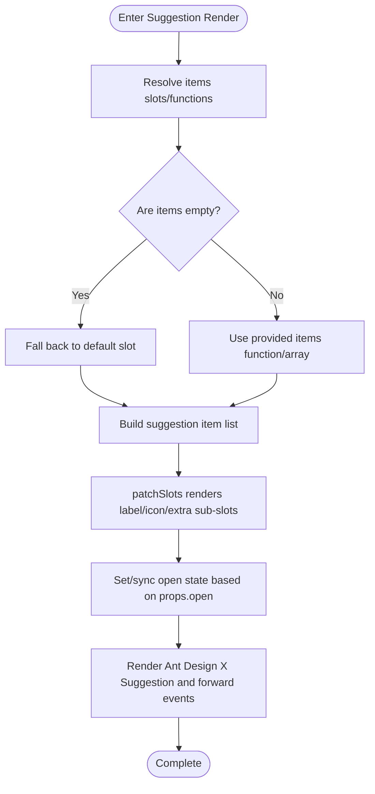
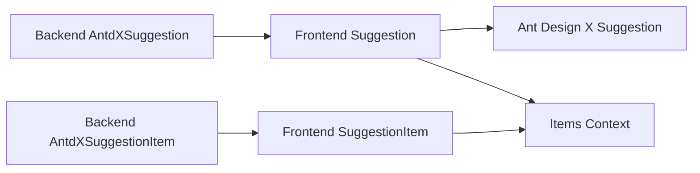

# Suggestion Component

<cite>
**Files Referenced in This Document**
- [backend/modelscope_studio/components/antdx/suggestion/__init__.py](file://backend/modelscope_studio/components/antdx/suggestion/__init__.py)
- [backend/modelscope_studio/components/antdx/suggestion/item/__init__.py](file://backend/modelscope_studio/components/antdx/suggestion/item/__init__.py)
- [frontend/antdx/suggestion/suggestion.tsx](file://frontend/antdx/suggestion/suggestion.tsx)
- [frontend/antdx/suggestion/item/suggestion.item.tsx](file://frontend/antdx/suggestion/item/suggestion.item.tsx)
- [frontend/antdx/suggestion/context.ts](file://frontend/antdx/suggestion/context.ts)
- [docs/components/antdx/suggestion/README.md](file://docs/components/antdx/suggestion/README.md)
- [backend/modelscope_studio/components/pro/chatbot/__init__.py](file://backend/modelscope_studio/components/pro/chatbot/__init__.py)
</cite>

## Table of Contents

1. [Introduction](#introduction)
2. [Project Structure](#project-structure)
3. [Core Components](#core-components)
4. [Architecture Overview](#architecture-overview)
5. [Component Details](#component-details)
6. [Dependency Analysis](#dependency-analysis)
7. [Performance and Interaction Features](#performance-and-interaction-features)
8. [Usage Examples and Best Practices](#usage-examples-and-best-practices)
9. [Troubleshooting](#troubleshooting)
10. [Conclusion](#conclusion)

## Introduction

The Suggestion component provides capabilities such as "quick commands", "intelligent completion", "context-aware suggestions", and "personalized recommendations" in AI assistant conversation scenarios. Based on Ant Design X's Suggestion capability and bridged via React wrapper and Gradio layout components, it implements:

- Instruction Definition: Organized as "suggestion items" supporting multi-dimensional information such as labels, icons, and extra content.
- Trigger Conditions: Can be controlled by input keyboard events or external state to open/close the panel.
- Execution Logic: Triggers callbacks after selecting a suggestion, enabling subsequent processing on the Python side.
- Control Mode: Supports both controlled and uncontrolled modes; the open state can be set directly from the Python side.
- Dynamic Updates: The suggestion list can be dynamically generated via slots or functions and can be hot-updated at runtime.

This component is widely used in interactive scenarios requiring "quick actions" such as chatbots, code assistants, and content creation.

## Project Structure

The Suggestion component is composed of a backend Python component and a frontend React implementation, unified through a context system for slot rendering and dynamic data injection.

**Diagram Sources**

- [backend/modelscope_studio/components/antdx/suggestion/**init**.py:11-86](file://backend/modelscope_studio/components/antdx/suggestion/__init__.py#L11-L86)
- [backend/modelscope_studio/components/antdx/suggestion/item/**init**.py:8-68](file://backend/modelscope_studio/components/antdx/suggestion/item/__init__.py#L8-L68)
- [frontend/antdx/suggestion/suggestion.tsx:64-165](file://frontend/antdx/suggestion/suggestion.tsx#L64-L165)
- [frontend/antdx/suggestion/item/suggestion.item.tsx:7-22](file://frontend/antdx/suggestion/item/suggestion.item.tsx#L7-L22)
- [frontend/antdx/suggestion/context.ts:1-7](file://frontend/antdx/suggestion/context.ts#L1-L7)

**Section Sources**

- [backend/modelscope_studio/components/antdx/suggestion/**init**.py:11-86](file://backend/modelscope_studio/components/antdx/suggestion/__init__.py#L11-L86)
- [backend/modelscope_studio/components/antdx/suggestion/item/**init**.py:8-68](file://backend/modelscope_studio/components/antdx/suggestion/item/__init__.py#L8-L68)
- [frontend/antdx/suggestion/suggestion.tsx:64-165](file://frontend/antdx/suggestion/suggestion.tsx#L64-L165)
- [frontend/antdx/suggestion/item/suggestion.item.tsx:7-22](file://frontend/antdx/suggestion/item/suggestion.item.tsx#L7-L22)
- [frontend/antdx/suggestion/context.ts:1-7](file://frontend/antdx/suggestion/context.ts#L1-L7)

## Core Components

- AntdXSuggestion (Backend Component)
  - Supported Events: select (item selected), open_change (panel open/close).
  - Supported Slots: items, children.
  - Key Properties: items (suggestion list), block (block-level display), open (controlled open/close), should_trigger (custom trigger), root style class name and inline styles, etc.
  - Frontend Mapping: resolve_frontend_dir("suggestion", type="antdx").
- AntdXSuggestionItem (Backend Suggestion Item)
  - Supported Slots: label, icon, extra.
  - Key Properties: value, label, extra, icon, key.
  - Frontend Mapping: resolve_frontend_dir("suggestion", "item", type="antdx").

Both components declare skip_api=True, indicating they do not participate in the standard API flow but instead complete interactions through events and slots.

**Section Sources**

- [backend/modelscope_studio/components/antdx/suggestion/**init**.py:11-86](file://backend/modelscope_studio/components/antdx/suggestion/__init__.py#L11-L86)
- [backend/modelscope_studio/components/antdx/suggestion/item/**init**.py:8-68](file://backend/modelscope_studio/components/antdx/suggestion/item/__init__.py#L8-L68)

## Architecture Overview

Suggestion wraps Ant Design X's Suggestion component in the frontend via React, combined with a slot system and context to implement suggestion item rendering and event forwarding. In the backend, it bridges through Gradio layout components to support Python-side control and event binding.

**Diagram Sources**

- [frontend/antdx/suggestion/suggestion.tsx:77-162](file://frontend/antdx/suggestion/suggestion.tsx#L77-L162)
- [frontend/antdx/suggestion/context.ts:1-7](file://frontend/antdx/suggestion/context.ts#L1-L7)
- [backend/modelscope_studio/components/antdx/suggestion/**init**.py:18-27](file://backend/modelscope_studio/components/antdx/suggestion/__init__.py#L18-L27)

## Component Details

### Backend Component: AntdXSuggestion

- Event Binding
  - select: Triggered when a suggestion item is selected; event binding is enabled on the backend via internal flags.
  - open_change: Triggered when the panel open/close state changes, facilitating controlled/uncontrolled switching.
- Slot Support
  - items: Suggestion item collection, dynamically generated via slots or functions.
  - children: Used to wrap host elements such as input boxes, combined with should_trigger to customize trigger logic.
- Key Property Points
  - items: Can be a string, list, or function; function form supports dynamic computation.
  - open: In controlled mode, the panel open/close is explicitly set from the Python side.
  - should_trigger: Custom keyboard event trigger determining when to show the suggestion panel.
  - Styles: Supports class_names, styles, root_class_name, etc.
- Lifecycle
  - preprocess/postprocess/example_payload/example_value all return empty values, indicating this component does not participate in data serialization.

**Diagram Sources**

- [backend/modelscope_studio/components/antdx/suggestion/**init**.py:11-86](file://backend/modelscope_studio/components/antdx/suggestion/__init__.py#L11-L86)
- [backend/modelscope_studio/components/antdx/suggestion/item/**init**.py:8-68](file://backend/modelscope_studio/components/antdx/suggestion/item/__init__.py#L8-L68)

**Section Sources**

- [backend/modelscope_studio/components/antdx/suggestion/**init**.py:11-86](file://backend/modelscope_studio/components/antdx/suggestion/__init__.py#L11-L86)

### Frontend Implementation: Suggestion (React Wrapper)

- Slots and Context
  - Uses withItemsContextProvider to provide an items context, supporting both default and items slot sets.
  - Converts slot content into suggestion item structures via renderItems and patchSlots.
- Dynamic Suggestion List
  - items can be a function or slot resolution result; falls back to the default slot if empty.
  - Uses useMemoizedEqualValue and useMemo to optimize rendering and comparison.
- Trigger and Open/Close
  - shouldTrigger: Triggers onTrigger as needed in onKeyDown to determine whether to show the panel.
  - open: Supports both props.open uncontrolled mode and internal state controlled mode.
- Event Forwarding
  - onOpenChange: Determines whether to update internal state based on the presence of props.open.
  - children: Injects context and forwards events via SuggestionChildrenWrapper.

**Diagram Sources**

- [frontend/antdx/suggestion/suggestion.tsx:77-162](file://frontend/antdx/suggestion/suggestion.tsx#L77-L162)
- [frontend/antdx/suggestion/context.ts:1-7](file://frontend/antdx/suggestion/context.ts#L1-L7)

**Section Sources**

- [frontend/antdx/suggestion/suggestion.tsx:64-165](file://frontend/antdx/suggestion/suggestion.tsx#L64-L165)
- [frontend/antdx/suggestion/context.ts:1-7](file://frontend/antdx/suggestion/context.ts#L1-L7)

### Frontend Implementation: SuggestionItem (Item Wrapper)

- Renders slot default as suggestion item children via ItemHandler.
- Only allows the default slot, simplifying suggestion item content organization.

**Section Sources**

- [frontend/antdx/suggestion/item/suggestion.item.tsx:7-22](file://frontend/antdx/suggestion/item/suggestion.item.tsx#L7-L22)

## Dependency Analysis

- Component Coupling
  - AntdXSuggestion depends on AntdXSuggestionItem as the suggestion item container.
  - Frontend Suggestion depends on Ant Design X's Suggestion component and internal utility functions (such as patchSlots, renderItems).
- Data Flow
  - Slots → Context Resolution → Suggestion Item Structure → Render → Event Callback → Python Processing.
- Event Chain
  - Frontend onOpenChange/select → Backend event listener → Python callback.

**Diagram Sources**

- [backend/modelscope_studio/components/antdx/suggestion/**init**.py:11-16](file://backend/modelscope_studio/components/antdx/suggestion/__init__.py#L11-L16)
- [frontend/antdx/suggestion/suggestion.tsx:64-86](file://frontend/antdx/suggestion/suggestion.tsx#L64-L86)
- [frontend/antdx/suggestion/item/suggestion.item.tsx:7-18](file://frontend/antdx/suggestion/item/suggestion.item.tsx#L7-L18)

**Section Sources**

- [backend/modelscope_studio/components/antdx/suggestion/**init**.py:11-16](file://backend/modelscope_studio/components/antdx/suggestion/__init__.py#L11-L16)
- [frontend/antdx/suggestion/suggestion.tsx:64-86](file://frontend/antdx/suggestion/suggestion.tsx#L64-L86)
- [frontend/antdx/suggestion/item/suggestion.item.tsx:7-18](file://frontend/antdx/suggestion/item/suggestion.item.tsx#L7-L18)

## Performance and Interaction Features

- Render Optimization
  - Uses useMemoizedEqualValue and useMemo to cache props and items, avoiding redundant renders.
  - Only rebuilds the suggestion item list when items or slots change.
- Event Throttling
  - Uses requestAnimationFrame in shouldTrigger to defer keyboard event processing, reducing main thread blocking risk.
- Open/Close Control
  - Uncontrolled Mode: onOpenChange internally maintains the open state.
  - Controlled Mode: Determined by props.open; onOpenChange only callbacks without modifying state.
- Slot Rendering
  - patchSlots converts label/icon/extra sub-slots into corresponding fields, reducing cross-component communication costs.

**Section Sources**

- [frontend/antdx/suggestion/suggestion.tsx:36-57](file://frontend/antdx/suggestion/suggestion.tsx#L36-L57)
- [frontend/antdx/suggestion/suggestion.tsx:94-121](file://frontend/antdx/suggestion/suggestion.tsx#L94-L121)
- [frontend/antdx/suggestion/suggestion.tsx:135-140](file://frontend/antdx/suggestion/suggestion.tsx#L135-L140)

## Usage Examples and Best Practices

### Basic Usage (Documentation Examples)

- The documentation provides three examples: basic, block-level display, and Python-controlled; reference:
  - [docs/components/antdx/suggestion/README.md:5-10](file://docs/components/antdx/suggestion/README.md#L5-L10)

### AI Assistant Scenario Examples (Conceptual Description)

- Common Commands
  - Define a set of fixed command suggestion items that execute on click, suitable for "quick start" scenarios.
- Context-aware Suggestions
  - Dynamically generate suggestion lists based on current input or message history to improve relevance.
- Personalized Recommendations
  - Based on user preferences or usage records, prioritize high-hit-rate suggestion items.
- Python-side Control
  - Control panel show/hide by setting the open property; receive selected items via the select event and execute corresponding logic on the Python side.

### Instruction Definition and Triggering

- Instruction Definition
  - Use AntdXSuggestionItem to organize suggestion items, supporting fields like label, icon, and extra.
- Trigger Conditions
  - Can customize keyboard event triggers via should_trigger; can also control panel open/close via the open property.
- Execution Logic
  - After selecting a suggestion item, the select event is triggered; the Python side can handle business logic in the callback.

### Style and Interaction Customization

- Styles
  - Customize styles via class*names, styles, root_class_name, and backend elem*\* properties.
- Interaction
  - The children slot is used to host input boxes and other host components, combined with should_trigger for more flexible trigger strategies.

**Section Sources**

- [docs/components/antdx/suggestion/README.md:5-10](file://docs/components/antdx/suggestion/README.md#L5-L10)
- [backend/modelscope_studio/components/antdx/suggestion/**init**.py:32-67](file://backend/modelscope_studio/components/antdx/suggestion/__init__.py#L32-L67)
- [frontend/antdx/suggestion/suggestion.tsx:77-86](file://frontend/antdx/suggestion/suggestion.tsx#L77-L86)

## Troubleshooting

- Suggestion Items Not Displaying
  - Check whether items is empty; if empty, confirm the default slot is correctly populated.
  - Confirm slot names match (items/default).
- Panel Cannot Open
  - If using controlled open, ensure the open state is correctly set on the Python side.
  - Check whether should_trigger correctly implements the trigger logic.
- Events Not Firing
  - Confirm event listeners are registered (select/open_change).
  - Check whether Python-side callbacks are correctly bound.

**Section Sources**

- [frontend/antdx/suggestion/suggestion.tsx:87-121](file://frontend/antdx/suggestion/suggestion.tsx#L87-L121)
- [backend/modelscope_studio/components/antdx/suggestion/**init**.py:18-27](file://backend/modelscope_studio/components/antdx/suggestion/__init__.py#L18-L27)

## Conclusion

The Suggestion component, through its "backend layout component + frontend React wrapper + slot context" architecture, achieves high-performance, extensible quick command and intelligent completion capabilities. It supports controlled/uncontrolled open/close, dynamic suggestion lists, custom triggers, and event callbacks, making it suitable for various AI assistant and creation scenarios. It is recommended to dynamically generate suggestion items based on business context in practice, and implement closed-loop interactions through Python-side events.
