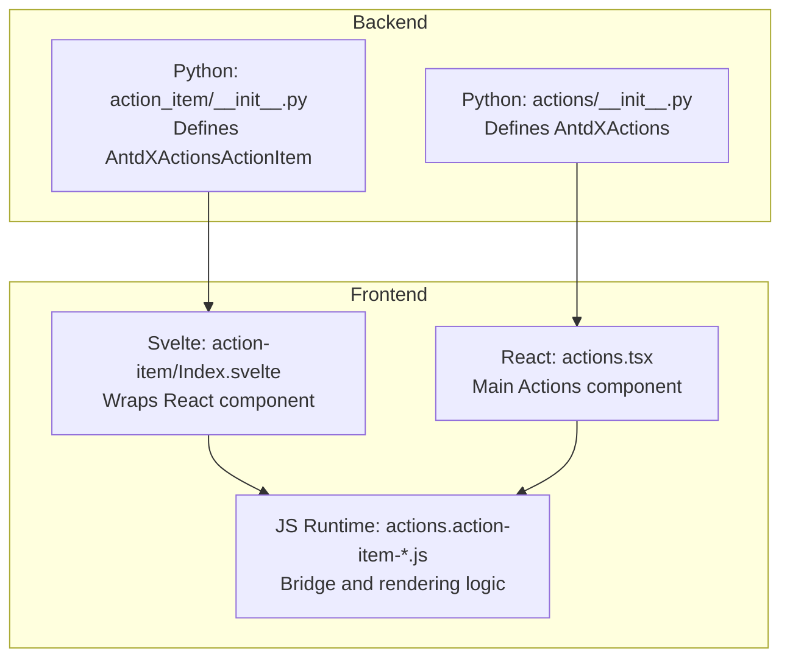
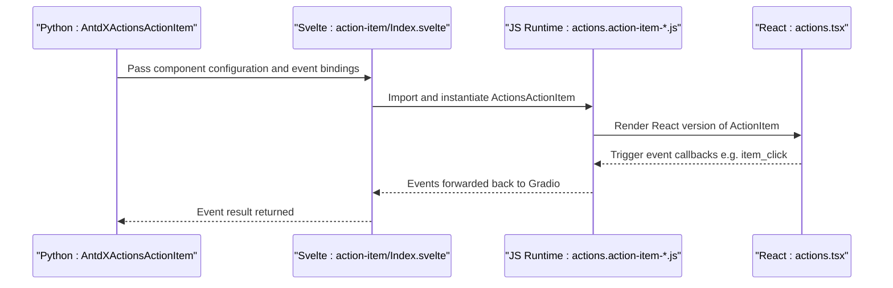
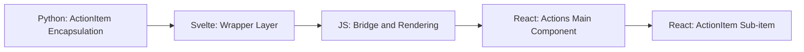

# ActionItem Component

<cite>
**Files referenced in this document**
- [frontend/antdx/actions/action-item/Index.svelte](file://frontend/antdx/actions/action-item/Index.svelte)
- [frontend/antdx/actions/actions.tsx](file://frontend/antdx/actions/actions.tsx)
- [backend/modelscope_studio/components/antdx/actions/__init__.py](file://backend/modelscope_studio/components/antdx/actions/__init__.py)
- [backend/modelscope_studio/components/antdx/actions/action_item/__init__.py](file://backend/modelscope_studio/components/antdx/actions/action_item/__init__.py)
- [backend/modelscope_studio/components/antdx/actions/action_item/templates/component/actions.action-item-76joNQSL.js](file://backend/modelscope_studio/components/antdx/actions/action_item/templates/component/actions.action-item-76joNQSL.js)
</cite>

## Table of Contents

1. [Introduction](#introduction)
2. [Project Structure](#project-structure)
3. [Core Components](#core-components)
4. [Architecture Overview](#architecture-overview)
5. [Detailed Component Analysis](#detailed-component-analysis)
6. [Dependency Analysis](#dependency-analysis)
7. [Performance Considerations](#performance-considerations)
8. [Troubleshooting Guide](#troubleshooting-guide)
9. [Conclusion](#conclusion)
10. [Appendix: Usage Examples and Parameter Reference](#appendix-usage-examples-and-parameter-reference)

## Introduction

ActionItem is the core sub-component in the Ant Design X Actions component system, used to present a single clickable or interactive operation item within an Actions container. It supports multiple forms (text, icon, custom rendering), nested sub-menus, danger state, trigger strategies (hover/click), and the ability to extend content through slots. The component provides both a frontend Svelte wrapper layer and a backend Gradio Python encapsulation layer, forming a complete "Python configuration + frontend rendering" pipeline.

## Project Structure

The directory and related files for ActionItem are organized as follows:

- Frontend wrapper layer (Svelte): frontend/antdx/actions/action-item/Index.svelte
- Frontend main component (React): frontend/antdx/actions/actions.tsx (contains the main Actions component)
- Backend encapsulation layer (Gradio Python): backend/modelscope_studio/components/antdx/actions/action_item/**init**.py
- Frontend bridge and runtime (build artifact): backend/modelscope_studio/components/antdx/actions/action_item/templates/component/actions.action-item-76joNQSL.js
- Backend Actions main component: backend/modelscope_studio/components/antdx/actions/**init**.py

Diagram Sources

- [backend/modelscope_studio/components/antdx/actions/**init**.py:15-94](file://backend/modelscope_studio/components/antdx/actions/__init__.py#L15-L94)
- [backend/modelscope_studio/components/antdx/actions/action_item/**init**.py:10-62](file://backend/modelscope_studio/components/antdx/actions/action_item/__init__.py#L10-L62)
- [frontend/antdx/actions/action-item/Index.svelte:14-98](file://frontend/antdx/actions/action-item/Index.svelte#L14-L98)
- [frontend/antdx/actions/actions.tsx:1-200](file://frontend/antdx/actions/actions.tsx#L1-L200)
- [backend/modelscope_studio/components/antdx/actions/action_item/templates/component/actions.action-item-76joNQSL.js:419-431](file://backend/modelscope_studio/components/antdx/actions/action_item/templates/component/actions.action-item-76joNQSL.js#L419-L431)

Section Sources

- [backend/modelscope_studio/components/antdx/actions/**init**.py:15-94](file://backend/modelscope_studio/components/antdx/actions/__init__.py#L15-L94)
- [backend/modelscope_studio/components/antdx/actions/action_item/**init**.py:10-62](file://backend/modelscope_studio/components/antdx/actions/action_item/__init__.py#L10-L62)
- [frontend/antdx/actions/action-item/Index.svelte:14-98](file://frontend/antdx/actions/action-item/Index.svelte#L14-L98)
- [frontend/antdx/actions/actions.tsx:1-200](file://frontend/antdx/actions/actions.tsx#L1-L200)
- [backend/modelscope_studio/components/antdx/actions/action_item/templates/component/actions.action-item-76joNQSL.js:419-431](file://backend/modelscope_studio/components/antdx/actions/action_item/templates/component/actions.action-item-76joNQSL.js#L419-L431)

## Core Components

- AntdXActionsActionItem (backend encapsulation): Responsible for mapping Python-layer configuration to frontend components and declaring event and slot capabilities.
- ActionsActionItem (frontend bridge): Dynamically imported and rendered by the Svelte wrapper layer, responsible for handling slots, additional attributes, event mapping, and visibility control.
- Actions (main component): The frontend implementation of AntdXActions, hosting multiple ActionItems and providing advanced features such as dropdowns and animations.

Key responsibilities and relationships

- Backend encapsulation: Defines ActionItem parameters, events, and slots; determines frontend resource paths.
- Frontend wrapper: Parses props, handles slots, and generates the final props and slots required for rendering.
- Runtime bridge: Connects the Svelte/React render tree with the Gradio context, supporting event forwarding and context merging.

Section Sources

- [backend/modelscope_studio/components/antdx/actions/action_item/**init**.py:10-62](file://backend/modelscope_studio/components/antdx/actions/action_item/__init__.py#L10-L62)
- [frontend/antdx/actions/action-item/Index.svelte:19-84](file://frontend/antdx/actions/action-item/Index.svelte#L19-L84)
- [backend/modelscope_studio/components/antdx/actions/**init**.py:15-94](file://backend/modelscope_studio/components/antdx/actions/__init__.py#L15-L94)

## Architecture Overview

The complete call chain from Python to frontend for ActionItem is as follows:

Diagram Sources

- [backend/modelscope_studio/components/antdx/actions/action_item/**init**.py:15-21](file://backend/modelscope_studio/components/antdx/actions/action_item/__init__.py#L15-L21)
- [frontend/antdx/actions/action-item/Index.svelte:14-98](file://frontend/antdx/actions/action-item/Index.svelte#L14-L98)
- [backend/modelscope_studio/components/antdx/actions/action_item/templates/component/actions.action-item-76joNQSL.js:419-431](file://backend/modelscope_studio/components/antdx/actions/action_item/templates/component/actions.action-item-76joNQSL.js#L419-L431)
- [frontend/antdx/actions/actions.tsx:1-200](file://frontend/antdx/actions/actions.tsx#L1-L200)

## Detailed Component Analysis

### Backend Encapsulation: AntdXActionsActionItem

- Event binding
  - item_click: Triggered when the operation item is clicked; the backend enables event binding via an internal flag.
- Slot support
  - Supports slots such as label, icon, actionRender, and subItems for flexible extension.
- Key properties
  - label, icon, danger, trigger_sub_menu_action, sub_items, action_render, as_item, key, etc.
- Resource location
  - Uses resolve_frontend_dir("actions", "action-item", type="antdx") to specify the frontend resource directory.

Section Sources

- [backend/modelscope_studio/components/antdx/actions/action_item/**init**.py:10-62](file://backend/modelscope_studio/components/antdx/actions/action_item/__init__.py#L10-L62)
- [backend/modelscope_studio/components/antdx/actions/action_item/**init**.py:15-21](file://backend/modelscope_studio/components/antdx/actions/action_item/__init__.py#L15-L21)
- [backend/modelscope_studio/components/antdx/actions/action_item/**init**.py:24](file://backend/modelscope_studio/components/antdx/actions/action_item/__init__.py#L24)

### Frontend Wrapper: Svelte Wrapper Layer

- Dynamic import
  - Dynamically loads the React version of ActionItem via importComponent.
- Props handling
  - Uses getProps/processProps to extract and transform props, mapping item_click to the frontend event name.
  - Merges elem_id, elem_classes, elem_style, additionalProps, etc.
- Slot handling
  - Retrieves slot content via getSlots, setting withParams and clone for actionRender.
- Visibility and index
  - Controls rendering based on visible; passes itemIndex and itemSlotKey to work with context.

Section Sources

- [frontend/antdx/actions/action-item/Index.svelte:14-98](file://frontend/antdx/actions/action-item/Index.svelte#L14-L98)

### Runtime Bridge: JS Runtime

- Component bridge
  - Creates a Svelte-React bridge instance via Ge(...), mounting the React component to a shared root node.
- Context and slots
  - Uses createItemsContext to provide the items context, supporting default slots and sub-item rendering.
- Event and property forwarding
  - Merges Gradio context with props to ensure events and styles are correctly forwarded.

Section Sources

- [backend/modelscope_studio/components/antdx/actions/action_item/templates/component/actions.action-item-76joNQSL.js:419-431](file://backend/modelscope_studio/components/antdx/actions/action_item/templates/component/actions.action-item-76joNQSL.js#L419-L431)

### Main Component: AntdXActions (Related)

- Role
  - Acts as the container for ActionItem, providing items list, variants, dropdown configuration, animations, and more.
- Events and slots
  - Supports click, dropdown*open_change, dropdown_menu*\* event series, and multiple slots.

Section Sources

- [backend/modelscope_studio/components/antdx/actions/**init**.py:15-94](file://backend/modelscope_studio/components/antdx/actions/__init__.py#L15-L94)

## Dependency Analysis

- Backend to frontend
  - AntdXActionsActionItem points to frontend resources via FRONTEND_DIR; the Svelte wrapper layer dynamically imports the corresponding JS module.
- Frontend to runtime
  - The Svelte wrapper layer passes props and slots to the runtime bridge module, which is responsible for rendering the React component and integrating with the Gradio context.
- Inter-component collaboration
  - ActionItem typically exists as a sub-item of Actions; the two together form an operation panel.

Diagram Sources

- [backend/modelscope_studio/components/antdx/actions/action_item/**init**.py:62](file://backend/modelscope_studio/components/antdx/actions/action_item/__init__.py#L62)
- [frontend/antdx/actions/action-item/Index.svelte:14-98](file://frontend/antdx/actions/action-item/Index.svelte#L14-L98)
- [backend/modelscope_studio/components/antdx/actions/action_item/templates/component/actions.action-item-76joNQSL.js:419-431](file://backend/modelscope_studio/components/antdx/actions/action_item/templates/component/actions.action-item-76joNQSL.js#L419-L431)
- [frontend/antdx/actions/actions.tsx:1-200](file://frontend/antdx/actions/actions.tsx#L1-L200)

## Performance Considerations

- Dynamic import and lazy loading
  - The Svelte side implements on-demand loading via importComponent, reducing the initial bundle size and first-screen load pressure.
- Render optimization
  - Uses $derived and useMemo strategies to avoid unnecessary re-renders.
- Event forwarding
  - Events are handled uniformly in the runtime bridge layer, reducing redundant bindings and memory usage.
- Slot cloning
  - Sets clone and withParams for actionRender, ensuring stable reuse and parameter passing for slot content.

Section Sources

- [frontend/antdx/actions/action-item/Index.svelte:14-98](file://frontend/antdx/actions/action-item/Index.svelte#L14-L98)
- [backend/modelscope_studio/components/antdx/actions/action_item/templates/component/actions.action-item-76joNQSL.js:163-209](file://backend/modelscope_studio/components/antdx/actions/action_item/templates/component/actions.action-item-76joNQSL.js#L163-L209)

## Troubleshooting Guide

- Event not triggered
  - Check if the backend has enabled item_click event binding; confirm that item_click is correctly mapped in the frontend props.
- Slot not working
  - Confirm slot names match the supported list (label, icon, actionRender, subItems); check withParams and clone settings for actionRender.
- Style or class name anomalies
  - Check if elem_id, elem_classes, and elem_style are correctly passed; confirm the style and class name merging logic in the runtime bridge layer.
- Sub-menu not displaying
  - Check trigger_sub_menu_action (hover/click) and sub_items structure; confirm the dropdown configuration of the main Actions.

Section Sources

- [backend/modelscope_studio/components/antdx/actions/action_item/**init**.py:15-21](file://backend/modelscope_studio/components/antdx/actions/action_item/__init__.py#L15-L21)
- [backend/modelscope_studio/components/antdx/actions/action_item/**init**.py:24](file://backend/modelscope_studio/components/antdx/actions/action_item/__init__.py#L24)
- [frontend/antdx/actions/action-item/Index.svelte:61-84](file://frontend/antdx/actions/action-item/Index.svelte#L61-L84)

## Conclusion

ActionItem implements a highly configurable, extensible, and maintainable operation item component through backend Python encapsulation and frontend Svelte/React bridging. Its event, slot, style, and context integration capabilities enable it to meet the needs of operation panels in complex scenarios. Combined with the AntdXActions main component, beautiful and fully functional operation areas can be quickly built.

## Appendix: Usage Examples and Parameter Reference

The following are common usage scenarios and parameter descriptions (using paths instead of specific code):

- Text operation item
  - Parameters: label, danger, as_item
  - Example path: [frontend/antdx/actions/action-item/Index.svelte:61-84](file://frontend/antdx/actions/action-item/Index.svelte#L61-L84)
- Icon operation item
  - Parameters: icon, label, elem_classes
  - Example path: [frontend/antdx/actions/action-item/Index.svelte:61-84](file://frontend/antdx/actions/action-item/Index.svelte#L61-L84)
- Custom rendering (actionRender)
  - Parameters: actionRender (function string), slot withParams/clone
  - Example path: [frontend/antdx/actions/action-item/Index.svelte:71-83](file://frontend/antdx/actions/action-item/Index.svelte#L71-L83)
- Danger state and trigger strategy
  - Parameters: danger, trigger_sub_menu_action (hover/click)
  - Example path: [backend/modelscope_studio/components/antdx/actions/action_item/**init**.py:26-61](file://backend/modelscope_studio/components/antdx/actions/action_item/__init__.py#L26-L61)
- Sub-menu
  - Parameters: sub_items, slot subItems
  - Example path: [backend/modelscope_studio/components/antdx/actions/action_item/**init**.py:24](file://backend/modelscope_studio/components/antdx/actions/action_item/__init__.py#L24)

Section Sources

- [frontend/antdx/actions/action-item/Index.svelte:61-84](file://frontend/antdx/actions/action-item/Index.svelte#L61-L84)
- [backend/modelscope_studio/components/antdx/actions/action_item/**init**.py:24-61](file://backend/modelscope_studio/components/antdx/actions/action_item/__init__.py#L24-L61)
