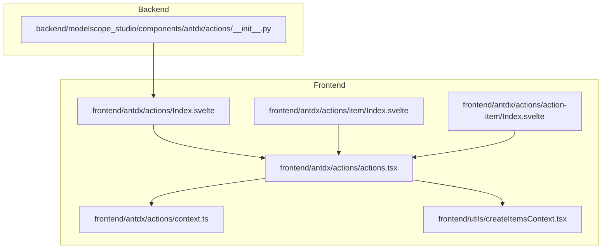
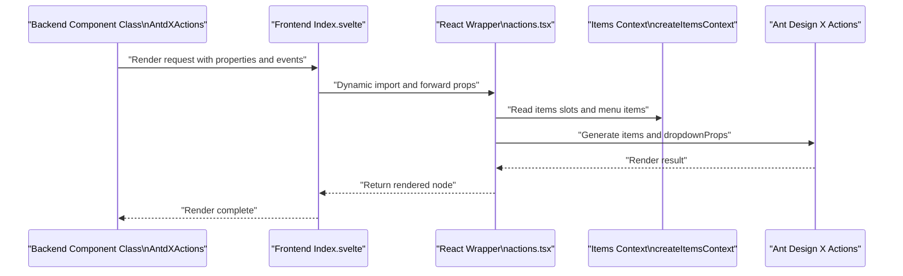
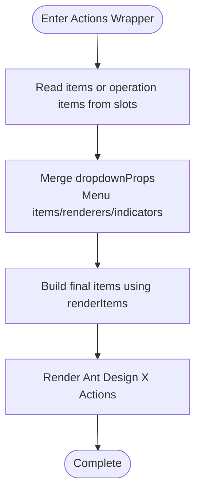
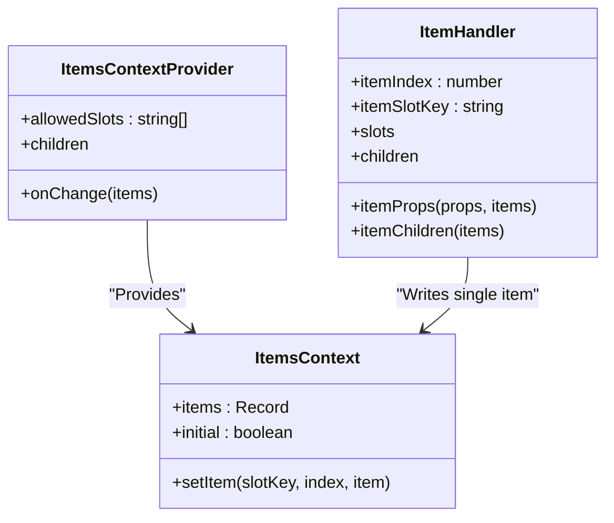
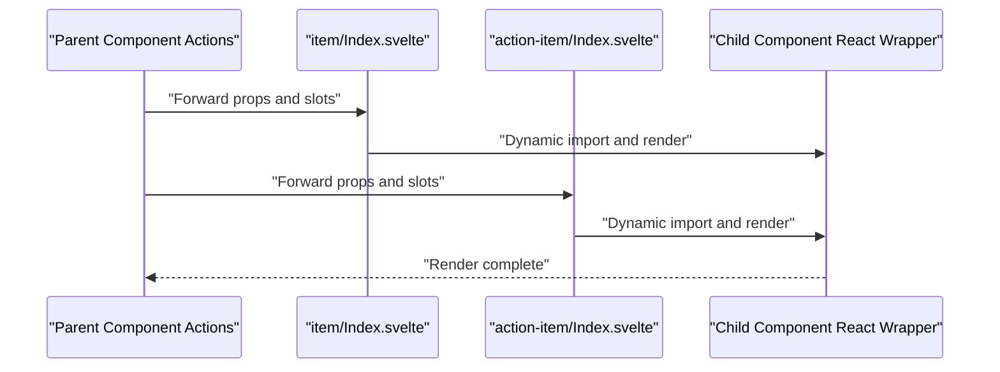
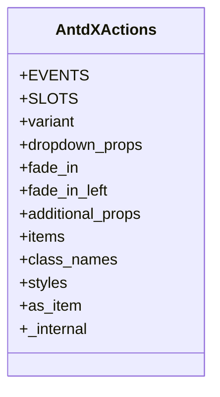
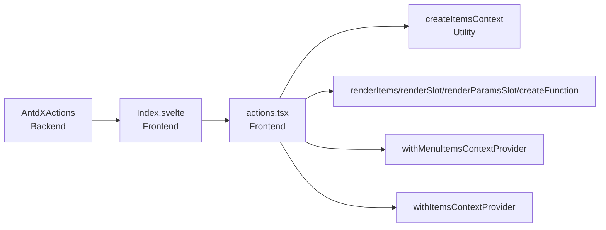

# Actions Overview

<cite>
**Files referenced in this document**
- [frontend/antdx/actions/Index.svelte](file://frontend/antdx/actions/Index.svelte)
- [frontend/antdx/actions/actions.tsx](file://frontend/antdx/actions/actions.tsx)
- [frontend/antdx/actions/context.ts](file://frontend/antdx/actions/context.ts)
- [frontend/antdx/actions/item/Index.svelte](file://frontend/antdx/actions/item/Index.svelte)
- [frontend/antdx/actions/action-item/Index.svelte](file://frontend/antdx/actions/action-item/Index.svelte)
- [frontend/utils/createItemsContext.tsx](file://frontend/utils/createItemsContext.tsx)
- [backend/modelscope_studio/components/antdx/actions/__init__.py](file://backend/modelscope_studio/components/antdx/actions/__init__.py)
- [docs/components/antdx/actions/README.md](file://docs/components/antdx/actions/README.md)
</cite>

## Table of Contents

1. [Introduction](#introduction)
2. [Project Structure](#project-structure)
3. [Core Components](#core-components)
4. [Architecture Overview](#architecture-overview)
5. [Detailed Component Analysis](#detailed-component-analysis)
6. [Dependency Analysis](#dependency-analysis)
7. [Performance Considerations](#performance-considerations)
8. [Troubleshooting Guide](#troubleshooting-guide)
9. [Conclusion](#conclusion)
10. [Appendix](#appendix)

## Introduction

Actions is a layout and interaction component from the Ant Design X component library in ModelScope Studio, used to quickly configure a set of reusable operation buttons or function entry points in AI scenarios. Through a unified "operation item" model and slots mechanism, it decouples static configuration from dynamic rendering, supporting both direct passing of an items list and declarative organization of operation items as sub-components, thereby improving development efficiency and maintainability.

In the overall architecture of ModelScope Studio, Actions sits between the frontend Svelte layer and the backend Gradio component layer, serving as a "bridge and adapter": the frontend is responsible for rendering Ant Design X's Actions on the page; the backend exposes events and slot capabilities through a custom component class and forwards extra properties to the frontend, achieving a complete interaction loop from the Python side to the browser.

## Project Structure

The Actions component consists of two parts — frontend and backend:

- Frontend (Svelte + React): Responsible for rendering Ant Design X's Actions as page elements, and collecting sub-items through the slot and context system.
- Backend (Python + Gradio): Defines the component interface, events, and slots, responsible for binding and forwarding properties and events.

**Diagram Sources**

- [frontend/antdx/actions/Index.svelte:1-77](file://frontend/antdx/actions/Index.svelte#L1-L77)
- [frontend/antdx/actions/actions.tsx:1-123](file://frontend/antdx/actions/actions.tsx#L1-L123)
- [frontend/antdx/actions/context.ts:1-7](file://frontend/antdx/actions/context.ts#L1-L7)
- [frontend/antdx/actions/item/Index.svelte:1-60](file://frontend/antdx/actions/item/Index.svelte#L1-L60)
- [frontend/antdx/actions/action-item/Index.svelte:1-99](file://frontend/antdx/actions/action-item/Index.svelte#L1-L99)
- [frontend/utils/createItemsContext.tsx:1-274](file://frontend/utils/createItemsContext.tsx#L1-L274)
- [backend/modelscope_studio/components/antdx/actions/**init**.py:1-112](file://backend/modelscope_studio/components/antdx/actions/__init__.py#L1-L112)

**Section Sources**

- [frontend/antdx/actions/Index.svelte:1-77](file://frontend/antdx/actions/Index.svelte#L1-L77)
- [frontend/antdx/actions/actions.tsx:1-123](file://frontend/antdx/actions/actions.tsx#L1-L123)
- [frontend/antdx/actions/context.ts:1-7](file://frontend/antdx/actions/context.ts#L1-L7)
- [frontend/antdx/actions/item/Index.svelte:1-60](file://frontend/antdx/actions/item/Index.svelte#L1-L60)
- [frontend/antdx/actions/action-item/Index.svelte:1-99](file://frontend/antdx/actions/action-item/Index.svelte#L1-L99)
- [frontend/utils/createItemsContext.tsx:1-274](file://frontend/utils/createItemsContext.tsx#L1-L274)
- [backend/modelscope_studio/components/antdx/actions/**init**.py:1-112](file://backend/modelscope_studio/components/antdx/actions/__init__.py#L1-L112)

## Core Components

- Actions main component: Responsible for receiving items or operation items from slots, customizing dropdown menu rendering with dropdownProps, and rendering the final Ant Design X Actions on the page.
- Operation item context: Through the ItemsContext provided by createItemsContext, collects child operation items (including default slots and named slots), and supports merging and forwarding of props, slots, and children for sub-items.
- Sub-component wrappers: item and action-item wrap the "operation container" and "specific operation item" respectively, handling property forwarding, visibility control, style and ID injection, and event mapping (e.g., item_click is mapped to itemClick).

**Section Sources**

- [frontend/antdx/actions/actions.tsx:1-123](file://frontend/antdx/actions/actions.tsx#L1-L123)
- [frontend/antdx/actions/context.ts:1-7](file://frontend/antdx/actions/context.ts#L1-L7)
- [frontend/utils/createItemsContext.tsx:1-274](file://frontend/utils/createItemsContext.tsx#L1-L274)
- [frontend/antdx/actions/item/Index.svelte:1-60](file://frontend/antdx/actions/item/Index.svelte#L1-L60)
- [frontend/antdx/actions/action-item/Index.svelte:1-99](file://frontend/antdx/actions/action-item/Index.svelte#L1-L99)

## Architecture Overview

The Actions runtime flow is as follows:

- The frontend Svelte layer dynamically imports the React wrapper actions.tsx via Index.svelte.
- actions.tsx uses context and slot utility functions to convert items and dropdownProps into the data structure required by Ant Design X.
- The backend component class declares events and slots on the Python side, forwarding extra properties and visibility information to the frontend.
- Finally, Ant Design X's Actions renders the UI and triggers callback events.

**Diagram Sources**

- [backend/modelscope_studio/components/antdx/actions/**init**.py:1-112](file://backend/modelscope_studio/components/antdx/actions/__init__.py#L1-L112)
- [frontend/antdx/actions/Index.svelte:1-77](file://frontend/antdx/actions/Index.svelte#L1-L77)
- [frontend/antdx/actions/actions.tsx:1-123](file://frontend/antdx/actions/actions.tsx#L1-L123)
- [frontend/utils/createItemsContext.tsx:1-274](file://frontend/utils/createItemsContext.tsx#L1-L274)

## Detailed Component Analysis

### Actions Main Component (React Wrapper)

- Responsibility: Integrates Ant Design X's Actions with the slot and context system, responsible for merging and rendering items and dropdownProps.
- Key points:
  - Uses withItemsContextProvider and withMenuItemsContextProvider to inject items and menu item contexts.
  - Converts slot content into the structure required by Ant Design X using utility functions such as renderItems, renderSlot, and renderParamsSlot.
  - Conditionally merges dropdownProps, only injecting when valid values exist to avoid redundant configuration.

**Diagram Sources**

- [frontend/antdx/actions/actions.tsx:1-123](file://frontend/antdx/actions/actions.tsx#L1-L123)
- [frontend/utils/createItemsContext.tsx:1-274](file://frontend/utils/createItemsContext.tsx#L1-L274)

**Section Sources**

- [frontend/antdx/actions/actions.tsx:1-123](file://frontend/antdx/actions/actions.tsx#L1-L123)

### Operation Item Context (createItemsContext)

- Responsibility: Provides ItemsContext for collecting and updating "operation item" data, supporting multiple slots (default and other named slots).
- Key points:
  - setItem supports updating individual items by slot key and index, using an immutable update strategy internally, combined with useEffect to trigger the onChange callback.
  - ItemHandler encapsulates the sub-component's props, slots, and children into a standard Item structure and writes it to the context.
  - Optimizes rendering and callback overhead via useMemoizedEqualValue and useMemoizedFn.

**Diagram Sources**

- [frontend/utils/createItemsContext.tsx:1-274](file://frontend/utils/createItemsContext.tsx#L1-L274)

**Section Sources**

- [frontend/utils/createItemsContext.tsx:1-274](file://frontend/utils/createItemsContext.tsx#L1-L274)
- [frontend/antdx/actions/context.ts:1-7](file://frontend/antdx/actions/context.ts#L1-L7)

### Sub-component Wrappers (item and action-item)

- Responsibility: Wraps the "operation container" and "specific operation items", handling property forwarding, visibility control, style and ID injection, and event mapping.
- Key points:
  - Index.svelte dynamically loads the corresponding React component via importComponent, ensuring on-demand loading.
  - Unified handling of common properties such as additionalProps, elem\_\*, and visible.
  - action-item maps the item_click event to ensure consistency with Ant Design X callback conventions.

**Diagram Sources**

- [frontend/antdx/actions/item/Index.svelte:1-60](file://frontend/antdx/actions/item/Index.svelte#L1-L60)
- [frontend/antdx/actions/action-item/Index.svelte:1-99](file://frontend/antdx/actions/action-item/Index.svelte#L1-L99)

**Section Sources**

- [frontend/antdx/actions/item/Index.svelte:1-60](file://frontend/antdx/actions/item/Index.svelte#L1-L60)
- [frontend/antdx/actions/action-item/Index.svelte:1-99](file://frontend/antdx/actions/action-item/Index.svelte#L1-L99)

### Backend Component Class (AntdXActions)

- Responsibility: Declares the Actions component interface, events, and slots on the Python side, responsible for forwarding extra properties and visibility information to the frontend.
- Key points:
  - Defines EVENTS: click, dropdown_open_change, dropdown_menu_click, dropdown_menu_deselect, dropdown_menu_open_change, dropdown_menu_select.
  - Defines SLOTS: items, dropdownProps.dropdownRender, dropdownProps.popupRender, dropdownProps.menu.expandIcon, dropdownProps.menu.overflowedIndicator, dropdownProps.menu.items.
  - Provides variant, dropdown_props, fade_in, fade_in_left, and other properties for theme and animation control.

**Diagram Sources**

- [backend/modelscope_studio/components/antdx/actions/**init**.py:1-112](file://backend/modelscope_studio/components/antdx/actions/__init__.py#L1-L112)

**Section Sources**

- [backend/modelscope_studio/components/antdx/actions/**init**.py:1-112](file://backend/modelscope_studio/components/antdx/actions/__init__.py#L1-L112)

## Dependency Analysis

- Frontend dependency chain:
  - Index.svelte depends on actions.tsx.
  - actions.tsx depends on createItemsContext, withItemsContextProvider, withMenuItemsContextProvider, renderItems, renderSlot, renderParamsSlot, createFunction.
  - item/Index.svelte and action-item/Index.svelte depend on their respective React wrappers.
- Backend dependency chain:
  - AntdXActions depends on the frontend directory resolution and the Gradio event system.

**Diagram Sources**

- [backend/modelscope_studio/components/antdx/actions/**init**.py:1-112](file://backend/modelscope_studio/components/antdx/actions/__init__.py#L1-L112)
- [frontend/antdx/actions/Index.svelte:1-77](file://frontend/antdx/actions/Index.svelte#L1-L77)
- [frontend/antdx/actions/actions.tsx:1-123](file://frontend/antdx/actions/actions.tsx#L1-L123)
- [frontend/utils/createItemsContext.tsx:1-274](file://frontend/utils/createItemsContext.tsx#L1-L274)

**Section Sources**

- [frontend/antdx/actions/actions.tsx:1-123](file://frontend/antdx/actions/actions.tsx#L1-L123)
- [frontend/utils/createItemsContext.tsx:1-274](file://frontend/utils/createItemsContext.tsx#L1-L274)
- [backend/modelscope_studio/components/antdx/actions/**init**.py:1-112](file://backend/modelscope_studio/components/antdx/actions/__init__.py#L1-L112)

## Performance Considerations

- On-demand loading: Index.svelte dynamically loads the React wrapper on demand via importComponent, reducing the initial bundle size.
- Immutable updates: createItemsContext uses an immutable update strategy to avoid unnecessary re-renders.
- Computation caching: actions.tsx uses useMemo to cache dropdownProps and the final items, reducing rendering costs.
- Event mapping: Converts string-form callbacks to functions via createFunction to avoid repeated binding.

[This section contains general performance recommendations; no specific file references required]

## Troubleshooting Guide

- Cannot display operation items
  - Check if slots are used correctly or if items are passed in; confirm that slot key names match component declarations.
  - Reference: [frontend/antdx/actions/actions.tsx:31-116](file://frontend/antdx/actions/actions.tsx#L31-L116)
- Dropdown menu not working
  - Confirm dropdownProps is correctly merged; check if menu items are empty.
  - Reference: [frontend/antdx/actions/actions.tsx:39-96](file://frontend/antdx/actions/actions.tsx#L39-L96)
- Events not triggered
  - Confirm that backend EVENTS are registered; check frontend event mapping (e.g., item_click -> itemClick).
  - Reference: [backend/modelscope_studio/components/antdx/actions/**init**.py:26-46](file://backend/modelscope_studio/components/antdx/actions/__init__.py#L26-L46)
  - Reference: [frontend/antdx/actions/action-item/Index.svelte:54-57](file://frontend/antdx/actions/action-item/Index.svelte#L54-L57)

**Section Sources**

- [frontend/antdx/actions/actions.tsx:31-116](file://frontend/antdx/actions/actions.tsx#L31-L116)
- [backend/modelscope_studio/components/antdx/actions/**init**.py:26-46](file://backend/modelscope_studio/components/antdx/actions/__init__.py#L26-L46)
- [frontend/antdx/actions/action-item/Index.svelte:54-57](file://frontend/antdx/actions/action-item/Index.svelte#L54-L57)

## Conclusion

Actions plays the role of an "operation entry aggregator" in ModelScope Studio, achieving flexible, extensible, and high-performance operation list rendering through Ant Design X's powerful capabilities and slot/context mechanisms. It is suitable both for quickly building "one-click execute" functions in AI applications, and for implementing highly customized interaction experiences in complex scenarios through the slot and event system.

[This section contains summary content; no specific file references required]

## Appendix

- For quick-start examples, refer to the official documentation example page.
  - Reference: [docs/components/antdx/actions/README.md:1-8](file://docs/components/antdx/actions/README.md#L1-L8)

**Section Sources**

- [docs/components/antdx/actions/README.md:1-8](file://docs/components/antdx/actions/README.md#L1-L8)
