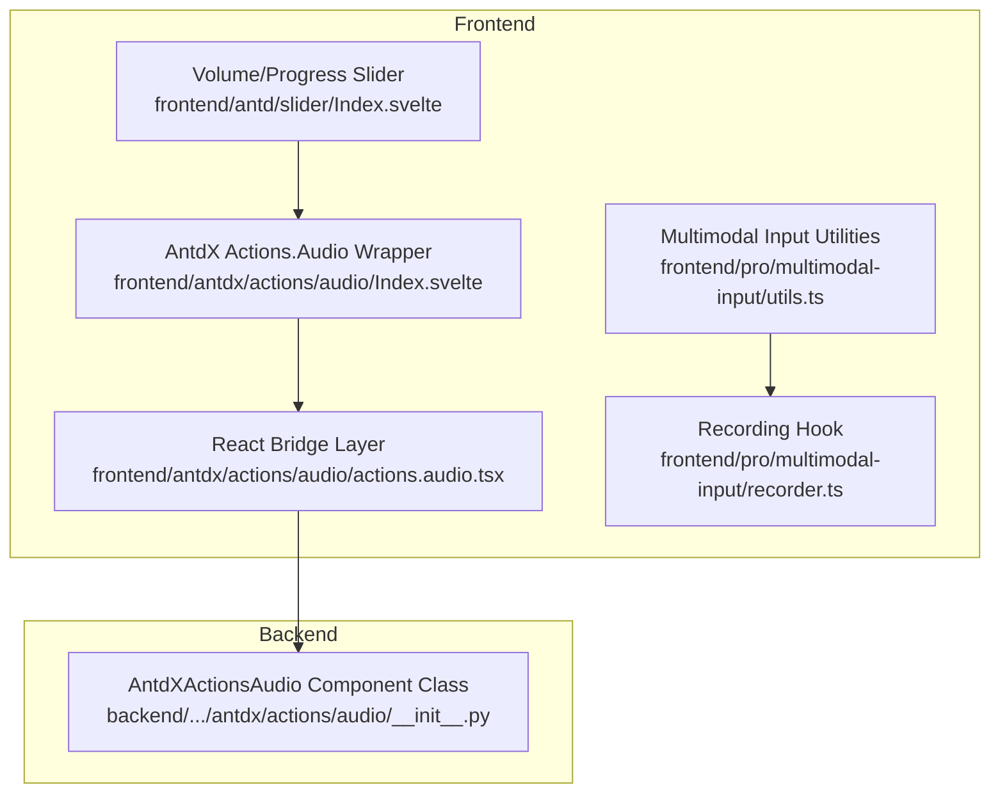
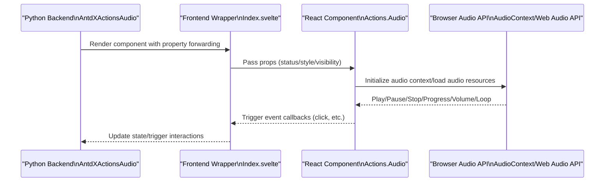
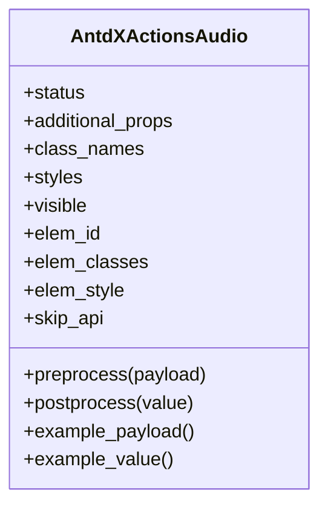
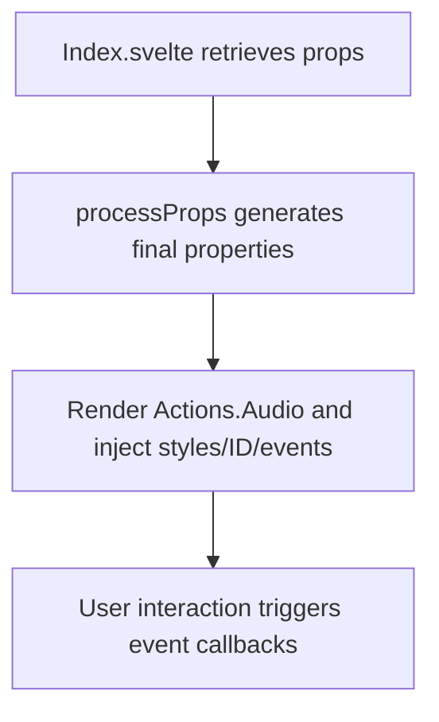
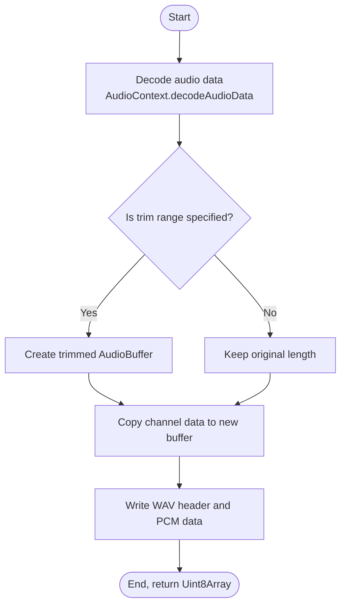
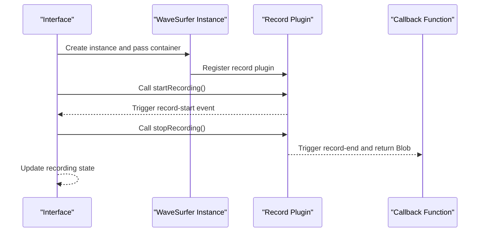
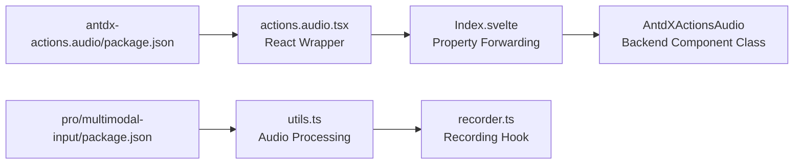

# Audio Component

<cite>
**Files referenced in this document**
- [frontend/antdx/actions/audio/Index.svelte](file://frontend/antdx/actions/audio/Index.svelte)
- [frontend/antdx/actions/audio/actions.audio.tsx](file://frontend/antdx/actions/audio/actions.audio.tsx)
- [backend/modelscope_studio/components/antdx/actions/audio/__init__.py](file://backend/modelscope_studio/components/antdx/actions/audio/__init__.py)
- [frontend/pro/multimodal-input/utils.ts](file://frontend/pro/multimodal-input/utils.ts)
- [frontend/pro/multimodal-input/recorder.ts](file://frontend/pro/multimodal-input/recorder.ts)
- [frontend/antd/slider/Index.svelte](file://frontend/antd/slider/Index.svelte)
- [docs/components/pro/multimodal_input/README.md](file://docs/components/pro/multimodal_input/README.md)
- [docs/components/pro/multimodal_input/README-zh_CN.md](file://docs/components/pro/multimodal_input/README-zh_CN.md)
- [frontend/pro/multimodal-input/package.json](file://frontend/pro/multimodal-input/package.json)
- [frontend/antdx/actions/audio/package.json](file://frontend/antdx/actions/audio/package.json)
</cite>

## Table of Contents

1. [Introduction](#introduction)
2. [Project Structure](#project-structure)
3. [Core Components](#core-components)
4. [Architecture Overview](#architecture-overview)
5. [Component Details](#component-details)
6. [Dependency Analysis](#dependency-analysis)
7. [Performance Considerations](#performance-considerations)
8. [Troubleshooting Guide](#troubleshooting-guide)
9. [Conclusion](#conclusion)
10. [Appendix](#appendix)

## Introduction

This document systematically organizes and explains the implementation and usage of the Audio component in the model library frontend, covering the following key areas:

- Audio playback and control capabilities (play/pause/stop, progress, volume, loop)
- Audio file loading and processing (decoding, trimming, exporting)
- Recording and waveform visualization (microphone recording, waveform drawing)
- Integration practices in different business scenarios (voice broadcasting, sound effects playback, audio preview)
- Compatibility and performance optimization recommendations
- Design techniques for enhancing user experience

## Project Structure

Audio-related capabilities are primarily distributed in the following locations:

- Frontend Svelte wrapper layer: Bridges Ant Design X's Actions.Audio component to the Gradio ecosystem
- Backend Python component: AntdXActionsAudio, responsible for property forwarding and rendering control
- Multimodal input Pro component: Provides recording, audio processing, and export capabilities
- General UI components: Such as Slider, for volume/progress control

**Diagram Sources**

- [frontend/antdx/actions/audio/Index.svelte:1-59](file://frontend/antdx/actions/audio/Index.svelte#L1-L59)
- [frontend/antdx/actions/audio/actions.audio.tsx:1-17](file://frontend/antdx/actions/audio/actions.audio.tsx#L1-L17)
- [backend/modelscope_studio/components/antdx/actions/audio/**init**.py:10-71](file://backend/modelscope_studio/components/antdx/actions/audio/__init__.py#L10-L71)
- [frontend/pro/multimodal-input/utils.ts:1-126](file://frontend/pro/multimodal-input/utils.ts#L1-L126)
- [frontend/pro/multimodal-input/recorder.ts:1-48](file://frontend/pro/multimodal-input/recorder.ts#L1-L48)
- [frontend/antd/slider/Index.svelte:62-84](file://frontend/antd/slider/Index.svelte#L62-L84)

**Section Sources**

- [frontend/antdx/actions/audio/Index.svelte:1-59](file://frontend/antdx/actions/audio/Index.svelte#L1-L59)
- [frontend/antdx/actions/audio/actions.audio.tsx:1-17](file://frontend/antdx/actions/audio/actions.audio.tsx#L1-L17)
- [backend/modelscope_studio/components/antdx/actions/audio/**init**.py:10-71](file://backend/modelscope_studio/components/antdx/actions/audio/__init__.py#L10-L71)
- [frontend/pro/multimodal-input/utils.ts:1-126](file://frontend/pro/multimodal-input/utils.ts#L1-L126)
- [frontend/pro/multimodal-input/recorder.ts:1-48](file://frontend/pro/multimodal-input/recorder.ts#L1-L48)
- [frontend/antd/slider/Index.svelte:62-84](file://frontend/antd/slider/Index.svelte#L62-L84)

## Core Components

- AntdXActionsAudio (backend component class): Encapsulates Ant Design X's Actions.Audio, providing properties such as status, style, and visibility, and declares skip_api to directly render the frontend component.
- Actions.Audio (frontend wrapper): Bridges the React component to the Gradio ecosystem through Svelte wrapping, forwarding properties to Ant Design X's Actions.Audio.
- Audio processing utilities (Pro multimodal input): Provides capabilities for converting AudioBuffer to WAV, trimming audio by time range, decoding from Blob and exporting, etc.
- Recording Hook: Based on the record plugin for wavesurfer.js, provides recording start/end callbacks and recording state management.

**Section Sources**

- [backend/modelscope_studio/components/antdx/actions/audio/**init**.py:10-71](file://backend/modelscope_studio/components/antdx/actions/audio/__init__.py#L10-L71)
- [frontend/antdx/actions/audio/actions.audio.tsx:1-17](file://frontend/antdx/actions/audio/actions.audio.tsx#L1-L17)
- [frontend/pro/multimodal-input/utils.ts:1-126](file://frontend/pro/multimodal-input/utils.ts#L1-L126)
- [frontend/pro/multimodal-input/recorder.ts:1-48](file://frontend/pro/multimodal-input/recorder.ts#L1-L48)

## Architecture Overview

The audio capability in the frontend bridges React components through the Svelte component; the backend passes properties to the frontend through a custom component class. It also provides recording and audio processing tools to complete the "recording → preview → export" loop in multimodal input scenarios.

**Diagram Sources**

- [backend/modelscope_studio/components/antdx/actions/audio/**init**.py:10-71](file://backend/modelscope_studio/components/antdx/actions/audio/__init__.py#L10-L71)
- [frontend/antdx/actions/audio/Index.svelte:19-41](file://frontend/antdx/actions/audio/Index.svelte#L19-L41)
- [frontend/antdx/actions/audio/actions.audio.tsx:6-14](file://frontend/antdx/actions/audio/actions.audio.tsx#L6-L14)

## Component Details

### AntdXActionsAudio (Backend Component Class)

- Responsibility boundary: Responsible for mapping frontend components to the Python side, providing properties such as status, style, and visibility; declares skip_api to avoid redundant processing.
- Key points: Event listener binding, property forwarding, render control.

**Diagram Sources**

- [backend/modelscope_studio/components/antdx/actions/audio/**init**.py:10-71](file://backend/modelscope_studio/components/antdx/actions/audio/__init__.py#L10-L71)

**Section Sources**

- [backend/modelscope_studio/components/antdx/actions/audio/**init**.py:10-71](file://backend/modelscope_studio/components/antdx/actions/audio/__init__.py#L10-L71)

### Actions.Audio (Frontend Wrapper)

- Responsibility boundary: Bridges Ant Design X's Actions.Audio to the Gradio ecosystem through Svelte wrapping, unifying properties and events.
- Key points: sveltify wrapping, slot forwarding, style and ID injection.

**Diagram Sources**

- [frontend/antdx/actions/audio/Index.svelte:19-41](file://frontend/antdx/actions/audio/Index.svelte#L19-L41)
- [frontend/antdx/actions/audio/actions.audio.tsx:6-14](file://frontend/antdx/actions/audio/actions.audio.tsx#L6-L14)

**Section Sources**

- [frontend/antdx/actions/audio/Index.svelte:1-59](file://frontend/antdx/actions/audio/Index.svelte#L1-L59)
- [frontend/antdx/actions/audio/actions.audio.tsx:1-17](file://frontend/antdx/actions/audio/actions.audio.tsx#L1-L17)

### Audio Processing Utilities (Trim/Export)

- Feature overview: Writes AudioBuffer to WAV header and PCM data; trims audio by start/end time; decodes from Blob and exports to WAV.
- Key flow: Decode → Create trimmed buffer → Write to WAV → Return binary data.

**Diagram Sources**

- [frontend/pro/multimodal-input/utils.ts:1-126](file://frontend/pro/multimodal-input/utils.ts#L1-L126)

**Section Sources**

- [frontend/pro/multimodal-input/utils.ts:1-126](file://frontend/pro/multimodal-input/utils.ts#L1-L126)

### Recording and Waveform Visualization

- Recording: Based on the record plugin for wavesurfer.js, provides start/stop callbacks and recording state.
- Waveform: Initializes a WaveSurfer container and registers the record plugin to display waveforms in real time.

**Diagram Sources**

- [frontend/pro/multimodal-input/recorder.ts:24-41](file://frontend/pro/multimodal-input/recorder.ts#L24-L41)

**Section Sources**

- [frontend/pro/multimodal-input/recorder.ts:1-48](file://frontend/pro/multimodal-input/recorder.ts#L1-L48)

### Volume/Progress Control (Slider)

- Uses the Slider component to implement two-way control of volume and progress; the onValueChange event is used to synchronize state.
- Adapts to Gradio's property forwarding mechanism to ensure consistency with backend state.

**Section Sources**

- [frontend/antd/slider/Index.svelte:62-84](file://frontend/antd/slider/Index.svelte#L62-L84)

## Dependency Analysis

- Frontend package exports: Two key packages each export a Svelte entry point for loading by the Gradio runtime.
- Component coupling: AntdXActionsAudio and the frontend wrapper component are loosely coupled, interacting through property forwarding.
- Toolchain: Audio processing depends on the Web Audio API; recording depends on wavesurfer.js and its record plugin.

**Diagram Sources**

- [frontend/pro/multimodal-input/package.json:1-14](file://frontend/pro/multimodal-input/package.json#L1-L14)
- [frontend/antdx/actions/audio/package.json:1-14](file://frontend/antdx/actions/audio/package.json#L1-L14)
- [frontend/pro/multimodal-input/utils.ts:1-126](file://frontend/pro/multimodal-input/utils.ts#L1-L126)
- [frontend/pro/multimodal-input/recorder.ts:1-48](file://frontend/pro/multimodal-input/recorder.ts#L1-L48)
- [frontend/antdx/actions/audio/Index.svelte:1-59](file://frontend/antdx/actions/audio/Index.svelte#L1-L59)
- [backend/modelscope_studio/components/antdx/actions/audio/**init**.py:10-71](file://backend/modelscope_studio/components/antdx/actions/audio/__init__.py#L10-L71)

**Section Sources**

- [frontend/pro/multimodal-input/package.json:1-14](file://frontend/pro/multimodal-input/package.json#L1-L14)
- [frontend/antdx/actions/audio/package.json:1-14](file://frontend/antdx/actions/audio/package.json#L1-L14)

## Performance Considerations

- Audio decoding and trimming: Prioritize browser-side processing to avoid the overhead of large file network transfers; for long audio files, consider segmented processing or deferred decoding.
- Buffer management: Copy only the necessary segments during trimming to reduce memory usage; confirm sample rate and channel count consistency before exporting.
- Recording performance: Set normalize and container size appropriately to avoid frequent redraws; be aware of background playback restrictions and permission requests on mobile devices.
- UI responsiveness: Use controlled component mode for volume/progress sliders to avoid unnecessary re-renders; use memoized functions for event callbacks to reduce jitter.

## Troubleshooting Guide

- Cannot play audio
  - Check if the audio format is supported by the browser; try converting to common formats such as WAV/MP3.
  - Confirm AudioContext initialization and permissions (some browsers require a user gesture to activate).
- No recording output
  - Confirm device permissions are granted; check if the container is correctly mounted.
  - Verify that the record-end callback is triggered and the Blob is not empty.
- Export failure
  - Confirm the trim range is valid (start/end not out of bounds); check sample rate and channel count consistency.
- Slider not working
  - Check if the onValueChange event is correctly updating state; confirm the synchronization logic between controlled value and fallback value.

**Section Sources**

- [frontend/pro/multimodal-input/utils.ts:60-126](file://frontend/pro/multimodal-input/utils.ts#L60-L126)
- [frontend/pro/multimodal-input/recorder.ts:24-41](file://frontend/pro/multimodal-input/recorder.ts#L24-L41)
- [frontend/antd/slider/Index.svelte:62-84](file://frontend/antd/slider/Index.svelte#L62-L84)

## Conclusion

The Audio component in the model library frontend implements full capabilities from playback control to recording export through a "backend component class + frontend wrapper + toolchain" approach. Combined with multimodal input scenarios, it enables quick construction of voice broadcasting, sound effects playback, and audio preview experiences. It is recommended to pay attention to format compatibility, performance optimization, and permission handling in actual projects to achieve a more stable user experience.

## Appendix

### Usage Examples (Scenarios)

- Voice broadcasting
  - Use AntdXActionsAudio to render a play button, control volume with Slider; trigger play/pause via event callbacks.
- Sound effects playback
  - Load local sound effect files, set looping playback and volume; switch state in interaction events.
- Audio preview
  - After recording, decode the Blob to an AudioBuffer, then export to WAV; play in the preview area and provide a download option.

**Section Sources**

- [docs/components/pro/multimodal_input/README.md:1-43](file://docs/components/pro/multimodal_input/README.md#L1-L43)
- [docs/components/pro/multimodal_input/README-zh_CN.md:1-43](file://docs/components/pro/multimodal_input/README-zh_CN.md#L1-L43)
