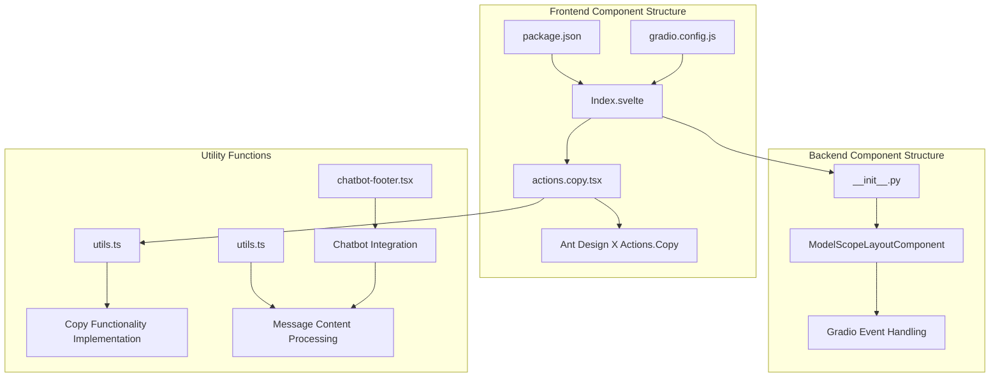
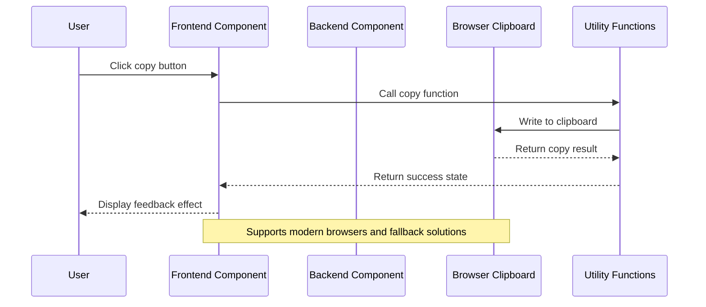
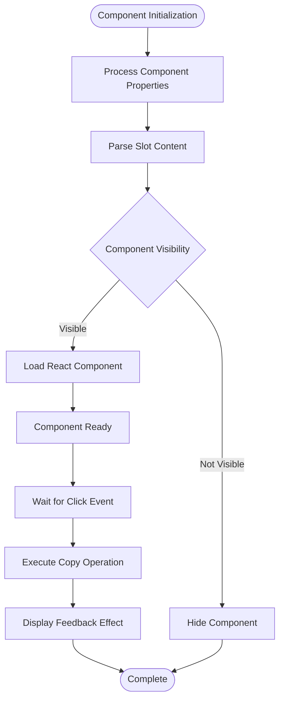
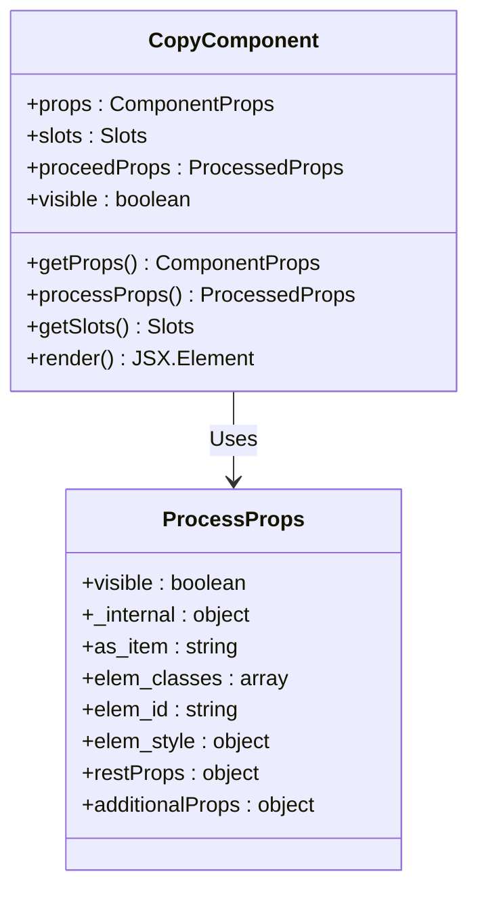
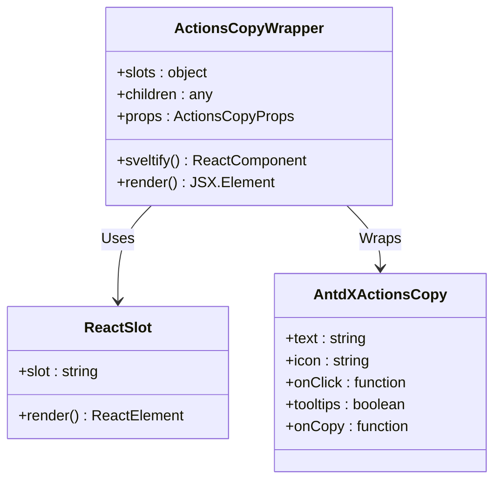
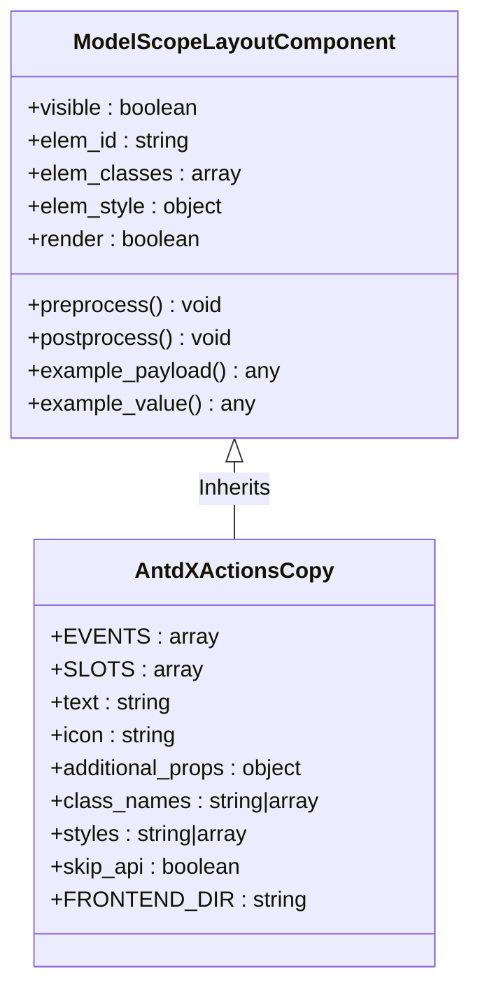
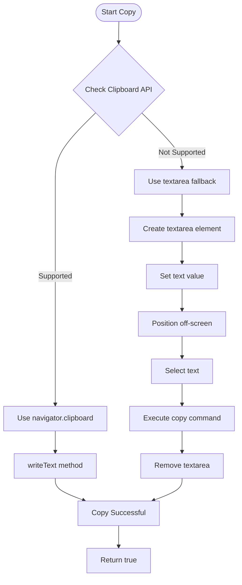
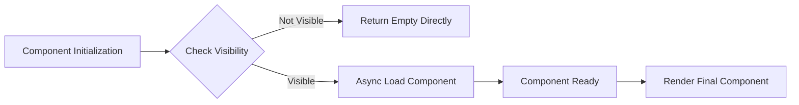

# Copy Component

<cite>
**Files referenced in this document**
- [actions.copy.tsx](file://frontend/antdx/actions/copy/actions.copy.tsx)
- [Index.svelte](file://frontend/antdx/actions/copy/Index.svelte)
- [__init__.py](file://backend/modelscope_studio/components/antdx/actions/copy/__init__.py)
- [package.json](file://frontend/antdx/actions/copy/package.json)
- [gradio.config.js](file://frontend/antdx/actions/copy/gradio.config.js)
- [utils.ts](file://frontend/globals/components/markdown/utils.ts)
- [chatbot-footer.tsx](file://frontend/pro/chatbot/chatbot-footer.tsx)
- [utils.ts](file://frontend/pro/chatbot/utils.ts)
- [basic.py](file://docs/components/antdx/actions/demos/basic.py)
</cite>

## Table of Contents

1. [Introduction](#introduction)
2. [Project Structure](#project-structure)
3. [Core Components](#core-components)
4. [Architecture Overview](#architecture-overview)
5. [Detailed Component Analysis](#detailed-component-analysis)
6. [Dependency Analysis](#dependency-analysis)
7. [Performance Considerations](#performance-considerations)
8. [Troubleshooting Guide](#troubleshooting-guide)
9. [Conclusion](#conclusion)

## Introduction

The Copy Component is a component in ModelScope Studio for quickly configuring copy functionality, implemented based on Ant Design X's Actions.Copy. This component provides a unified copy operation interface, supporting copying of multiple data types including plain text, links, code snippets, and other common scenarios.

The component adopts a front-end/back-end separation design pattern, with the frontend built using Svelte and the backend wrapped through Gradio components, implementing complete lifecycle management for copy functionality.

## Project Structure

The Copy Component is located in the Ant Design X component library with the following structure:



**Diagram Sources**

- [Index.svelte:1-60](file://frontend/antdx/actions/copy/Index.svelte#L1-L60)
- [actions.copy.tsx:1-22](file://frontend/antdx/actions/copy/actions.copy.tsx#L1-L22)
- [**init**.py:1-72](file://backend/modelscope_studio/components/antdx/actions/copy/__init__.py#L1-L72)

**Section Sources**

- [Index.svelte:1-60](file://frontend/antdx/actions/copy/Index.svelte#L1-L60)
- [actions.copy.tsx:1-22](file://frontend/antdx/actions/copy/actions.copy.tsx#L1-L22)
- [**init**.py:1-72](file://backend/modelscope_studio/components/antdx/actions/copy/__init__.py#L1-L72)

## Core Components

The Copy Component consists of three main parts:

### Frontend Component Layer

- **Index.svelte**: The main frontend entry component, responsible for property handling and rendering logic
- **actions.copy.tsx**: React wrapper that adapts Ant Design X's Actions.Copy component to the Svelte environment

### Backend Component Layer

- \***\*init**.py\*\*: Python backend component definition, inheriting from ModelScopeLayoutComponent

### Utility Function Layer

- **utils.ts**: Provides the core implementation of copy functionality, including Clipboard API and fallback solutions

**Section Sources**

- [Index.svelte:19-44](file://frontend/antdx/actions/copy/Index.svelte#L19-L44)
- [actions.copy.tsx:7-19](file://frontend/antdx/actions/copy/actions.copy.tsx#L7-L19)
- [**init**.py:10-72](file://backend/modelscope_studio/components/antdx/actions/copy/__init__.py#L10-L72)

## Architecture Overview

The Copy Component adopts a layered architecture design, achieving clear separation of concerns:



**Diagram Sources**

- [utils.ts:382-410](file://frontend/globals/components/markdown/utils.ts#L382-L410)
- [Index.svelte:46-59](file://frontend/antdx/actions/copy/Index.svelte#L46-L59)

### Component Interaction Flow



**Diagram Sources**

- [Index.svelte:19-44](file://frontend/antdx/actions/copy/Index.svelte#L19-L44)
- [actions.copy.tsx:8-18](file://frontend/antdx/actions/copy/actions.copy.tsx#L8-L18)

## Detailed Component Analysis

### Frontend Component Implementation

#### Index.svelte Analysis

Index.svelte is the main frontend entry for the copy component, responsible for the following key functions:



**Diagram Sources**

- [Index.svelte:12-44](file://frontend/antdx/actions/copy/Index.svelte#L12-L44)

#### actions.copy.tsx Analysis

actions.copy.tsx acts as a React wrapper, implementing seamless integration with Ant Design X:



**Diagram Sources**

- [actions.copy.tsx:7-19](file://frontend/antdx/actions/copy/actions.copy.tsx#L7-L19)

**Section Sources**

- [Index.svelte:19-59](file://frontend/antdx/actions/copy/Index.svelte#L19-L59)
- [actions.copy.tsx:7-21](file://frontend/antdx/actions/copy/actions.copy.tsx#L7-L21)

### Backend Component Implementation

#### Python Component Analysis

The backend component inherits from ModelScopeLayoutComponent, providing full Gradio integration:



**Diagram Sources**

- [**init**.py:10-72](file://backend/modelscope_studio/components/antdx/actions/copy/__init__.py#L10-L72)

**Section Sources**

- [**init**.py:15-19](file://backend/modelscope_studio/components/antdx/actions/copy/__init__.py#L15-L19)
- [**init**.py:21-22](file://backend/modelscope_studio/components/antdx/actions/copy/__init__.py#L21-L22)

### Copy Functionality Implementation

#### Core Copy Logic

The copy functionality is implemented through utility functions in utils.ts, supporting both modern browsers and legacy browsers:



**Diagram Sources**

- [utils.ts:382-410](file://frontend/globals/components/markdown/utils.ts#L382-L410)

**Section Sources**

- [utils.ts:382-410](file://frontend/globals/components/markdown/utils.ts#L382-L410)

## Dependency Analysis

### Component Dependencies

The dependency relationships of the Copy Component are relatively straightforward, primarily depending on the Ant Design X and Gradio ecosystems:

```mermaid
graph TB
subgraph "External Dependencies"
A[@ant-design/x] --> B[Actions.Copy]
C[Gradio] --> D[Event System]
E[Svelte Preprocess React] --> F[Component Wrapper]
end
subgraph "Internal Dependencies"
G[utils.ts] --> H[Copy Functionality]
I[markdown component] --> J[Code Block Copy]
K[chatbot component] --> L[Message Copy]
end
subgraph "Copy Component"
B --> M[ActionsCopyWrapper]
F --> M
H --> M
M --> N[Index.svelte]
end
M --> O[Python Backend Component]
O --> D
```

**Diagram Sources**

- [actions.copy.tsx:4](file://frontend/antdx/actions/copy/actions.copy.tsx#L4)
- [Index.svelte:10](file://frontend/antdx/actions/copy/Index.svelte#L10)

### Version Compatibility

Supported version requirements for the component:

- Node.js: >= 14.0.0
- Svelte: >= 3.0.0
- Ant Design X: >= latest
- Gradio: >= latest

**Section Sources**

- [package.json:1-15](file://frontend/antdx/actions/copy/package.json#L1-L15)
- [gradio.config.js:1-4](file://frontend/antdx/actions/copy/gradio.config.js#L1-L4)

## Performance Considerations

### Render Optimization

The copy component adopts a lazy loading strategy, loading React components only when needed:



**Diagram Sources**

- [Index.svelte:46-59](file://frontend/antdx/actions/copy/Index.svelte#L46-L59)

### Memory Management

The component implements appropriate memory cleanup mechanisms:

- Automatically removes event listeners
- Promptly clears temporary DOM elements
- Avoids memory leaks

## Troubleshooting Guide

### Common Issues and Solutions

#### Copy Functionality Not Working

**Problem Description**: User clicks the copy button but cannot copy to clipboard

**Possible Causes**:

1. Browser security policy restrictions
2. HTTPS environment issues
3. Insufficient permissions

**Solutions**:

1. Ensure the website is running in an HTTPS environment
2. Check browser permission settings
3. Try manually triggering the copy operation

#### Component Rendering Anomaly

**Problem Description**: Copy component cannot display or render normally

**Possible Causes**:

1. Frontend build configuration issues
2. Dependency package version conflicts
3. Slot content format errors

**Solutions**:

1. Check frontend build logs
2. Update dependency packages to compatible versions
3. Validate slot content format

**Section Sources**

- [utils.ts:382-410](file://frontend/globals/components/markdown/utils.ts#L382-L410)
- [Index.svelte:46-59](file://frontend/antdx/actions/copy/Index.svelte#L46-L59)

## Conclusion

The Copy Component is a well-designed general-purpose component with the following characteristics:

### Technical Advantages

- **Modular design**: Clear front-end/back-end separation architecture
- **Strong compatibility**: Supports multiple browser environments
- **Easy to extend**: Slot system supports flexible customization
- **Performance optimization**: Lazy loading and memory management

### Use Cases

- Text content copying
- Code snippet copying
- Link sharing
- File download link copying

### Best Practices

1. Reasonably use the slot system for customization
2. Pay attention to browser compatibility issues
3. Implement appropriate error handling mechanisms
4. Consider user experience feedback design

This component provides a reliable copy functionality foundation for ModelScope Studio and can meet the needs of most application scenarios.
