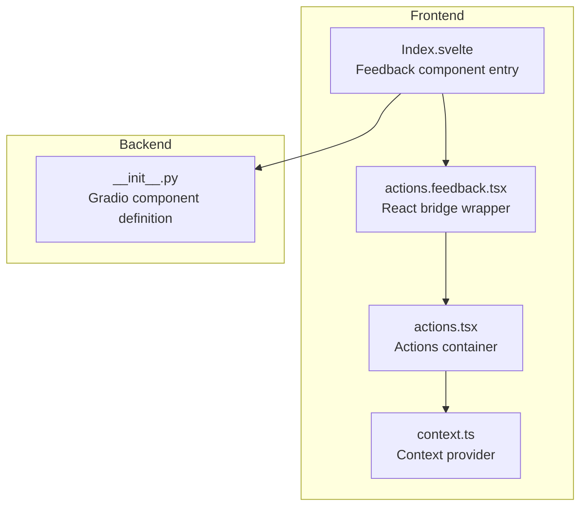
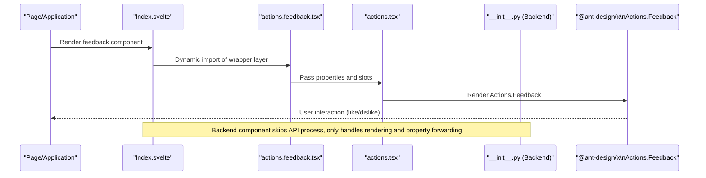
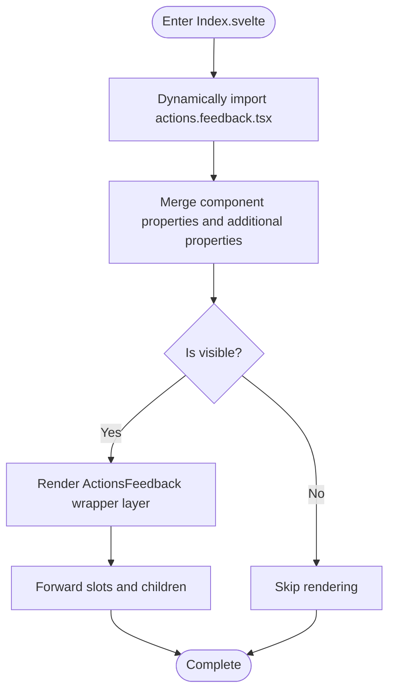
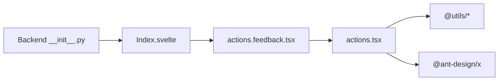

# Feedback Component

<cite>
**Files referenced in this document**
- [frontend/antdx/actions/feedback/actions.feedback.tsx](file://frontend/antdx/actions/feedback/actions.feedback.tsx)
- [frontend/antdx/actions/feedback/Index.svelte](file://frontend/antdx/actions/feedback/Index.svelte)
- [frontend/antdx/actions/feedback/package.json](file://frontend/antdx/actions/feedback/package.json)
- [frontend/antdx/actions/actions.tsx](file://frontend/antdx/actions/actions.tsx)
- [frontend/antdx/actions/context.ts](file://frontend/antdx/actions/context.ts)
- [backend/modelscope_studio/components/antdx/actions/feedback/__init__.py](file://backend/modelscope_studio/components/antdx/actions/feedback/__init__.py)
- [backend/modelscope_studio/components/antdx/__init__.py](file://backend/modelscope_studio/components/antdx/__init__.py)
</cite>

## Table of Contents

1. [Introduction](#introduction)
2. [Project Structure](#project-structure)
3. [Core Components](#core-components)
4. [Architecture Overview](#architecture-overview)
5. [Detailed Component Analysis](#detailed-component-analysis)
6. [Dependency Analysis](#dependency-analysis)
7. [Performance Considerations](#performance-considerations)
8. [Troubleshooting Guide](#troubleshooting-guide)
9. [Conclusion](#conclusion)
10. [Appendix](#appendix)

## Introduction

This document systematically explains the design and implementation of the Feedback component, focusing on user feedback collection, data flow, and processing mechanisms, and providing reusable usage patterns (such as satisfaction surveys, feature evaluations, issue reports, etc.). The component is based on Ant Design X's Actions.Feedback capability and achieves frontend-backend integrated integration through a Svelte wrapper layer in the Gradio ecosystem, with the following key features:

- The frontend is exposed as a Svelte component, internally bridging a React implementation.
- The backend participates in interface rendering and event dispatching as a Gradio component.
- Supports three feedback values — "like"/"dislike"/"default" — for subsequent statistics and analysis.
- Oriented toward product improvement and user experience optimization, providing extensible feedback collection and response capabilities.

## Project Structure

The Feedback component is located in the frontend antdx/actions/feedback directory, and the backend is at backend/modelscope_studio/components/antdx/actions/feedback. It works in conjunction with the Actions main container component, forming a "container-sub-item" combination.

Diagram Sources

- [frontend/antdx/actions/feedback/Index.svelte:1-62](file://frontend/antdx/actions/feedback/Index.svelte#L1-L62)
- [frontend/antdx/actions/feedback/actions.feedback.tsx:1-16](file://frontend/antdx/actions/feedback/actions.feedback.tsx#L1-L16)
- [frontend/antdx/actions/actions.tsx:1-123](file://frontend/antdx/actions/actions.tsx#L1-L123)
- [frontend/antdx/actions/context.ts:1-7](file://frontend/antdx/actions/context.ts#L1-L7)
- [backend/modelscope_studio/components/antdx/actions/feedback/**init**.py:25-73](file://backend/modelscope_studio/components/antdx/actions/feedback/__init__.py#L25-L73)

Section Sources

- [frontend/antdx/actions/feedback/Index.svelte:1-62](file://frontend/antdx/actions/feedback/Index.svelte#L1-L62)
- [frontend/antdx/actions/feedback/actions.feedback.tsx:1-16](file://frontend/antdx/actions/feedback/actions.feedback.tsx#L1-L16)
- [frontend/antdx/actions/actions.tsx:1-123](file://frontend/antdx/actions/actions.tsx#L1-L123)
- [frontend/antdx/actions/context.ts:1-7](file://frontend/antdx/actions/context.ts#L1-L7)
- [backend/modelscope_studio/components/antdx/actions/feedback/**init**.py:25-73](file://backend/modelscope_studio/components/antdx/actions/feedback/__init__.py#L25-L73)

## Core Components

- Frontend entry component: Index.svelte loads the feedback component on demand and injects properties and slots, supporting visibility control and style class name concatenation.
- React bridge wrapper: actions.feedback.tsx exports @ant-design/x's Actions.Feedback in Svelte form, simplifying the calling interface.
- Actions container: actions.tsx provides Actions container capabilities, responsible for unified handling of menu items, dropdown rendering, slots, and events.
- Context provider: context.ts provides the Items context, supporting the registration and rendering of Actions sub-items.
- Backend Gradio component: The feedback component backend defines basic capabilities such as properties, visibility, and styles, and declares to skip the standard API process, letting the frontend drive interactions directly.

Section Sources

- [frontend/antdx/actions/feedback/Index.svelte:10-61](file://frontend/antdx/actions/feedback/Index.svelte#L10-L61)
- [frontend/antdx/actions/feedback/actions.feedback.tsx:5-13](file://frontend/antdx/actions/feedback/actions.feedback.tsx#L5-L13)
- [frontend/antdx/actions/actions.tsx:17-120](file://frontend/antdx/actions/actions.tsx#L17-L120)
- [frontend/antdx/actions/context.ts:1-7](file://frontend/antdx/actions/context.ts#L1-L7)
- [backend/modelscope_studio/components/antdx/actions/feedback/**init**.py:28-73](file://backend/modelscope_studio/components/antdx/actions/feedback/__init__.py#L28-L73)

## Architecture Overview

The runtime architecture of the Feedback component is as follows: the frontend Svelte component dynamically loads the React wrapper layer via importComponent, which then calls @ant-design/x's Actions.Feedback; the backend component handles property forwarding and rendering control without participating in data API processing, with events handled by the frontend.

Diagram Sources

- [frontend/antdx/actions/feedback/Index.svelte:10-61](file://frontend/antdx/actions/feedback/Index.svelte#L10-L61)
- [frontend/antdx/actions/feedback/actions.feedback.tsx:5-13](file://frontend/antdx/actions/feedback/actions.feedback.tsx#L5-L13)
- [frontend/antdx/actions/actions.tsx:98-116](file://frontend/antdx/actions/actions.tsx#L98-L116)
- [backend/modelscope_studio/components/antdx/actions/feedback/**init**.py:56-60](file://backend/modelscope_studio/components/antdx/actions/feedback/__init__.py#L56-L60)

## Detailed Component Analysis

### Frontend Component Chain Analysis

- Index.svelte
  - Responsible for dynamically importing the wrapper layer, handling component property and extra property merging, and supporting forwarding of common properties such as visibility, styles, class names, and element IDs.
  - Uses getSlots to retrieve slot content and renders children into the wrapper layer.
- actions.feedback.tsx
  - Wraps the React component Actions.Feedback as a Svelte component via sveltify, maintaining property forwarding and event compatibility.
- actions.tsx (Actions container)
  - Uniformly handles items, dropdownProps, slot rendering, and function parameterization to ensure Actions.Feedback renders correctly within the container.
- context.ts
  - Provides the Items context, supporting Actions sub-item registration and rendering.

Diagram Sources

- [frontend/antdx/actions/feedback/Index.svelte:21-61](file://frontend/antdx/actions/feedback/Index.svelte#L21-L61)
- [frontend/antdx/actions/feedback/actions.feedback.tsx:5-13](file://frontend/antdx/actions/feedback/actions.feedback.tsx#L5-L13)

Section Sources

- [frontend/antdx/actions/feedback/Index.svelte:10-61](file://frontend/antdx/actions/feedback/Index.svelte#L10-L61)
- [frontend/antdx/actions/feedback/actions.feedback.tsx:5-13](file://frontend/antdx/actions/feedback/actions.feedback.tsx#L5-L13)
- [frontend/antdx/actions/actions.tsx:27-120](file://frontend/antdx/actions/actions.tsx#L27-L120)
- [frontend/antdx/actions/context.ts:1-7](file://frontend/antdx/actions/context.ts#L1-L7)

### Data Collection and Processing Mechanism

- Feedback value types
  - Supports three values for the value field: "like" (thumbs up), "dislike" (thumbs down), "default" (default), used to distinguish user feedback inclinations.
- Events and state
  - The component itself does not execute backend API calls; interaction results are handled by the frontend. The backend component declares skip_api=True to avoid entering the standard API process.
- Slots and extensibility
  - The feedback button group, custom text, or icons can be extended through the slot mechanism, combined with the Actions container to achieve richer interaction forms.

Section Sources

- [backend/modelscope_studio/components/antdx/actions/feedback/**init**.py:30-54](file://backend/modelscope_studio/components/antdx/actions/feedback/__init__.py#L30-L54)
- [backend/modelscope_studio/components/antdx/actions/feedback/**init**.py:59-60](file://backend/modelscope_studio/components/antdx/actions/feedback/__init__.py#L59-L60)

### Usage Examples and Best Practices

- Satisfaction survey
  - Scenario: Provide "satisfied/dissatisfied" feedback buttons at the end of conversation records; clicking updates the metadata of the corresponding record.
  - Implementation points: Use the Actions container to host feedback buttons, set value to "like"/"dislike", and combine with business state update logic.
- Feature evaluation
  - Scenario: Provide a "useful/not useful" evaluation entry on feature module pages to collect feature usage feedback.
  - Implementation points: Extend button text and icons through slots, combine with backend state management for statistical archiving.
- Issue reporting
  - Scenario: Provide an "issue feedback" entry in error prompts or abnormal paths to guide users to provide problem descriptions.
  - Implementation points: Combine form components with Actions to collect user input and context information, then submit uniformly to the issue tracking system.

Note: The above are general usage patterns; specific implementation needs to be extended in combination with business state and backend services.

### Analysis Methods, Statistical Display, and Response Handling

- Analysis methods
  - Aggregate statistics based on the value field (e.g., "like" percentage, "dislike" percentage).
  - Perform cross-analysis combining time dimensions, session dimensions, and feature module dimensions.
- Statistical display
  - The frontend can use chart components (such as bar charts, pie charts) to visually present feedback distribution.
  - The backend can provide aggregation APIs that return statistical results for each dimension.
- Response handling
  - For "dislike" feedback, consider triggering alerts or automatically escalating to manual customer service.
  - Perform root cause analysis and repair priority sorting for high-frequency negative feedback.

Note: The above are general analysis and processing approaches; specific implementation needs to be customized based on product requirements and data platform capabilities.

## Dependency Analysis

- Frontend dependencies
  - @svelte-preprocess-react: Implements bridging of React components to Svelte.
  - @ant-design/x: Provides the React implementation of Actions.Feedback.
  - @utils/\*: Provides rendering utilities (renderItems, renderParamsSlot, createFunction) and context utilities.
- Backend dependencies
  - Gradio component base class: Provides common properties such as visible, elem_id, elem_classes, and elem_style.
  - Frontend directory resolution: Specifies the frontend resource path via resolve_frontend_dir.

Diagram Sources

- [frontend/antdx/actions/feedback/Index.svelte:10-12](file://frontend/antdx/actions/feedback/Index.svelte#L10-L12)
- [frontend/antdx/actions/feedback/actions.feedback.tsx](file://frontend/antdx/actions/feedback/actions.feedback.tsx#L3)
- [frontend/antdx/actions/actions.tsx:1-10](file://frontend/antdx/actions/actions.tsx#L1-L10)
- [backend/modelscope_studio/components/antdx/actions/feedback/**init**.py](file://backend/modelscope_studio/components/antdx/actions/feedback/__init__.py#L56)

Section Sources

- [frontend/antdx/actions/feedback/package.json:1-15](file://frontend/antdx/actions/feedback/package.json#L1-L15)
- [frontend/antdx/actions/feedback/actions.feedback.tsx:1-3](file://frontend/antdx/actions/feedback/actions.feedback.tsx#L1-L3)
- [frontend/antdx/actions/actions.tsx:1-10](file://frontend/antdx/actions/actions.tsx#L1-L10)
- [backend/modelscope_studio/components/antdx/actions/feedback/**init**.py](file://backend/modelscope_studio/components/antdx/actions/feedback/__init__.py#L56)

## Performance Considerations

- On-demand loading: Index.svelte dynamically imports the wrapper layer via importComponent, reducing initial bundle size and first-screen rendering pressure.
- Property forwarding: Only necessary properties are forwarded, avoiding redundant calculations and DOM updates.
- Slot rendering: Using tools such as renderItems/renderParamsSlot ensures slot content is rendered and cloned on demand, reducing repetitive overhead.
- Event binding: The Actions container centrally handles events and rendering, avoiding event storms caused by multiple layers of nesting.

## Troubleshooting Guide

- Component not displayed
  - Check if the visible property is true.
  - Confirm whether elem_id, elem_classes, and elem_style are affecting the layout or being overridden.
- Interaction not working
  - Confirm the Actions container is rendered correctly and that dropdownProps, items, and other properties are correctly passed.
  - Check if slot key names match (e.g., dropdownProps.menu.items).
- Backend errors
  - The backend component has skip_api=True; if API-related errors occur, check if the frontend is mistakenly using the backend API process.
  - Confirm the frontend directory pointed to by FRONTEND_DIR exists and is accessible.

Section Sources

- [frontend/antdx/actions/feedback/Index.svelte:48-61](file://frontend/antdx/actions/feedback/Index.svelte#L48-L61)
- [frontend/antdx/actions/actions.tsx:39-96](file://frontend/antdx/actions/actions.tsx#L39-L96)
- [backend/modelscope_studio/components/antdx/actions/feedback/**init**.py:59-60](file://backend/modelscope_studio/components/antdx/actions/feedback/__init__.py#L59-L60)

## Conclusion

The Feedback component achieves efficient collection and extensibility of user feedback through a "Svelte entry + React wrapper + Actions container" architecture. Its design emphasizes front-backend decoupling, on-demand loading, and slot extensibility, making it suitable for satisfaction surveys, feature evaluations, issue reports, and many other scenarios. Combined with reasonable statistical analysis and response handling strategies, it can significantly improve product iteration efficiency and user experience quality.

## Appendix

- Component export and packaging
  - In package.json, the exports mapping points both the Gradio and default entry points to the same Svelte file, facilitating loading in different environments.
- Related component index
  - The backend antdx component index contains the Feedback component mapping for unified management and lookup.

Section Sources

- [frontend/antdx/actions/feedback/package.json:4-13](file://frontend/antdx/actions/feedback/package.json#L4-L13)
- [backend/modelscope_studio/components/antdx/**init**.py](file://backend/modelscope_studio/components/antdx/__init__.py#L5)
