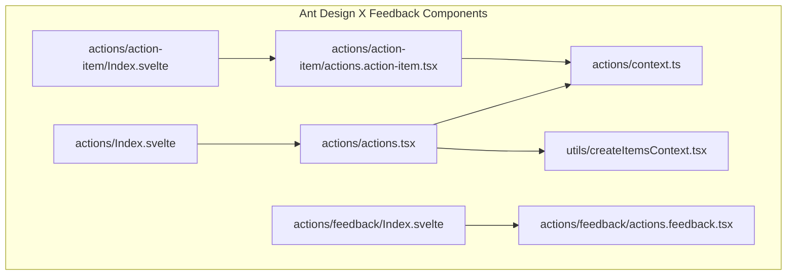
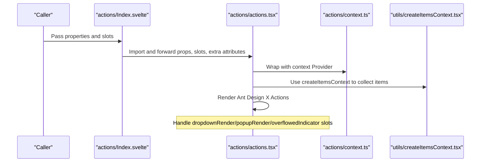
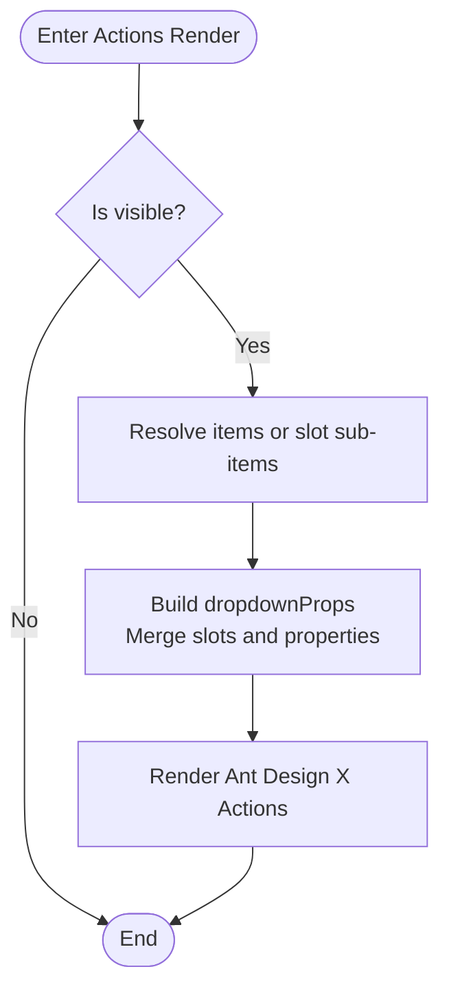
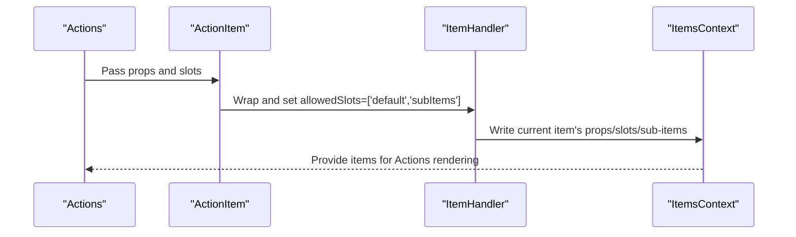
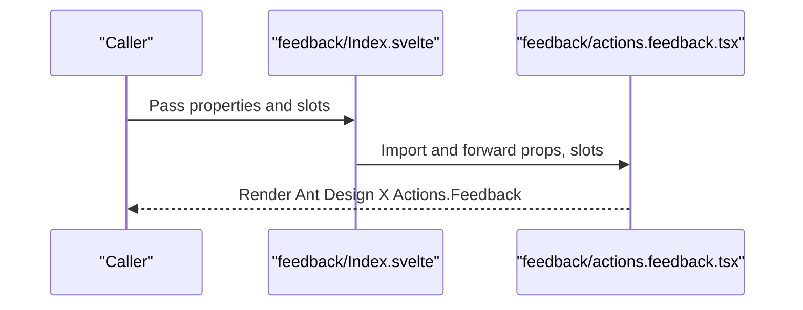
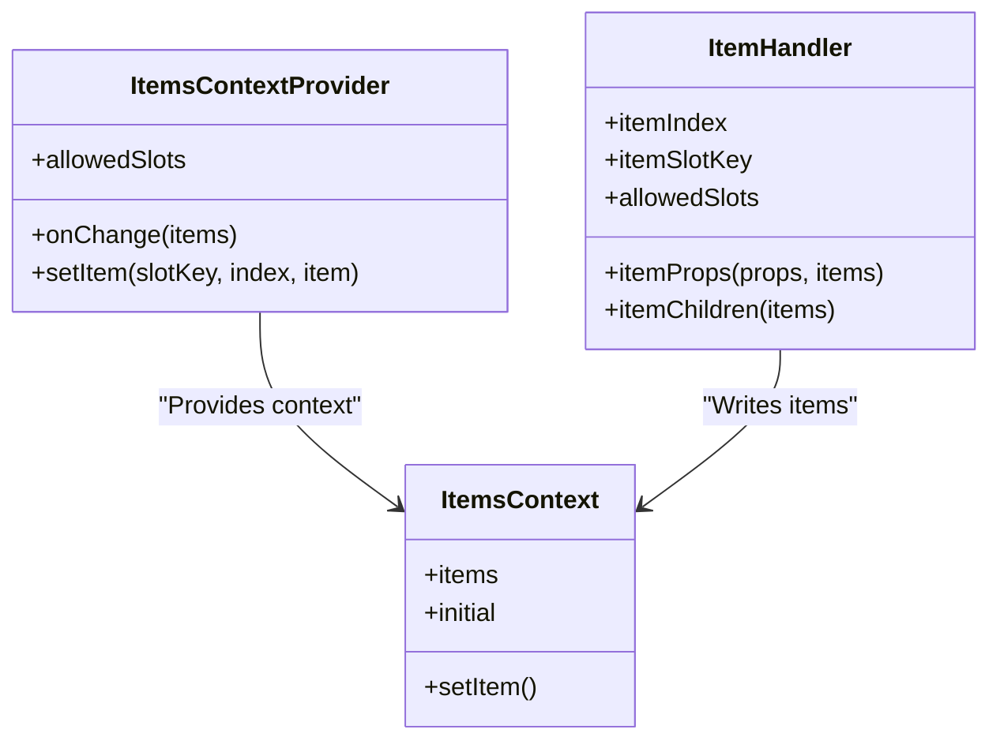
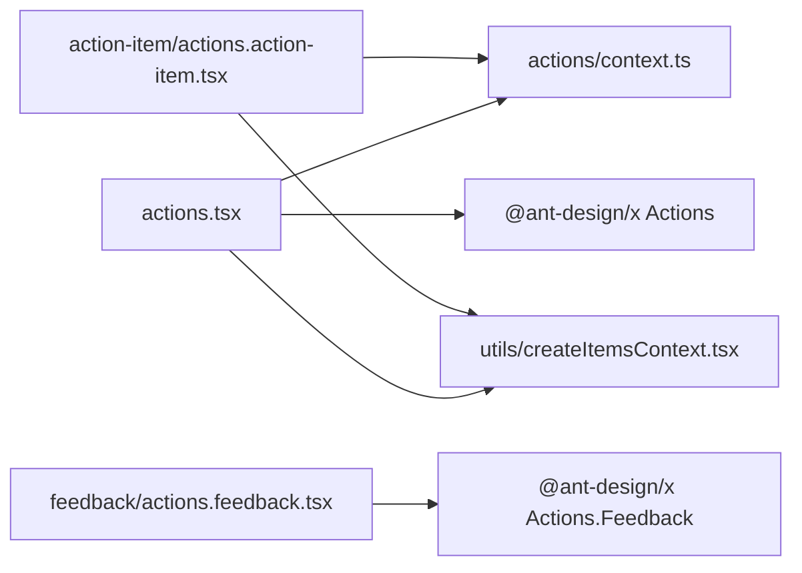

# Feedback Components

<cite>
**Files referenced in this document**
- [frontend/antdx/actions/Index.svelte](file://frontend/antdx/actions/Index.svelte)
- [frontend/antdx/actions/actions.tsx](file://frontend/antdx/actions/actions.tsx)
- [frontend/antdx/actions/context.ts](file://frontend/antdx/actions/context.ts)
- [frontend/antdx/actions/action-item/Index.svelte](file://frontend/antdx/actions/action-item/Index.svelte)
- [frontend/antdx/actions/action-item/actions.action-item.tsx](file://frontend/antdx/actions/action-item/actions.action-item.tsx)
- [frontend/antdx/actions/feedback/Index.svelte](file://frontend/antdx/actions/feedback/Index.svelte)
- [frontend/antdx/actions/feedback/actions.feedback.tsx](file://frontend/antdx/actions/feedback/actions.feedback.tsx)
- [frontend/utils/createItemsContext.tsx](file://frontend/utils/createItemsContext.tsx)
</cite>

## Table of Contents

1. [Introduction](#introduction)
2. [Project Structure](#project-structure)
3. [Core Components](#core-components)
4. [Architecture Overview](#architecture-overview)
5. [Detailed Component Analysis](#detailed-component-analysis)
6. [Dependency Analysis](#dependency-analysis)
7. [Performance Considerations](#performance-considerations)
8. [Troubleshooting Guide](#troubleshooting-guide)
9. [Conclusion](#conclusion)
10. [Appendix](#appendix)

## Introduction

This document focuses on the Ant Design X feedback component system, particularly the Actions operation list component and the ActionItem sub-component. Actions provides a unified operation entry point and feedback collection capability, supporting flexible configuration of menu items, dropdown rendering, overflow indicators, and more through slots and properties. ActionItem serves as a sub-item container, responsible for converting the subtree (default slot or sub-item slot) into structured data that can be parsed by Actions, and completing parent-child communication and state management through the context mechanism. The feedback component (ActionsFeedback) encapsulates Ant Design X's feedback capability for easy integration into conversation bubbles, message streams, and similar scenarios.

The key value of this component system in improving user interaction experience includes:

- Unified operation entry points and visual style, reducing cognitive load
- Flexible slot-based extensibility, supporting complex nesting and dynamic rendering
- Ensuring lifecycle and event propagation correctness for operation items through context and state management
- Embedding "feedback" capability within the operation list, improving information loop and usability

## Project Structure

The Ant Design X feedback components are located in the frontend directory under antdx/actions, containing the main Actions component, the ActionItem sub-component, the ActionsFeedback component, and the createItemsContext utility for building the operation item structure.

**Diagram Sources**

- [frontend/antdx/actions/Index.svelte](file://frontend/antdx/actions/Index.svelte)
- [frontend/antdx/actions/actions.tsx](file://frontend/antdx/actions/actions.tsx)
- [frontend/antdx/actions/context.ts](file://frontend/antdx/actions/context.ts)
- [frontend/antdx/actions/action-item/Index.svelte](file://frontend/antdx/actions/action-item/Index.svelte)
- [frontend/antdx/actions/action-item/actions.action-item.tsx](file://frontend/antdx/actions/action-item/actions.action-item.tsx)
- [frontend/antdx/actions/feedback/Index.svelte](file://frontend/antdx/actions/feedback/Index.svelte)
- [frontend/antdx/actions/feedback/actions.feedback.tsx](file://frontend/antdx/actions/feedback/actions.feedback.tsx)
- [frontend/utils/createItemsContext.tsx](file://frontend/utils/createItemsContext.tsx)

**Section Sources**

- [frontend/antdx/actions/Index.svelte](file://frontend/antdx/actions/Index.svelte)
- [frontend/antdx/actions/actions.tsx](file://frontend/antdx/actions/actions.tsx)
- [frontend/antdx/actions/context.ts](file://frontend/antdx/actions/context.ts)
- [frontend/antdx/actions/action-item/Index.svelte](file://frontend/antdx/actions/action-item/Index.svelte)
- [frontend/antdx/actions/action-item/actions.action-item.tsx](file://frontend/antdx/actions/action-item/actions.action-item.tsx)
- [frontend/antdx/actions/feedback/Index.svelte](file://frontend/antdx/actions/feedback/Index.svelte)
- [frontend/antdx/actions/feedback/actions.feedback.tsx](file://frontend/antdx/actions/feedback/actions.feedback.tsx)
- [frontend/utils/createItemsContext.tsx](file://frontend/utils/createItemsContext.tsx)

## Core Components

- Actions main component: Responsible for receiving items or sub-items from slots, combining context and slot rendering to generate Ant Design X operation lists, and supporting advanced features like dropdown rendering and overflow indicators.
- ActionItem sub-component: Acts as a container for a single operation item, merging the default slot and sub-item slot into a unified data structure, which is collected and passed through the context.
- ActionsFeedback feedback component: A lightweight encapsulation of Ant Design X's feedback capability, enabling easy integration of feedback entry points in the interface.
- createItemsContext utility: Provides ItemsContext creation, Provider wrapping, useItems hooks, and ItemHandler components, supporting structured collection and recursive processing of operation items.

**Section Sources**

- [frontend/antdx/actions/actions.tsx](file://frontend/antdx/actions/actions.tsx)
- [frontend/antdx/actions/action-item/actions.action-item.tsx](file://frontend/antdx/actions/action-item/actions.action-item.tsx)
- [frontend/antdx/actions/feedback/actions.feedback.tsx](file://frontend/antdx/actions/feedback/actions.feedback.tsx)
- [frontend/utils/createItemsContext.tsx](file://frontend/utils/createItemsContext.tsx)

## Architecture Overview

The Actions rendering pipeline has two layers:

- Svelte layer: Index.svelte is responsible for parsing properties, appending class names and IDs, handling slot mappings, and importing the React implementation on demand.
- React layer: actions.tsx converts slots and properties into the items structure required by Ant Design X, while handling advanced configurations such as dropdown menu rendering and overflow indicators.

ActionItem's responsibility is to convert the subtree it wraps (default slot and subItems slot) into structured Item data, and write it to the parent Actions via context.

**Diagram Sources**

- [frontend/antdx/actions/Index.svelte](file://frontend/antdx/actions/Index.svelte)
- [frontend/antdx/actions/actions.tsx](file://frontend/antdx/actions/actions.tsx)
- [frontend/antdx/actions/context.ts](file://frontend/antdx/actions/context.ts)
- [frontend/utils/createItemsContext.tsx](file://frontend/utils/createItemsContext.tsx)

## Detailed Component Analysis

### Actions Main Component

- Input and property handling: Uses Svelte's getProps/processProps for unified processing of visibility, element styles/class names, IDs, and extra attributes, mapping some events to the names required by Ant Design X.
- Slots and rendering: Supports children, dropdownRender, popupRender, overflowedIndicator, expandIcon, and other slots; converts slots into React-compatible render functions or nodes via renderSlot/renderParamsSlot.
- Dropdown enhancement: When dropdownProps.menu.items or a slot exists, slot-generated items take priority; also supports custom expandIcon and overflowedIndicator.
- State and events: Obtains items from context via useItems and useMenuItems to avoid redundant rendering; events such as openChange/select/deselect are forwarded to the underlying component via props.

**Diagram Sources**

- [frontend/antdx/actions/actions.tsx](file://frontend/antdx/actions/actions.tsx)

**Section Sources**

- [frontend/antdx/actions/Index.svelte](file://frontend/antdx/actions/Index.svelte)
- [frontend/antdx/actions/actions.tsx](file://frontend/antdx/actions/actions.tsx)

### ActionItem Sub-Component

- Slots and properties: Supports the actionRender slot and actionRender property, converting strings or functions into executable functions via createFunction; also retains the default slot and sub-item slot.
- Context writing: Uses ItemHandler to write the current item's props, slots, sub-items, and other structured data into the context for the parent Actions to consume.
- Sub-item selection strategy: If subItems exists, it takes priority; otherwise falls back to the default slot, forming a flexible hierarchical structure.

**Diagram Sources**

- [frontend/antdx/actions/action-item/Index.svelte](file://frontend/antdx/actions/action-item/Index.svelte)
- [frontend/antdx/actions/action-item/actions.action-item.tsx](file://frontend/antdx/actions/action-item/actions.action-item.tsx)
- [frontend/antdx/actions/context.ts](file://frontend/antdx/actions/context.ts)
- [frontend/utils/createItemsContext.tsx](file://frontend/utils/createItemsContext.tsx)

**Section Sources**

- [frontend/antdx/actions/action-item/Index.svelte](file://frontend/antdx/actions/action-item/Index.svelte)
- [frontend/antdx/actions/action-item/actions.action-item.tsx](file://frontend/antdx/actions/action-item/actions.action-item.tsx)
- [frontend/antdx/actions/context.ts](file://frontend/antdx/actions/context.ts)
- [frontend/utils/createItemsContext.tsx](file://frontend/utils/createItemsContext.tsx)

### ActionsFeedback Component

- Role: A lightweight encapsulation of Ant Design X's Actions.Feedback, simplifying the calling interface.
- Slots and properties: Follows the same slot and property handling process as the parent layer, enabling direct use in conversation bubbles, message streams, and similar scenarios.

**Diagram Sources**

- [frontend/antdx/actions/feedback/Index.svelte](file://frontend/antdx/actions/feedback/Index.svelte)
- [frontend/antdx/actions/feedback/actions.feedback.tsx](file://frontend/antdx/actions/feedback/actions.feedback.tsx)

**Section Sources**

- [frontend/antdx/actions/feedback/Index.svelte](file://frontend/antdx/actions/feedback/Index.svelte)
- [frontend/antdx/actions/feedback/actions.feedback.tsx](file://frontend/antdx/actions/feedback/actions.feedback.tsx)

### Context and State Management (createItemsContext)

- ItemsContext: Maintains the Item array under each slot, providing setItem to update items by index; the onChange callback notifies the parent of updates.
- ItemHandler: Writes the current item's props, slots, sub-items, and other structured data into the context when the component mounts; supports dynamic computation of itemProps and itemChildren.
- withItemsContextProvider: Provides an ItemsContextProvider for the subtree, allowing sub-items to continue writing their own sub-items, forming a recursive structure.

**Diagram Sources**

- [frontend/utils/createItemsContext.tsx](file://frontend/utils/createItemsContext.tsx)

**Section Sources**

- [frontend/utils/createItemsContext.tsx](file://frontend/utils/createItemsContext.tsx)

## Dependency Analysis

- Actions dependencies:
  - Context: actions/context.ts and utils/createItemsContext.tsx together form the foundation for item collection and forwarding.
  - Slot rendering: renderSlot/renderParamsSlot converts slots into React-executable functions or nodes.
  - Ant Design X: Final rendering is handled by the Actions component from @ant-design/x.
- ActionItem dependencies:
  - ItemHandler and context: Writes its own structure into the context for the parent to consume.
  - Slot handling: Supports actionRender and default/sub-item slots.
- ActionsFeedback dependencies:
  - Directly encapsulates Ant Design X's Actions.Feedback.

**Diagram Sources**

- [frontend/antdx/actions/actions.tsx](file://frontend/antdx/actions/actions.tsx)
- [frontend/antdx/actions/context.ts](file://frontend/antdx/actions/context.ts)
- [frontend/utils/createItemsContext.tsx](file://frontend/utils/createItemsContext.tsx)
- [frontend/antdx/actions/feedback/actions.feedback.tsx](file://frontend/antdx/actions/feedback/actions.feedback.tsx)

**Section Sources**

- [frontend/antdx/actions/actions.tsx](file://frontend/antdx/actions/actions.tsx)
- [frontend/antdx/actions/context.ts](file://frontend/antdx/actions/context.ts)
- [frontend/utils/createItemsContext.tsx](file://frontend/utils/createItemsContext.tsx)
- [frontend/antdx/actions/feedback/actions.feedback.tsx](file://frontend/antdx/actions/feedback/actions.feedback.tsx)

## Performance Considerations

- Render optimization:
  - Uses useMemo to cache the result of dropdownProps construction, avoiding unnecessary re-renders.
  - Only injects dropdownProps when valid values exist, reducing side effects from empty objects.
- Events and properties:
  - Maps event names to the names required by underlying components via processProps, avoiding runtime conversion overhead.
- Slot handling:
  - renderSlot/renderParamsSlot performs cloning and parameterized wrapping only when necessary, reducing DOM manipulation costs.
- Context writing:
  - Uses useRef and isEqual to compare previous and current values, triggering setItem only when changes occur to avoid redundant writes.

[This section contains general performance recommendations and does not analyze specific files directly]

## Troubleshooting Guide

- Issue: Operation items not displayed
  - Troubleshooting: Confirm the visible property is true; check if items is empty; confirm slot key names match allowedSlots.
  - Reference path: [frontend/antdx/actions/actions.tsx](file://frontend/antdx/actions/actions.tsx)
- Issue: Dropdown menu not working
  - Troubleshooting: Check if dropdownProps.menu.items is passed correctly; confirm the dropdownProps.menu.items slot is being rendered.
  - Reference path: [frontend/antdx/actions/actions.tsx](file://frontend/antdx/actions/actions.tsx)
- Issue: Sub-items not nested correctly
  - Troubleshooting: Confirm the ActionItem's subItems slot is correctly named; check the ItemHandler's itemChildrenKey setting.
  - Reference path: [frontend/antdx/actions/action-item/actions.action-item.tsx](file://frontend/antdx/actions/action-item/actions.action-item.tsx)
- Issue: Events not triggered
  - Troubleshooting: Confirm event name mappings are correct; check if props are forwarded to the underlying component.
  - Reference path: [frontend/antdx/actions/Index.svelte](file://frontend/antdx/actions/Index.svelte)

**Section Sources**

- [frontend/antdx/actions/actions.tsx](file://frontend/antdx/actions/actions.tsx)
- [frontend/antdx/actions/action-item/actions.action-item.tsx](file://frontend/antdx/actions/action-item/actions.action-item.tsx)
- [frontend/antdx/actions/Index.svelte](file://frontend/antdx/actions/Index.svelte)

## Conclusion

The Actions operation list component implements flexible, high-performance operation item management through a clear context and slot mechanism. ActionItem, as a sub-item container, provides stable structured data writing capability. ActionsFeedback seamlessly integrates feedback capability into the operation list. The overall design balances ease of use with extensibility and performance, significantly enhancing user interaction experience in conversation, message, and prompt scenarios.

[This section contains summary content and does not analyze specific files directly]

## Appendix

- Usage examples (scenario guide)
  - Feedback collection: Place ActionsFeedback in areas where user feedback needs to be collected, configuring feedback entry points through slots and properties.
  - Operation execution: Configure items in Actions, combining dropdownRender/popupRender slots to customize menu appearance; handle clicks and selections through event callbacks.
  - Result display: Use overflowedIndicator and expandIcon slots to control menu overflow and expand behavior, ensuring a good experience on small-screen devices.
- Best practices
  - Divide slot key names reasonably to avoid conflicts; use unified naming conventions for maintainability.
  - Use useMemo to cache complex calculations and reduce rendering pressure.
  - Keep event handler functions stable to avoid re-renders caused by changes in function references.

[This section contains conceptual content and does not analyze specific files directly]
