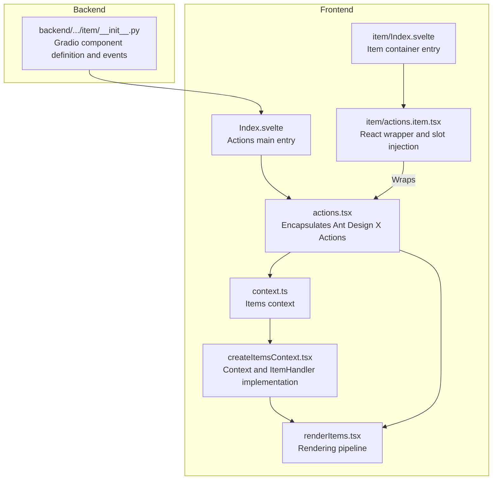
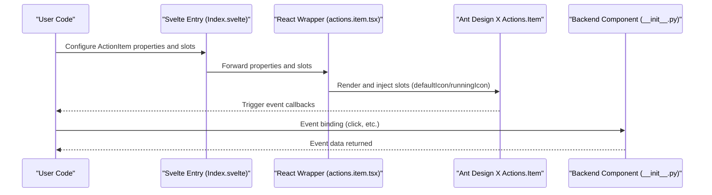
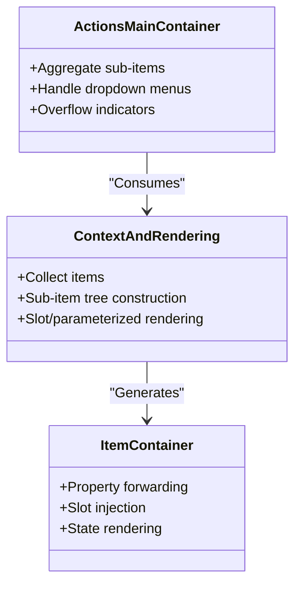
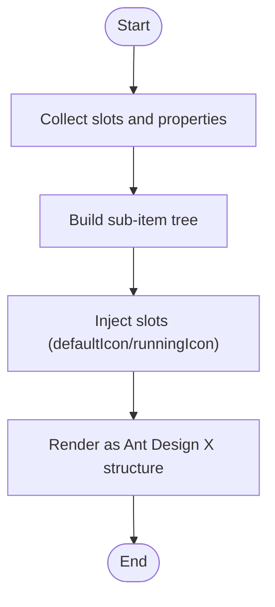
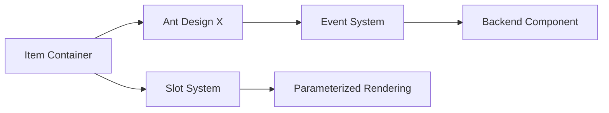

# Item Component

<cite>
**Files referenced in this document**
- [frontend/antdx/actions/item/Index.svelte](file://frontend/antdx/actions/item/Index.svelte)
- [frontend/antdx/actions/item/actions.item.tsx](file://frontend/antdx/actions/item/actions.item.tsx)
- [backend/modelscope_studio/components/antdx/actions/item/__init__.py](file://backend/modelscope_studio/components/antdx/actions/item/__init__.py)
- [frontend/antdx/actions/actions.tsx](file://frontend/antdx/actions/actions.tsx)
- [frontend/antdx/actions/context.ts](file://frontend/antdx/actions/context.ts)
- [frontend/utils/createItemsContext.tsx](file://frontend/utils/createItemsContext.tsx)
- [frontend/utils/renderItems.tsx](file://frontend/utils/renderItems.tsx)
- [frontend/antdx/actions/Index.svelte](file://frontend/antdx/actions/Index.svelte)
- [docs/components/antdx/actions/demos/basic.py](file://docs/components/antdx/actions/demos/basic.py)
</cite>

## Table of Contents

1. [Introduction](#introduction)
2. [Project Structure](#project-structure)
3. [Core Components](#core-components)
4. [Architecture Overview](#architecture-overview)
5. [Detailed Component Analysis](#detailed-component-analysis)
6. [Dependency Analysis](#dependency-analysis)
7. [Performance Considerations](#performance-considerations)
8. [Troubleshooting Guide](#troubleshooting-guide)
9. [Conclusion](#conclusion)
10. [Appendix](#appendix)

## Introduction

This document focuses on the Item container (ActionItem) in the AntdX Actions component system, systematically explaining its responsibilities as an internal container within Actions, layout and style control, responsive design approach, collaboration mechanisms with sub-operation items, event forwarding and state synchronization, and providing practical recommendations and best practices for various layouts (horizontal, vertical, grid). This container plays a key role in "sub-item definition and rendering" in the overall component architecture, and is the foundational building block for constructing complex operation lists.

## Project Structure

- Frontend layer: The Svelte entry is responsible for property forwarding and visibility control; the React wrapper layer interfaces with Ant Design X's Actions.Item; the backend Python component handles Gradio integration and event binding.
- Utility layer: Universal items context and rendering pipeline, supporting multi-level sub-items, slots, and parameterized rendering.

Diagram Sources

- [frontend/antdx/actions/Index.svelte:1-77](file://frontend/antdx/actions/Index.svelte#L1-L77)
- [frontend/antdx/actions/actions.tsx:1-123](file://frontend/antdx/actions/actions.tsx#L1-L123)
- [frontend/antdx/actions/context.ts:1-7](file://frontend/antdx/actions/context.ts#L1-L7)
- [frontend/utils/createItemsContext.tsx:1-274](file://frontend/utils/createItemsContext.tsx#L1-L274)
- [frontend/utils/renderItems.tsx:1-114](file://frontend/utils/renderItems.tsx#L1-L114)
- [frontend/antdx/actions/item/Index.svelte:1-60](file://frontend/antdx/actions/item/Index.svelte#L1-L60)
- [frontend/antdx/actions/item/actions.item.tsx:1-35](file://frontend/antdx/actions/item/actions.item.tsx#L1-L35)
- [backend/modelscope_studio/components/antdx/actions/item/**init**.py:1-77](file://backend/modelscope_studio/components/antdx/actions/item/__init__.py#L1-L77)

Section Sources

- [frontend/antdx/actions/Index.svelte:1-77](file://frontend/antdx/actions/Index.svelte#L1-L77)
- [frontend/antdx/actions/actions.tsx:1-123](file://frontend/antdx/actions/actions.tsx#L1-L123)
- [frontend/antdx/actions/context.ts:1-7](file://frontend/antdx/actions/context.ts#L1-L7)
- [frontend/utils/createItemsContext.tsx:1-274](file://frontend/utils/createItemsContext.tsx#L1-L274)
- [frontend/utils/renderItems.tsx:1-114](file://frontend/utils/renderItems.tsx#L1-L114)
- [frontend/antdx/actions/item/Index.svelte:1-60](file://frontend/antdx/actions/item/Index.svelte#L1-L60)
- [frontend/antdx/actions/item/actions.item.tsx:1-35](file://frontend/antdx/actions/item/actions.item.tsx#L1-L35)
- [backend/modelscope_studio/components/antdx/actions/item/**init**.py:1-77](file://backend/modelscope_studio/components/antdx/actions/item/__init__.py#L1-L77)

## Core Components

- Item container entry (Svelte)
  - Responsible for receiving properties, extra properties, visibility, styles, and class names passed from the parent, and forwarding these to the React wrapper layer.
  - Uses deferred derived computation for final properties, ensuring updates only occur when necessary.
  - Supports slots and child node rendering for injecting icons, action renderers, etc. into sub-items.
- React wrapper layer (sveltify)
  - Interfaces Ant Design X's Actions.Item with the slot system, supporting slots such as defaultIcon and runningIcon.
  - Clones and injects Svelte slot content into corresponding positions via ReactSlot.
- Backend component (Python)
  - Defines supported slots (defaultIcon, runningIcon), events (such as click), and properties (label, status, styles, etc.).
  - Controls whether to skip API (skip_api) and preprocessing/postprocessing flows.

Section Sources

- [frontend/antdx/actions/item/Index.svelte:1-60](file://frontend/antdx/actions/item/Index.svelte#L1-L60)
- [frontend/antdx/actions/item/actions.item.tsx:1-35](file://frontend/antdx/actions/item/actions.item.tsx#L1-L35)
- [backend/modelscope_studio/components/antdx/actions/item/**init**.py:1-77](file://backend/modelscope_studio/components/antdx/actions/item/__init__.py#L1-L77)

## Architecture Overview

The position of the Item container in the Actions system: as the "container" for sub-items, it is responsible for converting user-configured properties and slot content into the structure required by Ant Design X, and participates in overall rendering and event dispatching.

Diagram Sources

- [frontend/antdx/actions/item/Index.svelte:1-60](file://frontend/antdx/actions/item/Index.svelte#L1-L60)
- [frontend/antdx/actions/item/actions.item.tsx:1-35](file://frontend/antdx/actions/item/actions.item.tsx#L1-L35)
- [backend/modelscope_studio/components/antdx/actions/item/**init**.py:1-77](file://backend/modelscope_studio/components/antdx/actions/item/__init__.py#L1-L77)

## Detailed Component Analysis

### Component Relationships and Responsibilities

- Actions main container: Responsible for aggregating sub-items, handling dropdown menus, overflow indicators, expansion icons, and other advanced capabilities.
- Item container: Responsible for rendering individual sub-items, slot injection, state (such as loading/error/running/default), and label display.
- Context and rendering pipeline: Uniformly manages item collection, sub-item tree construction, slots, and parameterized rendering.

Diagram Sources

- [frontend/antdx/actions/actions.tsx:1-123](file://frontend/antdx/actions/actions.tsx#L1-L123)
- [frontend/utils/createItemsContext.tsx:1-274](file://frontend/utils/createItemsContext.tsx#L1-L274)
- [frontend/utils/renderItems.tsx:1-114](file://frontend/utils/renderItems.tsx#L1-L114)
- [frontend/antdx/actions/item/actions.item.tsx:1-35](file://frontend/antdx/actions/item/actions.item.tsx#L1-L35)

Section Sources

- [frontend/antdx/actions/actions.tsx:1-123](file://frontend/antdx/actions/actions.tsx#L1-L123)
- [frontend/utils/createItemsContext.tsx:1-274](file://frontend/utils/createItemsContext.tsx#L1-L274)
- [frontend/utils/renderItems.tsx:1-114](file://frontend/utils/renderItems.tsx#L1-L114)
- [frontend/antdx/actions/item/actions.item.tsx:1-35](file://frontend/antdx/actions/item/actions.item.tsx#L1-L35)

### Layout Management and Style Control

- Visibility control: Determines whether to render via the visible property, avoiding unnecessary DOM.
- Class names and IDs: elem_classes and elem_id are used for style overrides and positioning.
- Behavioral styles: elem_style is used for dynamic style injection, suitable for size and spacing adjustments in responsive scenarios.
- Container styles: In the Svelte entry, styles and class names are merged and applied to the root element, ensuring consistency with the parent layout.

Section Sources

- [frontend/antdx/actions/item/Index.svelte:19-60](file://frontend/antdx/actions/item/Index.svelte#L19-L60)
- [frontend/antdx/actions/Index.svelte:27-77](file://frontend/antdx/actions/Index.svelte#L27-L77)

### Responsive Design

- Based on Ant Design X's built-in Actions overflow and dropdown menu capabilities, the Item container can adapt to narrow screens without additional responsive logic.
- If custom responsive behavior is needed, widths and spacing can be set by breakpoints in elem_style; or layout constraints can be applied through outer containers (such as Space, Grid).

Section Sources

- [frontend/antdx/actions/actions.tsx:39-96](file://frontend/antdx/actions/actions.tsx#L39-L96)

### Sub-operation Item Collaboration Mechanism

- Slot injection: Slots such as defaultIcon and runningIcon are injected into corresponding fields of Ant Design X via ReactSlot, achieving differentiated display of icons and running state icons.
- Sub-item tree: Builds the sub-item tree through createItemsContext and renderItems, supporting nested ActionItem and subItems slots.
- Parameterized rendering: Slots can carry withParams to implement on-demand parameter-passing rendering.

Diagram Sources

- [frontend/utils/createItemsContext.tsx:190-261](file://frontend/utils/createItemsContext.tsx#L190-L261)
- [frontend/utils/renderItems.tsx:8-114](file://frontend/utils/renderItems.tsx#L8-L114)
- [frontend/antdx/actions/item/actions.item.tsx:10-32](file://frontend/antdx/actions/item/actions.item.tsx#L10-L32)

Section Sources

- [frontend/utils/createItemsContext.tsx:1-274](file://frontend/utils/createItemsContext.tsx#L1-L274)
- [frontend/utils/renderItems.tsx:1-114](file://frontend/utils/renderItems.tsx#L1-L114)
- [frontend/antdx/actions/item/actions.item.tsx:1-35](file://frontend/antdx/actions/item/actions.item.tsx#L1-L35)

### Event Forwarding and State Synchronization

- Event binding: The backend component declares click event listeners and enables event binding through internal flags.
- State synchronization: The Item's state (such as loading/error/running/default) is driven by backend properties; the frontend switches icons and interaction feedback according to state.
- Callback data: Key information such as keyPath and key can be obtained in event callbacks for branch processing on the business side.

Section Sources

- [backend/modelscope_studio/components/antdx/actions/item/**init**.py:15-19](file://backend/modelscope_studio/components/antdx/actions/item/__init__.py#L15-L19)
- [docs/components/antdx/actions/demos/basic.py:7-10](file://docs/components/antdx/actions/demos/basic.py#L7-L10)

### Complex Layout Practice Recommendations

- Horizontal arrangement: Place multiple ActionItems directly under Actions, leveraging Ant Design X's default inline layout.
- Vertical arrangement: Control direction and alignment through outer containers (such as Flex, Space).
- Grid layout: In more complex scenarios, combine Grid or custom containers with elem_style to control column widths and spacing.
- Overflow strategy: When there are many sub-items, use Actions' dropdown menu and overflow indicator to automatically collapse items, keeping the interface tidy.

Section Sources

- [frontend/antdx/actions/actions.tsx:39-96](file://frontend/antdx/actions/actions.tsx#L39-L96)
- [frontend/antdx/actions/Index.svelte:27-77](file://frontend/antdx/actions/Index.svelte#L27-L77)

## Dependency Analysis

- Component coupling
  - The Item container and the Actions main container are decoupled through context and the rendering pipeline, with dependencies arising only during the rendering phase.
  - The slot system decouples slot content from the host component through ReactSlot and ContextPropsProvider.
- External dependencies
  - Ant Design X: Provides the foundational capabilities of Actions and Actions.Item.
  - Gradio: Backend component bridges frontend events and data flows.

Diagram Sources

- [frontend/antdx/actions/item/actions.item.tsx:10-32](file://frontend/antdx/actions/item/actions.item.tsx#L10-L32)
- [frontend/antdx/actions/actions.tsx:39-96](file://frontend/antdx/actions/actions.tsx#L39-L96)
- [backend/modelscope_studio/components/antdx/actions/item/**init**.py:15-19](file://backend/modelscope_studio/components/antdx/actions/item/__init__.py#L15-L19)

Section Sources

- [frontend/antdx/actions/item/actions.item.tsx:1-35](file://frontend/antdx/actions/item/actions.item.tsx#L1-L35)
- [frontend/antdx/actions/actions.tsx:1-123](file://frontend/antdx/actions/actions.tsx#L1-L123)
- [backend/modelscope_studio/components/antdx/actions/item/**init**.py:1-77](file://backend/modelscope_studio/components/antdx/actions/item/__init__.py#L1-L77)

## Performance Considerations

- Render optimization
  - Uses deferred derived ($derived) and useMemo strategies to eliminate unnecessary re-renders.
  - Controls cloning strategy through renderItems' clone/forceClone to reduce redundant rendering costs.
- Events and state
  - Event binding is enabled only when needed, avoiding overhead from global listeners.
  - State transitions (such as loading/error/running/default) are driven by properties as much as possible to reduce side effects.

Section Sources

- [frontend/antdx/actions/item/Index.svelte:19-41](file://frontend/antdx/actions/item/Index.svelte#L19-L41)
- [frontend/antdx/actions/actions.tsx:104-113](file://frontend/antdx/actions/actions.tsx#L104-L113)
- [frontend/utils/renderItems.tsx:8-114](file://frontend/utils/renderItems.tsx#L8-L114)

## Troubleshooting Guide

- Slot not working
  - Check if slot key names are correct (e.g., defaultIcon, runningIcon).
  - Confirm that slot content is a valid element or configuration object.
- Icons not displaying
  - Ensure slot content is correctly injected via ReactSlot.
  - Check if the corresponding Ant Design X field is being overridden.
- Events not triggered
  - Confirm the backend component has declared the corresponding events (such as click).
  - Check if event binding is enabled (the \_internal flag).
- Sub-items not displaying
  - Check the visible property and rendering conditions.
  - Confirm the items context is correctly collected and forwarded.

Section Sources

- [frontend/antdx/actions/item/actions.item.tsx:15-28](file://frontend/antdx/actions/item/actions.item.tsx#L15-L28)
- [backend/modelscope_studio/components/antdx/actions/item/**init**.py:15-19](file://backend/modelscope_studio/components/antdx/actions/item/__init__.py#L15-L19)
- [frontend/antdx/actions/item/Index.svelte:46-59](file://frontend/antdx/actions/item/Index.svelte#L46-L59)

## Conclusion

The Item container plays the core role of "sub-item definition and rendering" in the Actions system. Through the slot system and context rendering pipeline, it converts user configuration into the data structure required by Ant Design X, and collaborates with the event system to complete state synchronization and interaction feedback. With its decoupled design and flexible slot mechanism, developers can easily implement operation list layouts ranging from simple to complex, and achieve good compatibility in responsive scenarios.

## Appendix

- Usage example reference: Demonstrates how to add ActionItem in Actions and inject icons and action renderers through slots, while binding click events and sub-item deletion events.

Section Sources

- [docs/components/antdx/actions/demos/basic.py:17-53](file://docs/components/antdx/actions/demos/basic.py#L17-L53)
