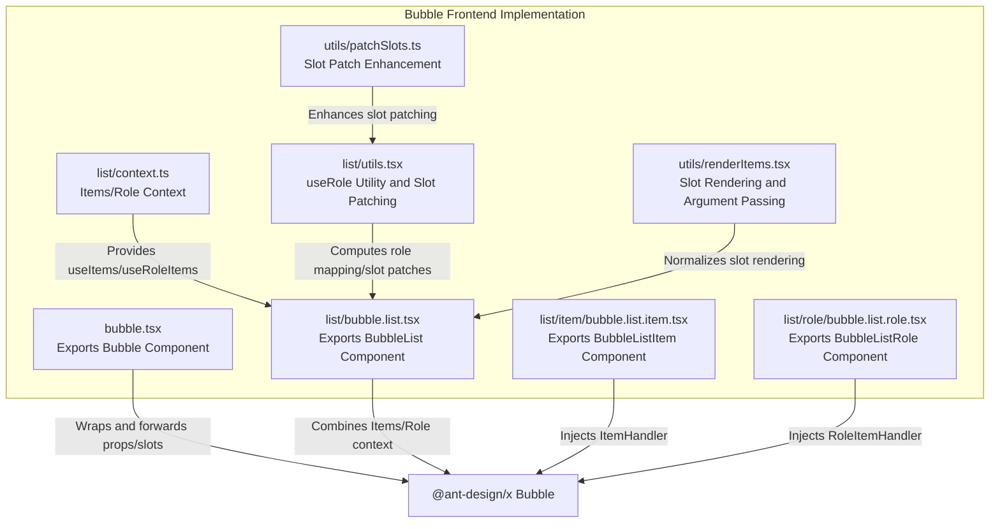
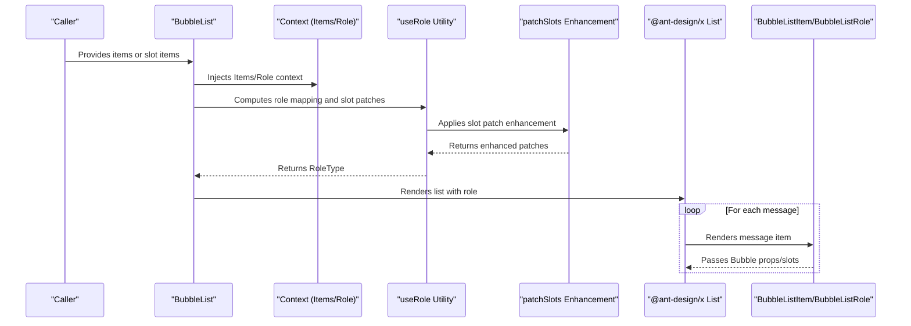
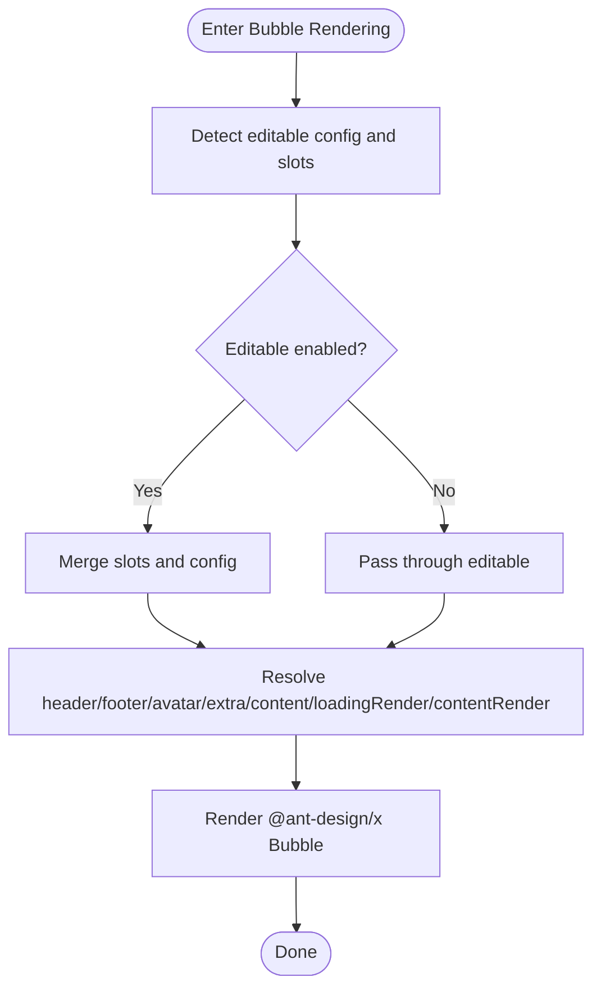

# Bubble Chat Bubble

<cite>
**Files referenced in this document**
- [frontend/antdx/bubble/bubble.tsx](file://frontend/antdx/bubble/bubble.tsx)
- [frontend/antdx/bubble/list/bubble.list.tsx](file://frontend/antdx/bubble/list/bubble.list.tsx)
- [frontend/antdx/bubble/list/item/bubble.list.item.tsx](file://frontend/antdx/bubble/list/item/bubble.list.item.tsx)
- [frontend/antdx/bubble/list/role/bubble.list.role.tsx](file://frontend/antdx/bubble/list/role/bubble.list.role.tsx)
- [frontend/antdx/bubble/list/context.ts](file://frontend/antdx/bubble/list/context.ts)
- [frontend/antdx/bubble/list/utils.tsx](file://frontend/antdx/bubble/list/utils.tsx)
- [frontend/utils/patchSlots.ts](file://frontend/utils/patchSlots.ts)
- [frontend/utils/renderItems.tsx](file://frontend/utils/renderItems.tsx)
</cite>

## Update Summary

**Changes Made**

- Updated performance optimization for Bubble component slot handling logic
- Removed unused unshift behavior to improve rendering performance
- Enhanced technical documentation for the slot patching mechanism

## Table of Contents

1. [Introduction](#introduction)
2. [Project Structure](#project-structure)
3. [Core Components](#core-components)
4. [Architecture Overview](#architecture-overview)
5. [Component Details](#component-details)
6. [Dependency Analysis](#dependency-analysis)
7. [Performance and Maintainability](#performance-and-maintainability)
8. [Troubleshooting Guide](#troubleshooting-guide)
9. [Conclusion](#conclusion)
10. [Appendix: Usage Examples and Best Practices](#appendix-usage-examples-and-best-practices)

## Introduction

This document covers the Bubble chat bubble component system, outlining its overall architecture, core capabilities, and usage, including:

- Bubble component rendering mechanism and slot/functional content adaptation
- BubbleList message display logic and role distribution
- BubbleListItem rendering rules and context injection
- BubbleListRole usage and dynamic assembly
- Divider component role in conversations and use cases
- Style customization, event handling, and best practices

## Project Structure

The Bubble component resides in the frontend antdx sub-package, using a Svelte wrapper to bridge @ant-design/x native components, with list rendering, role assignment, and slot rendering via contexts and utility functions.

**Diagram Sources**

- [frontend/antdx/bubble/bubble.tsx:1-120](file://frontend/antdx/bubble/bubble.tsx#L1-L120)
- [frontend/antdx/bubble/list/bubble.list.tsx:1-50](file://frontend/antdx/bubble/list/bubble.list.tsx#L1-L50)
- [frontend/antdx/bubble/list/item/bubble.list.item.tsx:1-14](file://frontend/antdx/bubble/list/item/bubble.list.item.tsx#L1-L14)
- [frontend/antdx/bubble/list/role/bubble.list.role.tsx:1-14](file://frontend/antdx/bubble/list/role/bubble.list.role.tsx#L1-L14)
- [frontend/antdx/bubble/list/context.ts:1-13](file://frontend/antdx/bubble/list/context.ts#L1-L13)
- [frontend/antdx/bubble/list/utils.tsx:1-135](file://frontend/antdx/bubble/list/utils.tsx#L1-L135)
- [frontend/utils/patchSlots.ts:1-32](file://frontend/utils/patchSlots.ts#L1-L32)
- [frontend/utils/renderItems.tsx:1-114](file://frontend/utils/renderItems.tsx#L1-L114)

## Core Components

- **Bubble**: A Svelte wrapper around @ant-design/x's Bubble, supporting unified rendering of slots and functional props, compatible with editable text slots.
- **BubbleList**: List container responsible for merging external items and slot items, injecting role context, and delegating rendering to @ant-design/x's List.
- **BubbleListItem**: Message item wrapper that injects context via ItemHandler, enabling individual Bubbles to be aware of the list environment.
- **BubbleListRole**: Role item wrapper that injects role context via RoleItemHandler, allowing role configurations to be resolved by useRole.
- **useRole**: Core role resolution utility that supports default keys, pre-processing, post-processing, and slot patching, converting role mappings to the RoleType required by @ant-design/x.

## Architecture Overview

The Bubble system uses a "wrapper + context + utility functions" core design, bridging @ant-design/x's native capabilities with Gradio-style slots/functional props to form an extensible, role-based message list.

## Component Details

### Bubble Component

- **Purpose**: Svelte wrapper around @ant-design/x's Bubble, handling slots and functional props uniformly, supporting editable text slots.
- **Key Points**:
  - Slot-first: When a corresponding slot exists, it takes priority over attribute values or functions.
  - Editable mode: Supports custom "OK/Cancel" text via editable configuration combined with slots.
  - Functional props: Uses `useFunction` to convert passed functions into renderable React components.
  - Hidden children: Puts children in an invisible container to avoid duplicate rendering.

### BubbleList Component

- **Purpose**: Message list container responsible for:
  - Merging external items with slot items
  - Injecting Items and Role contexts
  - Resolving role mappings via useRole
  - Delegating final rendering to @ant-design/x List
- **Key Points**:
  - Prioritizes `props.items`; falls back to slot items/default
  - Normalizes slot content to arrays via `renderItems`
  - Caches items with `useMemo` to reduce re-renders

### BubbleListItem and BubbleListRole

- **BubbleListItem**: Injects ItemHandler into a Bubble, giving individual message items list context awareness.
- **BubbleListRole**: Injects RoleItemHandler into role configuration, enabling role items to be resolved to RoleType by useRole.

### useRole - Role Resolution Utility

- **Purpose**: Converts role configuration (string, function, or object) to the RoleType required by @ant-design/x, with slot patching and index injection.
- **Key Points**:
  - Supports `defaultRoleKeys`
  - Supports `preProcess` and `defaultRolePostProcess` hooks
  - Automatically patches header/footer/avatar/extra/loadingRender/contentRender slots
  - Default `contentRender` serializes objects to strings

### Divider Component

- **Purpose**: Inserts dividers between chat bubbles for visual segmentation and rhythm control.
- **Use Cases**: Multi-turn conversations, modular display, time/topic transition hints.
- Note: Divider is a standalone component, typically used alongside BubbleList, controlled via slots or layout.

## Dependency Analysis

- **Component coupling**:
  - Bubble acts only as a wrapper, depending on @ant-design/x's native capabilities, making it easy to upgrade or replace.
  - BubbleList depends on context and utility functions with clear responsibilities, centralized in useRole and renderItems.
- **Context and utilities**:
  - `createItemsContext` provides two context sets (Items/Role) for list items and role items respectively.
  - `useRole` is the core of role resolution, handling the conversion from configuration to rendering parameters.
  - `patchSlots` provides slot patching enhancement, supporting argument passing and function composition.
- **External dependencies**:
  - @ant-design/x: Provides Bubble/List/Role types and rendering capabilities
  - @svelte-preprocess-react: Bridges Svelte and React slots
  - @utils/\*: Provides rendering and function encapsulation utilities

## Performance and Maintainability

- **Performance optimization**:
  - Use `useMemo` to cache BubbleList's items to avoid unnecessary re-renders.
  - Set appropriate dependency arrays in `useRole` to avoid recomputing role mappings.
  - Break large slot content into reusable components to reduce closure and object creation.
  - **Optimization**: Removed unused unshift behavior, reducing unnecessary argument reorganization overhead.
- **Maintainability**:
  - Centralize role configuration management to avoid scattering across templates.
  - Use preProcess/postProcess hooks to unify message preprocessing and postprocessing.
  - Maintain consistent slot naming conventions for team collaboration and documentation.

## Troubleshooting Guide

- **Slots not working**
  - Check slot names against component conventions (e.g., avatar/header/footer/extra/content)
  - Ensure Bubble/BubbleList correctly wraps the slots
- **Role configuration invalid**
  - Confirm BubbleListRole correctly injects RoleItemHandler
  - Check useRole's defaultRoleKeys and preProcess/postProcess are working as expected
- **Editable text not showing**
  - Confirm both editable config and slots exist; slots take priority
  - Check that editable.okText/editable.cancelText slots are correctly passed
- **List rendering issues**
  - Confirm BubbleListItem correctly injects ItemHandler
  - Check that items and slot items data structures match requirements

## Conclusion

The Bubble chat bubble component system uses "wrapper + context + utility functions" as its core design, preserving @ant-design/x's powerful capabilities while providing flexible slot and role-based extensions. Through the collaboration of BubbleList, BubbleListItem, BubbleListRole, and useRole, developers can quickly build complex, customizable conversation interfaces with good balance between style, interaction, and maintainability.

## Appendix: Usage Examples and Best Practices

- **Basic chat bubble**: Use Bubble component for message content, pass text/rich content via content slot or prop; add avatar, title, action area, and extra info via avatar/header/footer/extra slots.
- **Complex message formats**: Use contentRender objects/arrays for structured rendering; handle message fields and styles uniformly via preProcess/postProcess hooks.
- **Custom styles**: Configure different roles via role mapping combined with slot patches; use Divider at key points to improve readability.
- **Best practices**:
  - Centralize role configuration management
  - Use `useMemo` to cache items and role mappings
  - Maintain consistent slot naming conventions
  - Use patchSlots enhancements wisely when passing slot arguments
