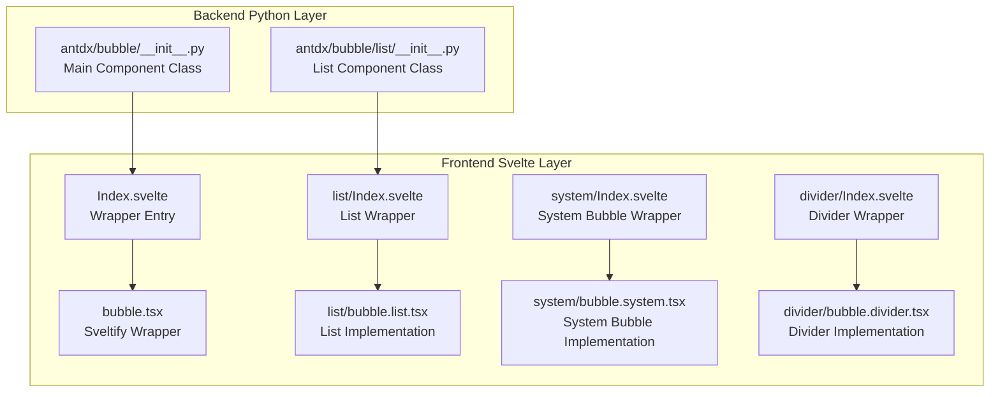
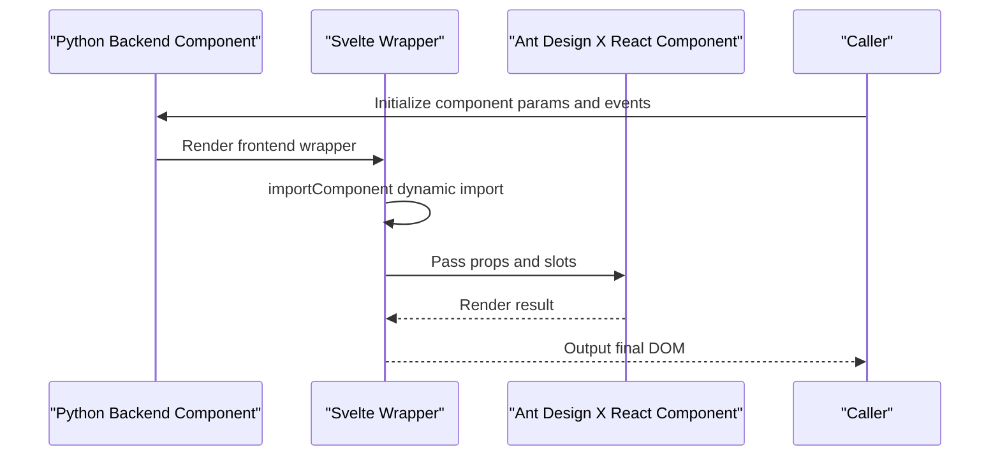
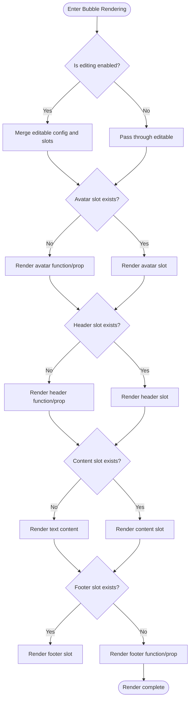

# Bubble Component Overview

<cite>
**Files referenced in this document**
- [frontend/antdx/bubble/Index.svelte](file://frontend/antdx/bubble/Index.svelte)
- [frontend/antdx/bubble/bubble.tsx](file://frontend/antdx/bubble/bubble.tsx)
- [frontend/antdx/bubble/list/Index.svelte](file://frontend/antdx/bubble/list/Index.svelte)
- [frontend/antdx/bubble/list/bubble.list.tsx](file://frontend/antdx/bubble/list/bubble.list.tsx)
- [frontend/antdx/bubble/system/Index.svelte](file://frontend/antdx/bubble/system/Index.svelte)
- [frontend/antdx/bubble/system/bubble.system.tsx](file://frontend/antdx/bubble/system/bubble.system.tsx)
- [frontend/antdx/bubble/divider/Index.svelte](file://frontend/antdx/bubble/divider/Index.svelte)
- [frontend/antdx/bubble/divider/bubble.divider.tsx](file://frontend/antdx/bubble/divider/bubble.divider.tsx)
- [backend/modelscope_studio/components/antdx/bubble/__init__.py](file://backend/modelscope_studio/components/antdx/bubble/__init__.py)
- [backend/modelscope_studio/components/antdx/bubble/list/__init__.py](file://backend/modelscope_studio/components/antdx/bubble/list/__init__.py)
</cite>

## Table of Contents

1. [Introduction](#introduction)
2. [Project Structure](#project-structure)
3. [Core Components](#core-components)
4. [Architecture Overview](#architecture-overview)
5. [Detailed Component Analysis](#detailed-component-analysis)
6. [Dependency Analysis](#dependency-analysis)
7. [Performance Considerations](#performance-considerations)
8. [Troubleshooting Guide](#troubleshooting-guide)
9. [Conclusion](#conclusion)
10. [Appendix](#appendix)

## Introduction

Bubble is a visual chat bubble component designed for machine learning conversation scenarios, built on Ant Design X's Bubble capabilities. It provides message bubble rendering, editing, typing animation, content distribution, and more, with a seamless frontend-backend development experience through the Gradio/ModelScope ecosystem. The component family includes single bubbles, bubble lists, system message dividers, and system-type bubbles, covering conversation patterns from basic display to complex interactions.

## Project Structure

The Bubble component consists of a frontend Svelte wrapper layer and a backend Python component layer, using a dual-layer design of "frontend React component + backend Gradio component" to ensure declarative usage of Ant Design X capabilities in Python environments.

## Core Components

- **Single Bubble Component**: Renders a single message bubble, supporting avatar, title, content, extra actions, footer, loading/content custom rendering, editable mode, and typing animation.
- **Bubble List Component**: Hosts multiple bubbles, supporting role grouping, auto-scrolling, and injecting items/role via slots.
- **System Bubble Component**: Renders system prompts or status information, emphasizing semantic display.
- **Divider Component**: Inserts separation prompts in conversations, such as timestamps or session transition hints.

## Architecture Overview

The Bubble component uses a three-layer architecture of "Svelte wrapper + Ant Design X React component + Gradio/ModelScope backend bridge". The frontend implements on-demand loading via Svelte's `importComponent`, bridging React components to Svelte using `sveltify`; the backend abstracts via `ModelScopeLayoutComponent` to uniformly handle event binding, slot mapping, and property forwarding.

## Detailed Component Analysis

### Single Bubble Component (Bubble)

- **Design Philosophy**: Based on Ant Design X's Bubble as core, providing rich slot and callback extension points for diverse needs: avatar, title, content, action area, loading state, and editing state.
- **Key Features**:
  - Slot system: avatar, content, header, footer, extra, loadingRender, contentRender, editable.okText, editable.cancelText.
  - Edit capability: Supports editable boolean switch and configuration object, with custom text and rendering via slots.
  - Typing animation: `typing` supports boolean and configuration objects, with `typingComplete` event for animation lifecycle management.
  - Custom rendering: loadingRender and contentRender support function or slot injection for flexible loading and content rendering control.
  - Avatar and extra areas: avatar and extra support functions or slots for extending icons, action buttons, etc.

### Bubble List Component (BubbleList)

- **Design Philosophy**: Builds on the single bubble to provide batch rendering and role grouping for multi-turn conversations and history message lists.
- **Key Features**:
  - Role grouping: Define display strategies for different roles (user, system, assistant) via role slot or prop.
  - Slot items/default: Support injecting list items via slots or passing items array directly.
  - Auto-scroll: Configurable auto-scroll to latest message for better user experience.
  - Context injection: Parse slots and defaults via `useItems` and `useRole` for flexibility and consistency.

### System Bubble Component (BubbleSystem)

- **Design Philosophy**: Used to display system-level prompts or status information, emphasizing semantic consistency, commonly used for "system notifications", "session start", "model switch" scenarios.
- **Key Features**:
  - Content slot: The `content` slot takes priority over the content property for dynamic rendering.
  - Semantic display: Based on Ant Design X's System type, maintaining consistent style and behavior.

### Divider Component (BubbleDivider)

- **Design Philosophy**: Inserts separation prompts in conversations such as timestamps or session transitions, helping users understand conversation structure.
- **Key Features**:
  - Content slot: The `content` slot takes priority over the content property.
  - Semantic separation: Based on Ant Design X's Divider type, maintaining consistent visual and interaction behavior.

## Dependency Analysis

- **Frontend dependencies**:
  - @svelte-preprocess-react: Provides importComponent, processProps, slot context capabilities for Svelte-React bridging.
  - @ant-design/x: Provides core components and type definitions for Bubble, List, System, Divider.
  - @utils/\*: Provides utilities for useFunction, renderParamsSlot, renderItems, context Providers.
- **Backend dependencies**:
  - ModelScopeLayoutComponent: Unified abstraction for frontend component rendering, event binding, and property forwarding.
  - Gradio event system: Event bindings for typing, typing_complete, edit_confirm, edit_cancel.

## Performance Considerations

- **On-demand loading**: Frontend uses `importComponent` for dynamic imports to avoid large initial bundles and improve first-screen performance.
- **Slot and function rendering**: Use slots and function rendering judiciously to reduce unnecessary re-renders; use stable function references for contentRender/loadingRender.
- **List optimization**: BubbleList uses `useMemo` and `renderItems` to ensure only necessary parts are recalculated on items change; use `auto_scroll` cautiously with large datasets.
- **Event binding**: Events like typing_complete, edit_confirm, edit_cancel should only be bound when needed.

## Troubleshooting Guide

- **Slots not working**: Check slot names (avatar, content, header, footer, extra, loadingRender, contentRender, editable.okText, editable.cancelText). Slots take priority over props.
- **Editing not working**: Confirm editable is a boolean or config object, with cancelText/okText slots or props. Check edit_confirm and edit_cancel event binding.
- **Typing animation issues**: Confirm typing is a boolean or config object. Without typing, typing_complete fires immediately after render.
- **List scrolling problems**: Check if auto_scroll is enabled; consider delay or throttle for large message sets.
- **Style and theme conflicts**: Use root_class_name or class_names/styles for custom styles; ensure compatibility with Ant Design X theme variables.

## Conclusion

The Bubble component family, based on Ant Design X and combined with Svelte and Gradio/ModelScope ecosystem capabilities, provides a complete solution from single messages to multi-turn conversation lists. Its slot-based design and event system enable flexible presentation of different types of prompts and messages in machine learning conversation scenarios while maintaining good performance and maintainability.

## Appendix

### Basic Usage Examples

- **Single bubble**: Set content text or inject complex content via content slot. For editing, set `editable` and provide editable.okText/editable.cancelText. For typing animation, set `typing` and listen for `typing_complete`.
- **Bubble list**: Pass message arrays via items/default slots or items prop. Define role grouping via role slot or prop. Enable `auto_scroll` for automatic scrolling.
- **System bubble and divider**: Use System component for system prompts; use Divider for separation hints. Both support content slot priority strategy.

### Best Practices

- Prefer slots over inline strings for better maintainability and testability.
- Use memoization for frequently changing content to reduce re-renders.
- In dense conversation scenarios, control auto-scroll and animation effects to avoid performance issues.
- Use root_class_name/class_names/styles for theme customization, ensuring consistency with the overall design.
