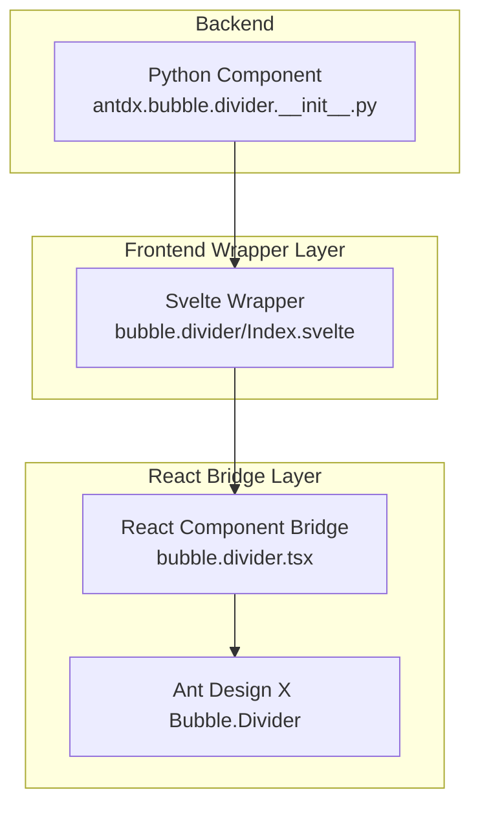
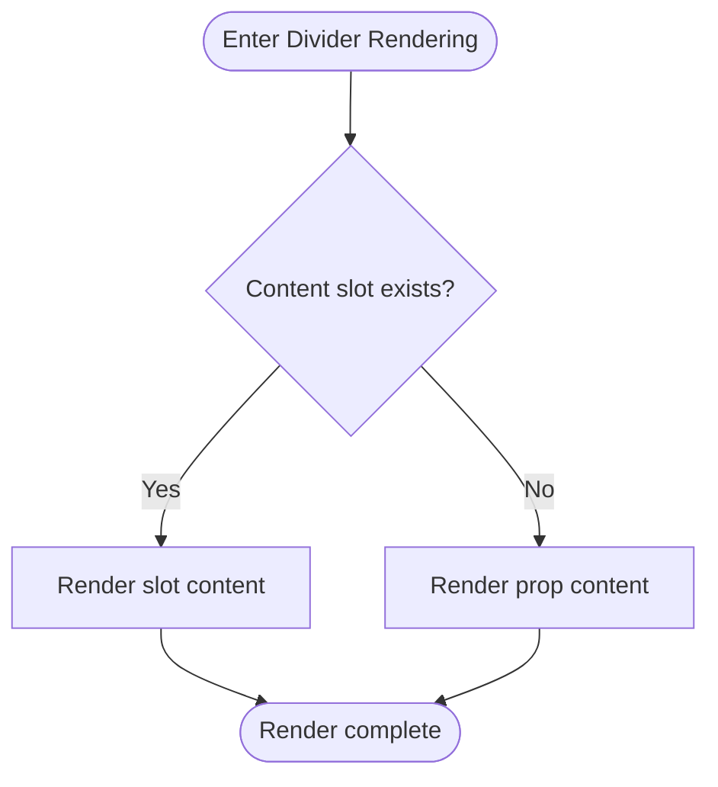

# Bubble.Divider Component

<cite>
**Files referenced in this document**
- [frontend/antdx/bubble/divider/Index.svelte](file://frontend/antdx/bubble/divider/Index.svelte)
- [frontend/antdx/bubble/divider/bubble.divider.tsx](file://frontend/antdx/bubble/divider/bubble.divider.tsx)
- [backend/modelscope_studio/components/antdx/bubble/divider/__init__.py](file://backend/modelscope_studio/components/antdx/bubble/divider/__init__.py)
- [frontend/antdx/bubble/bubble.tsx](file://frontend/antdx/bubble/bubble.tsx)
</cite>

## Introduction

Bubble.Divider is a time separator and content partition component within the chat bubble system, used to clearly divide different time periods or logical blocks in long conversations, improving readability and user experience. It is built on Ant Design X's Bubble.Divider capabilities, supports custom title/label via content slots, and provides visibility control and style forwarding.

## Project Structure

Bubble.Divider resides within the antdx bubble system, using a layered design of "backend Python component + frontend Svelte wrapper + React component bridge":

- Backend component: Responsible for property definitions, visibility and style forwarding, and lifecycle hooks (such as preprocessing/postprocessing)
- Frontend wrapper: Svelte component handles on-demand loading, property merging, class name and style injection, slot rendering
- React component bridge: Exposes Ant Design X's Bubble.Divider capability in Svelte form

## Core Component

Bubble.Divider wraps Ant Design X's Bubble.Divider component, providing:

- Content slot (`content`): Displays text labels or custom content in the divider
- Visibility control (`visible`): Show/hide the divider via backend configuration
- Style injection: Supports `elem_id`, `elem_classes`, `elem_style`, and `additional_props`

## Rendering Flow

## Usage

- **Time divider**: Insert time labels in conversation lists to help users understand temporal structure of the conversation.
- **Topic divider**: Separate content blocks between different topics or sessions for clearer navigation.
- **Status divider**: Display status changes (e.g., session start, model switch notifications) as divider content.

## Configuration Options

| Property           | Description                      |
| ------------------ | -------------------------------- |
| `content`          | Divider content (string or slot) |
| `visible`          | Whether to render the divider    |
| `elem_id`          | Element ID                       |
| `elem_classes`     | Element CSS classes              |
| `elem_style`       | Inline element styles            |
| `additional_props` | Additional property set          |

## Best Practices

- Prefer the `content` slot for flexibility over plain string props.
- Keep divider content concise and consistent for better visual rhythm.
- Use `elem_id` / `elem_classes` for precise style control, avoiding global pollution.
