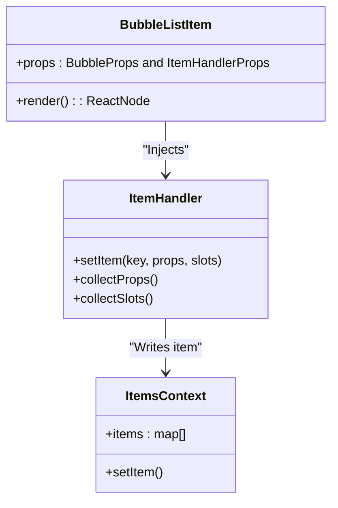
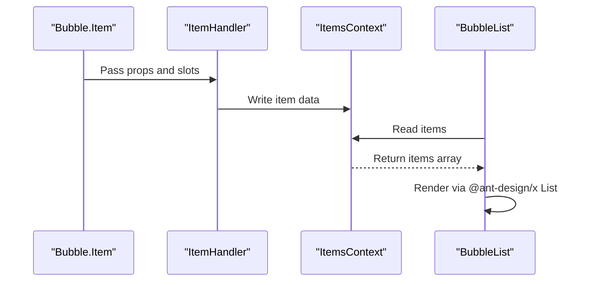

# Bubble.Item Component

<cite>
**Files referenced in this document**
- [frontend/antdx/bubble/list/item/Item.svelte](file://frontend/antdx/bubble/list/item/Item.svelte)
- [frontend/antdx/bubble/list/item/bubble.list.item.tsx](file://frontend/antdx/bubble/list/item/bubble.list.item.tsx)
- [frontend/antdx/bubble/bubble.tsx](file://frontend/antdx/bubble/bubble.tsx)
- [frontend/antdx/bubble/list/bubble.list.tsx](file://frontend/antdx/bubble/list/bubble.list.tsx)
- [frontend/antdx/bubble/list/context.ts](file://frontend/antdx/bubble/list/context.ts)
- [frontend/utils/createItemsContext.tsx](file://frontend/utils/createItemsContext.tsx)
</cite>

## Introduction

Bubble.Item is a message item wrapper component within the Bubble.List system. It injects the item context via `ItemHandler`, enabling individual message items to participate in the list rendering lifecycle. When used as a child of BubbleList, Bubble.Item passes its properties and slots to the parent list for unified rendering.

## Architecture



## Key Design Points

- **ItemHandler injection**: Bubble.Item wraps ItemHandler, writing its own props/slots/children to ItemsContext for the parent BubbleList to consume and render.
- **Context communication**: Data flows from Bubble.Item → ItemHandler → ItemsContext → BubbleList rendering, ensuring full decoupling.
- **Slot support**: Supports all Bubble slots: avatar, header, footer, extra, content, loadingRender, contentRender.

## Data Flow



## Configuration

Bubble.Item accepts all Bubble component properties and additionally:

- **Slot support**: All Bubble slots (avatar, header, footer, extra, content, loadingRender, contentRender)
- **List context**: Automatically participates in parent list context when used as a child of BubbleList

## Usage Example

```python
import modelscope_studio as mgr

with mgr.antdx.Bubble.List():
    mgr.antdx.Bubble.Item(content="Hello, how can I help you?")
    mgr.antdx.Bubble.Item(content="I need assistance with deployment.")
```

## Troubleshooting

- **Item not showing**: Check that `visible` is truthy and that Bubble.Item is correctly wrapped in a BubbleList context.
- **Item content not updating**: Confirm props are stable; ItemHandler compares previous values and only writes if they change.
- **Slot not working**: Ensure slot names match backend declarations.
