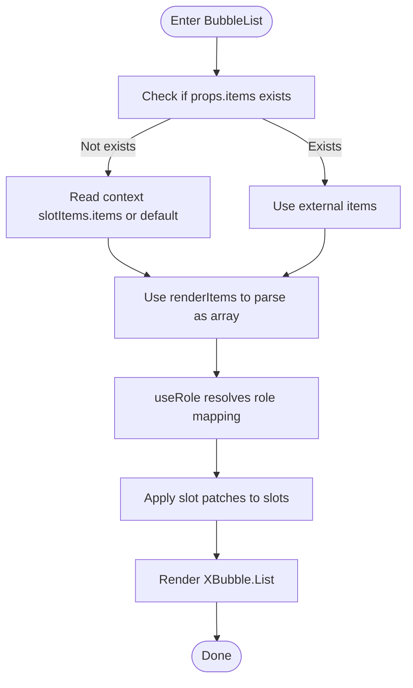

# Bubble.List Component

<cite>
**Files referenced in this document**
- [frontend/antdx/bubble/list/bubble.list.tsx](file://frontend/antdx/bubble/list/bubble.list.tsx)
- [frontend/antdx/bubble/list/Index.svelte](file://frontend/antdx/bubble/list/Index.svelte)
- [frontend/antdx/bubble/list/context.ts](file://frontend/antdx/bubble/list/context.ts)
- [frontend/antdx/bubble/list/utils.tsx](file://frontend/antdx/bubble/list/utils.tsx)
- [frontend/antdx/bubble/list/item/bubble.list.item.tsx](file://frontend/antdx/bubble/list/item/bubble.list.item.tsx)
- [frontend/antdx/bubble/list/role/bubble.list.role.tsx](file://frontend/antdx/bubble/list/role/bubble.list.role.tsx)
</cite>

## Introduction

Bubble.List is the message list container component in the Bubble system. It is responsible for collecting external items and slot items, injecting role context, resolving role mappings via `useRole`, and delegating final rendering to @ant-design/x's List.

## Rendering Flow

## Key Features

- **Items merging**: Prioritizes `props.items`; if not provided, reads `slotItems.items` or `default` from context, then uses `renderItems` to normalize to an array.
- **Role resolution**: Uses `useRole` to support role as string, function, or object, with `preProcess` and `defaultRolePostProcess` hooks.
- **Slot patching**: Applies patches to slots so role's avatar/header/footer/extra/loadingRender/contentRender can be overridden in advance.
- **Render and scroll**: Renders via @ant-design/x's `XBubble.List`, with auto-scroll binding and scroll event callbacks.

## Configuration Options

| Property       | Description                                      |
| -------------- | ------------------------------------------------ |
| `items`        | Message items array                              |
| `role`         | Role configuration (string, function, or object) |
| `auto_scroll`  | Whether to auto-scroll to the latest message     |
| `visible`      | Whether to render the component                  |
| `elem_id`      | Element ID                                       |
| `elem_classes` | Element CSS classes                              |

## Collaboration with Bubble.Item and Bubble.Role

- **Bubble.Item**: Wraps ItemHandler, injecting message item props and slots into context for BubbleList to read during rendering.
- **Bubble.Role**: Wraps RoleItemHandler, injecting role definitions into role context for useRole to resolve.
- **Data flow**: BubbleList reads items/default and role from context before rendering, then generates the complete items array and role configuration.

## Performance Considerations

- Uses `useMemo` to cache items, reducing unnecessary re-renders.
- `ItemHandler` uses `useMemoizedFn` and `useMemoizedEqualValue` to reduce duplicate computations and invalid updates.
- `ItemsContextProvider` updates the entire child items array in a single `setItem` call.

## Troubleshooting

- **Items not displayed**: Check if `visible` is truthy and that the parent component correctly wraps `withItemsContextProvider`.
- **Role configuration not working**: Ensure `Bubble.Role` correctly injects role context and that `useRole` receives the expected configuration.
- **Auto-scroll not working**: Confirm `auto_scroll` is enabled; consider performance implications with large message sets.
