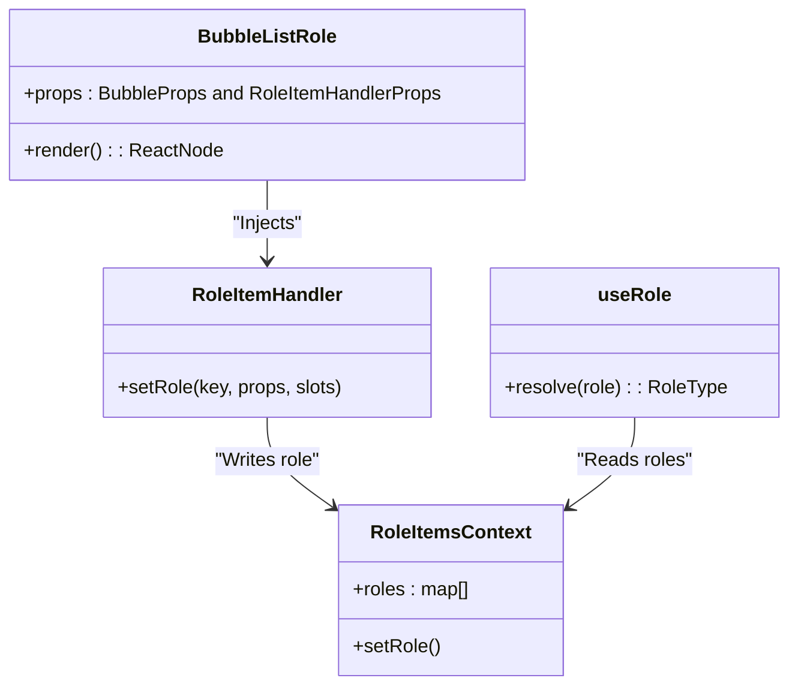
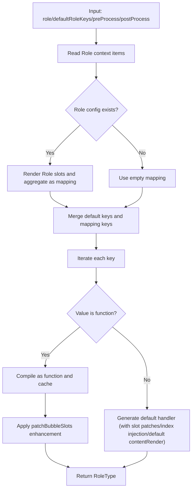

# Bubble.Role Component

<cite>
**Files referenced in this document**
- [frontend/antdx/bubble/list/role/Role.svelte](file://frontend/antdx/bubble/list/role/Role.svelte)
- [frontend/antdx/bubble/list/role/bubble.list.role.tsx](file://frontend/antdx/bubble/list/role/bubble.list.role.tsx)
- [backend/modelscope_studio/components/antdx/bubble/list/role/__init__.py](file://backend/modelscope_studio/components/antdx/bubble/list/role/__init__.py)
- [frontend/antdx/bubble/list/role/Index.svelte](file://frontend/antdx/bubble/list/role/Index.svelte)
- [frontend/antdx/bubble/list/context.ts](file://frontend/antdx/bubble/list/context.ts)
- [frontend/antdx/bubble/list/utils.tsx](file://frontend/antdx/bubble/list/utils.tsx)
</cite>

## Introduction

Bubble.Role is a role identifier component within the Bubble.List system. It injects role configurations into the role context via `RoleItemHandler`, so that `useRole` can resolve them into the `RoleType` required by @ant-design/x. Each Bubble.Role defines the visual style and behavior defaults for a specific role (e.g., user, assistant, system).

## Architecture



## Key Design Points

- **RoleItemHandler injection**: Bubble.Role wraps RoleItemHandler, writing its own props/slots to RoleItemsContext for `useRole` to resolve.
- **Role key**: Each Bubble.Role must specify a unique role key matching the `role` field in message items.
- **Slot support**: Supports Bubble slots: avatar, header, footer, extra, content, loadingRender, contentRender.

## Usage Example

```python
import modelscope_studio as mgr

with mgr.antdx.Bubble.List():
    with mgr.antdx.Bubble.Role(role="user"):
        with mgr.Slot("avatar"):
            mgr.antdx.Avatar(icon="UserOutlined")
    with mgr.antdx.Bubble.Role(role="assistant"):
        with mgr.Slot("avatar"):
            mgr.antdx.Avatar(src="/bot-avatar.png")
```

## Role Resolution Flow



## Configuration Options

| Property      | Description                  |
| ------------- | ---------------------------- |
| `role`        | Unique role key identifier   |
| `avatar`      | Avatar configuration or slot |
| `placement`   | Bubble placement (start/end) |
| `styles`      | Style configuration          |
| `class_names` | CSS class name configuration |

## Best Practices

- Define all roles used in messages before rendering BubbleList.
- Use consistent role key naming (e.g., "user", "assistant", "system") for better readability.
- Configure avatar, styles, and class_names via Bubble.Role slots for centralized role management.
