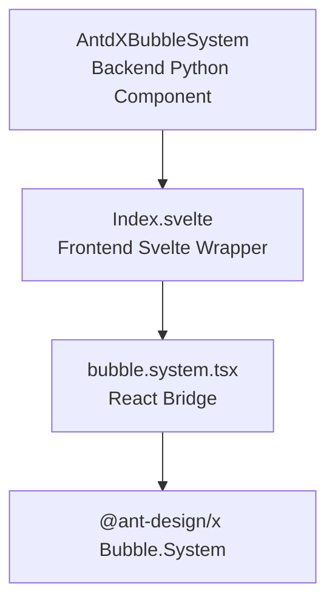
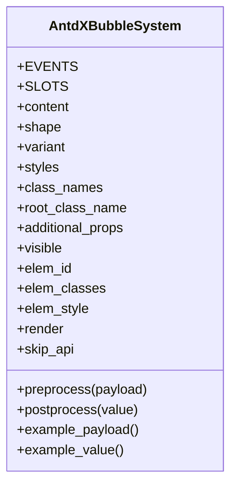
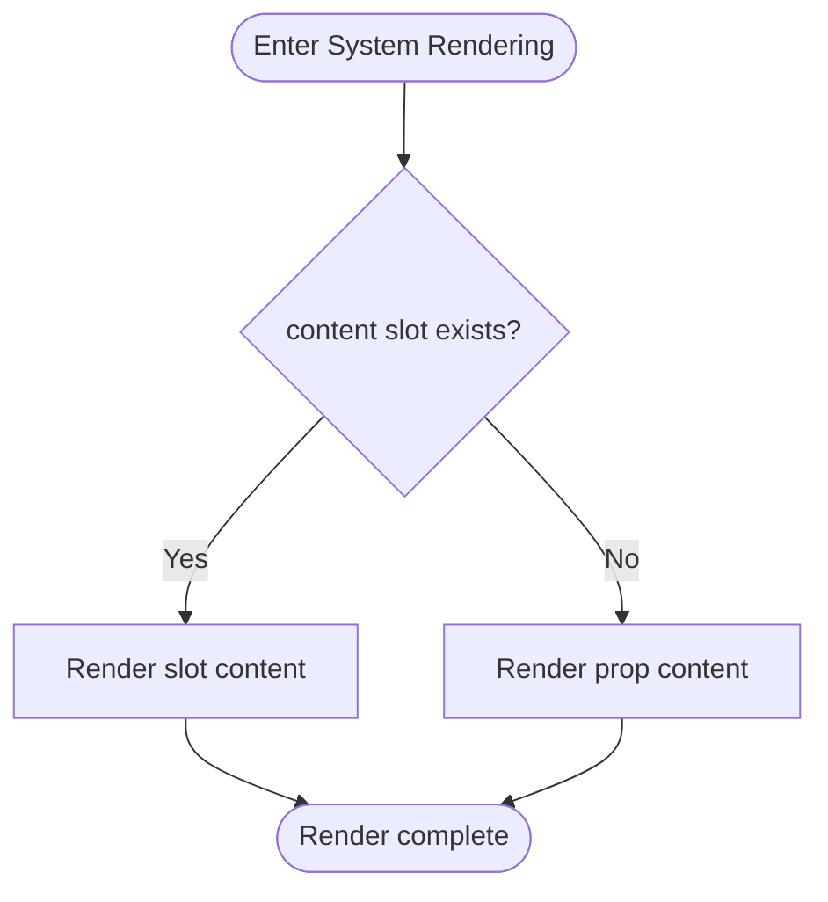

# Bubble.System Component

<cite>
**Files referenced in this document**
- [frontend/antdx/bubble/system/Index.svelte](file://frontend/antdx/bubble/system/Index.svelte)
- [frontend/antdx/bubble/system/bubble.system.tsx](file://frontend/antdx/bubble/system/bubble.system.tsx)
- [backend/modelscope_studio/components/antdx/bubble/system/__init__.py](file://backend/modelscope_studio/components/antdx/bubble/system/__init__.py)
</cite>

## Introduction

Bubble.System is a system message component within the Bubble family, used for rendering system prompts, status notifications, and operational feedback. It integrates Ant Design X's system bubble capabilities into ModelScope Studio's component ecosystem through clear frontend-backend layered design.

## Project Structure

## Core Component

The `AntdXBubbleSystem` backend class inherits from ModelScope Studio's layout component base class with the following key properties:

## Rendering Flow

## Differences from Regular Bubble

- **Role positioning**: Regular Bubble is used for user/bot conversation content rendering with rich slots (avatar, header, footer, extra, etc.); Bubble.System focuses on system prompts, status notifications, and non-conversational content.
- **Slots and properties**: Regular Bubble supports more slots; System Bubble only focuses on the `content` slot and basic properties, keeping it simple and consistent.
- **Rendering target**: Regular Bubble faces "person" and "role" interaction content; System Bubble faces information communicated by "system" to the user.

## Configuration Options

| Property                   | Description                                        |
| -------------------------- | -------------------------------------------------- |
| `content`                  | System message content (string or slot)            |
| `shape`                    | Bubble shape (round/corner/default)                |
| `variant`                  | Visual variant (filled/borderless/outlined/shadow) |
| `styles` / `elem_style`    | Inline styles                                      |
| `elem_id` / `elem_classes` | Element ID and class names                         |
| `additional_props`         | Additional property set                            |
| `visible`                  | Whether to render                                  |

## Usage Scenarios

- **Welcome message**: Display welcome text when user first enters the page.
- **Error notification**: Notify user of network or service errors.
- **Progress notification**: Stage-by-stage prompts during background task execution.

## Performance Considerations

- `Index.svelte` uses dynamic imports, only loading the system bubble wrapper when visible, reducing initial render overhead.
- `ReactSlot` only renders when slots exist, avoiding unnecessary computations for empty content.
- Only passes necessary properties and slots, reducing unnecessary re-renders and style calculations.

## Troubleshooting

- **Content not showing**: Check that `content` is correctly passed via slot or property; slots take priority. Confirm `visible` is truthy.
- **Style abnormalities**: Check that `elem_id`, `elem_classes`, `elem_style` are injected as expected.
- **Slot not working**: Ensure slot name matches backend declaration (currently only supports `content` slot).
