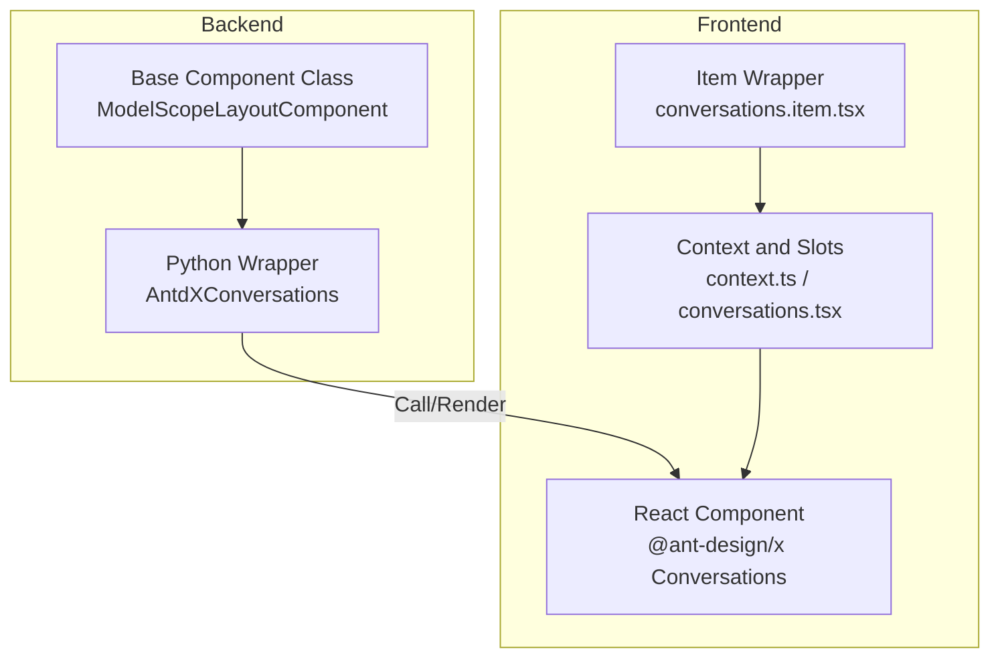
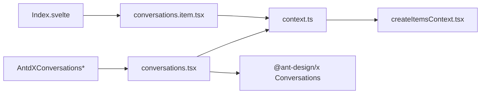

# Component Overview

<cite>
**Files referenced in this document**
- [backend/modelscope_studio/components/antdx/__init__.py](file://backend/modelscope_studio/components/antdx/__init__.py)
- [backend/modelscope_studio/components/antdx/conversations/__init__.py](file://backend/modelscope_studio/components/antdx/conversations/__init__.py)
- [frontend/antdx/conversations/conversations.tsx](file://frontend/antdx/conversations/conversations.tsx)
- [frontend/antdx/conversations/context.ts](file://frontend/antdx/conversations/context.ts)
- [frontend/antdx/conversations/item/conversations.item.tsx](file://frontend/antdx/conversations/item/conversations.item.tsx)
</cite>

## Introduction

This overview covers the Conversations management component, systematically introducing its overall architecture, core functionality, and design philosophy. It explains its relationship with the Ant Design X component library and typical usage in machine learning and conversational applications, providing entry points and core concepts to help developers quickly understand and integrate this component.

## Project Structure

The Conversations component is located in the Ant Design X frontend ecosystem. The backend bridges to the Gradio ecosystem via Python wrappers; the frontend connects to Ant Design X's Conversations implementation as React components, extending menu, grouping, and other capabilities through context and slot mechanisms.



## Core Components

### AntdXConversations (Backend)

The Python-side wrapper class for the Conversations component:

- Inherits from `ModelScopeLayoutComponent`, providing unified lifecycle and rendering strategy.
- Declares supported slots and events, ensuring frontend wrapper layer correctly interfaces.
- Property set covers common needs: `items`, `active_key`, `groupable`, `menu`.

Key events:

- `active_change`: Active conversation changed
- `menu_click` / `menu_select` / `menu_deselect` / `menu_open_change`: Menu interaction events
- `groupable_expand`: Group expand/collapse
- `creation_click`: Creation button click

### conversations.tsx (Frontend)

The frontend React wrapper implementation:

- Uses `withItemsContextProvider` to provide items context to child `Conversations.Item` components.
- Uses `withMenuItemsContextProvider` to provide menu items context.
- Uniformly injects style class names to child items.
- Converts slot menu items to menu configuration required by @ant-design/x.

### conversations.item.tsx (Frontend)

The Conversations.Item bridge component:

- Uses `ItemHandler` to write its own props/slots to `ItemsContext`.
- Supports `label`, `icon`, and other slots.

## Architecture Overview



## Usage Patterns

### Basic Usage

```python
import modelscope_studio as mgr

conversations = mgr.antdx.Conversations(
    items=[
        {"key": "1", "label": "Conversation 1"},
        {"key": "2", "label": "Conversation 2"},
    ]
)
```

### With Grouping

```python
conversations = mgr.antdx.Conversations(
    groupable=True,
    items=[
        {"key": "1", "label": "Conv 1", "group": "Today"},
        {"key": "2", "label": "Conv 2", "group": "Yesterday"},
    ]
)
```

## Key Design Concepts

- **Context-driven**: The parent container provides context; child items write to context. This decouples parent-child communication and enables flexible composition.
- **Slot-first**: All display customization (icons, labels, menus) is achieved through slots for maximum flexibility.
- **Event-driven**: Key interactions (selection, menu operations, group toggle) are exposed as events for backend Python processing.
