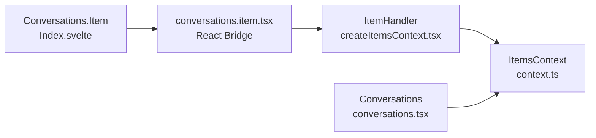
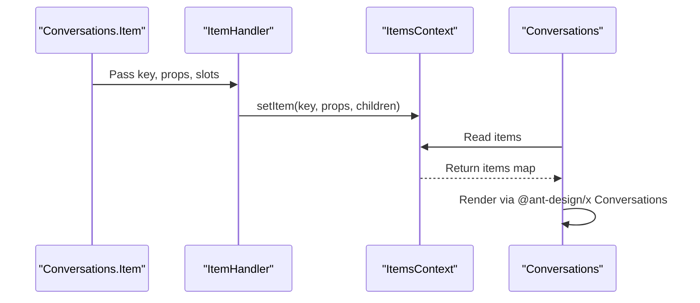

# Conversation Item Component

<cite>
**Files referenced in this document**
- [frontend/antdx/conversations/item/Index.svelte](file://frontend/antdx/conversations/item/Index.svelte)
- [frontend/antdx/conversations/item/conversations.item.tsx](file://frontend/antdx/conversations/item/conversations.item.tsx)
- [backend/modelscope_studio/components/antdx/conversations/item/__init__.py](file://backend/modelscope_studio/components/antdx/conversations/item/__init__.py)
- [frontend/utils/createItemsContext.tsx](file://frontend/utils/createItemsContext.tsx)
</cite>

## Introduction

`Conversations.Item` is an individual conversation item component within the Conversations system. It bridges slot content and properties to the parent `Conversations` container via `ItemHandler`, enabling the parent to render all items uniformly. This design ensures complete decoupling between parent and child while supporting rich slot customization.

## Architecture



## Key Design Points

- **ItemHandler injection**: Conversations.Item writes its own props/slots to `ItemsContext` via ItemHandler for the parent Conversations to consume and render.
- **Lazy loading**: `Index.svelte` only renders the bridge component when `visible` is true.
- **Props comparison**: ItemHandler uses memoized comparison to avoid unnecessary writes.

## Data Flow



## Properties

| Property   | Type | Default  | Description                             |
| ---------- | ---- | -------- | --------------------------------------- |
| `key`      | str  | required | Unique conversation item identifier     |
| `label`    | str  | `None`   | Display text (overridden by label slot) |
| `icon`     | any  | `None`   | Item icon (overridden by icon slot)     |
| `disabled` | bool | `False`  | Whether the item is disabled            |
| `group`    | str  | `None`   | Group this item belongs to              |
| `visible`  | bool | `True`   | Whether to render this item             |

## Slots

| Slot    | Description            |
| ------- | ---------------------- |
| `label` | Custom label rendering |
| `icon`  | Custom icon rendering  |

## Usage Example

```python
import modelscope_studio as mgr

with mgr.antdx.Conversations() as conv:
    # Simple text item
    mgr.antdx.Conversations.Item(key="1", label="Project Alpha")

    # Item with custom icon and label
    with mgr.antdx.Conversations.Item(key="2"):
        with mgr.Slot("icon"):
            mgr.antdx.Icon(type="StarOutlined")
        with mgr.Slot("label"):
            mgr.antdx.Typography.Text("★ Starred Chat", strong=True)

    # Item with context menu
    with mgr.antdx.Conversations.Item(key="3", label="Chat with menu"):
        with mgr.Slot("menu.items"):
            mgr.antdx.MenuItem(key="pin", label="Pin")
            mgr.antdx.MenuItem(key="delete", label="Delete", danger=True)
```

## Troubleshooting

- **Item not visible**: Check `visible` property and confirm item is inside a Conversations container.
- **Label not showing**: Confirm the label slot or label property is correctly set.
- **Icon not showing**: Ensure icon slot content is a valid React/Svelte element.
- **Menu items not working**: Verify menu items are injected via `menu.items` slot and the parent handles `menu_click` events.
