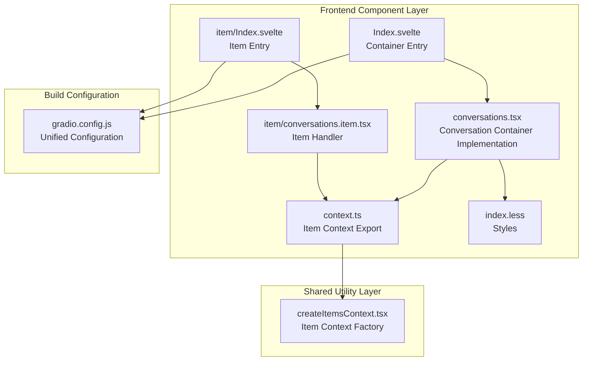
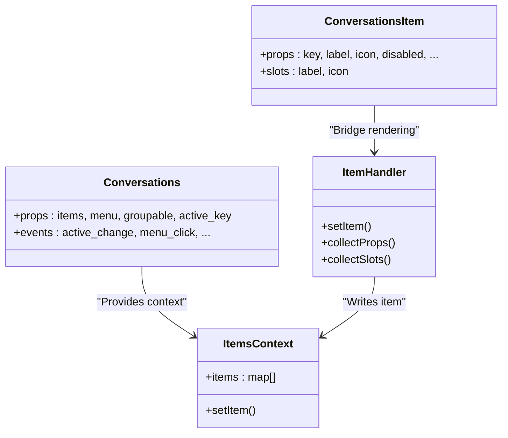

# Conversations Management

<cite>
**Files referenced in this document**
- [frontend/antdx/conversations/Index.svelte](file://frontend/antdx/conversations/Index.svelte)
- [frontend/antdx/conversations/conversations.tsx](file://frontend/antdx/conversations/conversations.tsx)
- [frontend/antdx/conversations/context.ts](file://frontend/antdx/conversations/context.ts)
- [frontend/antdx/conversations/item/Index.svelte](file://frontend/antdx/conversations/item/Index.svelte)
- [frontend/antdx/conversations/item/conversations.item.tsx](file://frontend/antdx/conversations/item/conversations.item.tsx)
- [frontend/utils/createItemsContext.tsx](file://frontend/utils/createItemsContext.tsx)
- [frontend/antdx/conversations/index.less](file://frontend/antdx/conversations/index.less)
- [frontend/antdx/conversations/gradio.config.js](file://frontend/antdx/conversations/gradio.config.js)
</cite>

## Table of Contents

1. [Introduction](#introduction)
2. [Project Structure](#project-structure)
3. [Core Components](#core-components)
4. [Architecture Overview](#architecture-overview)
5. [Detailed Component Analysis](#detailed-component-analysis)
6. [Dependency Analysis](#dependency-analysis)
7. [Performance Considerations](#performance-considerations)
8. [Troubleshooting Guide](#troubleshooting-guide)
9. [Conclusion](#conclusion)
10. [Appendix](#appendix)

## Introduction

This document systematically describes the design and implementation of the Conversations management component, covering:

- Conversation list management: adding, deleting, sorting, state management
- Conversations.Item rendering logic, interaction behavior, and state control
- Component Context role and conversation state sharing mechanism
- Property configuration, event callbacks, style customization, and best practices
- Complete usage examples: basic usage, dynamic add/remove, state synchronization

## Project Structure

The Conversations component consists of three layers: "container layer + item handler + context", bridged to the runtime environment via Gradio configuration.

## Core Components

- **Conversations**: The parent container that manages the conversation list. Parses items and menu configuration, injects them into @ant-design/x's Conversations, wraps with `withItemsContextProvider` and `withMenuItemsContextProvider` to provide contexts.
- **Conversations.Item**: A single conversation item. Writes its own props/slots/children to ItemsContext via `ItemHandler` for the parent container to render.

## Architecture Overview

## Detailed Component Analysis

### Conversations Container

- Parses `items` and menu configuration, injects into @ant-design/x's Conversations.
- Wraps with `withItemsContextProvider` and `withMenuItemsContextProvider` for Items and menu contexts.
- Uniformly injects style class names (e.g., item class names) to ensure theme consistency.

### Conversations.Item

- Uses `ItemHandler` to write its own props/slots/children to `ItemsContext`.
- Parent container consumes and renders items uniformly.

### Menu Operations (Add, Delete, Rename)

- Inject menu items via Slot (`menu.items`), supporting icons, disabled state, and danger styling.
- The `menu_click` event callback provides the clicked item and menu information.

### Conversation Grouping and Collapsible

- Enable grouping by setting `groupable=True`.
- Each conversation item sets a `group` field for grouping.
- Supports group label slots and collapsible functions.

### Events and State Management

Key events:

- `active_change`: Selected item changed
- `menu_click` / `menu_select` / `menu_deselect` / `menu_open_change`: Menu interactions
- `groupable_expand`: Group expand/collapse
- `creation_click`: Create button click

## Dependency Analysis

- **Component coupling**: Conversations.Item depends on `ItemHandler` and `ItemsContext` with low coupling, easy to reuse. The parent container centralizes items, menu, and grouping handling.
- **External dependencies**: @ant-design/x provides the core Conversations component; Gradio component system provides `AntdXConversations`/`AntdXConversationsItem` as bridges.

## Performance Considerations

- **Lazy loading and conditional rendering**: `Index.svelte` only renders child items when `visible` is true, avoiding unnecessary initialization overhead.
- **Context update minimization**: `ItemHandler` uses `useMemoizedFn` and `useMemoizedEqualValue` to reduce duplicate computations and invalid updates.
- **Batch writing**: `ItemsContextProvider` updates the entire child items array in a single `setItem` call, reducing re-render frequency.
- **Style injection**: Parent container uniformly injects style class names to avoid jitter from child items setting styles repeatedly.

## Troubleshooting Guide

- **Child items not showing**: Check if `visible` is truthy; confirm parent component correctly wraps `withItemsContextProvider`.
- **Child item content not updating**: Confirm props are stable; `ItemHandler` compares previous values and won't write if equal.
- **Menu not working**: Confirm parent component correctly injects `menu` configuration or injects menu items via Slot.
- **Style abnormalities**: Parent component has already injected item class names; confirm they haven't been externally overridden.

## Conclusion

Conversations.Item achieves flexible item collection and rendering through `ItemHandler` and `ItemsContext`. Combined with the parent `Conversations` container's unified configuration and event management, it can efficiently build complex conversation list scenarios with emphasis on decoupling and extensibility.

## Appendix

### Events and Slots Summary

- **Events**: active_change, menu_click, menu_deselect, menu_open_change, menu_select, groupable_expand, creation_click
- **Slots**: menu.expandIcon, menu.overflowedIndicator, menu.trigger, groupable.label, items, creation.icon, creation.label
