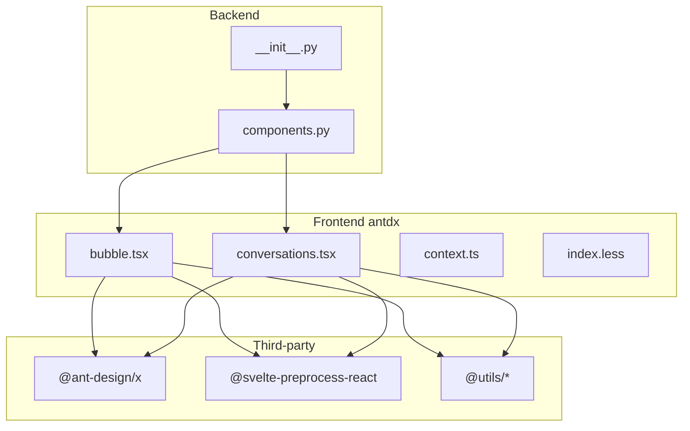
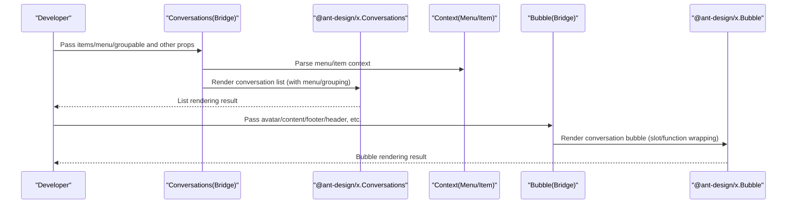
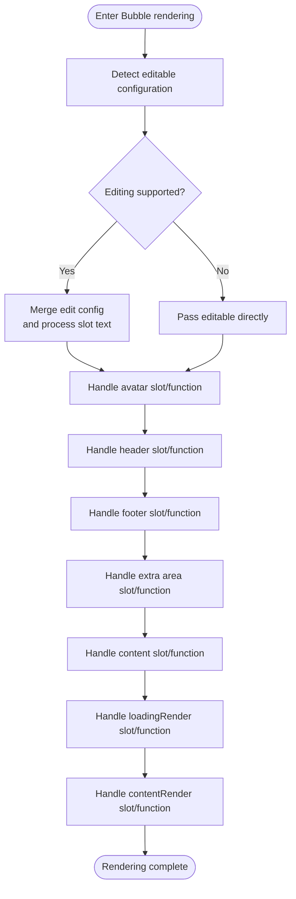
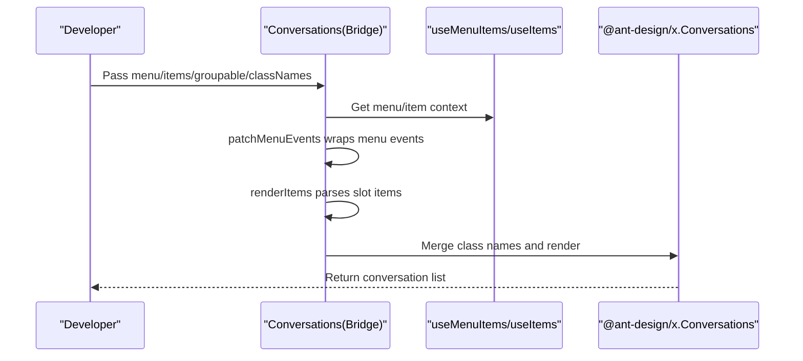
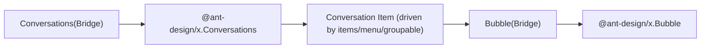
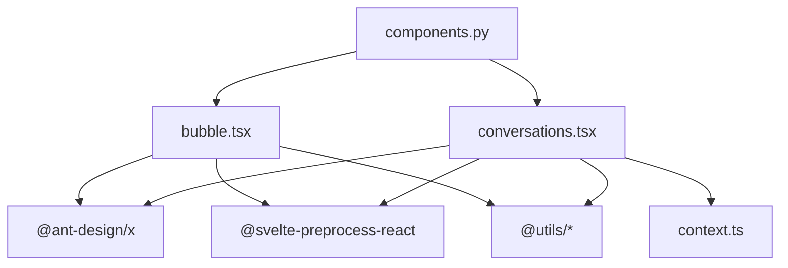

# General Components

<cite>
**Files referenced in this document**
- [bubble.tsx](file://frontend/antdx/bubble/bubble.tsx)
- [conversations.tsx](file://frontend/antdx/conversations/conversations.tsx)
- [context.ts](file://frontend/antdx/conversations/context.ts)
- [index.less](file://frontend/antdx/conversations/index.less)
- [__init__.py](file://backend/modelscope_studio/components/antdx/__init__.py)
- [components.py](file://backend/modelscope_studio/components/antdx/components.py)
- [README-zh_CN.md](file://README-zh_CN.md)
</cite>

## Table of Contents

1. [Introduction](#introduction)
2. [Project Structure](#project-structure)
3. [Core Components](#core-components)
4. [Architecture Overview](#architecture-overview)
5. [Detailed Component Analysis](#detailed-component-analysis)
6. [Dependency Analysis](#dependency-analysis)
7. [Performance Considerations](#performance-considerations)
8. [Troubleshooting Guide](#troubleshooting-guide)
9. [Conclusion](#conclusion)
10. [Appendix](#appendix)

## Introduction

This document covers the Ant Design X general components, focusing on the implementation and usage of the Bubble conversation bubble component and the Conversations conversation management component. Topics include:

- Bubble's conversation display capabilities, message type differentiation, and style/content customization
- Conversations' conversation list management, state control, menu and grouping operation interfaces
- Collaboration relationships between components and best practices
- Complete usage examples (basic usage, advanced configuration, style customization)

## Project Structure

The Ant Design X general components are located in the antdx category of the frontend directory. They use a Svelte + React preprocessing bridge solution, wrapping native @ant-design/x components via sveltify to make them usable in Svelte. The backend Python package provides a unified export entry.

Diagram sources

- [bubble.tsx:1-119](file://frontend/antdx/bubble/bubble.tsx#L1-L119)
- [conversations.tsx:1-178](file://frontend/antdx/conversations/conversations.tsx#L1-L178)
- [context.ts:1-7](file://frontend/antdx/conversations/context.ts#L1-L7)
- [**init**.py](file://backend/modelscope_studio/components/antdx/__init__.py)
- [components.py](file://backend/modelscope_studio/components/antdx/components.py)

Section sources

- [bubble.tsx:1-119](file://frontend/antdx/bubble/bubble.tsx#L1-L119)
- [conversations.tsx:1-178](file://frontend/antdx/conversations/conversations.tsx#L1-L178)
- [context.ts:1-7](file://frontend/antdx/conversations/context.ts#L1-L7)
- [**init**.py](file://backend/modelscope_studio/components/antdx/__init__.py)
- [components.py](file://backend/modelscope_studio/components/antdx/components.py)

## Core Components

- Bubble: A conversation bubble display component that supports slot-based extensions for avatar, title, content, footer, extra area, editable text, loading state rendering, and content rendering.
- Conversations: A conversation list management component that supports menu injection, grouping configuration, item rendering, class name merging, and event pass-through.

Section sources

- [bubble.tsx:14-116](file://frontend/antdx/bubble/bubble.tsx#L14-L116)
- [conversations.tsx:59-175](file://frontend/antdx/conversations/conversations.tsx#L59-L175)

## Architecture Overview

Both Bubble and Conversations are bridged to native @ant-design/x components through sveltify. The bridge layer handles:

- Slot-to-ReactSlot mapping
- useFunction wrapping of function-type properties
- Context and rendering tool integration for menu and grouping configuration
- Class name merging and overriding

Diagram sources

- [conversations.tsx:68-175](file://frontend/antdx/conversations/conversations.tsx#L68-L175)
- [bubble.tsx:27-116](file://frontend/antdx/bubble/bubble.tsx#L27-L116)

## Detailed Component Analysis

### Bubble Component Analysis

- Key Features
  - Supports slot-based extensions for avatar, title, content, footer, and extra area
  - Supports editable mode (boolean or configuration object), with slots for customizing "confirm/cancel" text
  - Supports typing callbacks and function-based configuration for loadingRender/contentRender
  - Handles editable, avatar, header, footer, extra, loadingRender, contentRender uniformly with fallback
- Data Flow and Processing Logic
  - Uses useFunction to wrap function-type properties, ensuring correct execution in the Svelte environment
  - Renders slot content via ReactSlot; renderParamsSlot supports slots with parameters
  - Performs configuration merging and conditional rendering for editable, compatible with both boolean and object configuration
- Complexity and Performance
  - Primarily involves property mapping and rendering overhead; complexity scales with slot count and nesting depth
  - Function wrapping avoids redundant rendering and improves interaction responsiveness

Diagram sources

- [bubble.tsx:27-116](file://frontend/antdx/bubble/bubble.tsx#L27-L116)

Section sources

- [bubble.tsx:8-116](file://frontend/antdx/bubble/bubble.tsx#L8-L116)

### Conversations Component Analysis

- Key Features
  - Interfaces with @ant-design/x Conversations, providing menu injection, grouping configuration, item rendering, and class name merging
  - Parses menu and item slots via useMenuItems and useItems context
  - Supports string-form menu property and object configuration, automatically merges events and prevents bubbling
  - Supports label slot for groupable and collapsible function configuration
- Data Flow and Processing Logic
  - patchMenuEvents: Wraps menu events, injects the conversation parameter and prevents DOM event bubbling
  - renderItems: Converts slot items into actual rendered items, supporting cloning and deep copying
  - useMemo: Memoizes menu and items to reduce unnecessary re-renders
- Complexity and Performance
  - Memoization and context parsing deliver stable performance; more slot items means greater renderItems overhead
  - Menu event wrapping only takes effect when a menu exists, avoiding unnecessary overhead

Diagram sources

- [conversations.tsx:35-175](file://frontend/antdx/conversations/conversations.tsx#L35-L175)
- [context.ts:1-7](file://frontend/antdx/conversations/context.ts#L1-L7)

Section sources

- [conversations.tsx:28-175](file://frontend/antdx/conversations/conversations.tsx#L28-L175)
- [context.ts:1-7](file://frontend/antdx/conversations/context.ts#L1-L7)

### Component Collaboration

- Conversations serves as the container, responsible for rendering the conversation list and managing menu/grouping configuration
- Bubble serves as a child element, responsible for displaying and interacting with individual conversation bubbles
- Both work together through @ant-design/x's native components, with the bridge layer providing slot and function wrapping capabilities

Diagram sources

- [conversations.tsx:139-171](file://frontend/antdx/conversations/conversations.tsx#L139-L171)
- [bubble.tsx:38-115](file://frontend/antdx/bubble/bubble.tsx#L38-L115)

## Dependency Analysis

- Third-party Dependencies
  - @ant-design/x: Provides native conversation and bubble components
  - @svelte-preprocess-react: Provides sveltify and ReactSlot capabilities
  - @utils/\*: Provides tools like useFunction, renderItems, renderParamsSlot, createFunction
  - classnames: Used for class name merging
- Backend Exports
  - The Python package exposes antdx components through **init**.py and components.py, enabling use in Python environments

Diagram sources

- [bubble.tsx:1-7](file://frontend/antdx/bubble/bubble.tsx#L1-L7)
- [conversations.tsx:1-17](file://frontend/antdx/conversations/conversations.tsx#L1-L17)
- [context.ts:1-7](file://frontend/antdx/conversations/context.ts#L1-L7)
- [components.py](file://backend/modelscope_studio/components/antdx/components.py)

Section sources

- [bubble.tsx:1-7](file://frontend/antdx/bubble/bubble.tsx#L1-L7)
- [conversations.tsx:1-17](file://frontend/antdx/conversations/conversations.tsx#L1-L17)
- [context.ts:1-7](file://frontend/antdx/conversations/context.ts#L1-L7)
- [components.py](file://backend/modelscope_studio/components/antdx/components.py)

## Performance Considerations

- Use useMemo to memoize menu and items, avoiding unnecessary re-renders
- Wrap function-type properties with useFunction to reduce closure creation and rendering jitter
- Clone slot items through renderItems to avoid side effects from shared state
- In high-volume conversation scenarios, consider lazy loading and virtual scrolling (such as capabilities provided by @ant-design/x) to reduce memory usage

## Troubleshooting Guide

- Slot not taking effect
  - Verify that slot names are consistent with the bridge layer declarations (e.g., editable.okText, editable.cancelText, content, footer, header, extra, loadingRender, contentRender)
  - Confirm that slot content is correctly rendered via ReactSlot
- Abnormal menu events
  - Check that the useMenuItems context is being used correctly
  - Confirm that patchMenuEvents correctly wraps onClick and similar events and prevents bubbling
- Class name conflicts
  - Merge custom class names through classNames to avoid overriding default styles
- Edit mode not appearing
  - Confirm that editable is an object containing the editing field, or provide custom text via slots

Section sources

- [bubble.tsx:36-64](file://frontend/antdx/bubble/bubble.tsx#L36-L64)
- [conversations.tsx:35-57](file://frontend/antdx/conversations/conversations.tsx#L35-L57)
- [conversations.tsx:145-151](file://frontend/antdx/conversations/conversations.tsx#L145-L151)

## Conclusion

Bubble and Conversations achieve complete capability encapsulation of @ant-design/x through the bridge layer, providing flexible slot-based and function-based configuration that meets diverse needs from basic conversation display to complex conversation management. It is recommended to combine context and utility functions in actual projects, and to organize slots and events appropriately for a better development experience and runtime performance.

## Appendix

- Usage Examples (based on existing repository files and component capabilities)
  - Basic Usage
    - Use Bubble to display a message, setting avatar, content, and footer
    - Use Conversations to render a conversation list, passing items and menu configuration
  - Advanced Configuration
    - Enable edit mode in Bubble, customizing "confirm/cancel" text through slots
    - Use groupable in Conversations to implement grouping and collapsing, customizing group labels through slots
  - Style Customization
    - Merge custom class names through classNames to override default styles
    - Import index.less for theme customization (if needed)

Section sources

- [bubble.tsx:14-116](file://frontend/antdx/bubble/bubble.tsx#L14-L116)
- [conversations.tsx:59-175](file://frontend/antdx/conversations/conversations.tsx#L59-L175)
- [index.less](file://frontend/antdx/conversations/index.less)
- [README-zh_CN.md](file://README-zh_CN.md)
