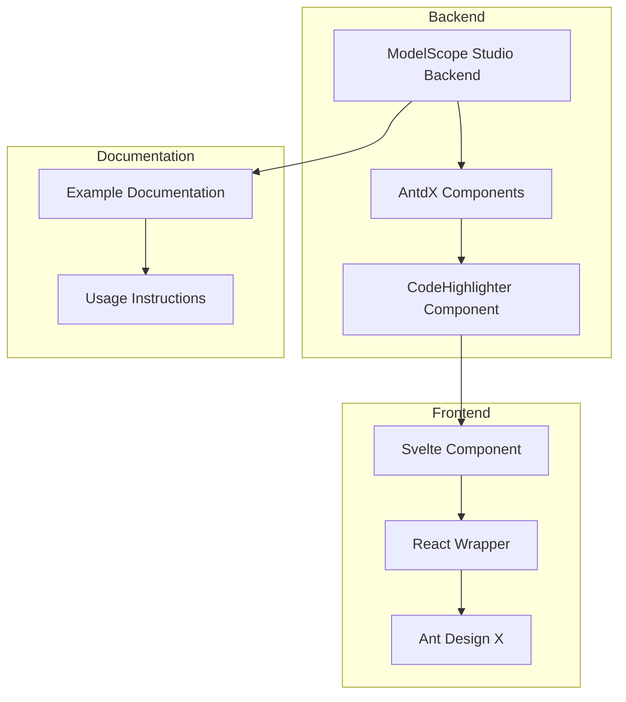
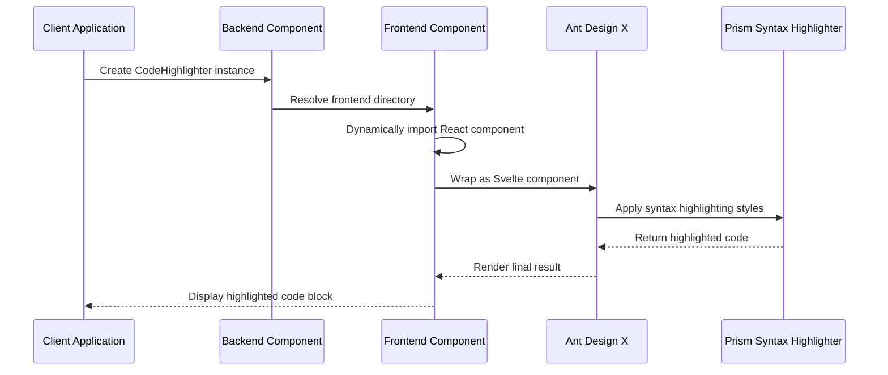
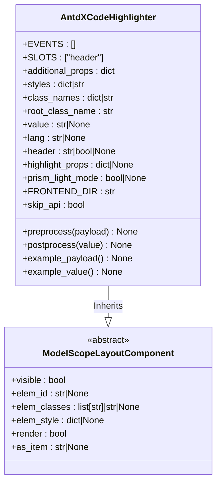
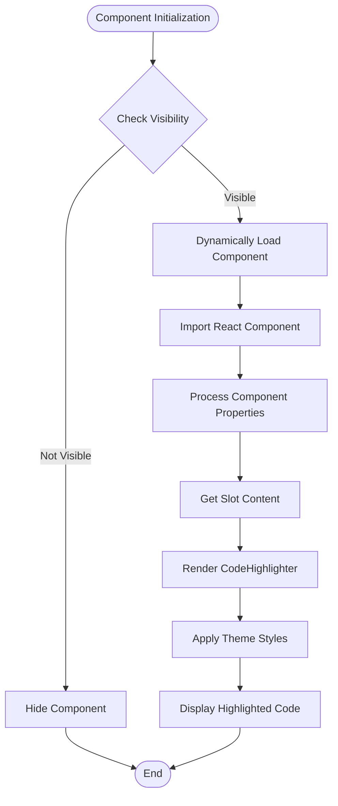
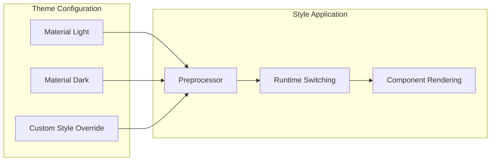

# CodeHighlighter Component

<cite>
**Files referenced in this document**
- [backend/modelscope_studio/components/antdx/code_highlighter/__init__.py](file://backend/modelscope_studio/components/antdx/code_highlighter/__init__.py)
- [frontend/antdx/code-highlighter/Index.svelte](file://frontend/antdx/code-highlighter/Index.svelte)
- [frontend/antdx/code-highlighter/code-highlighter.tsx](file://frontend/antdx/code-highlighter/code-highlighter.tsx)
- [frontend/antdx/code-highlighter/package.json](file://frontend/antdx/code-highlighter/package.json)
- [backend/modelscope_studio/components/antdx/components.py](file://backend/modelscope_studio/components/antdx/components.py)
- [docs/components/antdx/code_highlighter/README.md](file://docs/components/antdx/code_highlighter/README.md)
- [docs/components/antdx/code_highlighter/README-zh_CN.md](file://docs/components/antdx/code_highlighter/README-zh_CN.md)
</cite>

## Table of Contents

1. [Introduction](#introduction)
2. [Project Structure](#project-structure)
3. [Core Components](#core-components)
4. [Architecture Overview](#architecture-overview)
5. [Detailed Component Analysis](#detailed-component-analysis)
6. [Dependency Analysis](#dependency-analysis)
7. [Performance Considerations](#performance-considerations)
8. [Troubleshooting Guide](#troubleshooting-guide)
9. [Conclusion](#conclusion)

## Introduction

CodeHighlighter is a code highlighting component based on Ant Design X, used to provide syntax highlighting functionality in ModelScope Studio. This component supports syntax highlighting for multiple programming languages, including dark and light theme modes, and provides flexible configuration options to meet different use cases.

The component is integrated with Gradio to achieve seamless frontend-backend connection, providing users with a powerful and easy-to-use code display tool. The component supports advanced features such as custom styles, language selection, and header content.

## Project Structure

The position of the CodeHighlighter component in the overall project architecture is as follows:



**Diagram Sources**

- [backend/modelscope_studio/components/antdx/code_highlighter/**init**.py:1-71](file://backend/modelscope_studio/components/antdx/code_highlighter/__init__.py#L1-L71)
- [frontend/antdx/code-highlighter/Index.svelte:1-65](file://frontend/antdx/code-highlighter/Index.svelte#L1-L65)
- [frontend/antdx/code-highlighter/code-highlighter.tsx:1-54](file://frontend/antdx/code-highlighter/code-highlighter.tsx#L1-L54)

**Section Sources**

- [backend/modelscope_studio/components/antdx/code_highlighter/**init**.py:1-71](file://backend/modelscope_studio/components/antdx/code_highlighter/__init__.py#L1-L71)
- [backend/modelscope_studio/components/antdx/components.py:1-40](file://backend/modelscope_studio/components/antdx/components.py#L1-L40)

## Core Components

### Backend Component Class

The CodeHighlighter backend component inherits from `ModelScopeLayoutComponent`, providing complete component lifecycle management and property handling mechanisms.

**Main Features:**

- Supports syntax highlighting for multiple programming languages
- Automatic theme adaptation (dark/light mode)
- Customizable styles and class names
- Slot system supports header content
- API skip mechanism for performance optimization

**Key Properties:**

- `value`: Code content to highlight
- `lang`: Programming language type
- `header`: Header display content
- `highlight_props`: Highlight configuration properties
- `prism_light_mode`: Prism theme mode setting

**Section Sources**

- [backend/modelscope_studio/components/antdx/code_highlighter/**init**.py:15-52](file://backend/modelscope_studio/components/antdx/code_highlighter/__init__.py#L15-L52)

### Frontend Component Implementation

The frontend adopts a mixed Svelte + React architecture, bridging components through the `sveltify` tool.

**Technical Features:**

- Dynamic import for optimized loading performance
- Slot system support
- Automatic theme detection and switching
- Custom style overrides

**Section Sources**

- [frontend/antdx/code-highlighter/Index.svelte:1-65](file://frontend/antdx/code-highlighter/Index.svelte#L1-L65)
- [frontend/antdx/code-highlighter/code-highlighter.tsx:1-54](file://frontend/antdx/code-highlighter/code-highlighter.tsx#L1-L54)

## Architecture Overview

CodeHighlighter adopts a layered architecture design, achieving clear frontend-backend separation:



**Diagram Sources**

- [backend/modelscope_studio/components/antdx/code_highlighter/**init**.py:53-53](file://backend/modelscope_studio/components/antdx/code_highlighter/__init__.py#L53-L53)
- [frontend/antdx/code-highlighter/Index.svelte:10-12](file://frontend/antdx/code-highlighter/Index.svelte#L10-L12)
- [frontend/antdx/code-highlighter/code-highlighter.tsx:29-51](file://frontend/antdx/code-highlighter/code-highlighter.tsx#L29-L51)

## Detailed Component Analysis

### Component Class Structure Diagram



**Diagram Sources**

- [backend/modelscope_studio/components/antdx/code_highlighter/**init**.py:6-71](file://backend/modelscope_studio/components/antdx/code_highlighter/__init__.py#L6-L71)

### Frontend Rendering Flow



**Diagram Sources**

- [frontend/antdx/code-highlighter/Index.svelte:50-64](file://frontend/antdx/code-highlighter/Index.svelte#L50-L64)
- [frontend/antdx/code-highlighter/code-highlighter.tsx:35-51](file://frontend/antdx/code-highlighter/code-highlighter.tsx#L35-L51)

### Theme System Design

The component supports custom styles for two theme modes:



**Diagram Sources**

- [frontend/antdx/code-highlighter/code-highlighter.tsx:13-27](file://frontend/antdx/code-highlighter/code-highlighter.tsx#L13-L27)

**Section Sources**

- [frontend/antdx/code-highlighter/code-highlighter.tsx:1-54](file://frontend/antdx/code-highlighter/code-highlighter.tsx#L1-L54)

## Dependency Analysis

### Component Dependency Diagram

```mermaid
graph TB
subgraph "External Dependencies"
A[@ant-design/x]
B[react-syntax-highlighter]
C[classnames]
D[svelte-preprocess-react]
end
subgraph "Internal Dependencies"
E[ModelScopeLayoutComponent]
F[resolve_frontend_dir]
G[Gradio Integration]
end
subgraph "Component Hierarchy"
H[AntdXCodeHighlighter]
I[Index.svelte]
J[code-highlighter.tsx]
end
H --> E
H --> F
H --> G
I --> H
I --> D
I --> C
J --> A
J --> B
J --> D
```

**Diagram Sources**

- [frontend/antdx/code-highlighter/code-highlighter.tsx:1-11](file://frontend/antdx/code-highlighter/code-highlighter.tsx#L1-L11)
- [frontend/antdx/code-highlighter/Index.svelte:1-8](file://frontend/antdx/code-highlighter/Index.svelte#L1-L8)
- [backend/modelscope_studio/components/antdx/code_highlighter/**init**.py:3-3](file://backend/modelscope_studio/components/antdx/code_highlighter/__init__.py#L3-L3)

### Package Management Configuration

The component's package configuration supports multi-entry exports:

**Section Sources**

- [frontend/antdx/code-highlighter/package.json:1-15](file://frontend/antdx/code-highlighter/package.json#L1-L15)

## Performance Considerations

### Loading Optimization Strategy

1. **Dynamic import**: Uses `importComponent` and `import()` to implement on-demand loading
2. **Lazy loading**: Components are only rendered when needed
3. **Caching mechanism**: Already resolved components are cached to improve repeated access performance

### Memory Management

- Event listeners are cleaned up when components are destroyed
- Slot content is properly released when no longer needed
- Theme style objects are reasonably reused

## Troubleshooting Guide

### Common Issues and Solutions

**Issue 1: Code not displaying with highlighting**

- Check if the `value` property is correctly set
- Confirm the language identifier in the `lang` property is valid
- Verify the `highlightProps` configuration is correct

**Issue 2: Theme display anomalies**

- Check the `themeMode` property setting
- Confirm shared theme configuration is correct
- Verify custom style overrides are not conflicting

**Issue 3: Component not rendering**

- Check the `visible` property status
- Confirm `elem_id` and `elem_classes` configuration
- Verify Gradio integration is functioning normally

**Section Sources**

- [frontend/antdx/code-highlighter/Index.svelte:50-64](file://frontend/antdx/code-highlighter/Index.svelte#L50-L64)
- [frontend/antdx/code-highlighter/code-highlighter.tsx:35-51](file://frontend/antdx/code-highlighter/code-highlighter.tsx#L35-L51)

## Conclusion

The CodeHighlighter component is a fully functional, clearly architected code highlighting solution. It successfully combines the powerful capabilities of Ant Design X with the Gradio ecosystem, providing users with an excellent code display experience.

**Main Advantages:**

- Complete syntax highlighting support
- Flexible theme configuration
- Good performance
- Easy-to-use API interface
- Comprehensive documentation support

This component provides powerful code display capabilities for ModelScope Studio and can meet the needs of various development and presentation scenarios. Through reasonable architecture design and performance optimization, it ensures stable operation in different environments.
