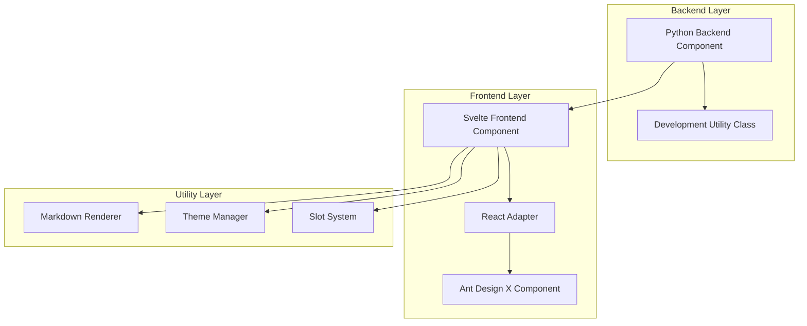
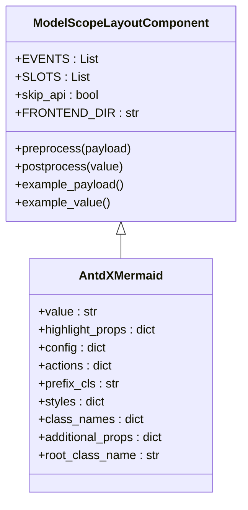
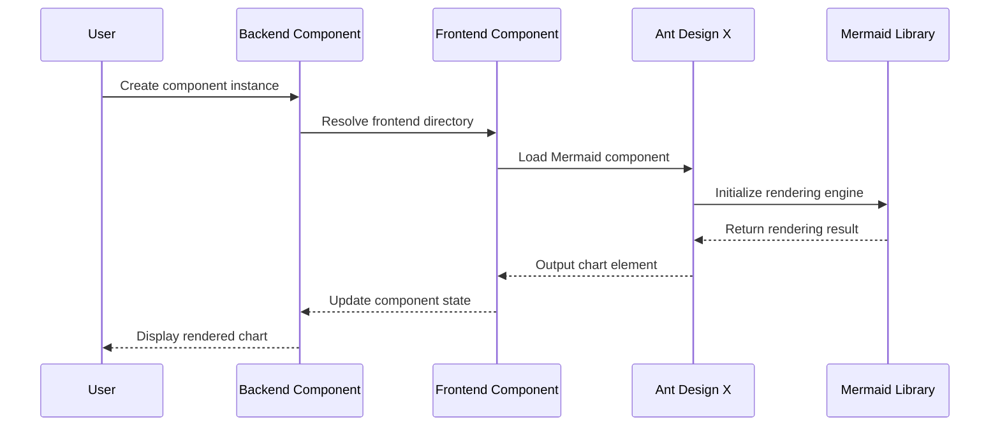
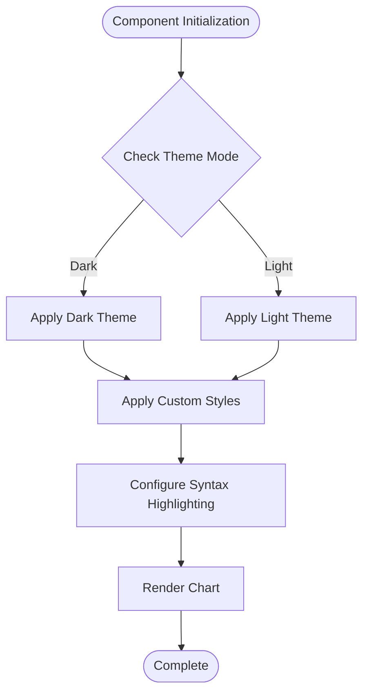
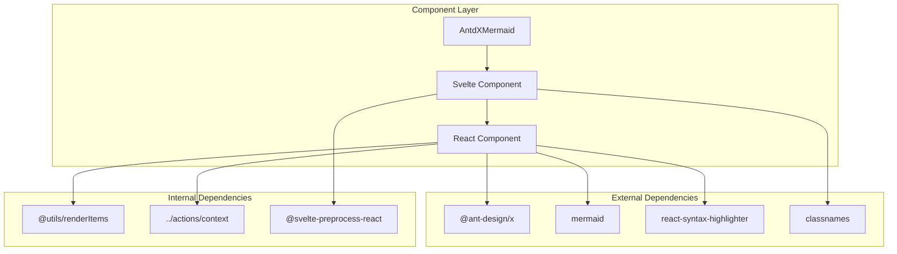
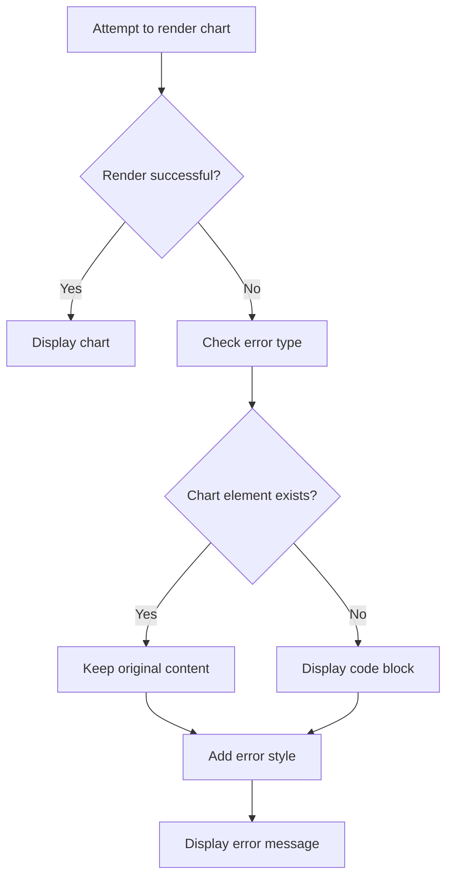

# Mermaid Component

<cite>
**Files referenced in this document**
- [backend/modelscope_studio/components/antdx/mermaid/__init__.py](file://backend/modelscope_studio/components/antdx/mermaid/__init__.py)
- [frontend/antdx/mermaid/Index.svelte](file://frontend/antdx/mermaid/Index.svelte)
- [frontend/antdx/mermaid/mermaid.tsx](file://frontend/antdx/mermaid/mermaid.tsx)
- [frontend/antdx/mermaid/gradio.config.js](file://frontend/antdx/mermaid/gradio.config.js)
- [frontend/antdx/mermaid/package.json](file://frontend/antdx/mermaid/package.json)
- [frontend/globals/components/markdown/utils.ts](file://frontend/globals/components/markdown/utils.ts)
- [backend/modelscope_studio/utils/dev/component.py](file://backend/modelscope_studio/utils/dev/component.py)
</cite>

## Table of Contents

1. [Introduction](#introduction)
2. [Project Structure](#project-structure)
3. [Core Components](#core-components)
4. [Architecture Overview](#architecture-overview)
5. [Detailed Component Analysis](#detailed-component-analysis)
6. [Dependency Analysis](#dependency-analysis)
7. [Performance Considerations](#performance-considerations)
8. [Troubleshooting Guide](#troubleshooting-guide)
9. [Conclusion](#conclusion)

## Introduction

The Mermaid flowchart component in ModelScope Studio is a visualization chart rendering component based on Ant Design X, specifically designed to display flowcharts, sequence diagrams, Gantt charts, and other diagrams in Mermaid format within Gradio applications. This component provides complete frontend rendering capabilities, supporting theme switching, custom action buttons, and a slot system.

## Project Structure

The Mermaid component adopts a layered architecture design, primarily containing the following layers:

**Diagram Sources**

- [backend/modelscope_studio/components/antdx/mermaid/**init**.py:1-77](file://backend/modelscope_studio/components/antdx/mermaid/__init__.py#L1-L77)
- [frontend/antdx/mermaid/Index.svelte:1-69](file://frontend/antdx/mermaid/Index.svelte#L1-L69)
- [frontend/antdx/mermaid/mermaid.tsx:1-87](file://frontend/antdx/mermaid/mermaid.tsx#L1-L87)

**Section Sources**

- [backend/modelscope_studio/components/antdx/mermaid/**init**.py:1-77](file://backend/modelscope_studio/components/antdx/mermaid/__init__.py#L1-L77)
- [frontend/antdx/mermaid/Index.svelte:1-69](file://frontend/antdx/mermaid/Index.svelte#L1-L69)
- [frontend/antdx/mermaid/mermaid.tsx:1-87](file://frontend/antdx/mermaid/mermaid.tsx#L1-L87)

## Core Components

### AntdXMermaid Python Component

AntdXMermaid is the core backend component class, inheriting from `ModelScopeLayoutComponent`, providing complete Gradio integration capabilities.

**Diagram Sources**

- [backend/modelscope_studio/utils/dev/component.py:11-127](file://backend/modelscope_studio/utils/dev/component.py#L11-L127)
- [backend/modelscope_studio/components/antdx/mermaid/**init**.py:8-77](file://backend/modelscope_studio/components/antdx/mermaid/__init__.py#L8-L77)

### Frontend Rendering Component

The frontend layer adopts a mixed Svelte + React architecture, wrapping React components as Svelte components through the `sveltify` adapter.

**Section Sources**

- [backend/modelscope_studio/utils/dev/component.py:11-127](file://backend/modelscope_studio/utils/dev/component.py#L11-L127)
- [backend/modelscope_studio/components/antdx/mermaid/**init**.py:8-77](file://backend/modelscope_studio/components/antdx/mermaid/__init__.py#L8-L77)

## Architecture Overview

The overall architecture of the Mermaid component adopts a layered design, achieving frontend-backend separation and modular management:

**Diagram Sources**

- [frontend/antdx/mermaid/Index.svelte:10-68](file://frontend/antdx/mermaid/Index.svelte#L10-L68)
- [frontend/antdx/mermaid/mermaid.tsx:50-79](file://frontend/antdx/mermaid/mermaid.tsx#L50-L79)

## Detailed Component Analysis

### Backend Component Implementation

The backend component inherits from `ModelScopeLayoutComponent`, implementing the following key features:

#### Component Property Configuration

- `value`: Chart content string
- `highlight_props`: Syntax highlighting configuration
- `config`: Mermaid configuration options
- `actions`: Custom action buttons
- `styles/class_names`: Style configuration

#### Event Handling Mechanism

The component supports the `render_type_change` event, binding render type change events via callback functions.

**Section Sources**

- [backend/modelscope_studio/components/antdx/mermaid/**init**.py:12-16](file://backend/modelscope_studio/components/antdx/mermaid/__init__.py#L12-L16)
- [backend/modelscope_studio/components/antdx/mermaid/**init**.py:21-58](file://backend/modelscope_studio/components/antdx/mermaid/__init__.py#L21-L58)

### Frontend Component Architecture

The frontend adopts a three-layer architecture design:

#### Svelte Layer (Index.svelte)

Responsible for component lifecycle management and property forwarding, using `importComponent` to dynamically load React components.

#### React Adapter Layer (mermaid.tsx)

Wraps React components into Svelte-compatible components via `sveltify`, implementing property transformation and event handling.

#### Ant Design X Integration

Directly uses `@ant-design/x`'s `Mermaid` component, providing rich chart rendering capabilities.

**Section Sources**

- [frontend/antdx/mermaid/Index.svelte:1-69](file://frontend/antdx/mermaid/Index.svelte#L1-L69)
- [frontend/antdx/mermaid/mermaid.tsx:1-87](file://frontend/antdx/mermaid/mermaid.tsx#L1-L87)

### Theme and Style System

The component supports both dark and light theme modes, controlled by the `themeMode` property:

**Diagram Sources**

- [frontend/antdx/mermaid/mermaid.tsx:17-31](file://frontend/antdx/mermaid/mermaid.tsx#L17-L31)
- [frontend/antdx/mermaid/mermaid.tsx:56-61](file://frontend/antdx/mermaid/mermaid.tsx#L56-L61)

**Section Sources**

- [frontend/antdx/mermaid/mermaid.tsx:17-31](file://frontend/antdx/mermaid/mermaid.tsx#L17-L31)
- [frontend/antdx/mermaid/mermaid.tsx:56-61](file://frontend/antdx/mermaid/mermaid.tsx#L56-L61)

### Slot System

The component supports two main slots:

- `header`: Header content slot
- `actions.customActions`: Custom action button slot

The slot system is implemented via `getSlots()` and `ReactSlot`, supporting dynamic content rendering.

**Section Sources**

- [frontend/antdx/mermaid/Index.svelte:51-51](file://frontend/antdx/mermaid/Index.svelte#L51-L51)
- [frontend/antdx/mermaid/mermaid.tsx:38-38](file://frontend/antdx/mermaid/mermaid.tsx#L38-L38)

## Dependency Analysis

The component's dependency relationships exhibit a clear layered structure:

**Diagram Sources**

- [frontend/antdx/mermaid/mermaid.tsx:1-15](file://frontend/antdx/mermaid/mermaid.tsx#L1-L15)
- [frontend/antdx/mermaid/Index.svelte:2-8](file://frontend/antdx/mermaid/Index.svelte#L2-L8)

**Section Sources**

- [frontend/antdx/mermaid/mermaid.tsx:1-15](file://frontend/antdx/mermaid/mermaid.tsx#L1-L15)
- [frontend/antdx/mermaid/Index.svelte:2-8](file://frontend/antdx/mermaid/Index.svelte#L2-L8)

## Performance Considerations

### On-demand Loading Optimization

The component uses a dynamic import (`importComponent`) mechanism, loading React components only when needed to reduce the initial bundle size.

### Rendering Performance Optimization

- Uses `useMemo` to cache calculation results, avoiding unnecessary re-renders
- Uses `tick()` to ensure correct DOM update timing
- Supports asynchronous rendering for improved user experience

### Memory Management

- Automatically cleans up event listeners when components are destroyed
- Promptly releases no-longer-needed resources

## Troubleshooting Guide

### Common Issues and Solutions

#### Chart Rendering Failure

When Mermaid chart rendering fails, the system automatically degrades to code display mode:

**Diagram Sources**

- [frontend/globals/components/markdown/utils.ts:191-222](file://frontend/globals/components/markdown/utils.ts#L191-L222)

#### Theme Mismatch Issue

Ensure the `themeMode` property is correctly passed to the component; use `dark` in dark mode and `base` in light mode.

#### Slot Content Not Displaying

Check if slot names are correct (`header` or `actions.customActions`) and if slot content is correctly passed.

**Section Sources**

- [frontend/globals/components/markdown/utils.ts:191-222](file://frontend/globals/components/markdown/utils.ts#L191-L222)

## Conclusion

The Mermaid flowchart component in ModelScope Studio achieves a high-performance, extensible chart rendering solution through its carefully designed layered architecture. The component has the following advantages:

1. **Complete Gradio integration**: Provides native Gradio support through `ModelScopeLayoutComponent`
2. **Flexible theme system**: Supports automatic switching between dark and light themes
3. **Powerful slot system**: Provides flexible configuration of header content and custom action buttons
4. **Excellent error handling**: Intelligent degradation mechanism ensures user experience
5. **Efficient rendering performance**: On-demand loading and caching optimization improve performance

This component provides developers with a powerful and easy-to-use chart rendering tool, applicable to various data visualization scenarios.
