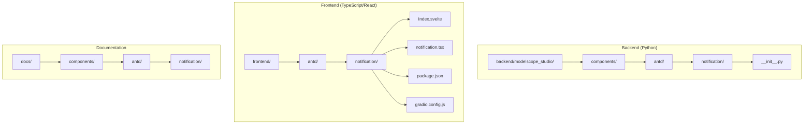
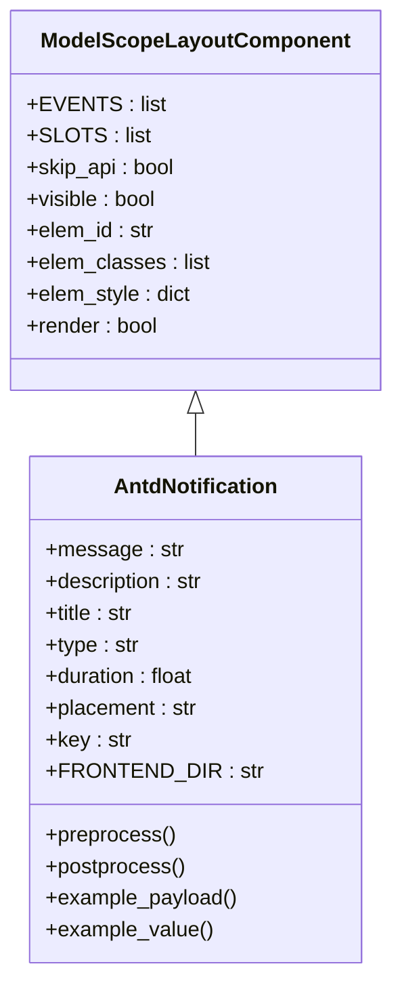
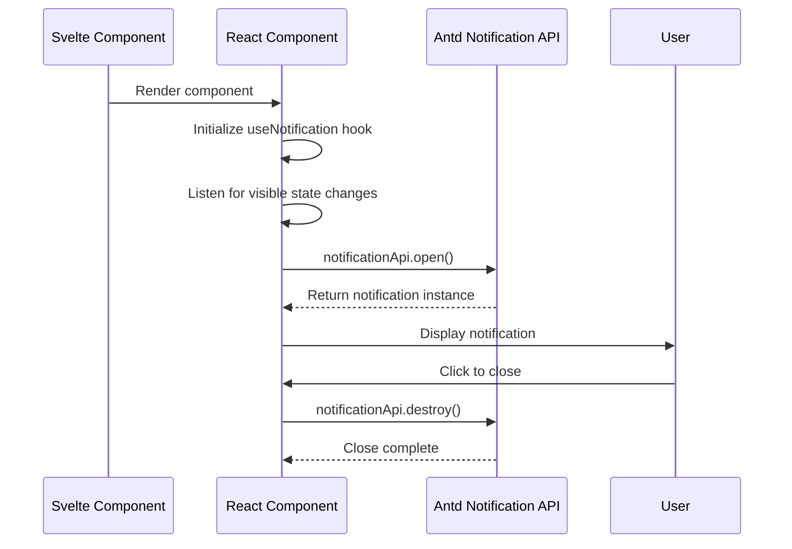
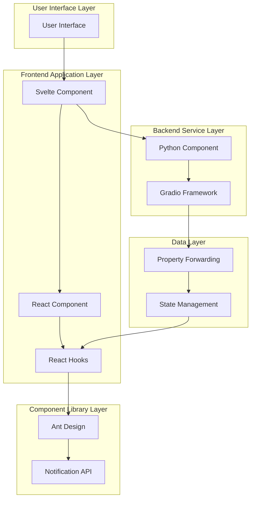
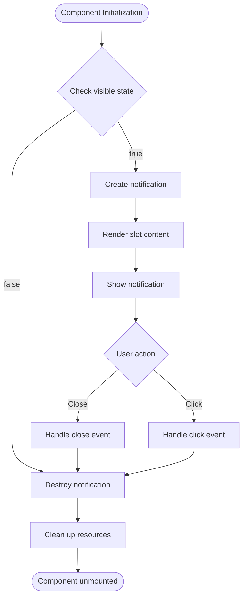
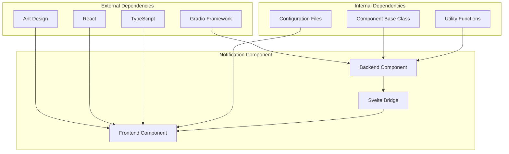

# Notification Component

<cite>
**Files referenced in this document**
- [backend/modelscope_studio/components/antd/notification/__init__.py](file://backend/modelscope_studio/components/antd/notification/__init__.py)
- [frontend/antd/notification/notification.tsx](file://frontend/antd/notification/notification.tsx)
- [frontend/antd/notification/Index.svelte](file://frontend/antd/notification/Index.svelte)
- [backend/modelscope_studio/utils/dev/component.py](file://backend/modelscope_studio/utils/dev/component.py)
- [backend/modelscope_studio/components/antd/__init__.py](file://backend/modelscope_studio/components/antd/__init__.py)
- [backend/modelscope_studio/components/antd/components.py](file://backend/modelscope_studio/components/antd/components.py)
- [frontend/antd/notification/package.json](file://frontend/antd/notification/package.json)
- [frontend/antd/notification/gradio.config.js](file://frontend/antd/notification/gradio.config.js)
- [docs/components/antd/notification/README.md](file://docs/components/antd/notification/README.md)
</cite>

## Table of Contents

1. [Introduction](#introduction)
2. [Project Structure](#project-structure)
3. [Core Components](#core-components)
4. [Architecture Overview](#architecture-overview)
5. [Detailed Component Analysis](#detailed-component-analysis)
6. [Dependency Analysis](#dependency-analysis)
7. [Performance Considerations](#performance-considerations)
8. [Troubleshooting Guide](#troubleshooting-guide)
9. [Conclusion](#conclusion)

## Introduction

The Notification component in ModelScope Studio is a global notification component based on Ant Design, used to display various types of notification messages in applications. This component supports multiple notification types (success, info, warning, error) and provides customizable notification position, duration, progress bar, and other features.

The component adopts a frontend-backend separated architecture design, with the backend implementing component definitions in Python and the frontend built with React and TypeScript, integrated through the Gradio framework.

## Project Structure

The ModelScope Studio project adopts modular organization, with the Notification component located in the following directory structure:

**Diagram Sources**

- [backend/modelscope_studio/components/antd/notification/**init**.py:1-109](file://backend/modelscope_studio/components/antd/notification/__init__.py#L1-L109)
- [frontend/antd/notification/Index.svelte:1-80](file://frontend/antd/notification/Index.svelte#L1-L80)

**Section Sources**

- [backend/modelscope_studio/components/antd/notification/**init**.py:1-109](file://backend/modelscope_studio/components/antd/notification/__init__.py#L1-L109)
- [frontend/antd/notification/notification.tsx:1-106](file://frontend/antd/notification/notification.tsx#L1-L106)

## Core Components

The core implementation of the Notification component includes three main parts:

### Backend Component Class

The backend uses the `AntdNotification` class inheriting from `ModelScopeLayoutComponent`, providing complete component functionality definitions:

**Diagram Sources**

- [backend/modelscope_studio/utils/dev/component.py:11-169](file://backend/modelscope_studio/utils/dev/component.py#L11-L169)
- [backend/modelscope_studio/components/antd/notification/**init**.py:10-109](file://backend/modelscope_studio/components/antd/notification/__init__.py#L10-L109)

### Frontend React Component

The frontend uses React Hooks and Ant Design's notification API to implement notification functionality:

**Diagram Sources**

- [frontend/antd/notification/notification.tsx:31-95](file://frontend/antd/notification/notification.tsx#L31-L95)
- [frontend/antd/notification/Index.svelte:59-79](file://frontend/antd/notification/Index.svelte#L59-L79)

**Section Sources**

- [backend/modelscope_studio/components/antd/notification/**init**.py:10-109](file://backend/modelscope_studio/components/antd/notification/__init__.py#L10-L109)
- [frontend/antd/notification/notification.tsx:8-106](file://frontend/antd/notification/notification.tsx#L8-L106)

## Architecture Overview

The Notification component adopts a layered architecture design, ensuring clear frontend-backend separation and good maintainability:

**Diagram Sources**

- [backend/modelscope_studio/utils/dev/component.py:11-169](file://backend/modelscope_studio/utils/dev/component.py#L11-L169)
- [frontend/antd/notification/notification.tsx:31-95](file://frontend/antd/notification/notification.tsx#L31-L95)

## Detailed Component Analysis

### Backend Component Implementation

The backend `AntdNotification` class provides complete component definitions, including event handling, slot support, and property configuration:

#### Main Features

1. **Event system**: Supports click and close event listeners
2. **Slot system**: Supports multiple slots (actions, closeIcon, description, icon, message, title)
3. **Property configuration**: Provides rich configuration options such as type, placement, duration, etc.

#### Key Method Descriptions

- `EVENTS`: Defines the list of supported events
- `SLOTS`: Defines supported slot names
- `preprocess()`: Preprocesses input data
- `postprocess()`: Processes output results
- `example_payload()`: Provides sample payload data

**Section Sources**

- [backend/modelscope_studio/components/antd/notification/**init**.py:14-21](file://backend/modelscope_studio/components/antd/notification/__init__.py#L14-L21)
- [backend/modelscope_studio/components/antd/notification/**init**.py:24](file://backend/modelscope_studio/components/antd/notification/__init__.py#L24)
- [backend/modelscope_studio/components/antd/notification/**init**.py:97-108](file://backend/modelscope_studio/components/antd/notification/__init__.py#L97-L108)

### Frontend React Component Implementation

The frontend component uses modern React development patterns, combined with Ant Design's notification functionality:

#### Core Functionality

1. **State management**: Uses React Hooks to manage notification state
2. **Lifecycle**: Automatically handles notification creation and destruction
3. **Slot rendering**: Supports dynamic slot content rendering
4. **Event handling**: Handles user interaction events

#### Component Flow

**Diagram Sources**

- [frontend/antd/notification/notification.tsx:38-95](file://frontend/antd/notification/notification.tsx#L38-L95)

**Section Sources**

- [frontend/antd/notification/notification.tsx:8-106](file://frontend/antd/notification/notification.tsx#L8-L106)

### Svelte Component Bridge

The Svelte component serves as the bridge between frontend and backend, responsible for property forwarding and event handling:

#### Main Responsibilities

1. **Property handling**: Converts Python properties to React-compatible format
2. **Event binding**: Handles user interaction events
3. **Slot management**: Manages component slot content
4. **State synchronization**: Synchronizes component state to the backend

**Section Sources**

- [frontend/antd/notification/Index.svelte:19-79](file://frontend/antd/notification/Index.svelte#L19-L79)

## Dependency Analysis

The dependency relationships of the Notification component are relatively simple, primarily depending on the Ant Design and Gradio frameworks:

**Diagram Sources**

- [frontend/antd/notification/package.json:1-15](file://frontend/antd/notification/package.json#L1-L15)
- [backend/modelscope_studio/utils/dev/component.py:11-169](file://backend/modelscope_studio/utils/dev/component.py#L11-L169)

**Section Sources**

- [backend/modelscope_studio/components/antd/**init**.py:82](file://backend/modelscope_studio/components/antd/__init__.py#L82)
- [backend/modelscope_studio/components/antd/components.py:79](file://backend/modelscope_studio/components/antd/components.py#L79)

## Performance Considerations

The Notification component incorporates the following performance optimizations in its design:

### Memory Management

- Automatically destroys notification instances that are no longer in use
- Reasonable component unmounting handling
- Avoids memory leaks

### Render Optimization

- Conditional rendering avoids unnecessary updates
- Effective state management
- Lazy loading of slot content

### User Experience

- Appropriate notification duration
- Smooth animation effects
- Responsive layout

## Troubleshooting Guide

### Common Issues and Solutions

#### Notification Not Displaying

1. Check if the `visible` property is set to `True`
2. Confirm that `message` or `description` is correctly set
3. Verify that the component is rendering correctly

#### Events Not Responding

1. Check if event listeners are correctly bound
2. Confirm callback functions are correctly implemented
3. Verify event parameter passing

#### Style Issues

1. Check if CSS class names are correct
2. Verify style override rules
3. Confirm theme configuration

**Section Sources**

- [frontend/antd/notification/notification.tsx:65-68](file://frontend/antd/notification/notification.tsx#L65-L68)
- [backend/modelscope_studio/components/antd/notification/**init**.py:14-21](file://backend/modelscope_studio/components/antd/notification/__init__.py#L14-L21)

## Conclusion

The Notification component in ModelScope Studio is a well-designed component with the following characteristics:

1. **Complete feature support**: Supports multiple notification types and rich configuration options
2. **Good architecture design**: Frontend-backend separation, easy to maintain and extend
3. **Excellent user experience**: Provides smooth interactions and visual effects
4. **Performance optimization**: Considers memory management and rendering optimization
5. **Comprehensive documentation**: Provides clear usage instructions and examples

This component provides developers with a powerful and flexible notification solution that can meet the needs of various application scenarios.
