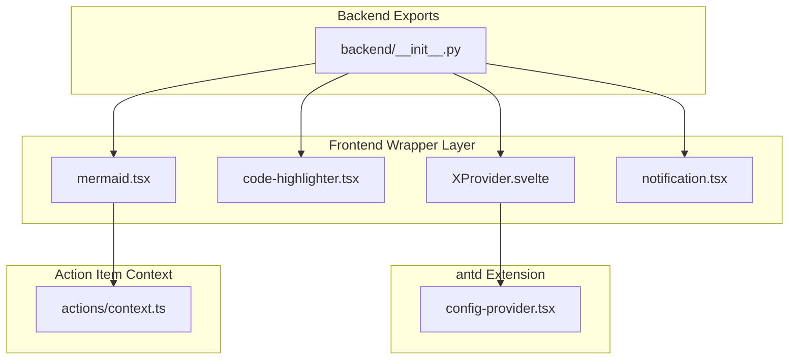
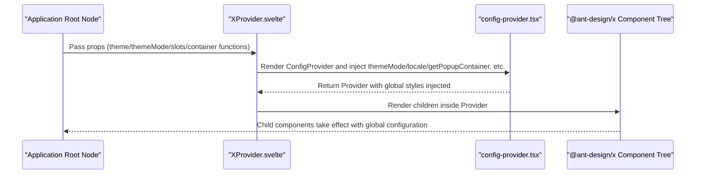
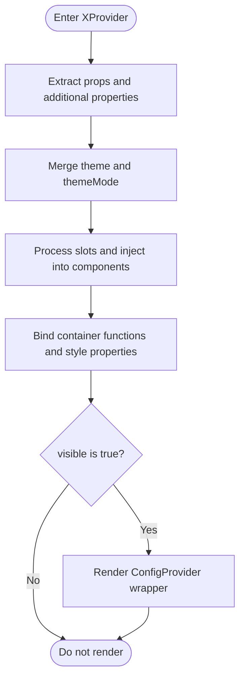
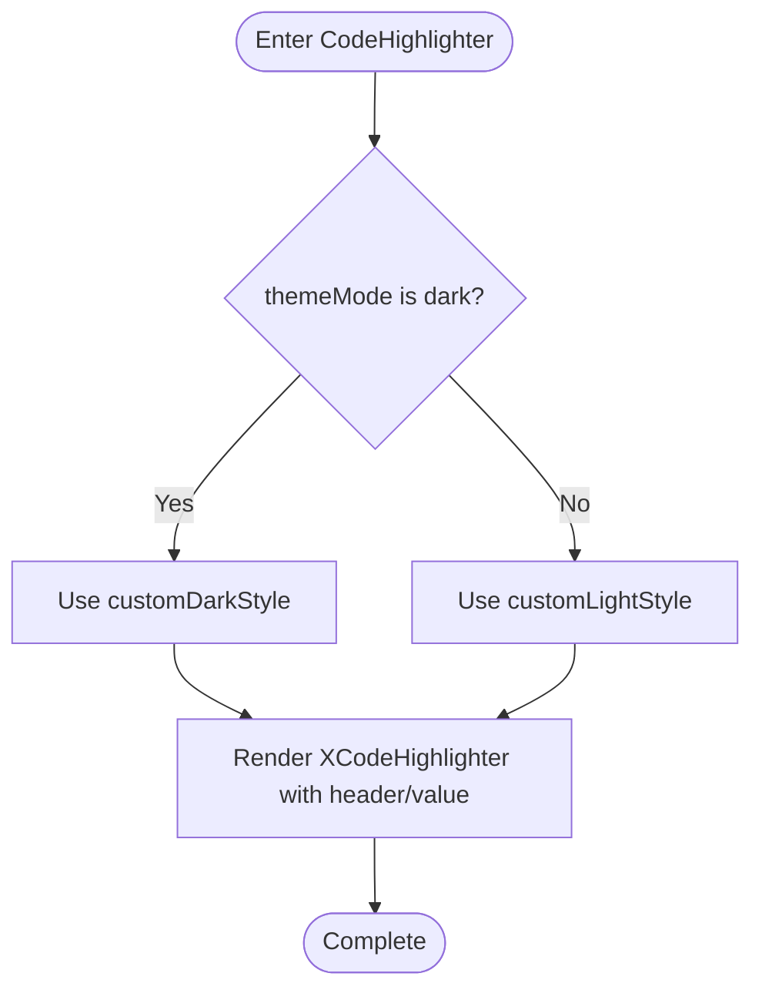
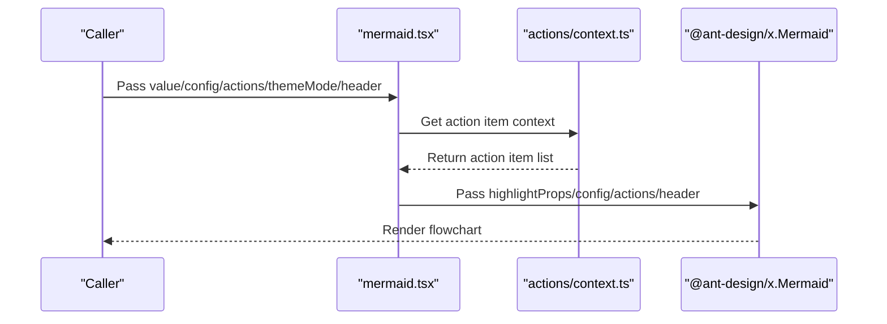
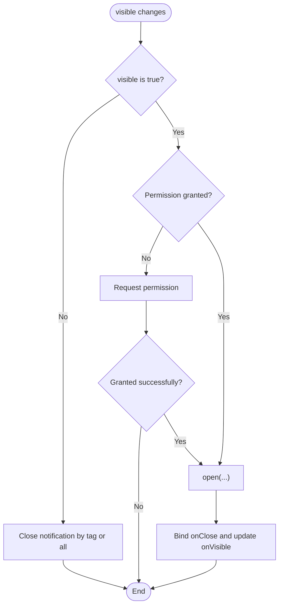
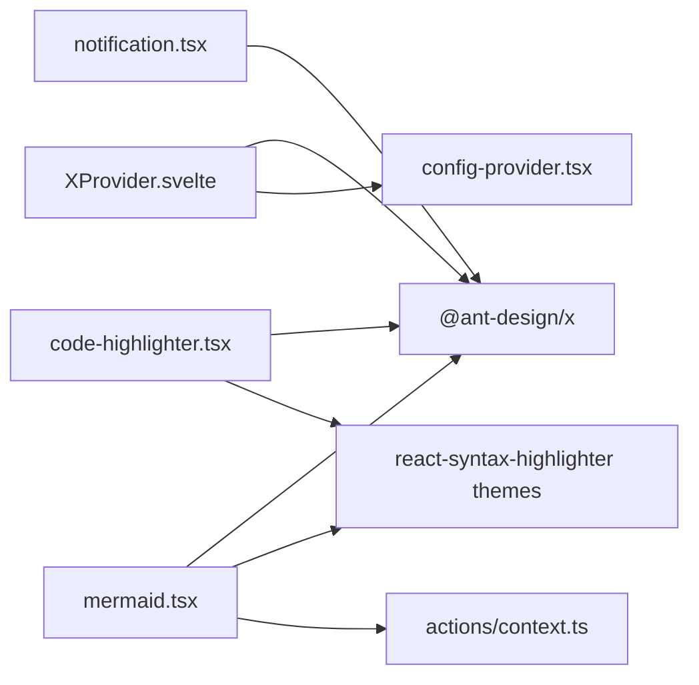

# Tool Components

<cite>
**Files referenced in this document**
- [XProvider.svelte](file://frontend/antdx/x-provider/XProvider.svelte)
- [Index.svelte (XProvider export wrapper)](file://frontend/antdx/x-provider/Index.svelte)
- [config-provider.tsx](file://frontend/antd/config-provider/config-provider.tsx)
- [code-highlighter.tsx](file://frontend/antdx/code-highlighter/code-highlighter.tsx)
- [mermaid.tsx](file://frontend/antdx/mermaid/mermaid.tsx)
- [notification.tsx](file://frontend/antdx/notification/notification.tsx)
- [actions/context.ts](file://frontend/antdx/actions/context.ts)
- [backend/__init__.py (antdx aggregated exports)](file://backend/modelscope_studio/components/antdx/__init__.py)
- [x_provider documentation](file://docs/components/antdx/x_provider/README.md)
</cite>

## Table of Contents

1. [Introduction](#introduction)
2. [Project Structure](#project-structure)
3. [Core Components](#core-components)
4. [Architecture Overview](#architecture-overview)
5. [Component Details](#component-details)
6. [Dependency Analysis](#dependency-analysis)
7. [Performance Considerations](#performance-considerations)
8. [Troubleshooting Guide](#troubleshooting-guide)
9. [Conclusion](#conclusion)
10. [Appendix: Usage Examples and Best Practices](#appendix-usage-examples-and-best-practices)

## Introduction

This document is oriented toward Ant Design X tool components, systematically organizing the design and usage of the following components:

- XProvider: Global configuration and context provider, extending antd's ConfigProvider to uniformly provide global capabilities such as theme, language, and popup container for @ant-design/x components.
- CodeHighlighter: Code highlighting display component, supporting theme customization, header slots, and syntax highlighting style overrides.
- Mermaid: Flowchart/mind map component, integrating highlighting and action item rendering, supporting light/dark theme switching and custom actions.
- Notification: Browser notification encapsulation, providing permission requests, open/close, visibility control, and callbacks.

## Project Structure

Key directories and files around the tool components are as follows:

- Frontend Svelte wrapper layer: Component wrapper files under frontend/antdx, responsible for integrating @ant-design/x components into the Gradio ecosystem in a Svelte manner.
- antd ConfigProvider extension: frontend/antd/config-provider provides global capabilities such as theme, language, and popup containers.
- Action item context: frontend/antdx/actions/context provides action item context injection and rendering utilities.
- Backend aggregated exports: backend/modelscope_studio/components/antdx/**init**.py uniformly exports antdx components for use in the Python layer.

**Diagram Sources**

- [XProvider.svelte:1-75](file://frontend/antdx/x-provider/XProvider.svelte#L1-L75)
- [config-provider.tsx:1-154](file://frontend/antd/config-provider/config-provider.tsx#L1-L154)
- [code-highlighter.tsx:1-54](file://frontend/antdx/code-highlighter/code-highlighter.tsx#L1-L54)
- [mermaid.tsx:1-87](file://frontend/antdx/mermaid/mermaid.tsx#L1-L87)
- [actions/context.ts:1-7](file://frontend/antdx/actions/context.ts#L1-L7)
- [backend/**init**.py (antdx aggregated exports):1-42](file://backend/modelscope_studio/components/antdx/__init__.py#L1-L42)

**Section Sources**

- [XProvider.svelte:1-75](file://frontend/antdx/x-provider/XProvider.svelte#L1-L75)
- [config-provider.tsx:1-154](file://frontend/antd/config-provider/config-provider.tsx#L1-L154)
- [code-highlighter.tsx:1-54](file://frontend/antdx/code-highlighter/code-highlighter.tsx#L1-L54)
- [mermaid.tsx:1-87](file://frontend/antdx/mermaid/mermaid.tsx#L1-L87)
- [actions/context.ts:1-7](file://frontend/antdx/actions/context.ts#L1-L7)
- [backend/**init**.py (antdx aggregated exports):1-42](file://backend/modelscope_studio/components/antdx/__init__.py#L1-L42)

## Core Components

- XProvider: In Svelte, asynchronously loads and injects ConfigProvider via importComponent, uniformly forwarding properties such as theme, themeMode, slots, and container functions, serving as the global context root node for @ant-design/x components.
- CodeHighlighter: A secondary encapsulation of @ant-design/x's CodeHighlighter, supporting header slots, theme mode switching, and highlightProps overrides.
- Mermaid: A secondary encapsulation of @ant-design/x's Mermaid, supporting header, actions.customActions slots and context injection, and automatically switching mermaid themes and highlighting styles based on themeMode.
- Notification: A secondary encapsulation of @ant-design/x's notification, exposing visible control, permission callbacks, tag-based closing, and other capabilities.

**Backend Export Entry Description**
All of the above tool components are uniformly exported through [backend/modelscope_studio/components/antdx/**init**.py](file://backend/modelscope_studio/components/antdx/__init__.py), with the following export names:

- `XProvider`: `from modelscope_studio.components.antdx import XProvider`
- `CodeHighlighter`: `from modelscope_studio.components.antdx import CodeHighlighter`
- `Mermaid`: `from modelscope_studio.components.antdx import Mermaid`
- `Notification`: `from modelscope_studio.components.antdx import Notification`

**Section Sources**

- [XProvider.svelte:12-74](file://frontend/antdx/x-provider/XProvider.svelte#L12-L74)
- [config-provider.tsx:53-151](file://frontend/antd/config-provider/config-provider.tsx#L53-L151)
- [code-highlighter.tsx:29-51](file://frontend/antdx/code-highlighter/code-highlighter.tsx#L29-L51)
- [mermaid.tsx:33-84](file://frontend/antdx/mermaid/mermaid.tsx#L33-L84)
- [notification.tsx:6-50](file://frontend/antdx/notification/notification.tsx#L6-L50)

## Architecture Overview

The following diagram shows how XProvider connects antd's ConfigProvider with @ant-design/x components, completing the forwarding of properties and content through the Svelte context and slots mechanism.

**Diagram Sources**

- [XProvider.svelte:56-74](file://frontend/antdx/x-provider/XProvider.svelte#L56-L74)
- [config-provider.tsx:108-149](file://frontend/antd/config-provider/config-provider.tsx#L108-L149)

**Section Sources**

- [XProvider.svelte:1-75](file://frontend/antdx/x-provider/XProvider.svelte#L1-L75)
- [config-provider.tsx:1-154](file://frontend/antd/config-provider/config-provider.tsx#L1-L154)

## Component Details

### XProvider Global Configuration and Context Providing Mechanism

- Design points
  - Uses importComponent to asynchronously load the antd ConfigProvider wrapper component, avoiding first-screen blocking.
  - Extracts and merges Gradio extra properties, theme configuration, and common layout properties through getProps/processProps to form the final forwarded props.
  - setConfigType('antd') specifies the configuration type, ensuring subsequent components consume a consistent context.
  - Supports slot injection, converting Svelte slots into React-recognizable structures.
- Key behavior
  - theme and themeMode: theme is preferentially obtained from additionalProps or restProps; themeMode comes from the shared theme state.
  - Container functions: getPopupContainer and getTargetContainer are wrapped via useFunction, ensuring stable availability within the component lifecycle.
  - Visibility control: Only renders the Provider when visible is true, enabling on-demand mounting.
- Best practices
  - Place XProvider at the application root to ensure child components inherit global theme and language settings.
  - If antd.ConfigProvider is already in use, replace it with antdx.XProvider to maintain configuration consistency.

**Diagram Sources**

- [XProvider.svelte:25-74](file://frontend/antdx/x-provider/XProvider.svelte#L25-L74)
- [config-provider.tsx:93-149](file://frontend/antd/config-provider/config-provider.tsx#L93-L149)

**Section Sources**

- [XProvider.svelte:1-75](file://frontend/antdx/x-provider/XProvider.svelte#L1-L75)
- [Index.svelte (XProvider export wrapper):1-20](file://frontend/antdx/x-provider/Index.svelte#L1-L20)
- [config-provider.tsx:1-154](file://frontend/antd/config-provider/config-provider.tsx#L1-L154)
- [x_provider documentation:1-19](file://docs/components/antdx/x_provider/README.md#L1-L19)

### CodeHighlighter Code Highlighting Component

- Design points
  - Interfaces with @ant-design/x's CodeHighlighter, supporting header slots and highlightProps customization.
  - Theme customization: Based on materialDark/materialLight, uniformly removes code block outer margins to adapt to card/conversation scenarios.
  - Value source: Supports passing code strings directly via the value property, or through children.
- Usage recommendations
  - Use customDarkStyle in dark themes and customLightStyle in light themes.
  - Override default styles via highlightProps.style, or append other react-syntax-highlighter supported properties.
  - Use the header slot to add title/action areas.

**Diagram Sources**

- [code-highlighter.tsx:29-51](file://frontend/antdx/code-highlighter/code-highlighter.tsx#L29-L51)

**Section Sources**

- [code-highlighter.tsx:1-54](file://frontend/antdx/code-highlighter/code-highlighter.tsx#L1-L54)

### Mermaid Flowchart Component

- Design points
  - Interfaces with @ant-design/x's Mermaid, supporting header, actions.customActions slots and context injection.
  - Theme and highlighting: Switches mermaid theme (dark/base) based on themeMode, while synchronizing highlighting styles.
  - Action items: Injects action item context via withItemsContextProvider, supporting dynamic rendering of custom actions.
- Usage recommendations
  - Enable mermaid dark theme in dark mode, use base theme in light mode.
  - Pass custom action items via actions.customActions or use slot injection.
  - Forward mermaid rendering configuration (such as direction, theme colors, etc.) through config.

**Diagram Sources**

- [mermaid.tsx:40-84](file://frontend/antdx/mermaid/mermaid.tsx#L40-L84)
- [actions/context.ts:1-7](file://frontend/antdx/actions/context.ts#L1-L7)

**Section Sources**

- [mermaid.tsx:1-87](file://frontend/antdx/mermaid/mermaid.tsx#L1-L87)
- [actions/context.ts:1-7](file://frontend/antdx/actions/context.ts#L1-L7)

### Notification Component

- Design points
  - Interfaces with @ant-design/x's notification.useNotification, exposing visible control and permission callbacks.
  - Automatic permission request: When visible is true and permission is not granted, triggers a permission request; if granted, opens the notification.
  - Tag-based management: Supports closing specific notifications by tag for multi-instance management.
  - Lifecycle: Automatically cleans up notifications on visible changes and component unmounting.
- Usage recommendations
  - Link visible and onVisible with the parent state to achieve controlled show/hide.
  - Monitor permission changes via onPermission to guide users to grant permissions.
  - Use tag to distinguish different notification instances to avoid mutual interference.

**Diagram Sources**

- [notification.tsx:17-46](file://frontend/antdx/notification/notification.tsx#L17-L46)

**Section Sources**

- [notification.tsx:1-51](file://frontend/antdx/notification/notification.tsx#L1-L51)

## Dependency Analysis

- Component coupling
  - XProvider depends on antd's ConfigProvider wrapper to form the global context root node.
  - Mermaid depends on the action item context provided by actions/context to implement dynamic action rendering.
  - CodeHighlighter/Mermaid both depend on react-syntax-highlighter's theme styles for unified highlighting style.
- External dependencies
  - @ant-design/x: Core component library, providing CodeHighlighter, Mermaid, Notification, and other capabilities.
  - antd: Provides ConfigProvider, theme algorithms, language packs, and dayjs internationalization support.
  - svelte-preprocess-react: Bridges Svelte and React, supporting slots and function wrapping.

**Diagram Sources**

- [XProvider.svelte:12-14](file://frontend/antdx/x-provider/XProvider.svelte#L12-L14)
- [config-provider.tsx:1-11](file://frontend/antd/config-provider/config-provider.tsx#L1-L11)
- [code-highlighter.tsx:4-11](file://frontend/antdx/code-highlighter/code-highlighter.tsx#L4-L11)
- [mermaid.tsx:4-15](file://frontend/antdx/mermaid/mermaid.tsx#L4-L15)
- [actions/context.ts:1-4](file://frontend/antdx/actions/context.ts#L1-L4)
- [notification.tsx:3-4](file://frontend/antdx/notification/notification.tsx#L3-L4)

**Section Sources**

- [XProvider.svelte:1-75](file://frontend/antdx/x-provider/XProvider.svelte#L1-L75)
- [config-provider.tsx:1-154](file://frontend/antd/config-provider/config-provider.tsx#L1-L154)
- [code-highlighter.tsx:1-54](file://frontend/antdx/code-highlighter/code-highlighter.tsx#L1-L54)
- [mermaid.tsx:1-87](file://frontend/antdx/mermaid/mermaid.tsx#L1-L87)
- [actions/context.ts:1-7](file://frontend/antdx/actions/context.ts#L1-L7)
- [notification.tsx:1-51](file://frontend/antdx/notification/notification.tsx#L1-L51)

## Performance Considerations

- Asynchronous loading: XProvider uses importComponent to asynchronously load the ConfigProvider wrapper component, reducing the first-screen load burden.
- Function stabilization: Container functions are wrapped via useFunction, avoiding re-renders caused by function reference changes on each render.
- Memoization: Mermaid uses useMemo for actions.customActions and config, reducing unnecessary recalculations and renders.
- Theme styles: Unified highlighting style objects avoid the overhead of repeatedly constructing style objects.

[This section contains general guidance; no specific file sources need to be listed]

## Troubleshooting Guide

- XProvider not taking effect
  - Confirm XProvider is placed at the application root and that visible is true.
  - Check if theme and themeMode are correctly passed; use theme_config when theme conflicts with Gradio presets.
- Mermaid chart not displaying
  - Confirm value is valid and themeMode and config are correct.
  - Check if actions.customActions is correctly injected via context or passed through slots.
- CodeHighlighter style anomalies
  - Confirm the combination of themeMode and highlightProps.style is correct.
  - Check if the header slot is being accidentally overridden.
- Notification cannot pop up
  - Check browser permission status and confirm whether the onPermission callback is triggered.
  - Confirm that the usage of visible and tag is as expected.

**Section Sources**

- [XProvider.svelte:56-74](file://frontend/antdx/x-provider/XProvider.svelte#L56-L74)
- [mermaid.tsx:40-84](file://frontend/antdx/mermaid/mermaid.tsx#L40-L84)
- [code-highlighter.tsx:29-51](file://frontend/antdx/code-highlighter/code-highlighter.tsx#L29-L51)
- [notification.tsx:17-46](file://frontend/antdx/notification/notification.tsx#L17-L46)

## Conclusion

This document systematically organizes the implementation and usage of four tool components: XProvider, CodeHighlighter, Mermaid, and Notification. Through unified global configuration (XProvider), theme and highlighting strategies (CodeHighlighter/Mermaid), and browser notification capabilities (Notification), they provide a stable, extensible foundation for Ant Design X's deployment in the frontend ecosystem. It is recommended to introduce XProvider uniformly at the application root, combined with theme and language configuration, to ensure child components receive a consistent global experience.

[This section contains summary content; no specific file sources need to be listed]

## Appendix: Usage Examples and Best Practices

- XProvider
  - Place XProvider at the application root, passing theme_config or theme and themeMode to ensure child components inherit global configuration.
  - If antd.ConfigProvider is already in use, replace it with antdx.XProvider to maintain configuration consistency.
- CodeHighlighter
  - Pass code content via value or children; use the header slot to add title/action areas.
  - Select the corresponding highlighting style based on themeMode, and override details via highlightProps.style when necessary.
- Mermaid
  - Pass value as mermaid syntax text; adjust rendering parameters via config; inject custom actions via actions.customActions.
  - Switch mermaid theme (dark/base) based on themeMode to maintain consistency with the page theme.
- Notification
  - Use visible and onVisible to achieve controlled display; monitor onPermission to get permission status; manage multiple instances via tag.

**Section Sources**

- [x_provider documentation:1-19](file://docs/components/antdx/x_provider/README.md#L1-L19)
- [backend/**init**.py (antdx aggregated exports):1-42](file://backend/modelscope_studio/components/antdx/__init__.py#L1-L42)
