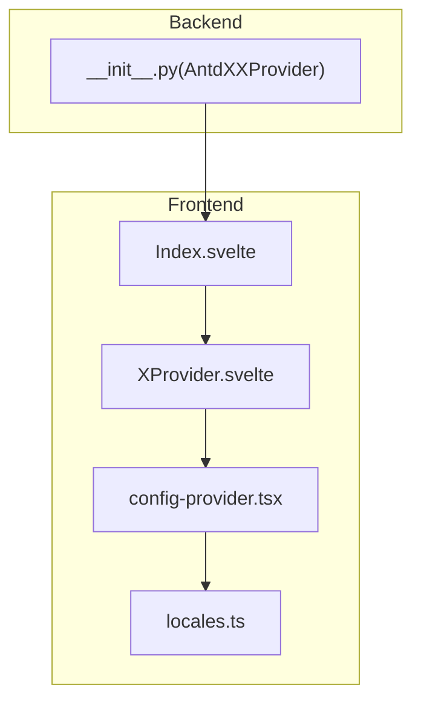
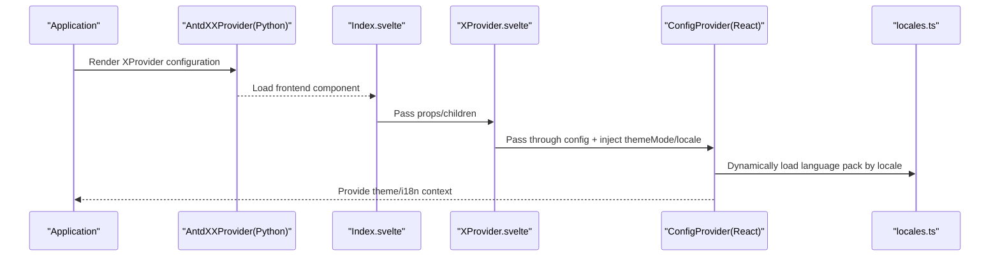
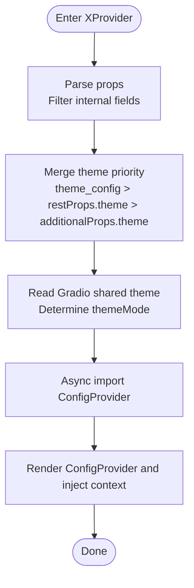
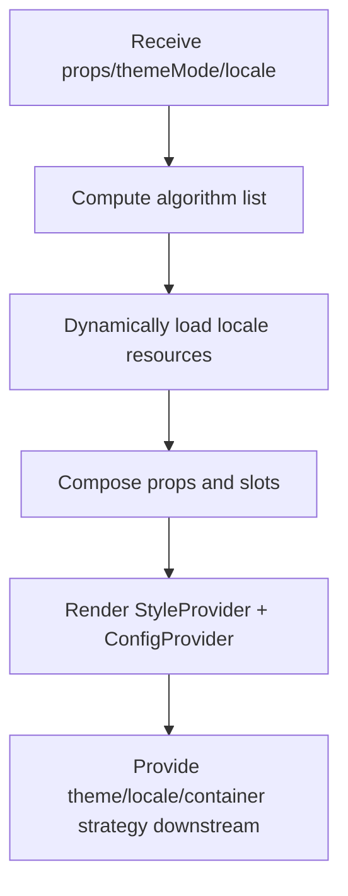
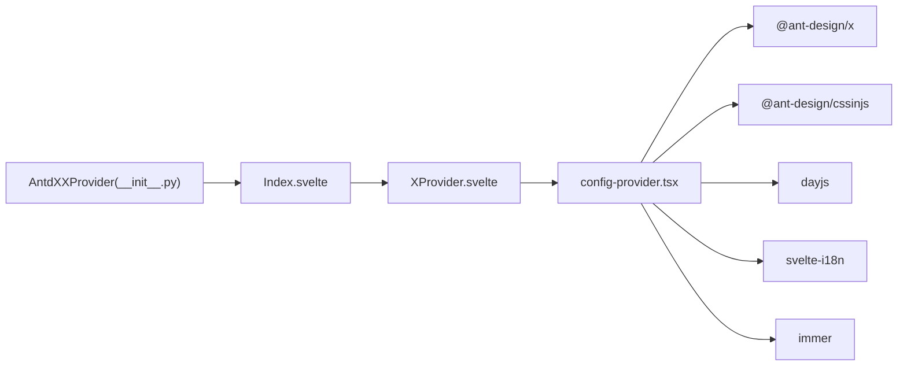

# XProvider Global Configuration

<cite>
**Files Referenced in This Document**
- [XProvider.svelte](file://frontend/antdx/x-provider/XProvider.svelte)
- [Index.svelte](file://frontend/antdx/x-provider/Index.svelte)
- [config-provider.tsx](file://frontend/antd/config-provider/config-provider.tsx)
- [locales.ts](file://frontend/antd/config-provider/locales.ts)
- [__init__.py](file://backend/modelscope_studio/components/antdx/x_provider/__init__.py)
- [README.md](file://README.md)
</cite>

## Table of Contents

1. [Introduction](#introduction)
2. [Project Structure](#project-structure)
3. [Core Components](#core-components)
4. [Architecture Overview](#architecture-overview)
5. [Detailed Component Analysis](#detailed-component-analysis)
6. [Dependency Analysis](#dependency-analysis)
7. [Performance Considerations](#performance-considerations)
8. [Troubleshooting Guide](#troubleshooting-guide)
9. [Conclusion](#conclusion)
10. [Appendix](#appendix)

## Introduction

This document systematically describes the design and usage of the XProvider global configuration component, focusing on the following aspects:

- Context provision mechanism: How XProvider injects a unified configuration context (theme, internationalization, component default behavior, etc.) into the entire application.
- Theme configuration: Supports light/dark mode with compact algorithm synchronization, and integration with Gradio's shared theme state.
- Internationalization settings: Automatically detects browser language and dynamically loads the corresponding language pack as needed.
- Best practices for collaboration with ANTDX components: How to configure uniformly at the application level to avoid repetitive settings.

## Project Structure

XProvider adopts a "wrapper + synchronous rendering" pattern on the frontend, while the backend uses a Python component to bridge the frontend, forming a complete configuration provision chain.

Diagram sources

- [XProvider.svelte:1-75](file://frontend/antdx/x-provider/XProvider.svelte#L1-L75)
- [Index.svelte:1-20](file://frontend/antdx/x-provider/Index.svelte#L1-L20)
- [config-provider.tsx:1-154](file://frontend/antd/config-provider/config-provider.tsx#L1-L154)
- [locales.ts:1-863](file://frontend/antd/config-provider/locales.ts#L1-L863)
- [**init**.py:1-101](file://backend/modelscope_studio/components/antdx/x_provider/__init__.py#L1-L101)

Section sources

- [XProvider.svelte:1-75](file://frontend/antdx/x-provider/XProvider.svelte#L1-L75)
- [Index.svelte:1-20](file://frontend/antdx/x-provider/Index.svelte#L1-L20)
- [config-provider.tsx:1-154](file://frontend/antd/config-provider/config-provider.tsx#L1-L154)
- [locales.ts:1-863](file://frontend/antd/config-provider/locales.ts#L1-L863)
- [**init**.py:1-101](file://backend/modelscope_studio/components/antdx/x_provider/__init__.py#L1-L101)

## Core Components

- Frontend Components
  - XProvider Wrapper: Responsible for receiving props, handling additional attributes, passing through to ConfigProvider, and injecting theme and internationalization capabilities.
  - ConfigProvider Implementation: Based on Ant Design's ConfigProvider, extended with theme mode and internationalization loading logic.
  - locales Language Mapping: Provides on-demand loading of multi-language resources and dayjs locale synchronization.
- Backend Components
  - AntdXXProvider: A Python-level layout component that declares optional slots and configuration items, bridges the frontend component, and bypasses API calls.

Section sources

- [XProvider.svelte:1-75](file://frontend/antdx/x-provider/XProvider.svelte#L1-L75)
- [config-provider.tsx:51-151](file://frontend/antd/config-provider/config-provider.tsx#L51-L151)
- [locales.ts:12-87](file://frontend/antd/config-provider/locales.ts#L12-L87)
- [**init**.py:10-101](file://backend/modelscope_studio/components/antdx/x_provider/__init__.py#L10-L101)

## Architecture Overview

The XProvider runtime flow is as follows:

Diagram sources

- [XProvider.svelte:12-74](file://frontend/antdx/x-provider/XProvider.svelte#L12-L74)
- [config-provider.tsx:71-149](file://frontend/antd/config-provider/config-provider.tsx#L71-L149)
- [locales.ts:89-105](file://frontend/antd/config-provider/locales.ts#L89-L105)
- [**init**.py:83-101](file://backend/modelscope_studio/components/antdx/x_provider/__init__.py#L83-L101)

## Detailed Component Analysis

### XProvider Wrapper (Frontend)

Responsibilities and Key Points

- Receive and process props: Filter internal fields, retain restProps and additionalProps, and support priority merging of theme_config and theme.
- Dynamic import of ConfigProvider: Ensures on-demand loading via async components, reducing initial load overhead.
- Theme and i18n injection: Obtains light/dark mode from Gradio's shared theme, injects theme configuration from props or theme_config; internationalization is handled by the underlying ConfigProvider.
- Slots and styles: Pass through slots, elem_id, elem_classes, elem_style, and other common attributes.

Diagram sources

- [XProvider.svelte:17-74](file://frontend/antdx/x-provider/XProvider.svelte#L17-L74)

Section sources

- [XProvider.svelte:1-75](file://frontend/antdx/x-provider/XProvider.svelte#L1-L75)

### ConfigProvider Implementation (Frontend)

Responsibilities and Key Points

- Theme algorithm: Automatically combines dark and compact algorithms based on themeMode and props.theme.algorithm.
- Internationalization: Supports locale string or automatic browser language detection, dynamically loads the corresponding language pack and dayjs locale on demand.
- Container mounting: Provides function wrappers for getPopupContainer and getTargetContainer, enabling custom popup container configuration.
- Slot integration: Converts nested key paths in slots into corresponding React component trees, supporting slots like renderEmpty.

Diagram sources

- [config-provider.tsx:71-149](file://frontend/antd/config-provider/config-provider.tsx#L71-L149)
- [locales.ts:89-105](file://frontend/antd/config-provider/locales.ts#L89-L105)

Section sources

- [config-provider.tsx:51-151](file://frontend/antd/config-provider/config-provider.tsx#L51-L151)
- [locales.ts:12-87](file://frontend/antd/config-provider/locales.ts#L12-L87)

### Backend Component (AntdXXProvider)

Responsibilities and Key Points

- Parameter declaration: Includes configuration items such as component disable, size, direction, prefix class, locale, theme, variant, virtualization, and warnings.
- Slot declaration: Declares injectable slots such as renderEmpty.
- Frontend directory: Points to the frontend x-provider component directory.
- API skip: skip_api=True to avoid generating redundant APIs.

Section sources

- [**init**.py:10-101](file://backend/modelscope_studio/components/antdx/x_provider/__init__.py#L10-L101)

## Dependency Analysis

- Frontend Dependencies
  - @ant-design/x: XProvider React component source.
  - @ant-design/cssinjs: Style injection and hash control.
  - dayjs: Date localization.
  - svelte-i18n: Browser language detection.
  - immer: Immutable update utility.
- Backend Dependencies
  - ModelScopeLayoutComponent: Layout component base class.
  - resolve_frontend_dir: Locates the frontend component directory.

Diagram sources

- [XProvider.svelte:1-14](file://frontend/antdx/x-provider/XProvider.svelte#L1-L14)
- [config-provider.tsx:1-11](file://frontend/antd/config-provider/config-provider.tsx#L1-L11)
- [**init**.py:6-8](file://backend/modelscope_studio/components/antdx/x_provider/__init__.py#L6-L8)

Section sources

- [XProvider.svelte:1-14](file://frontend/antdx/x-provider/XProvider.svelte#L1-L14)
- [config-provider.tsx:1-11](file://frontend/antd/config-provider/config-provider.tsx#L1-L11)
- [**init**.py:6-8](file://backend/modelscope_studio/components/antdx/x_provider/__init__.py#L6-L8)

## Performance Considerations

- Async loading: XProvider uses dynamic imports for ConfigProvider to avoid blocking the initial render and improve startup speed.
- Theme algorithm: Recomputes the algorithm array only when themeMode or props.theme.algorithm changes, reducing re-render cost.
- Language packs: Loads language packs and dayjs locale on demand, avoiding loading all language resources at once.
- Style injection: Uses a high-priority hash strategy to minimize style conflicts and reflows.

## Troubleshooting Guide

- Theme conflict warning
  - Symptom: Triggered when both theme and a Gradio preset theme are set simultaneously.
  - Resolution: Use theme_config uniformly to avoid conflicts with Gradio preset properties.
  - Reference: [**init**.py:74-77](file://backend/modelscope_studio/components/antdx/x_provider/__init__.py#L74-L77)
- Light/dark mode not taking effect
  - Confirm that the Gradio shared theme has correctly set themeMode.
  - Reference: [XProvider.svelte](file://frontend/antdx/x-provider/XProvider.svelte#L69)
- Language not switching as expected
  - Check whether the locale string format matches the mapping rules (e.g., zh_CN, en_US), or rely on automatic detection.
  - Reference: [locales.ts:12-87](file://frontend/antd/config-provider/locales.ts#L12-L87)
- Slot not taking effect
  - Ensure the slot key path is correct (e.g., renderEmpty) and the corresponding content is provided in slots.
  - Reference: [config-provider.tsx:29-49](file://frontend/antd/config-provider/config-provider.tsx#L29-L49)

Section sources

- [**init**.py:74-77](file://backend/modelscope_studio/components/antdx/x_provider/__init__.py#L74-L77)
- [XProvider.svelte](file://frontend/antdx/x-provider/XProvider.svelte#L69)
- [locales.ts:12-87](file://frontend/antd/config-provider/locales.ts#L12-L87)
- [config-provider.tsx:29-49](file://frontend/antd/config-provider/config-provider.tsx#L29-L49)

## Conclusion

Through a "frontend wrapper + backend bridge" design, XProvider provides a unified theme and internationalization context for the application, with good extensibility and performance. It is recommended to configure XProvider centrally at the application entry point to avoid repetitive settings across components, thereby achieving a consistent user experience and lower maintenance cost.

## Appendix

### Configuration Options Summary

- Component-level Configuration
  - component_disabled: Component disable toggle
  - component_size: Component size (small/middle/large)
  - direction: Text direction (ltr/rtl)
  - prefix_cls/icon_prefix_cls: Prefix class names
  - variant: Component appearance variant (outlined/filled/borderless)
  - virtual: Virtual scrolling
  - warning: Warning configuration
- Container and Popup
  - get_popup_container/get_target_container: Popup and target container functions
- Internationalization
  - locale: Language code (e.g., zh_CN, en_US), supports automatic detection
- Theme
  - theme/theme_config: Theme object and configuration; prefer theme_config
  - themeMode: Provided by Gradio shared theme (light/dark)
- Other
  - render_empty: Empty state rendering slot
  - Element attributes: elem_id, elem_classes, elem_style
  - Visibility: visible controls rendering

Section sources

- [**init**.py:19-82](file://backend/modelscope_studio/components/antdx/x_provider/__init__.py#L19-L82)
- [config-provider.tsx:53-70](file://frontend/antd/config-provider/config-provider.tsx#L53-L70)
- [locales.ts:12-87](file://frontend/antd/config-provider/locales.ts#L12-L87)
- [XProvider.svelte:25-74](file://frontend/antdx/x-provider/XProvider.svelte#L25-L74)
