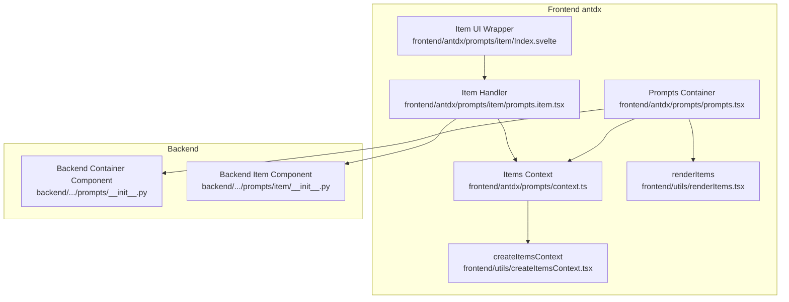
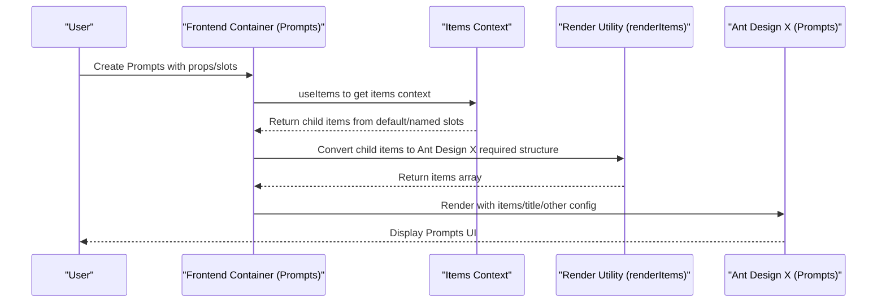
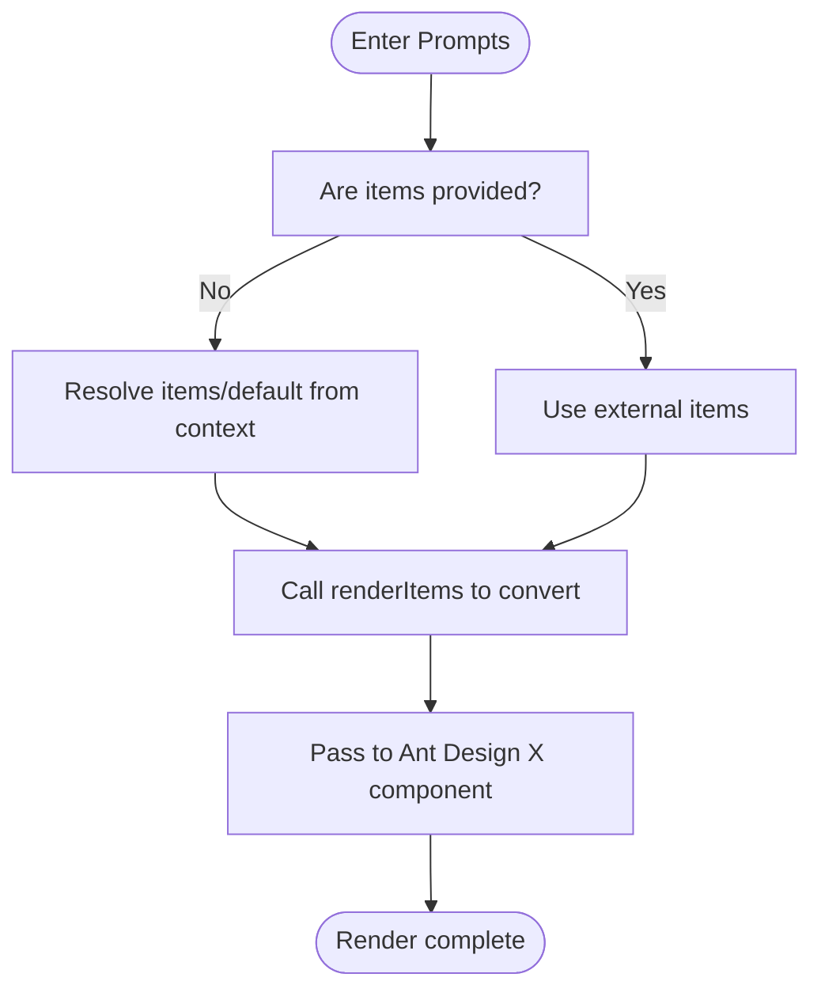
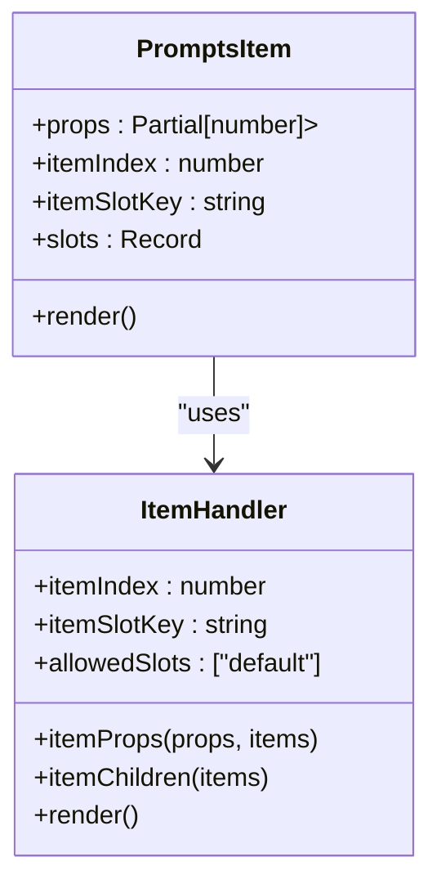
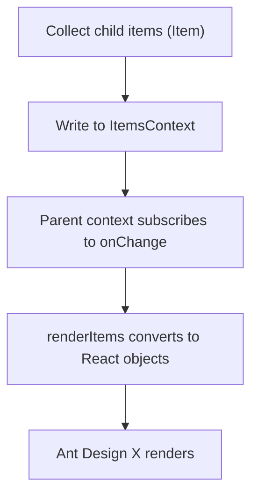
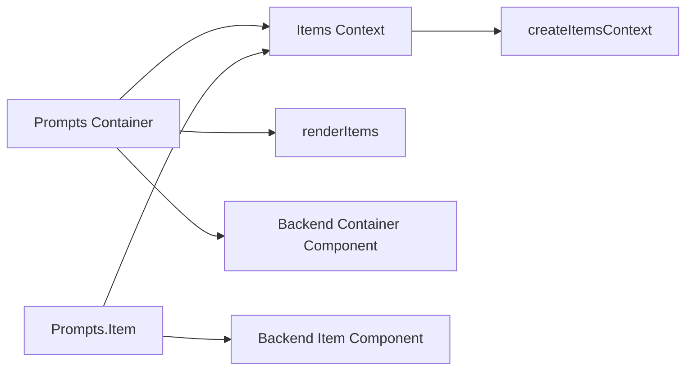

# Prompts Component

<cite>
**Files Referenced in This Document**
- [frontend/antdx/prompts/prompts.tsx](file://frontend/antdx/prompts/prompts.tsx)
- [frontend/antdx/prompts/context.ts](file://frontend/antdx/prompts/context.ts)
- [frontend/antdx/prompts/item/Index.svelte](file://frontend/antdx/prompts/item/Index.svelte)
- [frontend/antdx/prompts/item/prompts.item.tsx](file://frontend/antdx/prompts/item/prompts.item.tsx)
- [frontend/utils/createItemsContext.tsx](file://frontend/utils/createItemsContext.tsx)
- [frontend/utils/renderItems.tsx](file://frontend/utils/renderItems.tsx)
- [backend/modelscope_studio/components/antdx/prompts/__init__.py](file://backend/modelscope_studio/components/antdx/prompts/__init__.py)
- [backend/modelscope_studio/components/antdx/prompts/item/__init__.py](file://backend/modelscope_studio/components/antdx/prompts/item/__init__.py)
- [docs/components/antdx/prompts/README.md](file://docs/components/antdx/prompts/README.md)
- [docs/components/antdx/prompts/demos/basic.py](file://docs/components/antdx/prompts/demos/basic.py)
- [docs/components/antdx/prompts/demos/nest_usage.py](file://docs/components/antdx/prompts/demos/nest_usage.py)
</cite>

## Table of Contents

1. [Introduction](#introduction)
2. [Project Structure](#project-structure)
3. [Core Components](#core-components)
4. [Architecture Overview](#architecture-overview)
5. [Detailed Component Analysis](#detailed-component-analysis)
6. [Dependency Analysis](#dependency-analysis)
7. [Performance Considerations](#performance-considerations)
8. [Troubleshooting Guide](#troubleshooting-guide)
9. [Conclusion](#conclusion)
10. [Appendix: Usage Examples and Configuration](#appendix-usage-examples-and-configuration)

## Introduction

The Prompts component is used to display a set of preset questions or suggestion items, helping users quickly select an input direction and enhancing the naturalness and efficiency of conversational guidance. This component is based on Ant Design X's Prompts implementation, bridged in the frontend via a Svelte/React hybrid framework. It supports:

- Prompt template management: Flexibly organize sub-content such as titles, icons, tags, and descriptions via slots
- Preset instruction configuration: Supports vertical layout, wrapping, style overrides, class names, and other configurations
- Nested usage: Supports nesting prompt items inside other prompt items to create hierarchical suggestions
- Dynamic content generation: Collects child items via context and renders them into the data structure required by Ant Design X
- Event handling: Provides an item_click callback to execute business logic when a prompt item is clicked

## Project Structure

This component is located under the frontend antdx category and uses a layered design of "container component + item handler":

- Container Component: Responsible for collecting slot content, resolving context, and rendering into the items structure required by Ant Design X
- Item Handler: Responsible for wrapping each prompt item into a structure recognizable by the container, supporting nesting
- Utility Functions: Provides general "item context" and "render child items" capabilities, reused across multiple components

Diagram Sources

- [frontend/antdx/prompts/prompts.tsx:1-43](file://frontend/antdx/prompts/prompts.tsx#L1-L43)
- [frontend/antdx/prompts/context.ts:1-7](file://frontend/antdx/prompts/context.ts#L1-L7)
- [frontend/antdx/prompts/item/prompts.item.tsx:1-22](file://frontend/antdx/prompts/item/prompts.item.tsx#L1-L22)
- [frontend/antdx/prompts/item/Index.svelte:1-69](file://frontend/antdx/prompts/item/Index.svelte#L1-L69)
- [frontend/utils/createItemsContext.tsx:1-274](file://frontend/utils/createItemsContext.tsx#L1-L274)
- [frontend/utils/renderItems.tsx:1-114](file://frontend/utils/renderItems.tsx#L1-L114)
- [backend/modelscope_studio/components/antdx/prompts/**init**.py:1-88](file://backend/modelscope_studio/components/antdx/prompts/__init__.py#L1-L88)
- [backend/modelscope_studio/components/antdx/prompts/item/**init**.py:1-48](file://backend/modelscope_studio/components/antdx/prompts/item/__init__.py#L1-L48)

Section Sources

- [frontend/antdx/prompts/prompts.tsx:1-43](file://frontend/antdx/prompts/prompts.tsx#L1-L43)
- [frontend/antdx/prompts/context.ts:1-7](file://frontend/antdx/prompts/context.ts#L1-L7)
- [frontend/antdx/prompts/item/prompts.item.tsx:1-22](file://frontend/antdx/prompts/item/prompts.item.tsx#L1-L22)
- [frontend/antdx/prompts/item/Index.svelte:1-69](file://frontend/antdx/prompts/item/Index.svelte#L1-L69)
- [frontend/utils/createItemsContext.tsx:1-274](file://frontend/utils/createItemsContext.tsx#L1-L274)
- [frontend/utils/renderItems.tsx:1-114](file://frontend/utils/renderItems.tsx#L1-L114)
- [backend/modelscope_studio/components/antdx/prompts/**init**.py:1-88](file://backend/modelscope_studio/components/antdx/prompts/__init__.py#L1-L88)
- [backend/modelscope_studio/components/antdx/prompts/item/**init**.py:1-48](file://backend/modelscope_studio/components/antdx/prompts/item/__init__.py#L1-L48)

## Core Components

- Container Component: Prompts
  - Responsibility: Collects slot content (title, items) and child items, resolves context, converts child items into the items data structure required by Ant Design X, and renders them
  - Key Points: Supports passing external items data; if not provided, parses child items from the default or named slots in context; the title slot takes priority over props.title
- Item Handler: Prompts.Item
  - Responsibility: Wraps each prompt item into a structure recognizable by the container, supporting slots (label, icon, description) and visibility control
  - Key Points: Only allows the default slot as item content; supports extra property forwarding and passes internal index and slot key
- Item Context: createItemsContext
  - Responsibility: Provides ItemsContext, uniformly collecting and updating child items across slots, supporting nested sub-contexts
  - Key Points: setItem supports updates by slot key and index; onChange callback notifies the parent context
- Render Utility: renderItems
  - Responsibility: Renders Item structures from context into a React-usable object tree, automatically handling slots, cloning, and parameterized rendering
  - Key Points: Supports children key, withParams parameterized rendering, forceClone forced cloning

Section Sources

- [frontend/antdx/prompts/prompts.tsx:13-40](file://frontend/antdx/prompts/prompts.tsx#L13-L40)
- [frontend/antdx/prompts/item/prompts.item.tsx:7-19](file://frontend/antdx/prompts/item/prompts.item.tsx#L7-L19)
- [frontend/antdx/prompts/item/Index.svelte:16-68](file://frontend/antdx/prompts/item/Index.svelte#L16-L68)
- [frontend/utils/createItemsContext.tsx:97-273](file://frontend/utils/createItemsContext.tsx#L97-L273)
- [frontend/utils/renderItems.tsx:8-113](file://frontend/utils/renderItems.tsx#L8-L113)

## Architecture Overview

The runtime architecture of Prompts consists of "frontend container + item handler + context collection + render utility", with the backend bridging to the frontend through Gradio components.

Diagram Sources

- [frontend/antdx/prompts/prompts.tsx:16-38](file://frontend/antdx/prompts/prompts.tsx#L16-L38)
- [frontend/utils/renderItems.tsx:23-38](file://frontend/utils/renderItems.tsx#L23-L38)
- [frontend/utils/createItemsContext.tsx:108-170](file://frontend/utils/createItemsContext.tsx#L108-L170)

## Detailed Component Analysis

### Container Component: Prompts

- Slots and Properties
  - Supported slots: title, items
  - Supported properties: vertical, wrap, styles, class_names, root_class_name, fade_in, fade_in_left, etc.
- Context Resolution
  - If external items are provided, use them directly; otherwise parse from default or items slots in context
  - The title slot takes priority over props.title
- Rendering Strategy
  - Uses renderItems to convert Item structures from context into the object array required by Ant Design X
  - Clones and parameterizes slot content to ensure correct React rendering

Diagram Sources

- [frontend/antdx/prompts/prompts.tsx:16-38](file://frontend/antdx/prompts/prompts.tsx#L16-L38)
- [frontend/utils/renderItems.tsx:23-38](file://frontend/utils/renderItems.tsx#L23-L38)

Section Sources

- [frontend/antdx/prompts/prompts.tsx:13-40](file://frontend/antdx/prompts/prompts.tsx#L13-L40)
- [backend/modelscope_studio/components/antdx/prompts/**init**.py:28-69](file://backend/modelscope_studio/components/antdx/prompts/__init__.py#L28-L69)

### Item Handler: Prompts.Item

- Slots and Properties
  - Supported slots: label, icon, description
  - Supported properties: key, label, description, icon, disabled, visible, elem_id, elem_classes, elem_style, etc.
- Internal Processing
  - Registers child items into context via ItemHandler, supporting recursive rendering of item children
  - Only allows the default slot as item content to avoid ambiguity from multi-level slots
- Visibility and Styles
  - visible controls rendering; elem_id/elem_classes/elem_style support style customization

Diagram Sources

- [frontend/antdx/prompts/item/prompts.item.tsx:7-19](file://frontend/antdx/prompts/item/prompts.item.tsx#L7-L19)
- [frontend/antdx/prompts/item/Index.svelte:16-68](file://frontend/antdx/prompts/item/Index.svelte#L16-L68)

Section Sources

- [frontend/antdx/prompts/item/prompts.item.tsx:1-22](file://frontend/antdx/prompts/item/prompts.item.tsx#L1-L22)
- [frontend/antdx/prompts/item/Index.svelte:1-69](file://frontend/antdx/prompts/item/Index.svelte#L1-L69)
- [backend/modelscope_studio/components/antdx/prompts/item/**init**.py:18-48](file://backend/modelscope_studio/components/antdx/prompts/item/__init__.py#L18-L48)

### Item Context and Render Utility

- createItemsContext
  - Provides ItemsContextProvider, withItemsContextProvider, useItems, ItemHandler
  - Supports updating child items by slot key and index; onChange callback notifies the parent context
- renderItems
  - Converts Item structures into a React object tree, automatically handling slots, cloning, and parameterized rendering
  - Supports children key, withParams, forceClone, itemPropsTransformer, and other options

Diagram Sources

- [frontend/utils/createItemsContext.tsx:108-170](file://frontend/utils/createItemsContext.tsx#L108-L170)
- [frontend/utils/renderItems.tsx:23-98](file://frontend/utils/renderItems.tsx#L23-L98)

Section Sources

- [frontend/utils/createItemsContext.tsx:97-273](file://frontend/utils/createItemsContext.tsx#L97-L273)
- [frontend/utils/renderItems.tsx:8-113](file://frontend/utils/renderItems.tsx#L8-L113)

### Backend Bridge

- AntdXPrompts
  - Supported events: item_click
  - Supported slots: title, items
  - Supported properties: items, prefix_cls, title, vertical, wrap, styles, class_names, root_class_name, fade_in, fade_in_left, etc.
- AntdXPromptsItem
  - Supported slots: label, icon, description
  - Supported properties: label, key, description, icon, disabled, visible, elem_id, elem_classes, elem_style, etc.

Section Sources

- [backend/modelscope_studio/components/antdx/prompts/**init**.py:18-69](file://backend/modelscope_studio/components/antdx/prompts/__init__.py#L18-L69)
- [backend/modelscope_studio/components/antdx/prompts/item/**init**.py:18-48](file://backend/modelscope_studio/components/antdx/prompts/item/__init__.py#L18-L48)

## Dependency Analysis

- Component Coupling
  - Prompts depends on Items context and render utility; child items register to context via ItemHandler
  - Backend components serve as the bridge layer for frontend components, exposing events and properties
- External Dependencies
  - Ant Design X's Prompts component for actual rendering
  - Svelte/React hybrid toolchain for bridging and slot rendering

Diagram Sources

- [frontend/antdx/prompts/prompts.tsx:13-40](file://frontend/antdx/prompts/prompts.tsx#L13-L40)
- [frontend/antdx/prompts/item/prompts.item.tsx:7-19](file://frontend/antdx/prompts/item/prompts.item.tsx#L7-L19)
- [frontend/utils/createItemsContext.tsx:97-273](file://frontend/utils/createItemsContext.tsx#L97-L273)
- [frontend/utils/renderItems.tsx:8-113](file://frontend/utils/renderItems.tsx#L8-L113)
- [backend/modelscope_studio/components/antdx/prompts/**init**.py:11-69](file://backend/modelscope_studio/components/antdx/prompts/__init__.py#L11-L69)
- [backend/modelscope_studio/components/antdx/prompts/item/**init**.py:8-48](file://backend/modelscope_studio/components/antdx/prompts/item/__init__.py#L8-L48)

Section Sources

- [frontend/antdx/prompts/prompts.tsx:13-40](file://frontend/antdx/prompts/prompts.tsx#L13-L40)
- [frontend/antdx/prompts/item/prompts.item.tsx:7-19](file://frontend/antdx/prompts/item/prompts.item.tsx#L7-L19)
- [frontend/utils/createItemsContext.tsx:97-273](file://frontend/utils/createItemsContext.tsx#L97-L273)
- [frontend/utils/renderItems.tsx:8-113](file://frontend/utils/renderItems.tsx#L8-L113)
- [backend/modelscope_studio/components/antdx/prompts/**init**.py:11-69](file://backend/modelscope_studio/components/antdx/prompts/__init__.py#L11-L69)
- [backend/modelscope_studio/components/antdx/prompts/item/**init**.py:8-48](file://backend/modelscope_studio/components/antdx/prompts/item/__init__.py#L8-L48)

## Performance Considerations

- Render Optimization
  - Uses useMemo to cache items computation results, avoiding unnecessary re-renders
  - renderItems enables cloning by default (clone: true) to ensure safe React rendering and state isolation
- Context Updates
  - setItem only triggers updates when the value changes, reducing invalid renders
  - onChange callback fires when items update, enabling external listeners
- Nested Rendering
  - When child item children are rendered recursively, stable keys are generated by index to avoid list re-ordering

Section Sources

- [frontend/antdx/prompts/prompts.tsx:27-34](file://frontend/antdx/prompts/prompts.tsx#L27-L34)
- [frontend/utils/renderItems.tsx:30-38](file://frontend/utils/renderItems.tsx#L30-L38)
- [frontend/utils/createItemsContext.tsx:124-153](file://frontend/utils/createItemsContext.tsx#L124-L153)

## Troubleshooting Guide

- Issue: Prompt items not displaying
  - Check whether visible is true
  - Check whether slot names are correct (label, icon, description)
- Issue: Nested prompt items not working
  - Ensure child items use the default slot as content
  - Confirm child items are not using invalid slot keys
- Issue: No response on click
  - Confirm the item_click event has been bound
  - Check whether the backend event mapping is effective
- Issue: Styles not taking effect
  - Check whether elem_id, elem_classes, and elem_style are correctly passed
  - Check whether styles and class_names are overriding the target styles

Section Sources

- [frontend/antdx/prompts/item/Index.svelte:53-68](file://frontend/antdx/prompts/item/Index.svelte#L53-L68)
- [frontend/antdx/prompts/item/prompts.item.tsx:11-18](file://frontend/antdx/prompts/item/prompts.item.tsx#L11-L18)
- [backend/modelscope_studio/components/antdx/prompts/**init**.py:18-23](file://backend/modelscope_studio/components/antdx/prompts/__init__.py#L18-L23)

## Conclusion

The Prompts component, through its "container + item handler + context + render utility" architecture, achieves seamless bridging and extension of Ant Design X. It not only supports basic prompt set creation and style customization, but also provides powerful nesting capabilities and event handling interfaces that effectively improve the conversational guidance experience. Combined with the backend event bridge, developers can easily implement the complete loop from clicking a prompt item to executing business logic.

## Appendix: Usage Examples and Configuration

### Basic Prompt Set Creation

- Example Path: [docs/components/antdx/prompts/demos/basic.py:24-72](file://docs/components/antdx/prompts/demos/basic.py#L24-L72)
- Key Points
  - Wrap with XProvider
  - Set title, vertical, wrap, and other properties
  - Use slots (icon, label, description) in each prompt item

Section Sources

- [docs/components/antdx/prompts/demos/basic.py:24-72](file://docs/components/antdx/prompts/demos/basic.py#L24-L72)

### Nested Usage Scenarios

- Example Path: [docs/components/antdx/prompts/demos/nest_usage.py:16-83](file://docs/components/antdx/prompts/demos/nest_usage.py#L16-L83)
- Key Points
  - Nest prompt items inside prompt items to create hierarchical suggestions
  - Use styles and class_names for style customization
  - Use item_click to capture click events and handle them

Section Sources

- [docs/components/antdx/prompts/demos/nest_usage.py:16-83](file://docs/components/antdx/prompts/demos/nest_usage.py#L16-L83)

### Component Configuration Options (Frontend Container)

- Properties
  - items: Externally provided array of prompt items
  - title: Title text or slot
  - vertical: Whether to arrange vertically
  - wrap: Whether to wrap
  - styles: Style overrides
  - class_names: Class name mapping
  - root_class_name: Root class name
  - fade_in/fade_in_left: Entry animations
- Slots
  - title: Custom title
  - items: Custom prompt item collection

Section Sources

- [frontend/antdx/prompts/prompts.tsx:24-34](file://frontend/antdx/prompts/prompts.tsx#L24-L34)
- [backend/modelscope_studio/components/antdx/prompts/**init**.py:28-69](file://backend/modelscope_studio/components/antdx/prompts/__init__.py#L28-L69)

### Event Handling

- item_click: Triggered when a prompt item is clicked
- Example bindings: [docs/components/antdx/prompts/demos/basic.py:72](file://docs/components/antdx/prompts/demos/basic.py#L72), [docs/components/antdx/prompts/demos/nest_usage.py:83](file://docs/components/antdx/prompts/demos/nest_usage.py#L83)

Section Sources

- [backend/modelscope_studio/components/antdx/prompts/**init**.py:18-23](file://backend/modelscope_studio/components/antdx/prompts/__init__.py#L18-L23)
- [docs/components/antdx/prompts/demos/basic.py:72](file://docs/components/antdx/prompts/demos/basic.py#L72)
- [docs/components/antdx/prompts/demos/nest_usage.py:83](file://docs/components/antdx/prompts/demos/nest_usage.py#L83)

### Style Customization

- Use elem_id, elem_classes, elem_style for style customization of individual prompt items
- Use styles, class_names, root_class_name for customization of the overall layout and theme
- Example reference: [docs/components/antdx/prompts/demos/nest_usage.py:19-29](file://docs/components/antdx/prompts/demos/nest_usage.py#L19-L29)

Section Sources

- [frontend/antdx/prompts/item/Index.svelte:56-58](file://frontend/antdx/prompts/item/Index.svelte#L56-L58)
- [backend/modelscope_studio/components/antdx/prompts/item/**init**.py:30-35](file://backend/modelscope_studio/components/antdx/prompts/item/__init__.py#L30-L35)
- [backend/modelscope_studio/components/antdx/prompts/**init**.py:38-69](file://backend/modelscope_studio/components/antdx/prompts/__init__.py#L38-L69)
