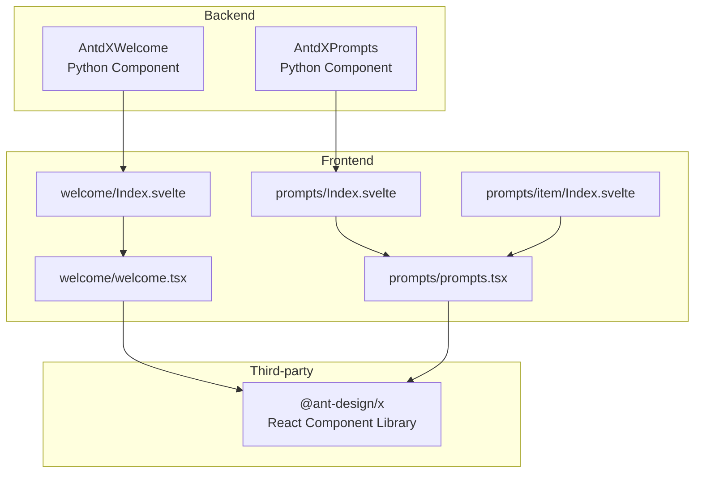
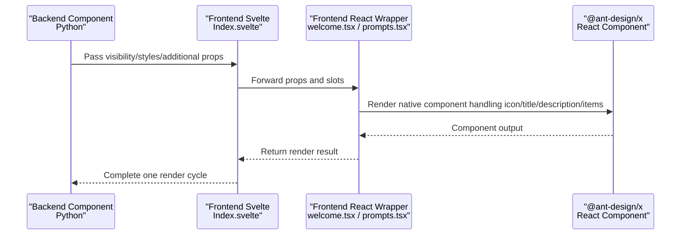
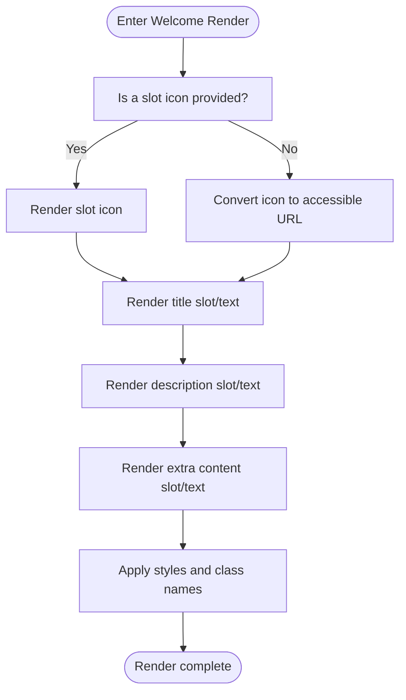
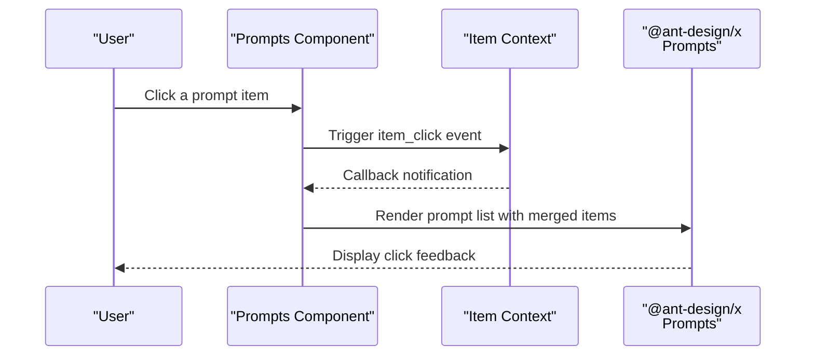
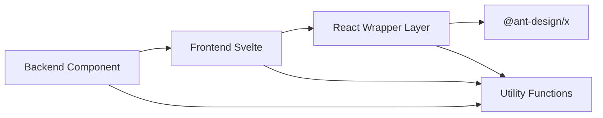

# Wake Components

<cite>
**Files Referenced in This Document**
- [backend/modelscope_studio/components/antdx/welcome/__init__.py](file://backend/modelscope_studio/components/antdx/welcome/__init__.py)
- [frontend/antdx/welcome/Index.svelte](file://frontend/antdx/welcome/Index.svelte)
- [frontend/antdx/welcome/welcome.tsx](file://frontend/antdx/welcome/welcome.tsx)
- [backend/modelscope_studio/components/antdx/prompts/__init__.py](file://backend/modelscope_studio/components/antdx/prompts/__init__.py)
- [frontend/antdx/prompts/Index.svelte](file://frontend/antdx/prompts/Index.svelte)
- [frontend/antdx/prompts/prompts.tsx](file://frontend/antdx/prompts/prompts.tsx)
- [frontend/antdx/prompts/item/Index.svelte](file://frontend/antdx/prompts/item/Index.svelte)
- [frontend/antdx/prompts/item/prompts.item.tsx](file://frontend/antdx/prompts/item/prompts.item.tsx)
- [frontend/pro/chatbot/chatbot.tsx](file://frontend/pro/chatbot/chatbot.tsx)
- [docs/layout_templates/chatbot/demos/fine_grained_control.py](file://docs/layout_templates/chatbot/demos/fine_grained_control.py)
</cite>

## Table of Contents

1. [Introduction](#introduction)
2. [Project Structure](#project-structure)
3. [Core Components](#core-components)
4. [Architecture Overview](#architecture-overview)
5. [Detailed Component Analysis](#detailed-component-analysis)
6. [Dependency Analysis](#dependency-analysis)
7. [Performance Considerations](#performance-considerations)
8. [Troubleshooting Guide](#troubleshooting-guide)
9. [Conclusion](#conclusion)
10. [Appendix](#appendix)

## Introduction

This document covers the Ant Design X Wake Components, systematically describing the design and usage of the Welcome component and the Prompts component. It helps developers quickly build high-quality initial user experiences: Welcome handles the display and personalization of the welcome page; Prompts handles the organization of prompt templates, preset instructions, and intelligent recommendations. The documentation covers component responsibilities, data flow, interaction logic, extension points, and complete usage examples to support real-world project integration.

## Project Structure

The Ant Design X Wake Components are implemented through a collaboration between backend Python components and a frontend Svelte/React layer:

- The backend component handles parameter parsing, static resource processing, event binding, and rendering control
- The frontend Svelte layer handles property forwarding, slot resolution, and async loading of React components
- The React layer directly interfaces with the native components of @ant-design/x for final rendering

Diagram Sources

- [backend/modelscope_studio/components/antdx/welcome/**init**.py:8-55](file://backend/modelscope_studio/components/antdx/welcome/__init__.py#L8-L55)
- [backend/modelscope_studio/components/antdx/prompts/**init**.py:11-70](file://backend/modelscope_studio/components/antdx/prompts/__init__.py#L11-L70)
- [frontend/antdx/welcome/Index.svelte:1-65](file://frontend/antdx/welcome/Index.svelte#L1-L65)
- [frontend/antdx/prompts/Index.svelte:1-70](file://frontend/antdx/prompts/Index.svelte#L1-L70)
- [frontend/antdx/welcome/welcome.tsx:1-44](file://frontend/antdx/welcome/welcome.tsx#L1-L44)
- [frontend/antdx/prompts/prompts.tsx:1-43](file://frontend/antdx/prompts/prompts.tsx#L1-L43)
- [frontend/antdx/prompts/item/Index.svelte:1-68](file://frontend/antdx/prompts/item/Index.svelte#L1-L68)

Section Sources

- [backend/modelscope_studio/components/antdx/welcome/**init**.py:8-73](file://backend/modelscope_studio/components/antdx/welcome/__init__.py#L8-L73)
- [backend/modelscope_studio/components/antdx/prompts/**init**.py:11-88](file://backend/modelscope_studio/components/antdx/prompts/__init__.py#L11-L88)
- [frontend/antdx/welcome/Index.svelte:1-65](file://frontend/antdx/welcome/Index.svelte#L1-L65)
- [frontend/antdx/prompts/Index.svelte:1-70](file://frontend/antdx/prompts/Index.svelte#L1-L70)

## Core Components

- Welcome Component: Used for displaying the welcome page. Supports slot-based customization of title, description, icon, and extra content, along with style and variant configuration.
- Prompts Component: Used for displaying a set of prompt templates. Supports title slot, item slots, vertical layout, fade-in animations, wrapping, and provides an item_click callback event.

Section Sources

- [backend/modelscope_studio/components/antdx/welcome/**init**.py:8-55](file://backend/modelscope_studio/components/antdx/welcome/__init__.py#L8-L55)
- [backend/modelscope_studio/components/antdx/prompts/**init**.py:11-70](file://backend/modelscope_studio/components/antdx/prompts/__init__.py#L11-L70)

## Architecture Overview

The diagram below shows the data and control flow from the backend to the frontend and then to the third-party component library:

Diagram Sources

- [frontend/antdx/welcome/Index.svelte:49-64](file://frontend/antdx/welcome/Index.svelte#L49-L64)
- [frontend/antdx/welcome/welcome.tsx:16-41](file://frontend/antdx/welcome/welcome.tsx#L16-L41)
- [frontend/antdx/prompts/Index.svelte:56-69](file://frontend/antdx/prompts/Index.svelte#L56-L69)
- [frontend/antdx/prompts/prompts.tsx:13-40](file://frontend/antdx/prompts/prompts.tsx#L13-L40)

## Detailed Component Analysis

### Welcome Component

- Component Responsibilities
  - Displays the welcome page with slot-based customization of title, description, icon, and extra content
  - Supports style and class name injection, along with multiple variant styles
  - Icon supports static resource paths or file objects, uniformly converted to accessible URLs via utility functions
- Key Properties
  - Slots: extra, icon, description, title
  - Variants: filled, borderless
  - Styles: styles, class_names, root_class_name
  - Metadata: elem_id, elem_classes, elem_style, visible, render
- Data Flow
  - Backend receives parameters and processes static resource paths
  - Frontend Svelte forwards props and slots to the React wrapper layer
  - React layer determines rendering content based on slot priority strategy and converts icons to accessible URLs
- Interaction Logic
  - Serves as the welcome page entry point, typically displayed during application initialization
  - Can be hidden or transitioned to the conversation area after the user selects a prompt, based on business logic

Diagram Sources

- [frontend/antdx/welcome/welcome.tsx:16-41](file://frontend/antdx/welcome/welcome.tsx#L16-L41)
- [backend/modelscope_studio/components/antdx/welcome/**init**.py:47-53](file://backend/modelscope_studio/components/antdx/welcome/__init__.py#L47-L53)

Section Sources

- [backend/modelscope_studio/components/antdx/welcome/**init**.py:8-73](file://backend/modelscope_studio/components/antdx/welcome/__init__.py#L8-L73)
- [frontend/antdx/welcome/Index.svelte:1-65](file://frontend/antdx/welcome/Index.svelte#L1-L65)
- [frontend/antdx/welcome/welcome.tsx:1-44](file://frontend/antdx/welcome/welcome.tsx#L1-L44)

### Prompts Component

- Component Responsibilities
  - Displays a set of prompt templates with support for title and item slots
  - Provides item click event callbacks to trigger subsequent interactions
  - Supports visual configurations such as vertical layout, fade-in animations, and wrapping
- Key Properties
  - Slots: title, items
  - List configuration: items, vertical, fade_in, fade_in_left, wrap
  - Styles and class names: styles, class_names, root_class_name
  - Metadata: elem_id, elem_classes, elem_style, visible, render
- Data Flow
  - Backend defines event listeners, mapping item_click to frontend events
  - Frontend Svelte forwards props and slots to the React wrapper layer
  - React layer merges external items with slot items, cloning on demand to avoid side effects
- Interaction Logic
  - A callback is triggered when the user clicks a prompt item; specific behaviors can be bound at the business layer (e.g., filling the input box, initiating a request)

Diagram Sources

- [backend/modelscope_studio/components/antdx/prompts/**init**.py:18-23](file://backend/modelscope_studio/components/antdx/prompts/__init__.py#L18-L23)
- [frontend/antdx/prompts/Index.svelte:48-49](file://frontend/antdx/prompts/Index.svelte#L48-L49)
- [frontend/antdx/prompts/prompts.tsx:13-40](file://frontend/antdx/prompts/prompts.tsx#L13-L40)

Section Sources

- [backend/modelscope_studio/components/antdx/prompts/**init**.py:11-88](file://backend/modelscope_studio/components/antdx/prompts/__init__.py#L11-L88)
- [frontend/antdx/prompts/Index.svelte:1-70](file://frontend/antdx/prompts/Index.svelte#L1-L70)
- [frontend/antdx/prompts/prompts.tsx:1-43](file://frontend/antdx/prompts/prompts.tsx#L1-L43)
- [frontend/antdx/prompts/item/Index.svelte:1-68](file://frontend/antdx/prompts/item/Index.svelte#L1-L68)
- [frontend/antdx/prompts/item/prompts.item.tsx:1-21](file://frontend/antdx/prompts/item/prompts.item.tsx#L1-L21)

## Dependency Analysis

- Component Coupling
  - Backend components are only responsible for parameter and static resource handling — low coupling
  - Frontend Svelte layer handles prop forwarding and slot resolution — low coupling
  - React wrapper layer is tightly coupled to @ant-design/x, but transparent to upper layers
- External Dependencies
  - @ant-design/x: Provides native implementations of Welcome and Prompts
  - Utility functions: File URL conversion, slot rendering, item rendering, etc.
- Event Mapping
  - The backend maps the item_click event to frontend event names to ensure cross-layer consistency

Diagram Sources

- [frontend/antdx/welcome/welcome.tsx:6-7](file://frontend/antdx/welcome/welcome.tsx#L6-L7)
- [frontend/antdx/prompts/prompts.tsx:9-11](file://frontend/antdx/prompts/prompts.tsx#L9-L11)
- [backend/modelscope_studio/components/antdx/prompts/**init**.py:18-23](file://backend/modelscope_studio/components/antdx/prompts/__init__.py#L18-L23)

Section Sources

- [backend/modelscope_studio/components/antdx/welcome/**init**.py:8-55](file://backend/modelscope_studio/components/antdx/welcome/__init__.py#L8-L55)
- [backend/modelscope_studio/components/antdx/prompts/**init**.py:11-70](file://backend/modelscope_studio/components/antdx/prompts/__init__.py#L11-L70)
- [frontend/antdx/welcome/welcome.tsx:1-44](file://frontend/antdx/welcome/welcome.tsx#L1-L44)
- [frontend/antdx/prompts/prompts.tsx:1-43](file://frontend/antdx/prompts/prompts.tsx#L1-L43)

## Performance Considerations

- Render Optimization
  - Use async component imports to avoid blocking the initial render
  - Delay slot content rendering to reduce unnecessary computation
- Resource Optimization
  - Icons go through a unified URL conversion to avoid repeated downloads
  - Item rendering uses a cloning strategy to reduce re-renders caused by shared state
- Event Handling
  - Event mapping is completed in the frontend to reduce backend overhead

## Troubleshooting Guide

- Icon Not Displaying
  - Check whether the icon path is correct and confirm it has been converted to an accessible URL via the utility function
  - If using a slot icon, verify the slot content is rendering correctly
- Slot Content Not Taking Effect
  - Confirm the slot name matches the slots supported by the component (Welcome: extra, icon, description, title; Prompts: title, items)
  - Verify that the slot content is correctly wrapped in the React wrapper layer
- Click Events Not Firing
  - Confirm the backend event listener is enabled and the frontend event mapping is correct
  - Check whether the upper business layer has correctly bound the callback

Section Sources

- [frontend/antdx/welcome/welcome.tsx:23-37](file://frontend/antdx/welcome/welcome.tsx#L23-L37)
- [frontend/antdx/prompts/Index.svelte:48-49](file://frontend/antdx/prompts/Index.svelte#L48-L49)
- [backend/modelscope_studio/components/antdx/prompts/**init**.py:18-23](file://backend/modelscope_studio/components/antdx/prompts/__init__.py#L18-L23)

## Conclusion

The Welcome and Prompts components provide high customizability and good extensibility for the initial user experience through clear responsibility separation and slot-based design. Combined with the native capabilities of @ant-design/x, they can satisfy both basic display requirements and complex interaction and recommendation scenarios. It is recommended to configure styles and events according to business objectives in real projects for a better user experience.

## Appendix

### Usage Examples and Best Practices

- Welcome Page Design
  - Use the Welcome component as the entry point for the first screen, configuring title, description, and icon via slots
  - Configure variants and styles to match the overall design style
  - Hide the welcome page and enter the conversation area after the user selects a prompt
- Prompts Configuration
  - Use the Prompts component to display a set of prompt templates, supporting grouping and hierarchies
  - Combine slots with external items for flexible prompt content management
  - Bind the item_click event to enable click-to-use interactions
- User Onboarding Flow
  - Display the welcome page during application initialization
  - Show curated prompt sets to guide users to get started quickly
  - Dynamically adjust prompt content and ordering based on user behavior

Section Sources

- [frontend/pro/chatbot/chatbot.tsx:108-115](file://frontend/pro/chatbot/chatbot.tsx#L108-L115)
- [docs/layout_templates/chatbot/demos/fine_grained_control.py:603-619](file://docs/layout_templates/chatbot/demos/fine_grained_control.py#L603-L619)
