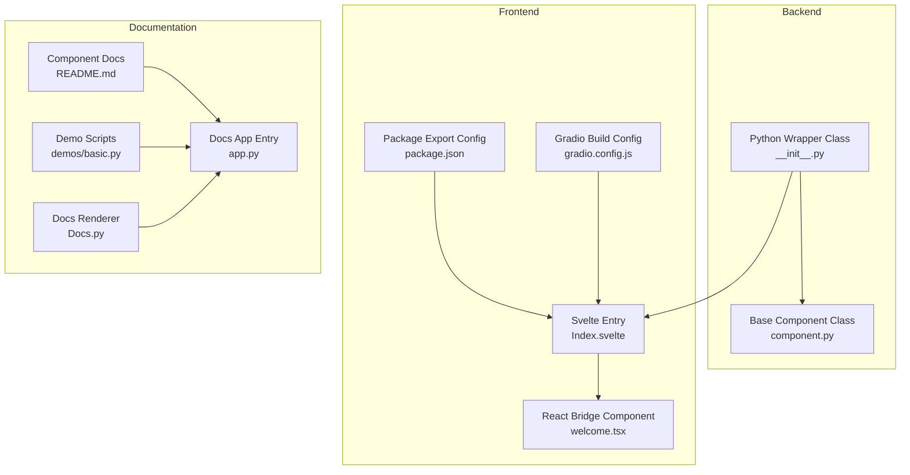
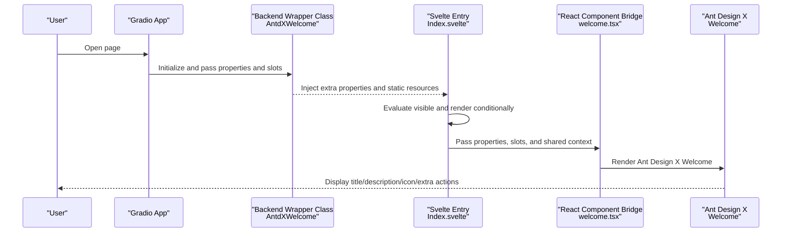
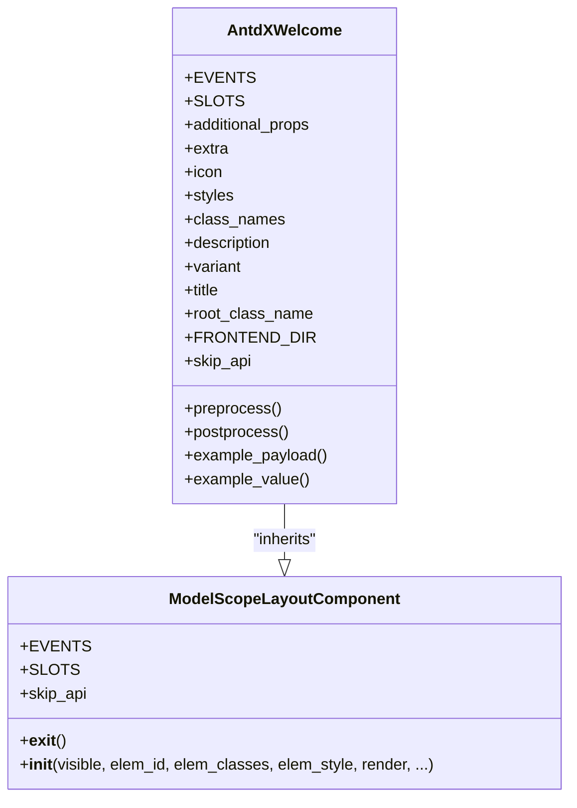
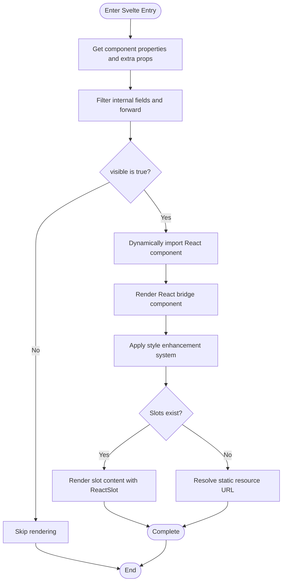
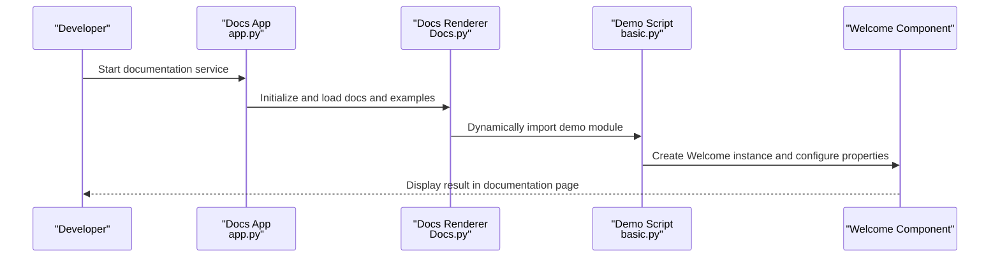
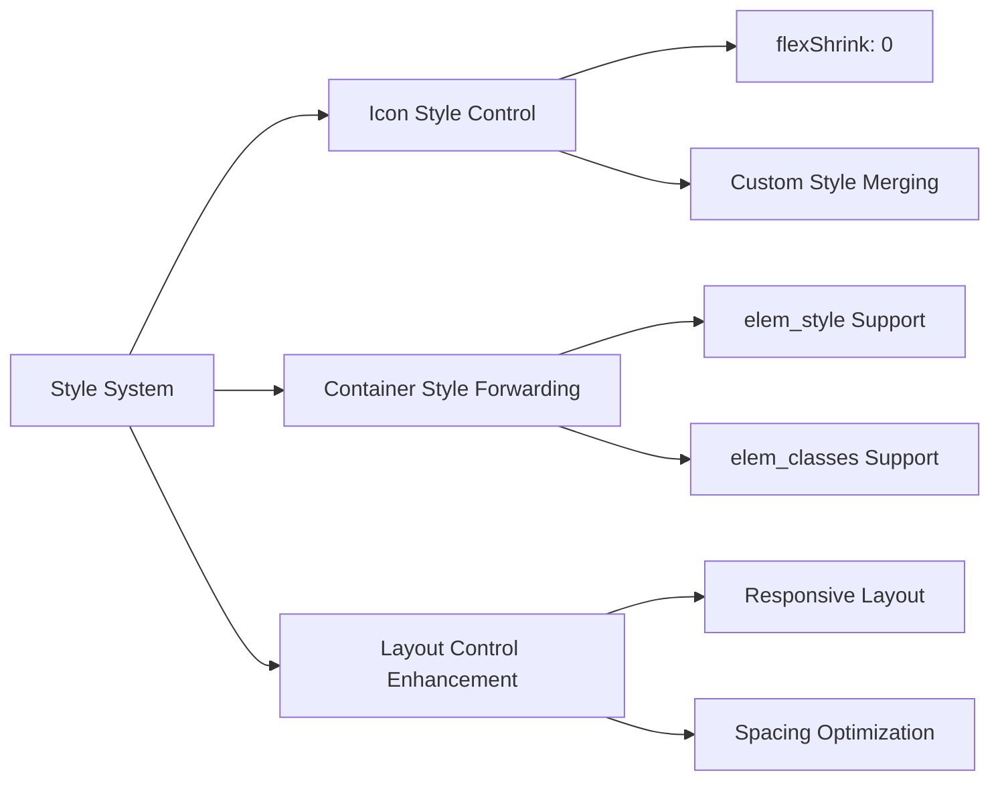
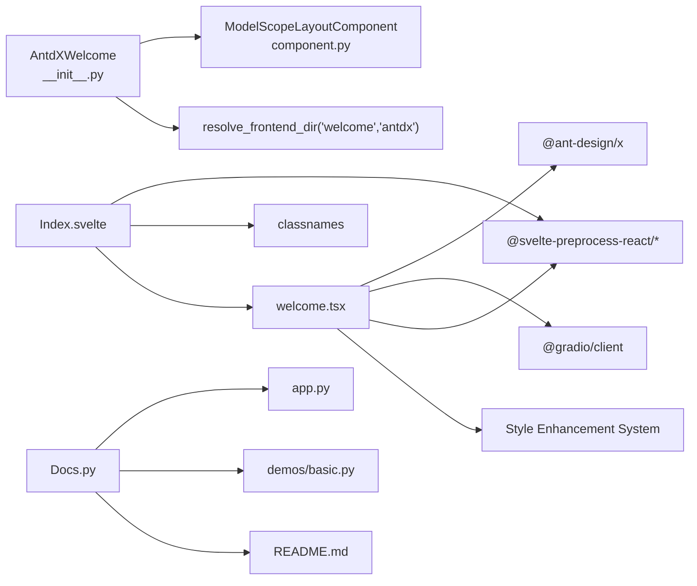

# Welcome Component

<cite>
**Files Referenced in This Document**
- [frontend/antdx/welcome/Index.svelte](file://frontend/antdx/welcome/Index.svelte)
- [frontend/antdx/welcome/welcome.tsx](file://frontend/antdx/welcome/welcome.tsx)
- [backend/modelscope_studio/components/antdx/welcome/__init__.py](file://backend/modelscope_studio/components/antdx/welcome/__init__.py)
- [docs/components/antdx/welcome/README.md](file://docs/components/antdx/welcome/README.md)
- [docs/components/antdx/welcome/demos/basic.py](file://docs/components/antdx/welcome/demos/basic.py)
- [frontend/antdx/welcome/package.json](file://frontend/antdx/welcome/package.json)
- [frontend/antdx/welcome/gradio.config.js](file://frontend/antdx/welcome/gradio.config.js)
- [docs/components/antdx/welcome/app.py](file://docs/components/antdx/welcome/app.py)
- [docs/helper/Docs.py](file://docs/helper/Docs.py)
- [backend/modelscope_studio/utils/dev/component.py](file://backend/modelscope_studio/utils/dev/component.py)
</cite>

## Update Summary

**Changes Made**

- Enhanced style support system with improved layout control capabilities
- Added flexShrink control for the icon area to optimize responsive layout behavior
- Improved style merging mechanism with support for more granular style customization

## Table of Contents

1. [Introduction](#introduction)
2. [Project Structure](#project-structure)
3. [Core Components](#core-components)
4. [Architecture Overview](#architecture-overview)
5. [Detailed Component Analysis](#detailed-component-analysis)
6. [Style Enhancement Features](#style-enhancement-features)
7. [Dependency Analysis](#dependency-analysis)
8. [Performance Considerations](#performance-considerations)
9. [Troubleshooting Guide](#troubleshooting-guide)
10. [Conclusion](#conclusion)
11. [Appendix](#appendix)

## Introduction

The Welcome component is designed to clearly communicate the intended purpose and expected functionality of an interface, targeting "AI agent product interface" scenarios. This component is based on Ant Design X's Welcome implementation, wrapped by a Python backend and bridged through a Svelte frontend. It provides slot-based extension capabilities, icon and copy customization, variant style control, and can be used as a layout element in Gradio applications.

**Update** This update enhances the style support system, providing improved layout control capabilities and responsive design optimizations.

## Project Structure

The Welcome component consists of a backend Python wrapper class and a frontend Svelte/React bridge layer. The documentation system renders examples and descriptions through the Docs helper.

**Diagram Sources**

- [backend/modelscope_studio/components/antdx/welcome/**init**.py:1-73](file://backend/modelscope_studio/components/antdx/welcome/__init__.py#L1-L73)
- [backend/modelscope_studio/utils/dev/component.py:11-50](file://backend/modelscope_studio/utils/dev/component.py#L11-L50)
- [frontend/antdx/welcome/Index.svelte:1-65](file://frontend/antdx/welcome/Index.svelte#L1-L65)
- [frontend/antdx/welcome/welcome.tsx:1-51](file://frontend/antdx/welcome/welcome.tsx#L1-L51)
- [frontend/antdx/welcome/package.json:1-15](file://frontend/antdx/welcome/package.json#L1-L15)
- [frontend/antdx/welcome/gradio.config.js:1-4](file://frontend/antdx/welcome/gradio.config.js#L1-L4)
- [docs/components/antdx/welcome/README.md:1-8](file://docs/components/antdx/welcome/README.md#L1-L8)
- [docs/components/antdx/welcome/demos/basic.py:1-37](file://docs/components/antdx/welcome/demos/basic.py#L1-L37)
- [docs/components/antdx/welcome/app.py:1-7](file://docs/components/antdx/welcome/app.py#L1-L7)
- [docs/helper/Docs.py:1-178](file://docs/helper/Docs.py#L1-L178)

## Core Components

- Backend Wrapper Class: Responsible for declaring supported slots, properties, styles, and rendering lifecycle, while converting static resource paths to accessible URLs.
- Frontend Bridge Layer: Encapsulates Ant Design X React components in Svelte style, supporting slot rendering and static resource URL resolution.
- Documentation and Examples: Provides minimal viable examples and documentation pages for quick onboarding.

Key Responsibilities and Behaviors

- Slot Support: title, description, icon, extra.
- Property Configuration: icon, title, description, variant (filled/borderless), style and class name injection, visibility and DOM attribute forwarding.
- Resource Handling: Resolves icon paths passed from the backend to ensure they can be correctly loaded in the Gradio environment.
- Rendering Strategy: Controls whether to render based on visible; injects shared rootUrl and apiPrefix in the Gradio context.

**Section Sources**

- [backend/modelscope_studio/components/antdx/welcome/**init**.py:14-55](file://backend/modelscope_studio/components/antdx/welcome/__init__.py#L14-L55)
- [frontend/antdx/welcome/welcome.tsx:8-41](file://frontend/antdx/welcome/welcome.tsx#L8-L41)
- [frontend/antdx/welcome/Index.svelte:12-44](file://frontend/antdx/welcome/Index.svelte#L12-L44)

## Architecture Overview

The Welcome component uses a layered design of "backend component + frontend bridge + documentation examples". The backend handles component semantics and resource processing, the frontend handles UI rendering and slot integration, and the documentation system handles the unified presentation of examples and descriptions.

**Diagram Sources**

- [backend/modelscope_studio/components/antdx/welcome/**init**.py:37-55](file://backend/modelscope_studio/components/antdx/welcome/__init__.py#L37-L55)
- [frontend/antdx/welcome/Index.svelte:49-64](file://frontend/antdx/welcome/Index.svelte#L49-L64)
- [frontend/antdx/welcome/welcome.tsx:16-41](file://frontend/antdx/welcome/welcome.tsx#L16-L41)

## Detailed Component Analysis

### Backend Wrapper Class (Python)

- Supported Slots: extra, icon, description, title.
- Key Properties:
  - Icon: icon (supports local static file paths; converted to accessible URLs by the backend).
  - Title and Description: title, description.
  - Variant: variant (filled or borderless).
  - Styles and Class Names: styles, class_names, elem_id, elem_classes, elem_style.
  - Render Control: visible, render, as_item.
- Lifecycle:
  - Placeholder implementations for preprocess/postprocess/example_payload/example_value; skip_api returns True, indicating this component does not participate in the standard API flow.
- Frontend Directory Resolution: Uses resolve_frontend_dir("welcome", type="antdx") to point to the frontend implementation.

**Diagram Sources**

- [backend/modelscope_studio/utils/dev/component.py:11-50](file://backend/modelscope_studio/utils/dev/component.py#L11-L50)
- [backend/modelscope_studio/components/antdx/welcome/**init**.py:8-73](file://backend/modelscope_studio/components/antdx/welcome/__init__.py#L8-L73)

**Section Sources**

- [backend/modelscope_studio/components/antdx/welcome/**init**.py:14-55](file://backend/modelscope_studio/components/antdx/welcome/__init__.py#L14-L55)
- [backend/modelscope_studio/utils/dev/component.py:11-50](file://backend/modelscope_studio/utils/dev/component.py#L11-L50)

### Frontend Bridge Layer (Svelte + React)

- Svelte Entry Responsibilities:
  - Retrieves component properties and extra properties, filters out internally reserved fields (e.g., visible, \_internal), and forwards the remaining properties to the React component.
  - Uses conditional rendering to load and render the React component only when visible is true.
  - Passes Gradio's shared rootUrl and apiPrefix to the React component for resolving static resources.
- React Bridge Responsibilities:
  - Wraps Ant Design X's Welcome component with sveltify to support slot rendering.
  - Handles icon with priority: if a slot exists, renders the slot content; otherwise resolves the static resource URL.
  - Supports both slot and string value dual-mode for title, description, and extra.
  - **New**: Enhanced style support system providing better layout control capabilities.

**Diagram Sources**

- [frontend/antdx/welcome/Index.svelte:22-44](file://frontend/antdx/welcome/Index.svelte#L22-L44)
- [frontend/antdx/welcome/welcome.tsx:16-41](file://frontend/antdx/welcome/welcome.tsx#L16-L41)

**Section Sources**

- [frontend/antdx/welcome/Index.svelte:12-44](file://frontend/antdx/welcome/Index.svelte#L12-L44)
- [frontend/antdx/welcome/welcome.tsx:8-41](file://frontend/antdx/welcome/welcome.tsx#L8-L41)

### Documentation and Examples (Docs System)

- The documentation app uses the Docs class to scan the README and demos directories, automatically rendering example code and run results.
- The demo scripts demonstrate two variants (default and borderless) and inject extra action buttons via slots.

**Diagram Sources**

- [docs/components/antdx/welcome/app.py:1-7](file://docs/components/antdx/welcome/app.py#L1-L7)
- [docs/helper/Docs.py:58-75](file://docs/helper/Docs.py#L58-L75)
- [docs/components/antdx/welcome/demos/basic.py:6-36](file://docs/components/antdx/welcome/demos/basic.py#L6-L36)

**Section Sources**

- [docs/components/antdx/welcome/README.md:1-8](file://docs/components/antdx/welcome/README.md#L1-L8)
- [docs/components/antdx/welcome/demos/basic.py:1-37](file://docs/components/antdx/welcome/demos/basic.py#L1-L37)
- [docs/components/antdx/welcome/app.py:1-7](file://docs/components/antdx/welcome/app.py#L1-L7)
- [docs/helper/Docs.py:58-75](file://docs/helper/Docs.py#L58-L75)

## Style Enhancement Features

### Enhanced Style Support System

The Welcome component now provides more powerful style support and layout control capabilities, primarily in the following areas:

#### Icon Area Layout Optimization

- **flexShrink Control**: Sets `flexShrink: 0` for the icon area to ensure the icon maintains a fixed size in responsive layouts
- **Style Merging Mechanism**: Supports intelligent merging of user-defined styles with default styles
- **Responsive Adaptation**: Optimizes layout behavior across different screen sizes

#### Style Customization Capabilities

- **styles Parameter Support**: Fully supports passing the styles parameter from Ant Design X
- **Independent Icon Style Control**: Allows separate style customization for the icon area
- **Theme Consistency**: Maintains compatibility with the Ant Design X theme system

#### Layout Control Enhancements

- **Container Style Forwarding**: Supports container-level style control via elem_style and elem_classes
- **Flexbox Optimization**: Uses Flexbox layout for better content arrangement
- **Spacing Control**: Optimizes spacing between icon, title, and description

**Diagram Sources**

- [frontend/antdx/welcome/welcome.tsx:23-29](file://frontend/antdx/welcome/welcome.tsx#L23-L29)
- [frontend/antdx/welcome/Index.svelte:52-53](file://frontend/antdx/welcome/Index.svelte#L52-L53)

**Section Sources**

- [frontend/antdx/welcome/welcome.tsx:23-29](file://frontend/antdx/welcome/welcome.tsx#L23-L29)
- [frontend/antdx/welcome/Index.svelte:52-53](file://frontend/antdx/welcome/Index.svelte#L52-L53)

## Dependency Analysis

- Backend Dependencies:
  - Base Component Class: Provides common layout component capabilities and context management.
  - Frontend Directory Resolution: Uses resolve_frontend_dir to locate the frontend implementation.
- Frontend Dependencies:
  - Ant Design X React component library.
  - Gradio client tools: For static resource URL resolution.
  - Svelte preprocessing toolchain: Bridges React components with Svelte.
  - **New**: Style system enhancement dependencies providing better layout control capabilities.
- Documentation System Dependencies:
  - Docs renderer responsible for scanning and rendering README and demos.

**Diagram Sources**

- [backend/modelscope_studio/components/antdx/welcome/**init**.py:55-55](file://backend/modelscope_studio/components/antdx/welcome/__init__.py#L55-L55)
- [backend/modelscope_studio/utils/dev/component.py:11-50](file://backend/modelscope_studio/utils/dev/component.py#L11-L50)
- [frontend/antdx/welcome/Index.svelte:1-10](file://frontend/antdx/welcome/Index.svelte#L1-L10)
- [frontend/antdx/welcome/welcome.tsx:1-7](file://frontend/antdx/welcome/welcome.tsx#L1-L7)
- [docs/helper/Docs.py:58-75](file://docs/helper/Docs.py#L58-L75)
- [docs/components/antdx/welcome/demos/basic.py:1-5](file://docs/components/antdx/welcome/demos/basic.py#L1-L5)

**Section Sources**

- [backend/modelscope_studio/components/antdx/welcome/**init**.py:55-55](file://backend/modelscope_studio/components/antdx/welcome/__init__.py#L55-L55)
- [frontend/antdx/welcome/Index.svelte:1-10](file://frontend/antdx/welcome/Index.svelte#L1-L10)
- [frontend/antdx/welcome/welcome.tsx:1-7](file://frontend/antdx/welcome/welcome.tsx#L1-L7)
- [docs/helper/Docs.py:58-75](file://docs/helper/Docs.py#L58-L75)

## Performance Considerations

- Conditional Rendering: Only loads and renders the React component when visible is true, avoiding unnecessary initialization and network requests.
- Dynamic Import: Async import of the React component reduces initial load.
- Resource Resolution: Resolves static resource URLs uniformly in the frontend, avoiding repeated computation and cross-origin issues.
- Slot Rendering: Prioritizes slot content, reducing string concatenation and template rendering costs.
- **New**: The style enhancement system uses an efficient style merging algorithm to avoid redundant renders and style conflicts.

## Troubleshooting Guide

- Icon Not Displaying
  - Check whether the icon passed from the backend is a valid path or URL.
  - Confirm that Gradio's shared rootUrl and apiPrefix have been correctly passed to the frontend.
- Slot Not Taking Effect
  - Confirm the slot name is one of: title, description, icon, extra.
  - Ensure slot content is correctly mounted at runtime.
- Component Not Rendering
  - Check whether visible is true.
  - Confirm the frontend implementation pointed to by FRONTEND_DIR exists and can be built.
- Documentation Examples Not Running
  - Check whether the component nesting and Provider usage in demos/basic.py are correct.
  - Confirm the documentation app entry and Docs renderer configuration are correct.
- **New**: Style Display Issues
  - Check that the styles parameter format is correct.
  - Confirm the style merging logic does not cause conflicts.
  - Verify that the flexShrink property is not adversely affecting layout behavior.

**Section Sources**

- [frontend/antdx/welcome/Index.svelte:49-64](file://frontend/antdx/welcome/Index.svelte#L49-L64)
- [frontend/antdx/welcome/welcome.tsx:16-41](file://frontend/antdx/welcome/welcome.tsx#L16-L41)
- [docs/components/antdx/welcome/demos/basic.py:6-36](file://docs/components/antdx/welcome/demos/basic.py#L6-L36)
- [docs/helper/Docs.py:58-75](file://docs/helper/Docs.py#L58-L75)

## Conclusion

The Welcome component, through the collaboration of backend and frontend, provides concise yet powerful welcome page display capabilities. Its slot-based design and resource resolution mechanism enable flexible personalization and integration in diverse scenarios. Combined with the documentation system's example and rendering capabilities, developers can quickly understand and use this component.

**Update** This style enhancement further improves the component's layout control capabilities and responsive design performance, providing developers with more granular style customization options and a better user experience.

## Appendix

### Usage Examples (Overview)

- Create a basic welcome page with icon, title, and description.
- Use the borderless variant for a lighter interface style.
- Inject extra action buttons via slots to enhance user guidance.
- **New**: Leverage the enhanced style system for more granular layout control.

Reference Example Script Path

- [docs/components/antdx/welcome/demos/basic.py:6-36](file://docs/components/antdx/welcome/demos/basic.py#L6-L36)

**Section Sources**

- [docs/components/antdx/welcome/demos/basic.py:1-37](file://docs/components/antdx/welcome/demos/basic.py#L1-L37)

### Properties and Events Reference (Overview)

- Supported Slots: extra, icon, description, title.
- Key Properties: icon, title, description, variant (filled/borderless), styles and class names, visibility and DOM attributes.
- Events: No events defined in the current version.
- Lifecycle: skip_api is true; does not participate in the standard API flow.
- **New**: Style enhancement support providing richer layout control options.

**Section Sources**

- [backend/modelscope_studio/components/antdx/welcome/**init**.py:12-15](file://backend/modelscope_studio/components/antdx/welcome/__init__.py#L12-L15)
- [backend/modelscope_studio/components/antdx/welcome/**init**.py:31-37](file://backend/modelscope_studio/components/antdx/welcome/__init__.py#L31-L37)
