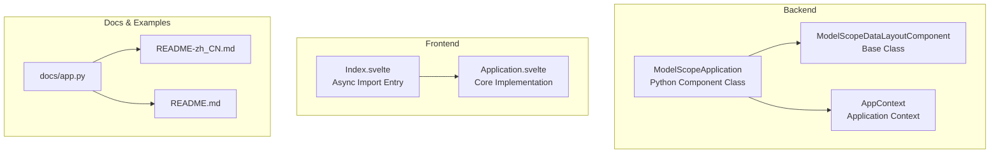
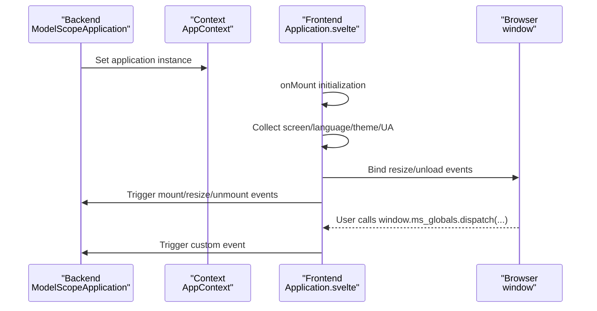
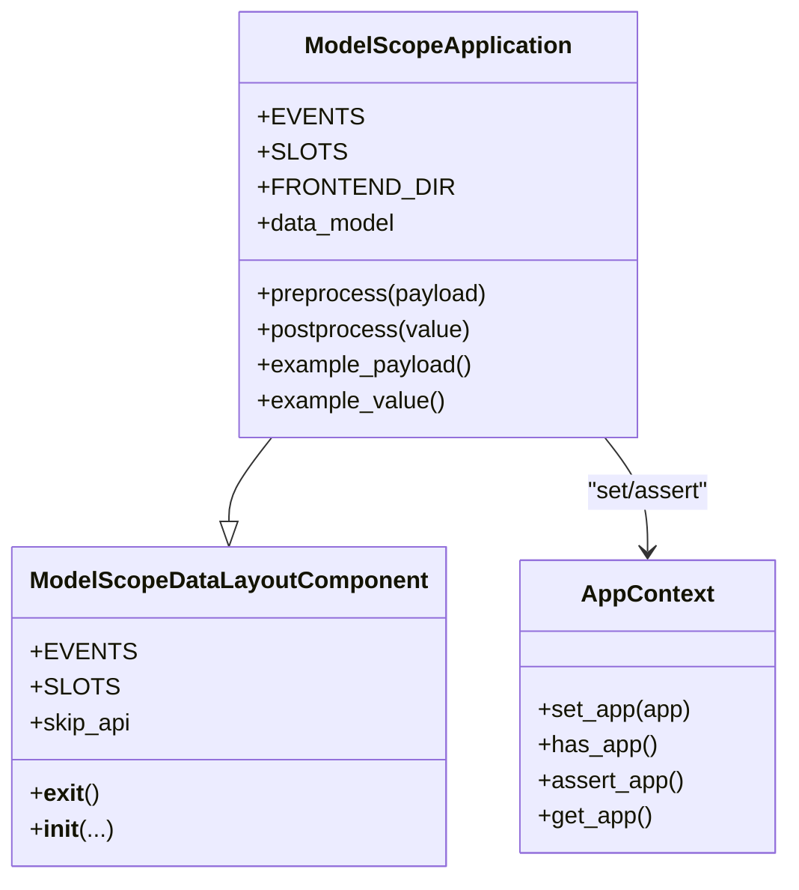
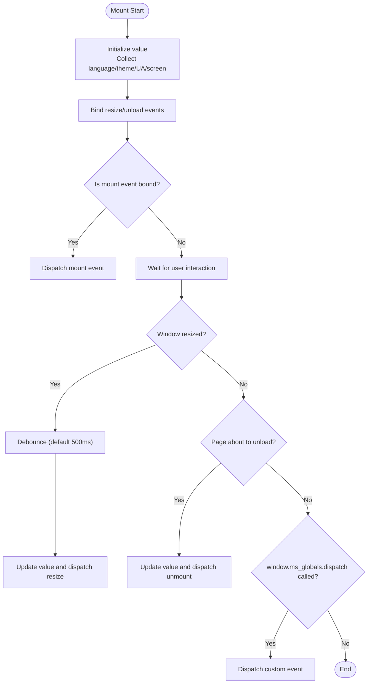
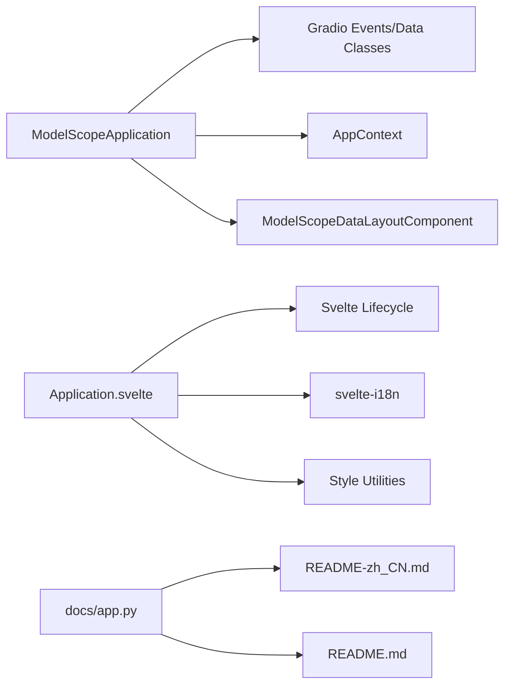

# Application Component

<cite>
**Files Referenced in This Document**
- [backend/modelscope_studio/components/base/application/__init__.py](file://backend/modelscope_studio/components/base/application/__init__.py)
- [frontend/base/application/Application.svelte](file://frontend/base/application/Application.svelte)
- [frontend/base/application/Index.svelte](file://frontend/base/application/Index.svelte)
- [backend/modelscope_studio/utils/dev/app_context.py](file://backend/modelscope_studio/utils/dev/app_context.py)
- [backend/modelscope_studio/utils/dev/component.py](file://backend/modelscope_studio/utils/dev/component.py)
- [docs/components/base/application/README-zh_CN.md](file://docs/components/base/application/README-zh_CN.md)
- [docs/components/base/application/README.md](file://docs/components/base/application/README.md)
- [docs/app.py](file://docs/app.py)
- [backend/modelscope_studio/version.py](file://backend/modelscope_studio/version.py)
</cite>

## Table of Contents

1. [Introduction](#introduction)
2. [Project Structure](#project-structure)
3. [Core Components](#core-components)
4. [Architecture Overview](#architecture-overview)
5. [Detailed Component Analysis](#detailed-component-analysis)
6. [Dependency Analysis](#dependency-analysis)
7. [Performance Considerations](#performance-considerations)
8. [Troubleshooting Guide](#troubleshooting-guide)
9. [Conclusion](#conclusion)
10. [Appendix](#appendix)

## Introduction

The Application component is the application root container for modelscope-studio, responsible for hosting and uniformly managing all components and dependencies exported from `modelscope_studio`. It not only provides the fundamental runtime environment for applications, but also helps developers implement page behavior monitoring, theme and language adaptation, and custom event bridging through lifecycle event and browser environment data collection capabilities.

- As an application root container: Ensures all `modelscope_studio` components are properly wrapped; otherwise the page may fail to preview.
- Lifecycle and environment awareness: Provides events for page mount, window resize, page unload, etc.; can retrieve language, theme, UA, screen size, and scroll position.
- Custom event bridging: Trigger custom events on the frontend via `window.ms_globals.dispatch`; Python side can receive them through the `ms.Application.custom` event.

Section Sources

- [docs/components/base/application/README-zh_CN.md:1-11](file://docs/components/base/application/README-zh_CN.md#L1-L11)
- [docs/components/base/application/README.md:1-11](file://docs/components/base/application/README.md#L1-L11)

## Project Structure

The Application component consists of a backend Python component class and a frontend Svelte implementation, with tool modules providing context and base class support. Documentation and examples are located in the docs directory for demonstration and explanation.



Diagram Sources

- [backend/modelscope_studio/components/base/application/**init**.py:26-115](file://backend/modelscope_studio/components/base/application/__init__.py#L26-L115)
- [frontend/base/application/Index.svelte:1-17](file://frontend/base/application/Index.svelte#L1-L17)
- [frontend/base/application/Application.svelte:1-149](file://frontend/base/application/Application.svelte#L1-L149)
- [backend/modelscope_studio/utils/dev/app_context.py:4-25](file://backend/modelscope_studio/utils/dev/app_context.py#L4-L25)
- [backend/modelscope_studio/utils/dev/component.py:101-169](file://backend/modelscope_studio/utils/dev/component.py#L101-L169)
- [docs/components/base/application/README-zh_CN.md:1-56](file://docs/components/base/application/README-zh_CN.md#L1-L56)
- [docs/components/base/application/README.md:1-56](file://docs/components/base/application/README.md#L1-L56)
- [docs/app.py:1-595](file://docs/app.py#L1-L595)

Section Sources

- [backend/modelscope_studio/components/base/application/**init**.py:26-115](file://backend/modelscope_studio/components/base/application/__init__.py#L26-L115)
- [frontend/base/application/Index.svelte:1-17](file://frontend/base/application/Index.svelte#L1-L17)
- [frontend/base/application/Application.svelte:1-149](file://frontend/base/application/Application.svelte#L1-L149)
- [backend/modelscope_studio/utils/dev/app_context.py:4-25](file://backend/modelscope_studio/utils/dev/app_context.py#L4-L25)
- [backend/modelscope_studio/utils/dev/component.py:101-169](file://backend/modelscope_studio/utils/dev/component.py#L101-L169)
- [docs/components/base/application/README-zh_CN.md:1-56](file://docs/components/base/application/README-zh_CN.md#L1-L56)
- [docs/components/base/application/README.md:1-56](file://docs/components/base/application/README.md#L1-L56)
- [docs/app.py:1-595](file://docs/app.py#L1-L595)

## Core Components

- Backend component class: `ModelScopeApplication` inherits from `ModelScopeDataLayoutComponent`, providing event registration, data model, example data, and frontend directory resolution capabilities.
- Frontend implementation: `Application.svelte` initializes page data on mount, binds resize/unload events, and exposes `window.ms_globals.dispatch` for custom event bridging.
- Context and base class: `AppContext` provides application instance setting and assertion; `ModelScopeDataLayoutComponent` provides layout context and internal state management.

Section Sources

- [backend/modelscope_studio/components/base/application/**init**.py:26-115](file://backend/modelscope_studio/components/base/application/__init__.py#L26-L115)
- [frontend/base/application/Application.svelte:1-149](file://frontend/base/application/Application.svelte#L1-L149)
- [backend/modelscope_studio/utils/dev/app_context.py:4-25](file://backend/modelscope_studio/utils/dev/app_context.py#L4-L25)
- [backend/modelscope_studio/utils/dev/component.py:101-169](file://backend/modelscope_studio/utils/dev/component.py#L101-L169)

## Architecture Overview

The Application component's runtime flow is as follows: the backend component class records the application instance during initialization; the frontend collects environment data and binds events during the mount phase; a custom event bridging channel is also provided.



Diagram Sources

- [backend/modelscope_studio/components/base/application/**init**.py:72-82](file://backend/modelscope_studio/components/base/application/__init__.py#L72-L82)
- [frontend/base/application/Application.svelte:87-129](file://frontend/base/application/Application.svelte#L87-L129)

Section Sources

- [backend/modelscope_studio/components/base/application/**init**.py:72-82](file://backend/modelscope_studio/components/base/application/__init__.py#L72-L82)
- [frontend/base/application/Application.svelte:87-129](file://frontend/base/application/Application.svelte#L87-L129)

## Detailed Component Analysis

### Backend Component Class: ModelScopeApplication

- Design philosophy
  - As the application root container, uniformly injects the application context, ensuring all subsequent components depend on an existing Application instance.
  - Registers `mount`/`resized`/`unmount`/`custom` event listeners through the Gradio event system, enabling frontend-backend coordination.
  - Uses `ApplicationPageData` as the data model, carrying screen, language, theme, UA, and other environment information.
- Key features
  - Event registration: EVENTS defines four event listeners corresponding to page lifecycle and custom events.
  - Data model: `data_model` points to `ApplicationPageData`; example data `example_payload`/`example_value` provides defaults.
  - Frontend directory: `FRONTEND_DIR` is resolved to the `base/application` frontend implementation via `resolve_frontend_dir`.
- Lifecycle and context
  - Sets `AppContext` in `__init__`, then calls the parent constructor, ensuring context is available when the component tree is being built.
  - `preprocess`/`postprocess` pass data through unchanged, allowing the frontend to consume directly.



Diagram Sources

- [backend/modelscope_studio/components/base/application/**init**.py:26-115](file://backend/modelscope_studio/components/base/application/__init__.py#L26-L115)
- [backend/modelscope_studio/utils/dev/component.py:101-169](file://backend/modelscope_studio/utils/dev/component.py#L101-L169)
- [backend/modelscope_studio/utils/dev/app_context.py:4-25](file://backend/modelscope_studio/utils/dev/app_context.py#L4-L25)

Section Sources

- [backend/modelscope_studio/components/base/application/**init**.py:26-115](file://backend/modelscope_studio/components/base/application/__init__.py#L26-L115)
- [backend/modelscope_studio/utils/dev/component.py:101-169](file://backend/modelscope_studio/utils/dev/component.py#L101-L169)
- [backend/modelscope_studio/utils/dev/app_context.py:4-25](file://backend/modelscope_studio/utils/dev/app_context.py#L4-L25)

### Frontend Implementation: Application.svelte

- Key highlights
  - onMount initialization: Updates value and dispatches mount event; then binds resize and beforeunload events.
  - resize event: Uses debounce (default 500ms) to update value and dispatch resize event, avoiding high-frequency repaints.
  - beforeunload: Updates value and dispatches unmount event before the page unloads.
  - Custom event: `window.ms_globals.dispatch(...)` forwards the argument array as a custom event.
  - Visibility and styles: Controls rendering based on `visible`; `elem_id`/`elem_classes`/`elem_style` support external style injection.
- Data model
  - `ApplicationPageData` contains `language`, `userAgent`, `theme`, `screen` (width/height/scrollX/scrollY).
- Event model
  - Four event types: `mount`/`resized`/`unmount`/`custom`, corresponding to page lifecycle and custom events.



Diagram Sources

- [frontend/base/application/Application.svelte:87-129](file://frontend/base/application/Application.svelte#L87-L129)

Section Sources

- [frontend/base/application/Application.svelte:1-149](file://frontend/base/application/Application.svelte#L1-L149)

### Entry Wrapper: Index.svelte

- Purpose: Asynchronously imports `Application.svelte` to delay component loading and reduce initial screen burden.
- Rendering: Passes `children` through to the Application component, ensuring content rendering.

Section Sources

- [frontend/base/application/Index.svelte:1-17](file://frontend/base/application/Index.svelte#L1-L17)

### Context and Base Class Support

- AppContext
  - `set_app`: Sets the current application instance during backend initialization.
  - `assert_app`: Issues a warning if not set, prompting that Application was not imported.
  - `get_app`: Gets the current application instance.
- ModelScopeDataLayoutComponent
  - Provides layout context and internal state (`_internal`), ensuring the component tree structure is correct.
  - Inherits the Gradio component metaclass, supporting events and data flow.

Section Sources

- [backend/modelscope_studio/utils/dev/app_context.py:4-25](file://backend/modelscope_studio/utils/dev/app_context.py#L4-L25)
- [backend/modelscope_studio/utils/dev/component.py:101-169](file://backend/modelscope_studio/utils/dev/component.py#L101-L169)

### Usage Examples and Scenarios

- Basic usage: Wrap all `modelscope_studio` components inside Application to ensure preview and interaction work correctly.
- Language adaptation: Get the user's language via `value.language`, dynamically switching text or formatting.
- Theme adaptation: Return content or styles with different weights based on `value.theme`.
- Custom events: Call `window.ms_globals.dispatch(...)` in any JS logic; receive on the Python side via `ms.Application.custom`.

**Python Code Examples**

```python
import gradio as gr
import modelscope_studio.components.base as ms
import modelscope_studio.components.antd as antd

# Example 1: Basic wrapping usage
with gr.Blocks() as demo:
    with ms.Application():
        with antd.ConfigProvider():
            with ms.AutoLoading():
                antd.Button("Hello ModelScope Studio")

demo.launch()
```

```python
import gradio as gr
import modelscope_studio.components.base as ms
import modelscope_studio.components.antd as antd

# Example 2: Listen to page mount event and adapt language/theme
with gr.Blocks() as demo:
    with ms.Application() as app:
        with antd.ConfigProvider():
            output = gr.Textbox(label="Page Info")

    @app.mount
    def on_mount(data: ms.ApplicationData):
        # Get user language and theme
        lang = data.value.language
        theme = data.value.theme
        return gr.update(value=f"Language: {lang}, Theme: {theme}")

demo.launch()
```

```python
import gradio as gr
import modelscope_studio.components.base as ms
import modelscope_studio.components.antd as antd

# Example 3: Listen to custom events (combined with window.ms_globals.dispatch)
with gr.Blocks() as demo:
    with ms.Application() as app:
        with antd.ConfigProvider():
            output = gr.Textbox(label="Custom Event")
            # Frontend can trigger via window.ms_globals.dispatch({type: 'my_event', payload: {...}})

    @app.custom
    def on_custom(data: ms.ApplicationData):
        event_type = data.value.type if data.value else None
        return gr.update(value=f"Received custom event: {event_type}")

demo.launch()
```

Section Sources

- [docs/components/base/application/README-zh_CN.md:12-20](file://docs/components/base/application/README-zh_CN.md#L12-L20)
- [docs/components/base/application/README.md:12-20](file://docs/components/base/application/README.md#L12-L20)

### API and Type Descriptions

- Properties
  - value: `ApplicationPageData`, page data.
- Events
  - mount: Triggered when the page mounts.
  - resize: Triggered when the window size changes.
  - unmount: Triggered when the page unloads.
  - custom: Triggered via `window.ms_globals.dispatch(...)`.
- Types
  - `ApplicationPageScreenData`: width, height, scrollX, scrollY.
  - `ApplicationPageData`: screen, language, theme, userAgent.

Section Sources

- [docs/components/base/application/README-zh_CN.md:24-55](file://docs/components/base/application/README-zh_CN.md#L24-L55)
- [docs/components/base/application/README.md:24-55](file://docs/components/base/application/README.md#L24-L55)
- [backend/modelscope_studio/components/base/application/**init**.py:12-115](file://backend/modelscope_studio/components/base/application/__init__.py#L12-L115)

## Dependency Analysis

- Backend dependencies
  - Gradio data classes and event system: Used for event listener registration and data models.
  - Utility modules: `AppContext`, `ModelScopeDataLayoutComponent` provide context and base class capabilities.
- Frontend dependencies
  - Svelte lifecycle hooks: `onMount`/`onDestroy`.
  - `svelte-i18n`: Gets localized language.
  - Style utilities: `styleObject2String`, `classnames`.
- Documentation and examples
  - `docs/app.py` builds the site menu and documentation index, locating the Application component documentation.



Diagram Sources

- [backend/modelscope_studio/components/base/application/**init**.py:5-9](file://backend/modelscope_studio/components/base/application/__init__.py#L5-L9)
- [frontend/base/application/Application.svelte:1-149](file://frontend/base/application/Application.svelte#L1-L149)
- [docs/app.py:1-595](file://docs/app.py#L1-L595)

Section Sources

- [backend/modelscope_studio/components/base/application/**init**.py:5-9](file://backend/modelscope_studio/components/base/application/__init__.py#L5-L9)
- [frontend/base/application/Application.svelte:1-149](file://frontend/base/application/Application.svelte#L1-L149)
- [docs/app.py:1-595](file://docs/app.py#L1-L595)

## Performance Considerations

- Debounce strategy: The resize event uses 500ms debounce by default, reducing the risk of frequent reflows and event storms.
- Lazy loading: `Index.svelte` uses async imports, reducing initial screen resource pressure.
- Event binding: Dispatches events only when needed (`bind_*_event` or `attached_events` contains the corresponding event name), avoiding unnecessary event dispatches.
- Style and visibility: Controls rendering through `visible`; `elem_style` supports both string and object forms for flexible injection on demand.

Section Sources

- [frontend/base/application/Application.svelte:96-103](file://frontend/base/application/Application.svelte#L96-L103)
- [frontend/base/application/Index.svelte:5-7](file://frontend/base/application/Index.svelte#L5-L7)

## Troubleshooting Guide

- Page cannot preview
  - Symptom: Components cannot render normally because Application is not wrapped.
  - Resolution: Ensure all `modelscope_studio` components are wrapped by Application.
- Application instance not detected
  - Symptom: Console warning appears, indicating Application component not found.
  - Resolution: Check if Application is correctly imported and initialized from `modelscope_studio.components.base`.
- Events not triggering
  - Symptom: `resize`/`mount`/`unmount`/`custom` events not triggering as expected.
  - Resolution: Confirm the frontend has bound the corresponding event (`bind_*_event` or `attached_events` contains the event name); custom events must be triggered via `window.ms_globals.dispatch(...)`.
- Language/theme not taking effect
  - Symptom: Language or theme not changing according to user environment.
  - Resolution: Ensure the frontend correctly reads `navigator` and shared theme; if necessary, handle branching on the Python side based on `value.language`/`value.theme`.

Section Sources

- [docs/components/base/application/README-zh_CN.md:3-11](file://docs/components/base/application/README-zh_CN.md#L3-L11)
- [docs/components/base/application/README.md:3-11](file://docs/components/base/application/README.md#L3-L11)
- [backend/modelscope_studio/utils/dev/app_context.py:16-21](file://backend/modelscope_studio/utils/dev/app_context.py#L16-L21)
- [frontend/base/application/Application.svelte:91-115](file://frontend/base/application/Application.svelte#L91-L115)

## Conclusion

The Application component, as the application root container for modelscope-studio, bears the key responsibilities of context injection, lifecycle events, and environment data collection. Through the collaboration of the backend component class and frontend implementation, it provides a stable fundamental runtime environment for the entire application and supports flexible theme/language adaptation and custom event bridging. Following the best practices and troubleshooting recommendations in this document can effectively improve development efficiency and runtime stability.

## Appendix

- Version information: v2.0.0
- Related documentation: English and Chinese documentation for the Application component, including examples and API descriptions.

Section Sources

- [backend/modelscope_studio/version.py:1-2](file://backend/modelscope_studio/version.py#L1-L2)
- [docs/components/base/application/README-zh_CN.md:1-56](file://docs/components/base/application/README-zh_CN.md#L1-L56)
- [docs/components/base/application/README.md:1-56](file://docs/components/base/application/README.md#L1-L56)
