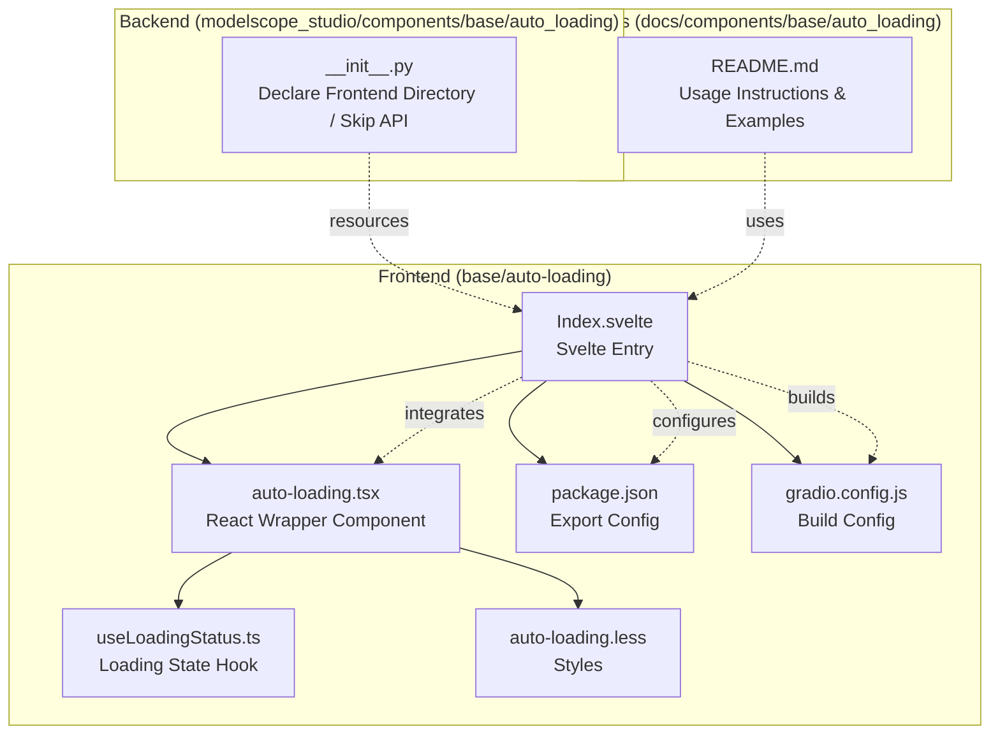
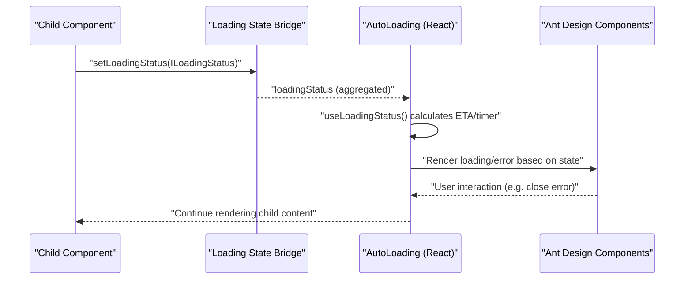
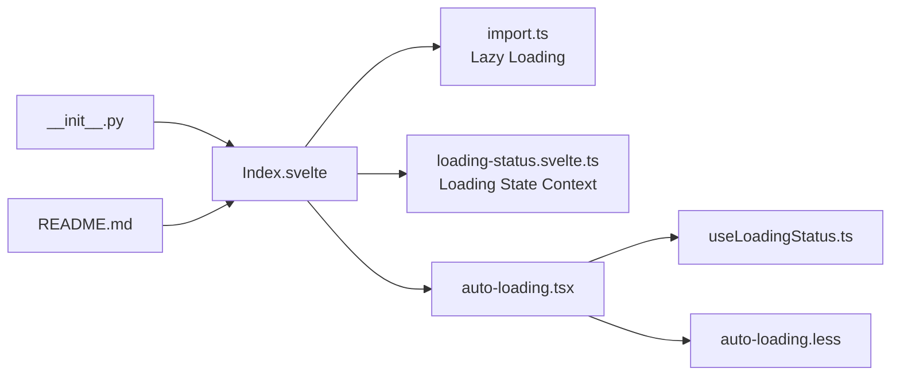

# AutoLoading Component

<cite>
**Files Referenced in This Document**
- [auto-loading.tsx](file://frontend/base/auto-loading/auto-loading.tsx)
- [Index.svelte](file://frontend/base/auto-loading/Index.svelte)
- [useLoadingStatus.ts](file://frontend/base/auto-loading/useLoadingStatus.ts)
- [auto-loading.less](file://frontend/base/auto-loading/auto-loading.less)
- [package.json](file://frontend/base/auto-loading/package.json)
- [gradio.config.js](file://frontend/base/auto-loading/gradio.config.js)
- [__init__.py](file://backend/modelscope_studio/components/base/auto_loading/__init__.py)
- [loading-status.svelte.ts](file://frontend/svelte-preprocess-react/svelte-contexts/loading-status.svelte.ts)
- [import.ts](file://frontend/svelte-preprocess-react/component/import.ts)
- [README.md](file://docs/components/base/auto_loading/README.md)
</cite>

## Table of Contents

1. [Introduction](#introduction)
2. [Project Structure](#project-structure)
3. [Core Components](#core-components)
4. [Architecture Overview](#architecture-overview)
5. [Detailed Component Analysis](#detailed-component-analysis)
6. [Dependency Analysis](#dependency-analysis)
7. [Performance Considerations](#performance-considerations)
8. [Troubleshooting Guide](#troubleshooting-guide)
9. [Conclusion](#conclusion)
10. [Appendix](#appendix)

## Introduction

The AutoLoading component automatically adds loading feedback and error notifications to wrapped content when the Gradio frontend makes requests to the backend. It automatically collects the loading states of child components and displays loading animations or error information at the appropriate time, enhancing user experience. The component supports custom rendering slots, mask layers, timer display, and various configuration options, suitable for global fallback and fine-grained local control.

## Project Structure

AutoLoading's frontend implementation is located in the base component directory and includes a Svelte entry, React wrapper component, state hook, and style file; the backend Python component is responsible for declaring the frontend resource path and skipping API calls. The documentation provides component descriptions and example entries.

**Diagram Sources**

- [Index.svelte:1-81](file://frontend/base/auto-loading/Index.svelte#L1-L81)
- [auto-loading.tsx:1-179](file://frontend/base/auto-loading/auto-loading.tsx#L1-L179)
- [useLoadingStatus.ts:1-94](file://frontend/base/auto-loading/useLoadingStatus.ts#L1-L94)
- [auto-loading.less:1-28](file://frontend/base/auto-loading/auto-loading.less#L1-L28)
- [package.json:1-15](file://frontend/base/auto-loading/package.json#L1-L15)
- [gradio.config.js:1-4](file://frontend/base/auto-loading/gradio.config.js#L1-L4)
- [**init**.py:47-64](file://backend/modelscope_studio/components/base/auto_loading/__init__.py#L47-L64)
- [README.md:1-36](file://docs/components/base/auto_loading/README.md#L1-L36)

**Section Sources**

- [Index.svelte:1-81](file://frontend/base/auto-loading/Index.svelte#L1-L81)
- [auto-loading.tsx:1-179](file://frontend/base/auto-loading/auto-loading.tsx#L1-L179)
- [useLoadingStatus.ts:1-94](file://frontend/base/auto-loading/useLoadingStatus.ts#L1-L94)
- [auto-loading.less:1-28](file://frontend/base/auto-loading/auto-loading.less#L1-L28)
- [package.json:1-15](file://frontend/base/auto-loading/package.json#L1-L15)
- [gradio.config.js:1-4](file://frontend/base/auto-loading/gradio.config.js#L1-L4)
- [**init**.py:47-64](file://backend/modelscope_studio/components/base/auto_loading/__init__.py#L47-L64)
- [README.md:1-36](file://docs/components/base/auto_loading/README.md#L1-L36)

## Core Components

- Svelte entry (Index.svelte): Parses properties, gets configuration type and slots, injects loading state context, and renders the React wrapper component on demand.
- React wrapper component (auto-loading.tsx): Decides whether to show loading animation, mask, timer, and queue information based on loading state; displays closable error notifications in error state.
- Loading state hook (useLoadingStatus.ts): Maintains timer, ETA, and formatted time, deriving display data based on `ILoadingStatus`.
- Styles (auto-loading.less): Controls loading layer positioning, mask z-index, and error popup centering styles.
- Backend component (**init**.py): Declares the frontend directory, skips API calls, enabling direct use via frontend resource exports.
- Documentation (README.md): Explains the component's role, state meanings, default behavior, and example entry.

**Section Sources**

- [Index.svelte:1-81](file://frontend/base/auto-loading/Index.svelte#L1-L81)
- [auto-loading.tsx:25-176](file://frontend/base/auto-loading/auto-loading.tsx#L25-L176)
- [useLoadingStatus.ts:5-93](file://frontend/base/auto-loading/useLoadingStatus.ts#L5-L93)
- [auto-loading.less:1-28](file://frontend/base/auto-loading/auto-loading.less#L1-L28)
- [**init**.py:47-64](file://backend/modelscope_studio/components/base/auto_loading/__init__.py#L47-L64)
- [README.md:1-36](file://docs/components/base/auto_loading/README.md#L1-L36)

## Architecture Overview

AutoLoading's workflow revolves around "state collection — conditional rendering — UI display". The Svelte entry collects `ILoadingStatus` from child components via context; the React component selects loading animations or error notifications based on state and presents them via Ant Design components.

**Diagram Sources**

- [loading-status.svelte.ts:47-75](file://frontend/svelte-preprocess-react/svelte-contexts/loading-status.svelte.ts#L47-L75)
- [auto-loading.tsx:48-175](file://frontend/base/auto-loading/auto-loading.tsx#L48-L175)
- [useLoadingStatus.ts:17-81](file://frontend/base/auto-loading/useLoadingStatus.ts#L17-L81)

## Detailed Component Analysis

### Svelte Entry (Index.svelte)

- Retrieves component properties, configuration type, and slots from the preprocessing context.
- Injects the generated `loadingStatus` context via `getLoadingStatus`, for consumption by the internal React component.
- Uses `importComponent` for lazy loading, ensuring the component loads only after global initialization is complete.
- Passes visibility, styles, class names, and other properties to the React wrapper component.

Key points

- On-demand rendering: Renders only when `visible` is true.
- Slots and configuration: `slots`, `configType`, `loadingStatus` passed as props.
- Key generation: Assigns a unique key to each loading state via `window.ms_globals.loadingKey`.

**Section Sources**

- [Index.svelte:1-81](file://frontend/base/auto-loading/Index.svelte#L1-L81)
- [import.ts:1-20](file://frontend/svelte-preprocess-react/component/import.ts#L1-L20)
- [loading-status.svelte.ts:47-75](file://frontend/svelte-preprocess-react/svelte-contexts/loading-status.svelte.ts#L47-L75)

### React Wrapper Component (auto-loading.tsx)

Responsibilities

- Parses configuration type (currently supports `antd`), determining loading animation and error notification UI.
- Renders loading animation based on state (including mask, timer, progress/queue information).
- In error state, renders a closable error notification, clearing the internal instance after closing to avoid duplicate rendering.
- Supports custom slots: `render` (custom loading content), `errorRender` (custom error content), `loadingText` (custom loading text).

Loading State Determination

- `pending`/`generating` treated as loading; `completed`/`error` treated as ended.
- Dynamically displays progress and queue information when `progress` or `queue_position`/`queue_size` is present.
- Optional timer and ETA display.

Style and Z-Index

- Loading layer is absolutely positioned and covers the parent container; error notification is fixed and centered.
- Sets z-index based on theme token, ensuring mask and error notification layers are properly ordered.

**Section Sources**

- [auto-loading.tsx:25-176](file://frontend/base/auto-loading/auto-loading.tsx#L25-L176)
- [auto-loading.less:1-28](file://frontend/base/auto-loading/auto-loading.less#L1-L28)

### Loading State Hook (useLoadingStatus.ts)

Functionality

- Maintains timer: Starts timing in `pending` state, stops in non-`pending` state.
- Calculates ETA and formats time: Combines `performance.now` and ETA field to calculate remaining time and elapsed time.
- Tracks old ETA: Records the old value when ETA updates and formats the new ETA.
- Returns state fields: `status`, `message`, `progress`, `queuePosition`, `queueSize`, `formattedEta`, `formattedTimer`.

Performance Notes

- Uses `requestAnimationFrame` loop to update timing, avoiding blocking the main thread.
- Uses `useMemoizedFn` to cache callbacks, reducing re-renders.

**Section Sources**

- [useLoadingStatus.ts:5-93](file://frontend/base/auto-loading/useLoadingStatus.ts#L5-L93)

### Styles (auto-loading.less)

Key points

- Loading layer is absolutely positioned, covering the parent container, ensuring mask effect.
- Error notification is fixed-positioned and centered, avoiding layout jitter.
- Controls z-index and appearance via Ant Design class names and theme token.

**Section Sources**

- [auto-loading.less:1-28](file://frontend/base/auto-loading/auto-loading.less#L1-L28)

### Backend Component (**init**.py)

Key points

- Declares frontend directory as `base/auto-loading`.
- Skips API calls; component is used only for frontend rendering and state collection.

**Section Sources**

- [**init**.py:47-64](file://backend/modelscope_studio/components/base/auto_loading/__init__.py#L47-L64)

### Documentation (README.md)

Key points

- Component role: Automatically adds loading animations and error notifications to wrapped content.
- State descriptions: Four states — `pending`/`generating`/`completed`/`error`.
- Default behavior: `pending` starts loading; `generating`/`completed` ends; `error` ends loading (optionally shows error).
- API parameters: `generating`, `show_error`, `show_mask`, `show_timer`, `loading_text`, etc.

**Section Sources**

- [README.md:1-36](file://docs/components/base/auto_loading/README.md#L1-L36)

## Dependency Analysis

AutoLoading's dependencies are mainly reflected in the following aspects:

- The Svelte entry depends on loading state context and import utilities, implementing lazy loading and state aggregation.
- The React component depends on Ant Design's Spin and Alert, and the theme token.
- `useLoadingStatus` depends on browser performance API and React hooks, implementing timing and state formatting.
- The backend component declares the frontend resource path, enabling the frontend component to load correctly through package exports.

**Diagram Sources**

- [Index.svelte:1-81](file://frontend/base/auto-loading/Index.svelte#L1-L81)
- [import.ts:1-20](file://frontend/svelte-preprocess-react/component/import.ts#L1-L20)
- [loading-status.svelte.ts:1-75](file://frontend/svelte-preprocess-react/svelte-contexts/loading-status.svelte.ts#L1-L75)
- [auto-loading.tsx:1-179](file://frontend/base/auto-loading/auto-loading.tsx#L1-L179)
- [useLoadingStatus.ts:1-94](file://frontend/base/auto-loading/useLoadingStatus.ts#L1-L94)
- [auto-loading.less:1-28](file://frontend/base/auto-loading/auto-loading.less#L1-L28)
- [**init**.py:47-64](file://backend/modelscope_studio/components/base/auto_loading/__init__.py#L47-L64)
- [README.md:1-36](file://docs/components/base/auto_loading/README.md#L1-L36)

**Section Sources**

- [Index.svelte:1-81](file://frontend/base/auto-loading/Index.svelte#L1-L81)
- [auto-loading.tsx:1-179](file://frontend/base/auto-loading/auto-loading.tsx#L1-L179)
- [useLoadingStatus.ts:1-94](file://frontend/base/auto-loading/useLoadingStatus.ts#L1-L94)
- [auto-loading.less:1-28](file://frontend/base/auto-loading/auto-loading.less#L1-L28)
- [**init**.py:47-64](file://backend/modelscope_studio/components/base/auto_loading/__init__.py#L47-L64)
- [README.md:1-36](file://docs/components/base/auto_loading/README.md#L1-L36)

## Performance Considerations

- Deferred initialization: Using `importComponent` and the global initialization Promise avoids loading the component before it's ready, reducing initial screen pressure.
- Timer optimization: Uses `requestAnimationFrame` loop to update timing, reducing main thread usage; only starts timing in `pending` state.
- State aggregation: Only the innermost AutoLoading collects child component states, avoiding duplicate rendering and state conflicts.
- Style z-index: Ensures mask and error notifications don't cause layout reflows through z-index and absolute positioning.
- Custom rendering: Through `render` and `errorRender` slots, business teams can optimize loading and error UI themselves, reducing unnecessary component overhead.

[This section is general performance recommendations; no "Section Sources" needed]

## Troubleshooting Guide

Common Issues and Solutions

- Multiple nested AutoLoading: According to the documentation, only the innermost layer can collect child component states and display loading animations. If outer layers don't work, check the nesting level.
- Error notification not disappearing: The error notification is a closable component; the internal instance is cleared after closing. If still displayed, check if the close logic or styles are causing visual residue.
- Loading animation not appearing: Confirm whether `loadingStatus` enters `pending`/`generating` state; check if `generating`/`show_error` configuration meets expectations.
- Timer not updating: Timing only starts in `pending` state; if there's no `pending` state for a long time, the timer won't start.
- Mask z-index anomalies: Styles control z-index via theme token; if custom styles override `z-index`, check style priority.

**Section Sources**

- [README.md:5-19](file://docs/components/base/auto_loading/README.md#L5-L19)
- [auto-loading.tsx:139-166](file://frontend/base/auto-loading/auto-loading.tsx#L139-L166)
- [useLoadingStatus.ts:44-50](file://frontend/base/auto-loading/useLoadingStatus.ts#L44-L50)

## Conclusion

AutoLoading provides unified and customizable loading and error feedback capabilities for Gradio applications through the "state collection — conditional rendering — UI display" mechanism. Its deferred initialization and timer optimization help improve performance and experience; slots and configuration options meet diverse business needs. Combined with documentation and examples, it can be used flexibly in both global and local scenarios.

[This section is summary content; no "Section Sources" needed]

## Appendix

### API Definitions (Parameters and Behavior)

- generating: Whether to include `generating` state handling.
- show_error: Whether to display error information.
- show_mask: Whether to display the mask.
- show_timer: Whether to display the timer.
- loading_text: Custom loading text; when empty, uses the default text provided by Gradio (including elapsed time, queue position, etc.).

Default Behavior

- pending: Show loading animation.
- generating/completed: End loading animation.
- error: End loading animation; optionally show error information.

**Section Sources**

- [README.md:27-36](file://docs/components/base/auto_loading/README.md#L27-L36)
- [auto-loading.tsx:65-138](file://frontend/base/auto-loading/auto-loading.tsx#L65-L138)

### Usage Examples (Scenarios and Recommendations)

- Global fallback: Place one AutoLoading at the application root to ensure any request gets loading feedback.
- Fine-grained local control: Use separately in areas that need richer loading information, with custom display via `render` and `loadingText` slots.
- Error visibility: Control error information display via `show_error`; use `errorRender` to customize error UI when necessary.
- Queue and progress: When the backend uses `yield` for streaming returns, use `progress` and queue information to enhance user perception.

**Section Sources**

- [README.md:21-25](file://docs/components/base/auto_loading/README.md#L21-L25)
- [auto-loading.tsx:72-138](file://frontend/base/auto-loading/auto-loading.tsx#L72-L138)

### Collaboration Patterns with Other Components

- Collaboration with forms/lists: Using AutoLoading inside these components provides consistent loading and error feedback.
- Collaboration with the theme system: Controls mask and error notification z-index and appearance via Ant Design theme token.
- Collaboration with state context: Through the loading state context, states from multiple child components are aggregated; the nearest AutoLoading decides what to display.

**Section Sources**

- [Index.svelte:56-62](file://frontend/base/auto-loading/Index.svelte#L56-L62)
- [loading-status.svelte.ts:47-75](file://frontend/svelte-preprocess-react/svelte-contexts/loading-status.svelte.ts#L47-L75)
- [auto-loading.tsx:68-134](file://frontend/base/auto-loading/auto-loading.tsx#L68-L134)
