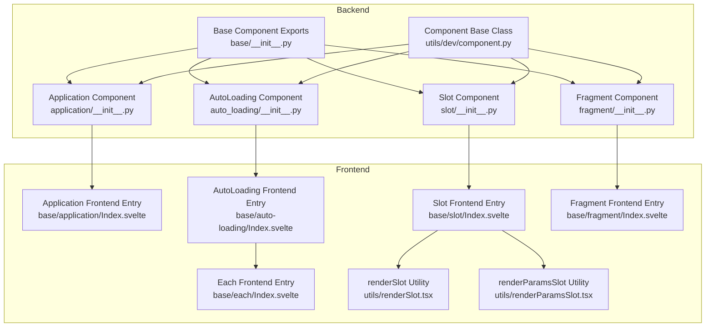
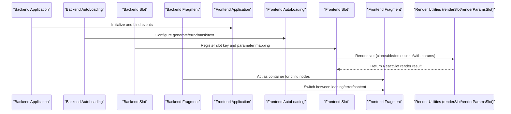
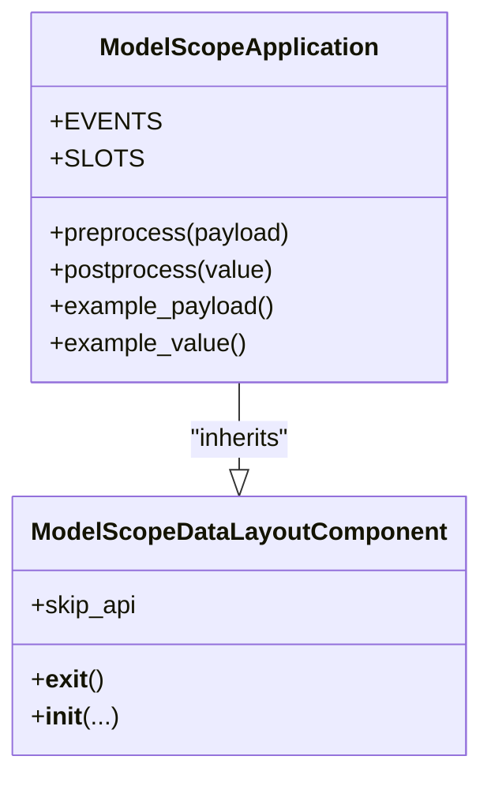
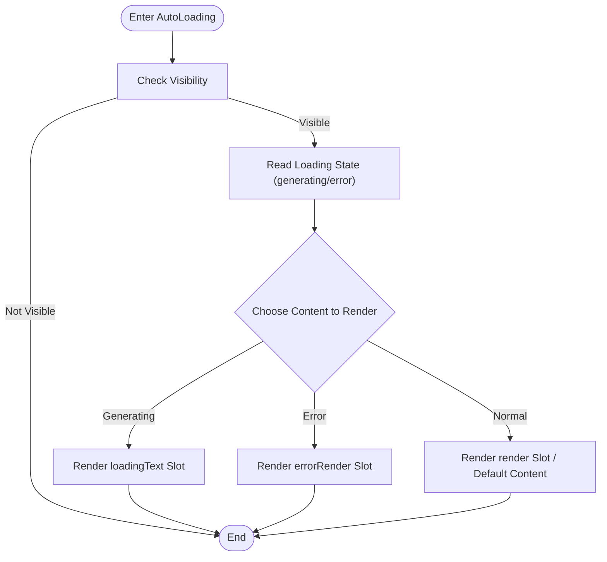
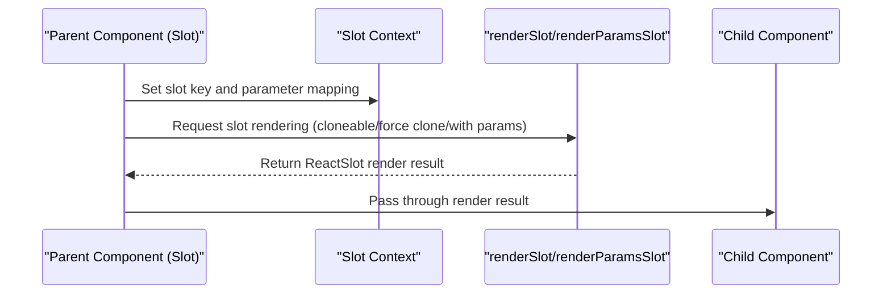
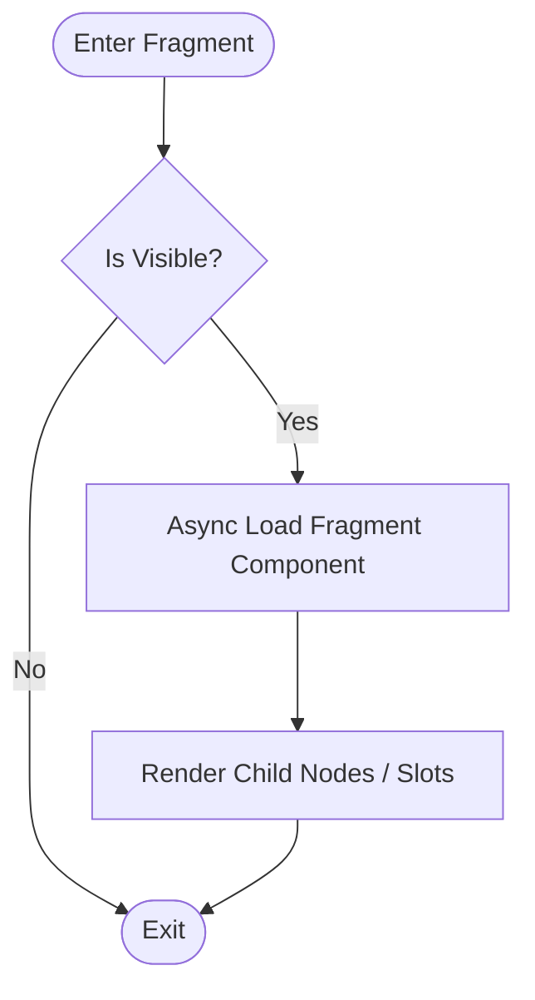
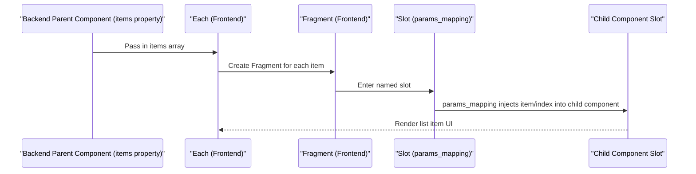
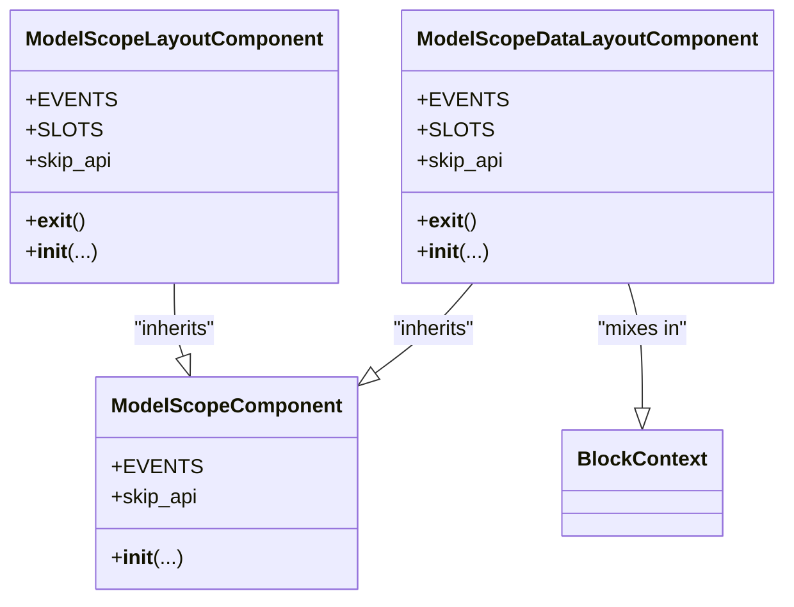
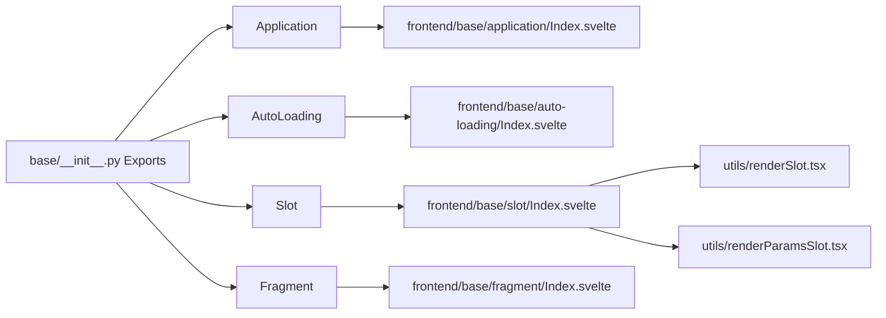

# Base Components

<cite>
**Files Referenced in This Document**
- [backend/modelscope_studio/components/base/application/__init__.py](file://backend/modelscope_studio/components/base/application/__init__.py)
- [backend/modelscope_studio/components/base/auto_loading/__init__.py](file://backend/modelscope_studio/components/base/auto_loading/__init__.py)
- [backend/modelscope_studio/components/base/slot/__init__.py](file://backend/modelscope_studio/components/base/slot/__init__.py)
- [backend/modelscope_studio/components/base/fragment/__init__.py](file://backend/modelscope_studio/components/base/fragment/__init__.py)
- [backend/modelscope_studio/components/base/__init__.py](file://backend/modelscope_studio/components/base/__init__.py)
- [backend/modelscope_studio/utils/dev/component.py](file://backend/modelscope_studio/utils/dev/component.py)
- [frontend/base/application/Index.svelte](file://frontend/base/application/Index.svelte)
- [frontend/base/auto-loading/Index.svelte](file://frontend/base/auto-loading/Index.svelte)
- [frontend/base/slot/Index.svelte](file://frontend/base/slot/Index.svelte)
- [frontend/base/fragment/Index.svelte](file://frontend/base/fragment/Index.svelte)
- [frontend/base/each/Index.svelte](file://frontend/base/each/Index.svelte)
- [frontend/utils/renderSlot.tsx](file://frontend/utils/renderSlot.tsx)
- [frontend/utils/renderParamsSlot.tsx](file://frontend/utils/renderParamsSlot.tsx)
</cite>

## Table of Contents

1. [Introduction](#introduction)
2. [Project Structure](#project-structure)
3. [Core Components](#core-components)
4. [Architecture Overview](#architecture-overview)
5. [Detailed Component Analysis](#detailed-component-analysis)
6. [Dependency Analysis](#dependency-analysis)
7. [Performance Considerations](#performance-considerations)
8. [Troubleshooting Guide](#troubleshooting-guide)
9. [Conclusion](#conclusion)
10. [Appendix](#appendix)

## Introduction

This document focuses on the "Base Components" system of ModelScope Studio, systematically explaining the design philosophy, data and control flow, role and collaboration within the overall component system, as well as providing usage examples, best practices, performance optimization suggestions, and solutions to common issues for core components such as Application, AutoLoading, Slot, and Fragment. The goal is to help developers quickly understand and correctly use these base components to build complex interfaces.

## Project Structure

The base components sit between the backend Python modules and the frontend Svelte implementations, bridged through a unified component base class and context mechanism. The backend is responsible for defining component classes, event and slot capabilities, data models, and lifecycle hooks; the frontend handles rendering, slot parsing, state management, and async loading.

**Diagram Sources**

- [backend/modelscope_studio/components/base/application/**init**.py:26-115](file://backend/modelscope_studio/components/base/application/__init__.py#L26-L115)
- [backend/modelscope_studio/components/base/auto_loading/**init**.py:8-65](file://backend/modelscope_studio/components/base/auto_loading/__init__.py#L8-L65)
- [backend/modelscope_studio/components/base/slot/**init**.py:8-50](file://backend/modelscope_studio/components/base/slot/__init__.py#L8-L50)
- [backend/modelscope_studio/components/base/fragment/**init**.py:8-49](file://backend/modelscope_studio/components/base/fragment/__init__.py#L8-L49)
- [backend/modelscope_studio/components/base/**init**.py:1-11](file://backend/modelscope_studio/components/base/__init__.py#L1-L11)
- [backend/modelscope_studio/utils/dev/component.py:11-169](file://backend/modelscope_studio/utils/dev/component.py#L11-L169)
- [frontend/base/application/Index.svelte:1-17](file://frontend/base/application/Index.svelte#L1-L17)
- [frontend/base/auto-loading/Index.svelte:1-81](file://frontend/base/auto-loading/Index.svelte#L1-L81)
- [frontend/base/slot/Index.svelte:1-68](file://frontend/base/slot/Index.svelte#L1-L68)
- [frontend/base/fragment/Index.svelte:1-50](file://frontend/base/fragment/Index.svelte#L1-L50)
- [frontend/base/each/Index.svelte:1-111](file://frontend/base/each/Index.svelte#L1-L111)
- [frontend/utils/renderSlot.tsx:1-29](file://frontend/utils/renderSlot.tsx#L1-L29)
- [frontend/utils/renderParamsSlot.tsx:1-51](file://frontend/utils/renderParamsSlot.tsx#L1-L51)

**Section Sources**

- [backend/modelscope_studio/components/base/**init**.py:1-11](file://backend/modelscope_studio/components/base/__init__.py#L1-L11)
- [backend/modelscope_studio/utils/dev/component.py:11-169](file://backend/modelscope_studio/utils/dev/component.py#L11-L169)

## Core Components

This section provides an overview of the roles, features, and usage of Application, AutoLoading, Slot, Fragment, and Each.

- Application (Application Container)
  - Role: Acts as the top-level layout container, handling page-level event bindings (custom events, mount, window resize, unmount) and providing page environment data (screen size, language, theme, UA).
  - Key points: Supports event listener registration; serves as the application context root node, ensuring all child components are created within a valid application context.
  - Typical usage: Placed at the application entry point, with other base or business components nested inside; event listeners handle browser lifecycle and interaction events.

- AutoLoading (Auto-Loading Placeholder)
  - Role: Automatically switches between loading state, error state, and content rendering based on generation state, error state, and mask/timer configurations; supports named slots (render, errorRender, loadingText) for flexible customization.
  - Key points: `skip_api` is marked true to avoid duplicate API calls; reads loading state from the frontend context and links to slot rendering.
  - Typical usage: Wraps content areas that need lazy loading or conditional rendering; dynamically set `generating`/`showError` based on business logic.

- Slot (Slot)
  - Role: Declares and registers named slots, supports parameter mapping functions, bridges DOM slots with React/JSX content; can be nested to form hierarchical slot keys.
  - Key points: Sets slot key and parameter mapping via context; at render time, utility functions clone and inject slot content into target elements.
  - Typical usage: Declare slots in parent components and render them on demand in child components; used for complex layouts and conditional rendering.

- Fragment (Fragment)
  - Role: Lightweight container that does not introduce additional DOM wrappers; only holds child nodes and slots; commonly used for conditional rendering, list item wrapping, etc.
  - Key points: `skip_api` is marked true; does not trigger extra rendering overhead; can be used with Each/Slot.
  - Typical usage: Used as list item containers in Each; wraps multiple child nodes in conditional branches without adding extra levels.

- Each (List Rendering)
  - Role: Provides bulk rendering capabilities for list or array data, mapping each element in the list with corresponding slots/Fragments for parameter mapping and rendering.
  - Key points: Frontend-only rendering component with no corresponding backend Python class; used with Fragment for list item rendering, and with Slot for parameter-mapped slots.
  - Parameter mapping: Through the Slot's `params_mapping` property, injects the current item and index of list elements into child component slots.
  - Typical usage: Wrap `ms.Each` inside parent components that support item rendering, using `ms.Fragment` and `ms.Slot` (with `params_mapping`) to achieve dynamic list rendering.

**Section Sources**

- [backend/modelscope_studio/components/base/application/**init**.py:26-115](file://backend/modelscope_studio/components/base/application/__init__.py#L26-L115)
- [backend/modelscope_studio/components/base/auto_loading/**init**.py:8-65](file://backend/modelscope_studio/components/base/auto_loading/__init__.py#L8-L65)
- [backend/modelscope_studio/components/base/slot/**init**.py:8-50](file://backend/modelscope_studio/components/base/slot/__init__.py#L8-L50)
- [backend/modelscope_studio/components/base/fragment/**init**.py:8-49](file://backend/modelscope_studio/components/base/fragment/__init__.py#L8-L49)
- [frontend/base/each/Index.svelte:1-111](file://frontend/base/each/Index.svelte#L1-L111)

## Architecture Overview

The diagram below shows the overall call chain and collaboration relationships between base components from backend to frontend.

**Diagram Sources**

- [backend/modelscope_studio/components/base/application/**init**.py:26-115](file://backend/modelscope_studio/components/base/application/__init__.py#L26-L115)
- [backend/modelscope_studio/components/base/auto_loading/**init**.py:8-65](file://backend/modelscope_studio/components/base/auto_loading/__init__.py#L8-L65)
- [backend/modelscope_studio/components/base/slot/**init**.py:8-50](file://backend/modelscope_studio/components/base/slot/__init__.py#L8-L50)
- [backend/modelscope_studio/components/base/fragment/**init**.py:8-49](file://backend/modelscope_studio/components/base/fragment/__init__.py#L8-L49)
- [frontend/base/application/Index.svelte:1-17](file://frontend/base/application/Index.svelte#L1-L17)
- [frontend/base/auto-loading/Index.svelte:1-81](file://frontend/base/auto-loading/Index.svelte#L1-L81)
- [frontend/base/slot/Index.svelte:1-68](file://frontend/base/slot/Index.svelte#L1-L68)
- [frontend/base/fragment/Index.svelte:1-50](file://frontend/base/fragment/Index.svelte#L1-L50)
- [frontend/utils/renderSlot.tsx:1-29](file://frontend/utils/renderSlot.tsx#L1-L29)
- [frontend/utils/renderParamsSlot.tsx:1-51](file://frontend/utils/renderParamsSlot.tsx#L1-L51)

## Detailed Component Analysis

### Application Component

- Design philosophy
  - As the application-level root container, centrally handles browser lifecycle events and page environment information, providing a consistent runtime context for upper-layer components.
  - Extends application behavior boundaries through event listeners, such as custom event dispatch, mount/unmount callbacks, and window resize responses.
- Data model
  - Page screen data (width/height, scroll position), language, theme, user agent, etc., enabling frontend adaptation to different devices and themes.
- Frontend implementation highlights
  - Asynchronously imports the actual component, delaying rendering to improve initial screen performance.
  - Passes `children` through to child components, maintaining flexibility in the tree structure.
- Usage example path
  - Create Application at the application entry and organize the page layout and business components inside it.
  - Example reference: [frontend/base/application/Index.svelte:1-17](file://frontend/base/application/Index.svelte#L1-L17)

**Diagram Sources**

- [backend/modelscope_studio/components/base/application/**init**.py:26-115](file://backend/modelscope_studio/components/base/application/__init__.py#L26-L115)
- [backend/modelscope_studio/utils/dev/component.py:101-169](file://backend/modelscope_studio/utils/dev/component.py#L101-L169)

**Section Sources**

- [backend/modelscope_studio/components/base/application/**init**.py:26-115](file://backend/modelscope_studio/components/base/application/__init__.py#L26-L115)
- [frontend/base/application/Index.svelte:1-17](file://frontend/base/application/Index.svelte#L1-L17)

### AutoLoading Component

- Design philosophy
  - Automates handling of "generating/error/loading text" states, reducing boilerplate code on the business side; highly customizable through slots.
- Key properties
  - generating: Whether currently in generating state
  - show_error: Whether to display error state
  - show_mask/show_timer: Mask and timer toggles
  - loading_text: Custom loading text
  - Supported slots: render, errorRender, loadingText
- Frontend implementation highlights
  - Reads loading state from context to determine which type of content to render.
  - Maps backend-passed properties and slots to frontend components via `processProps` and `getSlots`.
- Usage example path
  - Wrap areas that need lazy loading or conditional rendering with AutoLoading, and switch `generating`/`showError` based on business state.
  - Example reference: [frontend/base/auto-loading/Index.svelte:1-81](file://frontend/base/auto-loading/Index.svelte#L1-L81)

**Diagram Sources**

- [frontend/base/auto-loading/Index.svelte:1-81](file://frontend/base/auto-loading/Index.svelte#L1-L81)

**Section Sources**

- [backend/modelscope_studio/components/base/auto_loading/**init**.py:8-65](file://backend/modelscope_studio/components/base/auto_loading/__init__.py#L8-L65)
- [frontend/base/auto-loading/Index.svelte:1-81](file://frontend/base/auto-loading/Index.svelte#L1-L81)

### Slot Component

- Design philosophy
  - Provides named slot and parameter mapping capabilities, bridging Svelte slots with React/JSX rendering; supports nested slot keys and dynamic parameters.
- Key properties
  - value: Slot key name (supports nesting)
  - params_mapping: Parameter mapping function string, converted to a function at runtime
- Frontend implementation highlights
  - Sets the current slot key and parameter mapping function via context.
  - Uses `renderSlot`/`renderParamsSlot` to clone and inject slot content into target elements, supporting force clone and multi-target rendering.
- Usage example path
  - Declare Slot in parent components and render on demand in child components; or use with parameter mapping in Each for dynamic rendering.
  - Example references: [frontend/base/slot/Index.svelte:1-68](file://frontend/base/slot/Index.svelte#L1-L68), [frontend/utils/renderSlot.tsx:1-29](file://frontend/utils/renderSlot.tsx#L1-L29), [frontend/utils/renderParamsSlot.tsx:1-51](file://frontend/utils/renderParamsSlot.tsx#L1-L51)

**Diagram Sources**

- [frontend/base/slot/Index.svelte:1-68](file://frontend/base/slot/Index.svelte#L1-L68)
- [frontend/utils/renderSlot.tsx:1-29](file://frontend/utils/renderSlot.tsx#L1-L29)
- [frontend/utils/renderParamsSlot.tsx:1-51](file://frontend/utils/renderParamsSlot.tsx#L1-L51)

**Section Sources**

- [backend/modelscope_studio/components/base/slot/**init**.py:8-50](file://backend/modelscope_studio/components/base/slot/__init__.py#L8-L50)
- [frontend/base/slot/Index.svelte:1-68](file://frontend/base/slot/Index.svelte#L1-L68)
- [frontend/utils/renderSlot.tsx:1-29](file://frontend/utils/renderSlot.tsx#L1-L29)
- [frontend/utils/renderParamsSlot.tsx:1-51](file://frontend/utils/renderParamsSlot.tsx#L1-L51)

### Fragment Component

- Design philosophy
  - Acts as a lightweight container without introducing additional DOM wrappers; only holds child nodes and slots; suitable for conditional rendering and list item wrapping.
- Frontend implementation highlights
  - Asynchronously imports the actual component via lazy loading; renders only when visibility is true.
  - Does not reset the slot key, avoiding impact on sibling nodes' slot state.
- Usage example path
  - Used as list item container in Each or conditional rendering; prefer Fragment when a wrapper-free container is needed.
  - Example reference: [frontend/base/fragment/Index.svelte:1-50](file://frontend/base/fragment/Index.svelte#L1-L50)

**Diagram Sources**

- [frontend/base/fragment/Index.svelte:1-50](file://frontend/base/fragment/Index.svelte#L1-L50)

**Section Sources**

- [backend/modelscope_studio/components/base/fragment/**init**.py:8-49](file://backend/modelscope_studio/components/base/fragment/__init__.py#L8-L49)
- [frontend/base/fragment/Index.svelte:1-50](file://frontend/base/fragment/Index.svelte#L1-L50)

### Each Component

- Design philosophy
  - Each is a lightweight frontend component designed for list rendering with no corresponding backend Python class. It allows batch instantiation of child components based on array data, and with Fragment and Slot can achieve parameterized dynamic rendering.
- Using with Fragment
  - Use Fragment as a lightweight container for each item in Each, avoiding the introduction of additional DOM wrapper levels.
  - Fragment's `visible` controls whether the current item renders, suitable for conditional lists.
  - Typical usage: When displaying list elements, render each item in the list container into a Fragment.
- Parameter Mapping (params_mapping)
  - Set the `params_mapping` property on the Slot component to inject the current item value (item) and index (index) into the slot content.
  - `params_mapping` is a JavaScript string function, converted to a function at runtime, accepting `(item, index)` and returning a slot parameter object.
  - Example: `params_mapping="lambda item, index: {'children': item['label']}"` renders each item's label field as children.
- Frontend implementation highlights
  - Each passes list elements to child component slots by merging context values with item values.
  - Supports nested Each; inner layers use `subIndex` to prevent slot key conflicts.
  - Can configure `forceClone` when needed, ensuring each item has an independent slot instance.
  - Example reference: [frontend/base/each/Index.svelte:1-111](file://frontend/base/each/Index.svelte#L1-L111)

**Diagram Sources**

- [frontend/base/each/Index.svelte:1-111](file://frontend/base/each/Index.svelte#L1-L111)

**Section Sources**

- [frontend/base/each/Index.svelte:1-111](file://frontend/base/each/Index.svelte#L1-L111)
- [frontend/base/fragment/Index.svelte:1-50](file://frontend/base/fragment/Index.svelte#L1-L50)

### Component Base Classes and Context

- ModelScopeLayoutComponent / ModelScopeComponent / ModelScopeDataLayoutComponent
  - Uniformly handles component lifecycle, styles, and internal indices; participates in layout tree management under BlockContext.
  - `skip_api` controls whether to skip API-level duplicate rendering or processing.
- AppContext
  - Ensures all base components are created within a valid application context, avoiding runtime errors.

**Diagram Sources**

- [backend/modelscope_studio/utils/dev/component.py:11-169](file://backend/modelscope_studio/utils/dev/component.py#L11-L169)

**Section Sources**

- [backend/modelscope_studio/utils/dev/component.py:11-169](file://backend/modelscope_studio/utils/dev/component.py#L11-L169)

## Dependency Analysis

- Backend exports
  - Base components are exported via `base/__init__.py`, providing a unified external interface for upper modules to import as needed.
- Inter-component coupling
  - Application acts as the root container, with other components organized around it; AutoLoading and Fragment are commonly used as generic containers; Slot is the core for cross-component slot bridging.
- External dependencies
  - Frontend uses `@svelte-preprocess-react` and the context system to bridge Svelte and React; rendering utilities provide slot cloning and parameter injection capabilities.

**Diagram Sources**

- [backend/modelscope_studio/components/base/**init**.py:1-11](file://backend/modelscope_studio/components/base/__init__.py#L1-L11)
- [frontend/base/application/Index.svelte:1-17](file://frontend/base/application/Index.svelte#L1-L17)
- [frontend/base/auto-loading/Index.svelte:1-81](file://frontend/base/auto-loading/Index.svelte#L1-L81)
- [frontend/base/slot/Index.svelte:1-68](file://frontend/base/slot/Index.svelte#L1-L68)
- [frontend/base/fragment/Index.svelte:1-50](file://frontend/base/fragment/Index.svelte#L1-L50)
- [frontend/utils/renderSlot.tsx:1-29](file://frontend/utils/renderSlot.tsx#L1-L29)
- [frontend/utils/renderParamsSlot.tsx:1-51](file://frontend/utils/renderParamsSlot.tsx#L1-L51)

**Section Sources**

- [backend/modelscope_studio/components/base/**init**.py:1-11](file://backend/modelscope_studio/components/base/__init__.py#L1-L11)

## Performance Considerations

- Lazy loading and visibility control
  - Application/AutoLoading/Fragment all use async import and visibility checks, reducing initial screen rendering pressure.
- Slot rendering optimization
  - When using `renderSlot`/`renderParamsSlot`, properly set `clone`/`forceClone` and `params` to avoid unnecessary duplicate rendering.
- Each list rendering
  - Each supports merged values and context; force clone when necessary to ensure independent state; maintain `slotKey` and `subIndex` in nested Each to avoid slot key conflicts.
- Event binding
  - Application's event listeners are only enabled when needed, avoiding unnecessary event handling overhead.

[This section is general guidance; no specific file references needed]

## Troubleshooting Guide

- Slot not working
  - Check if the Slot's `value` is correctly set, and if the parent component has registered the corresponding slot key.
  - Confirm that `renderSlot`/`renderParamsSlot` parameters are correctly passed (`clone`/`forceClone`/`params`).
  - Reference: [frontend/base/slot/Index.svelte:1-68](file://frontend/base/slot/Index.svelte#L1-L68), [frontend/utils/renderSlot.tsx:1-29](file://frontend/utils/renderSlot.tsx#L1-L29), [frontend/utils/renderParamsSlot.tsx:1-51](file://frontend/utils/renderParamsSlot.tsx#L1-L51)
- AutoLoading not switching as expected
  - Confirm that `generating`/`showError` state is correctly passed to the frontend; check if slot names match (render/errorRender/loadingText).
  - Reference: [frontend/base/auto-loading/Index.svelte:1-81](file://frontend/base/auto-loading/Index.svelte#L1-L81)
- Fragment not rendering
  - Check `visible` property and whether async loading is complete; confirm `shouldResetSlotKey` is not misused, causing slot key loss.
  - Reference: [frontend/base/fragment/Index.svelte:1-50](file://frontend/base/fragment/Index.svelte#L1-L50)
- Each list misalignment or slot conflicts
  - Ensure Each's context values and item values are correctly merged; maintain `subIndex` and `slotKey` in nested Each.
  - Reference: [frontend/base/each/Index.svelte:1-111](file://frontend/base/each/Index.svelte#L1-L111)

**Section Sources**

- [frontend/base/slot/Index.svelte:1-68](file://frontend/base/slot/Index.svelte#L1-L68)
- [frontend/utils/renderSlot.tsx:1-29](file://frontend/utils/renderSlot.tsx#L1-L29)
- [frontend/utils/renderParamsSlot.tsx:1-51](file://frontend/utils/renderParamsSlot.tsx#L1-L51)
- [frontend/base/auto-loading/Index.svelte:1-81](file://frontend/base/auto-loading/Index.svelte#L1-L81)
- [frontend/base/fragment/Index.svelte:1-50](file://frontend/base/fragment/Index.svelte#L1-L50)
- [frontend/base/each/Index.svelte:1-111](file://frontend/base/each/Index.svelte#L1-L111)

## Conclusion

The base component system uses Application as the root, AutoLoading as the generic container, Slot as the cross-component bridge, and Fragment as the lightweight container, combined with a unified component base class and context mechanism. This achieves an architecture design with frontend-backend coordination, decoupled events and slots, and controllable rendering performance. By following the best practices and troubleshooting recommendations in this document, developers can efficiently use these components to build complex, high-performance interfaces.

[This section is summary content; no specific file references needed]

## Appendix

- Quick Start Checklist
  - Place Application at the application entry to ensure global context is available.
  - Use AutoLoading for areas that need lazy loading, and switch between generate/error states based on business logic.
  - Use Slot to declare named slots, and render them with `renderSlot`/`renderParamsSlot`.
  - Use Fragment as a wrapper-free container in list or conditional rendering.
- Related Implementation Reference Paths
  - [frontend/base/application/Index.svelte:1-17](file://frontend/base/application/Index.svelte#L1-L17)
  - [frontend/base/auto-loading/Index.svelte:1-81](file://frontend/base/auto-loading/Index.svelte#L1-L81)
  - [frontend/base/slot/Index.svelte:1-68](file://frontend/base/slot/Index.svelte#L1-L68)
  - [frontend/base/fragment/Index.svelte:1-50](file://frontend/base/fragment/Index.svelte#L1-L50)
  - [frontend/base/each/Index.svelte:1-111](file://frontend/base/each/Index.svelte#L1-L111)
  - [frontend/utils/renderSlot.tsx:1-29](file://frontend/utils/renderSlot.tsx#L1-L29)
  - [frontend/utils/renderParamsSlot.tsx:1-51](file://frontend/utils/renderParamsSlot.tsx#L1-L51)

[This section is supplementary material; no specific file references needed]
