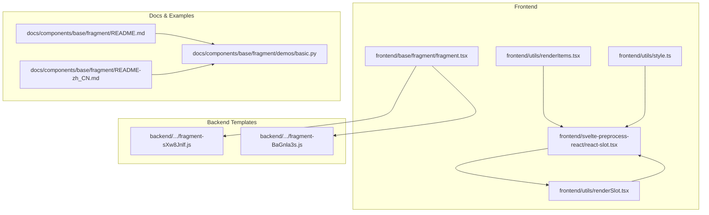
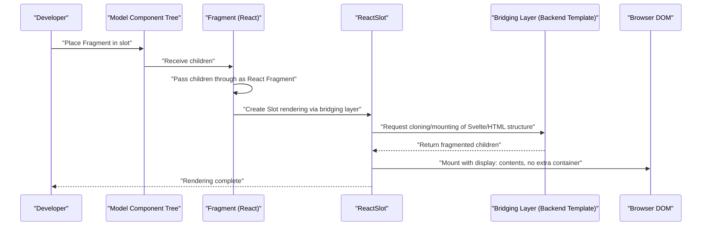
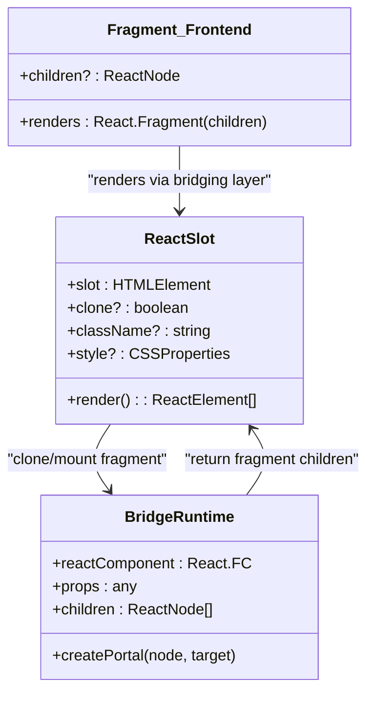
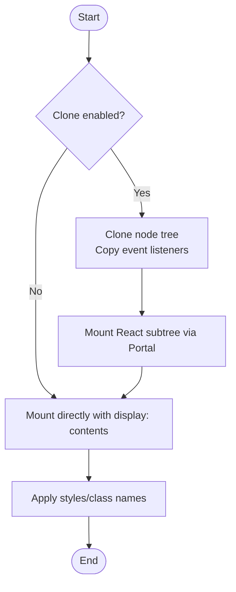
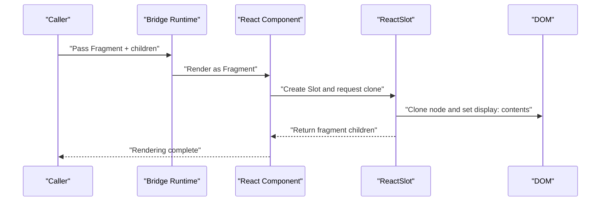
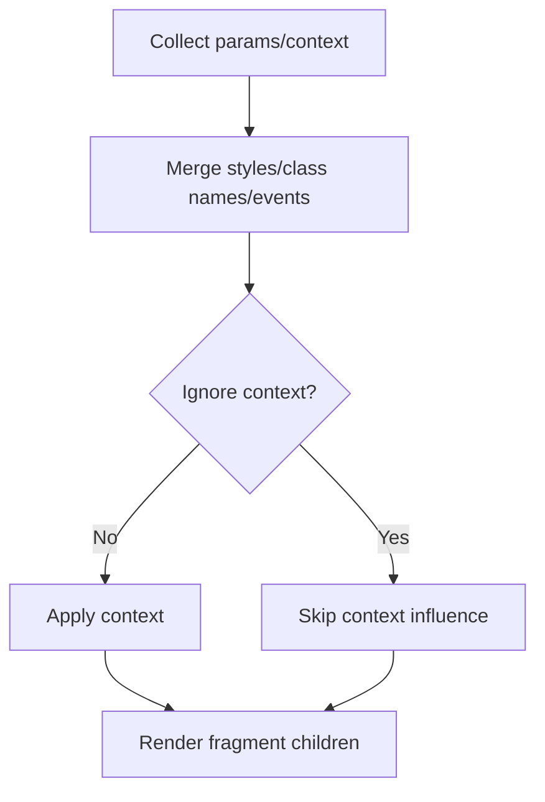
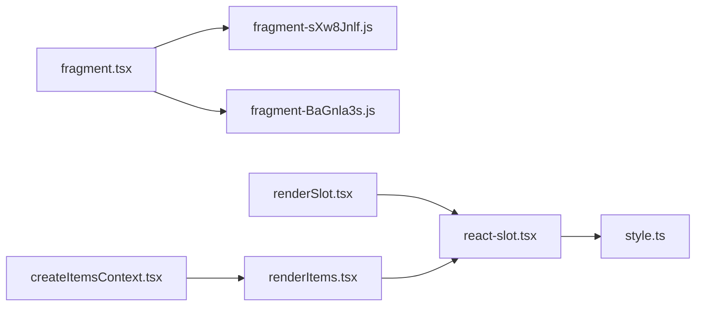

# Fragment Component

<cite>
**Files Referenced in This Document**
- [frontend/base/fragment/fragment.tsx](file://frontend/base/fragment/fragment.tsx)
- [backend/modelscope_studio/components/base/fragment/templates/component/fragment-sXw8Jnlf.js](file://backend/modelscope_studio/components/base/fragment/templates/component/fragment-sXw8Jnlf.js)
- [backend/modelscope_studio/components/base/each/templates/component/fragment-BaGnla3s.js](file://backend/modelscope_studio/components/base/each/templates/component/fragment-BaGnla3s.js)
- [docs/components/base/fragment/README.md](file://docs/components/base/fragment/README.md)
- [docs/components/base/fragment/README-zh_CN.md](file://docs/components/base/fragment/README-zh_CN.md)
- [docs/components/base/fragment/demos/basic.py](file://docs/components/base/fragment/demos/basic.py)
- [frontend/svelte-preprocess-react/react-slot.tsx](file://frontend/svelte-preprocess-react/react-slot.tsx)
- [frontend/utils/renderSlot.tsx](file://frontend/utils/renderSlot.tsx)
- [frontend/utils/renderItems.tsx](file://frontend/utils/renderItems.tsx)
- [frontend/utils/createItemsContext.tsx](file://frontend/utils/createItemsContext.tsx)
- [frontend/utils/style.ts](file://frontend/utils/style.ts)
</cite>

## Table of Contents

1. [Introduction](#introduction)
2. [Project Structure](#project-structure)
3. [Core Components](#core-components)
4. [Architecture Overview](#architecture-overview)
5. [Detailed Component Analysis](#detailed-component-analysis)
6. [Dependency Analysis](#dependency-analysis)
7. [Performance Considerations](#performance-considerations)
8. [Troubleshooting Guide](#troubleshooting-guide)
9. [Conclusion](#conclusion)
10. [Appendix](#appendix)

## Introduction

Fragment is a "fragment" container component designed to combine multiple child elements into a whole without introducing additional DOM nodes, allowing them to be used as insertable content in slots that only accept model-internal components. It is commonly used to wrap components from external ecosystems (such as Gradio buttons) into forms that comply with model-internal component specifications, enabling them to enter the component tree smoothly.

- Design purpose: Avoid introducing redundant container nodes in the layout while maintaining the logical grouping and passing of child nodes.
- Use cases: When a component slot only supports components exported from a specific ecosystem, wrap the unsupported component with Fragment before passing it in.
- Advantages: Reduces unnecessary DOM levels, lowering layout overhead; maintains the directness and maintainability of child nodes.

## Project Structure

Fragment has corresponding implementations and templates in both the frontend and backend, combined with the React Slot mechanism to complete cross-framework bridging and rendering.

Diagram Sources

- [frontend/base/fragment/fragment.tsx:1-11](file://frontend/base/fragment/fragment.tsx#L1-L11)
- [backend/modelscope_studio/components/base/fragment/templates/component/fragment-sXw8Jnlf.js:437-445](file://backend/modelscope_studio/components/base/fragment/templates/component/fragment-sXw8Jnlf.js#L437-L445)
- [backend/modelscope_studio/components/base/each/templates/component/fragment-BaGnla3s.js:1-11](file://backend/modelscope_studio/components/base/each/templates/component/fragment-BaGnla3s.js#L1-L11)
- [frontend/svelte-preprocess-react/react-slot.tsx:1-224](file://frontend/svelte-preprocess-react/react-slot.tsx#L1-L224)
- [frontend/utils/renderSlot.tsx:1-29](file://frontend/utils/renderSlot.tsx#L1-L29)
- [frontend/utils/renderItems.tsx:1-114](file://frontend/utils/renderItems.tsx#L1-L114)
- [frontend/utils/style.ts:1-77](file://frontend/utils/style.ts#L1-L77)
- [docs/components/base/fragment/README.md:1-10](file://docs/components/base/fragment/README.md#L1-L10)
- [docs/components/base/fragment/README-zh_CN.md:1-10](file://docs/components/base/fragment/README-zh_CN.md#L1-L10)
- [docs/components/base/fragment/demos/basic.py:1-22](file://docs/components/base/fragment/demos/basic.py#L1-L22)

Section Sources

- [frontend/base/fragment/fragment.tsx:1-11](file://frontend/base/fragment/fragment.tsx#L1-L11)
- [backend/modelscope_studio/components/base/fragment/templates/component/fragment-sXw8Jnlf.js:437-445](file://backend/modelscope_studio/components/base/fragment/templates/component/fragment-sXw8Jnlf.js#L437-L445)
- [docs/components/base/fragment/README.md:1-10](file://docs/components/base/fragment/README.md#L1-L10)

## Core Components

- Frontend Fragment (React wrapper)
  - Bridges Svelte component capabilities to the React ecosystem via `sveltify`, passing `children` through as a React Fragment internally without introducing extra DOM.
  - Typical path: [frontend/base/fragment/fragment.tsx:4-8](file://frontend/base/fragment/fragment.tsx#L4-L8)

- Backend Fragment (runtime template)
  - Generates a runtime wrapper for React Fragment for the bridging layer to render, ensuring `children` are mounted as a fragment.
  - Typical path: [backend/modelscope_studio/components/base/fragment/templates/component/fragment-sXw8Jnlf.js:437-441](file://backend/modelscope_studio/components/base/fragment/templates/component/fragment-sXw8Jnlf.js#L437-L441)

- Backend Each Fragment (Svelte template)
  - Fragment implementation for Svelte, enabling reuse of fragment semantics in Svelte scenarios.
  - Typical path: [backend/modelscope_studio/components/base/each/templates/component/fragment-BaGnla3s.js:2-6](file://backend/modelscope_studio/components/base/each/templates/component/fragment-BaGnla3s.js#L2-L6)

Section Sources

- [frontend/base/fragment/fragment.tsx:1-11](file://frontend/base/fragment/fragment.tsx#L1-L11)
- [backend/modelscope_studio/components/base/fragment/templates/component/fragment-sXw8Jnlf.js:437-445](file://backend/modelscope_studio/components/base/fragment/templates/component/fragment-sXw8Jnlf.js#L437-L445)
- [backend/modelscope_studio/components/base/each/templates/component/fragment-BaGnla3s.js:1-11](file://backend/modelscope_studio/components/base/each/templates/component/fragment-BaGnla3s.js#L1-L11)

## Architecture Overview

Fragment's workflow revolves around "fragment container + React Slot + context bridging": the frontend Fragment passes `children` through as a React Fragment; ReactSlot clones Svelte/HTML structures and mounts them to the React subtree in a "display contents" manner, avoiding extra container nodes; the rendering utility chain handles merging and application of parameters, events, and styles during bridging.

Diagram Sources

- [frontend/base/fragment/fragment.tsx:4-8](file://frontend/base/fragment/fragment.tsx#L4-L8)
- [frontend/svelte-preprocess-react/react-slot.tsx:109-223](file://frontend/svelte-preprocess-react/react-slot.tsx#L109-L223)
- [backend/modelscope_studio/components/base/fragment/templates/component/fragment-sXw8Jnlf.js:437-441](file://backend/modelscope_studio/components/base/fragment/templates/component/fragment-sXw8Jnlf.js#L437-L441)

## Detailed Component Analysis

### Component Class Diagram (Code Level)

Diagram Sources

- [frontend/base/fragment/fragment.tsx:4-8](file://frontend/base/fragment/fragment.tsx#L4-L8)
- [frontend/svelte-preprocess-react/react-slot.tsx:109-223](file://frontend/svelte-preprocess-react/react-slot.tsx#L109-L223)
- [backend/modelscope_studio/components/base/fragment/templates/component/fragment-sXw8Jnlf.js:305-328](file://backend/modelscope_studio/components/base/fragment/templates/component/fragment-sXw8Jnlf.js#L305-L328)

Section Sources

- [frontend/base/fragment/fragment.tsx:1-11](file://frontend/base/fragment/fragment.tsx#L1-L11)
- [frontend/svelte-preprocess-react/react-slot.tsx:1-224](file://frontend/svelte-preprocess-react/react-slot.tsx#L1-L224)
- [backend/modelscope_studio/components/base/fragment/templates/component/fragment-sXw8Jnlf.js:250-328](file://backend/modelscope_studio/components/base/fragment/templates/component/fragment-sXw8Jnlf.js#L250-L328)

### Rendering Flow (Fragment Mounting)

- ReactSlot clones the target element as a "display contents" node during mounting, avoiding extra container levels.
- If clone mode is enabled, recursively clones child nodes and event listeners, mounting the React subtree into the cloned node via Portal.
- Finally presented as `display: contents`, allowing child nodes to directly participate in the parent container's layout calculations.

Diagram Sources

- [frontend/svelte-preprocess-react/react-slot.tsx:158-202](file://frontend/svelte-preprocess-react/react-slot.tsx#L158-L202)
- [frontend/utils/style.ts:39-76](file://frontend/utils/style.ts#L39-L76)

Section Sources

- [frontend/svelte-preprocess-react/react-slot.tsx:109-223](file://frontend/svelte-preprocess-react/react-slot.tsx#L109-L223)
- [frontend/utils/style.ts:1-77](file://frontend/utils/style.ts#L1-L77)

### API/Service Component Call Sequence (Fragment Bridging)

Diagram Sources

- [backend/modelscope_studio/components/base/fragment/templates/component/fragment-sXw8Jnlf.js:305-328](file://backend/modelscope_studio/components/base/fragment/templates/component/fragment-sXw8Jnlf.js#L305-L328)
- [frontend/svelte-preprocess-react/react-slot.tsx:109-223](file://frontend/svelte-preprocess-react/react-slot.tsx#L109-L223)

Section Sources

- [backend/modelscope_studio/components/base/fragment/templates/component/fragment-sXw8Jnlf.js:250-328](file://backend/modelscope_studio/components/base/fragment/templates/component/fragment-sXw8Jnlf.js#L250-L328)

### Complex Logic Component (Fragment and Context Merging)

- During bridging, fragments merge multiple contexts (such as styles, class names, events, etc.) and skip context influence under ignore flags.
- Supports parameter mapping and force cloning, ensuring stable passing of properties and events in complex layouts.

Diagram Sources

- [backend/modelscope_studio/components/base/fragment/templates/component/fragment-sXw8Jnlf.js:286-304](file://backend/modelscope_studio/components/base/fragment/templates/component/fragment-sXw8Jnlf.js#L286-L304)

Section Sources

- [backend/modelscope_studio/components/base/fragment/templates/component/fragment-sXw8Jnlf.js:228-328](file://backend/modelscope_studio/components/base/fragment/templates/component/fragment-sXw8Jnlf.js#L228-L328)

## Dependency Analysis

- The Fragment frontend implementation depends on React and `sveltify`; the backend template depends on the runtime renderer and bridging utilities.
- ReactSlot depends on style utilities and debounce hooks to ensure cloning and mounting stability.
- The rendering utility chain (renderSlot, renderItems, createItemsContext) provides a unified entry for handling parameters, events, and context.

Diagram Sources

- [frontend/base/fragment/fragment.tsx:1-11](file://frontend/base/fragment/fragment.tsx#L1-L11)
- [backend/modelscope_studio/components/base/fragment/templates/component/fragment-sXw8Jnlf.js:1-446](file://backend/modelscope_studio/components/base/fragment/templates/component/fragment-sXw8Jnlf.js#L1-L446)
- [backend/modelscope_studio/components/base/each/templates/component/fragment-BaGnla3s.js:1-11](file://backend/modelscope_studio/components/base/each/templates/component/fragment-BaGnla3s.js#L1-L11)
- [frontend/svelte-preprocess-react/react-slot.tsx:1-224](file://frontend/svelte-preprocess-react/react-slot.tsx#L1-L224)
- [frontend/utils/renderSlot.tsx:1-29](file://frontend/utils/renderSlot.tsx#L1-L29)
- [frontend/utils/renderItems.tsx:1-114](file://frontend/utils/renderItems.tsx#L1-L114)
- [frontend/utils/createItemsContext.tsx:1-274](file://frontend/utils/createItemsContext.tsx#L1-L274)
- [frontend/utils/style.ts:1-77](file://frontend/utils/style.ts#L1-L77)

Section Sources

- [frontend/utils/renderSlot.tsx:1-29](file://frontend/utils/renderSlot.tsx#L1-L29)
- [frontend/utils/renderItems.tsx:1-114](file://frontend/utils/renderItems.tsx#L1-L114)
- [frontend/utils/createItemsContext.tsx:1-274](file://frontend/utils/createItemsContext.tsx#L1-L274)

## Performance Considerations

- Reducing DOM levels: Fragment passes `children` through as React Fragment, avoiding extra container nodes and reducing layout and reflow costs.
- Clone strategy: Enable cloning when needed, but avoid frequent cloning of large numbers of nodes; combine with parameter mapping and force cloning when necessary to reduce invalid updates.
- Mutation observation: ReactSlot uses MutationObserver to observe changes, combined with debounce and minimal re-rendering, avoiding excessive refresh.
- Styles and class names: Converted uniformly via style utilities, avoiding repeated calculation and string concatenation overhead.
- Event binding: Copy event listeners during cloning to ensure interaction consistency, while paying attention to removal timing to prevent memory leaks.

## Troubleshooting Guide

- Slot not working
  - Confirm that the slot only supports components from a specific ecosystem; the component needs to be wrapped with Fragment before being passed in.
  - Reference example: [docs/components/base/fragment/demos/basic.py:14-19](file://docs/components/base/fragment/demos/basic.py#L14-L19)

- Child elements not rendering correctly or styles missing
  - Check if clone mode is enabled; if not, styles and class names may not be correctly applied.
  - Reference implementation: [frontend/svelte-preprocess-react/react-slot.tsx:158-202](file://frontend/svelte-preprocess-react/react-slot.tsx#L158-L202)

- Events not triggering or binding repeatedly
  - Confirm event listeners have been copied during cloning; check if cleanup occurs on unmount.
  - Reference implementation: [frontend/svelte-preprocess-react/react-slot.tsx:67-95](file://frontend/svelte-preprocess-react/react-slot.tsx#L67-L95)

- Parameter mapping and context conflicts
  - Use parameter mapping and force cloning to ensure context merge order and override rules meet expectations.
  - Reference implementation: [backend/modelscope_studio/components/base/fragment/templates/component/fragment-sXw8Jnlf.js:286-304](file://backend/modelscope_studio/components/base/fragment/templates/component/fragment-sXw8Jnlf.js#L286-L304)

Section Sources

- [docs/components/base/fragment/demos/basic.py:1-22](file://docs/components/base/fragment/demos/basic.py#L1-L22)
- [frontend/svelte-preprocess-react/react-slot.tsx:67-202](file://frontend/svelte-preprocess-react/react-slot.tsx#L67-L202)
- [backend/modelscope_studio/components/base/fragment/templates/component/fragment-sXw8Jnlf.js:286-304](file://backend/modelscope_studio/components/base/fragment/templates/component/fragment-sXw8Jnlf.js#L286-L304)

## Conclusion

The Fragment component implements combination and passing of multiple child elements without introducing extra DOM nodes, through the "fragment container + React Slot + context bridging" mechanism. It is particularly suitable for layout needs that require injecting unsupported components into strictly constrained slot scenarios. Combined with parameter mapping, event merging, and style utilities, Fragment has good stability and maintainability in complex layouts.

## Appendix

- Usage examples (documentation and demos)
  - Basic usage and comparison: [docs/components/base/fragment/demos/basic.py:14-19](file://docs/components/base/fragment/demos/basic.py#L14-L19)
  - Chinese documentation: [docs/components/base/fragment/README-zh_CN.md:1-10](file://docs/components/base/fragment/README-zh_CN.md#L1-L10)
  - English documentation: [docs/components/base/fragment/README.md:1-10](file://docs/components/base/fragment/README.md#L1-L10)
