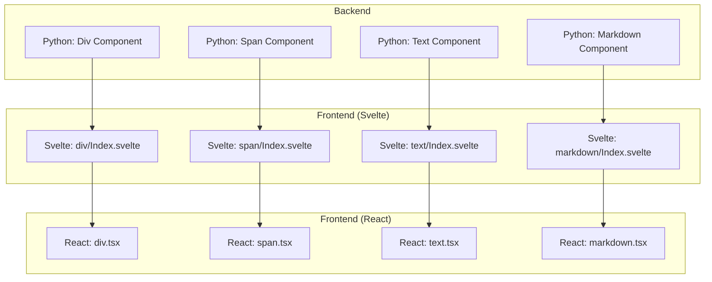
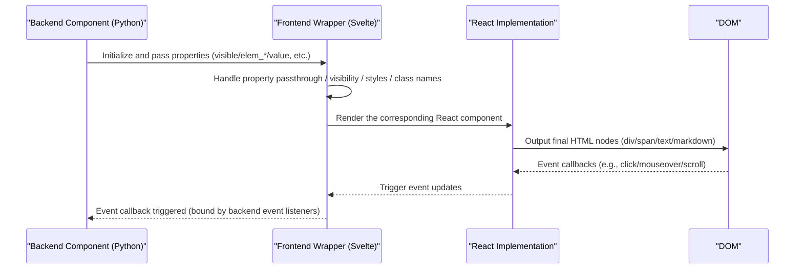
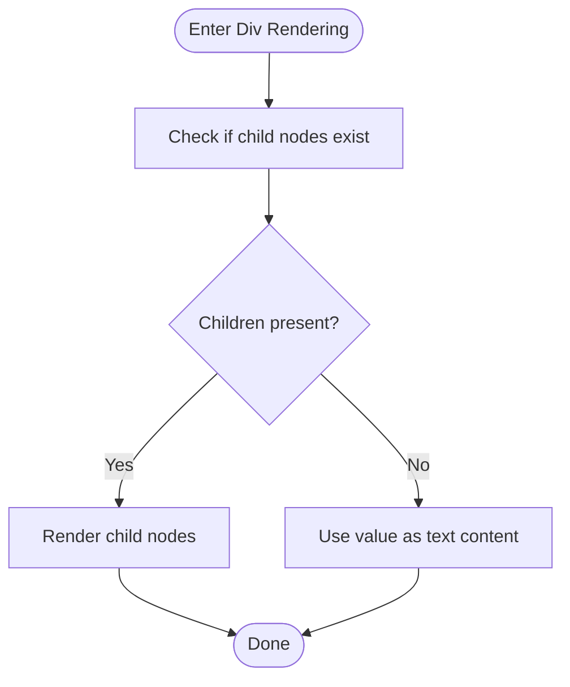
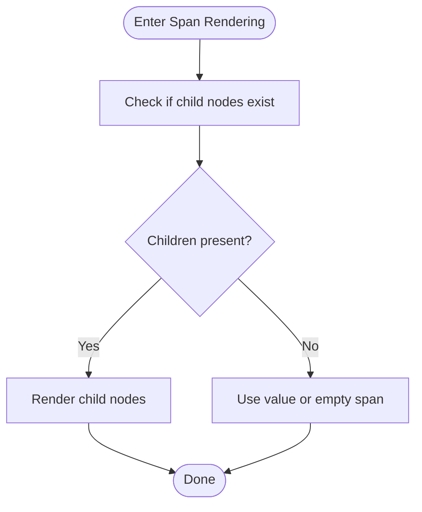
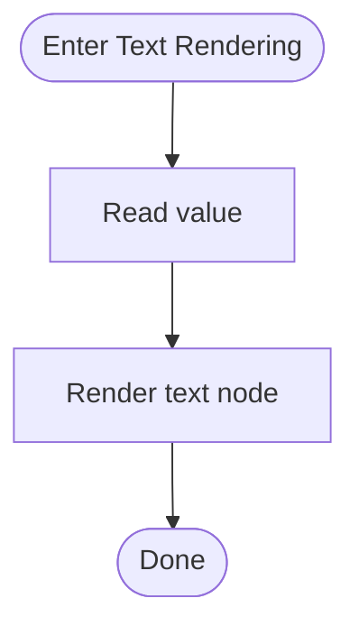
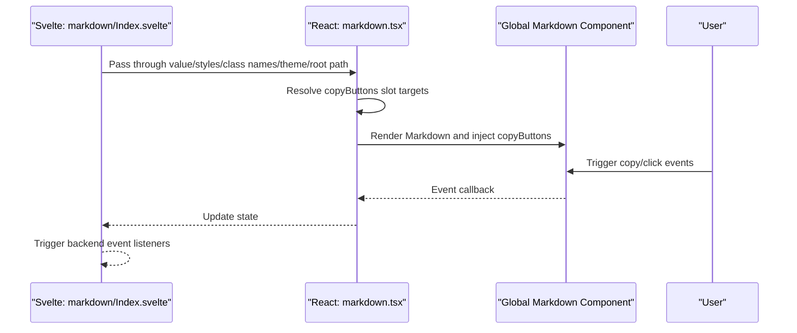
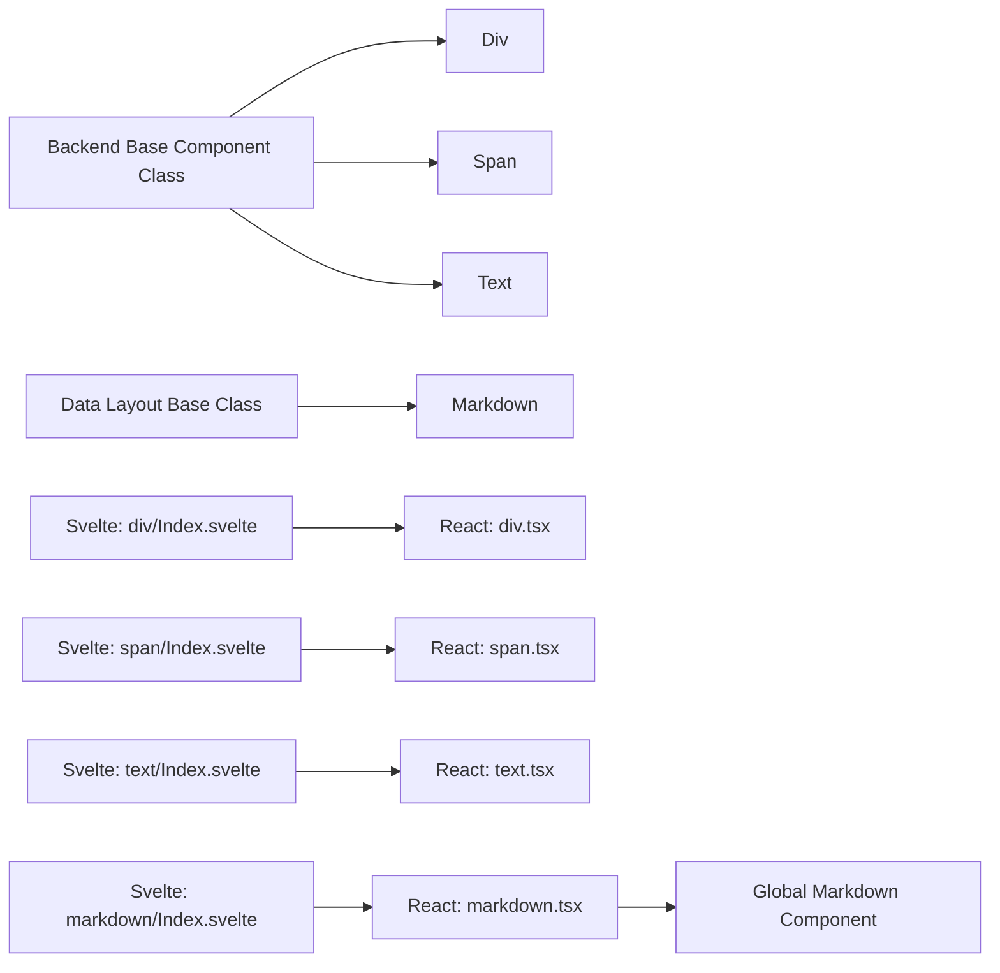

# Layout Components

<cite>
**Files Referenced in This Document**
- [backend/modelscope_studio/components/base/__init__.py](file://backend/modelscope_studio/components/base/__init__.py)
- [backend/modelscope_studio/components/base/div/__init__.py](file://backend/modelscope_studio/components/base/div/__init__.py)
- [backend/modelscope_studio/components/base/span/__init__.py](file://backend/modelscope_studio/components/base/span/__init__.py)
- [backend/modelscope_studio/components/base/text/__init__.py](file://backend/modelscope_studio/components/base/text/__init__.py)
- [backend/modelscope_studio/components/base/markdown/__init__.py](file://backend/modelscope_studio/components/base/markdown/__init__.py)
- [frontend/base/package.json](file://frontend/base/package.json)
- [frontend/base/div/Index.svelte](file://frontend/base/div/Index.svelte)
- [frontend/base/span/Index.svelte](file://frontend/base/span/Index.svelte)
- [frontend/base/text/Index.svelte](file://frontend/base/text/Index.svelte)
- [frontend/base/markdown/Index.svelte](file://frontend/base/markdown/Index.svelte)
- [frontend/base/div/div.tsx](file://frontend/base/div/div.tsx)
- [frontend/base/span/span.tsx](file://frontend/base/span/span.tsx)
- [frontend/base/text/text.tsx](file://frontend/base/text/text.tsx)
- [frontend/base/markdown/markdown.tsx](file://frontend/base/markdown/markdown.tsx)
</cite>

## Table of Contents

1. [Introduction](#introduction)
2. [Project Structure](#project-structure)
3. [Core Components](#core-components)
4. [Architecture Overview](#architecture-overview)
5. [Detailed Component Analysis](#detailed-component-analysis)
6. [Dependency Analysis](#dependency-analysis)
7. [Performance Considerations](#performance-considerations)
8. [Troubleshooting Guide](#troubleshooting-guide)
9. [Conclusion](#conclusion)
10. [Appendix](#appendix)

## Introduction

This document systematically covers the "Layout Components" series in ModelScope Studio, focusing on the four foundational layout and content components: Div, Span, Text, and Markdown. The documentation provides in-depth explanations from the perspectives of architecture, data flow, processing logic, styling and theme adaptation, composition and nesting best practices, performance characteristics and optimization recommendations, as well as common issues and debugging techniques — helping developers efficiently and reliably use these components for page layout and content rendering.

## Project Structure

The layout components sit between the backend Python component layer and the frontend Svelte/React layer, following a layered design of "Python component definition + Svelte wrapper + React implementation":

- Backend: Defines component behavior, event bindings, pre/post-processing logic, and declares frontend resource directories via Python classes.
- Frontend Svelte layer: Handles property passthrough, visibility control, style and class name composition, and slot resolution/rendering.
- React layer: Wraps specific HTML elements (e.g., div/span), or renders based on a global component (e.g., Markdown).

Diagram Sources

- [backend/modelscope_studio/components/base/div/**init**.py:10-86](file://backend/modelscope_studio/components/base/div/__init__.py#L10-L86)
- [backend/modelscope_studio/components/base/span/**init**.py:10-87](file://backend/modelscope_studio/components/base/span/__init__.py#L10-L87)
- [backend/modelscope_studio/components/base/text/**init**.py:8-57](file://backend/modelscope_studio/components/base/text/__init__.py#L8-L57)
- [backend/modelscope_studio/components/base/markdown/**init**.py:11-174](file://backend/modelscope_studio/components/base/markdown/__init__.py#L11-L174)
- [frontend/base/div/Index.svelte:1-65](file://frontend/base/div/Index.svelte#L1-L65)
- [frontend/base/span/Index.svelte:1-64](file://frontend/base/span/Index.svelte#L1-L64)
- [frontend/base/text/Index.svelte:1-42](file://frontend/base/text/Index.svelte#L1-L42)
- [frontend/base/markdown/Index.svelte:1-64](file://frontend/base/markdown/Index.svelte#L1-L64)
- [frontend/base/div/div.tsx:1-18](file://frontend/base/div/div.tsx#L1-L18)
- [frontend/base/span/span.tsx:1-20](file://frontend/base/span/span.tsx#L1-L20)
- [frontend/base/text/text.tsx:1-11](file://frontend/base/text/text.tsx#L1-L11)
- [frontend/base/markdown/markdown.tsx:1-35](file://frontend/base/markdown/markdown.tsx#L1-L35)

Section Sources

- [backend/modelscope_studio/components/base/**init**.py:1-11](file://backend/modelscope_studio/components/base/__init__.py#L1-L11)
- [frontend/base/package.json:1-6](file://frontend/base/package.json#L1-L6)

## Core Components

This section provides a functional and usage overview of the four foundational layout components, highlighting their roles and responsibilities in page layout and content rendering.

- Div
  - Role: Block-level container for holding child elements or text values; supports generic interaction events such as mouse and scroll events.
  - Key Points: Accepts extra prop passthrough; supports visibility, element ID, class names, and inline styles as common attributes.
  - Use Cases: Card backgrounds, section divisions, and outer containers for complex nested layouts.

- Span
  - Role: Inline container suitable for wrapping short text or inline elements; also supports generic interaction events.
  - Key Points: Prioritizes child node rendering when children exist; falls back to `value` or an empty span otherwise.
  - Use Cases: Inline highlights, labels, and text fragments within button groups.

- Text
  - Role: Pure text output component with no extra container wrapper; directly renders a string.
  - Key Points: No event bindings; only handles `value`; suitable for minimal-cost text rendering.
  - Use Cases: Headings, paragraphs, and lightweight hint text.

- Markdown
  - Role: Rich text rendering component supporting copyButtons slots, LaTeX math delimiters, HTML sanitization policy, line break and header link options.
  - Key Points: Supports `copyButtons` slot; post-processing cleans input indentation; theme mode and root path are passed through to the underlying component.
  - Use Cases: Help documentation, descriptive text, and dynamically generated rich text content.

Section Sources

- [backend/modelscope_studio/components/base/div/**init**.py:10-86](file://backend/modelscope_studio/components/base/div/__init__.py#L10-L86)
- [backend/modelscope_studio/components/base/span/**init**.py:10-87](file://backend/modelscope_studio/components/base/span/__init__.py#L10-L87)
- [backend/modelscope_studio/components/base/text/**init**.py:8-57](file://backend/modelscope_studio/components/base/text/__init__.py#L8-L57)
- [backend/modelscope_studio/components/base/markdown/**init**.py:11-174](file://backend/modelscope_studio/components/base/markdown/__init__.py#L11-L174)

## Architecture Overview

The diagram below illustrates the overall call chain and data flow from backend components to frontend rendering:

Diagram Sources

- [backend/modelscope_studio/components/base/div/**init**.py:14-39](file://backend/modelscope_studio/components/base/div/__init__.py#L14-L39)
- [backend/modelscope_studio/components/base/span/**init**.py:14-39](file://backend/modelscope_studio/components/base/span/__init__.py#L14-L39)
- [backend/modelscope_studio/components/base/markdown/**init**.py:15-46](file://backend/modelscope_studio/components/base/markdown/__init__.py#L15-L46)
- [frontend/base/div/Index.svelte:22-47](file://frontend/base/div/Index.svelte#L22-L47)
- [frontend/base/span/Index.svelte:21-46](file://frontend/base/span/Index.svelte#L21-L46)
- [frontend/base/text/Index.svelte:15-29](file://frontend/base/text/Index.svelte#L15-L29)
- [frontend/base/markdown/Index.svelte:19-44](file://frontend/base/markdown/Index.svelte#L19-L44)
- [frontend/base/div/div.tsx:12-15](file://frontend/base/div/div.tsx#L12-L15)
- [frontend/base/span/span.tsx:12-17](file://frontend/base/span/span.tsx#L12-L17)
- [frontend/base/text/text.tsx:4-8](file://frontend/base/text/text.tsx#L4-L8)
- [frontend/base/markdown/markdown.tsx:8-32](file://frontend/base/markdown/markdown.tsx#L8-L32)

## Detailed Component Analysis

### Div Component

- Design Highlights
  - As a block-level container, it prioritizes child node rendering; falls back to the `value` string when no children are present.
  - Supports binding of generic interaction events (click, dblclick, mousedown, mouseup, mouseover, mouseout, mousemove, scroll).
  - Extra props can be passed through; `elem_id`, `elem_classes`, and `elem_style` provide styling and positioning control.
- Data Flow and Processing Logic
  - Pre/post-processing leaves strings unchanged; visibility is uniformly controlled by the Svelte layer.
- Usage Recommendations
  - Suitable for large-scale layout divisions and complex nesting; avoid using in contexts where inline semantics are required.
  - When combined with Grid/Flex layouts, be mindful not to introduce unnecessary hierarchy.

Diagram Sources

- [frontend/base/div/div.tsx:12-15](file://frontend/base/div/div.tsx#L12-L15)
- [frontend/base/div/Index.svelte:50-63](file://frontend/base/div/Index.svelte#L50-L63)

Section Sources

- [backend/modelscope_studio/components/base/div/**init**.py:10-86](file://backend/modelscope_studio/components/base/div/__init__.py#L10-L86)
- [frontend/base/div/Index.svelte:1-65](file://frontend/base/div/Index.svelte#L1-L65)
- [frontend/base/div/div.tsx:1-18](file://frontend/base/div/div.tsx#L1-L18)

### Span Component

- Design Highlights
  - Inline container that prioritizes child node rendering; falls back to `value` or an empty span when no children are present.
  - Supports the same set of interaction event bindings as Div.
- Usage Recommendations
  - Suitable for inline text fragments, labels, and text within buttons.
  - Not recommended in contexts that require block-level line breaks.

Diagram Sources

- [frontend/base/span/span.tsx:12-17](file://frontend/base/span/span.tsx#L12-L17)
- [frontend/base/span/Index.svelte:49-63](file://frontend/base/span/Index.svelte#L49-L63)

Section Sources

- [backend/modelscope_studio/components/base/span/**init**.py:10-87](file://backend/modelscope_studio/components/base/span/__init__.py#L10-L87)
- [frontend/base/span/Index.svelte:1-64](file://frontend/base/span/Index.svelte#L1-L64)
- [frontend/base/span/span.tsx:1-20](file://frontend/base/span/span.tsx#L1-L20)

### Text Component

- Design Highlights
  - Minimal wrapper that directly renders a string; no event bindings.
  - Suitable for pure text output with low performance overhead.
- Usage Recommendations
  - Do not mix with rich text or interactive scenarios; control styling via `elem_classes`/`elem_style` when needed.

Diagram Sources

- [frontend/base/text/text.tsx:4-8](file://frontend/base/text/text.tsx#L4-L8)
- [frontend/base/text/Index.svelte:32-41](file://frontend/base/text/Index.svelte#L32-L41)

Section Sources

- [backend/modelscope_studio/components/base/text/**init**.py:8-57](file://backend/modelscope_studio/components/base/text/__init__.py#L8-L57)
- [frontend/base/text/Index.svelte:1-42](file://frontend/base/text/Index.svelte#L1-L42)
- [frontend/base/text/text.tsx:1-11](file://frontend/base/text/text.tsx#L1-L11)

### Markdown Component

- Design Highlights
  - Supports the `copyButtons` slot to allow custom copy buttons; supports LaTeX math delimiters, HTML sanitization policy, line break and header link options.
  - Post-processing cleans input indentation to ensure rendering consistency.
  - Theme mode and root path are passed through via props to the underlying Markdown component.
- Data Flow and Processing Logic
  - The Svelte layer parses slots and injects `copyButtons` targets into the React layer.
  - The React layer hides children, delegating rendering and interaction to the global Markdown component.

Diagram Sources

- [frontend/base/markdown/Index.svelte:19-44](file://frontend/base/markdown/Index.svelte#L19-L44)
- [frontend/base/markdown/markdown.tsx:8-32](file://frontend/base/markdown/markdown.tsx#L8-L32)
- [backend/modelscope_studio/components/base/markdown/**init**.py:15-46](file://backend/modelscope_studio/components/base/markdown/__init__.py#L15-L46)

Section Sources

- [backend/modelscope_studio/components/base/markdown/**init**.py:11-174](file://backend/modelscope_studio/components/base/markdown/__init__.py#L11-L174)
- [frontend/base/markdown/Index.svelte:1-64](file://frontend/base/markdown/Index.svelte#L1-L64)
- [frontend/base/markdown/markdown.tsx:1-35](file://frontend/base/markdown/markdown.tsx#L1-L35)

## Dependency Analysis

- Inter-Component Coupling
  - All four components are derived from a unified backend base class (layout/data-layout/plain component), sharing a consistent lifecycle and event mechanism.
  - The frontend Svelte layer uses the same property passthrough and visibility control patterns, reducing maintenance cost.
- External Dependencies
  - The React wrapper layer depends on `sveltify` and slot capabilities provided by `@svelte-preprocess-react`.
  - The Markdown component depends on the global Markdown component and ReactSlot for slot rendering.
- Potential Circular Dependencies
  - The current structure follows a unidirectional dependency (Backend → Svelte → React); no circular dependency has been observed.

Diagram Sources

- [backend/modelscope_studio/components/base/div/**init**.py](file://backend/modelscope_studio/components/base/div/__init__.py#L7)
- [backend/modelscope_studio/components/base/span/**init**.py](file://backend/modelscope_studio/components/base/span/__init__.py#L7)
- [backend/modelscope_studio/components/base/text/**init**.py](file://backend/modelscope_studio/components/base/text/__init__.py#L5)
- [backend/modelscope_studio/components/base/markdown/**init**.py](file://backend/modelscope_studio/components/base/markdown/__init__.py#L8)
- [frontend/base/markdown/markdown.tsx:4-5](file://frontend/base/markdown/markdown.tsx#L4-L5)

Section Sources

- [backend/modelscope_studio/components/base/**init**.py:1-11](file://backend/modelscope_studio/components/base/__init__.py#L1-L11)
- [frontend/base/package.json:1-6](file://frontend/base/package.json#L1-L6)

## Performance Considerations

- Rendering Path
  - Text outputs plain text directly with the lowest overhead; Div/Span traverse the React subtree when children are present — pay attention to subtree size.
  - Markdown reuses global rendering capability by hiding children, reducing repeated parsing.
- Event Bindings
  - All layout components support multiple mouse/scroll event bindings; enable only as needed to avoid unnecessary callback overhead.
- Styles and Class Names
  - Control styling via `elem_classes`/`elem_style`; prefer atomic class names to minimize style recalculation.
- Theme and Resources
  - Markdown theme mode and root path are passed through to ensure static asset paths are correct, avoiding redundant requests.

[This section contains general performance recommendations; no specific file references required]

## Troubleshooting Guide

- Text Not Displayed
  - Check whether `value` is empty or contains only whitespace; the Text component falls back to an empty span when `value` is missing.
  - For Div/Span, verify whether child nodes have been passed in, causing `value` to be ignored.
- Events Not Firing
  - Confirm that event listeners are registered on the backend; check that `visible` is `true` — events will not fire when the component is invisible.
- Markdown Copy Button Not Working
  - Confirm that the `copyButtons` slot is correctly mounted; the React layer determines whether to replace the default button based on the slot target.
- Styles Not Applied
  - Check the composition order and precedence of `elem_id`/`elem_classes`/`elem_style`; use more specific CSS selectors if necessary.
- Theme Mismatch
  - Confirm that `themeMode` and `rootUrl` are correctly passed through to the Markdown component.

Section Sources

- [backend/modelscope_studio/components/base/text/**init**.py:45-50](file://backend/modelscope_studio/components/base/text/__init__.py#L45-L50)
- [backend/modelscope_studio/components/base/div/**init**.py:14-39](file://backend/modelscope_studio/components/base/div/__init__.py#L14-L39)
- [backend/modelscope_studio/components/base/span/**init**.py:14-39](file://backend/modelscope_studio/components/base/span/__init__.py#L14-L39)
- [backend/modelscope_studio/components/base/markdown/**init**.py:49-52](file://backend/modelscope_studio/components/base/markdown/__init__.py#L49-L52)
- [frontend/base/markdown/markdown.tsx:14-31](file://frontend/base/markdown/markdown.tsx#L14-L31)

## Conclusion

Div, Span, Text, and Markdown form the foundational capabilities for layout and content rendering in ModelScope Studio. Under the design of unified backend abstraction, consistent frontend wrapping, and precise React rendering, they achieve both ease of use and extensibility alongside solid performance. Choosing the appropriate component type, enabling events and slots only as needed, and following style and theme conventions are key to building high-quality interfaces.

[This section contains summary content; no specific file references required]

## Appendix

### Component Properties and Behavior Quick Reference

- Div
  - Events: click, dblclick, mousedown, mouseup, mouseover, mouseout, mousemove, scroll
  - Properties: value, additional_props, elem_id, elem_classes, elem_style, visible, render
- Span
  - Events: click, dblclick, mousedown, mouseup, mouseover, mouseout, mousemove, scroll
  - Properties: value, additional_props, elem_id, elem_classes, elem_style, visible, render
- Text
  - Events: None
  - Properties: value, elem_id, elem_classes, elem_style, visible, render
- Markdown
  - Events: change, copy, click, dblclick, mousedown, mouseup, mouseover, mouseout, mousemove, scroll
  - Slots: copyButtons
  - Properties: value, rtl, latex_delimiters, sanitize_html, line_breaks, header_links, allow_tags, show_copy_button, copy_buttons, elem_id, elem_classes, elem_style, visible, render

Section Sources

- [backend/modelscope_studio/components/base/div/**init**.py:14-68](file://backend/modelscope_studio/components/base/div/__init__.py#L14-L68)
- [backend/modelscope_studio/components/base/span/**init**.py:14-69](file://backend/modelscope_studio/components/base/span/__init__.py#L14-L69)
- [backend/modelscope_studio/components/base/text/**init**.py:12-39](file://backend/modelscope_studio/components/base/text/__init__.py#L12-L39)
- [backend/modelscope_studio/components/base/markdown/**init**.py:15-143](file://backend/modelscope_studio/components/base/markdown/__init__.py#L15-L143)
