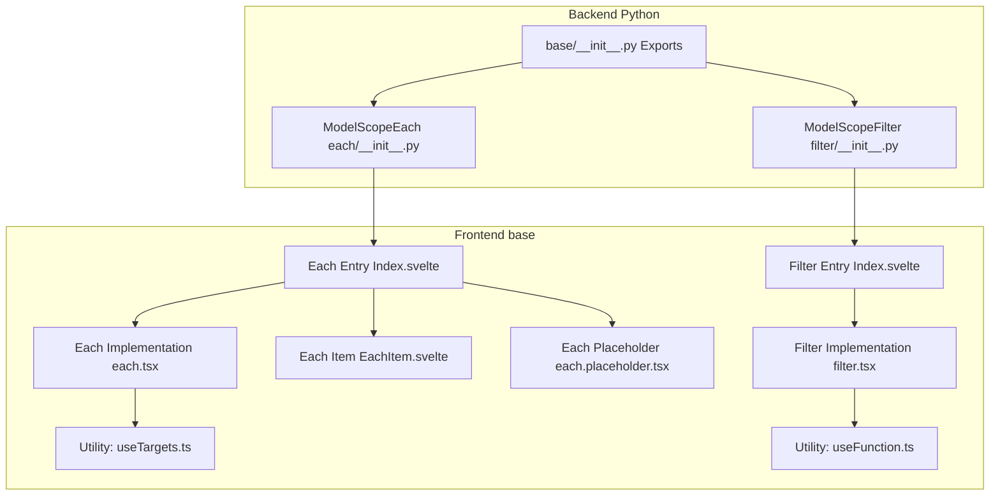
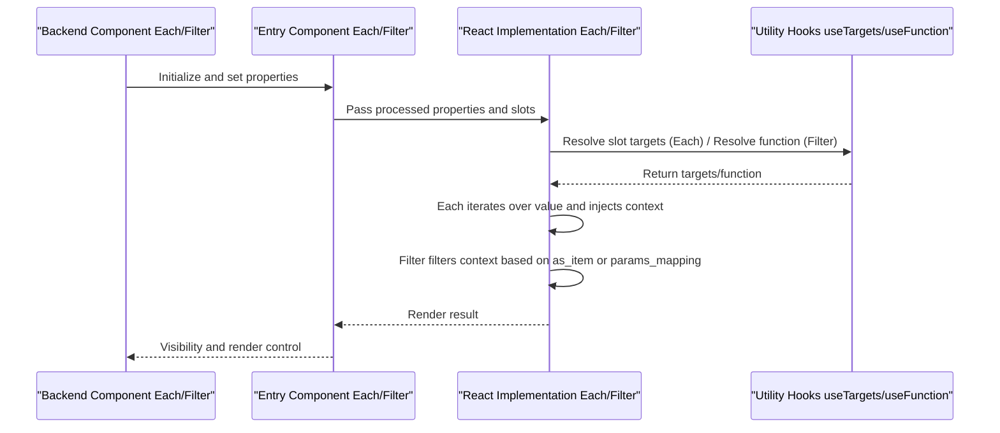
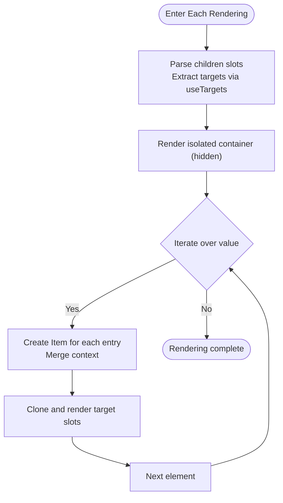
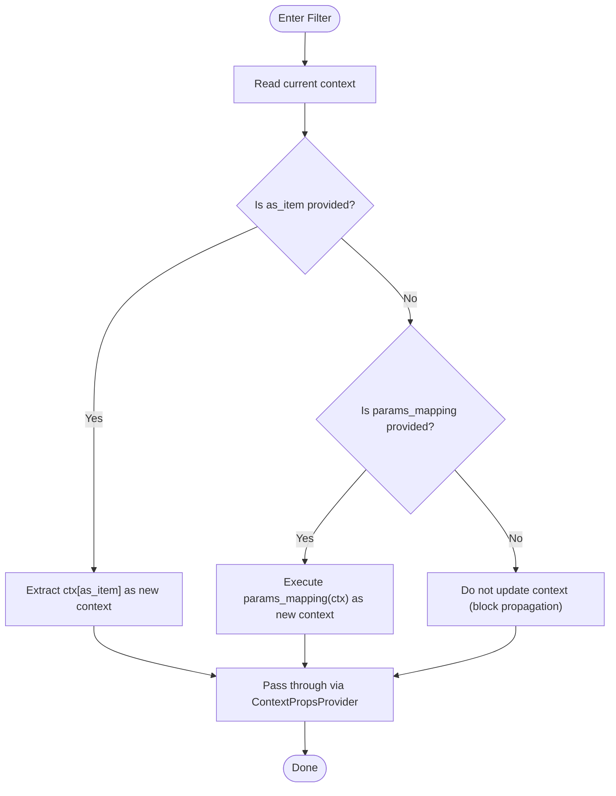
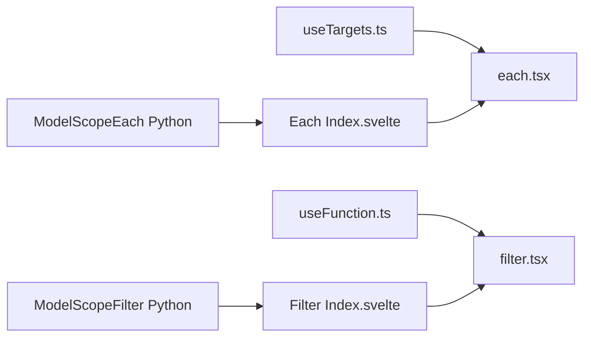

# Rendering Components

<cite>
**Files Referenced in This Document**
- [each.tsx](file://frontend/base/each/each.tsx)
- [Index.svelte (Each)](file://frontend/base/each/Index.svelte)
- [EachItem.svelte](file://frontend/base/each/EachItem.svelte)
- [each.placeholder.tsx](file://frontend/base/each/each.placeholder.tsx)
- [useTargets.ts](file://frontend/utils/hooks/useTargets.ts)
- [useFunction.ts](file://frontend/utils/hooks/useFunction.ts)
- [filter.tsx](file://frontend/base/filter/filter.tsx)
- [Index.svelte (Filter)](file://frontend/base/filter/Index.svelte)
- [each/__init__.py](file://backend/modelscope_studio/components/base/each/__init__.py)
- [filter/__init__.py](file://backend/modelscope_studio/components/base/filter/__init__.py)
- [base/__init__.py](file://backend/modelscope_studio/components/base/__init__.py)
- [filter/README-zh_CN.md](file://docs/components/base/filter/README-zh_CN.md)
- [filter/demos/basic.py](file://docs/components/base/filter/demos/basic.py)
</cite>

## Table of Contents

1. [Introduction](#introduction)
2. [Project Structure](#project-structure)
3. [Core Components](#core-components)
4. [Architecture Overview](#architecture-overview)
5. [Component Details](#component-details)
6. [Dependency Analysis](#dependency-analysis)
7. [Performance Considerations](#performance-considerations)
8. [Troubleshooting Guide](#troubleshooting-guide)
9. [Conclusion](#conclusion)
10. [Appendix](#appendix)

## Introduction

This document focuses on the Each and Filter components in the rendering component series, systematically explaining their key roles in data rendering and conditional display. Each is responsible for rendering list data item by item and injecting context into each item; Filter is responsible for filtering or extracting context, supporting both key-based sub-object extraction and custom filtering via function strings. The documentation provides comprehensive coverage of architecture, data flow, processing logic, integration and state management, performance optimization, and debugging techniques, along with multi-scenario usage examples and best practices.

## Project Structure

The rendering components reside in the frontend `base` package, each composed of a Svelte entry component and a React implementation, with corresponding Python component classes in the backend to interface with the Gradio data flow. The core files are organized as follows:

- Frontend Each: The Svelte entry component handles property processing and placeholder coordination; the React implementation handles loop rendering and context injection.
- Frontend Filter: The Svelte entry component handles property processing; the React implementation handles context filtering and passthrough.
- Backend Each/Filter: Python component classes that define properties, visibility, pre/post-processing, and frontend directory mappings.

Diagram Sources

- [Index.svelte (Each):1-111](file://frontend/base/each/Index.svelte#L1-L111)
- [each.tsx:1-61](file://frontend/base/each/each.tsx#L1-L61)
- [EachItem.svelte:1-37](file://frontend/base/each/EachItem.svelte#L1-L37)
- [each.placeholder.tsx:1-31](file://frontend/base/each/each.placeholder.tsx#L1-L31)
- [Index.svelte (Filter):1-52](file://frontend/base/filter/Index.svelte#L1-L52)
- [filter.tsx:1-41](file://frontend/base/filter/filter.tsx#L1-L41)
- [useTargets.ts:1-52](file://frontend/utils/hooks/useTargets.ts#L1-L52)
- [useFunction.ts:1-13](file://frontend/utils/hooks/useFunction.ts#L1-L13)
- [each/**init**.py:1-73](file://backend/modelscope_studio/components/base/each/__init__.py#L1-L73)
- [filter/**init**.py:1-45](file://backend/modelscope_studio/components/base/filter/__init__.py#L1-L45)
- [base/**init**.py:1-11](file://backend/modelscope_studio/components/base/__init__.py#L1-L11)

Section Sources

- [Index.svelte (Each):1-111](file://frontend/base/each/Index.svelte#L1-L111)
- [filter.tsx:1-41](file://frontend/base/filter/filter.tsx#L1-L41)
- [each.tsx:1-61](file://frontend/base/each/each.tsx#L1-L61)
- [each/**init**.py:1-73](file://backend/modelscope_studio/components/base/each/__init__.py#L1-L73)
- [filter/**init**.py:1-45](file://backend/modelscope_studio/components/base/filter/__init__.py#L1-L45)
- [base/**init**.py:1-11](file://backend/modelscope_studio/components/base/__init__.py#L1-L11)

## Core Components

- Each: Receives list data and context, renders child nodes item by item, and merges each item's value into the context for downstream component consumption.
- Filter: Filters or extracts the current context, supporting two modes:
  - as_item: Extracts a sub-object from the context by key name to serve as the new context passed downstream.
  - params_mapping: Accepts a JS function string to perform custom filtering on the context and returns a new context.
  - When neither is provided, context propagation is blocked and subsequent property overrides become ineffective.

Section Sources

- [each.tsx:8-13](file://frontend/base/each/each.tsx#L8-L13)
- [filter.tsx:9-13](file://frontend/base/filter/filter.tsx#L9-L13)
- [filter/README-zh_CN.md:1-22](file://docs/components/base/filter/README-zh_CN.md#L1-L22)

## Architecture Overview

The execution flow of Each and Filter can be summarized as: the frontend entry component parses properties and prepares the React implementation; the React implementation generates the child tree based on data and context; Filter filters the context before rendering to ensure downstream components receive only the required data.

Diagram Sources

- [Index.svelte (Each):1-111](file://frontend/base/each/Index.svelte#L1-L111)
- [each.tsx:35-58](file://frontend/base/each/each.tsx#L35-L58)
- [Index.svelte (Filter):1-52](file://frontend/base/filter/Index.svelte#L1-L52)
- [filter.tsx:15-38](file://frontend/base/filter/filter.tsx#L15-L38)
- [useTargets.ts:5-51](file://frontend/utils/hooks/useTargets.ts#L5-L51)
- [useFunction.ts:5-12](file://frontend/utils/hooks/useFunction.ts#L5-L12)

## Component Details

### Each Component

Each's responsibility is to render list data item by item and inject context into each child item. Key points include:

- Input Properties: `value` (array), `contextValue` (initial context), `children` (subtree), internal slot keys.
- Rendering Strategy: First renders an "isolated" hidden container to prevent external context from polluting internal slots; then maps over `value` to create an Item for each entry.
- Context Injection: Item merges the incoming `value` into `contextValue` to form the final context, then injects it into the child tree via `ContextPropsProvider`.
- Slot Resolution: Uses `useTargets` to extract nodes in `children` that match the `slotKey`, ensuring correct rendering order and target mounting.

Diagram Sources

- [each.tsx:35-58](file://frontend/base/each/each.tsx#L35-L58)
- [useTargets.ts:5-51](file://frontend/utils/hooks/useTargets.ts#L5-L51)

Section Sources

- [each.tsx:8-13](file://frontend/base/each/each.tsx#L8-L13)
- [each.tsx:35-58](file://frontend/base/each/each.tsx#L35-L58)
- [useTargets.ts:5-51](file://frontend/utils/hooks/useTargets.ts#L5-L51)
- [Index.svelte (Each):66-104](file://frontend/base/each/Index.svelte#L66-L104)
- [each.placeholder.tsx:15-28](file://frontend/base/each/each.placeholder.tsx#L15-L28)
- [EachItem.svelte:23-27](file://frontend/base/each/EachItem.svelte#L23-L27)

### Filter Component

Filter's responsibility is to filter or extract the current context, supporting two modes:

- as_item: Extracts a sub-object from the context by key name to serve as the new context passed downstream.
- params_mapping: Accepts a JS function string, resolved via `useFunction`, to perform custom filtering on the context.
- When no parameters are provided: context propagation is blocked, making subsequent property overrides ineffective.

Diagram Sources

- [filter.tsx:15-38](file://frontend/base/filter/filter.tsx#L15-L38)
- [useFunction.ts:5-12](file://frontend/utils/hooks/useFunction.ts#L5-L12)

Section Sources

- [filter.tsx:9-13](file://frontend/base/filter/filter.tsx#L9-L13)
- [filter.tsx:15-38](file://frontend/base/filter/filter.tsx#L15-L38)
- [Index.svelte (Filter):33-45](file://frontend/base/filter/Index.svelte#L33-L45)
- [filter/README-zh_CN.md:1-22](file://docs/components/base/filter/README-zh_CN.md#L1-L22)

### Properties and Events

- Each (Frontend Entry Index.svelte)
  - Key Properties: `value`, `context_value`, `visible`, `elem_id`, `elem_classes`, `elem_style`, `_internal.index`, etc.
  - Internal Behavior: The placeholder component collects changes (e.g., `forceClone`, merged `value`/`context_value`) and decides whether to use the React implementation or render directly with EachItem.
- Each (React Implementation each.tsx)
  - Key Properties: `value`, `contextValue`, `children`, `__internal_slot_key`.
  - Internal Behavior: Isolates external context, resolves slot targets, renders each item, and injects context.
- Filter (Frontend Entry Index.svelte)
  - Key Properties: `params_mapping`, `as_item`, `visible`.
  - Internal Behavior: Passes `params_mapping` and `as_item` to the React implementation.
- Filter (React Implementation filter.tsx)
  - Key Properties: `paramsMapping`, `asItem`.
  - Internal Behavior: Selects key extraction or function filtering based on the parameters, updates context, and passes it through.

Section Sources

- [Index.svelte (Each):17-57](file://frontend/base/each/Index.svelte#L17-L57)
- [Index.svelte (Each):66-104](file://frontend/base/each/Index.svelte#L66-L104)
- [each.tsx:8-13](file://frontend/base/each/each.tsx#L8-L13)
- [Index.svelte (Filter):16-31](file://frontend/base/filter/Index.svelte#L16-L31)
- [filter.tsx:9-13](file://frontend/base/filter/filter.tsx#L9-L13)

### Integration with State Management

- Each merges `contextValue` with each item's `value` to form a per-item context consumable by downstream components.
- Filter uses `useContextPropsContext` to retrieve the current context, then generates a new context via `as_item` or `params_mapping`, enabling "conditional display / data filtering".
- The backend component's `visible` flag can be used to control render visibility; the frontend entry component will not load the React implementation when invisible, reducing overhead.

Section Sources

- [each.tsx:15-33](file://frontend/base/each/each.tsx#L15-L33)
- [filter.tsx:19-27](file://frontend/base/filter/filter.tsx#L19-L27)
- [Index.svelte (Each):66-104](file://frontend/base/each/Index.svelte#L66-L104)
- [Index.svelte (Filter):33-45](file://frontend/base/filter/Index.svelte#L33-L45)

### Usage Examples and Scenarios

- Basic Usage (Without Filter)
  - Scenario: Loop-render list data; child components such as buttons directly consume the context injected by Each.
  - Reference Example: [filter/demos/basic.py:1-20](file://docs/components/base/filter/demos/basic.py#L1-L20)
- Using as_item
  - Scenario: The context output by Each contains multiple fields, and only one field needs to be passed as the new context to child components.
  - Reference: [filter/README-zh_CN.md:1-22](file://docs/components/base/filter/README-zh_CN.md#L1-L22)
- Using params_mapping
  - Scenario: Perform complex filtering or transformation on the context via a JS function, such as filtering, composing derived fields, etc.
  - Reference: [filter/README-zh_CN.md:1-22](file://docs/components/base/filter/README-zh_CN.md#L1-L22)

Section Sources

- [filter/demos/basic.py:1-20](file://docs/components/base/filter/demos/basic.py#L1-L20)
- [filter/README-zh_CN.md:1-22](file://docs/components/base/filter/README-zh_CN.md#L1-L22)

## Dependency Analysis

- Each Dependencies
  - Utility Hook: `useTargets` resolves slot targets to ensure correct rendering order and mounting.
  - Context: `ContextPropsProvider` is used for context isolation and merging.
- Filter Dependencies
  - Utility Hook: `useFunction` parses a string function into an executable function.
  - Context: `ContextPropsProvider` is used to pass through the filtered context.
- Backend Components
  - Each/Filter both inherit from the layout component base class, defining properties, visibility, pre/post-processing, and frontend directory mappings.

Diagram Sources

- [useTargets.ts:5-51](file://frontend/utils/hooks/useTargets.ts#L5-L51)
- [useFunction.ts:5-12](file://frontend/utils/hooks/useFunction.ts#L5-L12)
- [each.tsx:1-7](file://frontend/base/each/each.tsx#L1-L7)
- [filter.tsx:1-7](file://frontend/base/filter/filter.tsx#L1-L7)
- [Index.svelte (Each):1-16](file://frontend/base/each/Index.svelte#L1-L16)
- [Index.svelte (Filter):1-8](file://frontend/base/filter/Index.svelte#L1-L8)
- [each/**init**.py:1-73](file://backend/modelscope_studio/components/base/each/__init__.py#L1-L73)
- [filter/**init**.py:1-45](file://backend/modelscope_studio/components/base/filter/__init__.py#L1-L45)

Section Sources

- [each.tsx:1-7](file://frontend/base/each/each.tsx#L1-L7)
- [filter.tsx:1-7](file://frontend/base/filter/filter.tsx#L1-L7)
- [useTargets.ts:5-51](file://frontend/utils/hooks/useTargets.ts#L5-L51)
- [useFunction.ts:5-12](file://frontend/utils/hooks/useFunction.ts#L5-L12)
- [each/**init**.py:1-73](file://backend/modelscope_studio/components/base/each/__init__.py#L1-L73)
- [filter/**init**.py:1-45](file://backend/modelscope_studio/components/base/filter/__init__.py#L1-L45)

## Performance Considerations

- List Rendering
  - Each maps over `value` for rendering; avoid heavy computations inside `children` — move calculations upstream or cache them.
  - Using stable keys (indices) helps React/Svelte diff optimization, but when the list has insertions/deletions, unique IDs are recommended as keys.
- Context Merging
  - When Each/EachItem merge contexts, keep the `value` structure simple to avoid repeated rendering caused by deep nesting.
- Conditional Filtering
  - `params_mapping` in Filter should avoid creating new functions on every render; define the function string at a higher level and pass it in.
- Visibility Control
  - Use `visible` to control component rendering; the React implementation is not loaded when invisible, reducing unnecessary initialization and rendering.
- Large Data Sets
  - Prefer pagination, virtual scrolling, or lazy loading strategies; avoid rendering oversized lists all at once.
  - Reasonably flatten nested Each levels to reduce context depth and render tree complexity.

## Troubleshooting Guide

- Child Component Cannot Read Context
  - Check whether Each has correctly passed in `contextValue` and `value`; confirm that the EachItem merge logic is effective.
  - If using Filter, confirm that the `as_item` key name is correct or that `params_mapping` returns the expected object.
- Slot Rendering Order Abnormal
  - Confirm that the slot key (`slotKey`) is consistent and that `useTargets` can correctly identify the target nodes.
- Filter Not Taking Effect
  - Confirm that the `params_mapping` string can be parsed as a function, or that the `as_item` key exists in the current context.
  - If no parameters are provided, Filter will block context propagation — this is expected behavior.
- Rendering Lag
  - Check whether the `value` of Each is too large; paginate or virtualize as necessary.
  - Avoid expensive operations inside `children`; move computations upstream or use memoization.

Section Sources

- [each.tsx:15-33](file://frontend/base/each/each.tsx#L15-L33)
- [filter.tsx:15-38](file://frontend/base/filter/filter.tsx#L15-L38)
- [useTargets.ts:5-51](file://frontend/utils/hooks/useTargets.ts#L5-L51)
- [Index.svelte (Each):66-104](file://frontend/base/each/Index.svelte#L66-L104)
- [Index.svelte (Filter):33-45](file://frontend/base/filter/Index.svelte#L33-L45)

## Conclusion

Each and Filter form the core capabilities of "loop rendering" and "conditional filtering" in the rendering component series. Each provides a consistent data environment for every item in a list through context merging and slot resolution; Filter extracts or custom-filters the context before rendering to satisfy diverse conditional display and data filtering requirements. Combined with the backend component's visibility control and frontend utility hooks, flexible rendering strategies can be achieved while maintaining performance.

## Appendix

- API Overview (Summary)
  - Each (Frontend Entry)
    - Properties: `value`, `context_value`, `visible`, `elem_id`, `elem_classes`, `elem_style`, `_internal.index`, etc.
    - Behavior: Placeholder component collects changes and decides whether to use the React implementation or EachItem rendering.
  - Each (React Implementation)
    - Properties: `value`, `contextValue`, `children`, `__internal_slot_key`.
    - Behavior: Isolates external context, resolves slot targets, renders each item, and injects context.
  - Filter (Frontend Entry)
    - Properties: `params_mapping`, `as_item`, `visible`.
    - Behavior: Passes parameters to the React implementation.
  - Filter (React Implementation)
    - Properties: `paramsMapping`, `asItem`.
    - Behavior: Updates context based on `as_item` or `params_mapping` and passes it through.
- Backend Components
  - Both Each and Filter inherit from the layout component base class, defining properties, visibility, pre/post-processing, and frontend directory mappings.

Section Sources

- [Index.svelte (Each):17-57](file://frontend/base/each/Index.svelte#L17-L57)
- [each.tsx:8-13](file://frontend/base/each/each.tsx#L8-L13)
- [Index.svelte (Filter):16-31](file://frontend/base/filter/Index.svelte#L16-L31)
- [filter.tsx:9-13](file://frontend/base/filter/filter.tsx#L9-L13)
- [each/**init**.py:23-51](file://backend/modelscope_studio/components/base/each/__init__.py#L23-L51)
- [filter/**init**.py:13-25](file://backend/modelscope_studio/components/base/filter/__init__.py#L13-L25)
