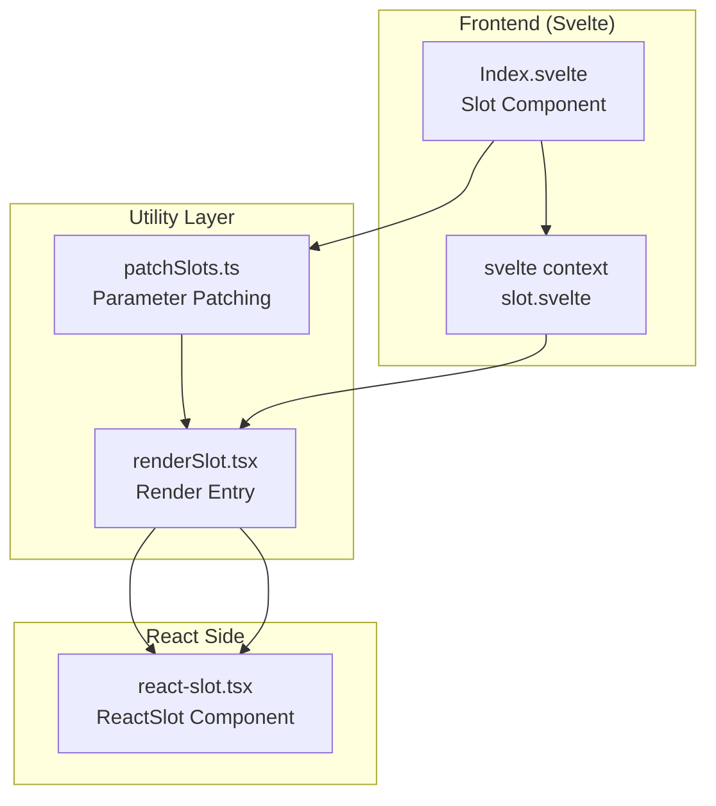
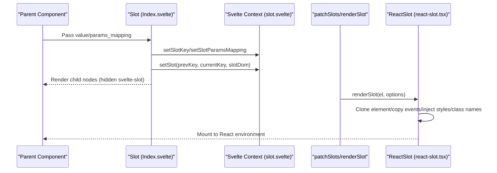
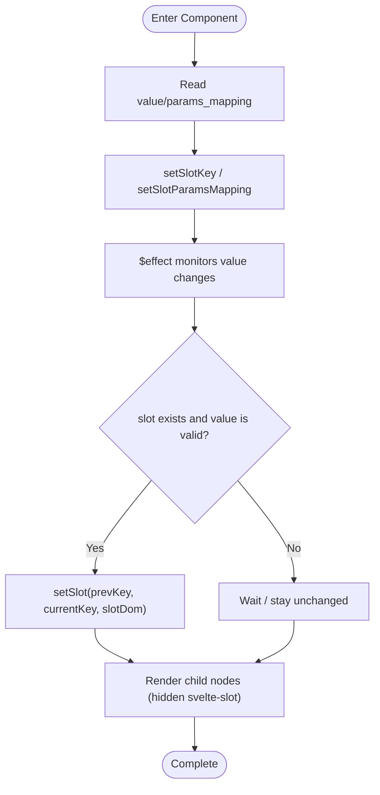
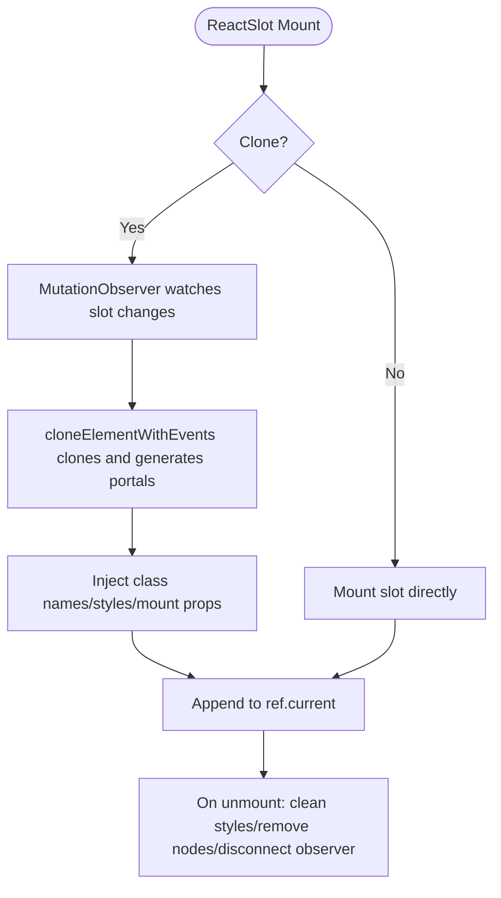
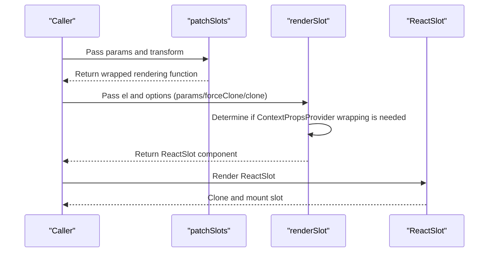
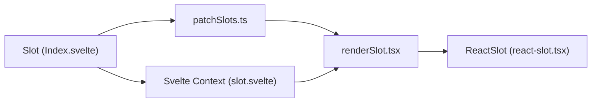

# Slot Component

<cite>
**Files Referenced in This Document**
- [frontend/base/slot/Index.svelte](file://frontend/base/slot/Index.svelte)
- [frontend/svelte-preprocess-react/react-slot.tsx](file://frontend/svelte-preprocess-react/react-slot.tsx)
- [frontend/utils/renderSlot.tsx](file://frontend/utils/renderSlot.tsx)
- [frontend/utils/patchSlots.ts](file://frontend/utils/patchSlots.ts)
- [docs/components/base/slot/README.md](file://docs/components/base/slot/README.md)
- [docs/components/base/slot/README-zh_CN.md](file://docs/components/base/slot/README-zh_CN.md)
- [docs/components/base/slot/demos/basic.py](file://docs/components/base/slot/demos/basic.py)
</cite>

## Table of Contents

1. [Introduction](#introduction)
2. [Project Structure](#project-structure)
3. [Core Components](#core-components)
4. [Architecture Overview](#architecture-overview)
5. [Detailed Component Analysis](#detailed-component-analysis)
6. [Dependency Analysis](#dependency-analysis)
7. [Performance Considerations](#performance-considerations)
8. [Troubleshooting Guide](#troubleshooting-guide)
9. [Conclusion](#conclusion)
10. [Appendix](#appendix)

## Introduction

This document systematically explains the Slot component, covering design philosophy, content distribution mechanism, dynamic insertion and custom rendering, slot types and scopes, parameter passing and data binding, communication with parent components, usage examples, best practices, performance optimization suggestions, differences and advantages over template systems, and debugging tips and solutions to common issues. Based on the Slot component implementation and documentation in the repository, combined with the frontend rendering pipeline and context mechanism, this document helps readers fully master the slot system from principles to practice.

## Project Structure

The Slot component is implemented in Svelte on the frontend, responsible for collecting the child tree and registering it into the parent component's slot context; during the rendering phase, ReactSlot clones and mounts the DOM structure rendered by Svelte into the React environment, implementing cross-framework content distribution and dynamic updates.

Diagram Sources

- [frontend/base/slot/Index.svelte:1-68](file://frontend/base/slot/Index.svelte#L1-L68)
- [frontend/utils/patchSlots.ts:1-32](file://frontend/utils/patchSlots.ts#L1-L32)
- [frontend/utils/renderSlot.tsx:1-29](file://frontend/utils/renderSlot.tsx#L1-L29)
- [frontend/svelte-preprocess-react/react-slot.tsx:1-224](file://frontend/svelte-preprocess-react/react-slot.tsx#L1-L224)

Section Sources

- [frontend/base/slot/Index.svelte:1-68](file://frontend/base/slot/Index.svelte#L1-L68)
- [frontend/utils/renderSlot.tsx:1-29](file://frontend/utils/renderSlot.tsx#L1-L29)
- [frontend/utils/patchSlots.ts:1-32](file://frontend/utils/patchSlots.ts#L1-L32)
- [frontend/svelte-preprocess-react/react-slot.tsx:1-224](file://frontend/svelte-preprocess-react/react-slot.tsx#L1-L224)

## Core Components

- Slot (Svelte): Receives the slot name and optional parameter mapping function from the parent component, registers itself as a "slot container" into the context, and renders child nodes when visibility allows.
- ReactSlot (React): In the React environment, receives the DOM fragment generated by Svelte, supports cloning, event copying, style and class name injection, and uses MutationObserver to observe changes and dynamically re-render.
- renderSlot: Provides a unified rendering entry, supporting force cloning, parameter passing, and context wrapping.
- patchSlots: Wraps slot rendering functions, prepending or appending additional parameters to slot callbacks in order, enabling parent components to pass context parameters to child slots.

Section Sources

- [frontend/base/slot/Index.svelte:1-68](file://frontend/base/slot/Index.svelte#L1-L68)
- [frontend/svelte-preprocess-react/react-slot.tsx:1-224](file://frontend/svelte-preprocess-react/react-slot.tsx#L1-L224)
- [frontend/utils/renderSlot.tsx:1-29](file://frontend/utils/renderSlot.tsx#L1-L29)
- [frontend/utils/patchSlots.ts:1-32](file://frontend/utils/patchSlots.ts#L1-L32)

## Architecture Overview

Slot's workflow is divided into a "registration phase" and a "rendering phase". Parent components register slot keys and parameter mappings via the context API; the Slot component collects the child tree in Svelte and binds it to the DOM; finally, ReactSlot clones and mounts in the React environment while maintaining event and style consistency.

Diagram Sources

- [frontend/base/slot/Index.svelte:32-54](file://frontend/base/slot/Index.svelte#L32-L54)
- [frontend/utils/patchSlots.ts:15-31](file://frontend/utils/patchSlots.ts#L15-L31)
- [frontend/utils/renderSlot.tsx:13-28](file://frontend/utils/renderSlot.tsx#L13-L28)
- [frontend/svelte-preprocess-react/react-slot.tsx:109-223](file://frontend/svelte-preprocess-react/react-slot.tsx#L109-L223)

## Detailed Component Analysis

### Slot Component (Svelte)

- Responsibilities
  - Receives slot name and parameter mapping function string.
  - Writes the current slot key and parameter mapping to the context for parent component consumption.
  - Renders child nodes when visible, but hides the actual `svelte-slot` container to avoid affecting layout.
- Key points
  - Uses context API to set slot key and parameter mapping.
  - Monitors slot name changes via `effect`, triggering `setSlot` registration.
  - Child nodes are bound to DOM via `svelte-slot bind:this`, enabling ReactSlot to clone and mount later.

Diagram Sources

- [frontend/base/slot/Index.svelte:31-61](file://frontend/base/slot/Index.svelte#L31-L61)

Section Sources

- [frontend/base/slot/Index.svelte:1-68](file://frontend/base/slot/Index.svelte#L1-L68)

### ReactSlot (React)

- Responsibilities
  - Receives the slot DOM generated by Svelte, supports cloning and event copying.
  - Injects styles and class names, handles React Portal for correct subtree mounting.
  - Uses MutationObserver to monitor slot changes and automatically re-clones and renders.
- Key points
  - `cloneElementWithEvents`: Recursively clones nodes, copies event listeners, handles nested `svelte-slot`.
  - `mountElementProps`: Mounts class names and inline styles after cloning.
  - `observeAttributes`: Optionally observes attribute changes, combined with debounce for improved stability.

Diagram Sources

- [frontend/svelte-preprocess-react/react-slot.tsx:109-223](file://frontend/svelte-preprocess-react/react-slot.tsx#L109-L223)

Section Sources

- [frontend/svelte-preprocess-react/react-slot.tsx:1-224](file://frontend/svelte-preprocess-react/react-slot.tsx#L1-L224)

### Parameter Patching and Render Entry

- patchSlots
  - Wraps slot rendering functions, supporting prepending/appending external parameters to slot callbacks.
  - Used for parent components to pass context parameters to child slots, enhancing slot configurability.
- renderSlot
  - Provides a unified entry, supporting force cloning, parameter passing, and context wrapping.
  - When `params` or `forceClone` is passed, wraps ReactSlot with `ContextPropsProvider` to ensure rendering consistency.

Diagram Sources

- [frontend/utils/patchSlots.ts:15-31](file://frontend/utils/patchSlots.ts#L15-L31)
- [frontend/utils/renderSlot.tsx:13-28](file://frontend/utils/renderSlot.tsx#L13-L28)
- [frontend/svelte-preprocess-react/react-slot.tsx:109-223](file://frontend/svelte-preprocess-react/react-slot.tsx#L109-L223)

Section Sources

- [frontend/utils/patchSlots.ts:1-32](file://frontend/utils/patchSlots.ts#L1-L32)
- [frontend/utils/renderSlot.tsx:1-29](file://frontend/utils/renderSlot.tsx#L1-L29)

## Dependency Analysis

- Component coupling
  - Slot depends on the Svelte context API for slot registration and parameter mapping setting.
  - ReactSlot depends on the structural characteristics of the slot DOM (such as internal portals and `svelte-slot` tags) for correct parsing and cloning.
  - `renderSlot` and `patchSlots` provide general capabilities for the rendering pipeline, decoupled from specific components.
- External dependencies
  - React, ReactDOM (Portal), MutationObserver, lodash-es (debounce and object judgment).
- Potential circular dependencies
  - Avoided through utility layer and context layer separation, preventing direct circular references between components.

Diagram Sources

- [frontend/base/slot/Index.svelte:1-68](file://frontend/base/slot/Index.svelte#L1-L68)
- [frontend/utils/patchSlots.ts:1-32](file://frontend/utils/patchSlots.ts#L1-L32)
- [frontend/utils/renderSlot.tsx:1-29](file://frontend/utils/renderSlot.tsx#L1-L29)
- [frontend/svelte-preprocess-react/react-slot.tsx:1-224](file://frontend/svelte-preprocess-react/react-slot.tsx#L1-L224)

Section Sources

- [frontend/base/slot/Index.svelte:1-68](file://frontend/base/slot/Index.svelte#L1-L68)
- [frontend/utils/patchSlots.ts:1-32](file://frontend/utils/patchSlots.ts#L1-L32)
- [frontend/utils/renderSlot.tsx:1-29](file://frontend/utils/renderSlot.tsx#L1-L29)
- [frontend/svelte-preprocess-react/react-slot.tsx:1-224](file://frontend/svelte-preprocess-react/react-slot.tsx#L1-L224)

## Performance Considerations

- Clone strategy
  - Cloning brings extra DOM operations and event copying costs. Only enable `clone` when necessary to avoid unnecessary re-renders.
- Observer and debounce
  - MutationObserver combined with debounce can reduce repeated cloning caused by frequent changes; it is recommended to enable `observeAttributes` and set a reasonable debounce interval in complex tables or high-frequency update scenarios.
- Style and class name injection
  - Batch injecting styles and class names is better than individual operations, avoiding multiple reflows.
- Parameter passing
  - Using `patchSlots` to prepend/append parameters reduces extra wrapping in intermediate layers, lowering the function call stack depth.

## Troubleshooting Guide

- Slot not working
  - Check if the parent component has correctly registered the slot key and parameter mapping.
  - Confirm if the Slot component's `value` is empty or unchanged (the `effect` only registers on change).
- Styles missing or class names not taking effect
  - Confirm if ReactSlot correctly injected `className` and inline styles.
  - Check for style isolation or overriding.
- Events not responding
  - Confirm if `clone` is enabled; event copying logic depends on the cloning path.
  - Check if event listeners have been overridden or removed.
- Updates not taking effect
  - Confirm if `observeAttributes` is enabled, and if MutationObserver has been disconnected.
  - Check if external code directly modified slot content without triggering observation.

Section Sources

- [frontend/svelte-preprocess-react/react-slot.tsx:156-212](file://frontend/svelte-preprocess-react/react-slot.tsx#L156-L212)
- [frontend/base/slot/Index.svelte:31-61](file://frontend/base/slot/Index.svelte#L31-L61)

## Conclusion

The Slot component implements cross-framework content distribution and dynamic rendering through Svelte and React bridging. Its design emphasizes:

- Clear slot registration and parameter mapping mechanism;
- Stable rendering based on cloning and event copying;
- Optional observer and debounce strategies, balancing flexibility and performance;
- Utility layer abstraction (patchSlots, renderSlot) improving reusability and maintainability.

## Appendix

### Slot Types and Scopes

- Slot types
  - Named slots: Specify slot name via `value`; parent component receives by name.
  - Nested slots: Child slots can contain slots again, forming multi-level content distribution.
- Scopes
  - `params_mapping` supports mapping parent component context parameters to slot scope, enabling parameter-driven rendering.

Section Sources

- [docs/components/base/slot/README.md:13-16](file://docs/components/base/slot/README.md#L13-L16)
- [docs/components/base/slot/README-zh_CN.md:13-16](file://docs/components/base/slot/README-zh_CN.md#L13-L16)

### Data Binding and Parent Component Communication

- Parent components register slot keys and parameter mappings via the context API.
- The Slot component collects the child tree in Svelte and completes registration through `setSlot`.
- ReactSlot clones and mounts during the rendering phase, maintaining event and style consistency.

Section Sources

- [frontend/base/slot/Index.svelte:32-54](file://frontend/base/slot/Index.svelte#L32-L54)
- [frontend/svelte-preprocess-react/react-slot.tsx:109-223](file://frontend/svelte-preprocess-react/react-slot.tsx#L109-L223)

### Usage Examples

- Basic example: Insert title and extra button and icon slots into a Card component.
- Example path: [docs/components/base/slot/demos/basic.py:1-23](file://docs/components/base/slot/demos/basic.py#L1-L23)

Section Sources

- [docs/components/base/slot/demos/basic.py:1-23](file://docs/components/base/slot/demos/basic.py#L1-L23)

### Best Practices

- Only enable `clone` and `observeAttributes` when necessary, avoiding excessive rendering.
- Use `patchSlots` to prepend/append parameters, reducing intermediate wrapping.
- For complex tables and other high-frequency update scenarios, enable `observeAttributes` with debounce.
- Maintain the uniqueness and stability of slot keys, avoiding conflicts caused by duplicate registration.

### Differences and Advantages Over Template Systems

- Differences
  - Template systems usually determine structure at compile time; the slot system dynamically distributes content at runtime.
- Advantages
  - Stronger composability and extensibility, suitable for cross-framework and multi-component collaboration.
  - Parameter mapping and context injection give slots stronger expressiveness and control.
