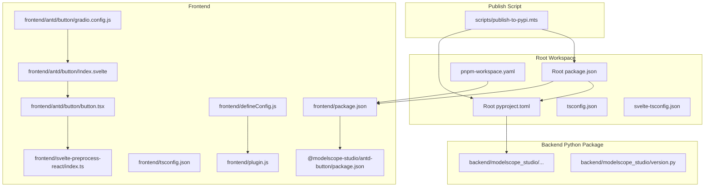
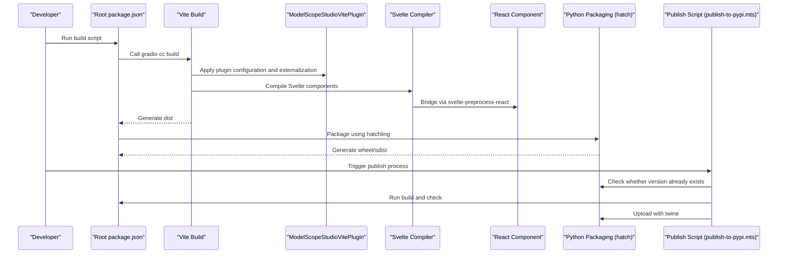
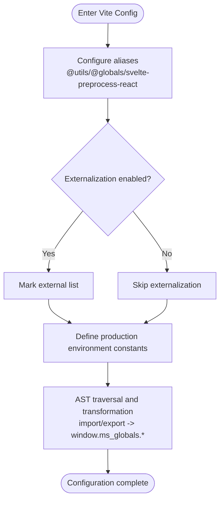
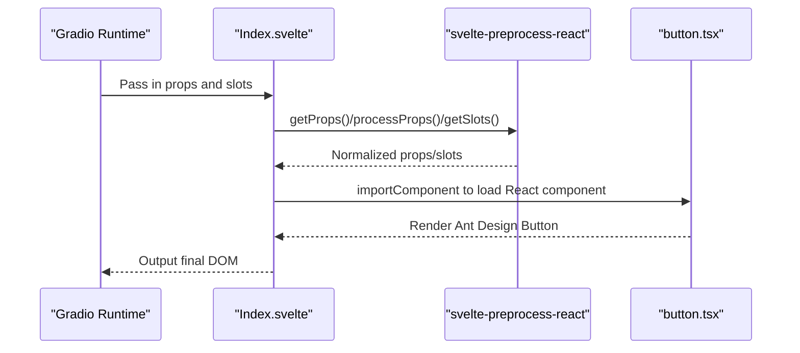
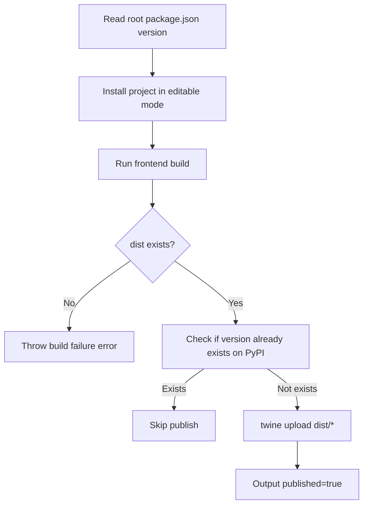
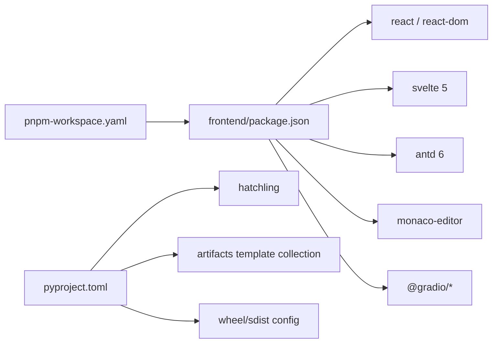

# Build Process

<cite>
**Files referenced in this document**
- [package.json](file://package.json)
- [pyproject.toml](file://pyproject.toml)
- [frontend/package.json](file://frontend/package.json)
- [frontend/defineConfig.js](file://frontend/defineConfig.js)
- [frontend/plugin.js](file://frontend/plugin.js)
- [frontend/tsconfig.json](file://frontend/tsconfig.json)
- [svelte-tsconfig.json](file://svelte-tsconfig.json)
- [pnpm-workspace.yaml](file://pnpm-workspace.yaml)
- [backend/modelscope_studio/version.py](file://backend/modelscope_studio/version.py)
- [scripts/publish-to-pypi.mts](file://scripts/publish-to-pypi.mts)
- [frontend/antd/button/package.json](file://frontend/antd/button/package.json)
- [frontend/antd/button/gradio.config.js](file://frontend/antd/button/gradio.config.js)
- [frontend/antd/button/Index.svelte](file://frontend/antd/button/Index.svelte)
- [frontend/antd/button/button.tsx](file://frontend/antd/button/button.tsx)
- [frontend/svelte-preprocess-react/index.ts](file://frontend/svelte-preprocess-react/index.ts)
</cite>

## Table of Contents

1. [Introduction](#introduction)
2. [Project Structure](#project-structure)
3. [Core Components](#core-components)
4. [Architecture Overview](#architecture-overview)
5. [Detailed Component Analysis](#detailed-component-analysis)
6. [Dependency Analysis](#dependency-analysis)
7. [Performance Considerations](#performance-considerations)
8. [Troubleshooting Guide](#troubleshooting-guide)
9. [Conclusion](#conclusion)
10. [Appendix](#appendix)

## Introduction

This document is intended for developers and operators who need to understand and maintain the build mechanism of ModelScope Studio. It systematically covers the following topics:

- Frontend component build process: Vite configuration, Svelte component compilation, and React component bridging (svelte-preprocess-react).
- Python package build process: dependency installation, packaging configuration, version management, and publish scripts.
- Local build environment setup: key points for installing and configuring Node.js, Python, and pnpm.
- Build optimization techniques and performance tuning recommendations.
- Common build failure causes and solutions.

## Project Structure

The project is organized as a multi-package workspace (pnpm workspace). Core directories and their responsibilities:

- **Root-level scripts and configuration**: package.json, pyproject.toml, pnpm-workspace.yaml, tsconfig.json, svelte-tsconfig.json.
- **Frontend**: the `frontend` directory and its sub-packages (antd, antdx, base, pro), plus the svelte-preprocess-react bridging layer.
- **Backend Python package**: backend/modelscope_studio, containing numerous component templates and version information.
- **Publish script**: scripts/publish-to-pypi.mts, used for building and publishing in CI.

**Diagram sources**

- [package.json:1-55](file://package.json#L1-L55)
- [pyproject.toml:1-257](file://pyproject.toml#L1-L257)
- [pnpm-workspace.yaml:1-12](file://pnpm-workspace.yaml#L1-L12)
- [frontend/package.json:1-59](file://frontend/package.json#L1-L59)
- [frontend/defineConfig.js:1-19](file://frontend/defineConfig.js#L1-L19)
- [frontend/plugin.js:1-168](file://frontend/plugin.js#L1-L168)
- [frontend/tsconfig.json:1-8](file://frontend/tsconfig.json#L1-L8)
- [svelte-tsconfig.json:1-4](file://svelte-tsconfig.json#L1-L4)
- [frontend/antd/button/package.json:1-15](file://frontend/antd/button/package.json#L1-L15)
- [frontend/antd/button/gradio.config.js:1-4](file://frontend/antd/button/gradio.config.js#L1-L4)
- [frontend/antd/button/Index.svelte:1-74](file://frontend/antd/button/Index.svelte#L1-L74)
- [frontend/antd/button/button.tsx:1-39](file://frontend/antd/button/button.tsx#L1-L39)
- [frontend/svelte-preprocess-react/index.ts:1-8](file://frontend/svelte-preprocess-react/index.ts#L1-L8)
- [backend/modelscope_studio/version.py:1-2](file://backend/modelscope_studio/version.py#L1-L2)
- [scripts/publish-to-pypi.mts:1-60](file://scripts/publish-to-pypi.mts#L1-L60)

**Section sources**

- [package.json:1-55](file://package.json#L1-L55)
- [pyproject.toml:1-257](file://pyproject.toml#L1-L257)
- [pnpm-workspace.yaml:1-12](file://pnpm-workspace.yaml#L1-L12)
- [frontend/package.json:1-59](file://frontend/package.json#L1-L59)
- [frontend/defineConfig.js:1-19](file://frontend/defineConfig.js#L1-L19)
- [frontend/plugin.js:1-168](file://frontend/plugin.js#L1-L168)
- [frontend/tsconfig.json:1-8](file://frontend/tsconfig.json#L1-L8)
- [svelte-tsconfig.json:1-4](file://svelte-tsconfig.json#L1-L4)

## Core Components

- **Root build scripts and commands**: Defined in the root `package.json`, providing a unified entry point for build, dev, version, and publish-related scripts.
- **Frontend Vite plugin**: `ModelScopeStudioVitePlugin` handles alias resolution, externalization, global variable mapping, and code transformation.
- **Svelte component bridge**: `svelte-preprocess-react` enables React components to be used in a Svelte style, handling slot and prop pass-through.
- **Python packaging**: `pyproject.toml` uses hatchling as the build backend, declaring `artifacts` and wheel inclusion paths to ensure template assets are correctly packaged.
- **Version management**: The Python package version is kept in sync with the frontend version, reflected jointly by `backend/modelscope_studio/version.py` and the root `package.json` version field.

**Section sources**

- [package.json:8-25](file://package.json#L8-L25)
- [frontend/plugin.js:41-168](file://frontend/plugin.js#L41-L168)
- [frontend/svelte-preprocess-react/index.ts:1-8](file://frontend/svelte-preprocess-react/index.ts#L1-L8)
- [pyproject.toml:45-257](file://pyproject.toml#L45-L257)
- [backend/modelscope_studio/version.py:1-2](file://backend/modelscope_studio/version.py#L1-L2)

## Architecture Overview

The diagram below shows the overall flow from "build command" to "artifact output", covering frontend Vite builds, React component bridging, Python packaging, and the publish script.

**Diagram sources**

- [package.json:8-25](file://package.json#L8-L25)
- [frontend/defineConfig.js:5-18](file://frontend/defineConfig.js#L5-L18)
- [frontend/plugin.js:41-76](file://frontend/plugin.js#L41-L76)
- [frontend/antd/button/Index.svelte:10-55](file://frontend/antd/button/Index.svelte#L10-L55)
- [frontend/antd/button/button.tsx:1-39](file://frontend/antd/button/button.tsx#L1-L39)
- [pyproject.toml:45-257](file://pyproject.toml#L45-L257)
- [scripts/publish-to-pypi.mts:22-55](file://scripts/publish-to-pypi.mts#L22-L55)

## Detailed Component Analysis

### Frontend Vite Build and Plugin

- **Configuration entry**: `defineConfig.js` exports a function that returns a Vite default config object, integrating the React plugin and the custom `ModelScopeStudioVitePlugin`.
- **Plugin capabilities**:
  - **Alias resolution**: `@utils`, `@globals`, `svelte-preprocess-react`.
  - **Externalization strategy**: Marks a predefined set of modules as `external` during the build phase and injects global variable mappings, reducing bundle size.
  - **Code transformation**: Traverses the AST and rewrites imports/exports to `window.ms_globals.*` accesses, enabling runtime dependency sharing.
- **Types and checking**: The frontend `tsconfig.json` extends the root tsconfig and enables ESNext module types; `svelte-tsconfig.json` is used for Svelte type checking.

**Diagram sources**

- [frontend/defineConfig.js:5-18](file://frontend/defineConfig.js#L5-L18)
- [frontend/plugin.js:41-76](file://frontend/plugin.js#L41-L76)
- [frontend/plugin.js:77-167](file://frontend/plugin.js#L77-L167)
- [frontend/tsconfig.json:1-8](file://frontend/tsconfig.json#L1-L8)
- [svelte-tsconfig.json:1-4](file://svelte-tsconfig.json#L1-L4)

**Section sources**

- [frontend/defineConfig.js:1-19](file://frontend/defineConfig.js#L1-L19)
- [frontend/plugin.js:1-168](file://frontend/plugin.js#L1-L168)
- [frontend/tsconfig.json:1-8](file://frontend/tsconfig.json#L1-L8)
- [svelte-tsconfig.json:1-4](file://svelte-tsconfig.json#L1-L4)

### Svelte Component Compilation and React Bridging

- **Component export**: Each frontend component package declares its Gradio entry (`Index.svelte`) via the `exports` field in its `package.json`.
- **Configuration inheritance**: The component-level `gradio.config.js` generates a unified configuration through `defineConfig`.
- **Component implementation**:
  - **Svelte layer**: `Index.svelte` uses APIs from `svelte-preprocess-react` such as `getProps`, `processProps`, and `getSlots` to transform props and slots passed in by Gradio into forms usable by React components.
  - **React layer**: `button.tsx` uses `sveltify` to wrap the Ant Design Button so it can be used by Svelte, supporting slots and children rendering.
- **Slots and props**: Complex child nodes and icon slots are rendered via `ReactSlot` and `useTargets`.

**Diagram sources**

- [frontend/antd/button/package.json:1-15](file://frontend/antd/button/package.json#L1-L15)
- [frontend/antd/button/gradio.config.js:1-4](file://frontend/antd/button/gradio.config.js#L1-L4)
- [frontend/antd/button/Index.svelte:10-55](file://frontend/antd/button/Index.svelte#L10-L55)
- [frontend/antd/button/button.tsx:1-39](file://frontend/antd/button/button.tsx#L1-L39)
- [frontend/svelte-preprocess-react/index.ts:1-8](file://frontend/svelte-preprocess-react/index.ts#L1-L8)

**Section sources**

- [frontend/antd/button/package.json:1-15](file://frontend/antd/button/package.json#L1-L15)
- [frontend/antd/button/gradio.config.js:1-4](file://frontend/antd/button/gradio.config.js#L1-L4)
- [frontend/antd/button/Index.svelte:1-74](file://frontend/antd/button/Index.svelte#L1-L74)
- [frontend/antd/button/button.tsx:1-39](file://frontend/antd/button/button.tsx#L1-L39)
- [frontend/svelte-preprocess-react/index.ts:1-8](file://frontend/svelte-preprocess-react/index.ts#L1-L8)

### Python Package Build and Publish

- **Build backend**: `pyproject.toml` uses hatchling as the build backend, together with `hatch-requirements-txt` and `hatch-fancy-pypi-readme`.
- **Dependencies and metadata**: Declares Python version requirements, license, keywords, classifiers, and core dependencies (such as Gradio).
- **Packaging scope**: `tool.hatch.build.artifacts` explicitly lists numerous template directories to ensure frontend component templates are distributed with the package; wheel/sdist inclusion and exclusion rules are clearly defined.
- **Version synchronization**: The Python package version is kept in sync with the frontend version for unified publishing and tracking.
- **Publish script**: `scripts/publish-to-pypi.mts` handles installation, building, version checking, and twine upload in CI, preventing duplicate publishing.

**Diagram sources**

- [pyproject.toml:1-44](file://pyproject.toml#L1-L44)
- [pyproject.toml:45-257](file://pyproject.toml#L45-L257)
- [backend/modelscope_studio/version.py:1-2](file://backend/modelscope_studio/version.py#L1-L2)
- [scripts/publish-to-pypi.mts:14-55](file://scripts/publish-to-pypi.mts#L14-L55)

**Section sources**

- [pyproject.toml:1-257](file://pyproject.toml#L1-L257)
- [backend/modelscope_studio/version.py:1-2](file://backend/modelscope_studio/version.py#L1-L2)
- [scripts/publish-to-pypi.mts:1-60](file://scripts/publish-to-pypi.mts#L1-L60)

## Dependency Analysis

- **Workspace and package management**: `pnpm-workspace.yaml` declares the root, config, frontend, and sub-packages, ensuring cross-package reference and build consistency.
- **Frontend dependencies**: `frontend/package.json` specifies core dependencies such as React 19, Svelte 5, Ant Design 6, and Monaco Editor.
- **Externalization and aliases**: `ModelScopeStudioVitePlugin` maps React, ReactDOM, antd, antdx, etc. to `window.ms_globals.*`, reducing duplicate bundling.
- **Python dependencies**: `pyproject.toml` declares only the Gradio dependency; other frontend assets are bundled via artifacts and template directories.

**Diagram sources**

- [pnpm-workspace.yaml:1-12](file://pnpm-workspace.yaml#L1-L12)
- [frontend/package.json:8-40](file://frontend/package.json#L8-L40)
- [pyproject.toml:1-44](file://pyproject.toml#L1-L44)
- [pyproject.toml:45-257](file://pyproject.toml#L45-L257)

**Section sources**

- [pnpm-workspace.yaml:1-12](file://pnpm-workspace.yaml#L1-L12)
- [frontend/package.json:1-59](file://frontend/package.json#L1-L59)
- [pyproject.toml:1-257](file://pyproject.toml#L1-L257)

## Performance Considerations

- **Externalization and shared dependencies**: Through `ModelScopeStudioVitePlugin`'s external configuration and global mappings, large packages such as React and antd are not bundled repeatedly, significantly reducing artifact size and build time.
- **AST transformation and lazy loading**: Rewriting imports/exports to global access at build time, combined with dynamic `import` (e.g., `importComponent`), enables lazy loading and improves initial load performance.
- **Module aliases**: Using `@utils`, `@globals`, and `svelte-preprocess-react` aliases appropriately reduces path resolution overhead.
- **Packaging granularity**: Precisely listing template directories in `artifacts` prevents unrelated files from entering the package, shortening packaging and publish time.
- **Type checking**: Enabling `svelte-check` and TypeScript type checking catches type issues early, reducing the cost of rollbacks caused by runtime errors.

[This section provides general performance recommendations and does not directly reference specific files, so no "Section sources" are listed.]

## Troubleshooting Guide

- **Build failure (dist does not exist)**
  - Symptom: The publish script reports "Build Failed".
  - Investigation: Confirm that the frontend build command completed successfully; check whether `defineConfig` and plugin configuration are correctly applied.
  - References:
    - [scripts/publish-to-pypi.mts:22-30](file://scripts/publish-to-pypi.mts#L22-L30)
    - [frontend/defineConfig.js:8-18](file://frontend/defineConfig.js#L8-L18)
- **Duplicate version publish**
  - Symptom: The same version already exists on PyPI; the script skips publishing.
  - Investigation: Confirm that the version number has not been changed, or manually clear the cache.
  - References:
    - [scripts/publish-to-pypi.mts:44-51](file://scripts/publish-to-pypi.mts#L44-L51)
- **Missing externalized dependency**
  - Symptom: Runtime error — `window.ms_globals` is not defined.
  - Investigation: Check the `external`/`excludes` configuration in `ModelScopeStudioVitePlugin` to confirm the global mapping covers all required dependencies.
  - References:
    - [frontend/plugin.js:41-76](file://frontend/plugin.js#L41-L76)
    - [frontend/plugin.js:5-20](file://frontend/plugin.js#L5-L20)
- **Svelte/React slot rendering issue**
  - Symptom: Slot content is not displayed, or icons/loading states do not work.
  - Investigation: Confirm that `getProps`/`processProps`/`getSlots` in `Index.svelte` are used correctly, and that `ReactSlot` and `useTargets` in `button.tsx` behave as expected.
  - References:
    - [frontend/antd/button/Index.svelte:10-55](file://frontend/antd/button/Index.svelte#L10-L55)
    - [frontend/antd/button/button.tsx:11-36](file://frontend/antd/button/button.tsx#L11-L36)
- **Python packaging missing templates**
  - Symptom: Component templates are missing after installation.
  - Investigation: Cross-check the `artifacts` list in `pyproject.toml` against the wheel/sdist inclusion paths.
  - References:
    - [pyproject.toml:45-257](file://pyproject.toml#L45-L257)

**Section sources**

- [scripts/publish-to-pypi.mts:22-51](file://scripts/publish-to-pypi.mts#L22-L51)
- [frontend/plugin.js:5-20](file://frontend/plugin.js#L5-L20)
- [frontend/antd/button/Index.svelte:10-55](file://frontend/antd/button/Index.svelte#L10-L55)
- [frontend/antd/button/button.tsx:11-36](file://frontend/antd/button/button.tsx#L11-L36)
- [pyproject.toml:45-257](file://pyproject.toml#L45-L257)

## Conclusion

The build system of this project revolves around a combination of "frontend Vite + Svelte + React bridging + Python packaging". Through externalized shared dependencies, AST transformation, and a precise template packaging strategy, it achieves efficient builds and stable runtime behavior. Following the configuration and troubleshooting recommendations in this document will effectively improve build stability and performance in both local and CI environments.

[This section contains summary content and does not directly reference specific files, so no "Section sources" are listed.]

## Appendix

### Local Build Environment Setup

- **Node.js**
  - Version requirements: must satisfy the needs of frontend dependencies (React 19, Svelte 5, Ant Design 6).
  - Package manager: use pnpm, consistent with the workspace configuration.
  - References:
    - [pnpm-workspace.yaml:1-12](file://pnpm-workspace.yaml#L1-L12)
    - [frontend/package.json:8-40](file://frontend/package.json#L8-L40)
- **Python**
  - Version requirements: must satisfy `requires-python` in `pyproject.toml`.
  - Build tools: install hatchling and twine to ensure they are executable.
  - References:
    - [pyproject.toml:1-7](file://pyproject.toml#L1-L7)
    - [pyproject.toml:42-43](file://pyproject.toml#L42-L43)
- **Frontend build**
  - Run root scripts for building and development, ensuring that `defineConfig` and the plugin load correctly.
  - References:
    - [package.json:8-25](file://package.json#L8-L25)
    - [frontend/defineConfig.js:5-18](file://frontend/defineConfig.js#L5-L18)
    - [frontend/plugin.js:41-76](file://frontend/plugin.js#L41-L76)

**Section sources**

- [pnpm-workspace.yaml:1-12](file://pnpm-workspace.yaml#L1-L12)
- [frontend/package.json:1-59](file://frontend/package.json#L1-L59)
- [pyproject.toml:1-44](file://pyproject.toml#L1-L44)
- [package.json:8-25](file://package.json#L8-L25)
- [frontend/defineConfig.js:1-19](file://frontend/defineConfig.js#L1-L19)
- [frontend/plugin.js:1-168](file://frontend/plugin.js#L1-L168)
