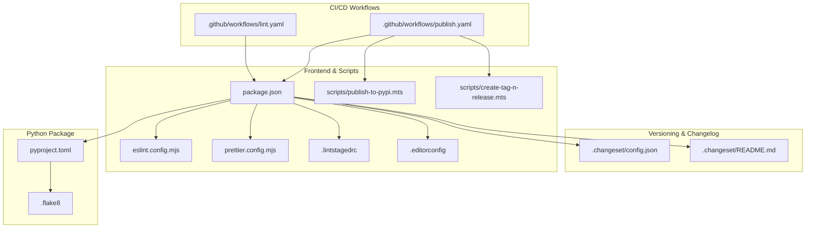
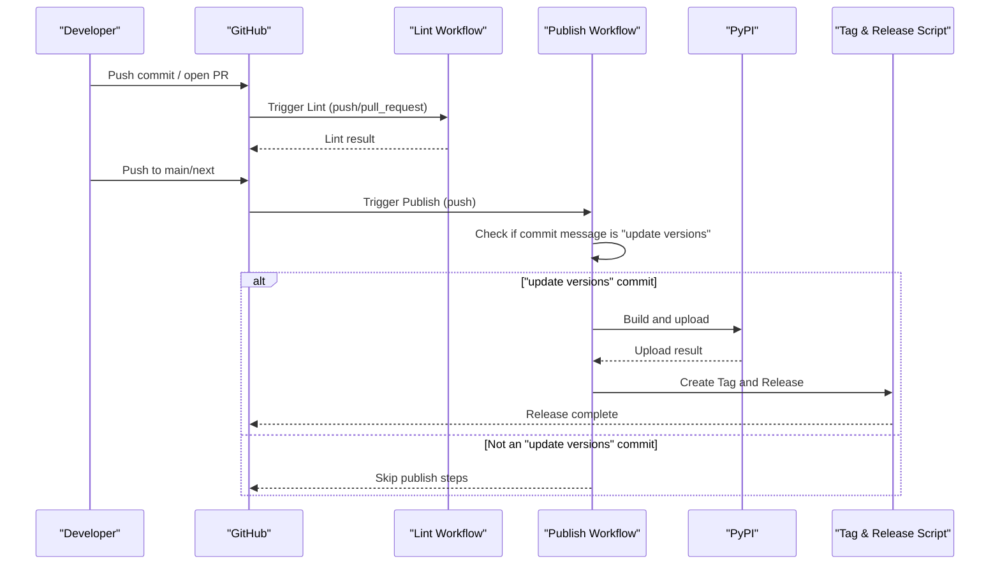
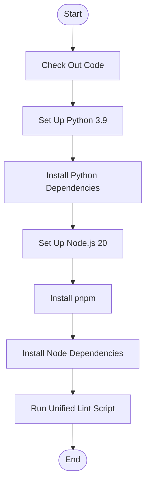
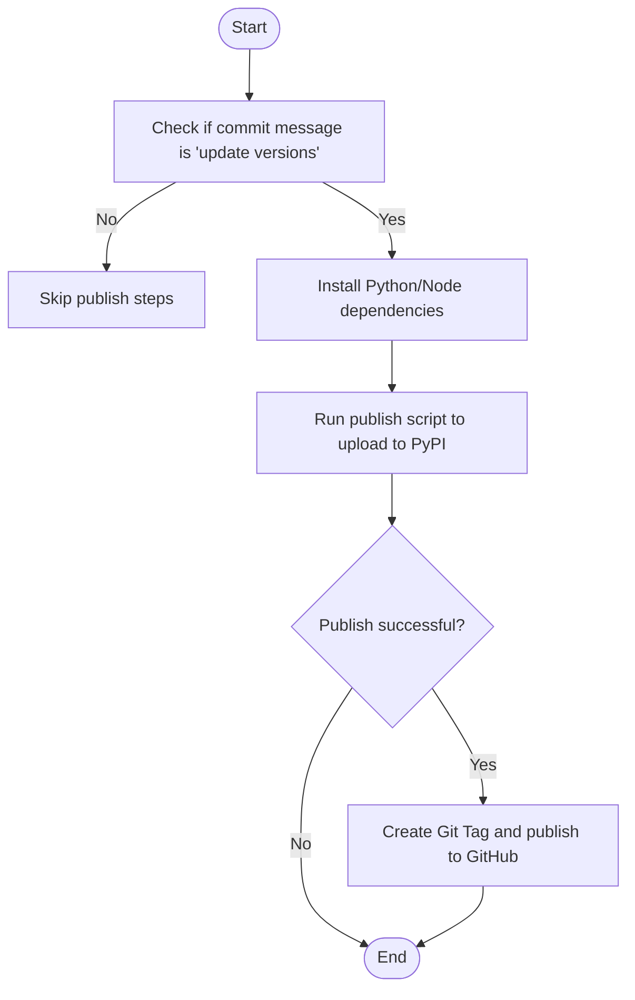
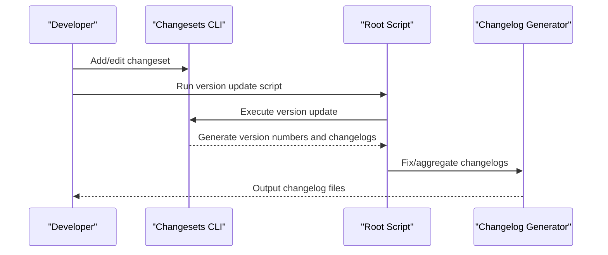
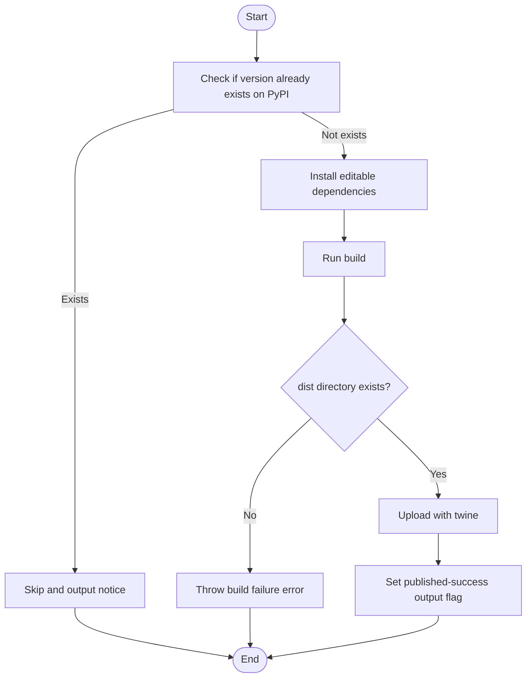
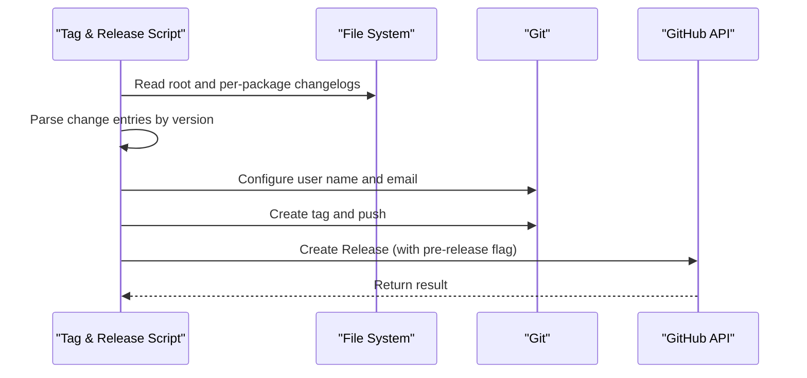
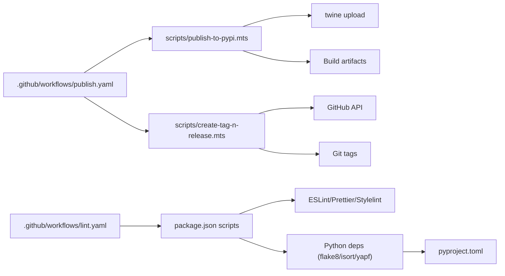

# CI/CD

<cite>
**Files referenced in this document**
- [.github/workflows/lint.yaml](file://.github/workflows/lint.yaml)
- [.github/workflows/publish.yaml](file://.github/workflows/publish.yaml)
- [.changeset/config.json](file://.changeset/config.json)
- [.changeset/README.md](file://.changeset/README.md)
- [package.json](file://package.json)
- [pyproject.toml](file://pyproject.toml)
- [scripts/publish-to-pypi.mts](file://scripts/publish-to-pypi.mts)
- [scripts/create-tag-n-release.mts](file://scripts/create-tag-n-release.mts)
- [eslint.config.mjs](file://eslint.config.mjs)
- [prettier.config.mjs](file://prettier.config.mjs)
- [.flake8](file://.flake8)
- [config/lint-config/eslint.mjs](file://config/lint-config/eslint.mjs)
- [.commitlintrc.js](file://.commitlintrc.js)
- [.lintstagedrc](file://.lintstagedrc)
- [.editorconfig](file://.editorconfig)
</cite>

## Table of Contents

1. [Introduction](#introduction)
2. [Project Structure](#project-structure)
3. [Core Components](#core-components)
4. [Architecture Overview](#architecture-overview)
5. [Detailed Component Analysis](#detailed-component-analysis)
6. [Dependency Analysis](#dependency-analysis)
7. [Performance Considerations](#performance-considerations)
8. [Troubleshooting Guide](#troubleshooting-guide)
9. [Conclusion](#conclusion)
10. [Appendix](#appendix)

## Introduction

This document is intended for developers and operators who need to configure and maintain automated pipelines for ModelScope Studio. It systematically covers the following topics:

- GitHub Actions workflows: configuration and execution logic for Lint and Publish
- Lint workflow integration: how ESLint, Prettier, Flake8, isort, yapf, and other tools are used in CI
- Publish workflow: version detection, build validation, PyPI publishing, tag and release creation
- Changesets usage: version updates, changelog generation, and release tag creation
- Custom workflows: how to extend and customize existing pipelines
- Troubleshooting and performance optimization recommendations

## Project Structure

The repository is a polyglot project: the frontend is built on Svelte/TypeScript, the backend is a Python package. Version and changelog management is unified through Changesets, and CI/CD is implemented with GitHub Actions.

Diagram sources

- [.github/workflows/lint.yaml:1-34](file://.github/workflows/lint.yaml#L1-L34)
- [.github/workflows/publish.yaml:1-74](file://.github/workflows/publish.yaml#L1-L74)
- [.changeset/config.json:1-15](file://.changeset/config.json#L1-L15)
- [.changeset/README.md:1-9](file://.changeset/README.md#L1-L9)
- [package.json:1-55](file://package.json#L1-L55)
- [pyproject.toml:1-257](file://pyproject.toml#L1-L257)
- [scripts/publish-to-pypi.mts:1-60](file://scripts/publish-to-pypi.mts#L1-L60)
- [scripts/create-tag-n-release.mts:1-131](file://scripts/create-tag-n-release.mts#L1-L131)
- [eslint.config.mjs:1-9](file://eslint.config.mjs#L1-L9)
- [prettier.config.mjs:1-26](file://prettier.config.mjs#L1-L26)
- [.lintstagedrc:1-7](file://.lintstagedrc#L1-L7)
- [.editorconfig:1-17](file://.editorconfig#L1-L17)
- [.flake8:1-16](file://.flake8#L1-L16)

Section sources

- [.github/workflows/lint.yaml:1-34](file://.github/workflows/lint.yaml#L1-L34)
- [.github/workflows/publish.yaml:1-74](file://.github/workflows/publish.yaml#L1-L74)
- [package.json:1-55](file://package.json#L1-L55)
- [pyproject.toml:1-257](file://pyproject.toml#L1-L257)

## Core Components

- **Lint Workflow**: Triggered on push and pull requests. Installs Python and Node dependencies, then runs the unified lint script.
- **Publish Workflow**: Triggered on pushes to main/next branches. Determines whether to execute version updates and publishing based on the commit message, and ultimately creates a Git tag and GitHub Release.
- **Changesets**: Centralized version and changelog management. Works with scripts to write version numbers and fix changelogs.
- **Publish Script**: Checks whether the target version already exists on PyPI, builds artifacts, uploads to PyPI, and sets a published output flag for downstream steps.
- **Tag & Release Script**: Aggregates changelogs from all packages, creates a Git tag, and creates a GitHub Release.

Section sources

- [.github/workflows/lint.yaml:1-34](file://.github/workflows/lint.yaml#L1-L34)
- [.github/workflows/publish.yaml:1-74](file://.github/workflows/publish.yaml#L1-L74)
- [package.json:8-25](file://package.json#L8-L25)
- [scripts/publish-to-pypi.mts:1-60](file://scripts/publish-to-pypi.mts#L1-L60)
- [scripts/create-tag-n-release.mts:1-131](file://scripts/create-tag-n-release.mts#L1-L131)
- [.changeset/config.json:1-15](file://.changeset/config.json#L1-L15)

## Architecture Overview

The diagram below shows the critical path and decision points from code commit to release.

Diagram sources

- [.github/workflows/lint.yaml:1-34](file://.github/workflows/lint.yaml#L1-L34)
- [.github/workflows/publish.yaml:1-74](file://.github/workflows/publish.yaml#L1-L74)
- [scripts/publish-to-pypi.mts:1-60](file://scripts/publish-to-pypi.mts#L1-L60)
- [scripts/create-tag-n-release.mts:1-131](file://scripts/create-tag-n-release.mts#L1-L131)

## Detailed Component Analysis

### Lint Workflow Configuration and Execution

- **Trigger conditions**: push and pull_request
- **Concurrency control**: Only one running instance is retained per workflow per branch
- **Step overview**:
  - Check out code (full history)
  - Install Python dependencies (flake8, isort, yapf)
  - Install Node.js and pnpm
  - Install Node dependencies
  - Run the unified lint script (JS/TS linting and formatting run in parallel)

Diagram sources

- [.github/workflows/lint.yaml:1-34](file://.github/workflows/lint.yaml#L1-L34)

Section sources

- [.github/workflows/lint.yaml:1-34](file://.github/workflows/lint.yaml#L1-L34)
- [package.json:18-22](file://package.json#L18-L22)
- [.lintstagedrc:1-7](file://.lintstagedrc#L1-L7)
- [.editorconfig:1-17](file://.editorconfig#L1-L17)
- [.flake8:1-16](file://.flake8#L1-L16)

### Publish Workflow Configuration and Execution

- **Trigger conditions**: Push to main or next branch
- **Concurrency control**: Independent group to avoid concurrent conflicts
- **Key steps**:
  - **Conditional execution**: Subsequent steps run only when the commit message is "update versions"
  - **Build and publish**: Invokes the publish script with the PyPI token
  - **Tag and release**: If publishing succeeds, invokes the tag and release script with the GitHub token, repository name, and owner

Diagram sources

- [.github/workflows/publish.yaml:1-74](file://.github/workflows/publish.yaml#L1-L74)
- [scripts/publish-to-pypi.mts:1-60](file://scripts/publish-to-pypi.mts#L1-L60)
- [scripts/create-tag-n-release.mts:1-131](file://scripts/create-tag-n-release.mts#L1-L131)

Section sources

- [.github/workflows/publish.yaml:1-74](file://.github/workflows/publish.yaml#L1-L74)

### Changesets Version and Changelog Management

- **Configuration highlights**:
  - Uses a custom changelog generator with the repository URL specified
  - Base branch is `main`
  - Internal dependency update strategy is patch
- **Common commands**:
  - Version update and changelog fix: executed by the root script
  - CLI interactive version selection and change recording

Diagram sources

- [.changeset/config.json:1-15](file://.changeset/config.json#L1-L15)
- [package.json](file://package.json#L24)

Section sources

- [.changeset/config.json:1-15](file://.changeset/config.json#L1-L15)
- [.changeset/README.md:1-9](file://.changeset/README.md#L1-L9)
- [package.json:8-25](file://package.json#L8-L25)

### Publish Script: Version Detection, Build, and Upload

- **Functionality overview**:
  - Checks whether the target version already exists on PyPI; skips if it does
  - Installs editable-mode dependencies and runs the build
  - Verifies that the dist directory exists
  - Uploads to PyPI with twine, skipping already-existing files
  - Sets a published-success output flag for subsequent steps

Diagram sources

- [scripts/publish-to-pypi.mts:1-60](file://scripts/publish-to-pypi.mts#L1-L60)

Section sources

- [scripts/publish-to-pypi.mts:1-60](file://scripts/publish-to-pypi.mts#L1-L60)

### Tag & Release Script: Aggregating Changelogs, Creating Tag and Release

- **Functionality overview**:
  - Reads the root changelog and per-package changelogs, aggregated by version
  - Configures Git user information
  - Creates a tag with a `v` prefix and pushes it to the remote
  - Calls the GitHub API to create a Release; the pre-release flag is determined based on the version number

Diagram sources

- [scripts/create-tag-n-release.mts:1-131](file://scripts/create-tag-n-release.mts#L1-L131)

Section sources

- [scripts/create-tag-n-release.mts:1-131](file://scripts/create-tag-n-release.mts#L1-L131)

### Lint Toolchain and Configuration

- **ESLint**: Imports the unified lint configuration set from the root config
- **Prettier**: Unified formatting rules and plugins, supporting Svelte and package.json
- **Flake8**: Python static analysis, ignoring specific rules and directories
- **isort/yapf**: Python import sorting and formatting
- **Stylelint**: Style file checking (invoked via script)
- **Commit convention**: commitlint based on Conventional Commits

Section sources

- [eslint.config.mjs:1-9](file://eslint.config.mjs#L1-L9)
- [config/lint-config/eslint.mjs:1-11](file://config/lint-config/eslint.mjs#L1-L11)
- [prettier.config.mjs:1-26](file://prettier.config.mjs#L1-L26)
- [.lintstagedrc:1-7](file://.lintstagedrc#L1-L7)
- [.flake8:1-16](file://.flake8#L1-L16)
- [.commitlintrc.js:1-30](file://.commitlintrc.js#L1-L30)
- [.editorconfig:1-17](file://.editorconfig#L1-L17)

## Dependency Analysis

- **Workflow dependency on scripts**: The publish workflow directly invokes the publish and tag scripts
- **Script dependency on tools**: The publish script depends on twine and the build toolchain; the tag script depends on the GitHub API and Git
- **Language ecosystem dependencies**: The frontend uses pnpm for dependency management; Python uses hatchling for building and twine for uploading
- **Version and changelog**: Changesets and root scripts jointly drive version number and changelog generation

Diagram sources

- [.github/workflows/lint.yaml:1-34](file://.github/workflows/lint.yaml#L1-L34)
- [.github/workflows/publish.yaml:1-74](file://.github/workflows/publish.yaml#L1-L74)
- [scripts/publish-to-pypi.mts:1-60](file://scripts/publish-to-pypi.mts#L1-L60)
- [scripts/create-tag-n-release.mts:1-131](file://scripts/create-tag-n-release.mts#L1-L131)
- [package.json:8-25](file://package.json#L8-L25)
- [pyproject.toml:1-257](file://pyproject.toml#L1-L257)

Section sources

- [package.json:1-55](file://package.json#L1-L55)
- [pyproject.toml:1-257](file://pyproject.toml#L1-L257)

## Performance Considerations

- **Caching and concurrency**: Make proper use of caching and concurrency control to avoid redundant installs and builds
- **Task splitting**: Separating Lint and build into independent steps facilitates parallelism and retries
- **Dependency minimization**: Install only the extra dependencies needed to reduce image size and wait time
- **Fail fast**: Exit early when a version already exists or a build fails to conserve resources

## Troubleshooting Guide

- **PyPI version already exists**
  - Symptom: The publish script skips the upload and outputs a notice
  - Resolution: Confirm whether the version number has been correctly updated, or clear the cache and retry
- **Missing build artifacts**
  - Symptom: No `dist` directory generated after build, causing failure
  - Resolution: Check whether the build script and dependency installation completed successfully
- **Upload failure (permissions / token)**
  - Symptom: twine upload reports an error
  - Resolution: Confirm that `PYPI_TOKEN` is configured and valid
- **Tag and Release failure**
  - Symptom: GitHub API throws an exception or changelog is not found
  - Resolution: Check whether changelog generation is working correctly and confirm the version number matches the tag
- **Lint failure**
  - Symptom: ESLint / Prettier / Flake8 reports errors
  - Resolution: Fix the code or adjust the rules according to the error messages; ensure local and CI use the same configuration

Section sources

- [scripts/publish-to-pypi.mts:1-60](file://scripts/publish-to-pypi.mts#L1-L60)
- [scripts/create-tag-n-release.mts:1-131](file://scripts/create-tag-n-release.mts#L1-L131)
- [package.json:18-22](file://package.json#L18-L22)
- [.lintstagedrc:1-7](file://.lintstagedrc#L1-L7)
- [.flake8:1-16](file://.flake8#L1-L16)

## Conclusion

The CI/CD system in this repository is built around GitHub Actions, Changesets, and a set of Node/Python toolchains, implementing an end-to-end pipeline from code linting to version publishing. Through clear workflow separation, strict version and changelog management, and reusable publish and tag scripts, the team can deliver products efficiently and reliably.

## Appendix

### Custom Workflow Recommendations

- **Adding lint rules**: Extend ESLint/Prettier rules in the root config and sync them to `.lintstagedrc`
- **Adding languages or tools**: Add scripts and dependencies in `package.json`, and add corresponding steps in the workflow
- **Publish strategy**: Adjust trigger branches and conditional checks as needed to ensure publishing only occurs on "update versions" commits
- **Security and secrets**: Strictly manage `PYPI_TOKEN` and `GITHUB_TOKEN`, restricting their scope and access

### Reference File Index

- Lint workflow: [lint.yaml:1-34](file://.github/workflows/lint.yaml#L1-L34)
- Publish workflow: [publish.yaml:1-74](file://.github/workflows/publish.yaml#L1-L74)
- Changesets config: [config.json:1-15](file://.changeset/config.json#L1-L15)
- Root scripts and toolchain: [package.json:8-25](file://package.json#L8-L25)
- Python build and publish: [pyproject.toml:1-257](file://pyproject.toml#L1-L257)
- Publish script: [publish-to-pypi.mts:1-60](file://scripts/publish-to-pypi.mts#L1-L60)
- Tag and release script: [create-tag-n-release.mts:1-131](file://scripts/create-tag-n-release.mts#L1-L131)
- Lint configuration: [eslint.config.mjs:1-9](file://eslint.config.mjs#L1-L9), [prettier.config.mjs:1-26](file://prettier.config.mjs#L1-L26), [lint-staged config:1-7](file://.lintstagedrc#L1-L7), [flake8 config:1-16](file://.flake8#L1-L16)
- Commit convention: [commitlint config:1-30](file://.commitlintrc.js#L1-L30)
- Editor configuration: [EditorConfig:1-17](file://.editorconfig#L1-L17)
