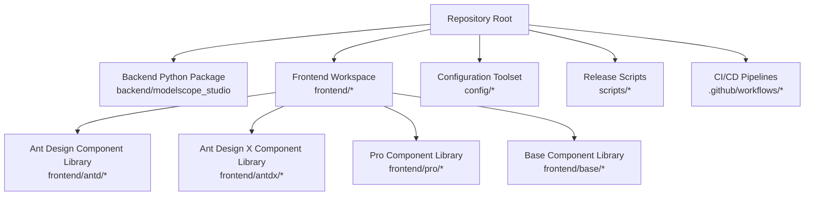
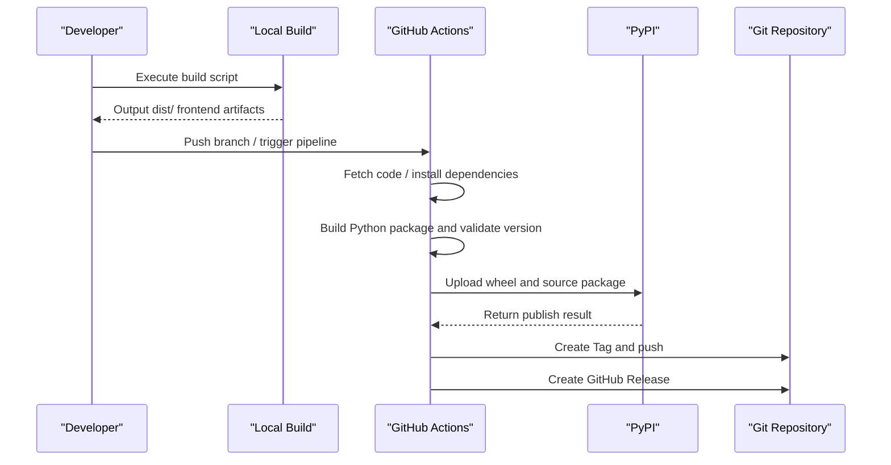
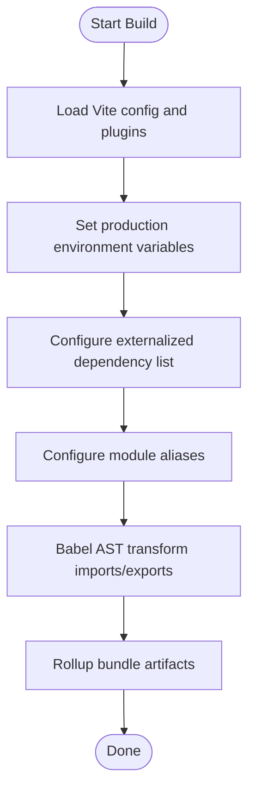
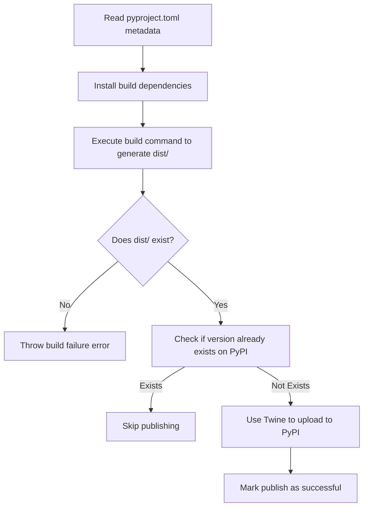
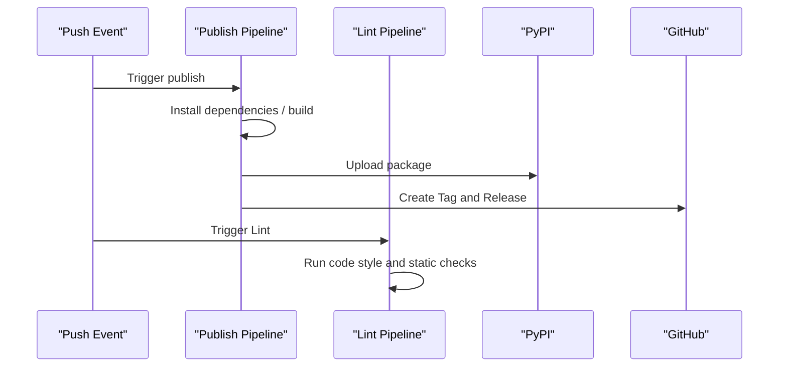
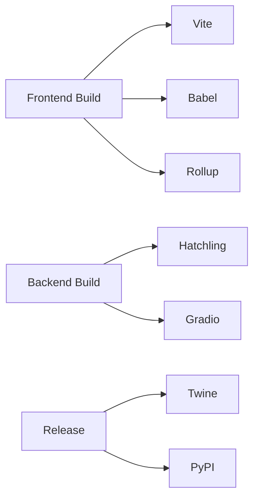

# Deployment Guide

<cite>
**Files Referenced in This Document**
- [pyproject.toml](file://pyproject.toml)
- [package.json](file://package.json)
- [.github/workflows/publish.yaml](file://.github/workflows/publish.yaml)
- [.github/workflows/lint.yaml](file://.github/workflows/lint.yaml)
- [scripts/publish-to-pypi.mts](file://scripts/publish-to-pypi.mts)
- [scripts/create-tag-n-release.mts](file://scripts/create-tag-n-release.mts)
- [frontend/package.json](file://frontend/package.json)
- [frontend/defineConfig.js](file://frontend/defineConfig.js)
- [frontend/plugin.js](file://frontend/plugin.js)
- [pnpm-workspace.yaml](file://pnpm-workspace.yaml)
- [backend/modelscope_studio/version.py](file://backend/modelscope_studio/version.py)
- [README.md](file://README.md)
</cite>

## Table of Contents

1. [Introduction](#introduction)
2. [Project Structure](#project-structure)
3. [Core Components](#core-components)
4. [Architecture Overview](#architecture-overview)
5. [Detailed Component Analysis](#detailed-component-analysis)
6. [Dependency Analysis](#dependency-analysis)
7. [Performance Considerations](#performance-considerations)
8. [Troubleshooting Guide](#troubleshooting-guide)
9. [Conclusion](#conclusion)
10. [Appendix](#appendix)

## Introduction

This guide is intended for operations personnel and developers, providing a systematic explanation of ModelScope Studio's build process, release strategy, and deployment practices, covering the following topics:

- Frontend component build and packaging strategy
- Python package build and publishing to PyPI
- CI/CD pipeline configuration and usage
- Configuration methods for different deployment environments (local development, production, cloud platforms)
- Performance optimization and monitoring recommendations
- Common issue troubleshooting and solutions

## Project Structure

The project uses a multi-package workspace organization, with the root directory managing frontend sub-packages and configuration modules uniformly via pnpm workspaces. The backend Python package is in the `backend/modelscope_studio` directory and defines build and packaging rules via `pyproject.toml`.

Chart Sources

- [pnpm-workspace.yaml](file://pnpm-workspace.yaml)
- [frontend/package.json](file://frontend/package.json)
- [pyproject.toml](file://pyproject.toml)

Section Sources

- [pnpm-workspace.yaml](file://pnpm-workspace.yaml)
- [frontend/package.json](file://frontend/package.json)
- [pyproject.toml](file://pyproject.toml)

## Core Components

- Build and Packaging
  - Frontend: Based on Vite and custom plugins, implements React/Svelte mixed compilation and externalization strategies, outputting component assets usable by Gradio.
  - Backend: Built using Hatchling, packaging templates and component assets into the Python package via toolchain.
- Release and Version Management
  - Uses Changesets for version and changelog management; CI executes build, upload to PyPI, creation of Git Tag, and GitHub Release.
- Quality Assurance
  - Lint pipeline runs on PRs and pushes to ensure consistent code style and static checks.

Section Sources

- [package.json](file://package.json)
- [frontend/defineConfig.js](file://frontend/defineConfig.js)
- [frontend/plugin.js](file://frontend/plugin.js)
- [pyproject.toml](file://pyproject.toml)
- [.github/workflows/lint.yaml](file://.github/workflows/lint.yaml)

## Architecture Overview

The diagram below shows the complete deployment path from local to cloud: Local development build → CI trigger → PyPI publishing → Tag and Release creation.

Chart Sources

- [.github/workflows/publish.yaml](file://.github/workflows/publish.yaml)
- [scripts/publish-to-pypi.mts](file://scripts/publish-to-pypi.mts)
- [scripts/create-tag-n-release.mts](file://scripts/create-tag-n-release.mts)

## Detailed Component Analysis

### Frontend Build and Packaging

- Build Entry and Commands
  - The build script in the root `package.json` calls the Gradio custom component CLI for building (using `--no-generate-docs` to disable automatic documentation generation for faster builds).
  - Full command: `rimraf dist && gradio cc build --no-generate-docs`
- Vite Plugins and Aliases
  - The custom Vite plugin is responsible for:
    - Setting environment variables to production mode during the build phase
    - Externalizing specified dependencies to reduce bundle size
    - Transforming import/export statements via Babel AST to map modules to global objects, enabling on-demand loading in browser environments
  - Alias mappings to utility and global component modules improve development experience and consistency.
- Externalization Strategy
  - React, Ant Design, and their ecosystems are externalized to avoid duplicate bundling, reducing bundle size and improving cache hit rate.

Chart Sources

- [frontend/defineConfig.js](file://frontend/defineConfig.js)
- [frontend/plugin.js](file://frontend/plugin.js)

Section Sources

- [package.json](file://package.json)
- [frontend/defineConfig.js](file://frontend/defineConfig.js)
- [frontend/plugin.js](file://frontend/plugin.js)

### Python Package Build and Release

- Build System and Metadata
  - Uses Hatchling as the build backend, declares dependencies and optional dependencies, defines classifiers and keywords.
- Asset Packaging
  - A large number of component templates and static assets are included in the packaging scope via toolchain, ensuring they are directly available at runtime.
- Version and Metadata
  - Root `pyproject.toml` stays consistent with the backend version file, ensuring unified release version numbers.

Chart Sources

- [pyproject.toml](file://pyproject.toml)
- [scripts/publish-to-pypi.mts](file://scripts/publish-to-pypi.mts)

Section Sources

- [pyproject.toml](file://pyproject.toml)
- [backend/modelscope_studio/version.py](file://backend/modelscope_studio/version.py)
- [scripts/publish-to-pypi.mts](file://scripts/publish-to-pypi.mts)

### CI/CD Pipeline

- Publish Pipeline
  - Trigger: Push to `main` or `next` branch
  - Steps: Install Python and Node.js, install pnpm, install dependencies, build frontend and backend, upload to PyPI, create Tag and Release
- Lint Pipeline
  - Trigger: Push and Pull Requests
  - Steps: Install Python and Node.js, install dependencies, run Lint tasks

Chart Sources

- [.github/workflows/publish.yaml](file://.github/workflows/publish.yaml)
- [.github/workflows/lint.yaml](file://.github/workflows/lint.yaml)

Section Sources

- [.github/workflows/publish.yaml](file://.github/workflows/publish.yaml)
- [.github/workflows/lint.yaml](file://.github/workflows/lint.yaml)

### Version and Changelog Management

- Changesets
  - Uses Changesets for version bumping and changelog generation, combined with scripts to automatically execute version updates and fixes in CI.
- Tags and Releases
  - After a successful release, scripts generate unified Release content from the root and sub-package changelogs, create a Git Tag, and push to remote.

Section Sources

- [package.json](file://package.json)
- [scripts/create-tag-n-release.mts](file://scripts/create-tag-n-release.mts)

## Dependency Analysis

- Frontend Dependencies
  - React and Svelte ecosystems, Ant Design and Ant Design X, Monaco Editor, Mermaid, etc., form the core capabilities of the component library.
- Build Tools
  - Vite, @vitejs/plugin-react-swc, Babel, Rollup (driven by Vite)
- Python Dependencies
  - Gradio as the runtime framework, Hatchling for building, Twine for uploading

Chart Sources

- [frontend/package.json](file://frontend/package.json)
- [pyproject.toml](file://pyproject.toml)
- [scripts/publish-to-pypi.mts](file://scripts/publish-to-pypi.mts)

Section Sources

- [frontend/package.json](file://frontend/package.json)
- [pyproject.toml](file://pyproject.toml)

## Performance Considerations

- Frontend Bundle Optimization
  - Externalization strategy: Externalizes large dependencies such as React and Ant Design to reduce bundle size and duplicate bundling.
  - AST transformation: The plugin transforms imports/exports to global access at build time, avoiding redundant runtime logic.
  - On-demand loading: Combined with Gradio's loading mechanism, component assets are only loaded when needed.
- Build Efficiency
  - Disabling the documentation generation build option can significantly reduce frontend build time.
  - Using pnpm workspaces to unify dependencies reduces disk usage and installation time.
- Python Package Size
  - Only package the necessary templates and assets to avoid unnecessary files entering the distribution package.

Section Sources

- [frontend/plugin.js](file://frontend/plugin.js)
- [frontend/defineConfig.js](file://frontend/defineConfig.js)
- [package.json](file://package.json)
- [pyproject.toml](file://pyproject.toml)

## Troubleshooting Guide

- Build Failure
  - Symptom: `dist/` not generated or build errors
  - Investigation: Confirm the frontend build script executed, verify Node.js and pnpm versions meet requirements, check dependency installation success
  - Reference: Root `package.json` build scripts and frontend `defineConfig` configuration
- PyPI Upload Failure
  - Symptom: Twine upload error or version already exists
  - Investigation: Check whether `PYPI_TOKEN` is correctly configured, whether the version already exists on PyPI, and network connectivity
  - Reference: Version check and upload logic in the publish script
- CI Pipeline Interruption
  - Symptom: Lint or publish step fails
  - Investigation: Check the corresponding workflow logs, confirm environment variables and permissions, verify trigger conditions
  - Reference: `lint` and `publish` workflow configurations
- Documentation and Examples
  - Reference: Root README installation and quick start instructions to ensure local development environment and dependency versions are consistent

Section Sources

- [package.json](file://package.json)
- [scripts/publish-to-pypi.mts](file://scripts/publish-to-pypi.mts)
- [.github/workflows/publish.yaml](file://.github/workflows/publish.yaml)
- [.github/workflows/lint.yaml](file://.github/workflows/lint.yaml)
- [README.md](file://README.md)

## Conclusion

This guide provides an integrated deployment solution from local to cloud: optimizing bundle size via frontend Vite plugins and externalization strategies, achieving stable Python package publishing with Hatchling and Twine, and completing automated pipelines and version management with GitHub Actions. For production and cloud platform deployments, it is recommended to further optimize loading performance by combining externalization and caching strategies, and to continuously run Lint in CI to maintain quality.

## Appendix

### Configuration Methods for Different Deployment Environments

- Local Development
  - Install dependencies: use pnpm to install workspace dependencies
  - Start development server: run the Gradio custom component development command
  - Reference: Root README development instructions and `package.json` scripts
- Production Environment
  - Build artifacts: execute the frontend build script to generate `dist/`, ensure externalized dependencies are available at runtime
  - Python package: build with Hatchling, ensure templates and assets are packaged
- Cloud Platform Deployment
  - Use CI to trigger the publish pipeline, automatically upload to PyPI and create Tag/Release
  - Install the Python package on the target platform and start the application

Section Sources

- [README.md](file://README.md)
- [package.json](file://package.json)
- [pyproject.toml](file://pyproject.toml)
- [.github/workflows/publish.yaml](file://.github/workflows/publish.yaml)
