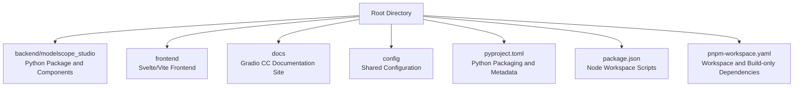
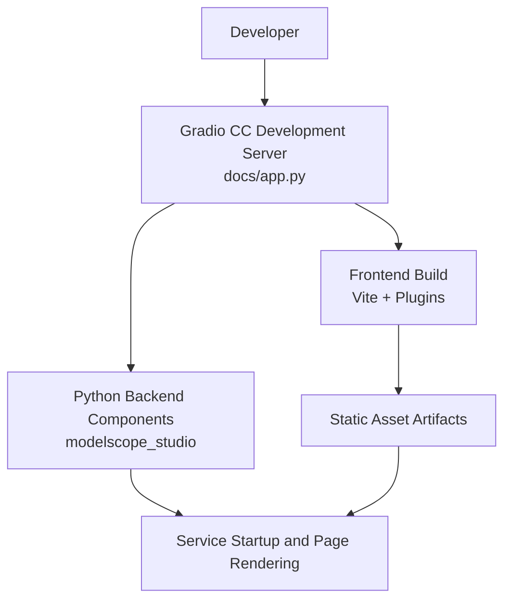
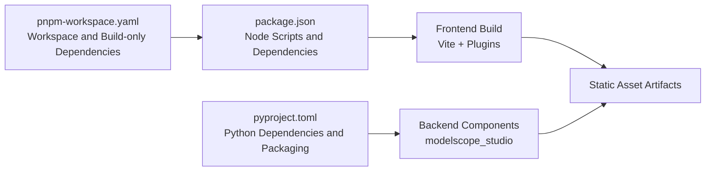
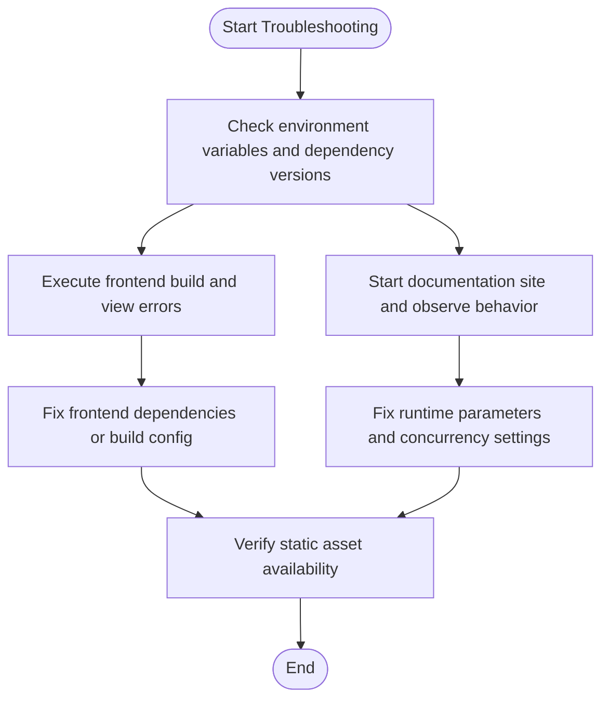

# Environment Configuration

<cite>
**Files Referenced in This Document**
- [README.md](file://README.md)
- [pyproject.toml](file://pyproject.toml)
- [package.json](file://package.json)
- [pnpm-workspace.yaml](file://pnpm-workspace.yaml)
- [docs/app.py](file://docs/app.py)
- [frontend/package.json](file://frontend/package.json)
- [frontend/defineConfig.js](file://frontend/defineConfig.js)
- [backend/modelscope_studio/utils/dev/app_context.py](file://backend/modelscope_studio/utils/dev/app_context.py)
- [backend/modelscope_studio/utils/dev/process_links.py](file://backend/modelscope_studio/utils/dev/process_links.py)
- [backend/modelscope_studio/utils/dev/resolve_frontend_dir.py](file://backend/modelscope_studio/utils/dev/resolve_frontend_dir.py)
</cite>

## Table of Contents

1. [Introduction](#introduction)
2. [Project Structure](#project-structure)
3. [Core Components](#core-components)
4. [Architecture Overview](#architecture-overview)
5. [Detailed Component Analysis](#detailed-component-analysis)
6. [Dependency Analysis](#dependency-analysis)
7. [Performance Considerations](#performance-considerations)
8. [Troubleshooting Guide](#troubleshooting-guide)
9. [Conclusion](#conclusion)
10. [Appendix](#appendix)

## Introduction

This document is intended for operations personnel and developers, providing environment configuration and deployment best practices for ModelScope Studio, covering configuration essentials for local development, testing, and production environments, including environment variables, dependency management, containerization (Docker/Kubernetes), performance monitoring, log configuration, environment migration and upgrade strategies, as well as deployment differences and considerations across different platforms.

## Project Structure

The repository uses a multi-package workspace organization. The backend is published as a Python package, the frontend is built with Svelte + Vite, and the documentation site is started via Gradio CC. Key directories and responsibilities:

- `backend/modelscope_studio`: Python backend components and utilities
- `frontend`: Frontend components and build configuration
- `docs`: Documentation site and example application
- `config`: Shared Lint and changelog configuration
- Root-level configuration: `pyproject.toml` (Python packaging), `package.json` (Node workspace scripts), `pnpm-workspace.yaml` (workspace definition)

**Chart Sources**

- [pyproject.toml](file://pyproject.toml)
- [package.json](file://package.json)
- [pnpm-workspace.yaml](file://pnpm-workspace.yaml)

**Section Sources**

- [README.md](file://README.md)
- [pyproject.toml](file://pyproject.toml)
- [package.json](file://package.json)
- [pnpm-workspace.yaml](file://pnpm-workspace.yaml)

## Core Components

- Python Packaging and Distribution: Built using Hatchling, including a backend component template manifest and packaging targets
- Node Workspace: Unified scripts and dependency management, supporting parallel development across multiple sub-packages
- Documentation Site: `docs/app.py` based on Gradio CC, providing visual documentation for components and layout templates
- Frontend Build: Vite + React SWC plugin, combined with custom plugins and Svelte preprocessing

**Section Sources**

- [pyproject.toml](file://pyproject.toml)
- [package.json](file://package.json)
- [docs/app.py](file://docs/app.py)
- [frontend/package.json](file://frontend/package.json)
- [frontend/defineConfig.js](file://frontend/defineConfig.js)

## Architecture Overview

The diagram below shows the key path from development to runtime: local development starts `docs/app.py` via Gradio CC; the build phase is completed jointly by frontend Vite and backend packaging; at runtime, the Python backend and frontend static assets collaborate to serve the application.

**Chart Sources**

- [docs/app.py](file://docs/app.py)
- [frontend/defineConfig.js](file://frontend/defineConfig.js)
- [frontend/package.json](file://frontend/package.json)
- [pyproject.toml](file://pyproject.toml)

## Detailed Component Analysis

### Environment Variables and Runtime Parameters

- The documentation site's default concurrency and thread count are set at the entry point and can be adjusted to fit the throughput and resource limits of different environments
- Development mode is triggered via environment variables to enable Gradio Watch Module for hot reloading and debugging

Recommended environment variables and purposes (examples, not fixed values):

- `GRADIO_WATCH_MODULE_NAME`: Used to enable development listening
- `PYTHONPATH` or workspace path: Ensures Python can import backend packages
- `NODE_ENV`: Controls frontend build mode (development/production)
- `PORT`/`APP_HOST`: Service listening address and port (if customization is needed)

**Section Sources**

- [docs/app.py](file://docs/app.py)
- [package.json](file://package.json)

### Dependency Management Strategy

- Python Dependencies
  - Core dependency: Gradio version range constraints
  - Packaging and distribution: Hatchling + hatch-requirements-txt
  - Template manifest: The build phase includes a large number of frontend template directories to ensure complete artifacts
- Node.js Dependencies
  - Workspace: pnpm workspace + build-only dependency declarations
  - Scripts: Unified commands for building, developing, formatting, checking, etc.
  - Frontend dependencies: React, Svelte, Ant Design, Monaco Editor, etc.
- Workspace Configuration
  - `pnpm-workspace.yaml` defines `packages` and `onlyBuiltDependencies`, reducing unnecessary build overhead

**Section Sources**

- [pyproject.toml](file://pyproject.toml)
- [package.json](file://package.json)
- [pnpm-workspace.yaml](file://pnpm-workspace.yaml)
- [frontend/package.json](file://frontend/package.json)

### Containerized Deployment (Docker and Kubernetes)

The following are general practice steps; specific images and orchestration need to be customized according to the actual environment:

- Docker Build Process
  - Base image: Select a base image containing Python and Node
  - Install dependencies: Install system dependencies first, then Python and Node dependencies
  - Build backend: Install the backend package with pip or in editable mode
  - Build frontend: Execute the frontend build script to generate static assets
  - Run: Start the Python service and serve static assets
- Kubernetes Deployment
  - Use Deployments to manage Pod replicas
  - Use Services to expose the service
  - Use ConfigMap/Secret to manage environment variables and sensitive information
  - Use PersistentVolume/PVC to store logs and temporary files (if needed)
  - Health checks: Configure liveness/readiness probes
  - Resource limits: Set CPU/memory requests and limits based on concurrency and thread configuration

[This section provides general practice guidance and does not analyze specific files, so there are no "Section Sources"]

### Performance Monitoring and Log Configuration

- Performance Monitoring
  - At the Python level: Record request latency, queue length, concurrency limits, and other metrics
  - At the frontend level: Monitor first contentful paint time, resource load time, error rate
  - At the container level: Collect CPU/memory/network metrics, combined with logs for correlation analysis
- Log Configuration
  - Python: Use the standard logging module, output to stdout/stderr based on environment, combined with container log collection
  - Frontend: Avoid outputting excessive debug logs in production; use conditional logging when necessary
  - Documentation site: Note the impact of concurrency and thread configuration on resource usage

[This section provides general practice guidance and does not analyze specific files, so there are no "Section Sources"]

### Environment Migration and Upgrade

- Python Upgrade
  - Update Python version requirements and dependency version ranges to ensure compatibility
  - Repackage and verify build artifact completeness
- Node Upgrade
  - Update Node version and dependencies, run lint and type checks
  - Rebuild frontend and verify static asset availability
- Documentation Site Upgrade
  - Update Gradio CC version and related dependencies
  - Verify rendering consistency of each component and layout template
- Migration Strategy
  - Small steps: Gradually replace old components and templates
  - Rollback plan: Keep the previous version's image and configuration to ensure fast rollback
  - Data and configuration: Ensure backward compatibility of environment variables and configuration files

[This section provides general practice guidance and does not analyze specific files, so there are no "Section Sources"]

### Deployment Differences and Considerations Across Platforms

- Local Development
  - Use Gradio CC's development server with hot reloading enabled
  - Pay attention to cross-platform path and permission issues
- Testing Environment
  - Independent services and storage isolated from production
  - Strictly control concurrency and thread count to simulate real load
- Production Environment
  - Use stable versions and long-term support base images
  - Configure health checks and auto-scaling
  - Strict logging and monitoring strategies

[This section provides general practice guidance and does not analyze specific files, so there are no "Section Sources"]

## Dependency Analysis

- Python Side
  - Dependencies: Gradio version range constraints
  - Packaging: Hatchling build, `artifacts` list contains a large number of frontend template directories
- Node Side
  - Workspace: `packages` and `onlyBuiltDependencies`
  - Scripts: Unified build, development, formatting, and check commands
  - Frontend dependencies: React, Svelte, Ant Design, Monaco Editor, etc.

**Chart Sources**

- [pyproject.toml](file://pyproject.toml)
- [package.json](file://package.json)
- [pnpm-workspace.yaml](file://pnpm-workspace.yaml)
- [frontend/defineConfig.js](file://frontend/defineConfig.js)

**Section Sources**

- [pyproject.toml](file://pyproject.toml)
- [package.json](file://package.json)
- [pnpm-workspace.yaml](file://pnpm-workspace.yaml)
- [frontend/package.json](file://frontend/package.json)

## Performance Considerations

- Concurrency and Threads
  - The documentation site entry point sets default concurrency and maximum thread count; these should be tuned based on hardware and business load
- Build Optimization
  - Use pnpm and `onlyBuiltDependencies` to reduce unnecessary dependency builds
  - Set the frontend build target to `modules` for improved compatibility and loading efficiency
- Resources and Caching
  - Place static assets on CDN or reverse proxy caching
  - Control template and asset size to avoid redundant files in artifacts

**Section Sources**

- [docs/app.py](file://docs/app.py)
- [frontend/defineConfig.js](file://frontend/defineConfig.js)
- [pnpm-workspace.yaml](file://pnpm-workspace.yaml)

## Troubleshooting Guide

- Documentation Site Cannot Start or Page is Blank
  - Check whether `GRADIO_WATCH_MODULE_NAME` is correctly set to enable development listening
  - Confirm the backend package is correctly installed and can be imported
- Frontend Build Failure
  - Check whether Node version and dependencies meet requirements
  - Clear `node_modules` and build cache, then retry
- Link and Resource 404
  - Confirm static asset paths are consistent with service routes
  - Check link transformation logic and resource cache path mapping
- Development Context Missing Warning
  - Ensure the `Application` component is used at the top level to avoid empty runtime context

**Chart Sources**

- [docs/app.py](file://docs/app.py)
- [package.json](file://package.json)
- [backend/modelscope_studio/utils/dev/process_links.py](file://backend/modelscope_studio/utils/dev/process_links.py)
- [backend/modelscope_studio/utils/dev/app_context.py](file://backend/modelscope_studio/utils/dev/app_context.py)

**Section Sources**

- [docs/app.py](file://docs/app.py)
- [backend/modelscope_studio/utils/dev/process_links.py](file://backend/modelscope_studio/utils/dev/process_links.py)
- [backend/modelscope_studio/utils/dev/app_context.py](file://backend/modelscope_studio/utils/dev/app_context.py)

## Conclusion

With clear environment variables and runtime parameters, standardized dependency management and workspace configuration, scalable containerization and monitoring strategies, and rigorous migration and upgrade processes, ModelScope Studio can run stably in different environments. It is recommended to prioritize controlled versions and a comprehensive observability system in production environments, and to continuously optimize build and runtime performance.

## Appendix

- Quick Start and Development
  - Install backend and frontend dependencies and execute the build
  - Use Gradio CC to start the documentation site for development and debugging
- Reference Commands
  - Backend installation and build: See root-level README installation and development instructions
  - Frontend installation and build: See scripts in `package.json` and dependencies in `frontend/package.json`

**Section Sources**

- [README.md](file://README.md)
- [package.json](file://package.json)
- [frontend/package.json](file://frontend/package.json)
