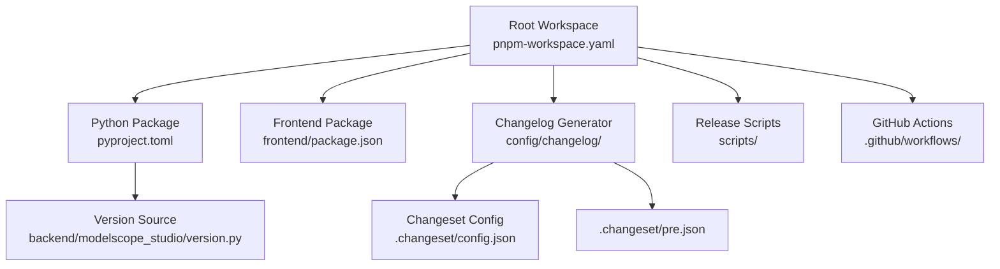
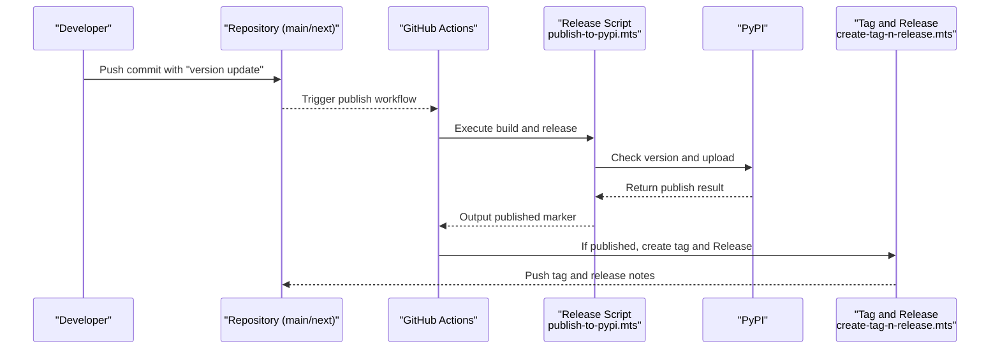
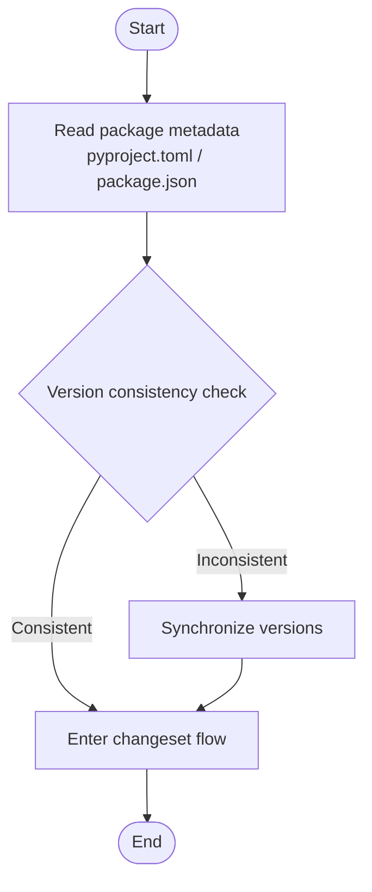
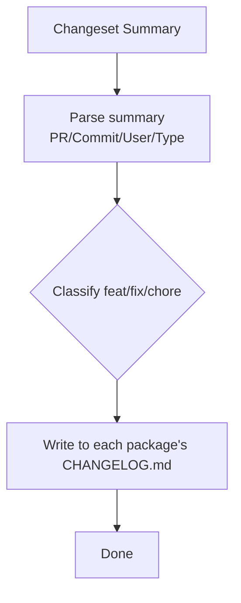
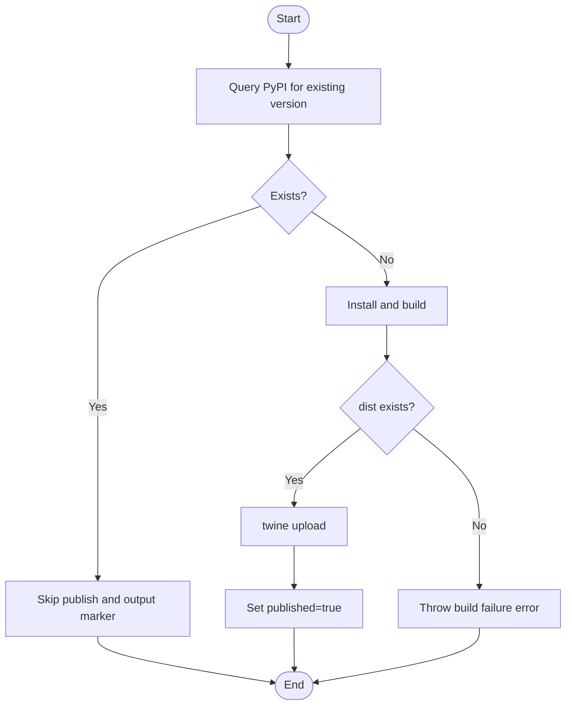
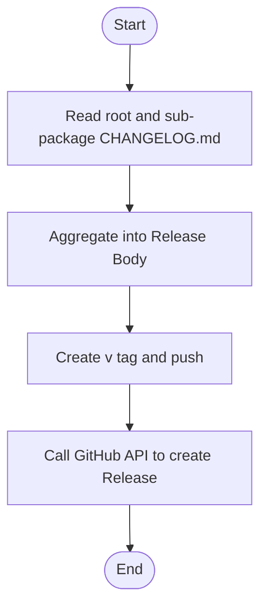
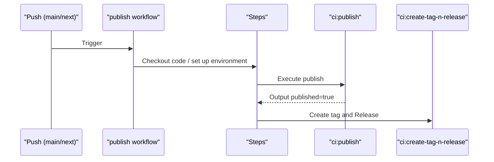
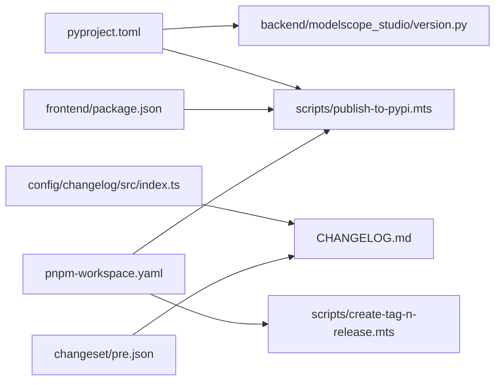

# Release Process

<cite>
**Files Referenced in This Document**
- [publish.yaml](file://.github/workflows/publish.yaml)
- [lint.yaml](file://.github/workflows/lint.yaml)
- [pyproject.toml](file://pyproject.toml)
- [package.json](file://package.json)
- [publish-to-pypi.mts](file://scripts/publish-to-pypi.mts)
- [create-tag-n-release.mts](file://scripts/create-tag-n-release.mts)
- [.changeset/config.json](file://.changeset/config.json)
- [.changeset/pre.json](file://.changeset/pre.json)
- [version.py](file://backend/modelscope_studio/version.py)
- [CHANGELOG.md](file://CHANGELOG.md)
- [pnpm-workspace.yaml](file://pnpm-workspace.yaml)
- [index.ts](file://config/changelog/src/index.ts)
- [package.json](file://config/changelog/package.json)
- [frontend/package.json](file://frontend/package.json)
</cite>

## Table of Contents

1. [Introduction](#introduction)
2. [Project Structure](#project-structure)
3. [Core Components](#core-components)
4. [Architecture Overview](#architecture-overview)
5. [Detailed Component Analysis](#detailed-component-analysis)
6. [Dependency Analysis](#dependency-analysis)
7. [Performance Considerations](#performance-considerations)
8. [Troubleshooting Guide](#troubleshooting-guide)
9. [Conclusion](#conclusion)
10. [Appendix](#appendix)

## Introduction

This document is intended for maintainers and senior developers who need to manage the release of the ModelScope Studio project. It systematically explains the complete process from local development to official PyPI release (including pre-releases and hotfixes), covering version management, changelog generation, automated pipelines, quality assurance, and rollback strategies. The content is based on existing release scripts, GitHub Actions workflows, and changeset configurations within the repository, ensuring it is actionable, traceable, and reproducible.

## Project Structure

ModelScope Studio uses a multi-package workspace (pnpm workspace) organization, with the root directory containing Python package metadata and frontend component source code. Key locations related to releases:

- Root-level package metadata and build configuration: `pyproject.toml`
- Release scripts and workflows: `scripts/` and `.github/workflows/`
- Changeset and changelog generator: `.changeset/` and `config/changelog/`
- Version number sources: `backend/modelscope_studio/version.py` and each package's `package.json`
- Workspace definition: `pnpm-workspace.yaml`

Chart Sources

- [pnpm-workspace.yaml:1-12](file://pnpm-workspace.yaml#L1-L12)
- [pyproject.toml:1-257](file://pyproject.toml#L1-L257)
- [frontend/package.json:1-59](file://frontend/package.json#L1-L59)
- [index.ts:1-222](file://config/changelog/src/index.ts#L1-L222)
- [.changeset/config.json:1-15](file://.changeset/config.json#L1-L15)
- [.changeset/pre.json:1-16](file://.changeset/pre.json#L1-L16)
- [publish.yaml:1-74](file://.github/workflows/publish.yaml#L1-L74)
- [publish-to-pypi.mts:1-60](file://scripts/publish-to-pypi.mts#L1-L60)

Section Sources

- [pnpm-workspace.yaml:1-12](file://pnpm-workspace.yaml#L1-L12)
- [pyproject.toml:1-257](file://pyproject.toml#L1-L257)
- [frontend/package.json:1-59](file://frontend/package.json#L1-L59)
- [index.ts:1-222](file://config/changelog/src/index.ts#L1-L222)
- [.changeset/config.json:1-15](file://.changeset/config.json#L1-L15)
- [.changeset/pre.json:1-16](file://.changeset/pre.json#L1-L16)
- [publish.yaml:1-74](file://.github/workflows/publish.yaml#L1-L74)
- [publish-to-pypi.mts:1-60](file://scripts/publish-to-pypi.mts#L1-L60)

## Core Components

- Version and Metadata
  - Python package version and metadata are provided by `pyproject.toml`; the Python module version is also maintained synchronously in `backend/modelscope_studio/version.py`.
  - Frontend package and sub-package versions are declared in their respective `package.json` files.
- Changesets and Changelogs
  - Uses Changesets to manage cross-package versions and change summaries, classifying changes and writing them to each package's `CHANGELOG.md` via a custom changelog generator.
- Automated Release Pipeline
  - GitHub Actions triggers when a "version update" commit is detected on the main or next branch, executes build and release, and upon success, creates a tag and GitHub Release.
- Release Scripts
  - `scripts/publish-to-pypi.mts` checks whether the version already exists, builds artifacts, and uploads to PyPI.
  - `scripts/create-tag-n-release.mts` generates merged changelogs, creates a tag, and creates a Release.

Section Sources

- [pyproject.toml:1-257](file://pyproject.toml#L1-L257)
- [version.py:1-2](file://backend/modelscope_studio/version.py#L1-L2)
- [frontend/package.json:1-59](file://frontend/package.json#L1-L59)
- [index.ts:1-222](file://config/changelog/src/index.ts#L1-L222)
- [.changeset/config.json:1-15](file://.changeset/config.json#L1-L15)
- [publish.yaml:1-74](file://.github/workflows/publish.yaml#L1-L74)
- [publish-to-pypi.mts:1-60](file://scripts/publish-to-pypi.mts#L1-L60)
- [create-tag-n-release.mts:1-131](file://scripts/create-tag-n-release.mts#L1-L131)

## Architecture Overview

The diagram below shows the overall flow from code commit to PyPI publishing and GitHub Release, including version checking, building, uploading, tagging, and releasing.

Chart Sources

- [publish.yaml:1-74](file://.github/workflows/publish.yaml#L1-L74)
- [publish-to-pypi.mts:1-60](file://scripts/publish-to-pypi.mts#L1-L60)
- [create-tag-n-release.mts:1-131](file://scripts/create-tag-n-release.mts#L1-L131)

Section Sources

- [publish.yaml:1-74](file://.github/workflows/publish.yaml#L1-L74)
- [publish-to-pypi.mts:1-60](file://scripts/publish-to-pypi.mts#L1-L60)
- [create-tag-n-release.mts:1-131](file://scripts/create-tag-n-release.mts#L1-L131)

## Detailed Component Analysis

### Component 1: Version and Metadata Management

- Python Package Version and Metadata
  - `pyproject.toml` defines the package name, version, license, dependencies, and build targets, with clearly defined wheel and sdist packaging scope.
  - `backend/modelscope_studio/version.py` serves as the Python module version entry point and must stay consistent with the `pyproject.toml` version.
- Frontend and Sub-package Versions
  - Each package's `package.json` (such as `frontend/package.json`) declares an independent version, facilitating coordinated multi-package releases.
- Workspace and Multi-package
  - `pnpm-workspace.yaml` explicitly includes root, `config/*`, `frontend`, and its sub-packages, ensuring release scripts can correctly resolve package metadata.

Chart Sources

- [pyproject.toml:1-257](file://pyproject.toml#L1-L257)
- [version.py:1-2](file://backend/modelscope_studio/version.py#L1-L2)
- [frontend/package.json:1-59](file://frontend/package.json#L1-L59)
- [pnpm-workspace.yaml:1-12](file://pnpm-workspace.yaml#L1-L12)

Section Sources

- [pyproject.toml:1-257](file://pyproject.toml#L1-L257)
- [version.py:1-2](file://backend/modelscope_studio/version.py#L1-L2)
- [frontend/package.json:1-59](file://frontend/package.json#L1-L59)
- [pnpm-workspace.yaml:1-12](file://pnpm-workspace.yaml#L1-L12)

### Component 2: Changesets and Changelog Generation

- Changesets Configuration
  - `.changeset/config.json` specifies using a custom changelog generator and repository information, disables commit recording, and sets the base branch to `main`.
  - `.changeset/pre.json` defines the pre-release mode and initial version mapping, supporting pre-releases with the `beta` tag.
- Custom Changelog Generator
  - `index.ts` implements `getReleaseLine` and `getDependencyReleaseLine`, classifying changes by `feat`/`fix`/`chore`, extracting PR/Commit/User information, and writing to each package's `CHANGELOG.md`.
- Generation Flow
  - The `version` script in `package.json` calls `changeset version` and fixes changelogs, then builds the changelog package.

Chart Sources

- [.changeset/config.json:1-15](file://.changeset/config.json#L1-L15)
- [.changeset/pre.json:1-16](file://.changeset/pre.json#L1-L16)
- [index.ts:1-222](file://config/changelog/src/index.ts#L1-L222)
- [package.json:1-55](file://package.json#L1-L55)
- [config/changelog/package.json:1-32](file://config/changelog/package.json#L1-L32)

Section Sources

- [.changeset/config.json:1-15](file://.changeset/config.json#L1-L15)
- [.changeset/pre.json:1-16](file://.changeset/pre.json#L1-L16)
- [index.ts:1-222](file://config/changelog/src/index.ts#L1-L222)
- [package.json:1-55](file://package.json#L1-L55)
- [config/changelog/package.json:1-32](file://config/changelog/package.json#L1-L32)

### Component 3: PyPI Release Script

- Functional Responsibilities
  - `publish-to-pypi.mts` checks whether the same version already exists on PyPI before releasing, to avoid duplicate uploads; then executes installation and build, and finally uploads via `twine`.
- Key Logic
  - Uses `@manypkg/get-packages` to obtain workspace package metadata and read the root package version.
  - Queries the PyPI JSON API to check whether the version exists; if it does, skips.
  - Checks the existence of the `dist` directory after building before uploading.
  - Sets the GitHub Actions output variable `published=true` for subsequent steps to use.

Chart Sources

- [publish-to-pypi.mts:1-60](file://scripts/publish-to-pypi.mts#L1-L60)

Section Sources

- [publish-to-pypi.mts:1-60](file://scripts/publish-to-pypi.mts#L1-L60)

### Component 4: Tag and Release Creation

- Functional Responsibilities
  - `create-tag-n-release.mts` aggregates change descriptions for the current version from the root and sub-package `CHANGELOG.md` files, creates a Git tag and pushes it, then calls the GitHub API to create a Release.
- Key Logic
  - Parses `CHANGELOG.md`, extracts the entry for the corresponding version number, and concatenates it into the Release Body.
  - Uses the GitHub Token to call `createRelease`; decides whether to mark as pre-release based on whether the version number contains a hyphen.
  - Configures Git username and email to ensure tags are pushed to the remote.

Chart Sources

- [create-tag-n-release.mts:1-131](file://scripts/create-tag-n-release.mts#L1-L131)
- [CHANGELOG.md:1-200](file://CHANGELOG.md#L1-L200)

Section Sources

- [create-tag-n-release.mts:1-131](file://scripts/create-tag-n-release.mts#L1-L131)
- [CHANGELOG.md:1-200](file://CHANGELOG.md#L1-L200)

### Component 5: GitHub Actions Publish Pipeline

- Trigger Conditions
  - Triggers on push to `main` or `next` branch with a commit message matching "version update".
- Step Description
  - Install Python and Node.js dependencies; pnpm installs frontend dependencies.
  - Execute the publish script `pnpm run ci:publish`, passing in `PYPI_TOKEN`.
  - If publish succeeds, execute `pnpm run ci:create-tag-n-release`, passing in `GITHUB_TOKEN`, `REPO`, and `OWNER`.

Chart Sources

- [publish.yaml:1-74](file://.github/workflows/publish.yaml#L1-L74)

Section Sources

- [publish.yaml:1-74](file://.github/workflows/publish.yaml#L1-L74)

## Dependency Analysis

- Package Version Sources and Consistency
  - Root package version is jointly constrained by `pyproject.toml` and `backend/modelscope_studio/version.py`; frontend and sub-package versions are constrained by their respective `package.json`.
- Release Script Dependencies on Workspace
  - Both `publish-to-pypi.mts` and `create-tag-n-release.mts` read workspace package information via `@manypkg/get-packages`, ensuring unified multi-package versions and changelogs.
- Changelog Generator Dependencies on Changesets
  - `index.ts` depends on `@changesets/get-github-info` and `@manypkg/get-packages` to transform changesets into `CHANGELOG.md`.

Chart Sources

- [pyproject.toml:1-257](file://pyproject.toml#L1-L257)
- [version.py:1-2](file://backend/modelscope_studio/version.py#L1-L2)
- [frontend/package.json:1-59](file://frontend/package.json#L1-L59)
- [index.ts:1-222](file://config/changelog/src/index.ts#L1-L222)
- [.changeset/pre.json:1-16](file://.changeset/pre.json#L1-L16)
- [pnpm-workspace.yaml:1-12](file://pnpm-workspace.yaml#L1-L12)
- [publish-to-pypi.mts:1-60](file://scripts/publish-to-pypi.mts#L1-L60)
- [create-tag-n-release.mts:1-131](file://scripts/create-tag-n-release.mts#L1-L131)

Section Sources

- [pyproject.toml:1-257](file://pyproject.toml#L1-L257)
- [version.py:1-2](file://backend/modelscope_studio/version.py#L1-L2)
- [frontend/package.json:1-59](file://frontend/package.json#L1-L59)
- [index.ts:1-222](file://config/changelog/src/index.ts#L1-L222)
- [.changeset/pre.json:1-16](file://.changeset/pre.json#L1-L16)
- [pnpm-workspace.yaml:1-12](file://pnpm-workspace.yaml#L1-L12)
- [publish-to-pypi.mts:1-60](file://scripts/publish-to-pypi.mts#L1-L60)
- [create-tag-n-release.mts:1-131](file://scripts/create-tag-n-release.mts#L1-L131)

## Performance Considerations

- Publish Pipeline Concurrency and Timeout
  - The workflow enables concurrency groups and cancellation strategies to avoid multiple releases on the same branch interfering with each other; single job timeout is generous to accommodate large build needs.
- Build and Upload Efficiency
  - The release script checks whether the version exists before uploading to avoid duplicate uploads; the build phase only continues when `dist` exists, reducing invalid I/O.
- Multi-package Workspace
  - Reads all package metadata at once via `@manypkg/get-packages`, reducing multiple I/O overhead.

Section Sources

- [publish.yaml:1-74](file://.github/workflows/publish.yaml#L1-L74)
- [publish-to-pypi.mts:1-60](file://scripts/publish-to-pypi.mts#L1-L60)

## Troubleshooting Guide

- Publish Skipped
  - Symptom: Log shows version already exists on PyPI, publish skipped.
  - Investigation: Confirm whether the version number was correctly incremented; check whether `PYPI_TOKEN` is valid.
  - Reference: Version check logic in the publish script.
- Build Failure
  - Symptom: `dist` directory does not exist, causing build failure.
  - Investigation: Check the build command and dependency installation; confirm Node.js and pnpm versions meet requirements.
  - Reference: Build and validation steps in the publish script.
- Tag and Release Creation Failure
  - Symptom: Cannot create Release or tag was not pushed.
  - Investigation: Confirm `GITHUB_TOKEN` permissions; check whether `CHANGELOG.md` contains the corresponding version entry; confirm branch protection rules allow tag pushes.
  - Reference: Tag and Release creation script.
- Changelog Missing
  - Symptom: Release Body is empty or some packages are not included in the change.
  - Investigation: Confirm changeset summary format is standardized; check initial version mapping in `pre.json`; verify the changelog generator correctly writes to each package's `CHANGELOG.md`.
- Pre-release vs Official Release
  - Symptom: Release not marked as pre-release.
  - Investigation: Confirm the version number contains a hyphen; check the `tag` configuration and initial version mapping in `pre.json`.

Section Sources

- [publish-to-pypi.mts:1-60](file://scripts/publish-to-pypi.mts#L1-L60)
- [create-tag-n-release.mts:1-131](file://scripts/create-tag-n-release.mts#L1-L131)
- [.changeset/pre.json:1-16](file://.changeset/pre.json#L1-L16)
- [index.ts:1-222](file://config/changelog/src/index.ts#L1-L222)

## Conclusion

This release system uses Changesets as the core to coordinate multi-package versions and changelogs, combined with GitHub Actions to automate building, uploading, and releasing. Through version checks, tag, and Release creation scripts, the release process is traceable and reversible. It is recommended to strictly follow version management and changelog specifications before each release to maintain high-quality delivery.

## Appendix

### A. Version Control and Semantic Versioning Best Practices

- Semantic Versioning
  - Major version: Breaking changes
  - Minor version: Backwards-compatible feature additions
  - Patch version: Backwards-compatible bug fixes
- Pre-release
  - Use the `beta` tag in `pre.json` for pre-releases; versions containing hyphens are automatically marked as pre-releases.
- Hotfix
  - Fix directly on the `main` branch and create a patch version; if prior validation is needed, pre-release on the `next` branch first.

Section Sources

- [.changeset/pre.json:1-16](file://.changeset/pre.json#L1-L16)
- [create-tag-n-release.mts:1-131](file://scripts/create-tag-n-release.mts#L1-L131)

### B. Pre-release Checklist

- Version Consistency
  - `pyproject.toml` and `backend/modelscope_studio/version.py` versions are consistent; each package's `package.json` versions are consistent.
- Changelog
  - Changeset has been run and corresponding summaries have been generated; each package's `CHANGELOG.md` contains the current version entry.
- Local Build
  - Build executed locally and basic functional tests passed.
- Secrets and Permissions
  - `PYPI_TOKEN` and `GITHUB_TOKEN` are valid with correct permissions.
- Branch and Commit
  - Push branch is `main` or `next`; commit message contains "version update".

Section Sources

- [pyproject.toml:1-257](file://pyproject.toml#L1-L257)
- [version.py:1-2](file://backend/modelscope_studio/version.py#L1-L2)
- [frontend/package.json:1-59](file://frontend/package.json#L1-L59)
- [publish.yaml:1-74](file://.github/workflows/publish.yaml#L1-L74)

### C. Configuration for Different Release Scenarios

- Official Release
  - Push a "version update" commit on the `main` branch to trigger the release pipeline; version number does not contain a hyphen, Release is marked as official.
- Pre-release
  - Use the `beta` tag in `pre.json`; version number contains a hyphen, Release is marked as pre-release.
- Hotfix
  - Create a patch version directly on the `main` branch; if prior validation is needed, pre-release on the `next` branch first, then merge.

Section Sources

- [publish.yaml:1-74](file://.github/workflows/publish.yaml#L1-L74)
- [.changeset/pre.json:1-16](file://.changeset/pre.json#L1-L16)
- [create-tag-n-release.mts:1-131](file://scripts/create-tag-n-release.mts#L1-L131)
