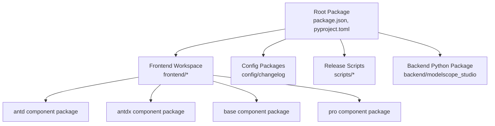
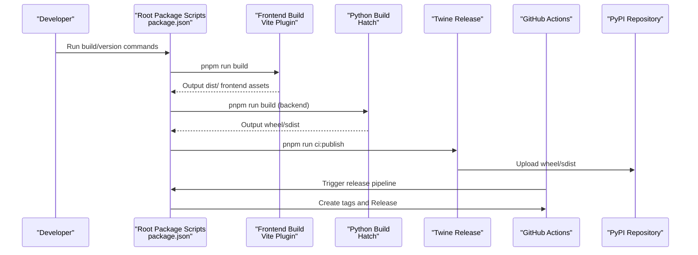
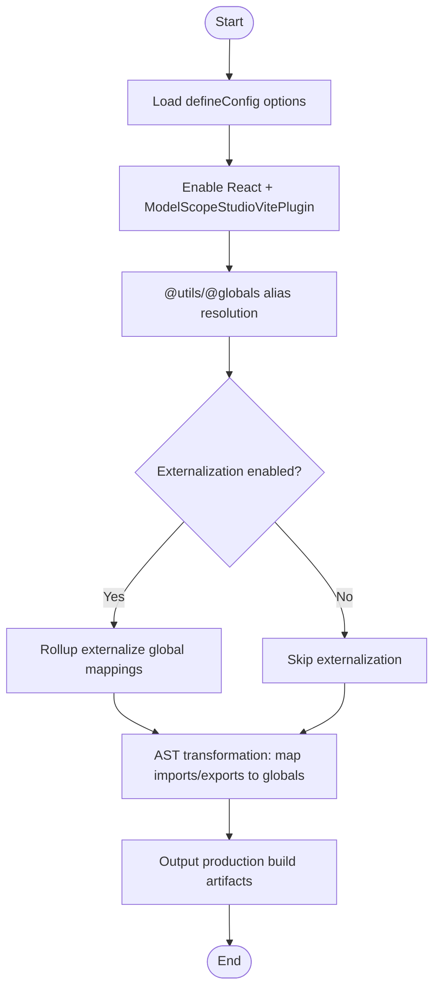
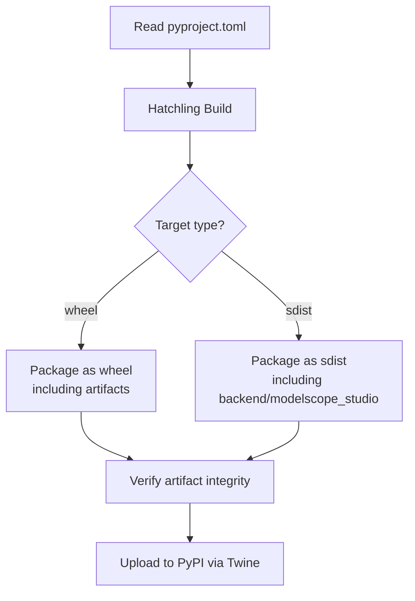
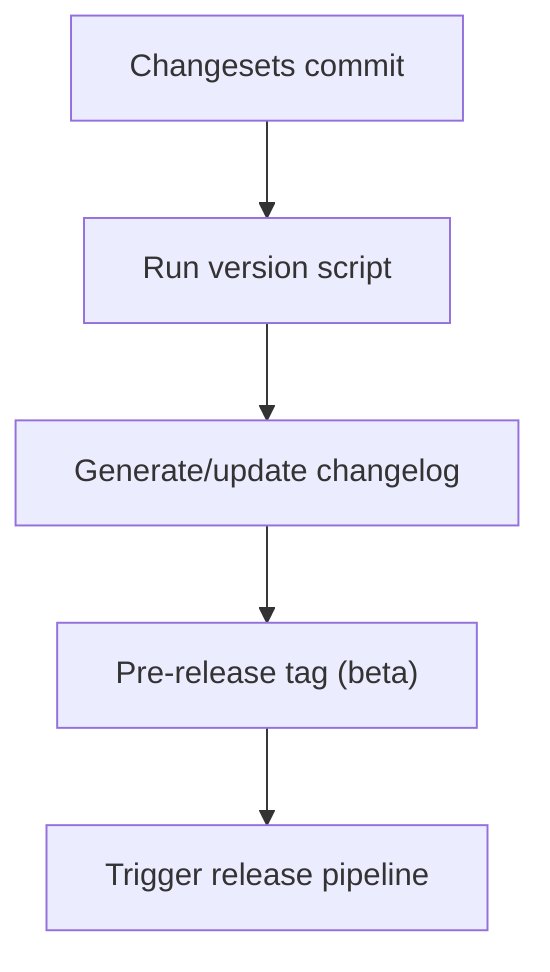
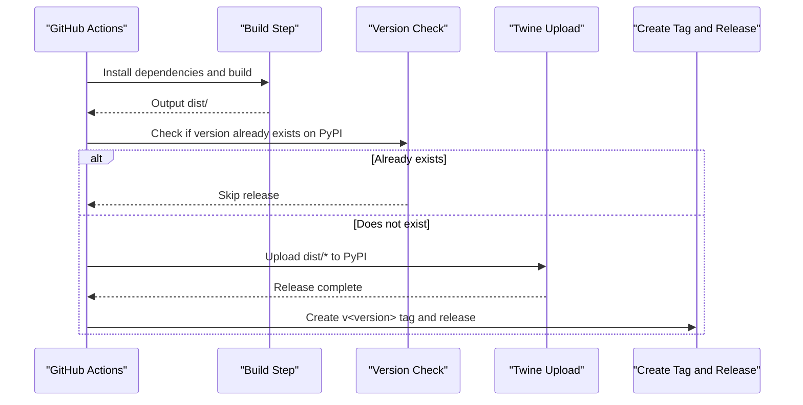
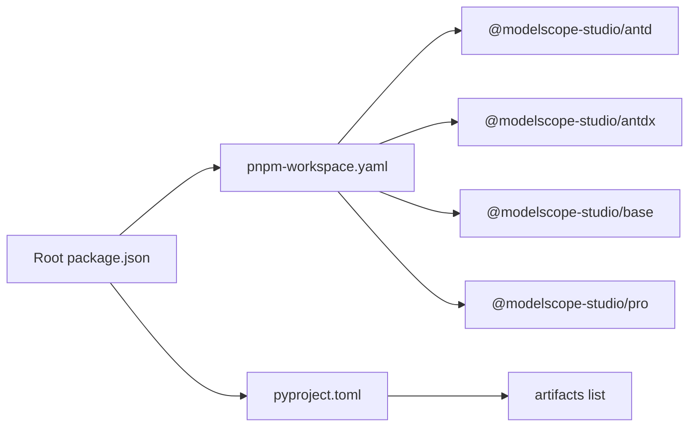

# Build and Deploy

<cite>
**Files referenced in this document**
- [package.json](file://package.json)
- [pyproject.toml](file://pyproject.toml)
- [pnpm-workspace.yaml](file://pnpm-workspace.yaml)
- [frontend/package.json](file://frontend/package.json)
- [frontend/defineConfig.js](file://frontend/defineConfig.js)
- [frontend/plugin.js](file://frontend/plugin.js)
- [.github/workflows/publish.yaml](file://.github/workflows/publish.yaml)
- [scripts/publish-to-pypi.mts](file://scripts/publish-to-pypi.mts)
- [scripts/create-tag-n-release.mts](file://scripts/create-tag-n-release.mts)
- [backend/modelscope_studio/version.py](file://backend/modelscope_studio/version.py)
- [config/changelog/src/index.ts](file://config/changelog/src/index.ts)
- [config/changelog/tsup.config.ts](file://config/changelog/tsup.config.ts)
- [.changeset/config.json](file://.changeset/config.json)
- [.changeset/pre.json](file://.changeset/pre.json)
- [README.md](file://README.md)
- [docs/requirements.txt](file://docs/requirements.txt)
</cite>

## Table of Contents

1. [Introduction](#introduction)
2. [Project Structure](#project-structure)
3. [Core Components](#core-components)
4. [Architecture Overview](#architecture-overview)
5. [Detailed Component Analysis](#detailed-component-analysis)
6. [Dependency Analysis](#dependency-analysis)
7. [Performance Considerations](#performance-considerations)
8. [Troubleshooting Guide](#troubleshooting-guide)
9. [Conclusion](#conclusion)
10. [Appendix](#appendix)

## Introduction

This guide covers the build and release process for ModelScope Studio, including the following topics:

- Frontend build configuration and bundling strategy (Vite plugins, externalization and aliases)
- Python package build and distribution (Hatch configuration, wheel/sdist artifact manifest)
- Version management and changesets (Changesets, pre-release tags, automated changelog generation)
- Automated release pipeline (PyPI release, GitHub tags and Release creation)
- Deployment best practices and considerations
- Dependency update and compatibility handling recommendations

## Project Structure

The repository uses a multi-package workspace organization, containing root-level packages, frontend sub-packages, and configuration packages:

- Root package: Provides build scripts, changeset configuration, and release scripts
- Frontend workspace: Contains component packages such as antd, antdx, base, pro
- Configuration packages: Changelog generator and Lint configuration
- Backend Python package: Built via Hatch and packaged as wheel/sdist

**Diagram Sources**

- [pnpm-workspace.yaml:1-12](file://pnpm-workspace.yaml#L1-L12)
- [package.json:1-55](file://package.json#L1-L55)
- [frontend/package.json:1-59](file://frontend/package.json#L1-L59)

**Section Sources**

- [pnpm-workspace.yaml:1-12](file://pnpm-workspace.yaml#L1-L12)
- [package.json:1-55](file://package.json#L1-L55)
- [frontend/package.json:1-59](file://frontend/package.json#L1-L59)

## Core Components

- Frontend Vite build plugin: Handles React/Svelte preprocessing, global variable injection, and externalization strategy
- Python package build system: Based on Hatch, defining artifacts, wheel/sdist packaging scope, and optional dependencies
- Changesets and changelog: Changesets-driven version and log generation, supporting multi-package unified management
- Automated release pipeline: GitHub Actions triggers builds, PyPI releases, and GitHub Release creation

**Section Sources**

- [frontend/plugin.js:1-168](file://frontend/plugin.js#L1-L168)
- [frontend/defineConfig.js:1-19](file://frontend/defineConfig.js#L1-L19)
- [pyproject.toml:1-257](file://pyproject.toml#L1-L257)
- [.changeset/config.json:1-15](file://.changeset/config.json#L1-L15)
- [.changeset/pre.json:1-16](file://.changeset/pre.json#L1-L16)
- [config/changelog/src/index.ts:1-222](file://config/changelog/src/index.ts#L1-L222)

## Architecture Overview

The diagram below shows the overall process from local development to automated release:

**Diagram Sources**

- [package.json:8-25](file://package.json#L8-L25)
- [frontend/defineConfig.js:1-19](file://frontend/defineConfig.js#L1-L19)
- [frontend/plugin.js:41-76](file://frontend/plugin.js#L41-L76)
- [pyproject.toml:45-257](file://pyproject.toml#L45-L257)
- [.github/workflows/publish.yaml:1-74](file://.github/workflows/publish.yaml#L1-L74)
- [scripts/publish-to-pypi.mts:22-55](file://scripts/publish-to-pypi.mts#L22-L55)

## Detailed Component Analysis

### Frontend Build and Bundling

- Build entry and plugin chain
  - Uses Vite plugin combination: React SWC and custom ModelScopeStudioVitePlugin
  - Defines global variable mappings, externalizing common dependencies to host environment (e.g., `window.ms_globals.React`)
  - Supports excluding certain externalized items on-demand, for inlining in specific scenarios
- Aliases and preprocessing
  - Points to `utils/globals` directory via aliases to simplify import paths
  - Disables Svelte preprocessing to avoid conflicts with existing solutions
- Production environment optimization
  - Sets `NODE_ENV` to `production` during the build stage
  - Performs AST transformation on exported modules, rewriting imports/exports to global object access to reduce bundle size

**Diagram Sources**

- [frontend/defineConfig.js:8-18](file://frontend/defineConfig.js#L8-L18)
- [frontend/plugin.js:41-76](file://frontend/plugin.js#L41-L76)
- [frontend/plugin.js:77-165](file://frontend/plugin.js#L77-L165)

**Section Sources**

- [frontend/defineConfig.js:1-19](file://frontend/defineConfig.js#L1-L19)
- [frontend/plugin.js:1-168](file://frontend/plugin.js#L1-L168)

### Python Package Build and Distribution

- Build backend Python package
  - Uses Hatchling as build backend, reading metadata and dependencies from `pyproject.toml`
  - Specifies `artifacts` list to ensure templates and static assets are included in the wheel
  - Target directories and exclusion rules for wheel/sdist are clearly defined to avoid redundant files in release packages
- Dependencies and compatibility
  - Manages dependencies and README rendering via `hatch-requirements-txt` and `hatch-fancy-pypi-readme`
  - Python version requirements and classifier declarations are clear, facilitating PyPI display and installer recognition
- Version consistency
  - Root package and backend versions are kept in sync to avoid mismatches during release

**Diagram Sources**

- [pyproject.toml:1-257](file://pyproject.toml#L1-L257)
- [backend/modelscope_studio/version.py:1-2](file://backend/modelscope_studio/version.py#L1-L2)

**Section Sources**

- [pyproject.toml:1-257](file://pyproject.toml#L1-L257)
- [backend/modelscope_studio/version.py:1-2](file://backend/modelscope_studio/version.py#L1-L2)

### Version Management and Changelog

- Changesets configuration
  - Uses custom changelog generator, supporting PR/Commit/user link parsing
  - Unified version baseline and pre-release tags (beta), facilitating preview and rollback
- Changelog generation
  - Compiles configuration package via tsup, outputting both esm/cjs formats
  - Changelog generator aggregates CHANGELOGs from each package and writes to a temporary state file, ultimately driven by the root package to generate unified release content
- Pre-release mode
  - `pre.json` specifies pre-release tags and initial version, working with Changesets workflow for canary releases

**Diagram Sources**

- [.changeset/config.json:1-15](file://.changeset/config.json#L1-L15)
- [.changeset/pre.json:1-16](file://.changeset/pre.json#L1-L16)
- [config/changelog/src/index.ts:1-222](file://config/changelog/src/index.ts#L1-L222)
- [config/changelog/tsup.config.ts:1-21](file://config/changelog/tsup.config.ts#L1-L21)

**Section Sources**

- [.changeset/config.json:1-15](file://.changeset/config.json#L1-L15)
- [.changeset/pre.json:1-16](file://.changeset/pre.json#L1-L16)
- [config/changelog/src/index.ts:1-222](file://config/changelog/src/index.ts#L1-L222)
- [config/changelog/tsup.config.ts:1-21](file://config/changelog/tsup.config.ts#L1-L21)

### Automated Release Pipeline

- Trigger conditions
  - Push to `main`/`next` branch with commit message "chore: update versions"
- Step breakdown
  - Install Python and Node dependencies, prepare build environment
  - Execute build: pip editable mode install, pnpm run build
  - Check if `dist` exists to prevent continuing release after build failure
  - Use Twine to upload all artifacts in `dist` to PyPI (with skip-existing)
  - If release succeeds, call script to create Git tag and push, then create Release on GitHub with content from changelog

**Diagram Sources**

- [.github/workflows/publish.yaml:1-74](file://.github/workflows/publish.yaml#L1-L74)
- [scripts/publish-to-pypi.mts:14-55](file://scripts/publish-to-pypi.mts#L14-L55)
- [scripts/create-tag-n-release.mts:80-125](file://scripts/create-tag-n-release.mts#L80-L125)

**Section Sources**

- [.github/workflows/publish.yaml:1-74](file://.github/workflows/publish.yaml#L1-L74)
- [scripts/publish-to-pypi.mts:1-60](file://scripts/publish-to-pypi.mts#L1-L60)
- [scripts/create-tag-n-release.mts:1-131](file://scripts/create-tag-n-release.mts#L1-L131)

## Dependency Analysis

- Workspace and package relationships
  - pnpm-workspace defines the root package and multiple frontend sub-packages, ensuring inter-package sharing and build order
  - Root package `package.json` provides unified scripts and dependencies, centralizing build and release tasks
- Frontend dependency externalization strategy
  - Maps React, Ant Design, Monaco Editor, etc. to globals via Vite plugin to reduce bundle size
  - Supports on-demand exclusion from externalization list to meet different host environment needs
- Python dependencies and compatibility
  - Manages dependencies and README rendering via `hatch-requirements-txt` and `hatch-fancy-pypi-readme`
  - Constrains Gradio version range to ensure coordination with frontend components

**Diagram Sources**

- [pnpm-workspace.yaml:1-12](file://pnpm-workspace.yaml#L1-L12)
- [package.json:1-55](file://package.json#L1-L55)
- [pyproject.toml:45-245](file://pyproject.toml#L45-L245)

**Section Sources**

- [pnpm-workspace.yaml:1-12](file://pnpm-workspace.yaml#L1-L12)
- [package.json:1-55](file://package.json#L1-L55)
- [pyproject.toml:1-257](file://pyproject.toml#L1-L257)

## Performance Considerations

- Frontend build optimization
  - Enable externalization strategy to reduce repeated bundling and size bloat
  - AST transformation only applies to export/import statements, avoiding impact on runtime performance
  - Force-set `NODE_ENV` in production to ensure minification and Tree-shaking take effect
- Python package size control
  - Explicitly define artifacts whitelist to avoid packaging test or source cache files
  - Use dual sdist/wheel release for both installer and cache efficiency
- Release process stability
  - Check if same version exists on PyPI first to avoid repeated uploads and failed retries
  - Use "skip-existing" parameter to reduce network and time overhead

## Troubleshooting Guide

- Build failure
  - Check if `dist` directory exists; if missing, confirm frontend build scripts and Vite plugin configuration are correct
  - Confirm Node and Python environment versions meet requirements
- PyPI release failure
  - Verify `PYPI_TOKEN` is configured and network connectivity is normal
  - If prompted that version already exists, confirm whether version upgrade or cache clearing is needed
- GitHub Release creation failure
  - Check `GITHUB_TOKEN` permissions and REPO/OWNER parameters
  - Confirm changelog generation succeeded to avoid empty content causing creation failure
- Dependency conflicts
  - Update Gradio version range and frontend dependencies to ensure compatibility
  - Use `docs/requirements.txt` to pin example dependency versions for easier reproduction and debugging

**Section Sources**

- [scripts/publish-to-pypi.mts:22-55](file://scripts/publish-to-pypi.mts#L22-L55)
- [scripts/create-tag-n-release.mts:88-125](file://scripts/create-tag-n-release.mts#L88-L125)
- [docs/requirements.txt:1-4](file://docs/requirements.txt#L1-L4)

## Conclusion

This guide provides a complete path from local development to automated release: the frontend implements externalization and alias optimization through the Vite plugin, the Python package uses Hatch for precise packaging and distribution, versions and changelogs are driven by Changesets, and GitHub Actions completes PyPI releases and GitHub Release creation. Following the steps and best practices in this document can significantly improve build efficiency and release reliability.

## Appendix

### Common Build and Release Commands

- Local development and build
  - Run root package build script to generate frontend and backend artifacts
  - Documentation site can be started by specifying an entry point
- Version and changelog
  - Use Changesets to update version and generate changelog
  - Regenerate after fixing changelog format
- Publish to PyPI
  - Use CI script to check if version already exists; skip if it does, otherwise build and upload
- Create tags and Releases
  - Generate content from changelog, create Git tags and push, then create Release on GitHub

**Section Sources**

- [package.json:8-25](file://package.json#L8-L25)
- [README.md:80-101](file://README.md#L80-L101)
- [scripts/publish-to-pypi.mts:44-55](file://scripts/publish-to-pypi.mts#L44-L55)
- [scripts/create-tag-n-release.mts:117-125](file://scripts/create-tag-n-release.mts#L117-L125)
