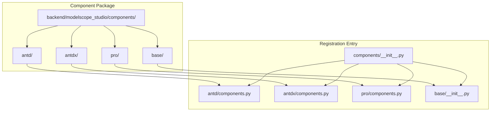
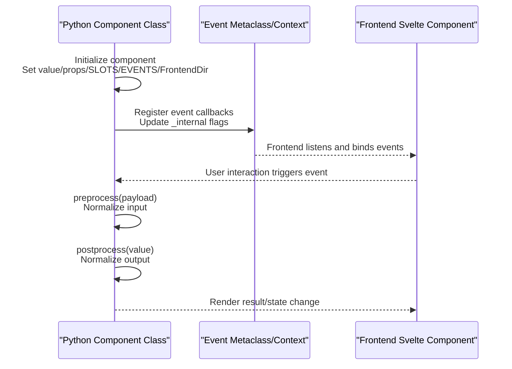
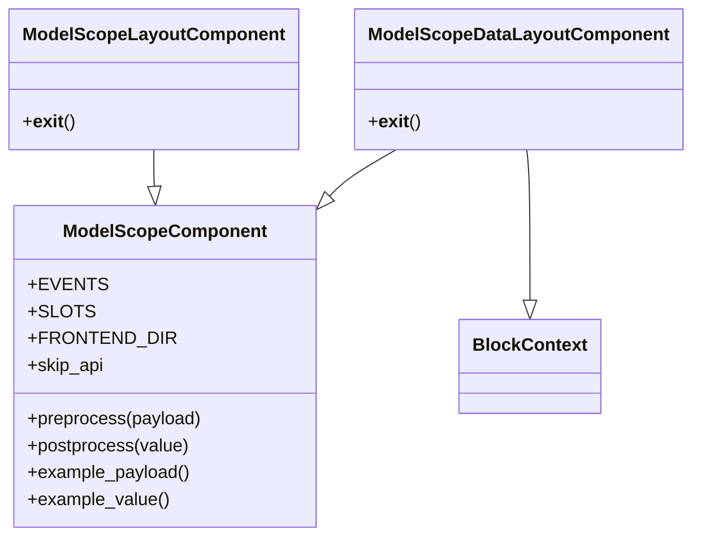
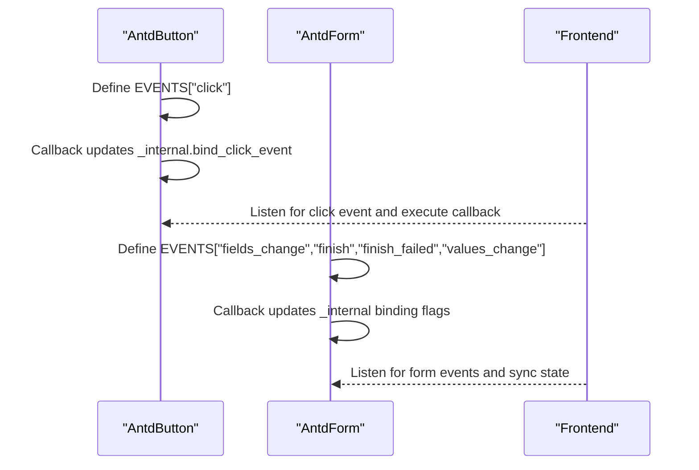
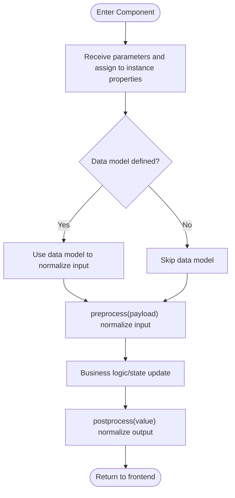
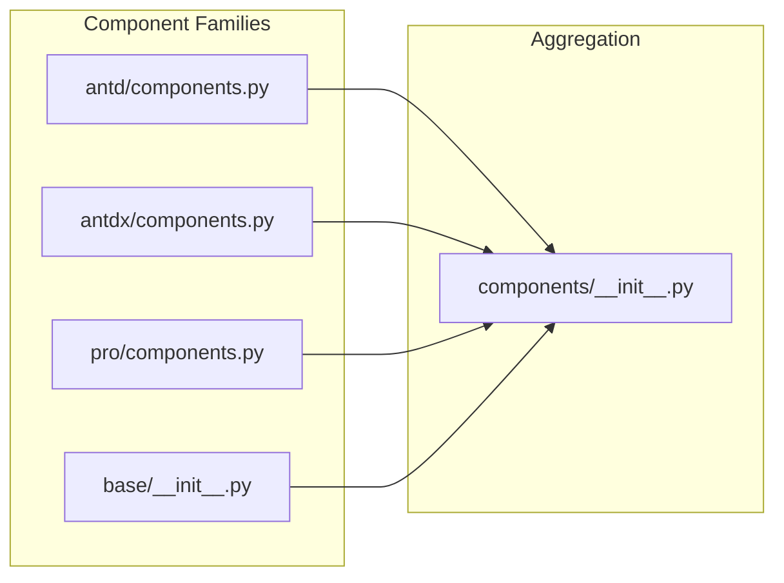

# Backend Component Development

<cite>
**Files Referenced in This Document**
- [backend/modelscope_studio/components/__init__.py](file://backend/modelscope_studio/components/__init__.py)
- [backend/modelscope_studio/components/antd/components.py](file://backend/modelscope_studio/components/antd/components.py)
- [backend/modelscope_studio/components/antdx/components.py](file://backend/modelscope_studio/components/antdx/components.py)
- [backend/modelscope_studio/components/pro/components.py](file://backend/modelscope_studio/components/pro/components.py)
- [backend/modelscope_studio/components/base/__init__.py](file://backend/modelscope_studio/components/base/__init__.py)
- [backend/modelscope_studio/utils/dev/component.py](file://backend/modelscope_studio/utils/dev/component.py)
- [backend/modelscope_studio/utils/dev/__init__.py](file://backend/modelscope_studio/utils/dev/__init__.py)
- [backend/modelscope_studio/components/antd/button/__init__.py](file://backend/modelscope_studio/components/antd/button/__init__.py)
- [backend/modelscope_studio/components/antd/form/__init__.py](file://backend/modelscope_studio/components/antd/form/__init__.py)
- [backend/modelscope_studio/components/base/text/__init__.py](file://backend/modelscope_studio/components/base/text/__init__.py)
</cite>

## Table of Contents

1. [Introduction](#introduction)
2. [Project Structure](#project-structure)
3. [Core Components](#core-components)
4. [Architecture Overview](#architecture-overview)
5. [Detailed Component Analysis](#detailed-component-analysis)
6. [Dependency Analysis](#dependency-analysis)
7. [Performance Considerations](#performance-considerations)
8. [Troubleshooting Guide](#troubleshooting-guide)
9. [Conclusion](#conclusion)
10. [Appendix](#appendix)

## Introduction

This guide is intended for backend component developers and provides a systematic explanation of how to implement Python components under the `backend/modelscope_studio/components/` directory, covering the component class inheritance hierarchy, property definition and validation, events and callbacks, lifecycle hooks, integration with frontend Svelte components, and the data transformation flow from Python to JavaScript. The document also explains how to use the component registration mechanism (`__init__.py` and `components.py`), with concrete implementation steps guided by real file paths.

## Project Structure

ModelScope Studio's backend components are organized in a layered and categorized manner: component families include `antd`, `antdx`, `base`, and `pro`; within each family, concrete components are organized in modular directories; centralized exports are handled by each family's `components.py`, which are then aggregated into the top-level namespace by `components/__init__.py` for unified import and use.

Diagram Sources

- [backend/modelscope_studio/components/**init**.py:1-5](file://backend/modelscope_studio/components/__init__.py#L1-L5)
- [backend/modelscope_studio/components/antd/components.py:1-145](file://backend/modelscope_studio/components/antd/components.py#L1-L145)
- [backend/modelscope_studio/components/antdx/components.py:1-40](file://backend/modelscope_studio/components/antdx/components.py#L1-L40)
- [backend/modelscope_studio/components/pro/components.py:1-8](file://backend/modelscope_studio/components/pro/components.py#L1-L8)
- [backend/modelscope_studio/components/base/**init**.py:1-11](file://backend/modelscope_studio/components/base/__init__.py#L1-L11)

Section Sources

- [backend/modelscope_studio/components/**init**.py:1-5](file://backend/modelscope_studio/components/__init__.py#L1-L5)
- [backend/modelscope_studio/components/antd/components.py:1-145](file://backend/modelscope_studio/components/antd/components.py#L1-L145)
- [backend/modelscope_studio/components/antdx/components.py:1-40](file://backend/modelscope_studio/components/antdx/components.py#L1-L40)
- [backend/modelscope_studio/components/pro/components.py:1-8](file://backend/modelscope_studio/components/pro/components.py#L1-L8)
- [backend/modelscope_studio/components/base/**init**.py:1-11](file://backend/modelscope_studio/components/base/__init__.py#L1-L11)

## Core Components

The base classes and metaclasses for backend components are provided by the development utility module, which standardizes component lifecycle, event binding, layout and render control, and the ability to map to frontend directory paths.

- Base Classes and Metaclasses
  - `ModelScopeComponent`: General-purpose component base class, supporting standard properties such as `value`, `visible`, `elem_*`, `render`, as well as advanced configuration like `load_fn`, `inputs`, `key`, and `every`.
  - `ModelScopeLayoutComponent`: Used for layout or container-type components, emphasizing layout updates and context exit behavior.
  - `ModelScopeDataLayoutComponent`: Data-driven layout component that integrates Gradio's `BlockContext` capabilities, supporting features like `preserved_by_key`.
- Key Conventions
  - `EVENTS`: The list of events supported by the component, typically defined via `EventListener`; callbacks update the binding flags in `_internal` so the frontend can listen.
  - `SLOTS`: The set of slot names supported by the component, used for slot injection during frontend rendering.
  - `FRONTEND_DIR`: Resolved via `resolve_frontend_dir` to the corresponding frontend Svelte component directory, ensuring frontend-backend consistency.
  - `skip_api`: Determines whether the component exposes an API interface (e.g., some purely display components can skip the API).
  - `preprocess`/`postprocess`/`example_payload`/`example_value`: Standardize data conversion and sample values, ensuring consistent data contracts between frontend and backend.

Section Sources

- [backend/modelscope_studio/utils/dev/component.py:11-169](file://backend/modelscope_studio/utils/dev/component.py#L11-L169)
- [backend/modelscope_studio/utils/dev/**init**.py:9-13](file://backend/modelscope_studio/utils/dev/__init__.py#L9-L13)

## Architecture Overview

Backend components interface with frontend Svelte components through a unified directory mapping and event binding mechanism. During initialization, the component class sets `FRONTEND_DIR` so the frontend can locate the corresponding Svelte implementation; events are registered via the `EVENTS` list and callbacks update `_internal` flags, which the frontend uses to bind the corresponding behaviors; data flow is normalized through `preprocess`/`postprocess`, ensuring consistent data shapes between the Python and JS layers.

Diagram Sources

- [backend/modelscope_studio/utils/dev/component.py:11-169](file://backend/modelscope_studio/utils/dev/component.py#L11-L169)
- [backend/modelscope_studio/components/antd/button/**init**.py:41-46](file://backend/modelscope_studio/components/antd/button/__init__.py#L41-L46)
- [backend/modelscope_studio/components/antd/form/**init**.py:23-36](file://backend/modelscope_studio/components/antd/form/__init__.py#L23-L36)

## Detailed Component Analysis

### Component Class Inheritance Hierarchy and Responsibilities

- `ModelScopeComponent`: General-purpose component, suitable for data-type components (e.g., text, input, select), supporting `value` and standard UI properties.
- `ModelScopeLayoutComponent`: Layout-type components (e.g., button, card, grid), emphasizing layout updates and context exit.
- `ModelScopeDataLayoutComponent`: Data-driven layout components (e.g., form, table), with `BlockContext` capability, suitable for complex interactions and state persistence.

Diagram Sources

- [backend/modelscope_studio/utils/dev/component.py:54-169](file://backend/modelscope_studio/utils/dev/component.py#L54-L169)

Section Sources

- [backend/modelscope_studio/utils/dev/component.py:11-169](file://backend/modelscope_studio/utils/dev/component.py#L11-L169)

### Event Handling and Callback Mechanism

- Event Definition: Declare events supported by the component via the `EVENTS` list, such as click, field change, submit completion, etc.
- Callback Logic: Event callbacks update the binding flags in `_internal`, notifying the frontend to bind events.
- Typical Usage: Click event of `AntdButton`; `fields_change`/`finish`/`values_change` of `AntdForm`, etc.

Diagram Sources

- [backend/modelscope_studio/components/antd/button/**init**.py:41-46](file://backend/modelscope_studio/components/antd/button/__init__.py#L41-L46)
- [backend/modelscope_studio/components/antd/form/**init**.py:23-36](file://backend/modelscope_studio/components/antd/form/__init__.py#L23-L36)

Section Sources

- [backend/modelscope_studio/components/antd/button/**init**.py:41-46](file://backend/modelscope_studio/components/antd/button/__init__.py#L41-L46)
- [backend/modelscope_studio/components/antd/form/**init**.py:23-36](file://backend/modelscope_studio/components/antd/form/__init__.py#L23-L36)

### Property Definition and Validation Mechanism

- Property Declaration: Components receive `value`, `additional_props`, and numerous UI-related parameters (e.g., size, shape, color, style) in `__init__`, saved as instance properties.
- Data Model: Some components provide custom data models (e.g., `AntdFormData`) to normalize complex data structures.
- Validation and Conversion: `preprocess`/`postprocess` explicitly define input/output shapes, preventing data inconsistencies between frontend and backend.

Diagram Sources

- [backend/modelscope_studio/components/antd/form/**init**.py:13-15](file://backend/modelscope_studio/components/antd/form/__init__.py#L13-L15)
- [backend/modelscope_studio/components/antd/form/**init**.py:120-126](file://backend/modelscope_studio/components/antd/form/__init__.py#L120-L126)

Section Sources

- [backend/modelscope_studio/components/antd/button/**init**.py:51-137](file://backend/modelscope_studio/components/antd/button/__init__.py#L51-L137)
- [backend/modelscope_studio/components/antd/form/**init**.py:13-15](file://backend/modelscope_studio/components/antd/form/__init__.py#L13-L15)
- [backend/modelscope_studio/components/antd/form/**init**.py:120-126](file://backend/modelscope_studio/components/antd/form/__init__.py#L120-L126)

### Lifecycle Hooks and Render Control

- Initialization: Sets base properties such as `visible`, `elem_id`, `elem_classes`, `elem_style`, `render`, `as_item`, and `_internal`.
- Context Exit: Layout-type components update `layout=True` in `__exit__` to ensure the frontend recalculates the layout.
- Rendering Strategy: `skip_api` controls whether to expose an API; `render` controls whether to render; `preserved_by_key` controls the data retention strategy (effective in data layout components).

Section Sources

- [backend/modelscope_studio/utils/dev/component.py:24-26](file://backend/modelscope_studio/utils/dev/component.py#L24-L26)
- [backend/modelscope_studio/utils/dev/component.py:125-127](file://backend/modelscope_studio/utils/dev/component.py#L125-L127)
- [backend/modelscope_studio/utils/dev/component.py:161-168](file://backend/modelscope_studio/utils/dev/component.py#L161-L168)

### Integration with Frontend Svelte Components

- Directory Mapping: Component classes point to the frontend Svelte component directory via `FRONTEND_DIR`, ensuring one-to-one correspondence between frontend and backend.
- Slots and Events: `SLOTS` defines slot names; `EVENTS` defines events; the frontend renders and binds accordingly.
- Data Conversion: `preprocess`/`postprocess` ensures consistent data shapes between Python and JS layers.

Section Sources

- [backend/modelscope_studio/components/antd/button/**init**.py:139-156](file://backend/modelscope_studio/components/antd/button/__init__.py#L139-L156)
- [backend/modelscope_studio/components/antd/form/**init**.py:114-132](file://backend/modelscope_studio/components/antd/form/__init__.py#L114-L132)
- [backend/modelscope_studio/components/base/text/**init**.py:39-56](file://backend/modelscope_studio/components/base/text/__init__.py#L39-L56)

### Steps and Standards for Creating a New Component

- Choose a Family and Directory
  - Select the appropriate family from `antd`, `antdx`, `base`, or `pro`, and create a new component subdirectory under the corresponding directory.
- Write the Component Class
  - Inherit from the appropriate base class (general / layout / data layout).
  - Define `EVENTS`, `SLOTS`, and `FRONTEND_DIR`.
  - Implement `preprocess`/`postprocess`/`example_payload`/`example_value`.
  - Receive and store all external parameters in `__init__`.
- Register the Component
  - Import and export the component class in the family-level `components.py`.
  - If adding a new family, add the export to `components/__init__.py`.
- Reference Examples
  - Text component (`base/text`): Minimal component example, demonstrating minimal properties and methods.
  - Button component (`antd/button`): Layout-type component with events and slots.
  - Form component (`antd/form`): Data layout component with a data model and multiple events.

Section Sources

- [backend/modelscope_studio/components/antd/button/**init**.py:15-157](file://backend/modelscope_studio/components/antd/button/__init__.py#L15-L157)
- [backend/modelscope_studio/components/antd/form/**init**.py:17-133](file://backend/modelscope_studio/components/antd/form/__init__.py#L17-L133)
- [backend/modelscope_studio/components/base/text/**init**.py:8-57](file://backend/modelscope_studio/components/base/text/__init__.py#L8-L57)
- [backend/modelscope_studio/components/antd/components.py:1-145](file://backend/modelscope_studio/components/antd/components.py#L1-L145)
- [backend/modelscope_studio/components/antdx/components.py:1-40](file://backend/modelscope_studio/components/antdx/components.py#L1-L40)
- [backend/modelscope_studio/components/pro/components.py:1-8](file://backend/modelscope_studio/components/pro/components.py#L1-L8)
- [backend/modelscope_studio/components/base/**init**.py:1-11](file://backend/modelscope_studio/components/base/__init__.py#L1-L11)
- [backend/modelscope_studio/components/**init**.py:1-5](file://backend/modelscope_studio/components/__init__.py#L1-L5)

## Dependency Analysis

- Component Family Exports
  - `antd/components.py` imports and exports numerous component classes, forming a complete ecosystem.
  - `antdx/components.py` exports the extended component family.
  - `pro/components.py` exports the professional component family.
  - `base/__init__.py` exports the base component family.
  - `components/__init__.py` aggregates the above family exports as a unified entry point.
- Component Class Dependencies
  - All components depend on base classes and utility functions (e.g., `resolve_frontend_dir`) under `utils/dev`.
- Events and Context
  - Events are defined via `gradio.events.EventListener`; callbacks update `_internal` flags, which the frontend uses to bind.

Diagram Sources

- [backend/modelscope_studio/components/antd/components.py:1-145](file://backend/modelscope_studio/components/antd/components.py#L1-L145)
- [backend/modelscope_studio/components/antdx/components.py:1-40](file://backend/modelscope_studio/components/antdx/components.py#L1-L40)
- [backend/modelscope_studio/components/pro/components.py:1-8](file://backend/modelscope_studio/components/pro/components.py#L1-L8)
- [backend/modelscope_studio/components/base/**init**.py:1-11](file://backend/modelscope_studio/components/base/__init__.py#L1-L11)
- [backend/modelscope_studio/components/**init**.py:1-5](file://backend/modelscope_studio/components/__init__.py#L1-L5)

Section Sources

- [backend/modelscope_studio/components/antd/components.py:1-145](file://backend/modelscope_studio/components/antd/components.py#L1-L145)
- [backend/modelscope_studio/components/antdx/components.py:1-40](file://backend/modelscope_studio/components/antdx/components.py#L1-L40)
- [backend/modelscope_studio/components/pro/components.py:1-8](file://backend/modelscope_studio/components/pro/components.py#L1-L8)
- [backend/modelscope_studio/components/base/**init**.py:1-11](file://backend/modelscope_studio/components/base/__init__.py#L1-L11)
- [backend/modelscope_studio/components/**init**.py:1-5](file://backend/modelscope_studio/components/__init__.py#L1-L5)

## Performance Considerations

- Minimize Event Binding: Only enable event binding when necessary to avoid frequent `_internal` updates causing frontend re-renders.
- Lightweight Data Conversion: `preprocess`/`postprocess` should remain simple and efficient, avoiding deep copying and complex calculations.
- Render Control: Use `render` and `skip_api` appropriately to reduce unnecessary API exposure and rendering overhead.
- Layout Component Optimization: Layout components update `layout=True` in `__exit__`; avoid triggering this repeatedly in high-frequency events.

## Troubleshooting Guide

- Event Not Taking Effect
  - Check that `EVENTS` is correctly declared and that callbacks update the corresponding `_internal` flags.
  - Confirm that the frontend has bound events based on `_internal` flags.
- Frontend Cannot Find Component
  - Check that `FRONTEND_DIR` points to the correct Svelte directory.
  - Confirm that the component class is exported in `components.py` and aggregated in `components/__init__.py`.
- Data Inconsistency
  - Check that `preprocess`/`postprocess` aligns with the data shapes on both frontend and backend.
  - For complex data, confirm that a custom data model is used and correctly parsed/serialized.
- Rendering Anomaly
  - Check that `skip_api` and `render` settings match expectations.
  - For layout components, pay attention to the timing of layout updates in `__exit__`.

Section Sources

- [backend/modelscope_studio/utils/dev/component.py:15-26](file://backend/modelscope_studio/utils/dev/component.py#L15-L26)
- [backend/modelscope_studio/utils/dev/component.py:125-127](file://backend/modelscope_studio/utils/dev/component.py#L125-L127)
- [backend/modelscope_studio/components/antd/button/**init**.py:139-156](file://backend/modelscope_studio/components/antd/button/__init__.py#L139-L156)
- [backend/modelscope_studio/components/antd/form/**init**.py:114-132](file://backend/modelscope_studio/components/antd/form/__init__.py#L114-L132)

## Conclusion

Through a unified base class hierarchy, clear event and slot conventions, strict frontend-backend directory mapping, and data conversion standards, ModelScope Studio's backend component development achieves a highly cohesive, loosely coupled, and easily extensible architecture. By following the structural conventions and implementation steps in this document, you can quickly create high-quality components that integrate seamlessly with the frontend Svelte ecosystem.

## Appendix

- Quick Reference
  - Component Base Classes: `ModelScopeComponent` / `ModelScopeLayoutComponent` / `ModelScopeDataLayoutComponent`
  - Key Properties: `EVENTS`, `SLOTS`, `FRONTEND_DIR`, `skip_api`, `preprocess`/`postprocess`, `example_payload`/`example_value`
  - Registration Path: Family-level `components.py` → `components/__init__.py`
  - Example Components: `antd/button`, `antd/form`, `base/text`
