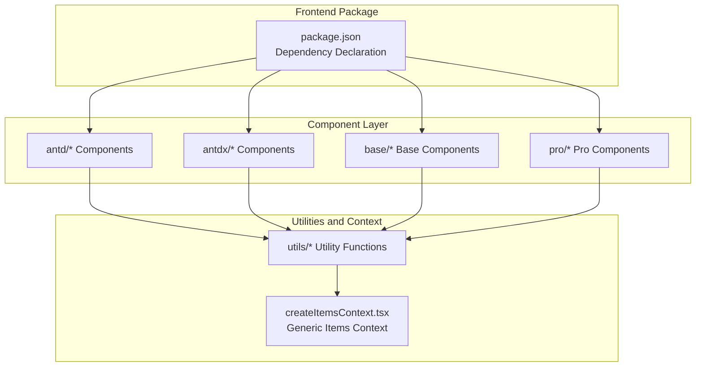
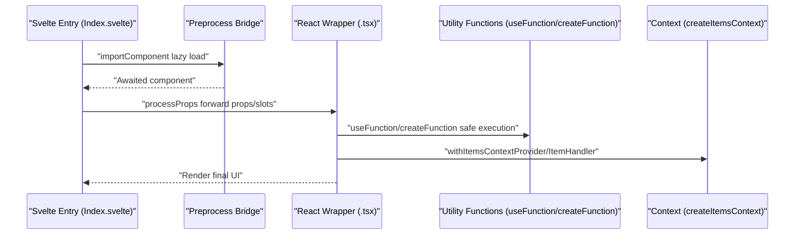
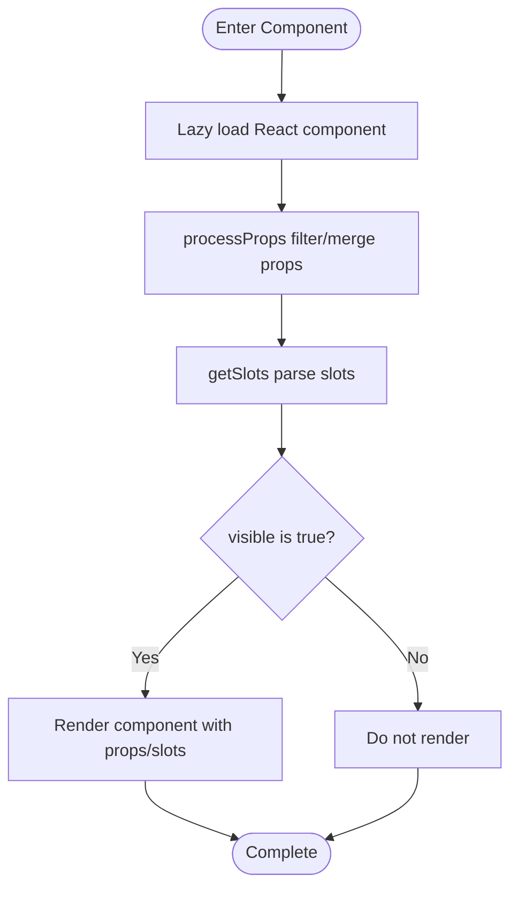
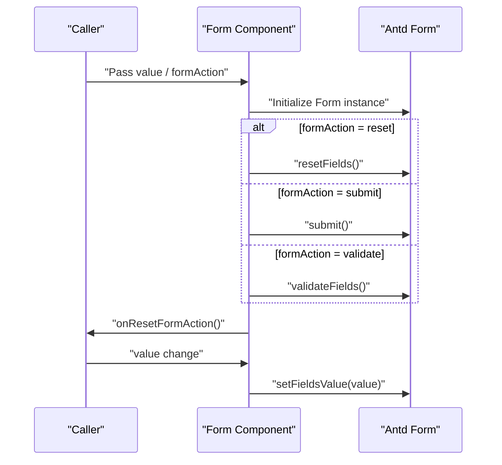
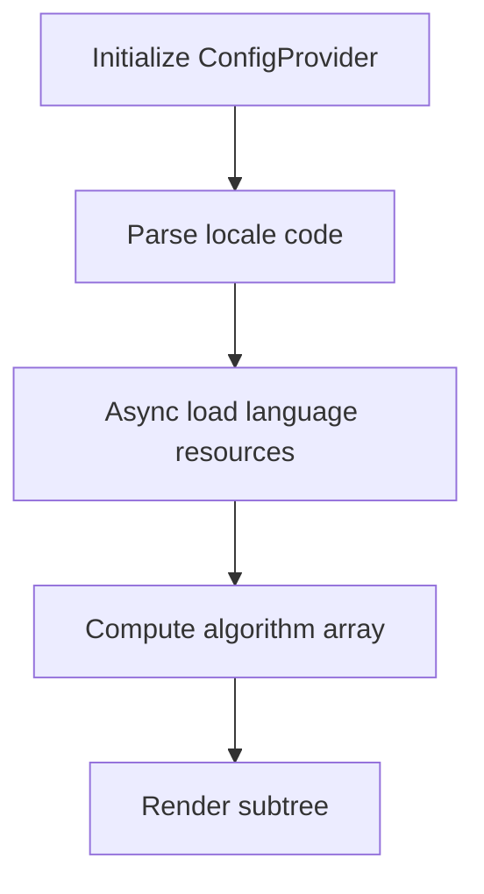
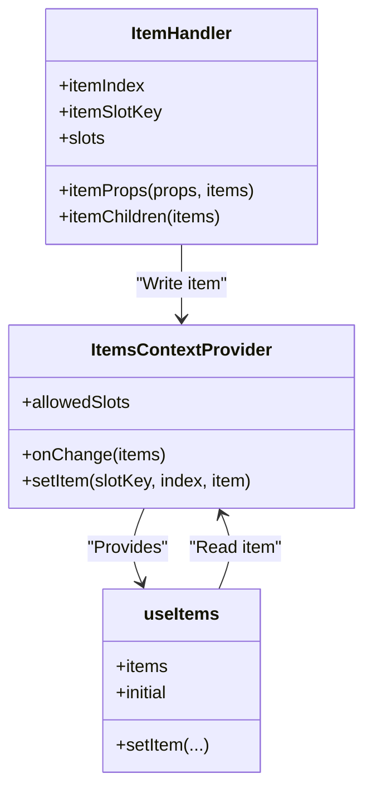
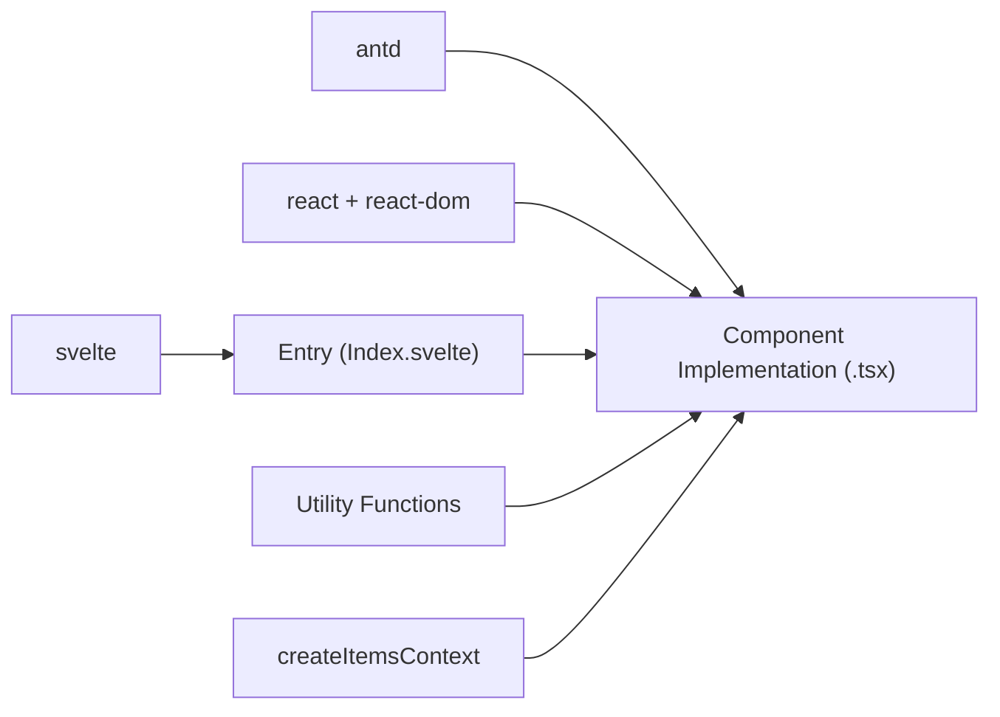

# Component Development Best Practices

<cite>
**Files Referenced in This Document**
- [frontend/package.json](file://frontend/package.json)
- [frontend/antd/button/Index.svelte](file://frontend/antd/button/Index.svelte)
- [frontend/antd/form/form.tsx](file://frontend/antd/form/form.tsx)
- [frontend/base/text/text.tsx](file://frontend/base/text/text.tsx)
- [frontend/antd/layout/layout.base.tsx](file://frontend/antd/layout/layout.base.tsx)
- [frontend/antd/grid/context.ts](file://frontend/antd/grid/context.ts)
- [frontend/antd/config-provider/config-provider.tsx](file://frontend/antd/config-provider/config-provider.tsx)
- [frontend/antd/form/context.ts](file://frontend/antd/form/context.ts)
- [frontend/utils/hooks/useFunction.ts](file://frontend/utils/hooks/useFunction.ts)
- [frontend/utils/hooks/useMemoizedFn.ts](file://frontend/utils/hooks/useMemoizedFn.ts)
- [frontend/utils/createFunction.ts](file://frontend/utils/createFunction.ts)
- [frontend/utils/createItemsContext.tsx](file://frontend/utils/createItemsContext.tsx)
- [frontend/antd/table/table.tsx](file://frontend/antd/table/table.tsx)
- [frontend/antd/modal/modal.tsx](file://frontend/antd/modal/modal.tsx)
- [eslint.config.mjs](file://eslint.config.mjs)
- [prettier.config.mjs](file://prettier.config.mjs)
</cite>

## Table of Contents

1. [Introduction](#introduction)
2. [Project Structure](#project-structure)
3. [Core Components](#core-components)
4. [Architecture Overview](#architecture-overview)
5. [Detailed Component Analysis](#detailed-component-analysis)
6. [Dependency Analysis](#dependency-analysis)
7. [Performance Considerations](#performance-considerations)
8. [Troubleshooting Guide](#troubleshooting-guide)
9. [Conclusion](#conclusion)
10. [Appendix](#appendix)

## Introduction

This guide is intended for engineers developing components within the ModelScope Studio frontend ecosystem. It systematically summarizes design principles and coding conventions, covering naming conventions, file organization, code style, performance optimization, reusability design, error handling and edge cases, internationalization and accessibility, and cross-browser compatibility — with refactoring recommendations and best practices drawn from real component implementations in the repository.

## Project Structure

This project uses a multi-package workspace (pnpm workspace) structure, with the frontend centered on the Svelte 5 + React ecosystem, bridging the Ant Design component library through a preprocessing layer to form a unified component system. Components are layered by domain: modules such as `antd`, `antdx`, `base`, and `pro`, where each component typically consists of a Svelte entry file and a corresponding React wrapper, with utility functions and context for high cohesion and low coupling.

Diagram Sources

- [frontend/package.json:1-59](file://frontend/package.json#L1-L59)

Section Sources

- [frontend/package.json:1-59](file://frontend/package.json#L1-L59)

## Core Components

This section focuses on key patterns and conventions for component development, including:

- Unified entry and wrapping: The Svelte entry handles prop forwarding, lazy loading, and slot rendering; the React wrapper handles lifecycle and state management.
- Configurable internationalization and theming: Use `ConfigProvider` to manage language, theme algorithm, and container strategy.
- Highly cohesive context: `createItemsContext` abstracts "item collections" and "sub-item handlers", supporting complex component scenarios such as dynamic columns, row selection, and expand.
- Functional capabilities: `useFunction`, `useMemoizedFn`, and `createFunction` safely convert string or functional configurations into runtime functions.

Section Sources

- [frontend/antd/button/Index.svelte:1-74](file://frontend/antd/button/Index.svelte#L1-L74)
- [frontend/antd/form/form.tsx:1-79](file://frontend/antd/form/form.tsx#L1-L79)
- [frontend/antd/config-provider/config-provider.tsx:1-154](file://frontend/antd/config-provider/config-provider.tsx#L1-L154)
- [frontend/utils/hooks/useFunction.ts:1-13](file://frontend/utils/hooks/useFunction.ts#L1-L13)
- [frontend/utils/hooks/useMemoizedFn.ts:1-11](file://frontend/utils/hooks/useMemoizedFn.ts#L1-L11)
- [frontend/utils/createFunction.ts:1-38](file://frontend/utils/createFunction.ts#L1-L38)
- [frontend/utils/createItemsContext.tsx:1-274](file://frontend/utils/createItemsContext.tsx#L1-L274)

## Architecture Overview

The diagram below shows the critical path from entry to rendering, as well as the relationships with utility functions and context.

Diagram Sources

- [frontend/antd/button/Index.svelte:10-73](file://frontend/antd/button/Index.svelte#L10-L73)
- [frontend/antd/form/form.tsx:15-76](file://frontend/antd/form/form.tsx#L15-L76)
- [frontend/utils/hooks/useFunction.ts:5-12](file://frontend/utils/hooks/useFunction.ts#L5-L12)
- [frontend/utils/createFunction.ts:10-37](file://frontend/utils/createFunction.ts#L10-L37)
- [frontend/utils/createItemsContext.tsx:171-184](file://frontend/utils/createItemsContext.tsx#L171-L184)

## Detailed Component Analysis

### Component Naming and File Organization

- Naming Conventions
  - Component directories and file names use lowerCamelCase or kebab-case, e.g., `button`, `date-picker`, `config-provider`.
  - Svelte entries are uniformly named `Index.svelte`; the corresponding component source file is named `componentName.tsx` or `componentName.svelte`.
- File Organization
  - Each component contains: an entry file (`Index.svelte`), component implementation (`*.tsx`), styles (`*.less`), and configuration (`package.json`, `gradio.config.js`).
  - Complex components are split into sub-modules (e.g., `column`, `row-selection`, `expandable` for `table`), aggregated via context.

Section Sources

- [frontend/antd/button/Index.svelte:1-74](file://frontend/antd/button/Index.svelte#L1-L74)
- [frontend/antd/config-provider/config-provider.tsx:1-154](file://frontend/antd/config-provider/config-provider.tsx#L1-L154)
- [frontend/antd/table/table.tsx:1-200](file://frontend/antd/table/table.tsx#L1-L200)

### Prop Forwarding and Lazy Loading

- Lazy Loading: Use `importComponent` for on-demand loading, preventing initial bundle bloat.
- Prop Forwarding: `processProps` filters internal fields and retains external-facing props such as visibility, style, class names, and IDs.
- Slot Rendering: `getSlots` retrieves default slots and renders custom nodes in conjunction with `ReactSlot`.

Diagram Sources

- [frontend/antd/button/Index.svelte:12-56](file://frontend/antd/button/Index.svelte#L12-L56)

Section Sources

- [frontend/antd/button/Index.svelte:12-74](file://frontend/antd/button/Index.svelte#L12-L74)

### Form Component: State Synchronization and Action Dispatch

- Action Dispatch: Triggers the corresponding behavior based on `formAction` (reset/submit/validate), then resets the action flag upon completion.
- Value Synchronization: Sets form values when `value` changes; resets fields when not provided.
- Slots and Callbacks: `requiredMark` and `feedbackIcons` prefer slots; otherwise fall back to functions or static values; `onValuesChange` syncs external state.

Diagram Sources

- [frontend/antd/form/form.tsx:32-53](file://frontend/antd/form/form.tsx#L32-L53)
- [frontend/antd/form/form.tsx:15-76](file://frontend/antd/form/form.tsx#L15-L76)

Section Sources

- [frontend/antd/form/form.tsx:1-79](file://frontend/antd/form/form.tsx#L1-L79)

### Layout Base Component: Dynamic Selector

- The Base component dynamically selects Header/Footer/Content/Layout based on the `component` parameter and uniformly injects a class prefix for style isolation.

Section Sources

- [frontend/antd/layout/layout.base.tsx:1-40](file://frontend/antd/layout/layout.base.tsx#L1-L40)

### Internationalization and Theming: ConfigProvider

- Theme Algorithm: Supports dark and compact algorithm combinations, switching based on `themeMode`.
- Language Switching: Formats the `navigator` language as an available locale code and dynamically loads `antd` and `dayjs` localization resources.
- Container Strategy: `getPopupContainer`/`getTargetContainer` supports strings or functions; functions are safely executed via `useFunction`.
- Slot Injection: Supports converting slots like `renderEmpty` to React nodes.

Diagram Sources

- [frontend/antd/config-provider/config-provider.tsx:85-105](file://frontend/antd/config-provider/config-provider.tsx#L85-L105)
- [frontend/antd/config-provider/config-provider.tsx:127-143](file://frontend/antd/config-provider/config-provider.tsx#L127-L143)

Section Sources

- [frontend/antd/config-provider/config-provider.tsx:1-154](file://frontend/antd/config-provider/config-provider.tsx#L1-L154)

### Context and Item Collections: createItemsContext

- Purpose: Provides a collection and passing mechanism for "item collections" in complex components (e.g., tables, form item rules).
- Key Capabilities
  - `withItemsContextProvider`: Wraps the subtree to establish context.
  - `ItemHandler`: Writes child items (props/slots/children) to the context, supporting memoization and deduplication.
  - `useItems`: Reads the current item collection and triggers the `onChange` callback.
- Use Cases: Table columns, expandable items, row selection, form item rules, etc.

Diagram Sources

- [frontend/utils/createItemsContext.tsx:108-170](file://frontend/utils/createItemsContext.tsx#L108-L170)
- [frontend/utils/createItemsContext.tsx:190-261](file://frontend/utils/createItemsContext.tsx#L190-L261)
- [frontend/antd/grid/context.ts:1-7](file://frontend/antd/grid/context.ts#L1-L7)

Section Sources

- [frontend/utils/createItemsContext.tsx:1-274](file://frontend/utils/createItemsContext.tsx#L1-L274)
- [frontend/antd/grid/context.ts:1-7](file://frontend/antd/grid/context.ts#L1-L7)
- [frontend/antd/form/context.ts:1-10](file://frontend/antd/form/context.ts#L1-L10)

### Table Component: Columns, Expand, Row Selection, and Function Configuration

- Columns and Expand: Aggregates column and expand configurations via context, supporting default columns and built-in placeholders (`EXPAND_COLUMN`, `SELECTION_COLUMN`).
- Function Configuration: `getPopupContainer`, `rowKey`, `rowClassName`, `sticky`, `showSorterTooltip`, `summary`/`footer`, etc. all support strings or functions, executed safely via `createFunction`/`useFunction`.
- Slots: `loading`, `pagination`, `tooltip`, `summary`, etc. support parameterized slot rendering.

Section Sources

- [frontend/antd/table/table.tsx:41-200](file://frontend/antd/table/table.tsx#L41-L200)

### Modal Component: Slots and Functional Configuration

- Slot Priority: `okText`, `cancelText`, `footer`, `title`, `closeIcon`, `okButtonProps.icon`, `cancelButtonProps.icon`, `closable.closeIcon`, `modalRender`, etc. prefer slots.
- Function Fallback: When slots are unavailable, `useFunction` converts strings or functions into executable functions.
- Container Strategy: `getContainer` supports string selectors or functions.

Section Sources

- [frontend/antd/modal/modal.tsx:1-107](file://frontend/antd/modal/modal.tsx#L1-L107)

### Base Text Component: Minimal Implementation

- Receives only `value` and renders it; inserts an empty placeholder element if empty, ensuring stable DOM structure.

Section Sources

- [frontend/base/text/text.tsx:1-11](file://frontend/base/text/text.tsx#L1-L11)

## Dependency Analysis

- Dependency Sources: `package.json` centrally declares dependencies related to Ant Design, React, Svelte, internationalization, and multimedia.
- Inter-Component Coupling: Coupling is reduced through the preprocessing bridge and utility functions; complex components are decoupled via context.
- External Integration: `ConfigProvider` works with `dayjs` for language switching; `StyleProvider` controls style hash priority.

Diagram Sources

- [frontend/package.json:8-40](file://frontend/package.json#L8-L40)
- [frontend/antd/button/Index.svelte:6-10](file://frontend/antd/button/Index.svelte#L6-L10)
- [frontend/utils/createItemsContext.tsx:1-274](file://frontend/utils/createItemsContext.tsx#L1-L274)

Section Sources

- [frontend/package.json:1-59](file://frontend/package.json#L1-L59)

## Performance Considerations

- Lazy Loading and On-Demand Rendering
  - Use `importComponent` for on-demand loading, avoiding initial blocking from importing too many components at once.
  - Svelte conditional rendering with the `visible` field reduces mounting of invalid nodes.
- Function and Object Stability
  - `useFunction`/`useMemoizedFn`/`createFunction` convert string or functional configurations into stable functions, avoiding repeated closure creation.
  - `useMemo`/`useMemoizedEqualValue` cache expensive calculations and equality comparisons in context.
- Slots and Hidden Rendering
  - Complex components often render actual content in a hidden state, only exposing placeholders, to reduce initial layout jitter.
- Theming and Styles
  - `StyleProvider` configures hash priority to prevent repaints caused by style conflicts.
- Events and Callbacks
  - Use `useMemoizedFn` to cache references for high-frequency callbacks, reducing the probability of child component re-renders.

Section Sources

- [frontend/antd/button/Index.svelte:59-73](file://frontend/antd/button/Index.svelte#L59-L73)
- [frontend/antd/form/form.tsx:28-30](file://frontend/antd/form/form.tsx#L28-L30)
- [frontend/utils/hooks/useFunction.ts:5-12](file://frontend/utils/hooks/useFunction.ts#L5-L12)
- [frontend/utils/hooks/useMemoizedFn.ts:3-10](file://frontend/utils/hooks/useMemoizedFn.ts#L3-L10)
- [frontend/utils/createFunction.ts:10-37](file://frontend/utils/createFunction.ts#L10-L37)
- [frontend/antd/config-provider/config-provider.tsx:110-110](file://frontend/antd/config-provider/config-provider.tsx#L110-L110)

## Troubleshooting Guide

- Slot Not Taking Effect
  - Check that the slot key is correct (e.g., `footer`, `title`, `okText`); confirm that it is wrapped with `ReactSlot`.
  - For slots requiring parameters, use `renderParamsSlot` for rendering.
- Function Configuration Anomaly
  - If a string function is passed, ensure the format is valid; use `createFunction`/`useFunction` for safe execution.
- Theme or Language Not Taking Effect
  - Confirm the `themeMode` and `locale` settings; check that language resource loading succeeded.
- Context Items Not Updating
  - Ensure `ItemHandler`'s `itemIndex` and `itemSlotKey` are correct; check that `setItem` is being called.
- Performance Issues
  - Check for unnecessary prop changes; use `useMemoizedFn` for callbacks; avoid creating new functions inside `render`.

Section Sources

- [frontend/antd/modal/modal.tsx:40-95](file://frontend/antd/modal/modal.tsx#L40-L95)
- [frontend/antd/config-provider/config-provider.tsx:96-105](file://frontend/antd/config-provider/config-provider.tsx#L96-L105)
- [frontend/utils/createFunction.ts:10-37](file://frontend/utils/createFunction.ts#L10-L37)
- [frontend/utils/createItemsContext.tsx:234-254](file://frontend/utils/createItemsContext.tsx#L234-L254)

## Conclusion

Based on existing component implementations in the repository, this guide summarizes the design principles and engineering practices for component development: using the Svelte entry + React wrapper bridging pattern for a unified ecosystem; achieving high cohesion and low coupling through context and utility functions; improving performance and extensibility through lazy loading, function stabilization, and the slot mechanism. Following these best practices will enhance component quality and maintainability while ensuring consistency.

## Appendix

### Design Principles and Coding Standards

- Naming and Organization
  - Component directories and file names use lowerCamelCase or kebab-case; entries are uniformly `Index.svelte`; implementations are `*.tsx`.
  - Complex components are split into sub-modules and aggregated via context.
- Props and Slots
  - Clearly distinguish between external and internal props; forward external props via `processProps`; slots take priority over static values.
- Functions and Callbacks
  - All string functions are executed safely via `createFunction`/`useFunction`; high-frequency callbacks are cached with `useMemoizedFn`.
- Internationalization and Theming
  - Use `ConfigProvider` to manage language and theme; load language resources on demand; container strategy supports both strings and functions.
- Styles and Theming
  - Use `StyleProvider` to control style hash priority; inject unified prefix class names for different component types.
- Error Handling and Edge Cases
  - Return `undefined` and degrade gracefully for unrecognized function strings; provide reasonable default values when slots are missing.
- Accessibility and Compatibility
  - Maintain semantic tags and accessible attributes; avoid relying solely on color to convey information; test on mainstream browsers and mobile devices.

Section Sources

- [frontend/antd/button/Index.svelte:24-52](file://frontend/antd/button/Index.svelte#L24-L52)
- [frontend/antd/config-provider/config-provider.tsx:110-149](file://frontend/antd/config-provider/config-provider.tsx#L110-L149)
- [frontend/utils/createFunction.ts:10-37](file://frontend/utils/createFunction.ts#L10-L37)
- [eslint.config.mjs:1-9](file://eslint.config.mjs#L1-L9)
- [prettier.config.mjs:1-26](file://prettier.config.mjs#L1-L26)
