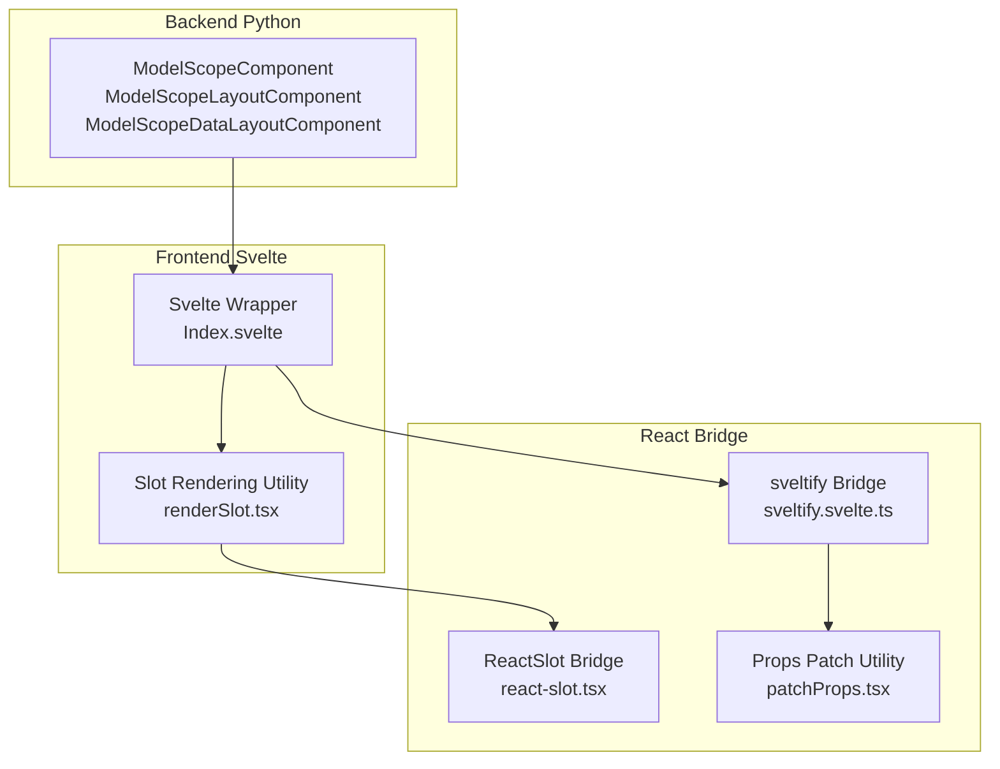
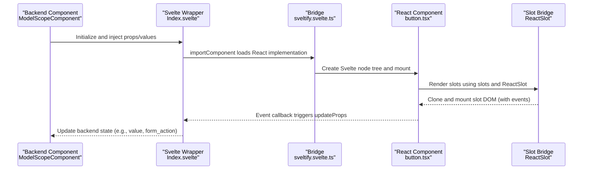
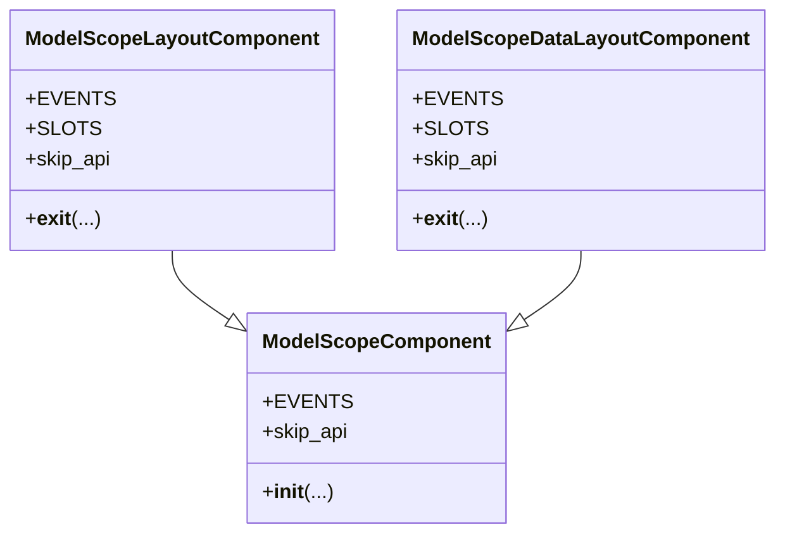
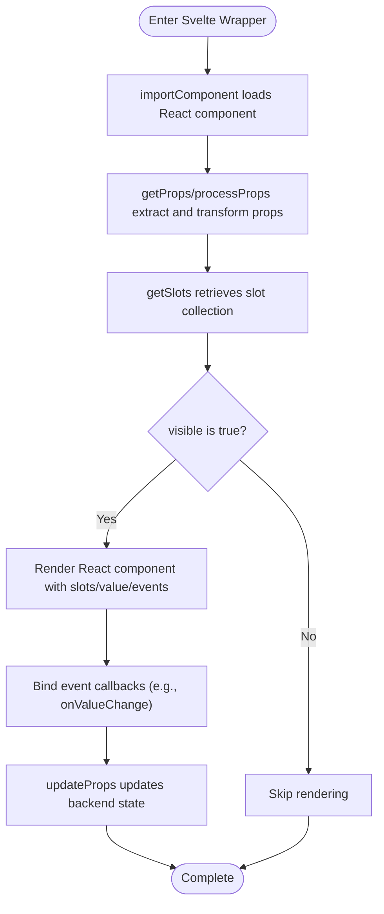
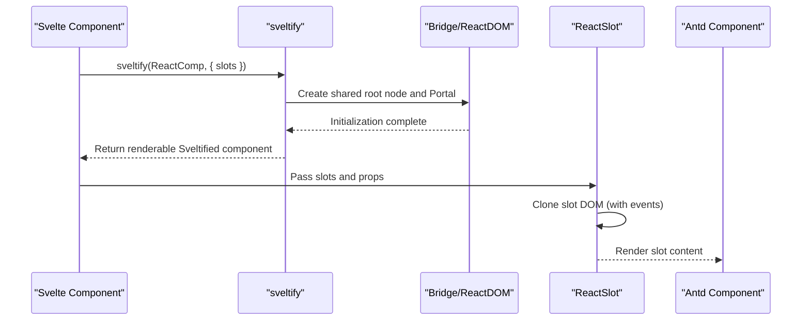
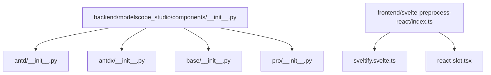

# Component Development

<cite>
**Files referenced in this document**
- [backend/modelscope_studio/components/__init__.py](file://backend/modelscope_studio/components/__init__.py)
- [backend/modelscope_studio/components/base/__init__.py](file://backend/modelscope_studio/components/base/__init__.py)
- [backend/modelscope_studio/components/antd/__init__.py](file://backend/modelscope_studio/components/antd/__init__.py)
- [backend/modelscope_studio/components/pro/__init__.py](file://backend/modelscope_studio/components/pro/__init__.py)
- [backend/modelscope_studio/utils/dev/component.py](file://backend/modelscope_studio/utils/dev/component.py)
- [frontend/svelte-preprocess-react/index.ts](file://frontend/svelte-preprocess-react/index.ts)
- [frontend/svelte-preprocess-react/sveltify.svelte.ts](file://frontend/svelte-preprocess-react/sveltify.svelte.ts)
- [frontend/svelte-preprocess-react/react-slot.tsx](file://frontend/svelte-preprocess-react/react-slot.tsx)
- [frontend/utils/renderSlot.tsx](file://frontend/utils/renderSlot.tsx)
- [frontend/utils/patchProps.tsx](file://frontend/utils/patchProps.tsx)
- [frontend/antd/button/Index.svelte](file://frontend/antd/button/Index.svelte)
- [frontend/antd/form/Index.svelte](file://frontend/antd/form/Index.svelte)
- [frontend/antd/button/button.tsx](file://frontend/antd/button/button.tsx)
</cite>

## Table of Contents

1. [Introduction](#introduction)
2. [Project Structure](#project-structure)
3. [Core Components](#core-components)
4. [Architecture Overview](#architecture-overview)
5. [Detailed Component Analysis](#detailed-component-analysis)
6. [Dependency Analysis](#dependency-analysis)
7. [Performance Considerations](#performance-considerations)
8. [Troubleshooting Guide](#troubleshooting-guide)
9. [Conclusion](#conclusion)
10. [Appendix](#appendix)

## Introduction

This guide is intended for engineers and product teams developing components in ModelScope Studio. It covers backend Python component implementation, frontend Svelte component development, React component bridging and slot system usage, as well as component structure conventions, property definitions, event handling, testing, and documentation best practices. By analyzing the backend component base classes and frontend bridging mechanisms in parallel, this guide helps you quickly extend existing components or create entirely new component types.

## Project Structure

The ModelScope Studio component system consists of three layers:

- Backend Python component layer: Uniformly inherits from Gradio's component metaclass, providing common lifecycle, events, and slot capabilities.
- Frontend Svelte layer: Each component loads its corresponding React implementation as a Svelte wrapper, responsible for prop passing, event bridging, and slot rendering.
- React bridging layer: Bridges Ant Design and other React components to be usable as Svelte components via `sveltify`, supporting slot and style passing.

**Diagram Sources**

- [backend/modelscope_studio/utils/dev/component.py:11-169](file://backend/modelscope_studio/utils/dev/component.py#L11-L169)
- [frontend/svelte-preprocess-react/sveltify.svelte.ts:1-119](file://frontend/svelte-preprocess-react/sveltify.svelte.ts#L1-L119)
- [frontend/svelte-preprocess-react/react-slot.tsx:1-224](file://frontend/svelte-preprocess-react/react-slot.tsx#L1-L224)
- [frontend/utils/renderSlot.tsx:1-29](file://frontend/utils/renderSlot.tsx#L1-L29)
- [frontend/utils/patchProps.tsx:1-39](file://frontend/utils/patchProps.tsx#L1-L39)

**Section Sources**

- [backend/modelscope_studio/components/**init**.py:1-5](file://backend/modelscope_studio/components/__init__.py#L1-L5)
- [backend/modelscope_studio/components/base/**init**.py:1-11](file://backend/modelscope_studio/components/base/__init__.py#L1-L11)
- [backend/modelscope_studio/components/antd/**init**.py:1-150](file://backend/modelscope_studio/components/antd/__init__.py#L1-L150)
- [backend/modelscope_studio/components/pro/**init**.py:1-7](file://backend/modelscope_studio/components/pro/__init__.py#L1-L7)

## Core Components

- Backend component base classes
  - ModelScopeComponent: For data components, supports common props like `visible`, `elem_id`, `elem_classes`, `elem_style`, `value`, `key`, `inputs`, `load_fn`, etc.; exposes API by default.
  - ModelScopeLayoutComponent: For layout components, supports `as_item`, `visible`, `elem_id`, `elem_classes`, `elem_style`, `render`, etc.; skips API export by default.
  - ModelScopeDataLayoutComponent: Data + layout hybrid component, has BlockContext capability and layout marker to avoid duplicate rendering.
- Frontend bridging and slots
  - sveltify: Wraps React components as Svelte components, supporting slots parameter declaration and slot tree construction.
  - ReactSlot: Clones and mounts Svelte slot content into React subtrees, supporting prop and event passing, and MutationObserver observation.
  - renderSlot: Convenient entry point for context-wrapped rendering based on whether forced cloning or parameterized rendering is needed.
  - patchProps/applyPatchToProps: Compatibility conversion of internal fields like `key`, ensuring stable React rendering.

**Section Sources**

- [backend/modelscope_studio/utils/dev/component.py:11-169](file://backend/modelscope_studio/utils/dev/component.py#L11-L169)
- [frontend/svelte-preprocess-react/sveltify.svelte.ts:1-119](file://frontend/svelte-preprocess-react/sveltify.svelte.ts#L1-L119)
- [frontend/svelte-preprocess-react/react-slot.tsx:1-224](file://frontend/svelte-preprocess-react/react-slot.tsx#L1-L224)
- [frontend/utils/renderSlot.tsx:1-29](file://frontend/utils/renderSlot.tsx#L1-L29)
- [frontend/utils/patchProps.tsx:1-39](file://frontend/utils/patchProps.tsx#L1-L39)

## Architecture Overview

The diagram below shows the call chain from backend component to frontend Svelte wrapper to React component, and how the slot system reuses Svelte slot content in React subtrees.

**Diagram Sources**

- [frontend/antd/button/Index.svelte:1-74](file://frontend/antd/button/Index.svelte#L1-L74)
- [frontend/antd/button/button.tsx:1-39](file://frontend/antd/button/button.tsx#L1-L39)
- [frontend/svelte-preprocess-react/sveltify.svelte.ts:1-119](file://frontend/svelte-preprocess-react/sveltify.svelte.ts#L1-L119)
- [frontend/svelte-preprocess-react/react-slot.tsx:1-224](file://frontend/svelte-preprocess-react/react-slot.tsx#L1-L224)

## Detailed Component Analysis

### Backend Component Base Classes and Lifecycle

- Inheritance relationships
  - ModelScopeComponent: Base data component, supports `value`, `visible`, `elem_*`, `key`, `inputs`, `load_fn`, etc.
  - ModelScopeLayoutComponent: Layout component, supports `as_item`, `visible`, `elem_*`, `render`.
  - ModelScopeDataLayoutComponent: Combines data and layout characteristics, marks layout on enter/exit to avoid duplicate rendering.
- Key behaviors
  - Automatically records parent component child node indexes for positioning and updates.
  - Supports skipping API export (`skip_api`), used for layout components.
  - Works with AppContext to ensure application context exists.

**Diagram Sources**

- [backend/modelscope_studio/utils/dev/component.py:11-169](file://backend/modelscope_studio/utils/dev/component.py#L11-L169)

**Section Sources**

- [backend/modelscope_studio/utils/dev/component.py:11-169](file://backend/modelscope_studio/utils/dev/component.py#L11-L169)

### Frontend Svelte Wrapper and Prop Handling

- Typical flow
  - Asynchronously load the corresponding React component via `importComponent`.
  - Extract and transform props using `getProps`/`processProps`, mapping names (e.g., `fields_change` → `fieldsChange`).
  - Retrieve the slot collection via `getSlots` and pass to the React component.
  - Render with visibility control, passing `children` as the default slot.
- Event bridging
  - For mutable value components (e.g., Form), listen to `onValueChange` and call `updateProps` to update backend state.

**Diagram Sources**

- [frontend/antd/form/Index.svelte:1-99](file://frontend/antd/form/Index.svelte#L1-L99)
- [frontend/antd/button/Index.svelte:1-74](file://frontend/antd/button/Index.svelte#L1-L74)

**Section Sources**

- [frontend/antd/form/Index.svelte:1-99](file://frontend/antd/form/Index.svelte#L1-L99)
- [frontend/antd/button/Index.svelte:1-74](file://frontend/antd/button/Index.svelte#L1-L74)

### React Component Bridging and Slot System

- sveltify
  - Accepts React component and optional slots declarations, returns a Sveltified component.
  - Internally maintains shared root nodes and Portals, creating Bridge render trees on demand.
  - Supports ignoring certain nodes for complex scenario optimization.
- ReactSlot
  - Clones Svelte slots into React subtrees, preserving event listeners and child nodes.
  - Supports force cloning (`forceClone`), parameterized rendering (`params`), and attribute observation (`observeAttributes`).
  - Uses ContextPropsProvider and patchProps utilities to ensure internal fields like `key` are correctly passed.
- Slot rendering pipeline
  - `renderSlot` decides whether to wrap with ContextPropsProvider based on options.
  - `patchProps`/`applyPatchToProps` corrects the `key` field before and after bridging to avoid React warnings.

**Diagram Sources**

- [frontend/svelte-preprocess-react/sveltify.svelte.ts:1-119](file://frontend/svelte-preprocess-react/sveltify.svelte.ts#L1-L119)
- [frontend/svelte-preprocess-react/react-slot.tsx:1-224](file://frontend/svelte-preprocess-react/react-slot.tsx#L1-L224)
- [frontend/utils/renderSlot.tsx:1-29](file://frontend/utils/renderSlot.tsx#L1-L29)
- [frontend/utils/patchProps.tsx:1-39](file://frontend/utils/patchProps.tsx#L1-L39)

**Section Sources**

- [frontend/svelte-preprocess-react/index.ts:1-8](file://frontend/svelte-preprocess-react/index.ts#L1-L8)
- [frontend/svelte-preprocess-react/sveltify.svelte.ts:1-119](file://frontend/svelte-preprocess-react/sveltify.svelte.ts#L1-L119)
- [frontend/svelte-preprocess-react/react-slot.tsx:1-224](file://frontend/svelte-preprocess-react/react-slot.tsx#L1-L224)
- [frontend/utils/renderSlot.tsx:1-29](file://frontend/utils/renderSlot.tsx#L1-L29)
- [frontend/utils/patchProps.tsx:1-39](file://frontend/utils/patchProps.tsx#L1-L39)

### Component Structure Conventions and Prop Definitions

- Structure conventions
  - Each component directory contains: `Index.svelte` (wrapper), corresponding React implementation (e.g., `button.tsx`), `package.json`, and `gradio.config.js`.
  - Wrappers handle prop extraction, event bridging, and slot passing.
- Prop definitions
  - Common props: `visible`, `elem_id`, `elem_classes`, `elem_style`, `as_item`, `_internal.layout`, etc.
  - Business props: e.g., Form's `formAction`, `name`, Button's `target`, `loading.icon`, etc.
  - Mapping rules: `processProps` supports name mapping (e.g., `fields_change` → `fieldsChange`).
- Event handling
  - Data components write back to backend via `onValueChange`/`updateProps`.
  - Behavior components trigger backend actions via native events like `onClick`/`onSubmit`.
- Slot system
  - Named slots like `slots.icon`, `slots['loading.icon']` inject ReactSlot.
  - Supports `children` default slot and parameterized slots (`params`).

**Section Sources**

- [frontend/antd/button/Index.svelte:1-74](file://frontend/antd/button/Index.svelte#L1-L74)
- [frontend/antd/button/button.tsx:1-39](file://frontend/antd/button/button.tsx#L1-L39)
- [frontend/antd/form/Index.svelte:1-99](file://frontend/antd/form/Index.svelte#L1-L99)

### Extending Existing Components and Creating New Component Types

- Extending existing components
  - Backend: Based on `ModelScopeComponent`/`ModelScopeLayoutComponent`, add props and events, rewrite `__exit__`/`__enter__` as needed.
  - Frontend: Extend `getProps`/`processProps` mappings in the Svelte wrapper, add event callbacks and slots.
  - React: Use sveltify to add slot declarations, render slots with ReactSlot.
- Creating new component types
  - Backend: Choose appropriate base class, define `EVENTS`/`SLOTS`, set `skip_api`.
  - Frontend: Create new `Index.svelte`, import `importComponent` and `getSlots`, configure `processProps`.
  - React: Implement sveltify wrapping, handle slots and styles, export default component.

**Section Sources**

- [backend/modelscope_studio/utils/dev/component.py:11-169](file://backend/modelscope_studio/utils/dev/component.py#L11-L169)
- [frontend/svelte-preprocess-react/sveltify.svelte.ts:1-119](file://frontend/svelte-preprocess-react/sveltify.svelte.ts#L1-L119)
- [frontend/antd/button/Index.svelte:1-74](file://frontend/antd/button/Index.svelte#L1-L74)

## Dependency Analysis

- Component classification entry points
  - Backend `components/__init__.py` aggregates components from antd, antdx, base, and pro modules.
  - `antd/__init__.py` lists numerous Ant Design component aliases for unified importing.
  - `base/__init__.py` aggregates base layout and text components.
  - `pro/__init__.py` aggregates professional components (e.g., Chatbot, Monaco Editor).
- Frontend bridging entry point
  - `svelte-preprocess-react/index.ts` exposes sveltify and internal types for use in component wrappers.

**Diagram Sources**

- [backend/modelscope_studio/components/**init**.py:1-5](file://backend/modelscope_studio/components/__init__.py#L1-L5)
- [backend/modelscope_studio/components/antd/**init**.py:1-150](file://backend/modelscope_studio/components/antd/__init__.py#L1-L150)
- [backend/modelscope_studio/components/base/**init**.py:1-11](file://backend/modelscope_studio/components/base/__init__.py#L1-L11)
- [backend/modelscope_studio/components/pro/**init**.py:1-7](file://backend/modelscope_studio/components/pro/__init__.py#L1-L7)
- [frontend/svelte-preprocess-react/index.ts:1-8](file://frontend/svelte-preprocess-react/index.ts#L1-L8)

**Section Sources**

- [backend/modelscope_studio/components/**init**.py:1-5](file://backend/modelscope_studio/components/__init__.py#L1-L5)
- [frontend/svelte-preprocess-react/index.ts:1-8](file://frontend/svelte-preprocess-react/index.ts#L1-L8)

## Performance Considerations

- Avoid duplicate rendering
  - Use the `layout` marker of `ModelScopeDataLayoutComponent` to reduce duplicate BlockContext rendering.
- Slot cloning strategy
  - ReactSlot supports force cloning (`clone`/`forceClone`) to maintain event and structure consistency during complex DOM changes.
  - Uses MutationObserver to observe slot changes and redraw on demand, reducing full update costs.
- Prop passing optimization
  - Only transform fields like `key` via `patchProps`/`applyPatchToProps` when necessary to reduce React diff overhead.
- Async loading
  - Svelte wrappers use `importComponent` to asynchronously load React components to avoid first-screen blocking.

## Troubleshooting Guide

- Slots not working
  - Check whether the Svelte wrapper correctly calls `getSlots` and passes them to the React component's slots.
  - Confirm whether the ReactSlot's `slot` parameter points to the correct DOM node.
- Events not being passed back
  - Confirm whether the component listens to `onValueChange` or other callbacks and calls `updateProps` to update backend state.
  - For form components, check whether `formAction` has been cleared or reset.
- Style and class name abnormalities
  - Check whether `elem_id`, `elem_classes`, `elem_style` are correctly passed to the React component.
  - Confirm whether ReactSlot correctly applies `className` and inline styles.
- Key conflicts or warnings
  - Use `patchProps`/`applyPatchToProps` to handle internal `key` fields to avoid React errors.

**Section Sources**

- [frontend/antd/form/Index.svelte:1-99](file://frontend/antd/form/Index.svelte#L1-L99)
- [frontend/antd/button/button.tsx:1-39](file://frontend/antd/button/button.tsx#L1-L39)
- [frontend/utils/patchProps.tsx:1-39](file://frontend/utils/patchProps.tsx#L1-L39)

## Conclusion

Through the coordination of backend component base classes and frontend bridging mechanisms, ModelScope Studio implements a complete component chain from Python to Svelte to React. By following this guide's structure conventions, prop definitions, and event handling practices, you can efficiently extend existing components or create entirely new component types, and use the slot system to achieve flexible content reuse and style passing.

## Appendix

- Component Development Checklist
  - Backend: Choose appropriate base class, define EVENTS/SLOTS, set skip_api, rewrite lifecycle as needed.
  - Frontend: Write Index.svelte, configure getProps/processProps and getSlots, handle event callbacks.
  - React: Use sveltify wrapping, declare slots, render slots via ReactSlot, apply styles and props.
  - Testing: Cover prop mapping, event passing, slot rendering, and error boundaries.
  - Documentation: Write following each component README template under docs/components, provide minimal usable examples and parameter descriptions.
