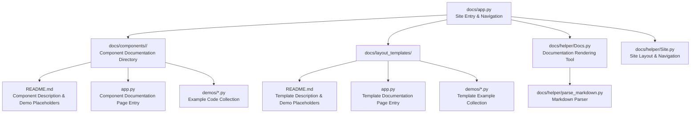
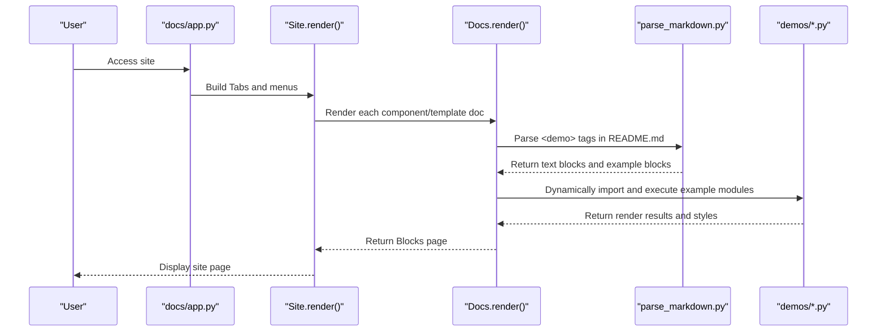
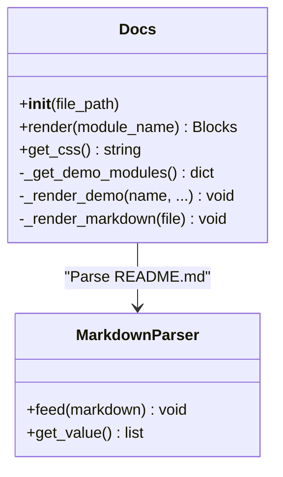
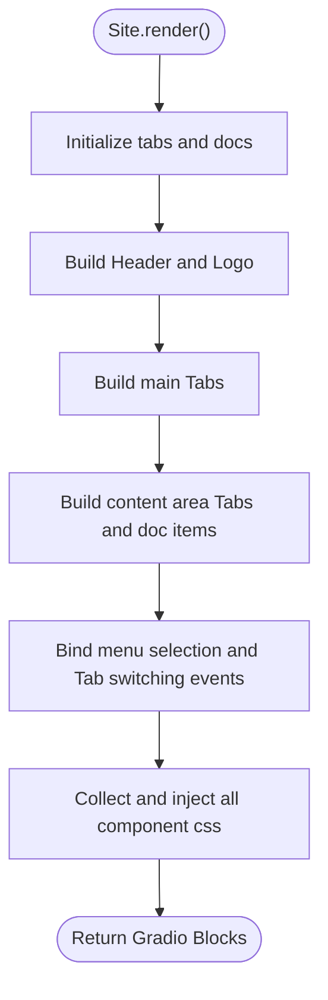
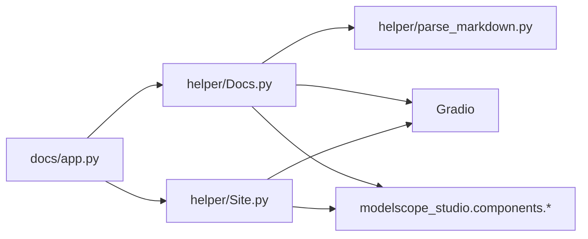

# Component Documentation Writing

<cite>
**Files Referenced in This Document**
- [Docs.py](file://docs/helper/Docs.py)
- [Site.py](file://docs/helper/Site.py)
- [app.py](file://docs/app.py)
- [README.md](file://docs/README.md)
- [FAQ.md](file://docs/FAQ.md)
- [parse_markdown.py](file://docs/helper/parse_markdown.py)
- [button/README.md](file://docs/components/antd/button/README.md)
- [button/app.py](file://docs/components/antd/button/app.py)
- [chatbot/README.md](file://docs/layout_templates/chatbot/README.md)
- [chatbot/app.py](file://docs/layout_templates/chatbot/app.py)
- [example.py](file://docs/demos/example.py)
- [basic.py (button example)](file://docs/components/antd/button/demos/basic.py)
- [basic.py (chatbot template example)](file://docs/layout_templates/chatbot/demos/basic.py)
</cite>

## Table of Contents

1. [Introduction](#introduction)
2. [Project Structure](#project-structure)
3. [Core Components](#core-components)
4. [Architecture Overview](#architecture-overview)
5. [Detailed Component Analysis](#detailed-component-analysis)
6. [Dependency Analysis](#dependency-analysis)
7. [Performance Considerations](#performance-considerations)
8. [Troubleshooting Guide](#troubleshooting-guide)
9. [Conclusion](#conclusion)
10. [Appendix](#appendix)

## Introduction

This guide is intended for developers writing complete documentation for ModelScope Studio components, covering the following topics:

- Writing conventions and metadata configuration for README.md
- Organization structure of the `demos` directory and naming conventions for example files
- Configuration methods for `app.py` and site navigation construction
- Features and usage of the documentation generation tools `Docs.py` and `Site.py`
- Layered conventions for example code: basic usage, advanced configuration, and FAQs
- How to organize component categories and navigation structures
- Template and example path references to help you get started quickly

## Project Structure

The documentation system consists of three parts: "component documentation," "layout templates," and "helper utilities," with a unified entry point `app.py` that builds site navigation and content rendering.

Diagram Sources

- [app.py:1-598](file://docs/app.py#L1-L598)
- [Docs.py:1-178](file://docs/helper/Docs.py#L1-L178)
- [Site.py:1-255](file://docs/helper/Site.py#L1-L255)
- [parse_markdown.py:1-84](file://docs/helper/parse_markdown.py#L1-L84)

Section Sources

- [app.py:1-598](file://docs/app.py#L1-L598)

## Core Components

- Docs Renderer: Responsible for parsing `<demo>` tags in README.md, dynamically loading example modules from the `demos` directory, rendering a "code + preview" side-by-side view, and collecting styles from each example module.
- Site: Responsible for building a site skeleton with multiple tabs, side menus, and a main content area, supporting tab switching, menu linking, responsive layout, and global style injection.
- Markdown Parser: Identifies and processes tags such as `<demo>`, `<demo-prefix>`, `<demo-suffix>`, and `<file>`, splitting README content into text blocks and example blocks for Docs rendering.
- Site Entry `app.py`: Scans the `components` and `layout_templates` directories, aggregates docs from each component/template, builds tabs and menus, and generates the final Site and returns Gradio Blocks.

Section Sources

- [Docs.py:12-178](file://docs/helper/Docs.py#L12-L178)
- [Site.py:9-255](file://docs/helper/Site.py#L9-L255)
- [parse_markdown.py:12-84](file://docs/helper/parse_markdown.py#L12-L84)
- [app.py:19-598](file://docs/app.py#L19-L598)

## Architecture Overview

The diagram below shows the key flow from README.md to final page rendering, and the collaboration between Docs and Site.

Diagram Sources

- [app.py:580-598](file://docs/app.py#L580-L598)
- [Site.py:41-255](file://docs/helper/Site.py#L41-L255)
- [Docs.py:171-178](file://docs/helper/Docs.py#L171-L178)
- [parse_markdown.py:80-84](file://docs/helper/parse_markdown.py#L80-L84)

## Detailed Component Analysis

### README.md Writing Conventions

- Front Matter (YAML): Used to define tags, title, colors, description, SDK, version, pinned status, header style, app file, and license. Reference: [README.md:1-17](file://docs/README.md#L1-L17)
- Title and Introduction: Concisely introduce the component library's positioning and applicable scenarios. Reference: [README.md:19-44](file://docs/README.md#L19-L44)
- Dependencies and Installation: List minimum dependencies and installation commands. Reference: [README.md:46-54](file://docs/README.md#L46-L54)
- Demo Placeholder: `<demo name="..."></demo>` is used to insert examples in the README. Reference: [README.md:56-58](file://docs/README.md#L56-L58)
- Migration Notes: Provide key migration points and compatibility recommendations. Reference: [README.md:60-75](file://docs/README.md#L60-L75)

Section Sources

- [README.md:1-75](file://docs/README.md#L1-L75)

### demos Directory Organization Structure

- Component Examples: Located in `docs/components/<category>/<component>/demos/`; each example file is named by function (e.g., `basic.py`) and exports a module object that can be dynamically imported by Docs.
- Template Examples: Located in `docs/layout_templates/<template>/demos/`, with example files split by function.
- Example File Naming: Avoid names starting with `__`; use `.py` extension; the example name is the file name (without extension).
- Example Module Requirements: Must include a callable `render` method or Gradio Blocks runnable directly as an entry point; if the example needs styles, expose a `css` string from the module.

Section Sources

- [button/README.md:1-8](file://docs/components/antd/button/README.md#L1-L8)
- [chatbot/README.md:1-20](file://docs/layout_templates/chatbot/README.md#L1-L20)
- [basic.py (button example):1-26](file://docs/components/antd/button/demos/basic.py#L1-L26)
- [basic.py (chatbot template example):1-699](file://docs/layout_templates/chatbot/demos/basic.py#L1-L699)

### app.py Configuration Method

- Component Scanning: `get_docs(type)` scans subdirectories under `docs/components/<type>`, imports `app.py` in each subdirectory, and aggregates them into a `docs` dictionary.
- Template Scanning: `get_layout_templates()` scans subdirectories under `docs/layout_templates`, imports `app.py`, and aggregates into a `docs` dictionary.
- Site Navigation: `tabs` defines tab pages and their default active items; `menus` defines the side menu tree, supporting grouping and default active keys.
- Site Instance: `Site(tabs, docs, default_active_tab, logo)` builds the site skeleton and returns Gradio Blocks.
- Launch Parameters: `demo.queue(...).launch(...)` supports concurrency and thread limit settings; in Hugging Face Spaces, pass `ssr_mode=False`.

Section Sources

- [app.py:19-598](file://docs/app.py#L19-L598)

### Documentation Generation Tool Docs.py

- Initialization: Accepts the current file path, automatically discovers `.md` files in the same directory, and filters by language suffix (selecting `zh_CN` or non-`zh_CN` based on environment variables).
- Example Discovery: Recursively scans the `demos` directory, excluding files starting with `__`, and keeps only `.py` files.
- Dynamic Import: Uses `importlib.util` to load example modules from file paths, caching them in `demo_modules`.
- Markdown Parsing: Calls `parse_markdown` to convert README content into a sequence of text blocks and example blocks.
- Example Rendering: For each example block, reads the source code of the corresponding `demos/<name>.py`, renders a "code + preview" side-by-side view; supports title, collapsible, position, and fixed parameters.
- Style Collection: Iterates through all example modules, merges `css` strings, and injects them into the root-level Gradio Blocks.

Diagram Sources

- [Docs.py:12-178](file://docs/helper/Docs.py#L12-L178)
- [parse_markdown.py:12-84](file://docs/helper/parse_markdown.py#L12-L84)

Section Sources

- [Docs.py:12-178](file://docs/helper/Docs.py#L12-L178)
- [parse_markdown.py:12-84](file://docs/helper/parse_markdown.py#L12-L84)

### Site Tool Site.py

- Navigation Structure: Accepts a `tabs` list and `docs` dictionary, builds the top menu and side menu, supporting both horizontal menu and inline menu modes.
- Style Injection: Iterates through the `css` of all components/templates in `docs` and injects them uniformly into the root-level Blocks.
- Event Binding: Tab switching and menu selection are bound via Gradio events, achieving synchronized menu highlighting and content visibility.
- Responsive Layout: Uses `Splitter` and `Layout` to implement adaptive width and scrolling for the sidebar and content area.

Diagram Sources

- [Site.py:41-255](file://docs/helper/Site.py#L41-L255)

Section Sources

- [Site.py:9-255](file://docs/helper/Site.py#L9-L255)

### Example Code Writing Standards

- Basic Usage: Demonstrate the simplest way to use the component, emphasizing the minimal runnable example. Reference: [basic.py (button example):1-26](file://docs/components/antd/button/demos/basic.py#L1-L26)
- Advanced Configuration: Demonstrate commonly used props, slots, events, and combined usage. Reference: [basic.py (chatbot template example):1-699](file://docs/layout_templates/chatbot/demos/basic.py#L1-L699)
- FAQs: Introduce examples via `<demo>` tags in README, explaining common issues and solutions. Reference: [FAQ.md:1-20](file://docs/FAQ.md#L1-L20)
- Example Module Structure: Example files should be independently runnable; add `if __name__ == "__main__": demo.queue().launch(...)` at the end when necessary. Reference: [example.py:1-11](file://docs/demos/example.py#L1-L11)

Section Sources

- [basic.py (button example):1-26](file://docs/components/antd/button/demos/basic.py#L1-L26)
- [basic.py (chatbot template example):1-699](file://docs/layout_templates/chatbot/demos/basic.py#L1-L699)
- [example.py:1-11](file://docs/demos/example.py#L1-L11)
- [FAQ.md:1-20](file://docs/FAQ.md#L1-L20)

### Component Categories and Navigation Structure

- Classification Dimensions: Base components (`base`), pro components (`pro`), Antd components (`antd`), Antdx components (`antdx`), home page and FAQ, and layout templates (`layout_templates`).
- Navigation Hierarchy: `tabs` defines first-level tab pages; each tab can configure `menus` (second-level menu tree), supporting grouping and default active keys.
- Language Adaptation: Uses `get_text` to display Chinese labels in a Chinese environment and English labels in non-Chinese environments.
- Extended Menus: A "More Components" link pointing to the official documentation can be appended at the bottom of the antd menu.

Section Sources

- [app.py:19-598](file://docs/app.py#L19-L598)

## Dependency Analysis

- Docs Dependencies: `parse_markdown`, Gradio, `modelscope_studio` component library (antd/base).
- Site Dependencies: Gradio, `modelscope_studio` component library (antd/base), responsible for layout and events.
- `app.py` Dependencies: Docs, Site, environment variable checks (whether in a ModelScope Studio environment).

Diagram Sources

- [app.py:1-598](file://docs/app.py#L1-L598)
- [Docs.py:1-178](file://docs/helper/Docs.py#L1-L178)
- [Site.py:1-255](file://docs/helper/Site.py#L1-L255)
- [parse_markdown.py:1-84](file://docs/helper/parse_markdown.py#L1-L84)

Section Sources

- [app.py:1-598](file://docs/app.py#L1-L598)
- [Docs.py:1-178](file://docs/helper/Docs.py#L1-L178)
- [Site.py:1-255](file://docs/helper/Site.py#L1-L255)
- [parse_markdown.py:1-84](file://docs/helper/parse_markdown.py#L1-L84)

## Performance Considerations

- Concurrency and Queue: Set reasonable concurrency and queue limits in `demo.queue(default_concurrency_limit=..., max_size=...)` to avoid resource contention.
- Style Injection: Site merges all component `css` for injection, avoiding style loss in multi-Blocks scenarios.
- Launch Parameters: Enable `ssr_mode=False` in Hugging Face Spaces to ensure custom components render correctly.
- Example Modules: Minimize external dependencies and network requests in examples, or provide fallback solutions.

Section Sources

- [app.py:595-598](file://docs/app.py#L595-L598)
- [Site.py:55-73](file://docs/helper/Site.py#L55-L73)

## Troubleshooting Guide

- Page Not Displaying or Blank: Add `ssr_mode=False` in `demo.launch()`. Reference: [FAQ.md:3-5](file://docs/FAQ.md#L3-L5)
- Slow Operation Response: Missing `AutoLoading` component causes a lack of loading feedback; it is recommended to use `AutoLoading` at the top level of the app. Reference: [FAQ.md:7-19](file://docs/FAQ.md#L7-L19)
- Example Cannot Render: Check that `<demo name="...">` in README.md matches the file name in the `demos` directory; confirm that the example module can be correctly loaded via `importlib.util` from the file path. Reference: [Docs.py:58-75](file://docs/helper/Docs.py#L58-L75)
- Language Display Anomaly: Confirm that environment variables and the Docs language filtering logic match expectations. Reference: [Docs.py:22-31](file://docs/helper/Docs.py#L22-L31)

Section Sources

- [FAQ.md:1-20](file://docs/FAQ.md#L1-L20)
- [Docs.py:22-31](file://docs/helper/Docs.py#L22-L31)
- [Docs.py:58-75](file://docs/helper/Docs.py#L58-L75)

## Conclusion

Through the collaboration of `Docs.py` and `Site.py`, ModelScope Studio's documentation system achieves decoupled rendering of "Markdown + example modules," ensuring both readability of the documentation and the ability to immediately verify interactive examples. Following the writing conventions and organizational patterns in this document, you can efficiently add high-quality documentation for new components and templates.

## Appendix

### README.md Front Matter Field Descriptions

- `tags`: Documentation tags for search and classification
- `title`: Documentation title
- `colorFrom`/`colorTo`: Page gradient colors
- `short_description`: Brief description
- `sdk`/`sdk_version`: SDK and version used
- `pinned`: Whether to pin at the top
- `header`: Header style
- `app_file`: Application entry file
- `license`: License

Section Sources

- [README.md:1-17](file://docs/README.md#L1-L17)

### Demo Placeholder Syntax in README.md

- `<demo name="...">`: Insert the specified example
- `<demo name="..." position="bottom|left" collapsible="true|false" title="...">`: Control example position, collapsible, and title
- `<file src="...">`: Inline insert file content

Section Sources

- [parse_markdown.py:9-62](file://docs/helper/parse_markdown.py#L9-L62)
- [button/README.md:5-8](file://docs/components/antd/button/README.md#L5-L8)
- [chatbot/README.md:13-20](file://docs/layout_templates/chatbot/README.md#L13-L20)

### Minimal Template for Component app.py

- Import Docs
- Create `docs = Docs(__file__)`
- Optional: call `docs.render().queue().launch()` in `if __name__ == "__main__"`

Section Sources

- [button/app.py:1-7](file://docs/components/antd/button/app.py#L1-L7)
- [chatbot/app.py:1-7](file://docs/layout_templates/chatbot/app.py#L1-L7)
