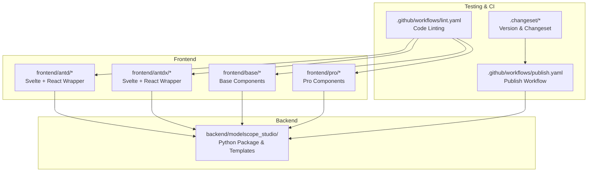
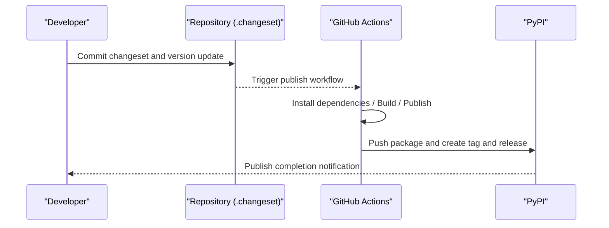
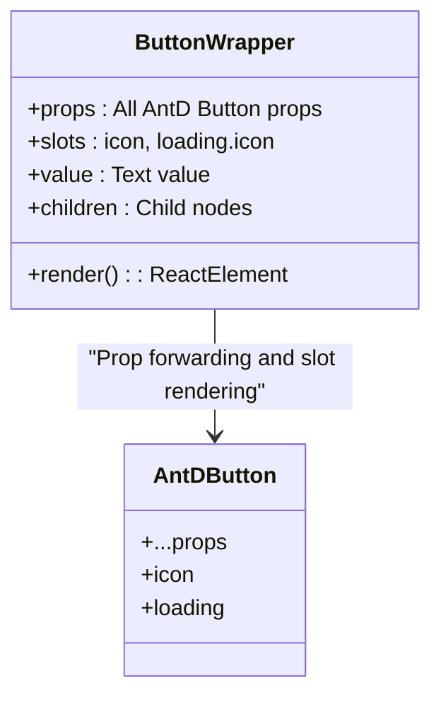
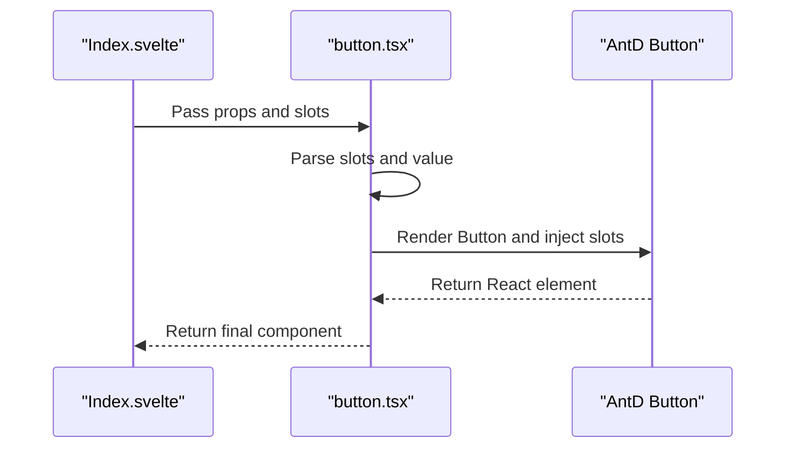
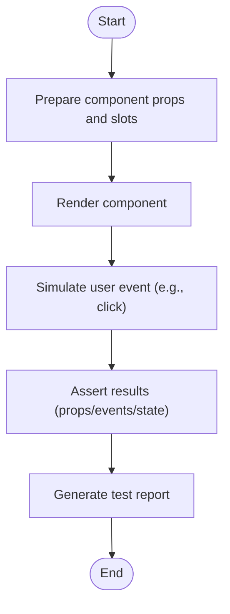
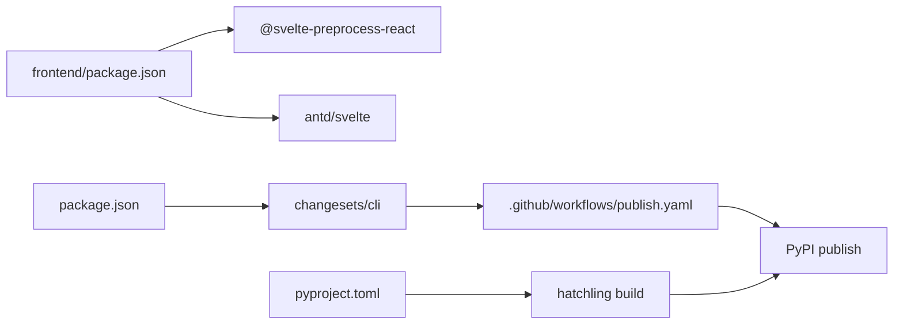

# Component Testing

<cite>
**Files Referenced in This Document**
- [.github/workflows/publish.yaml](file://.github/workflows/publish.yaml)
- [.github/workflows/lint.yaml](file://.github/workflows/lint.yaml)
- [.changeset/README.md](file://.changeset/README.md)
- [.changeset/config.json](file://.changeset/config.json)
- [package.json](file://package.json)
- [frontend/package.json](file://frontend/package.json)
- [pyproject.toml](file://pyproject.toml)
- [tests/test.py](file://tests/test.py)
- [tests/test1.py](file://tests/test1.py)
- [frontend/antd/button/button.tsx](file://frontend/antd/button/button.tsx)
- [frontend/antd/button/Index.svelte](file://frontend/antd/button/Index.svelte)
- [frontend/fixtures.d.ts](file://frontend/fixtures.d.ts)
</cite>

## Table of Contents

1. [Introduction](#introduction)
2. [Project Structure](#project-structure)
3. [Core Components](#core-components)
4. [Architecture Overview](#architecture-overview)
5. [Detailed Component Analysis](#detailed-component-analysis)
6. [Dependency Analysis](#dependency-analysis)
7. [Performance Considerations](#performance-considerations)
8. [Troubleshooting Guide](#troubleshooting-guide)
9. [Conclusion](#conclusion)
10. [Appendix](#appendix)

## Introduction

This guide focuses on component testing and continuous integration practices for ModelScope Studio, covering the implementation of unit tests, integration tests, and end-to-end tests. Combined with the existing GitHub Actions workflows and Changesets configuration in the repository, it provides actionable testing workflows and best practices. The content balances technical depth and readability, making it accessible to readers with varying backgrounds.

## Project Structure

This project uses a multi-package workspace (pnpm workspace) to organize frontend components and the backend Python package, using the Gradio ecosystem for component rendering and interaction. Key testing-related locations are as follows:

- Frontend components are located in `frontend/antd`, `frontend/antdx`, and other directories; each component consists of a Svelte template and a React wrapper layer, making them available as custom components in Gradio.
- Test samples are located in `tests/`, containing simple demo scripts based on Gradio Blocks/Interface for quickly verifying component behavior.
- GitHub Actions workflows are located in `.github/workflows/`, containing Lint processes and publish processes; the publish process includes version update and release steps but does not directly include test execution steps.
- Changesets are located in `.changeset/`, used for managing changesets and the version release process.

**Diagram Sources**

- [frontend/antd/button/Index.svelte:1-74](file://frontend/antd/button/Index.svelte#L1-L74)
- [.github/workflows/lint.yaml:1-34](file://.github/workflows/lint.yaml#L1-L34)
- [.github/workflows/publish.yaml:1-74](file://.github/workflows/publish.yaml#L1-L74)
- [.changeset/config.json:1-15](file://.changeset/config.json#L1-L15)

**Section Sources**

- [frontend/antd/button/Index.svelte:1-74](file://frontend/antd/button/Index.svelte#L1-L74)
- [.github/workflows/lint.yaml:1-34](file://.github/workflows/lint.yaml#L1-L34)
- [.github/workflows/publish.yaml:1-74](file://.github/workflows/publish.yaml#L1-L74)
- [.changeset/config.json:1-15](file://.changeset/config.json#L1-L15)

## Core Components

- Component Encapsulation Pattern: Frontend components typically use a Svelte template for prop and slot handling, bridging Ant Design components through a React wrapper layer to integrate with Gradio.
- Props and Slots: Components accept standard props and handle extended slots (such as icons and loading states) via `slots`, supporting dynamic values and visibility control.
- Test Entry Points: The repository provides simple Gradio-based test scripts that can serve as starting points for end-to-end tests.

**Section Sources**

- [frontend/antd/button/button.tsx:1-39](file://frontend/antd/button/button.tsx#L1-L39)
- [frontend/antd/button/Index.svelte:1-74](file://frontend/antd/button/Index.svelte#L1-L74)
- [tests/test.py:1-17](file://tests/test.py#L1-L17)
- [tests/test1.py:1-15](file://tests/test1.py#L1-L15)

## Architecture Overview

The diagram below shows the overall flow from component to testing and release, as well as the role of Changesets in version management.

**Diagram Sources**

- [.github/workflows/publish.yaml:1-74](file://.github/workflows/publish.yaml#L1-L74)
- [.changeset/config.json:1-15](file://.changeset/config.json#L1-L15)

**Section Sources**

- [.github/workflows/publish.yaml:1-74](file://.github/workflows/publish.yaml#L1-L74)
- [.changeset/README.md:1-9](file://.changeset/README.md#L1-L9)
- [.changeset/config.json:1-15](file://.changeset/config.json#L1-L15)

## Detailed Component Analysis

### Component: Button (antd.button)

This component demonstrates typical prop and slot handling patterns, including:

- Prop Forwarding: Passes Ant Design Button props directly to the underlying component.
- Slot Support: Supports `icon` and `loading.icon` slots, allowing custom icons and loading states.
- Dynamic Values and Visibility: Determines render content based on `children` and `value`; `visible` controls display.

**Diagram Sources**

- [frontend/antd/button/button.tsx:1-39](file://frontend/antd/button/button.tsx#L1-L39)

**Diagram Sources**

- [frontend/antd/button/Index.svelte:1-74](file://frontend/antd/button/Index.svelte#L1-L74)
- [frontend/antd/button/button.tsx:1-39](file://frontend/antd/button/button.tsx#L1-L39)

**Section Sources**

- [frontend/antd/button/button.tsx:1-39](file://frontend/antd/button/button.tsx#L1-L39)
- [frontend/antd/button/Index.svelte:1-74](file://frontend/antd/button/Index.svelte#L1-L74)

### Testing Scenarios and Practical Guidance

- Prop Validation: For the button component, verify that `icon` and `loading.icon` slots render correctly; the priority logic between `value` and `children`; the effect of `visible` on display.
- Event Triggering: In Gradio Blocks, bind a `click` callback to the button and verify input/output and callback trigger order.
- State Changes: Verify the effect of `loading` state switching, `disabled` state, `size`, and other props on rendering.
- End-to-End Testing: Start a local service using Gradio Interface/Blocks, then verify by clicking buttons and observing output and logs manually or via automation.

[This diagram is a conceptual flow and does not map directly to specific source files]

**Section Sources**

- [tests/test.py:1-17](file://tests/test.py#L1-L17)
- [tests/test1.py:1-15](file://tests/test1.py#L1-L15)

## Dependency Analysis

- Frontend Dependencies: Components depend on Ant Design and Svelte 5; `@svelte-preprocess-react` bridges React components to Svelte.
- Backend Packaging: Uses `hatchling` to build the Python package, containing numerous template files to ensure components are available in the Gradio environment.
- Versioning and Release: Changesets manages version numbers and change log; the publish workflow handles dependency installation, building, and publishing to PyPI.

**Diagram Sources**

- [frontend/package.json:1-59](file://frontend/package.json#L1-L59)
- [pyproject.toml:1-258](file://pyproject.toml#L1-L258)
- [package.json:1-55](file://package.json#L1-L55)
- [.github/workflows/publish.yaml:1-74](file://.github/workflows/publish.yaml#L1-L74)

**Section Sources**

- [frontend/package.json:1-59](file://frontend/package.json#L1-L59)
- [pyproject.toml:1-258](file://pyproject.toml#L1-L258)
- [package.json:1-55](file://package.json#L1-L55)
- [.github/workflows/publish.yaml:1-74](file://.github/workflows/publish.yaml#L1-L74)

## Performance Considerations

- Component Rendering: Minimize unnecessary prop recalculation and slot parsing, avoiding heavy computations on the render path.
- Event Handling: When binding events in Gradio, ensure callback function idempotency and minimize side effects.
- Build and Release: The publish workflow already includes installation and build steps; consider caching dependencies locally to improve speed.

[This section contains general recommendations; no source code references are required]

## Troubleshooting Guide

- Lint Workflow Failure: Check Python and Node dependency installation, and whether formatting and type checks pass.
- Publish Workflow Failure: Confirm correct configuration of PyPI credentials and GitHub Token; check version update and tag creation steps.
- Component Rendering Anomaly: Verify slot names and prop forwarding logic; check compatibility between the Svelte template and the React wrapper layer.

**Section Sources**

- [.github/workflows/lint.yaml:1-34](file://.github/workflows/lint.yaml#L1-L34)
- [.github/workflows/publish.yaml:1-74](file://.github/workflows/publish.yaml#L1-L74)

## Conclusion

Based on the existing repository structure and configuration, this guide provides recommendations for component testing and continuous integration. It is recommended to add unit and end-to-end testing steps on top of the existing Lint workflow, and to form a complete quality loop by combining Changesets with the publish workflow.

## Appendix

### Managing Versions and Releases with Changesets

- Initialization and Configuration: The repository already includes Changesets configuration and documentation, ready to use.
- Common Commands:
  - Version Update: Run the version update script to generate changesets and version numbers.
  - Create Changeset: Add changeset files when needed to describe the scope and impact of changes.
- Collaboration with Publish Workflow: The publish workflow builds and publishes based on commits after version updates.

**Section Sources**

- [.changeset/README.md:1-9](file://.changeset/README.md#L1-L9)
- [.changeset/config.json:1-15](file://.changeset/config.json#L1-L15)
- [package.json:1-55](file://package.json#L1-L55)

### Adding Test Steps in GitHub Actions

- Current Workflows:
  - Lint Workflow: Installs dependencies and performs code linting.
  - Publish Workflow: Installs dependencies, builds, and publishes to PyPI.
- Recommended New Test Steps:
  - Unit Tests: Add test scripts and run commands in the frontend component directories.
  - Integration Tests: Add test scripts and run commands in the backend Python package.
  - End-to-End Tests: Start a service using Gradio example scripts and perform interaction verification.
- Test Reports: After tests complete, upload reports or generate summary information.

**Section Sources**

- [.github/workflows/lint.yaml:1-34](file://.github/workflows/lint.yaml#L1-L34)
- [.github/workflows/publish.yaml:1-74](file://.github/workflows/publish.yaml#L1-L74)
- [tests/test.py:1-17](file://tests/test.py#L1-L17)
- [tests/test1.py:1-15](file://tests/test1.py#L1-L15)

### Key Points for Writing Component Test Cases and Test Data

- Test Case Design:
  - Normal Path: Verify normal rendering and interaction of props and slots.
  - Edge Cases: Empty values, disabled state, loading state, extra-long text, etc.
  - Error Scenarios: Invalid props, missing slots, etc.
- Test Data:
  - Use a minimal dataset to cover key branches.
  - For asynchronous scenarios (e.g., progress bars), use time slices and assertions.
- Assertion Strategy:
  - Prop Assertions: Verify the final rendered DOM or React element props.
  - Event Assertions: Verify callback trigger counts and parameters.
  - State Assertions: Verify consistency between internal state changes and external behavior.

**Section Sources**

- [tests/test1.py:1-15](file://tests/test1.py#L1-L15)
- [frontend/fixtures.d.ts:1-50](file://frontend/fixtures.d.ts#L1-L50)
