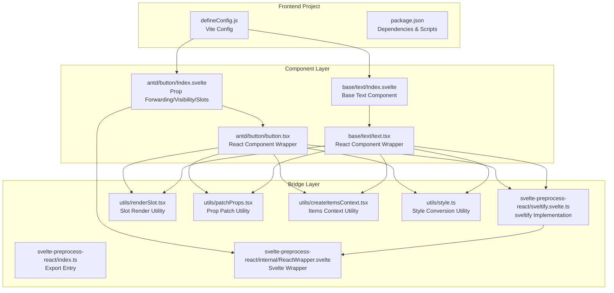
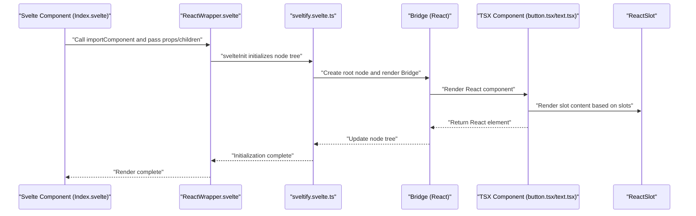
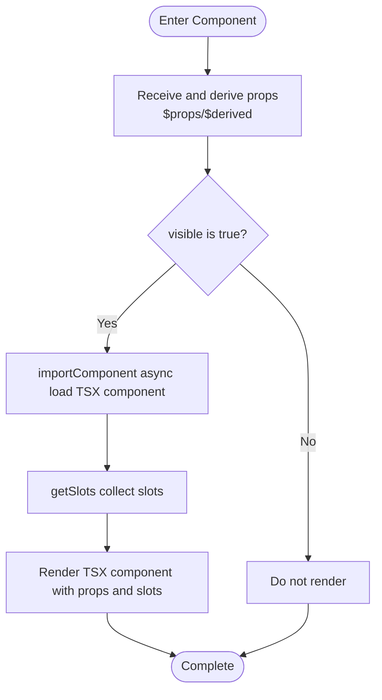
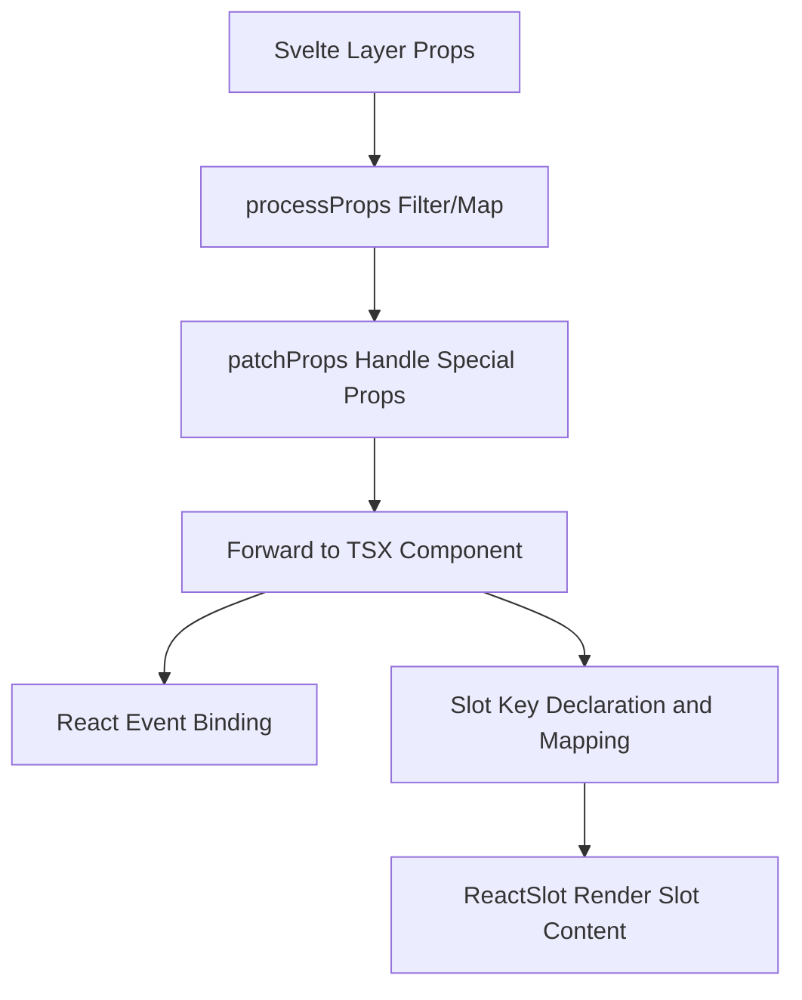
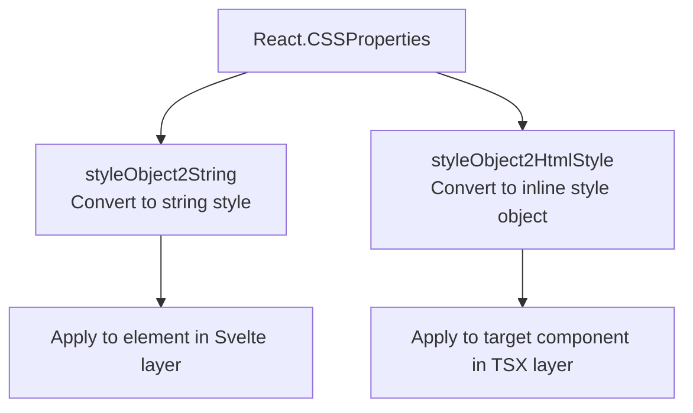
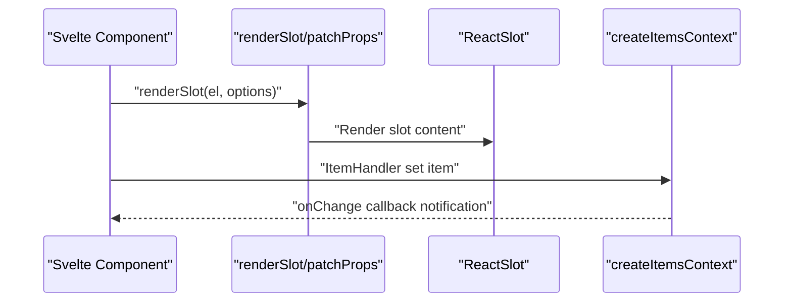
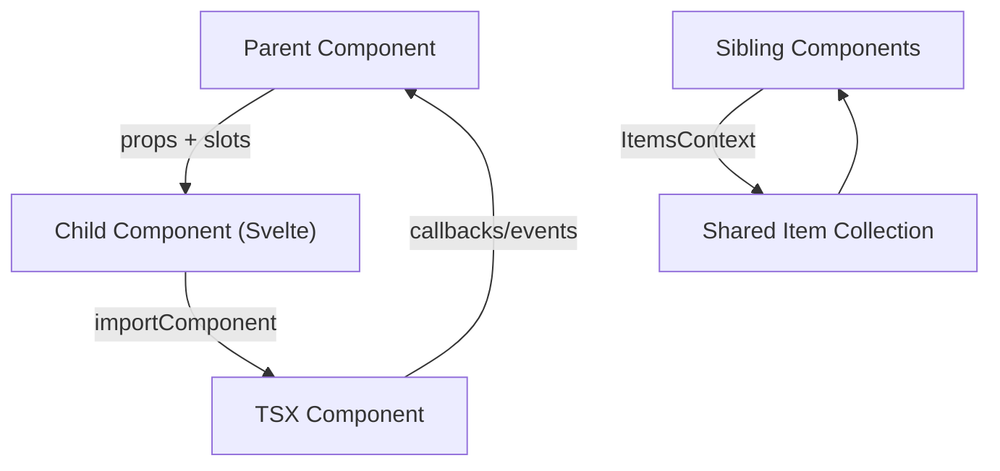
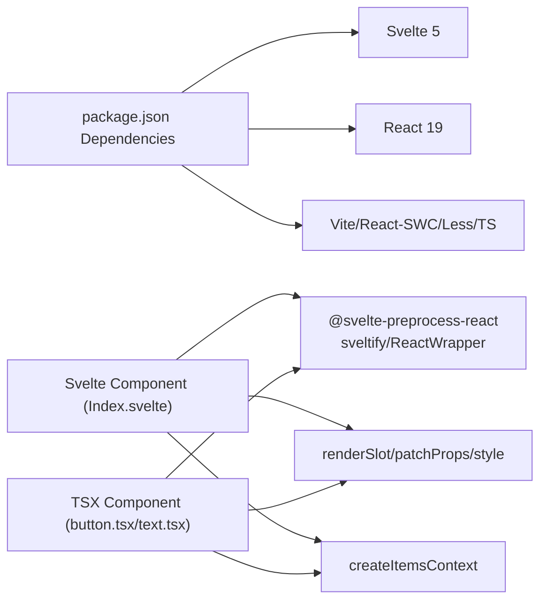

# Frontend Component Development

<cite>
**Files Referenced in This Document**
- [frontend/package.json](file://frontend/package.json)
- [frontend/defineConfig.js](file://frontend/defineConfig.js)
- [frontend/svelte-preprocess-react/index.ts](file://frontend/svelte-preprocess-react/index.ts)
- [frontend/svelte-preprocess-react/sveltify.svelte.ts](file://frontend/svelte-preprocess-react/sveltify.svelte.ts)
- [frontend/svelte-preprocess-react/internal/ReactWrapper.svelte](file://frontend/svelte-preprocess-react/internal/ReactWrapper.svelte)
- [frontend/utils/renderSlot.tsx](file://frontend/utils/renderSlot.tsx)
- [frontend/utils/patchProps.tsx](file://frontend/utils/patchProps.tsx)
- [frontend/utils/createItemsContext.tsx](file://frontend/utils/createItemsContext.tsx)
- [frontend/utils/style.ts](file://frontend/utils/style.ts)
- [frontend/antd/button/Index.svelte](file://frontend/antd/button/Index.svelte)
- [frontend/antd/button/button.tsx](file://frontend/antd/button/button.tsx)
- [frontend/base/text/Index.svelte](file://frontend/base/text/Index.svelte)
- [frontend/base/text/text.tsx](file://frontend/base/text/text.tsx)
</cite>

## Table of Contents

1. [Introduction](#introduction)
2. [Project Structure](#project-structure)
3. [Core Components](#core-components)
4. [Architecture Overview](#architecture-overview)
5. [Detailed Component Analysis](#detailed-component-analysis)
6. [Dependency Analysis](#dependency-analysis)
7. [Performance Considerations](#performance-considerations)
8. [Troubleshooting Guide](#troubleshooting-guide)
9. [Conclusion](#conclusion)
10. [Appendix](#appendix)

## Introduction

This guide is intended for frontend developers and provides a systematic explanation of how to develop components under the `frontend/` directory using Svelte 5, and how to bridge existing React components as Svelte components via `svelte-preprocess-react`. Topics covered include component structure, lifecycle and state management, event handling, style processing, the slot system, property passing, inter-component communication, and data flow — with direct file path references and best practices.

## Project Structure

- The root directory contains Vite configuration and build entry points. The frontend project is organized in a modular fashion, layered by component type (antd, antdx, base, pro, etc.).
- Each concrete component typically consists of two parts: a Svelte layer `Index.svelte` (responsible for prop forwarding, visibility control, slot collection, and rendering) and a TSX layer component file (responsible for actual UI rendering and bridge logic).
- `svelte-preprocess-react` provides the `sveltify` utility to wrap React components as Svelte-compatible components, supporting slots, context, node tree management, and mount bridging.

**Diagram Sources**

- [frontend/defineConfig.js:1-19](file://frontend/defineConfig.js#L1-L19)
- [frontend/package.json:1-59](file://frontend/package.json#L1-L59)
- [frontend/antd/button/Index.svelte:1-74](file://frontend/antd/button/Index.svelte#L1-L74)
- [frontend/antd/button/button.tsx:1-39](file://frontend/antd/button/button.tsx#L1-L39)
- [frontend/base/text/Index.svelte:1-42](file://frontend/base/text/Index.svelte#L1-L42)
- [frontend/base/text/text.tsx:1-11](file://frontend/base/text/text.tsx#L1-L11)
- [frontend/svelte-preprocess-react/index.ts:1-8](file://frontend/svelte-preprocess-react/index.ts#L1-L8)
- [frontend/svelte-preprocess-react/sveltify.svelte.ts:1-119](file://frontend/svelte-preprocess-react/sveltify.svelte.ts#L1-L119)
- [frontend/svelte-preprocess-react/internal/ReactWrapper.svelte:1-82](file://frontend/svelte-preprocess-react/internal/ReactWrapper.svelte#L1-L82)
- [frontend/utils/renderSlot.tsx:1-29](file://frontend/utils/renderSlot.tsx#L1-L29)
- [frontend/utils/patchProps.tsx:1-39](file://frontend/utils/patchProps.tsx#L1-L39)
- [frontend/utils/createItemsContext.tsx:1-274](file://frontend/utils/createItemsContext.tsx#L1-L274)
- [frontend/utils/style.ts:1-77](file://frontend/utils/style.ts#L1-L77)

**Section Sources**

- [frontend/defineConfig.js:1-19](file://frontend/defineConfig.js#L1-L19)
- [frontend/package.json:1-59](file://frontend/package.json#L1-L59)

## Core Components

- Svelte Component Layer (Index.svelte)
  - Receives props from parent components, performs filtering and derived calculations, controls visibility, collects slots, and passes them to the TSX layer.
  - Uses asynchronous loading to import TSX components, avoiding blocking initial render.
- TSX Component Layer (\*.tsx)
  - Uses `sveltify` to wrap React components into Svelte-compatible components, supporting slot mapping, prop patching, context injection, and node tree management.
  - Uses `ReactSlot` to render slot content from Svelte, supporting cloning and parameterized rendering.
- Bridge and Utilities
  - `sveltify`: Establishes the bridge between Svelte and React, maintains shared root nodes and child node trees, and handles mounting and unmounting.
  - `ReactWrapper`: Acts as a wrapper in Svelte, injects context, collects slots and props, and cleans up the node tree on destroy.
  - `renderSlot`/`patchProps`/`createItemsContext`/`style`: Handle slot rendering, prop patching, items context, and style conversion respectively.

**Section Sources**

- [frontend/antd/button/Index.svelte:1-74](file://frontend/antd/button/Index.svelte#L1-L74)
- [frontend/antd/button/button.tsx:1-39](file://frontend/antd/button/button.tsx#L1-L39)
- [frontend/base/text/Index.svelte:1-42](file://frontend/base/text/Index.svelte#L1-L42)
- [frontend/base/text/text.tsx:1-11](file://frontend/base/text/text.tsx#L1-L11)
- [frontend/svelte-preprocess-react/sveltify.svelte.ts:1-119](file://frontend/svelte-preprocess-react/sveltify.svelte.ts#L1-L119)
- [frontend/svelte-preprocess-react/internal/ReactWrapper.svelte:1-82](file://frontend/svelte-preprocess-react/internal/ReactWrapper.svelte#L1-L82)
- [frontend/utils/renderSlot.tsx:1-29](file://frontend/utils/renderSlot.tsx#L1-L29)
- [frontend/utils/patchProps.tsx:1-39](file://frontend/utils/patchProps.tsx#L1-L39)
- [frontend/utils/createItemsContext.tsx:1-274](file://frontend/utils/createItemsContext.tsx#L1-L274)
- [frontend/utils/style.ts:1-77](file://frontend/utils/style.ts#L1-L77)

## Architecture Overview

The diagram below illustrates the bridge flow from Svelte components to React components, along with the prop and slot propagation chain.

**Diagram Sources**

- [frontend/antd/button/Index.svelte:1-74](file://frontend/antd/button/Index.svelte#L1-L74)
- [frontend/svelte-preprocess-react/internal/ReactWrapper.svelte:1-82](file://frontend/svelte-preprocess-react/internal/ReactWrapper.svelte#L1-L82)
- [frontend/svelte-preprocess-react/sveltify.svelte.ts:1-119](file://frontend/svelte-preprocess-react/sveltify.svelte.ts#L1-L119)
- [frontend/antd/button/button.tsx:1-39](file://frontend/antd/button/button.tsx#L1-L39)
- [frontend/utils/renderSlot.tsx:1-29](file://frontend/utils/renderSlot.tsx#L1-L29)

## Detailed Component Analysis

### Component Structure and Lifecycle

- Svelte Layer (Index.svelte)
  - Uses `$props`/`$derived` for prop derivation and visibility control; uses `importComponent` for asynchronous loading of TSX components to improve performance.
  - Uses `getProps`/`processProps` to filter and additionally process props, ensuring only necessary props are passed.
  - Uses `getSlots` to collect slots and pass them to the TSX layer.
- TSX Layer (\*.tsx)
  - Uses `sveltify` to wrap React components, declares supported slot keys (e.g., `icon`, `loading.icon`), and maps slots via `ReactSlot` during rendering.
  - Uses tools like `useTargets` to handle priority between `children` and `value`, ensuring rendering consistency.
- Lifecycle and State
  - `ReactWrapper` injects context, collects slots and props during initialization; removes itself from the parent node and triggers re-render on destroy.
  - `sveltify` internally maintains a shared root node and child node tree; node changes trigger rerender.

**Diagram Sources**

- [frontend/antd/button/Index.svelte:1-74](file://frontend/antd/button/Index.svelte#L1-L74)
- [frontend/base/text/Index.svelte:1-42](file://frontend/base/text/Index.svelte#L1-L42)

**Section Sources**

- [frontend/antd/button/Index.svelte:1-74](file://frontend/antd/button/Index.svelte#L1-L74)
- [frontend/base/text/Index.svelte:1-42](file://frontend/base/text/Index.svelte#L1-L42)
- [frontend/svelte-preprocess-react/internal/ReactWrapper.svelte:1-82](file://frontend/svelte-preprocess-react/internal/ReactWrapper.svelte#L1-L82)

### Event Handling and Prop Passing

- Prop Passing
  - `processProps` filters and maps props, for example mapping `href_target` to `target`, while keeping `restProps` and additional props.
  - Uses `patchProps`/`applyPatchToProps` to handle special props like `key` to avoid conflicts.
- Event Binding
  - React event callbacks are bound directly in the TSX layer and forwarded via props through the Svelte layer; be careful to avoid duplicate binding or lost context.
- Slot Mapping
  - Supported slot keys are declared in the TSX layer; `ReactSlot` renders the corresponding slot content, supporting `clone` and parameterized rendering.

**Diagram Sources**

- [frontend/antd/button/Index.svelte:24-52](file://frontend/antd/button/Index.svelte#L24-L52)
- [frontend/utils/patchProps.tsx:1-39](file://frontend/utils/patchProps.tsx#L1-L39)
- [frontend/antd/button/button.tsx:8-36](file://frontend/antd/button/button.tsx#L8-L36)

**Section Sources**

- [frontend/antd/button/Index.svelte:24-52](file://frontend/antd/button/Index.svelte#L24-L52)
- [frontend/utils/patchProps.tsx:1-39](file://frontend/utils/patchProps.tsx#L1-L39)
- [frontend/antd/button/button.tsx:8-36](file://frontend/antd/button/button.tsx#L8-L36)

### Style Processing and Unit Conversion

- Style object to string: Converts camelCase to hyphenated form and automatically appends `px` units to numeric properties (except explicitly unitless properties).
- HTML inline style: Converts style objects into key-value pairs that can be used directly for inline styles.
- In the Svelte layer, `elem_style`/`elem_classes` can be used to forward styles and class names, which are then applied to the target React component in the TSX layer.

**Diagram Sources**

- [frontend/utils/style.ts:1-77](file://frontend/utils/style.ts#L1-L77)
- [frontend/antd/button/Index.svelte:62-63](file://frontend/antd/button/Index.svelte#L62-L63)

**Section Sources**

- [frontend/utils/style.ts:1-77](file://frontend/utils/style.ts#L1-L77)
- [frontend/antd/button/Index.svelte:62-63](file://frontend/antd/button/Index.svelte#L62-L63)

### Slot System and Items Context

- Slot Rendering
  - `renderSlot` provides a unified slot rendering entry point, supporting `clone`, `forceClone`, and `params` parameterized rendering.
  - `ReactSlot` receives slot DOM from Svelte and renders it as a React subtree.
- Items Context (ItemsContext)
  - `createItemsContext` provides context for item collections, supporting item setting, change listening, and recursive child item construction.
  - `ItemHandler` converts Svelte item descriptions (props, slots, children) into normalized structures and writes them into the context.

**Diagram Sources**

- [frontend/utils/renderSlot.tsx:1-29](file://frontend/utils/renderSlot.tsx#L1-L29)
- [frontend/utils/patchProps.tsx:1-39](file://frontend/utils/patchProps.tsx#L1-L39)
- [frontend/utils/createItemsContext.tsx:1-274](file://frontend/utils/createItemsContext.tsx#L1-L274)

**Section Sources**

- [frontend/utils/renderSlot.tsx:1-29](file://frontend/utils/renderSlot.tsx#L1-L29)
- [frontend/utils/patchProps.tsx:1-39](file://frontend/utils/patchProps.tsx#L1-L39)
- [frontend/utils/createItemsContext.tsx:1-274](file://frontend/utils/createItemsContext.tsx#L1-L274)

### Inter-Component Communication and Data Flow

- Parent-Child Communication
  - Parent components pass data and UI fragments to child components via props and slots; child components parse and render them in the TSX layer.
- Sibling/Cross-Layer Communication
  - `createItemsContext` shares item collections across multiple levels, enabling data synchronization between sibling components.
- Event Propagation
  - Callbacks are bound in the TSX layer and propagated upward to parent components via props; in the Svelte layer, event handlers forward the events.

**Diagram Sources**

- [frontend/antd/button/Index.svelte:1-74](file://frontend/antd/button/Index.svelte#L1-L74)
- [frontend/antd/button/button.tsx:1-39](file://frontend/antd/button/button.tsx#L1-L39)
- [frontend/utils/createItemsContext.tsx:1-274](file://frontend/utils/createItemsContext.tsx#L1-L274)

**Section Sources**

- [frontend/antd/button/Index.svelte:1-74](file://frontend/antd/button/Index.svelte#L1-L74)
- [frontend/antd/button/button.tsx:1-39](file://frontend/antd/button/button.tsx#L1-L39)
- [frontend/utils/createItemsContext.tsx:1-274](file://frontend/utils/createItemsContext.tsx#L1-L274)

## Dependency Analysis

- Dependencies and Versions
  - The frontend project uses Svelte 5 and React 19, along with the toolchain including `@vitejs/plugin-react-swc`, `less`, `typescript-json-schema`, and others.
  - `svelte-preprocess-react` provides bridging capability, internally containing core modules such as Bridge, ReactWrapper, and ReactSlot.
- Key Dependency Relationships
  - Svelte components depend on `@svelte-preprocess-react/component` and Svelte context utilities for prop and slot processing.
  - TSX components depend on `sveltify` and `ReactSlot` for bridging and slot rendering.
  - Utility modules (`renderSlot`, `patchProps`, `createItemsContext`, `style`) are used throughout prop, slot, and style processing.

**Diagram Sources**

- [frontend/package.json:1-59](file://frontend/package.json#L1-L59)
- [frontend/defineConfig.js:1-19](file://frontend/defineConfig.js#L1-L19)
- [frontend/antd/button/Index.svelte:1-74](file://frontend/antd/button/Index.svelte#L1-L74)
- [frontend/antd/button/button.tsx:1-39](file://frontend/antd/button/button.tsx#L1-L39)
- [frontend/utils/renderSlot.tsx:1-29](file://frontend/utils/renderSlot.tsx#L1-L29)
- [frontend/utils/patchProps.tsx:1-39](file://frontend/utils/patchProps.tsx#L1-L39)
- [frontend/utils/createItemsContext.tsx:1-274](file://frontend/utils/createItemsContext.tsx#L1-L274)
- [frontend/utils/style.ts:1-77](file://frontend/utils/style.ts#L1-L77)

**Section Sources**

- [frontend/package.json:1-59](file://frontend/package.json#L1-L59)
- [frontend/defineConfig.js:1-19](file://frontend/defineConfig.js#L1-L19)

## Performance Considerations

- Asynchronous Component Loading
  - Use `importComponent` for async loading of TSX components to reduce initial load burden; consider lazy-loading large components.
- Minimize Props and Slots
  - `processProps` filters irrelevant props to avoid unnecessary re-renders; only pass necessary slot keys to reduce bridging overhead.
- Node Tree Management
  - `sveltify` maintains a shared root node and child node tree; node changes trigger partial rerender. Avoid frequently creating/destroying nodes.
- Style Conversion Caching
  - Cache the results of style object conversions (e.g., using `useMemoizedEqualValue`) to reduce repeated calculations.

[This section contains general performance recommendations; no specific file references are required]

## Troubleshooting Guide

- Slot Not Displayed
  - Check whether the corresponding slot key is declared in the TSX layer; confirm that the `el` in `renderSlot` exists and has not been force-cloned causing content loss.
  - Reference path: [frontend/utils/renderSlot.tsx:13-28](file://frontend/utils/renderSlot.tsx#L13-L28)
- Prop Anomaly or Conflict
  - Check the usage of `patchProps`/`applyPatchToProps`, ensuring special props like `key` are handled correctly.
  - Reference path: [frontend/utils/patchProps.tsx:1-39](file://frontend/utils/patchProps.tsx#L1-L39)
- Component Not Rendering or Flickering
  - Confirm the `visible` control logic and the timing of `importComponent` loading; check `ReactWrapper` initialization and destroy hooks.
  - Reference paths: [frontend/antd/button/Index.svelte:59-73](file://frontend/antd/button/Index.svelte#L59-L73), [frontend/svelte-preprocess-react/internal/ReactWrapper.svelte:60-66](file://frontend/svelte-preprocess-react/internal/ReactWrapper.svelte#L60-L66)
- Items Context Not Updating
  - Check the `setItem` call in `ItemHandler` and the `allowedSlots` configuration; confirm that the `onChange` callback is being triggered.
  - Reference path: [frontend/utils/createItemsContext.tsx:124-156](file://frontend/utils/createItemsContext.tsx#L124-L156)
- Style Not Taking Effect
  - Check the conversion results of `styleObject2String`/`styleObject2HtmlStyle`; confirm no missing units or typos.
  - Reference path: [frontend/utils/style.ts:39-76](file://frontend/utils/style.ts#L39-L76)

**Section Sources**

- [frontend/utils/renderSlot.tsx:13-28](file://frontend/utils/renderSlot.tsx#L13-L28)
- [frontend/utils/patchProps.tsx:1-39](file://frontend/utils/patchProps.tsx#L1-L39)
- [frontend/antd/button/Index.svelte:59-73](file://frontend/antd/button/Index.svelte#L59-L73)
- [frontend/svelte-preprocess-react/internal/ReactWrapper.svelte:60-66](file://frontend/svelte-preprocess-react/internal/ReactWrapper.svelte#L60-L66)
- [frontend/utils/createItemsContext.tsx:124-156](file://frontend/utils/createItemsContext.tsx#L124-L156)
- [frontend/utils/style.ts:39-76](file://frontend/utils/style.ts#L39-L76)

## Conclusion

This guide systematically covers the component development approach in `frontend/` based on Svelte 5 and `svelte-preprocess-react`, including component structure, lifecycle, state management, event handling, styles and slots, prop passing, and inter-component communication. Through mechanisms such as async loading, prop filtering, slot mapping, and items context, you can maintain the simplicity of Svelte while efficiently reusing React ecosystem resources. It is recommended to follow the file organization and bridging patterns described in this guide when developing new components, to achieve better maintainability and performance.

## Appendix

- Steps for Creating a New Component (Recommended Workflow)
  - Create a component directory under `frontend/` (e.g., `frontend/antd/my-component/`).
  - Create `Index.svelte`: define props, visibility, slot collection, and `importComponent` async loading.
  - Create `my-component.tsx`: use `sveltify` to wrap the React component, declare slot keys, and render `ReactSlot`.
  - If styling is needed, use `style.ts` for conversion; for parameterized slots, use `renderSlot`/`patchProps`.
  - If cross-layer data sharing is needed, use `createItemsContext` to provide context and `onChange` callbacks.
- Reference File Paths
  - [frontend/antd/button/Index.svelte](file://frontend/antd/button/Index.svelte)
  - [frontend/antd/button/button.tsx](file://frontend/antd/button/button.tsx)
  - [frontend/base/text/Index.svelte](file://frontend/base/text/Index.svelte)
  - [frontend/base/text/text.tsx](file://frontend/base/text/text.tsx)
  - [frontend/svelte-preprocess-react/sveltify.svelte.ts](file://frontend/svelte-preprocess-react/sveltify.svelte.ts)
  - [frontend/svelte-preprocess-react/internal/ReactWrapper.svelte](file://frontend/svelte-preprocess-react/internal/ReactWrapper.svelte)
  - [frontend/utils/renderSlot.tsx](file://frontend/utils/renderSlot.tsx)
  - [frontend/utils/patchProps.tsx](file://frontend/utils/patchProps.tsx)
  - [frontend/utils/createItemsContext.tsx](file://frontend/utils/createItemsContext.tsx)
  - [frontend/utils/style.ts](file://frontend/utils/style.ts)
