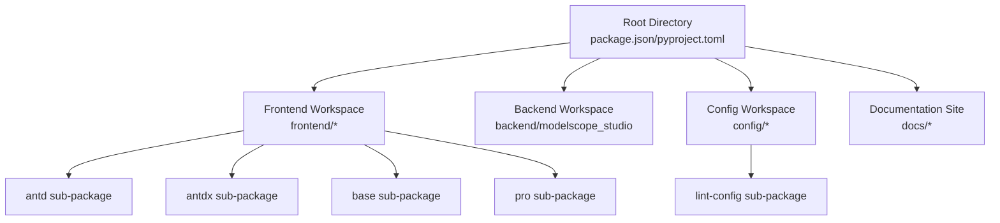
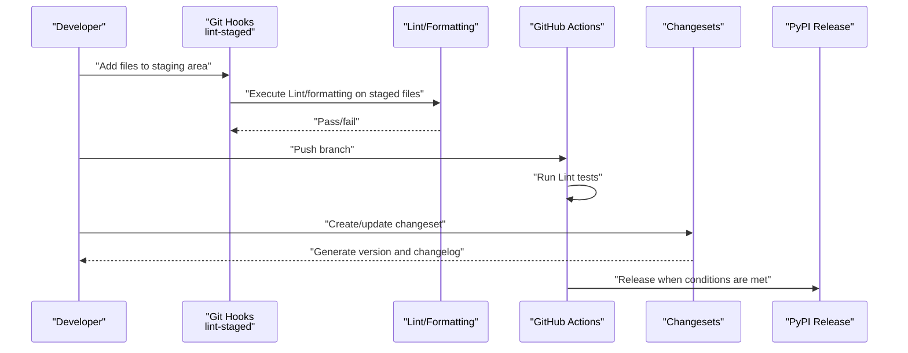
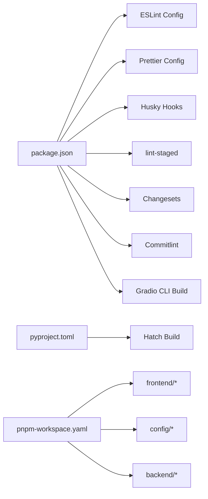

# Contributing Guide

<cite>
**Files referenced in this document**
- [README.md](file://README.md)
- [package.json](file://package.json)
- [pyproject.toml](file://pyproject.toml)
- [pnpm-workspace.yaml](file://pnpm-workspace.yaml)
- [.commitlintrc.js](file://.commitlintrc.js)
- [.lintstagedrc](file://.lintstagedrc)
- [.editorconfig](file://.editorconfig)
- [.flake8](file://.flake8)
- [.github/workflows/lint.yaml](file://.github/workflows/lint.yaml)
- [.github/workflows/publish.yaml](file://.github/workflows/publish.yaml)
- [eslint.config.mjs](file://eslint.config.mjs)
- [prettier.config.mjs](file://prettier.config.mjs)
- [config/lint-config/package.json](file://config/lint-config/package.json)
- [config/lint-config/eslint.mjs](file://config/lint-config/eslint.mjs)
- [config/lint-config/stylelint.js](file://config/lint-config/stylelint.js)
</cite>

## Table of Contents

1. [Introduction](#introduction)
2. [Project Structure](#project-structure)
3. [Core Components](#core-components)
4. [Architecture Overview](#architecture-overview)
5. [Detailed Component Analysis](#detailed-component-analysis)
6. [Dependency Analysis](#dependency-analysis)
7. [Performance Considerations](#performance-considerations)
8. [Troubleshooting Guide](#troubleshooting-guide)
9. [Conclusion](#conclusion)
10. [Appendix](#appendix)

## Introduction

This guide is intended for contributors who wish to participate in the development and maintenance of ModelScope Studio. It covers the complete lifecycle from environment setup, code standards, commit conventions, Pull Request processes, bug reporting and feature suggestions, to governance and decision-making processes. The project uses multi-package workspaces (pnpm workspaces) to organize frontend components and backend Python packages, managing versions and changesets with Changesets, and automating Lint and releases with GitHub Actions.

## Project Structure

- The root directory contains the frontend component library, Python backend package, documentation site, scripts and configuration files.
- The frontend is based on Svelte 5, organized by Ant Design, Ant Design X, and Base component sub-packages; Pro-specific components also exist.
- The backend is a Python package using the Hatch build system, exporting numerous template resources for frontend runtime use.
- The workspace is uniformly managed through `pnpm-workspace.yaml`, including root, configuration, and various frontend sub-packages.

**Diagram Sources**

- [pnpm-workspace.yaml:1-12](file://pnpm-workspace.yaml#L1-L12)
- [package.json:1-55](file://package.json#L1-L55)
- [pyproject.toml:1-257](file://pyproject.toml#L1-L257)

**Section Sources**

- [pnpm-workspace.yaml:1-12](file://pnpm-workspace.yaml#L1-L12)
- [package.json:1-55](file://package.json#L1-L55)
- [pyproject.toml:1-257](file://pyproject.toml#L1-L257)

## Core Components

- Multi-package workspace and build: Frontend uses Gradio CLI for builds; root scripts manage builds, formatting, type checking, style checking, and linting uniformly.
- Versioning and releases: Changesets handles version number advancement and changelog generation; GitHub Actions triggers the release process on main branch pushes.
- Commit conventions: Commitlint uses Conventional Commits types with constrained type enumeration and relaxed case/length restrictions.
- Local hooks: Husky as a Git hook tool, combined with lint-staged for quick Lint and formatting of staged files.
- Editor consistency: EditorConfig unifies indentation, line endings, and character sets; Prettier and ESLint/Stylelint handle formatting and rule validation respectively.

**Section Sources**

- [package.json:8-25](file://package.json#L8-L25)
- [.commitlintrc.js:1-30](file://.commitlintrc.js#L1-L30)
- [.lintstagedrc:1-7](file://.lintstagedrc#L1-L7)
- [.editorconfig:1-17](file://.editorconfig#L1-L17)
- [eslint.config.mjs:1-9](file://eslint.config.mjs#L1-L9)
- [prettier.config.mjs:1-26](file://prettier.config.mjs#L1-L26)

## Architecture Overview

The diagram below shows the key nodes of the contribution workflow: local development, commit conventions, CI Lint, versioning and release.

**Diagram Sources**

- [.lintstagedrc:1-7](file://.lintstagedrc#L1-L7)
- [.github/workflows/lint.yaml:1-34](file://.github/workflows/lint.yaml#L1-L34)
- [.github/workflows/publish.yaml:1-74](file://.github/workflows/publish.yaml#L1-L74)
- [package.json:10-25](file://package.json#L10-L25)

## Detailed Component Analysis

### Code Standards and Toolchain

- ESLint configuration: Root configuration aggregates base rules from lint-config, ensuring consistent JS/TS/Svelte rules across the frontend.
- Prettier configuration: Unifies indentation, quotes, trailing commas, line endings, etc.; specifies parser for Svelte files.
- Stylelint configuration: Base rules provided by lint-config, supporting LESS/CSS checking and fixing.
- EditorConfig: Unifies basic editor styles to avoid format drift caused by tool differences.
- Flake8: Python Lint rules and ignores, limiting max line length and ignoring specific rules.

**Section Sources**

- [eslint.config.mjs:1-9](file://eslint.config.mjs#L1-L9)
- [prettier.config.mjs:1-26](file://prettier.config.mjs#L1-L26)
- [config/lint-config/eslint.mjs](file://config/lint-config/eslint.mjs)
- [config/lint-config/stylelint.js](file://config/lint-config/stylelint.js)
- [.editorconfig:1-17](file://.editorconfig#L1-L17)
- [.flake8:1-16](file://.flake8#L1-L16)

### Commit Conventions and Commitlint

- Type enumeration: feat, fix, docs, style, refactor, perf, test, build, ci, chore, revert.
- Relaxed policy: Case, empty scope, periods, and length restrictions are disabled or relaxed to lower commit barriers.
- Compatible with Conventional Commits: Facilitates downstream Changesets and automated release recognition.

**Section Sources**

- [.commitlintrc.js:1-30](file://.commitlintrc.js#L1-L30)

### Local Hooks and lint-staged

- Execute Lint and formatting grouped by file type: LESS/CSS, JS/TS/Svelte, Markdown/YAML/JSON/HTML, Python.
- Ensures minimum quality gate before each commit, reducing CI pressure.

**Section Sources**

- [.lintstagedrc:1-7](file://.lintstagedrc#L1-L7)

### CI Workflow and Release

- Lint testing: Installs Python dependencies (flake8/isort/yapf), Node dependencies (pnpm), runs `pnpm run lint`.
- Release process: On `main` or `next` branch push, installs build and release dependencies, executes version updates and release scripts, then creates tags and Releases after success.

**Section Sources**

- [.github/workflows/lint.yaml:1-34](file://.github/workflows/lint.yaml#L1-L34)
- [.github/workflows/publish.yaml:1-74](file://.github/workflows/publish.yaml#L1-L74)

### Changesets and Version Management

- Changesets handles version number advancement and changelog generation; root scripts provide commands like `version`, `fix-changelog`, etc.
- Before release, you can first build the changelog sub-package, then execute version updates and fix scripts.

**Section Sources**

- [package.json:10-25](file://package.json#L10-L25)

### Getting Started for New Contributors

- Clone repository and install dependencies: use pip for editable mode backend installation, pnpm for frontend installation and build.
- Start documentation site examples: use `gradio cc dev` to run `docs/app.py`.
- After modifying code, ensure local Lint and formatting pass; pre-commit is automatically handled by lint-staged.

**Section Sources**

- [README.md:80-101](file://README.md#L80-L101)
- [package.json:8-25](file://package.json#L8-L25)

### Pull Request Process

- Complete modifications and local verification (Lint/formatting/type checking/style checking) locally.
- Ensure lint-staged passes before committing; commit messages follow Conventional Commits types.
- Create PR and wait for CI Lint and necessary tests to pass; iterate modifications based on feedback.
- Maintainer reviews and merges, then the release process automatically handles versioning and release.

**Section Sources**

- [.lintstagedrc:1-7](file://.lintstagedrc#L1-L7)
- [.commitlintrc.js:1-30](file://.commitlintrc.js#L1-L30)
- [.github/workflows/lint.yaml:1-34](file://.github/workflows/lint.yaml#L1-L34)

### Bug Reports and Feature Requests

- Before submitting an Issue, please confirm you have read the relevant documentation and FAQ.
- Provide clear reproduction steps, expected behavior, actual behavior, and environment information (Python/Node/browser versions).
- If involving frontend components, you can attach a minimal reproducible example or screenshot.

**Section Sources**

- [README.md:17-101](file://README.md#L17-L101)

### Discussion and Collaboration

- Prefer public discussions in Issues for traceability and archiving.
- For design or architecture level discussions, initiate topic posts in Discussion or Issues.

**Section Sources**

- [README.md:17-101](file://README.md#L17-L101)

### Governance Structure and Decision-Making Process

- Project maintainers are responsible for reviewing PRs, reviewing code quality and design rationality.
- Release permissions are controlled by maintainers, following Changesets and CI release processes.
- Community contributors participate in improvements through PRs; major changes are recommended to be discussed in Issues for consensus.

**Section Sources**

- [.github/workflows/publish.yaml:1-74](file://.github/workflows/publish.yaml#L1-L74)
- [package.json:10-25](file://package.json#L10-L25)

## Dependency Analysis

- Toolchain dependencies: ESLint, Prettier, Stylelint, Husky, lint-staged, Changesets, Commitlint, etc.
- Frontend build: Gradio CLI, Svelte 5, TypeScript, Svelte check tool.
- Backend build: Hatch, Python dependency declarations and packaging configuration.
- Workspace: `pnpm-workspace.yaml` manages multiple packages uniformly, with only build dependencies explicitly listed.

**Diagram Sources**

- [package.json:1-55](file://package.json#L1-L55)
- [pyproject.toml:1-257](file://pyproject.toml#L1-L257)
- [pnpm-workspace.yaml:1-12](file://pnpm-workspace.yaml#L1-L12)

**Section Sources**

- [package.json:1-55](file://package.json#L1-L55)
- [pyproject.toml:1-257](file://pyproject.toml#L1-L257)
- [pnpm-workspace.yaml:1-12](file://pnpm-workspace.yaml#L1-L12)

## Performance Considerations

- Local Lint and formatting: lint-staged only executes on staged files, shortening feedback cycles.
- CI parallel tasks: Lint tasks split JS/Python/Style/TS checks for parallel execution, improving overall efficiency.
- Type checking and style checking: Executed centrally in CI to avoid repeated local burden.

**Section Sources**

- [.lintstagedrc:1-7](file://.lintstagedrc#L1-L7)
- [.github/workflows/lint.yaml:1-34](file://.github/workflows/lint.yaml#L1-L34)

## Troubleshooting Guide

- Commit rejected (Commitlint failure)
  - Check whether commit message matches type enumeration; if temporarily relaxing is needed, adjust rules locally or use `--no-verify` to skip.
  - Reference path: [.commitlintrc.js:1-30](file://.commitlintrc.js#L1-L30)
- Lint failure
  - Run corresponding Lint commands by file type: `pnpm run lint:js`, `pnpm run lint:py`, `pnpm run lint:style`, `pnpm run lint:ts`.
  - Reference path: [package.json:18-22](file://package.json#L18-L22)
- Formatting not taking effect
  - Confirm Prettier plugins and Svelte parser configuration are correct; check whether `.editorconfig` is recognized by the editor.
  - Reference path: [prettier.config.mjs:1-26](file://prettier.config.mjs#L1-L26), [.editorconfig:1-17](file://.editorconfig#L1-L17)
- CI Lint failure
  - Check Python dependency installation and Node version; confirm pnpm installation and cache clearing.
  - Reference path: [.github/workflows/lint.yaml:14-34](file://.github/workflows/lint.yaml#L14-L34)
- Release failure
  - Confirm PyPI Token is valid; check version update and tag creation script output.
  - Reference path: [.github/workflows/publish.yaml:59-74](file://.github/workflows/publish.yaml#L59-L74)

**Section Sources**

- [.commitlintrc.js:1-30](file://.commitlintrc.js#L1-L30)
- [package.json:18-22](file://package.json#L18-L22)
- [prettier.config.mjs:1-26](file://prettier.config.mjs#L1-L26)
- [.editorconfig:1-17](file://.editorconfig#L1-L17)
- [.github/workflows/lint.yaml:14-34](file://.github/workflows/lint.yaml#L14-L34)
- [.github/workflows/publish.yaml:59-74](file://.github/workflows/publish.yaml#L59-L74)

## Conclusion

Based on the project's existing configurations and workflows, this contributing guide provides a complete practical path from environment preparation, code and commit conventions, PR process to release and troubleshooting. New contributors are advised to prioritize completing local Lint and formatting validation on their first participation, and follow the Conventional Commits message conventions to ensure a smooth collaboration experience.

## Appendix

- Quick Command Reference
  - Installation and build: See [README.md:80-101](file://README.md#L80-L101)
  - Lint and formatting: See [package.json:18-22](file://package.json#L18-L22)
  - Changesets: See [package.json:10-25](file://package.json#L10-L25)
- Configuration File Index
  - ESLint: See [eslint.config.mjs:1-9](file://eslint.config.mjs#L1-L9)
  - Prettier: See [prettier.config.mjs:1-26](file://prettier.config.mjs#L1-L26)
  - Stylelint: See [config/lint-config/stylelint.js](file://config/lint-config/stylelint.js)
  - Commitlint: See [.commitlintrc.js:1-30](file://.commitlintrc.js#L1-L30)
  - EditorConfig: See [.editorconfig:1-17](file://.editorconfig#L1-L17)
  - Flake8: See [.flake8:1-16](file://.flake8#L1-L16)
  - Workspace: See [pnpm-workspace.yaml:1-12](file://pnpm-workspace.yaml#L1-L12)
